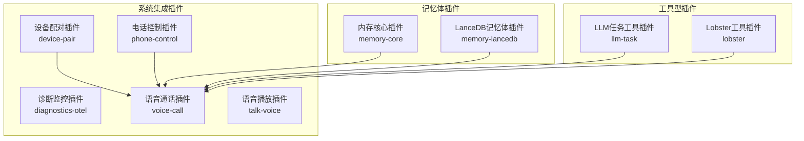
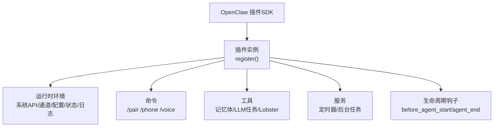
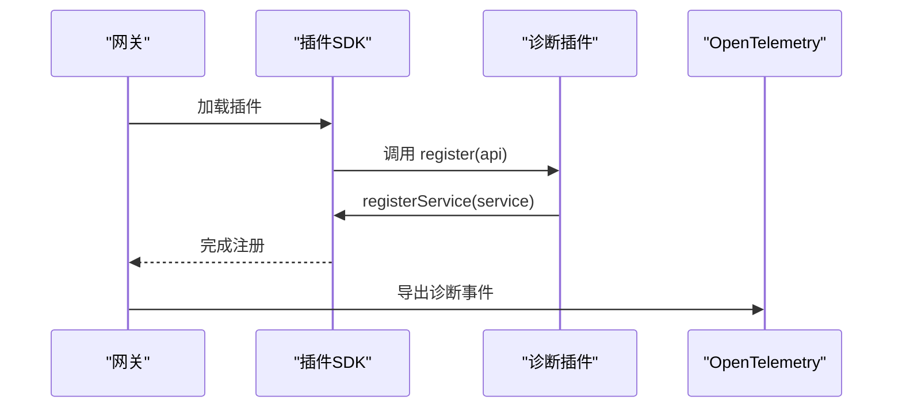
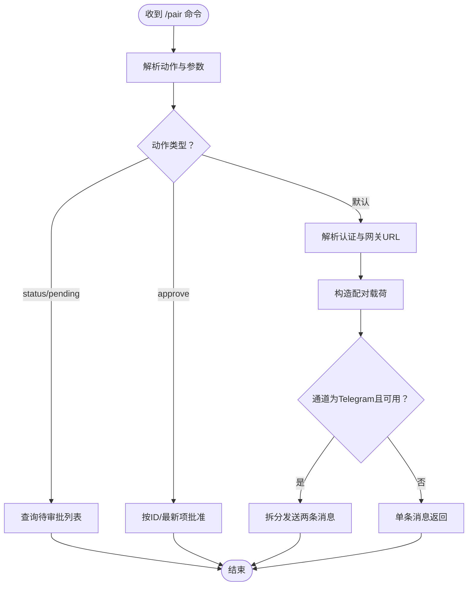
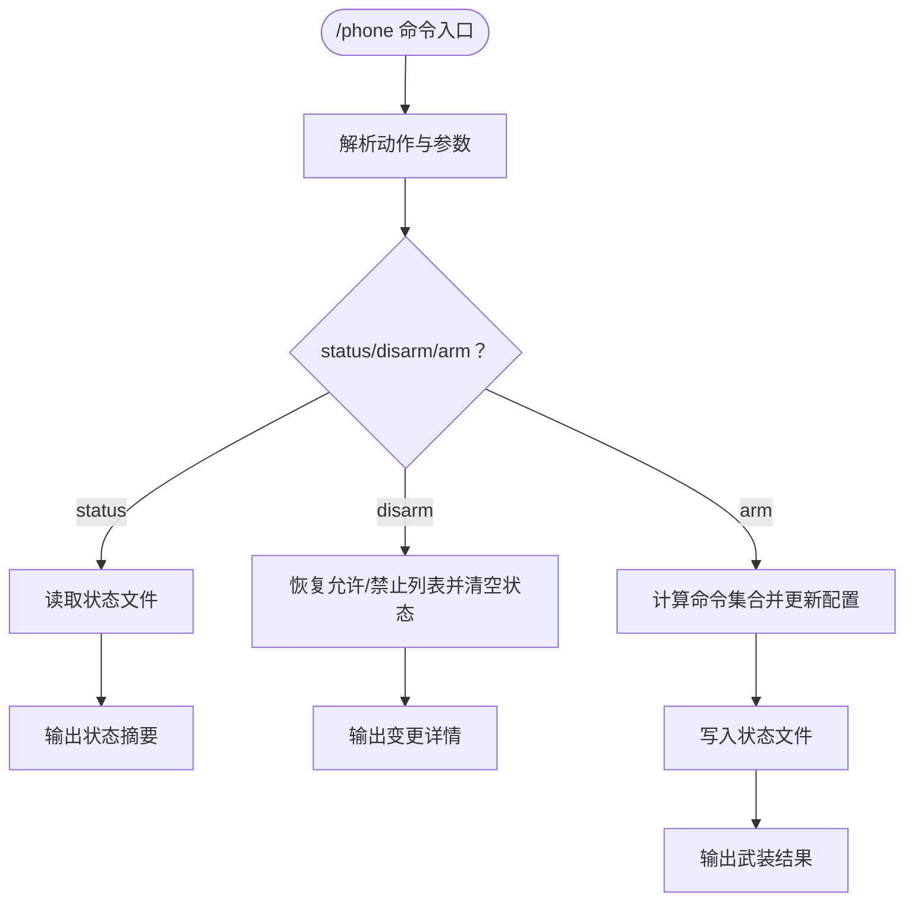
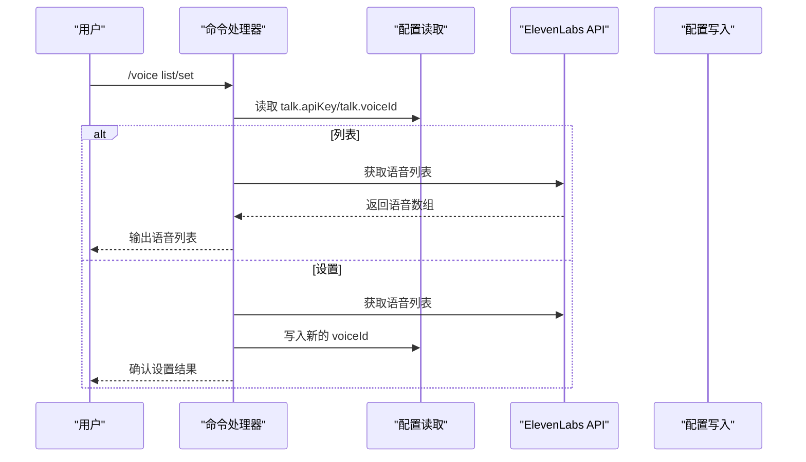
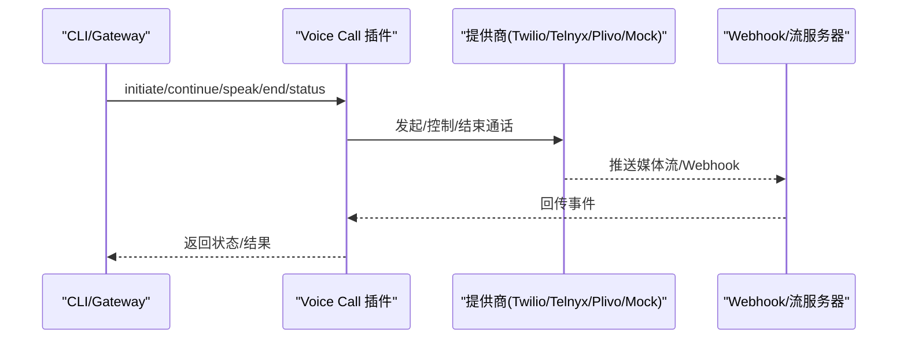
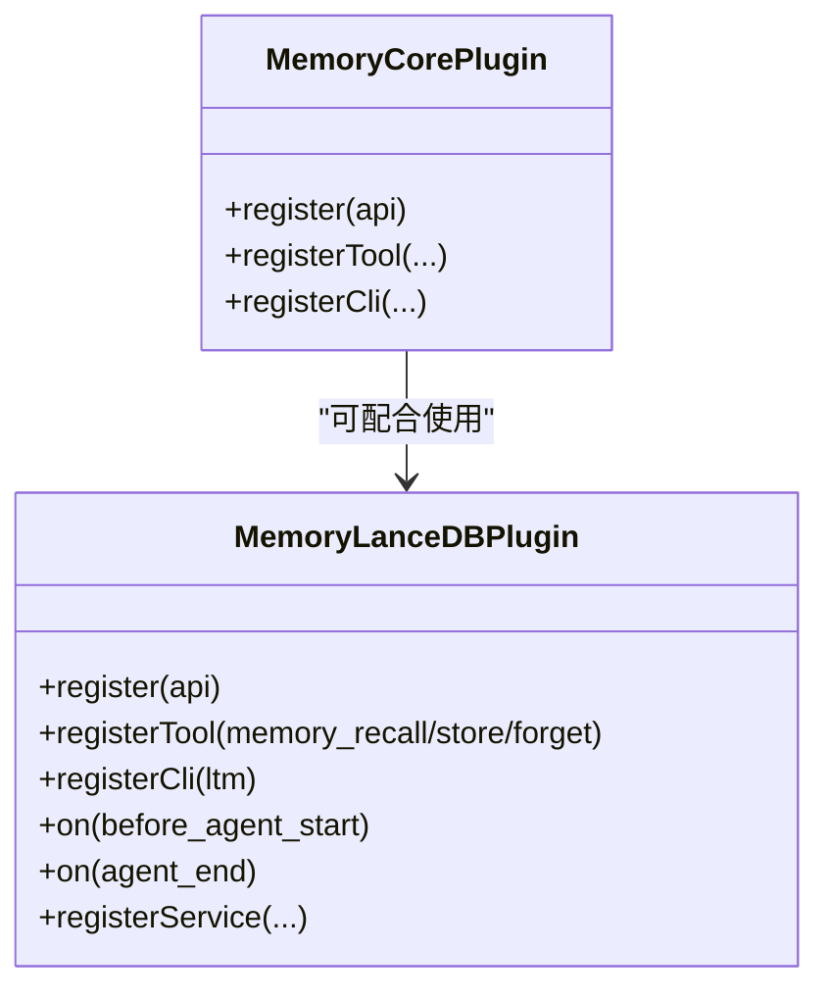
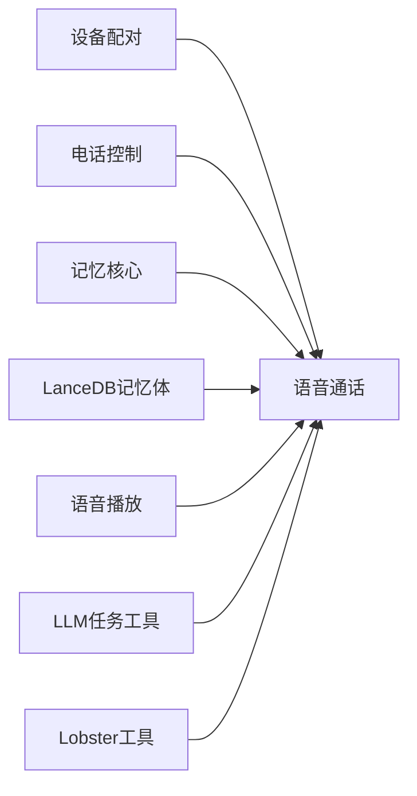

# 系统集成插件示例

<cite>
**本文引用的文件**
- [extensions/diagnostics-otel/index.ts](file://extensions/diagnostics-otel/index.ts)
- [extensions/device-pair/index.ts](file://extensions/device-pair/index.ts)
- [extensions/phone-control/index.ts](file://extensions/phone-control/index.ts)
- [extensions/talk-voice/index.ts](file://extensions/talk-voice/index.ts)
- [extensions/memory-core/index.ts](file://extensions/memory-core/index.ts)
- [extensions/memory-lancedb/index.ts](file://extensions/memory-lancedb/index.ts)
- [extensions/voice-call/README.md](file://extensions/voice-call/README.md)
- [extensions/voice-call/package.json](file://extensions/voice-call/package.json)
- [extensions/llm-task/index.ts](file://extensions/llm-task/index.ts)
- [extensions/lobster/index.ts](file://extensions/lobster/index.ts)
</cite>

## 目录

1. [简介](#简介)
2. [项目结构](#项目结构)
3. [核心组件](#核心组件)
4. [架构总览](#架构总览)
5. [详细组件分析](#详细组件分析)
6. [依赖关系分析](#依赖关系分析)
7. [性能考量](#性能考量)
8. [故障排查指南](#故障排查指南)
9. [结论](#结论)
10. [附录](#附录)

## 简介

本指南面向希望在OpenClaw系统中开发“系统集成插件”的开发者，提供从零到一的完整实践路径。文档聚焦以下四类系统级插件的实现范式与最佳实践：

- 诊断监控插件：将系统事件导出至OpenTelemetry，便于集中观测与告警。
- 设备配对插件：生成配对码、审批请求、自动解析网关URL与认证方式，简化移动设备接入。
- 电话控制插件：以“武装/解除”机制临时放行高风险节点命令（如相机、屏幕录制、通讯录写入），并支持定时过期。
- 语音通话插件：通过Twilio/Telnyx/Plivo/Mock等提供商实现外呼、媒体流、TTS与CLI/Gateway RPC集成。

同时，文档解析系统集成插件的设计模式，涵盖系统API调用、进程管理、设备交互与状态同步等关键环节，并给出权限管理、错误处理、性能优化与兼容性建议，帮助安全高效地与操作系统和硬件设备交互。

## 项目结构

OpenClaw采用多扩展目录组织插件，每个插件通常包含一个入口文件与可选的配置定义、工具或服务实现。下图展示了与系统集成相关的关键插件及其职责：

**图表来源**

- [extensions/diagnostics-otel/index.ts](file://extensions/diagnostics-otel/index.ts#L1-L16)
- [extensions/device-pair/index.ts](file://extensions/device-pair/index.ts#L1-L500)
- [extensions/phone-control/index.ts](file://extensions/phone-control/index.ts#L1-L422)
- [extensions/talk-voice/index.ts](file://extensions/talk-voice/index.ts#L1-L151)
- [extensions/memory-core/index.ts](file://extensions/memory-core/index.ts#L1-L39)
- [extensions/memory-lancedb/index.ts](file://extensions/memory-lancedb/index.ts#L1-L627)
- [extensions/llm-task/index.ts](file://extensions/llm-task/index.ts#L1-L7)
- [extensions/lobster/index.ts](file://extensions/lobster/index.ts#L1-L19)

**章节来源**

- [extensions/diagnostics-otel/index.ts](file://extensions/diagnostics-otel/index.ts#L1-L16)
- [extensions/device-pair/index.ts](file://extensions/device-pair/index.ts#L1-L500)
- [extensions/phone-control/index.ts](file://extensions/phone-control/index.ts#L1-L422)
- [extensions/talk-voice/index.ts](file://extensions/talk-voice/index.ts#L1-L151)
- [extensions/memory-core/index.ts](file://extensions/memory-core/index.ts#L1-L39)
- [extensions/memory-lancedb/index.ts](file://extensions/memory-lancedb/index.ts#L1-L627)
- [extensions/llm-task/index.ts](file://extensions/llm-task/index.ts#L1-L7)
- [extensions/lobster/index.ts](file://extensions/lobster/index.ts#L1-L19)

## 核心组件

本节概述四类系统集成插件的核心职责与典型能力：

- 诊断监控插件：注册服务，将诊断事件导出至OpenTelemetry，便于统一采集与可视化。
- 设备配对插件：提供命令接口生成配对码、列出待审批请求、批准配对；自动解析网关URL与认证参数，适配本地LAN、Tailnet与远程地址。
- 电话控制插件：以“武装/解除”模式临时调整命令白名单/黑名单，持久化状态文件，定时器服务负责到期自动解除。
- 语音通话插件：支持多提供商（Twilio/Telnyx/Plivo/Mock），提供CLI与Gateway RPC，结合TTS与媒体流实现高质量通话体验。

**章节来源**

- [extensions/diagnostics-otel/index.ts](file://extensions/diagnostics-otel/index.ts#L1-L16)
- [extensions/device-pair/index.ts](file://extensions/device-pair/index.ts#L379-L500)
- [extensions/phone-control/index.ts](file://extensions/phone-control/index.ts#L286-L422)
- [extensions/voice-call/README.md](file://extensions/voice-call/README.md#L1-L140)

## 架构总览

下图展示了系统集成插件与OpenClaw运行时的关系：插件通过OpenClaw插件SDK注册命令、工具、服务与生命周期钩子，运行时提供系统调用、通道通信、配置读写、状态存储与日志记录等能力。

**图表来源**

- [extensions/device-pair/index.ts](file://extensions/device-pair/index.ts#L379-L500)
- [extensions/phone-control/index.ts](file://extensions/phone-control/index.ts#L286-L422)
- [extensions/memory-lancedb/index.ts](file://extensions/memory-lancedb/index.ts#L494-L606)

**章节来源**

- [extensions/device-pair/index.ts](file://extensions/device-pair/index.ts#L379-L500)
- [extensions/phone-control/index.ts](file://extensions/phone-control/index.ts#L286-L422)
- [extensions/memory-lancedb/index.ts](file://extensions/memory-lancedb/index.ts#L494-L606)

## 详细组件分析

### 诊断监控插件（Diagnostics OpenTelemetry）

- 注册方式：通过SDK提供的空配置模式注册服务，将诊断事件导出至OpenTelemetry。
- 关键点：最小化配置、稳定的服务生命周期、与运行时日志联动。

**图表来源**

- [extensions/diagnostics-otel/index.ts](file://extensions/diagnostics-otel/index.ts#L1-L16)

**章节来源**

- [extensions/diagnostics-otel/index.ts](file://extensions/diagnostics-otel/index.ts#L1-L16)

### 设备配对插件（Device Pair）

- 命令：/pair 支持生成配对码、查看待审批列表、按ID或最新项批准。
- URL解析：优先使用插件配置publicUrl，其次Tailnet Serve/Funnel，再回退到远端URL或本地绑定地址。
- 认证解析：支持Token或密码两种模式，优先环境变量，其次配置文件。
- Telegram特例：若可用则拆分为两条消息发送，提升用户体验。
- 运行时交互：通过api.runtime.system与api.runtime.channel调用系统命令与通道API。

**图表来源**

- [extensions/device-pair/index.ts](file://extensions/device-pair/index.ts#L379-L500)

**章节来源**

- [extensions/device-pair/index.ts](file://extensions/device-pair/index.ts#L1-L500)

### 电话控制插件（Phone Control）

- 模式：以“武装/解除”临时调整命令白名单/黑名单，支持按组（相机/屏幕/写入/全部）与持续时间。
- 状态持久化：使用状态文件记录武装时间、过期时间、涉及命令与变更清单。
- 定时器服务：定期检查过期并自动解除，保证安全边界不长期开放。
- 配置变更：通过运行时配置加载与写入接口更新允许/禁止命令列表。

**图表来源**

- [extensions/phone-control/index.ts](file://extensions/phone-control/index.ts#L286-L422)

**章节来源**

- [extensions/phone-control/index.ts](file://extensions/phone-control/index.ts#L1-L422)

### 语音播放插件（Talk Voice）

- 功能：列出并设置ElevenLabs语音ID，影响iOS“Talk”播放效果。
- 实现：通过运行时配置读取API Key与当前语音ID，调用远端API获取语音列表，支持模糊匹配与设置。

**图表来源**

- [extensions/talk-voice/index.ts](file://extensions/talk-voice/index.ts#L76-L151)

**章节来源**

- [extensions/talk-voice/index.ts](file://extensions/talk-voice/index.ts#L1-L151)

### 语音通话插件（Voice Call）

- 提供商：Twilio、Telnyx、Plivo、Mock；支持Webhook签名验证与媒体流。
- 配置：fromNumber、toNumber、提供商凭据、公网暴露方式（publicUrl/tunnel/tailscale）、外呼默认模式、流式音频路径等。
- CLI与RPC：提供外呼、继续、播报、结束、状态查询、日志追踪等命令与RPC接口。
- 兼容性：媒体流需要ws与OpenAI实时API密钥；Edge TTS不适用于通话音频。

**图表来源**

- [extensions/voice-call/README.md](file://extensions/voice-call/README.md#L1-L140)
- [extensions/voice-call/package.json](file://extensions/voice-call/package.json#L1-L20)

**章节来源**

- [extensions/voice-call/README.md](file://extensions/voice-call/README.md#L1-L140)
- [extensions/voice-call/package.json](file://extensions/voice-call/package.json#L1-L20)

### 记忆体插件（Memory Core & LanceDB）

- Memory Core：注册基于文件的记忆搜索与获取工具，以及CLI命令。
- Memory LanceDB：提供向量检索、自动回忆与自动捕获（基于规则与相似度阈值），支持分类与重要性评分，具备生命周期钩子注入上下文。

**图表来源**

- [extensions/memory-core/index.ts](file://extensions/memory-core/index.ts#L1-L39)
- [extensions/memory-lancedb/index.ts](file://extensions/memory-lancedb/index.ts#L242-L627)

**章节来源**

- [extensions/memory-core/index.ts](file://extensions/memory-core/index.ts#L1-L39)
- [extensions/memory-lancedb/index.ts](file://extensions/memory-lancedb/index.ts#L1-L627)

### 工具型插件（LLM Task 与 Lobster）

- LLM Task：注册LLM驱动的任务工具，作为插件工具工厂条件注册。
- Lobster：仅在非沙箱环境下注册，提供特定工具能力。

**章节来源**

- [extensions/llm-task/index.ts](file://extensions/llm-task/index.ts#L1-L7)
- [extensions/lobster/index.ts](file://extensions/lobster/index.ts#L1-L19)

## 依赖关系分析

- 插件间耦合：设备配对与电话控制常用于语音通话场景的前置准备；记忆体插件为语音通话提供上下文增强与知识沉淀。
- 外部依赖：语音通话插件依赖Twilio/Telnyx/Plivo/Mock提供商API与网络可达性；语音播放插件依赖ElevenLabs API；记忆体插件依赖LanceDB与OpenAI嵌入模型。
- 运行时依赖：所有插件均通过OpenClaw插件SDK访问系统API、通道、配置与状态。

**图表来源**

- [extensions/device-pair/index.ts](file://extensions/device-pair/index.ts#L379-L500)
- [extensions/phone-control/index.ts](file://extensions/phone-control/index.ts#L286-L422)
- [extensions/talk-voice/index.ts](file://extensions/talk-voice/index.ts#L76-L151)
- [extensions/memory-core/index.ts](file://extensions/memory-core/index.ts#L1-L39)
- [extensions/memory-lancedb/index.ts](file://extensions/memory-lancedb/index.ts#L494-L606)
- [extensions/llm-task/index.ts](file://extensions/llm-task/index.ts#L1-L7)
- [extensions/lobster/index.ts](file://extensions/lobster/index.ts#L1-L19)

**章节来源**

- [extensions/device-pair/index.ts](file://extensions/device-pair/index.ts#L379-L500)
- [extensions/phone-control/index.ts](file://extensions/phone-control/index.ts#L286-L422)
- [extensions/talk-voice/index.ts](file://extensions/talk-voice/index.ts#L76-L151)
- [extensions/memory-core/index.ts](file://extensions/memory-core/index.ts#L1-L39)
- [extensions/memory-lancedb/index.ts](file://extensions/memory-lancedb/index.ts#L494-L606)
- [extensions/llm-task/index.ts](file://extensions/llm-task/index.ts#L1-L7)
- [extensions/lobster/index.ts](file://extensions/lobster/index.ts#L1-L19)

## 性能考量

- I/O与序列化：记忆体插件在工具执行与CLI输出中避免传递大型向量数据，采用剥离策略减少序列化开销。
- 启动延迟：LanceDB插件采用惰性初始化，首次使用时建立连接与表，降低启动时延。
- 定时任务：电话控制插件使用低频轮询（每15秒）检查过期，避免频繁I/O。
- 网络调用：语音通话插件在媒体流开启时复用核心TTS，减少重复网络往返。
- 平台兼容：LanceDB在部分平台可能缺少原生绑定，需在加载失败时提供明确错误提示。

[本节为通用指导，无需具体文件来源]

## 故障排查指南

- 设备配对失败
  - 检查网关绑定与公网暴露：确认gateway.bind、publicUrl、tailscale配置是否正确。
  - 认证参数：核对环境变量与配置中的token/password是否一致。
  - Telegram通道：若拆分发送失败，插件会回退为单条消息，检查通道API可用性与权限。
- 电话控制异常
  - 状态文件损坏：定时器服务已做容错，但建议手动检查状态文件格式与字段。
  - 配置未生效：确认配置写入成功且重启后加载正确。
- 语音通话问题
  - Webhook签名验证：确保提供商签名验证通过，必要时启用允许本地代理绕过的选项（仅限开发）。
  - 媒体流：确认ws与OpenAI实时API密钥有效，且公网可达。
- 记忆体插件
  - LanceDB加载失败：根据错误信息安装对应平台原生绑定或更换数据库路径。
  - 自动回忆/捕获失败：检查嵌入模型可用性与网络连通性，关注日志警告。

**章节来源**

- [extensions/device-pair/index.ts](file://extensions/device-pair/index.ts#L255-L315)
- [extensions/phone-control/index.ts](file://extensions/phone-control/index.ts#L286-L422)
- [extensions/voice-call/README.md](file://extensions/voice-call/README.md#L75-L140)
- [extensions/memory-lancedb/index.ts](file://extensions/memory-lancedb/index.ts#L25-L36)

## 结论

通过以上四类系统集成插件的实现范式，OpenClaw为设备接入、安全控制、语音通话与知识记忆提供了可扩展、可观测、可维护的插件体系。开发者可遵循本文档的设计模式与最佳实践，在保证安全与性能的前提下，快速构建满足业务需求的系统集成插件。

[本节为总结性内容，无需具体文件来源]

## 附录

- 从零开始的插件开发步骤
  - 明确目标：确定插件职责（诊断、配对、控制、通话、记忆等）。
  - 选择注册点：命令、工具、服务或生命周期钩子。
  - 使用SDK：通过registerCommand/registerTool/registerService/on等API完成注册。
  - 与运行时交互：利用api.runtime.system/system.runCommandWithTimeout、api.runtime.channel、api.runtime.config、api.runtime.tools、api.runtime.state等能力。
  - 权限与安全：最小权限原则，严格校验输入，避免敏感信息泄露。
  - 错误处理：统一错误日志与降级策略，必要时提供回退方案。
  - 性能优化：惰性初始化、低频轮询、避免大对象序列化、缓存热点数据。
  - 兼容性：针对不同平台与提供商差异，提供配置开关与环境变量覆盖。
  - 文档与测试：完善README与单元/集成测试，确保可维护性。

[本节为通用指导，无需具体文件来源]
