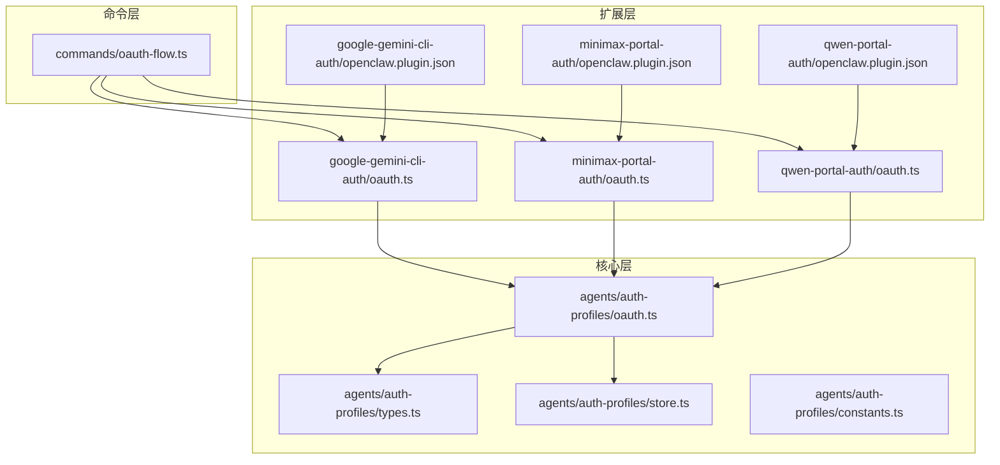
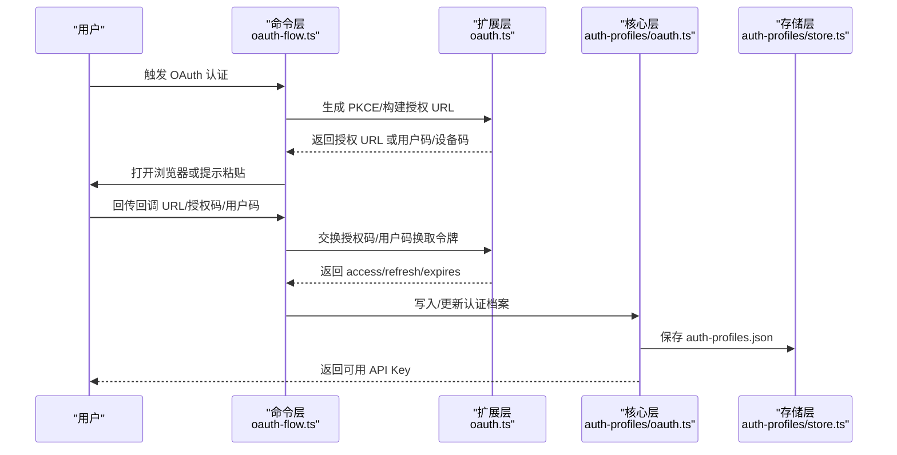
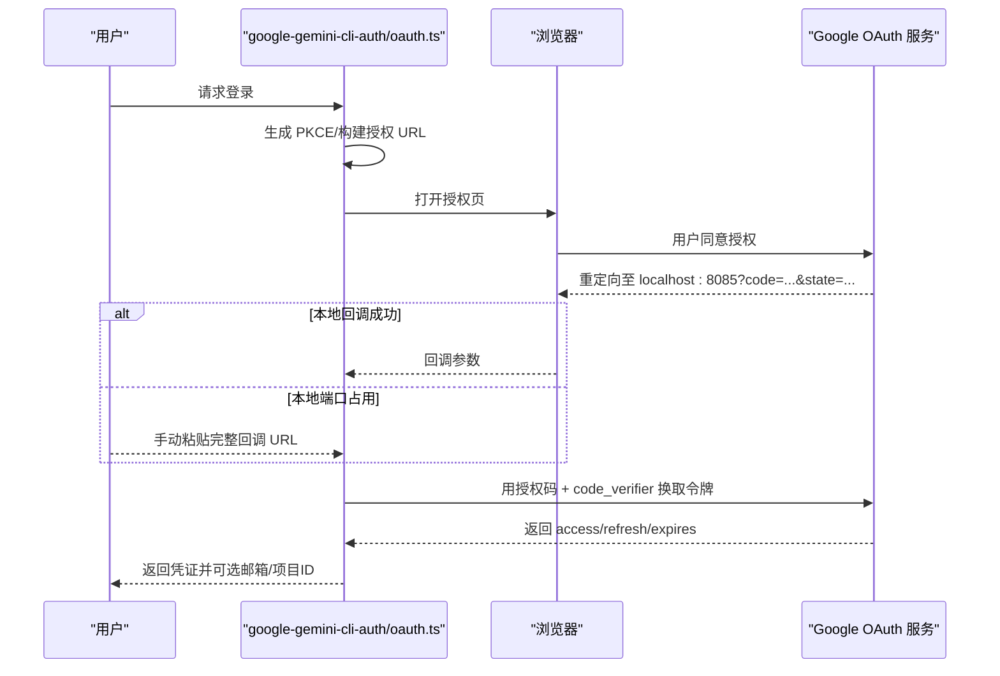
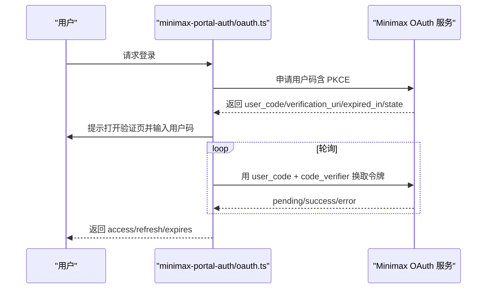
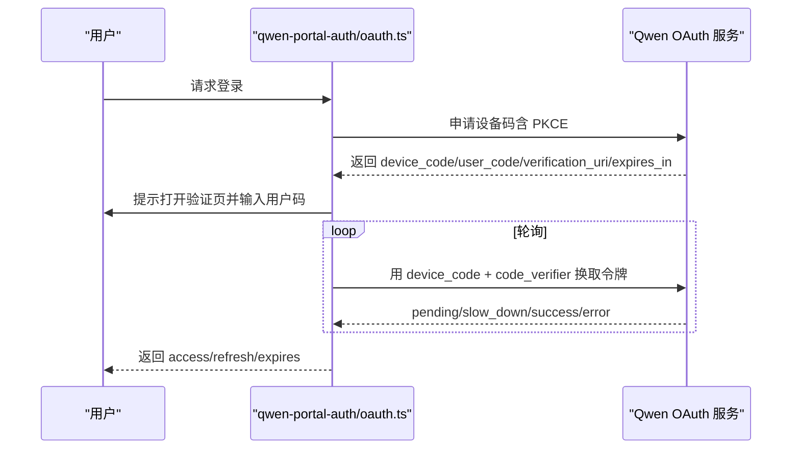
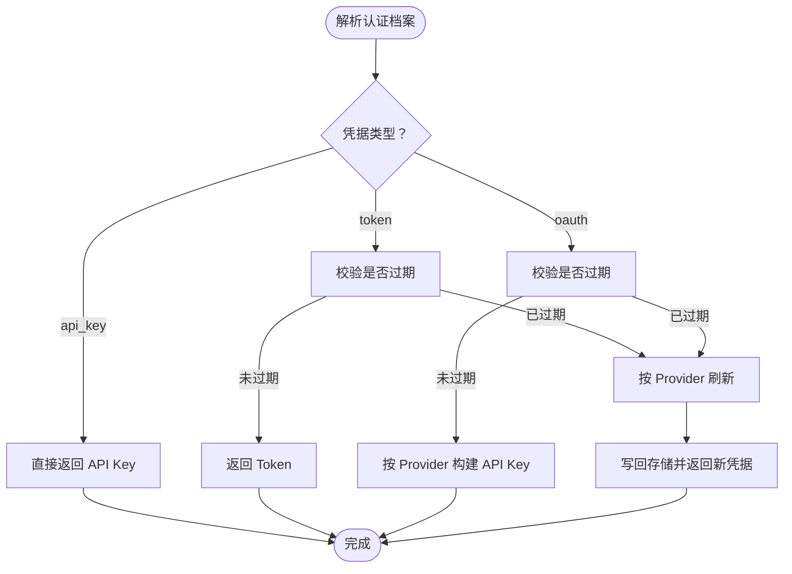
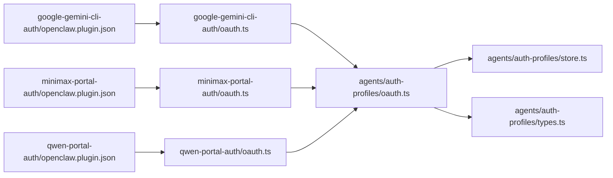

# 认证插件示例

<cite>
**本文引用的文件**
- [extensions/google-gemini-cli-auth/oauth.ts](file://extensions/google-gemini-cli-auth/oauth.ts)
- [extensions/google-gemini-cli-auth/oauth.test.ts](file://extensions/google-gemini-cli-auth/oauth.test.ts)
- [extensions/google-gemini-cli-auth/openclaw.plugin.json](file://extensions/google-gemini-cli-auth/openclaw.plugin.json)
- [extensions/minimax-portal-auth/oauth.ts](file://extensions/minimax-portal-auth/oauth.ts)
- [extensions/minimax-portal-auth/openclaw.plugin.json](file://extensions/minimax-portal-auth/openclaw.plugin.json)
- [extensions/qwen-portal-auth/oauth.ts](file://extensions/qwen-portal-auth/oauth.ts)
- [extensions/qwen-portal-auth/openclaw.plugin.json](file://extensions/qwen-portal-auth/openclaw.plugin.json)
- [src/agents/auth-profiles/oauth.ts](file://src/agents/auth-profiles/oauth.ts)
- [src/agents/auth-profiles/types.ts](file://src/agents/auth-profiles/types.ts)
- [src/agents/auth-profiles/store.ts](file://src/agents/auth-profiles/store.ts)
- [src/agents/auth-profiles/constants.ts](file://src/agents/auth-profiles/constants.ts)
- [src/commands/oauth-flow.ts](file://src/commands/oauth-flow.ts)
</cite>

## 目录

1. [简介](#简介)
2. [项目结构](#项目结构)
3. [核心组件](#核心组件)
4. [架构总览](#架构总览)
5. [组件详解](#组件详解)
6. [依赖关系分析](#依赖关系分析)
7. [性能与可靠性](#性能与可靠性)
8. [故障排查指南](#故障排查指南)
9. [结论](#结论)
10. [附录：测试与验证](#附录测试与验证)

## 简介

本文件面向希望在 OpenClaw 中开发“认证插件”的工程师与技术作者，系统性地给出基于现有扩展（Google、Minimax、Qwen）的认证插件实现范式与最佳实践。内容覆盖：

- OAuth 授权码流程与设备码流程的统一抽象
- 令牌获取、刷新、安全存储与错误处理
- 配置管理、跨平台与远程环境适配
- 用户体验优化（自动浏览器打开、手动粘贴回跳）
- 测试策略与常见问题定位

## 项目结构

围绕认证插件的关键目录与文件如下：

- 扩展层（extensions/\*-auth）：各平台 OAuth 实现与插件元数据
- 核心层（src/agents/auth-profiles）：认证档案解析、令牌刷新、持久化
- 命令层（src/commands/oauth-flow.ts）：向导式交互与本地回调处理
- 测试（extensions/\*-auth/oauth.test.ts）：单元测试与模拟

图表来源

- [extensions/google-gemini-cli-auth/oauth.ts](file://extensions/google-gemini-cli-auth/oauth.ts#L1-L640)
- [extensions/minimax-portal-auth/oauth.ts](file://extensions/minimax-portal-auth/oauth.ts#L1-L248)
- [extensions/qwen-portal-auth/oauth.ts](file://extensions/qwen-portal-auth/oauth.ts#L1-L191)
- [src/agents/auth-profiles/oauth.ts](file://src/agents/auth-profiles/oauth.ts#L1-L286)
- [src/agents/auth-profiles/store.ts](file://src/agents/auth-profiles/store.ts#L1-L379)
- [src/agents/auth-profiles/types.ts](file://src/agents/auth-profiles/types.ts#L1-L75)
- [src/commands/oauth-flow.ts](file://src/commands/oauth-flow.ts#L1-L55)

章节来源

- [extensions/google-gemini-cli-auth/oauth.ts](file://extensions/google-gemini-cli-auth/oauth.ts#L1-L640)
- [extensions/minimax-portal-auth/oauth.ts](file://extensions/minimax-portal-auth/oauth.ts#L1-L248)
- [extensions/qwen-portal-auth/oauth.ts](file://extensions/qwen-portal-auth/oauth.ts#L1-L191)
- [src/agents/auth-profiles/oauth.ts](file://src/agents/auth-profiles/oauth.ts#L1-L286)
- [src/agents/auth-profiles/store.ts](file://src/agents/auth-profiles/store.ts#L1-L379)
- [src/agents/auth-profiles/types.ts](file://src/agents/auth-profiles/types.ts#L1-L75)
- [src/commands/oauth-flow.ts](file://src/commands/oauth-flow.ts#L1-L55)

## 核心组件

- 平台 OAuth 实现（扩展层）
  - Google Gemini CLI：授权码 + PKCE，本地回调或手动粘贴
  - Minimax Portal：用户码授权 + PKCE，轮询换取令牌
  - Qwen Portal：设备码授权 + PKCE，轮询换取令牌
- 认证档案与令牌刷新（核心层）
  - 统一的 OAuth 凭据模型与多类型凭据（api_key/token/oauth）
  - 带锁的认证档案读写与合并（主代理与子代理继承）
  - 按 provider 分发刷新逻辑，统一构建 API Key
- 向导式 OAuth 流程（命令层）
  - 远程/VPS 环境提示与手动输入
  - 自动打开浏览器与本地回调捕获

章节来源

- [extensions/google-gemini-cli-auth/oauth.ts](file://extensions/google-gemini-cli-auth/oauth.ts#L1-L640)
- [extensions/minimax-portal-auth/oauth.ts](file://extensions/minimax-portal-auth/oauth.ts#L1-L248)
- [extensions/qwen-portal-auth/oauth.ts](file://extensions/qwen-portal-auth/oauth.ts#L1-L191)
- [src/agents/auth-profiles/types.ts](file://src/agents/auth-profiles/types.ts#L1-L75)
- [src/agents/auth-profiles/store.ts](file://src/agents/auth-profiles/store.ts#L1-L379)
- [src/agents/auth-profiles/oauth.ts](file://src/agents/auth-profiles/oauth.ts#L1-L286)
- [src/commands/oauth-flow.ts](file://src/commands/oauth-flow.ts#L1-L55)

## 架构总览

下图展示了从“用户触发认证”到“生成可用 API Key”的端到端流程，以及与认证档案存储的交互。

图表来源

- [src/commands/oauth-flow.ts](file://src/commands/oauth-flow.ts#L1-L55)
- [extensions/google-gemini-cli-auth/oauth.ts](file://extensions/google-gemini-cli-auth/oauth.ts#L564-L640)
- [extensions/minimax-portal-auth/oauth.ts](file://extensions/minimax-portal-auth/oauth.ts#L187-L248)
- [extensions/qwen-portal-auth/oauth.ts](file://extensions/qwen-portal-auth/oauth.ts#L140-L191)
- [src/agents/auth-profiles/oauth.ts](file://src/agents/auth-profiles/oauth.ts#L36-L106)
- [src/agents/auth-profiles/store.ts](file://src/agents/auth-profiles/store.ts#L368-L379)

## 组件详解

### Google Gemini CLI OAuth（授权码 + PKCE）

- 关键点
  - 支持从已安装的 Gemini CLI 提取客户端 ID/Secret，或通过环境变量覆盖
  - 本地回调（localhost:8085）或手动粘贴回跳 URL
  - 获取 access_token 后调用用户信息与项目发现接口，必要时自动 onboard
- 安全与容错
  - 使用 PKCE（S256），state 校验，超时控制
  - VPC/SC 风控场景下的降级处理
- 用户体验
  - 远程/VPS 环境提示手动模式；本地环境优先自动打开浏览器

图表来源

- [extensions/google-gemini-cli-auth/oauth.ts](file://extensions/google-gemini-cli-auth/oauth.ts#L181-L326)
- [extensions/google-gemini-cli-auth/oauth.ts](file://extensions/google-gemini-cli-auth/oauth.ts#L328-L376)
- [extensions/google-gemini-cli-auth/oauth.ts](file://extensions/google-gemini-cli-auth/oauth.ts#L564-L640)

章节来源

- [extensions/google-gemini-cli-auth/oauth.ts](file://extensions/google-gemini-cli-auth/oauth.ts#L1-L640)
- [extensions/google-gemini-cli-auth/openclaw.plugin.json](file://extensions/google-gemini-cli-auth/openclaw.plugin.json#L1-L10)
- [extensions/google-gemini-cli-auth/oauth.test.ts](file://extensions/google-gemini-cli-auth/oauth.test.ts#L1-L241)

### Minimax Portal OAuth（用户码授权 + PKCE）

- 关键点
  - 请求用户码与验证 URI，轮询换取 access/refresh
  - 支持区域（cn/global）与状态校验，防 CSRF
- 安全与容错
  - 轮询间隔指数退避，超时与错误消息透传
- 用户体验
  - 自动打开验证页；失败时提示重新开始

图表来源

- [extensions/minimax-portal-auth/oauth.ts](file://extensions/minimax-portal-auth/oauth.ts#L65-L104)
- [extensions/minimax-portal-auth/oauth.ts](file://extensions/minimax-portal-auth/oauth.ts#L106-L185)
- [extensions/minimax-portal-auth/oauth.ts](file://extensions/minimax-portal-auth/oauth.ts#L187-L248)

章节来源

- [extensions/minimax-portal-auth/oauth.ts](file://extensions/minimax-portal-auth/oauth.ts#L1-L248)
- [extensions/minimax-portal-auth/openclaw.plugin.json](file://extensions/minimax-portal-auth/openclaw.plugin.json#L1-L10)

### Qwen Portal OAuth（设备码授权 + PKCE）

- 关键点
  - 设备码授权流程，支持慢速提示与轮询退避
  - 自动打开完整验证 URL，兼容用户码输入
- 安全与容错
  - 错误分类（authorization_pending/slow_down/error）并差异化处理
- 用户体验
  - 显示过期时间与轮询间隔，失败时明确提示

图表来源

- [extensions/qwen-portal-auth/oauth.ts](file://extensions/qwen-portal-auth/oauth.ts#L45-L74)
- [extensions/qwen-portal-auth/oauth.ts](file://extensions/qwen-portal-auth/oauth.ts#L76-L138)
- [extensions/qwen-portal-auth/oauth.ts](file://extensions/qwen-portal-auth/oauth.ts#L140-L191)

章节来源

- [extensions/qwen-portal-auth/oauth.ts](file://extensions/qwen-portal-auth/oauth.ts#L1-L191)
- [extensions/qwen-portal-auth/openclaw.plugin.json](file://extensions/qwen-portal-auth/openclaw.plugin.json#L1-L10)

### 认证档案与令牌刷新（核心层）

- 数据模型
  - 支持三种凭据类型：api_key、token、oauth
  - OAuth 凭据包含 access/refresh/expires 及 provider 元信息
- 刷新策略
  - 按 provider 分发刷新逻辑（chutes、qwen-portal 等）
  - 对于 google-gemini-cli 等需要项目 ID 的 provider，API Key 会封装 projectId
  - 多代理场景：子代理可继承主代理的 OAuth 凭据
- 存储与并发
  - 文件锁保证并发安全
  - 支持主/子代理合并与迁移（legacy auth.json -> auth-profiles.json）

图表来源

- [src/agents/auth-profiles/types.ts](file://src/agents/auth-profiles/types.ts#L4-L34)
- [src/agents/auth-profiles/oauth.ts](file://src/agents/auth-profiles/oauth.ts#L26-L34)
- [src/agents/auth-profiles/oauth.ts](file://src/agents/auth-profiles/oauth.ts#L36-L106)
- [src/agents/auth-profiles/store.ts](file://src/agents/auth-profiles/store.ts#L368-L379)

章节来源

- [src/agents/auth-profiles/types.ts](file://src/agents/auth-profiles/types.ts#L1-L75)
- [src/agents/auth-profiles/oauth.ts](file://src/agents/auth-profiles/oauth.ts#L1-L286)
- [src/agents/auth-profiles/store.ts](file://src/agents/auth-profiles/store.ts#L1-L379)
- [src/agents/auth-profiles/constants.ts](file://src/agents/auth-profiles/constants.ts#L1-L27)

### 向导式 OAuth 流程（命令层）

- 功能
  - 远程/VPS 环境自动切换到“手动粘贴回跳 URL”
  - 本地环境优先自动打开浏览器
  - 统一的进度提示与错误提示
- 适用范围
  - 通用 OAuth 流程复用（Google、Minimax、Qwen）

章节来源

- [src/commands/oauth-flow.ts](file://src/commands/oauth-flow.ts#L1-L55)

## 依赖关系分析

- 扩展层对核心层的依赖
  - 扩展层仅负责“获取/刷新令牌”，不直接操作存储
  - 核心层负责“统一模型、并发锁、继承与持久化”
- 插件元数据
  - openclaw.plugin.json 声明 provider ID，供上层识别与路由

图表来源

- [extensions/google-gemini-cli-auth/oauth.ts](file://extensions/google-gemini-cli-auth/oauth.ts#L1-L640)
- [extensions/minimax-portal-auth/oauth.ts](file://extensions/minimax-portal-auth/oauth.ts#L1-L248)
- [extensions/qwen-portal-auth/oauth.ts](file://extensions/qwen-portal-auth/oauth.ts#L1-L191)
- [src/agents/auth-profiles/oauth.ts](file://src/agents/auth-profiles/oauth.ts#L1-L286)
- [src/agents/auth-profiles/store.ts](file://src/agents/auth-profiles/store.ts#L1-L379)
- [src/agents/auth-profiles/types.ts](file://src/agents/auth-profiles/types.ts#L1-L75)
- [extensions/google-gemini-cli-auth/openclaw.plugin.json](file://extensions/google-gemini-cli-auth/openclaw.plugin.json#L1-L10)
- [extensions/minimax-portal-auth/openclaw.plugin.json](file://extensions/minimax-portal-auth/openclaw.plugin.json#L1-L10)
- [extensions/qwen-portal-auth/openclaw.plugin.json](file://extensions/qwen-portal-auth/openclaw.plugin.json#L1-L10)

章节来源

- [extensions/google-gemini-cli-auth/openclaw.plugin.json](file://extensions/google-gemini-cli-auth/openclaw.plugin.json#L1-L10)
- [extensions/minimax-portal-auth/openclaw.plugin.json](file://extensions/minimax-portal-auth/openclaw.plugin.json#L1-L10)
- [extensions/qwen-portal-auth/openclaw.plugin.json](file://extensions/qwen-portal-auth/openclaw.plugin.json#L1-L10)

## 性能与可靠性

- 并发与锁
  - 使用文件锁避免多进程同时写入认证档案
  - 重试策略与过期时间设置，降低竞争条件
- 轮询与退避
  - Minimax/Qwen 的轮询采用指数退避，避免频繁请求
- 本地回调降级
  - 当本地端口占用时，自动切换为手动粘贴回跳 URL
- 多代理继承
  - 子代理可继承主代理的 OAuth 凭据，减少重复认证

章节来源

- [src/agents/auth-profiles/constants.ts](file://src/agents/auth-profiles/constants.ts#L12-L21)
- [src/agents/auth-profiles/store.ts](file://src/agents/auth-profiles/store.ts#L255-L349)
- [extensions/minimax-portal-auth/oauth.ts](file://extensions/minimax-portal-auth/oauth.ts#L214-L244)
- [extensions/qwen-portal-auth/oauth.ts](file://extensions/qwen-portal-auth/oauth.ts#L167-L187)
- [extensions/google-gemini-cli-auth/oauth.ts](file://extensions/google-gemini-cli-auth/oauth.ts#L618-L638)

## 故障排查指南

- 常见问题与定位
  - 本地端口占用导致无法启动回调服务器：切换为手动粘贴回跳 URL
  - 缺少 refresh_token：重新进行授权并确保同意“离线访问”
  - 项目 ID 未设置：根据平台要求设置 GOOGLE_CLOUD_PROJECT 或对应环境变量
  - 轮询超时：检查网络连通性与平台限流，适当延长等待时间
- 日志与提示
  - 命令层提供进度提示，扩展层抛出明确错误信息
  - 核心层在刷新失败时提供诊断建议（doctor hint）
- 单元测试
  - 对 Google CLI 凭据提取进行路径查找、缓存与异常分支测试

章节来源

- [extensions/google-gemini-cli-auth/oauth.ts](file://extensions/google-gemini-cli-auth/oauth.ts#L618-L638)
- [extensions/google-gemini-cli-auth/oauth.test.ts](file://extensions/google-gemini-cli-auth/oauth.test.ts#L1-L241)
- [src/agents/auth-profiles/oauth.ts](file://src/agents/auth-profiles/oauth.ts#L271-L284)

## 结论

通过以上范式，开发者可以快速为新的认证提供商（如 Google、Minimax、Qwen 等）实现一致的 OAuth/设备码流程，并将其无缝接入 OpenClaw 的认证档案体系。关键在于：

- 将“获取/刷新令牌”的细节收敛在扩展层
- 在核心层统一模型、并发与持久化
- 在命令层提供一致的用户体验与错误处理
- 以测试覆盖关键路径与边界条件

## 附录：测试与验证

- Google 凭据提取测试要点
  - PATH 中无 gemini 二进制：返回空
  - 找到 oauth2.js 且包含客户端信息：正确提取
  - 缺少客户端信息或文件不存在：返回空
  - 缓存命中：二次调用不重复读取文件
- 建议新增测试
  - Minimax/Qwen 轮询流程：正常成功、pending、slow_down、error 场景
  - 远程/VPS 模式：本地回调失败后切换手动粘贴
  - 多代理继承：子代理继承主代理 OAuth 凭据

章节来源

- [extensions/google-gemini-cli-auth/oauth.test.ts](file://extensions/google-gemini-cli-auth/oauth.test.ts#L1-L241)
