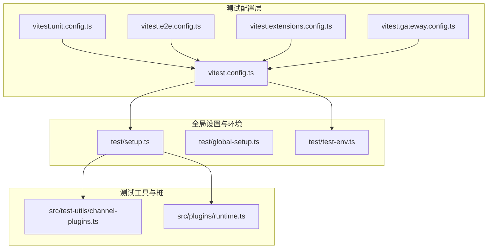
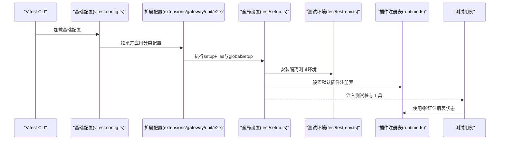
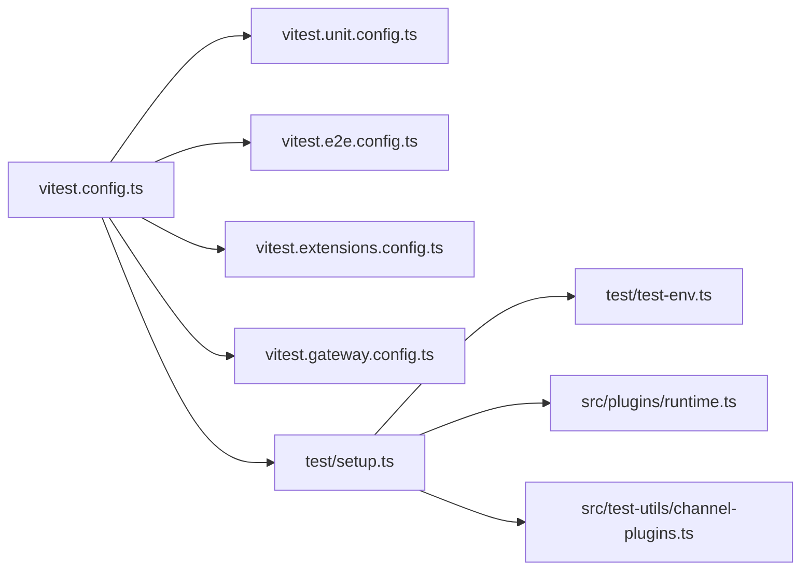

# 插件测试与调试

<cite>
**本文引用的文件**
- [vitest.config.ts](file://vitest.config.ts)
- [vitest.unit.config.ts](file://vitest.unit.config.ts)
- [vitest.e2e.config.ts](file://vitest.e2e.config.ts)
- [vitest.extensions.config.ts](file://vitest.extensions.config.ts)
- [vitest.gateway.config.ts](file://vitest.gateway.config.ts)
- [setup.ts](file://test/setup.ts)
- [global-setup.ts](file://test/global-setup.ts)
- [test-env.ts](file://test/test-env.ts)
- [channel-plugins.ts](file://src/test-utils/channel-plugins.ts)
- [runtime.ts](file://src/plugins/runtime.ts)
- [index.test.ts（memory-lancedb）](file://extensions/memory-lancedb/index.test.ts)
- [oauth.test.ts（google-gemini-cli-auth）](file://extensions/google-gemini-cli-auth/oauth.test.ts)
</cite>

## 目录

1. [引言](#引言)
2. [项目结构](#项目结构)
3. [核心组件](#核心组件)
4. [架构总览](#架构总览)
5. [详细组件分析](#详细组件分析)
6. [依赖关系分析](#依赖关系分析)
7. [性能考量](#性能考量)
8. [故障排查指南](#故障排查指南)
9. [结论](#结论)
10. [附录](#附录)

## 引言

本指南面向OpenClaw插件开发者与维护者，系统性地阐述如何在该代码库中开展插件的单元测试、集成测试与端到端测试，并提供调试工具与最佳实践。内容覆盖测试框架配置、测试用例编写方法、日志与断点调试技巧、性能分析手段，以及常见问题（如依赖冲突、内存泄漏、性能瓶颈）的诊断与解决建议。同时给出质量保证与持续集成方面的落地建议。

## 项目结构

OpenClaw采用多包/多模块组织方式，测试体系以Vitest为核心，结合多种配置文件实现对不同范围测试的隔离与优化。关键测试相关目录与文件如下：

- 测试运行时配置：vitest.config.ts、vitest.unit.config.ts、vitest.e2e.config.ts、vitest.extensions.config.ts、vitest.gateway.config.ts
- 全局测试环境与钩子：test/setup.ts、test/global-setup.ts、test/test-env.ts
- 测试工具与桩：src/test-utils/channel-plugins.ts
- 插件运行时注册表：src/plugins/runtime.ts
- 扩展插件测试样例：extensions/_/index.test.ts、extensions/_/oauth.test.ts 等

图表来源

- [vitest.config.ts](file://vitest.config.ts#L1-L105)
- [vitest.unit.config.ts](file://vitest.unit.config.ts#L1-L20)
- [vitest.e2e.config.ts](file://vitest.e2e.config.ts#L1-L21)
- [vitest.extensions.config.ts](file://vitest.extensions.config.ts#L1-L15)
- [vitest.gateway.config.ts](file://vitest.gateway.config.ts#L1-L15)
- [setup.ts](file://test/setup.ts#L1-L169)
- [global-setup.ts](file://test/global-setup.ts#L1-L7)
- [test-env.ts](file://test/test-env.ts#L1-L148)
- [channel-plugins.ts](file://src/test-utils/channel-plugins.ts#L1-L105)
- [runtime.ts](file://src/plugins/runtime.ts#L1-L58)

章节来源

- [vitest.config.ts](file://vitest.config.ts#L1-L105)
- [test/setup.ts](file://test/setup.ts#L1-L169)
- [test/test-env.ts](file://test/test-env.ts#L1-L148)

## 核心组件

- 测试框架与配置
  - 基础配置：统一超时、工作进程数、包含/排除规则、覆盖率阈值与报告器、别名映射等
  - 分类配置：单元测试、扩展插件测试、网关测试、端到端测试分别通过独立配置文件继承基础配置
- 全局设置与隔离
  - 安装进程警告过滤、安装隔离测试环境（临时HOME、XDG目录、端口等）、清理逻辑
  - 在每个测试前/后重置活动插件注册表，避免跨用例污染
- 测试工具与桩
  - 创建测试用插件注册表、iMessage测试桩、通用出站适配器桩
  - 提供通道插件元数据、能力、配置解析、状态收集等测试支撑

章节来源

- [vitest.config.ts](file://vitest.config.ts#L12-L104)
- [vitest.unit.config.ts](file://vitest.unit.config.ts#L1-L20)
- [vitest.e2e.config.ts](file://vitest.e2e.config.ts#L1-L21)
- [vitest.extensions.config.ts](file://vitest.extensions.config.ts#L1-L15)
- [vitest.gateway.config.ts](file://vitest.gateway.config.ts#L1-L15)
- [setup.ts](file://test/setup.ts#L1-L169)
- [test-env.ts](file://test/test-env.ts#L54-L148)
- [channel-plugins.ts](file://src/test-utils/channel-plugins.ts#L1-L105)
- [runtime.ts](file://src/plugins/runtime.ts#L1-L58)

## 架构总览

下图展示了测试执行从配置到运行时环境、再到插件注册表的整体流程：

图表来源

- [vitest.config.ts](file://vitest.config.ts#L12-L34)
- [vitest.extensions.config.ts](file://vitest.extensions.config.ts#L7-L14)
- [vitest.gateway.config.ts](file://vitest.gateway.config.ts#L7-L14)
- [vitest.e2e.config.ts](file://vitest.e2e.config.ts#L9-L20)
- [setup.ts](file://test/setup.ts#L1-L169)
- [test-env.ts](file://test/test-env.ts#L54-L148)
- [runtime.ts](file://src/plugins/runtime.ts#L39-L57)

## 详细组件分析

### 单元测试编写与配置

- 配置要点
  - 超时与工作池：根据平台与CI环境调整最大并发与超时
  - 包含/排除：仅针对源码与扩展测试文件，排除网关、通道等集成面
  - 覆盖率：启用v8提供者，设定行/函数/分支/语句阈值，排除入口与UI等难以单元测试的模块
- 编写方法
  - 使用测试桩创建最小化依赖的被测对象
  - 对纯函数与无副作用逻辑进行断言
  - 利用beforeEach/afterEach确保测试隔离
- 示例参考
  - 扩展插件OAuth提取逻辑的单元测试，通过mock文件系统API验证路径解析与缓存行为

章节来源

- [vitest.config.ts](file://vitest.config.ts#L12-L104)
- [vitest.unit.config.ts](file://vitest.unit.config.ts#L1-L20)
- [oauth.test.ts（google-gemini-cli-auth）](file://extensions/google-gemini-cli-auth/oauth.test.ts#L1-L241)

### 集成测试与端到端测试

- 配置要点
  - e2e配置：启用更少并发，显式包含e2e测试文件，便于与单元测试隔离
  - 环境变量驱动：通过LIVE或OPENCLAW_LIVE_TEST控制是否执行真实服务调用
- 实施策略
  - 使用临时目录与隔离配置，避免污染真实用户状态
  - 对需要外部服务（如嵌入模型API）的场景，按需开启“实时”测试
  - 通过动态导入减少非测试场景下的依赖加载
- 示例参考
  - 内存插件的端到端测试：校验插件注册、配置解析、自动捕获/回忆/遗忘等完整链路

章节来源

- [vitest.e2e.config.ts](file://vitest.e2e.config.ts#L1-L21)
- [index.test.ts（memory-lancedb）](file://extensions/memory-lancedb/index.test.ts#L1-L254)
- [test-env.ts](file://test/test-env.ts#L54-L148)

### 测试环境与隔离

- 关键机制
  - 安装测试环境：创建临时HOME与XDG目录，注入隔离变量，清理恢复
  - 全局设置：安装进程警告过滤，设置默认插件注册表，重置虚拟计时器
  - 插件注册表：提供全局状态容器，支持在测试前后切换与读取
- 最佳实践
  - 每个测试文件都应重置注册表，避免跨文件共享状态
  - 对可能影响系统行为的测试（如网络、文件系统）使用隔离环境

章节来源

- [test-env.ts](file://test/test-env.ts#L54-L148)
- [setup.ts](file://test/setup.ts#L1-L169)
- [runtime.ts](file://src/plugins/runtime.ts#L1-L58)

### 测试工具与桩

- 插件注册表桩：快速构建测试用通道插件集合，便于在用例中直接使用
- 通道插件桩：提供meta、capabilities、config、outbound等字段的最小实现
- iMessage测试桩：包含目标解析、规范化、状态收集等典型通道能力

章节来源

- [channel-plugins.ts](file://src/test-utils/channel-plugins.ts#L1-L105)
- [setup.ts](file://test/setup.ts#L113-L162)

### 调试工具与技巧

- 日志记录
  - 在测试中通过mock logger输出信息，便于定位问题
  - 使用测试环境的日志输出与错误堆栈
- 断点调试
  - 在本地运行单测时可启用Node inspect参数，配合IDE断点
  - 对于并发测试，优先使用串行或降低并发以提升可调试性
- 性能分析
  - 使用Vitest内置统计与覆盖率报告，识别热点路径
  - 对外部服务调用（如嵌入模型）增加超时与重试策略，避免阻塞测试

章节来源

- [index.test.ts（memory-lancedb）](file://extensions/memory-lancedb/index.test.ts#L150-L192)
- [vitest.config.ts](file://vitest.config.ts#L12-L23)

### 常见问题与解决方案

- 依赖冲突
  - 症状：测试中出现未解析的模块或版本不一致
  - 解决：统一管理依赖版本；在测试配置中使用别名映射指向正确入口
- 内存泄漏
  - 症状：长时间运行或大量并发测试后内存增长
  - 解决：确保每次测试后清理定时器与事件监听；使用隔离环境清理临时资源
- 性能瓶颈
  - 症状：测试执行缓慢或超时
  - 解决：减少并发、拆分大用例、对IO密集型步骤增加缓存或模拟

章节来源

- [vitest.config.ts](file://vitest.config.ts#L12-L23)
- [setup.ts](file://test/setup.ts#L160-L168)
- [test-env.ts](file://test/test-env.ts#L133-L142)

## 依赖关系分析

下图展示测试配置与运行时环境之间的依赖关系：

图表来源

- [vitest.config.ts](file://vitest.config.ts#L12-L34)
- [vitest.unit.config.ts](file://vitest.unit.config.ts#L1-L20)
- [vitest.e2e.config.ts](file://vitest.e2e.config.ts#L1-L21)
- [vitest.extensions.config.ts](file://vitest.extensions.config.ts#L1-L15)
- [vitest.gateway.config.ts](file://vitest.gateway.config.ts#L1-L15)
- [setup.ts](file://test/setup.ts#L1-L169)
- [test-env.ts](file://test/test-env.ts#L1-L148)
- [runtime.ts](file://src/plugins/runtime.ts#L1-L58)
- [channel-plugins.ts](file://src/test-utils/channel-plugins.ts#L1-L105)

## 性能考量

- 并发与超时
  - 根据CPU核数与平台特性动态设置maxWorkers，CI环境适当降低并发
  - 合理设置测试超时，避免长尾用例拖慢整体流水线
- 覆盖率与排除
  - 对难以单元测试的模块进行排除，聚焦核心业务逻辑覆盖率
- 外部依赖
  - 将外部服务调用封装为可配置的mock或延迟初始化，减少非必要开销

章节来源

- [vitest.config.ts](file://vitest.config.ts#L7-L23)
- [vitest.e2e.config.ts](file://vitest.e2e.config.ts#L5-L17)

## 故障排查指南

- 测试失败定位
  - 查看Vitest报告与覆盖率输出，定位未覆盖路径
  - 使用更小粒度的用例拆分，缩小问题范围
- 环境问题
  - 确认隔离环境已正确安装与清理
  - 检查端口、令牌等敏感变量是否被清理或覆盖
- 插件注册表污染
  - 确保beforeEach/afterEach正确重置注册表
  - 避免在测试中直接修改全局状态

章节来源

- [setup.ts](file://test/setup.ts#L160-L168)
- [test-env.ts](file://test/test-env.ts#L133-L142)
- [runtime.ts](file://src/plugins/runtime.ts#L39-L57)

## 结论

通过明确的测试配置分层、严格的环境隔离与完善的测试工具，OpenClaw为插件提供了从单元到端到端的全链路测试保障。遵循本文的编写规范与调试实践，可显著提升插件质量与交付效率，并在持续集成中保持稳定与高效。

## 附录

- 快速开始
  - 运行单元测试：使用对应配置文件启动Vitest
  - 运行端到端测试：确保满足实时测试条件并使用e2e配置
  - 新建插件测试：参考现有扩展测试文件，使用测试桩与隔离环境
