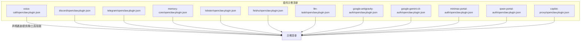
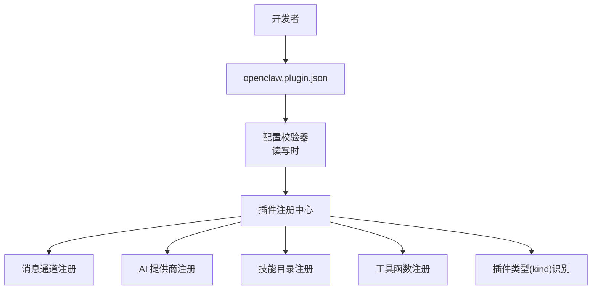
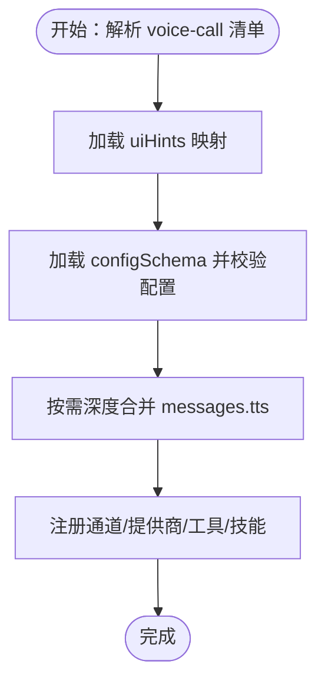
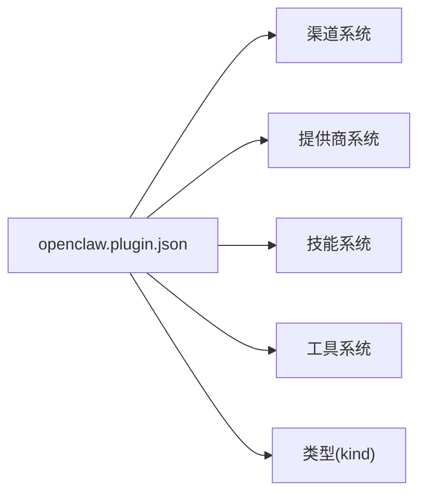

# 插件清单配置

<cite>
**本文引用的文件**
- [docs/plugins/manifest.md](file://docs/plugins/manifest.md)
- [docs/plugins/agent-tools.md](file://docs/plugins/agent-tools.md)
- [docs/plugins/voice-call.md](file://docs/plugins/voice-call.md)
- [extensions/voice-call/openclaw.plugin.json](file://extensions/voice-call/openclaw.plugin.json)
- [extensions/discord/openclaw.plugin.json](file://extensions/discord/openclaw.plugin.json)
- [extensions/telegram/openclaw.plugin.json](file://extensions/telegram/openclaw.plugin.json)
- [extensions/memory-core/openclaw.plugin.json](file://extensions/memory-core/openclaw.plugin.json)
- [extensions/lobster/openclaw.plugin.json](file://extensions/lobster/openclaw.plugin.json)
- [extensions/llm-task/openclaw.plugin.json](file://extensions/llm-task/openclaw.plugin.json)
- [extensions/feishu/openclaw.plugin.json](file://extensions/feishu/openclaw.plugin.json)
- [extensions/zalo/openclaw.plugin.json](file://extensions/zalo/openclaw.plugin.json)
- [extensions/nextcloud-talk/openclaw.plugin.json](file://extensions/nextcloud-talk/openclaw.plugin.json)
- [extensions/whatsapp/openclaw.plugin.json](file://extensions/whatsapp/openclaw.plugin.json)
- [extensions/google-antigravity-auth/openclaw.plugin.json](file://extensions/google-antigravity-auth/openclaw.plugin.json)
- [extensions/google-gemini-cli-auth/openclaw.plugin.json](file://extensions/google-gemini-cli-auth/openclaw.plugin.json)
- [extensions/minimax-portal-auth/openclaw.plugin.json](file://extensions/minimax-portal-auth/openclaw.plugin.json)
- [extensions/qwen-portal-auth/openclaw.plugin.json](file://extensions/qwen-portal-auth/openclaw.plugin.json)
- [extensions/copilot-proxy/openclaw.plugin.json](file://extensions/copilot-proxy/openclaw.plugin.json)
</cite>

## 目录

1. [简介](#简介)
2. [项目结构](#项目结构)
3. [核心组件](#核心组件)
4. [架构总览](#架构总览)
5. [详细组件分析](#详细组件分析)
6. [依赖关系分析](#依赖关系分析)
7. [性能考量](#性能考量)
8. [故障排查指南](#故障排查指南)
9. [结论](#结论)
10. [附录](#附录)

## 简介

本指南面向开发与维护 OpenClaw 插件的工程师，系统讲解 openclaw.plugin.json 插件清单文件的结构、字段语义、校验规则与最佳实践，并提供三类典型插件（消息渠道、AI 工具、通用插件）的配置模板与常见问题排查方法。通过严格遵循清单规范，可确保插件在不执行代码的前提下完成配置校验与发现注册，避免运行期错误。

## 项目结构

- 每个插件根目录必须包含 openclaw.plugin.json 清单文件，用于声明插件标识、类型、通道/工具/技能注册信息以及配置 JSON Schema。
- 仓库中存在大量示例插件清单，覆盖消息渠道、AI 提供商认证代理、内存存储、工作流工具等场景，便于对照与复用。

**图表来源**

- [extensions/voice-call/openclaw.plugin.json](file://extensions/voice-call/openclaw.plugin.json#L1-L560)
- [extensions/discord/openclaw.plugin.json](file://extensions/discord/openclaw.plugin.json#L1-L10)
- [extensions/telegram/openclaw.plugin.json](file://extensions/telegram/openclaw.plugin.json#L1-L10)
- [extensions/memory-core/openclaw.plugin.json](file://extensions/memory-core/openclaw.plugin.json#L1-L10)
- [extensions/lobster/openclaw.plugin.json](file://extensions/lobster/openclaw.plugin.json#L1-L11)
- [extensions/feishu/openclaw.plugin.json](file://extensions/feishu/openclaw.plugin.json#L1-L11)
- [extensions/llm-task/openclaw.plugin.json](file://extensions/llm-task/openclaw.plugin.json#L1-L22)
- [extensions/google-antigravity-auth/openclaw.plugin.json](file://extensions/google-antigravity-auth/openclaw.plugin.json#L1-L10)
- [extensions/google-gemini-cli-auth/openclaw.plugin.json](file://extensions/google-gemini-cli-auth/openclaw.plugin.json#L1-L10)
- [extensions/minimax-portal-auth/openclaw.plugin.json](file://extensions/minimax-portal-auth/openclaw.plugin.json#L1-L10)
- [extensions/qwen-portal-auth/openclaw.plugin.json](file://extensions/qwen-portal-auth/openclaw.plugin.json#L1-L10)
- [extensions/copilot-proxy/openclaw.plugin.json](file://extensions/copilot-proxy/openclaw.plugin.json#L1-L10)

**章节来源**

- [docs/plugins/manifest.md](file://docs/plugins/manifest.md#L1-L72)

## 核心组件

- 插件清单文件（openclaw.plugin.json）
  - 必填字段：id、configSchema
  - 可选字段：kind、channels、providers、skills、name、description、uiHints、version
  - 校验要求：每个插件必须携带 JSON Schema；空 schema 允许但需显式声明；Schema 在配置读写时校验，非运行时
  - 验证行为：未知通道/插件 id 视为错误；缺失或损坏清单导致 Doctor 报错；禁用插件保留配置并告警

- 配置 JSON Schema
  - 作用域：定义插件配置对象的结构、类型、枚举值、范围约束与嵌套对象
  - 建议：使用 additionalProperties:false 限制未知键；对敏感字段标注 uiHints 的 sensitive 标记

- UI 提示（uiHints）
  - 作用：为 UI 展示提供标签、占位符、帮助文本、高级选项标记与敏感字段标识
  - 使用：键名与 configSchema 中的路径一致，支持嵌套路径

**章节来源**

- [docs/plugins/manifest.md](file://docs/plugins/manifest.md#L18-L72)
- [extensions/voice-call/openclaw.plugin.json](file://extensions/voice-call/openclaw.plugin.json#L3-L161)

## 架构总览

下图展示插件清单在系统中的角色：作为“发现与校验”的入口，驱动后续的插件加载、配置读取与功能注册。

**图表来源**

- [docs/plugins/manifest.md](file://docs/plugins/manifest.md#L11-L14)
- [docs/plugins/manifest.md](file://docs/plugins/manifest.md#L36-L46)

## 详细组件分析

### 字段详解与用途

- id（字符串）
  - 含义：插件的规范化标识，全局唯一且稳定
  - 用途：作为配置入口 plugins.entries.<id>、权限策略、Doctor 引用与工具/技能分组的归属标识
- kind（字符串，可选）
  - 含义：插件类型，如 memory
  - 用途：影响插件在系统中的分类与调度策略
- channels（数组，可选）
  - 含义：该插件注册的消息通道 id 列表
  - 用途：使系统识别并启用对应通道的收发能力
- providers（数组，可选）
  - 含义：该插件注册的 AI 提供商 id 列表
  - 用途：使系统识别并启用对应提供商的模型/认证能力
- skills（数组，可选）
  - 含义：相对插件根目录的技能目录路径列表
  - 用途：自动加载技能文档与实现
- name（字符串，可选）
  - 含义：插件显示名称
- description（字符串，可选）
  - 含义：简短描述
- uiHints（对象，可选）
  - 含义：配置字段的 UI 提示，含 label、placeholder、help、advanced、sensitive 等
- version（字符串，可选）
  - 含义：插件版本号（信息性）
- configSchema（对象）
  - 含义：插件配置的 JSON Schema
  - 要求：必须提供；可为空对象 schema（禁止额外属性）

**章节来源**

- [docs/plugins/manifest.md](file://docs/plugins/manifest.md#L18-L46)
- [extensions/voice-call/openclaw.plugin.json](file://extensions/voice-call/openclaw.plugin.json#L3-L161)

### 验证机制与格式要求

- 严格校验
  - 缺失或无效清单将阻断配置验证
  - 未知 channels.\* 或未知插件 id 视为错误
- 时机与范围
  - 在配置读取/写入阶段进行 Schema 校验，非运行时
- 运行前发现
  - 即便插件被禁用，其配置仍会保留并在 Doctor 中告警

**章节来源**

- [docs/plugins/manifest.md](file://docs/plugins/manifest.md#L53-L63)

### 不同类型插件的配置模板

#### 消息渠道插件（以 Discord、Telegram、Feishu、WhatsApp、Nextcloud Talk、Zalo 为例）

- 关键点
  - 设置 channels 数组，包含该插件所支持的通道 id
  - 至少提供空的 configSchema（禁止额外属性）
- 示例参考
  - [extensions/discord/openclaw.plugin.json](file://extensions/discord/openclaw.plugin.json#L1-L10)
  - [extensions/telegram/openclaw.plugin.json](file://extensions/telegram/openclaw.plugin.json#L1-L10)
  - [extensions/feishu/openclaw.plugin.json](file://extensions/feishu/openclaw.plugin.json#L1-L11)
  - [extensions/whatsapp/openclaw.plugin.json](file://extensions/whatsapp/openclaw.plugin.json#L1-L10)
  - [extensions/nextcloud-talk/openclaw.plugin.json](file://extensions/nextcloud-talk/openclaw.plugin.json#L1-L10)
  - [extensions/zalo/openclaw.plugin.json](file://extensions/zalo/openclaw.plugin.json#L1-L10)

**章节来源**

- [extensions/discord/openclaw.plugin.json](file://extensions/discord/openclaw.plugin.json#L1-L10)
- [extensions/telegram/openclaw.plugin.json](file://extensions/telegram/openclaw.plugin.json#L1-L10)
- [extensions/feishu/openclaw.plugin.json](file://extensions/feishu/openclaw.plugin.json#L1-L11)
- [extensions/whatsapp/openclaw.plugin.json](file://extensions/whatsapp/openclaw.plugin.json#L1-L10)
- [extensions/nextcloud-talk/openclaw.plugin.json](file://extensions/nextcloud-talk/openclaw.plugin.json#L1-L10)
- [extensions/zalo/openclaw.plugin.json](file://extensions/zalo/openclaw.plugin.json#L1-L10)

#### AI 工具/提供商插件（以 Google Antigravity Auth、Google Gemini CLI Auth、Minimax Portal Auth、Qwen Portal Auth、Copilot Proxy 为例）

- 关键点
  - 设置 providers 数组，包含该插件注册的提供商 id
  - 至少提供空的 configSchema
- 示例参考
  - [extensions/google-antigravity-auth/openclaw.plugin.json](file://extensions/google-antigravity-auth/openclaw.plugin.json#L1-L10)
  - [extensions/google-gemini-cli-auth/openclaw.plugin.json](file://extensions/google-gemini-cli-auth/openclaw.plugin.json#L1-L10)
  - [extensions/minimax-portal-auth/openclaw.plugin.json](file://extensions/minimax-portal-auth/openclaw.plugin.json#L1-L10)
  - [extensions/qwen-portal-auth/openclaw.plugin.json](file://extensions/qwen-portal-auth/openclaw.plugin.json#L1-L10)
  - [extensions/copilot-proxy/openclaw.plugin.json](file://extensions/copilot-proxy/openclaw.plugin.json#L1-L10)

**章节来源**

- [extensions/google-antigravity-auth/openclaw.plugin.json](file://extensions/google-antigravity-auth/openclaw.plugin.json#L1-L10)
- [extensions/google-gemini-cli-auth/openclaw.plugin.json](file://extensions/google-gemini-cli-auth/openclaw.plugin.json#L1-L10)
- [extensions/minimax-portal-auth/openclaw.plugin.json](file://extensions/minimax-portal-auth/openclaw.plugin.json#L1-L10)
- [extensions/qwen-portal-auth/openclaw.plugin.json](file://extensions/qwen-portal-auth/openclaw.plugin.json#L1-L10)
- [extensions/copilot-proxy/openclaw.plugin.json](file://extensions/copilot-proxy/openclaw.plugin.json#L1-L10)

#### 通用插件（以 Lobster、LLM Task、Memory Core 为例）

- 关键点
  - 可设置 kind（如 memory）、name、description 等元数据
  - 至少提供空的 configSchema
- 示例参考
  - [extensions/lobster/openclaw.plugin.json](file://extensions/lobster/openclaw.plugin.json#L1-L11)
  - [extensions/llm-task/openclaw.plugin.json](file://extensions/llm-task/openclaw.plugin.json#L1-L22)
  - [extensions/memory-core/openclaw.plugin.json](file://extensions/memory-core/openclaw.plugin.json#L1-L10)

**章节来源**

- [extensions/lobster/openclaw.plugin.json](file://extensions/lobster/openclaw.plugin.json#L1-L11)
- [extensions/llm-task/openclaw.plugin.json](file://extensions/llm-task/openclaw.plugin.json#L1-L22)
- [extensions/memory-core/openclaw.plugin.json](file://extensions/memory-core/openclaw.plugin.json#L1-L10)

### 复杂配置示例：语音通话插件

- 特点
  - 通过 uiHints 提供丰富的 UI 标签、占位符与敏感字段标记
  - configSchema 定义了提供商、号码、入站策略、出站模式、隧道暴露、实时流、TTS/STT、响应策略等完整配置项
  - 支持深度合并核心 messages.tts 配置
- 参考
  - [extensions/voice-call/openclaw.plugin.json](file://extensions/voice-call/openclaw.plugin.json#L1-L560)
  - [docs/plugins/voice-call.md](file://docs/plugins/voice-call.md#L53-L108)

**图表来源**

- [extensions/voice-call/openclaw.plugin.json](file://extensions/voice-call/openclaw.plugin.json#L3-L161)
- [extensions/voice-call/openclaw.plugin.json](file://extensions/voice-call/openclaw.plugin.json#L162-L558)
- [docs/plugins/voice-call.md](file://docs/plugins/voice-call.md#L152-L168)

**章节来源**

- [extensions/voice-call/openclaw.plugin.json](file://extensions/voice-call/openclaw.plugin.json#L1-L560)
- [docs/plugins/voice-call.md](file://docs/plugins/voice-call.md#L53-L108)

### 工具函数与清单的关系

- 插件可通过模块导出注册工具函数，清单中的 configSchema 为工具调用参数提供结构化约束
- 工具可用性受全局/代理工具策略控制（允许/拒绝列表、按提供商分组等）

**章节来源**

- [docs/plugins/agent-tools.md](file://docs/plugins/agent-tools.md#L1-L100)

## 依赖关系分析

- 插件清单与系统各子系统的耦合
  - 渠道系统：channels 字段决定是否启用对应通道
  - 提供商系统：providers 字段决定是否启用对应提供商
  - 技能系统：skills 字段决定是否加载技能目录
  - 工具系统：插件可注册工具，清单中的 schema 为工具参数提供约束
  - 类型系统：kind 决定插件在系统中的分类与调度策略

**图表来源**

- [docs/plugins/manifest.md](file://docs/plugins/manifest.md#L36-L46)

**章节来源**

- [docs/plugins/manifest.md](file://docs/plugins/manifest.md#L36-L46)

## 性能考量

- 清单仅用于发现与校验，不参与运行时性能开销
- 合理设计 configSchema，避免过深嵌套与过多枚举，有助于提升 Doctor 与配置编辑体验
- 对于大型插件（如语音通话），建议将复杂配置拆分为子对象并通过 uiHints 分组展示，降低用户认知负担

## 故障排查指南

- 常见错误与修复
  - 缺失清单文件
    - 现象：安装后 Doctor 报错，提示缺少清单或清单无效
    - 修复：在插件根目录添加 openclaw.plugin.json，并确保包含 id 与 configSchema
  - configSchema 不合法
    - 现象：配置读取时报 schema 错误
    - 修复：确保提供 JSON Schema；若无配置，使用空 schema（禁止额外属性）
  - 未知通道/提供商/插件 id
    - 现象：Doctor 报错，提示未知键
    - 修复：在清单中正确声明 channels/providers/id；或检查配置入口是否拼写正确
  - 插件被禁用但仍保留配置
    - 现象：Doctor 警告，配置未生效
    - 修复：启用插件或删除冗余配置
- 实用建议
  - 使用 uiHints.sensitive 标记敏感字段，避免明文泄露
  - 对复杂配置使用 uiHints.advanced 将高级项折叠
  - 保持 id 与 channels/providers 的命名一致性，便于 Doctor 诊断

**章节来源**

- [docs/plugins/manifest.md](file://docs/plugins/manifest.md#L53-L63)

## 结论

openclaw.plugin.json 是插件生态的“契约”，通过严格的清单与 Schema 设计，确保插件在安装即被发现、在配置即被校验。遵循本文提供的字段语义、验证机制与模板示例，可显著降低集成成本与运行风险。对于复杂插件，建议结合 uiHints 优化配置体验，并通过 tools 策略与 kind 分类实现细粒度的可用性控制。

## 附录

### 字段速查表

- id：插件标识（必填）
- kind：插件类型（可选）
- channels：通道 id 列表（可选）
- providers：提供商 id 列表（可选）
- skills：技能目录路径列表（可选）
- name：显示名称（可选）
- description：简要描述（可选）
- uiHints：UI 提示（可选）
- version：版本号（可选）
- configSchema：配置 JSON Schema（必填）

**章节来源**

- [docs/plugins/manifest.md](file://docs/plugins/manifest.md#L18-L46)

### 配置示例索引

- 消息渠道插件
  - [extensions/discord/openclaw.plugin.json](file://extensions/discord/openclaw.plugin.json#L1-L10)
  - [extensions/telegram/openclaw.plugin.json](file://extensions/telegram/openclaw.plugin.json#L1-L10)
  - [extensions/feishu/openclaw.plugin.json](file://extensions/feishu/openclaw.plugin.json#L1-L11)
  - [extensions/whatsapp/openclaw.plugin.json](file://extensions/whatsapp/openclaw.plugin.json#L1-L10)
  - [extensions/nextcloud-talk/openclaw.plugin.json](file://extensions/nextcloud-talk/openclaw.plugin.json#L1-L10)
  - [extensions/zalo/openclaw.plugin.json](file://extensions/zalo/openclaw.plugin.json#L1-L10)
- AI 工具/提供商插件
  - [extensions/google-antigravity-auth/openclaw.plugin.json](file://extensions/google-antigravity-auth/openclaw.plugin.json#L1-L10)
  - [extensions/google-gemini-cli-auth/openclaw.plugin.json](file://extensions/google-gemini-cli-auth/openclaw.plugin.json#L1-L10)
  - [extensions/minimax-portal-auth/openclaw.plugin.json](file://extensions/minimax-portal-auth/openclaw.plugin.json#L1-L10)
  - [extensions/qwen-portal-auth/openclaw.plugin.json](file://extensions/qwen-portal-auth/openclaw.plugin.json#L1-L10)
  - [extensions/copilot-proxy/openclaw.plugin.json](file://extensions/copilot-proxy/openclaw.plugin.json#L1-L10)
- 通用插件
  - [extensions/lobster/openclaw.plugin.json](file://extensions/lobster/openclaw.plugin.json#L1-L11)
  - [extensions/llm-task/openclaw.plugin.json](file://extensions/llm-task/openclaw.plugin.json#L1-L22)
  - [extensions/memory-core/openclaw.plugin.json](file://extensions/memory-core/openclaw.plugin.json#L1-L10)
- 复杂配置示例
  - [extensions/voice-call/openclaw.plugin.json](file://extensions/voice-call/openclaw.plugin.json#L1-L560)
  - [docs/plugins/voice-call.md](file://docs/plugins/voice-call.md#L53-L108)
