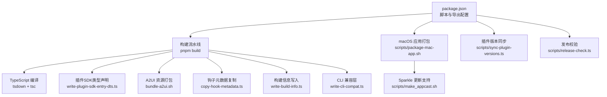
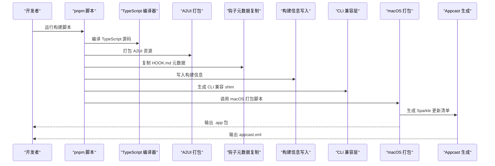
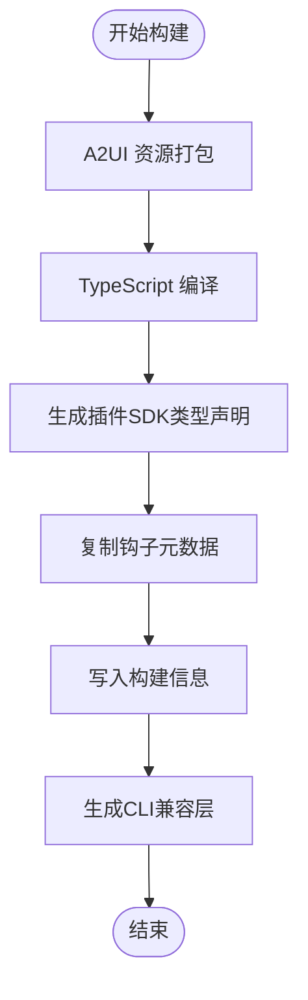
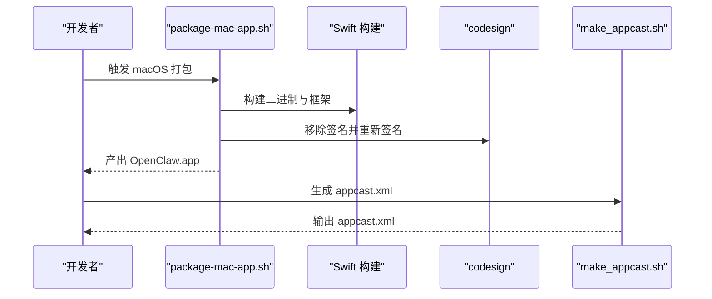
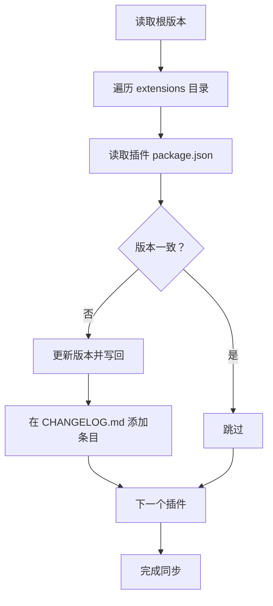
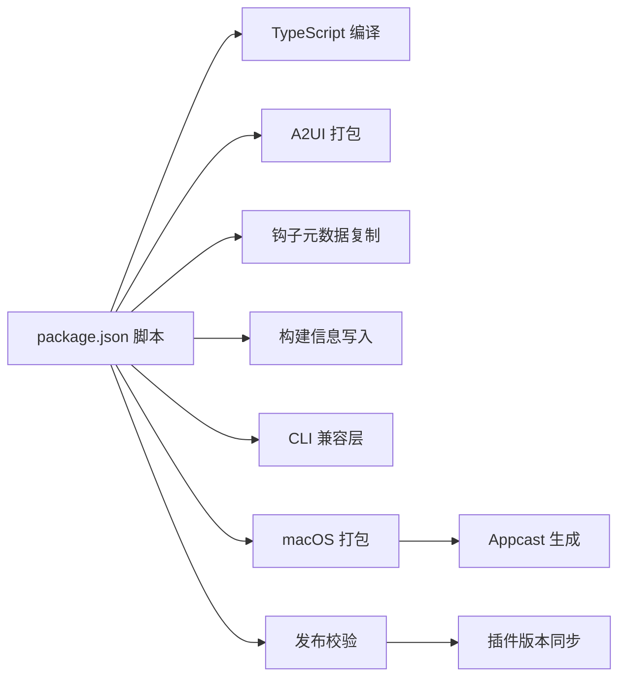

# 插件部署与打包

<cite>
**本文引用的文件**
- [package.json](file://package.json)
- [tsconfig.json](file://tsconfig.json)
- [scripts/package-mac-app.sh](file://scripts/package-mac-app.sh)
- [scripts/make_appcast.sh](file://scripts/make_appcast.sh)
- [src/plugin-sdk/index.ts](file://src/plugin-sdk/index.ts)
- [scripts/write-plugin-sdk-entry-dts.ts](file://scripts/write-plugin-sdk-entry-dts.ts)
- [scripts/copy-hook-metadata.ts](file://scripts/copy-hook-metadata.ts)
- [scripts/bundle-a2ui.sh](file://scripts/bundle-a2ui.sh)
- [scripts/write-build-info.ts](file://scripts/write-build-info.ts)
- [scripts/write-cli-compat.ts](file://scripts/write-cli-compat.ts)
- [scripts/sync-plugin-versions.ts](file://scripts/sync-plugin-versions.ts)
- [scripts/release-check.ts](file://scripts/release-check.ts)
- [extensions/discord/openclaw.plugin.json](file://extensions/discord/openclaw.plugin.json)
- [extensions/telegram/openclaw.plugin.json](file://extensions/telegram/openclaw.plugin.json)
</cite>

## 目录

1. [简介](#简介)
2. [项目结构](#项目结构)
3. [核心组件](#核心组件)
4. [架构总览](#架构总览)
5. [详细组件分析](#详细组件分析)
6. [依赖关系分析](#依赖关系分析)
7. [性能考量](#性能考量)
8. [故障排查指南](#故障排查指南)
9. [结论](#结论)
10. [附录](#附录)

## 简介

本指南面向OpenClaw插件的开发者与运维人员，系统阐述插件的构建、打包、版本管理与发布流程，覆盖TypeScript编译、资源打包、依赖处理、安装/更新/卸载、版本兼容性控制、签名与安全检查、以及分发与更新的最佳实践。内容基于仓库中的实际脚本与配置文件进行归纳总结，确保可操作与可追溯。

## 项目结构

OpenClaw采用多语言混合工程：核心以TypeScript为主，配合Swift（macOS应用）、Gradle（Android）与前端UI；插件生态位于extensions目录，每个插件通过独立的manifest文件声明元数据。构建与打包由package.json中的脚本统一调度，结合一系列专用脚本完成。

图表来源

- [package.json](file://package.json#L33-L109)
- [scripts/bundle-a2ui.sh](file://scripts/bundle-a2ui.sh#L1-L92)
- [scripts/write-plugin-sdk-entry-dts.ts](file://scripts/write-plugin-sdk-entry-dts.ts#L1-L10)
- [scripts/copy-hook-metadata.ts](file://scripts/copy-hook-metadata.ts#L1-L56)
- [scripts/write-build-info.ts](file://scripts/write-build-info.ts#L1-L48)
- [scripts/write-cli-compat.ts](file://scripts/write-cli-compat.ts#L1-L63)
- [scripts/package-mac-app.sh](file://scripts/package-mac-app.sh#L1-L262)
- [scripts/make_appcast.sh](file://scripts/make_appcast.sh#L1-L70)
- [scripts/sync-plugin-versions.ts](file://scripts/sync-plugin-versions.ts#L1-L77)
- [scripts/release-check.ts](file://scripts/release-check.ts#L1-L117)

章节来源

- [package.json](file://package.json#L1-L219)
- [tsconfig.json](file://tsconfig.json#L1-L28)

## 核心组件

- 构建与打包入口：通过package.json的scripts统一编排，核心命令包括构建、打包插件SDK类型声明、A2UI资源打包、钩子元数据复制、构建信息注入与CLI兼容层生成。
- 插件SDK：通过src/plugin-sdk/index.ts导出插件开发所需类型与工具函数，供扩展开发者使用。
- macOS应用打包：scripts/package-mac-app.sh负责Swift构建、资源拷贝、签名与Sparkle集成。
- 发布校验：scripts/release-check.ts确保npm包内容符合要求，避免遗漏关键产物或包含不应进入包的文件。
- 版本同步：scripts/sync-plugin-versions.ts在主版本变更时同步所有插件的package.json版本与CHANGELOG条目。

章节来源

- [package.json](file://package.json#L33-L109)
- [src/plugin-sdk/index.ts](file://src/plugin-sdk/index.ts#L1-L392)
- [scripts/package-mac-app.sh](file://scripts/package-mac-app.sh#L1-L262)
- [scripts/release-check.ts](file://scripts/release-check.ts#L1-L117)
- [scripts/sync-plugin-versions.ts](file://scripts/sync-plugin-versions.ts#L1-L77)

## 架构总览

下图展示从源码到可分发产物的端到端流程，涵盖TypeScript编译、资源打包、macOS应用打包与发布校验。

图表来源

- [package.json](file://package.json#L33-L109)
- [scripts/bundle-a2ui.sh](file://scripts/bundle-a2ui.sh#L1-L92)
- [scripts/copy-hook-metadata.ts](file://scripts/copy-hook-metadata.ts#L1-L56)
- [scripts/write-build-info.ts](file://scripts/write-build-info.ts#L1-L48)
- [scripts/write-cli-compat.ts](file://scripts/write-cli-compat.ts#L1-L63)
- [scripts/package-mac-app.sh](file://scripts/package-mac-app.sh#L1-L262)
- [scripts/make_appcast.sh](file://scripts/make_appcast.sh#L1-L70)

## 详细组件分析

### 组件A：TypeScript编译与资源打包

- 编译目标与路径：tsconfig.json定义了NodeNext模块系统、严格模式与输出目录，包含src、ui与extensions等目录。
- 构建顺序：package.json的build脚本按序执行A2UI打包、tsdown编译、插件SDK类型声明生成、钩子元数据复制、构建信息写入与CLI兼容层生成。
- 插件SDK类型声明：通过write-plugin-sdk-entry-dts.ts确保dist/plugin-sdk/index.d.ts稳定存在，便于TypeScript用户导入。
- 钩子元数据复制：copy-hook-metadata.ts遍历src/hooks/bundled下的目录，将HOOK.md复制至dist/bundled对应目录，便于运行时加载。
- 构建信息：write-build-info.ts生成dist/build-info.json，包含版本、提交哈希与构建时间戳，用于诊断与追踪。
- CLI兼容层：write-cli-compat.ts扫描dist中匹配的daemon-cli产物，生成兼容导出，保证旧版CLI引用不中断。

图表来源

- [package.json](file://package.json#L33-L109)
- [scripts/bundle-a2ui.sh](file://scripts/bundle-a2ui.sh#L1-L92)
- [scripts/write-plugin-sdk-entry-dts.ts](file://scripts/write-plugin-sdk-entry-dts.ts#L1-L10)
- [scripts/copy-hook-metadata.ts](file://scripts/copy-hook-metadata.ts#L1-L56)
- [scripts/write-build-info.ts](file://scripts/write-build-info.ts#L1-L48)
- [scripts/write-cli-compat.ts](file://scripts/write-cli-compat.ts#L1-L63)

章节来源

- [tsconfig.json](file://tsconfig.json#L1-L28)
- [package.json](file://package.json#L33-L109)
- [scripts/write-plugin-sdk-entry-dts.ts](file://scripts/write-plugin-sdk-entry-dts.ts#L1-L10)
- [scripts/copy-hook-metadata.ts](file://scripts/copy-hook-metadata.ts#L1-L56)
- [scripts/write-build-info.ts](file://scripts/write-build-info.ts#L1-L48)
- [scripts/write-cli-compat.ts](file://scripts/write-cli-compat.ts#L1-L63)

### 组件B：macOS应用打包与更新

- 打包流程：scripts/package-mac-app.sh负责安装依赖、构建JS与UI、Swift构建、复制资源、签名与Sparkle框架嵌入，最终生成OpenClaw.app。
- Sparkle更新：scripts/make_appcast.sh根据zip包生成appcast.xml，需要设置SPARKLE_PRIVATE_KEY_FILE与下载前缀，支持内嵌发布说明HTML。
- 自动检查：根据BUNDLE_ID是否为debug决定是否启用自动检查与SUFeedURL；CFBundleVersion需为数字以便比较。

图表来源

- [scripts/package-mac-app.sh](file://scripts/package-mac-app.sh#L1-L262)
- [scripts/make_appcast.sh](file://scripts/make_appcast.sh#L1-L70)

章节来源

- [scripts/package-mac-app.sh](file://scripts/package-mac-app.sh#L1-L262)
- [scripts/make_appcast.sh](file://scripts/make_appcast.sh#L1-L70)

### 组件C：插件版本管理与兼容性控制

- 版本同步：scripts/sync-plugin-versions.ts读取根package.json版本，遍历extensions目录，将所有插件的package.json版本对齐，并在CHANGELOG.md中添加条目。
- 发布校验：scripts/release-check.ts执行npm pack --dry-run，检查必需产物是否存在且未包含禁止前缀，同时校验插件版本一致性。

图表来源

- [scripts/sync-plugin-versions.ts](file://scripts/sync-plugin-versions.ts#L1-L77)
- [scripts/release-check.ts](file://scripts/release-check.ts#L1-L117)

章节来源

- [scripts/sync-plugin-versions.ts](file://scripts/sync-plugin-versions.ts#L1-L77)
- [scripts/release-check.ts](file://scripts/release-check.ts#L1-L117)

### 组件D：插件清单与依赖处理

- 插件清单：每个插件在根目录下提供openclaw.plugin.json，声明插件id、支持的通道列表与配置Schema，作为插件注册与配置校验的基础。
- 依赖处理：package.json定义了主包文件、exports映射、脚本与依赖范围；tsconfig.json定义了路径别名与严格编译选项；pnpm工作区与overrides确保依赖一致性与仅编译必要原生依赖。

章节来源

- [extensions/discord/openclaw.plugin.json](file://extensions/discord/openclaw.plugin.json#L1-L10)
- [extensions/telegram/openclaw.plugin.json](file://extensions/telegram/openclaw.plugin.json#L1-L10)
- [package.json](file://package.json#L1-L219)
- [tsconfig.json](file://tsconfig.json#L1-L28)

## 依赖关系分析

- 构建链路耦合：package.json脚本串联多个专用脚本，形成强耦合的构建流水线；任一环节失败都会阻断后续步骤。
- 资源依赖：A2UI资源打包依赖vendor与apps共享目录；macOS打包依赖Swift构建产物与Sparkle框架；发布校验依赖npm pack输出。
- 版本耦合：插件版本必须与核心版本保持一致，否则release-check会失败；sync-plugin-versions提供自动化同步能力。

图表来源

- [package.json](file://package.json#L33-L109)
- [scripts/release-check.ts](file://scripts/release-check.ts#L1-L117)
- [scripts/sync-plugin-versions.ts](file://scripts/sync-plugin-versions.ts#L1-L77)
- [scripts/package-mac-app.sh](file://scripts/package-mac-app.sh#L1-L262)
- [scripts/make_appcast.sh](file://scripts/make_appcast.sh#L1-L70)

章节来源

- [package.json](file://package.json#L33-L109)
- [scripts/release-check.ts](file://scripts/release-check.ts#L1-L117)

## 性能考量

- 并行化：构建脚本已尽量串行化，建议在CI中利用缓存与并行任务拆分（如分别构建不同平台），减少重复编译时间。
- 资源复用：A2UI打包通过哈希校验避免重复构建；macOS打包在多架构场景合并Mach-O文件，减少体积与提升启动性能。
- 依赖最小化：pnpm overrides与onlyBuiltDependencies策略降低不必要的原生依赖安装成本。

## 故障排查指南

- 构建失败
  - 检查TypeScript编译错误与路径别名配置，确认tsconfig.json与src/plugin-sdk/index.ts导出正确。
  - 若A2UI资源缺失导致打包失败，确认vendor与apps共享目录存在，或保留预构建产物。
- macOS打包失败
  - 确认codesign与签名证书可用；若缺少Sparkle工具，先通过SwiftPM构建Sparkle工具链。
  - 检查Info.plist字段与CFBundleVersion是否为数字；调试模式下自动检查会被禁用。
- 发布校验失败
  - 使用scripts/release-check.ts定位缺失产物或被错误包含的文件；确保所有插件版本与核心版本一致。
- 版本不同步
  - 运行scripts/sync-plugin-versions.ts自动对齐版本并更新CHANGELOG条目。

章节来源

- [scripts/bundle-a2ui.sh](file://scripts/bundle-a2ui.sh#L1-L92)
- [scripts/package-mac-app.sh](file://scripts/package-mac-app.sh#L1-L262)
- [scripts/release-check.ts](file://scripts/release-check.ts#L1-L117)
- [scripts/sync-plugin-versions.ts](file://scripts/sync-plugin-versions.ts#L1-L77)

## 结论

OpenClaw的插件体系通过清晰的构建脚本、严格的发布校验与版本同步机制，实现了从源码到分发产物的全链路自动化。遵循本文档的流程与最佳实践，可在保证质量的前提下高效完成插件的开发、测试、打包与发布。

## 附录

### 安装、更新与卸载流程（概念说明）

- 安装：通过包管理器安装核心包后，插件可通过内置渠道或外部仓库进行发现与安装。
- 更新：核心更新通常伴随插件版本同步；macOS平台可借助Sparkle实现自动更新。
- 卸载：移除插件目录与相关配置，清理缓存与历史记录。

### 插件发布准备与发布流程

- 准备工作
  - 确保所有插件版本与核心版本一致，执行版本同步与发布校验。
  - 生成并校验npm包内容，确保包含必需产物且无多余文件。
- 发布流程
  - 生成Sparkle appcast，上传zip与appcast至发布地址。
  - 在CI中执行release-check，通过后方可发布。

章节来源

- [scripts/sync-plugin-versions.ts](file://scripts/sync-plugin-versions.ts#L1-L77)
- [scripts/release-check.ts](file://scripts/release-check.ts#L1-L117)
- [scripts/make_appcast.sh](file://scripts/make_appcast.sh#L1-L70)
