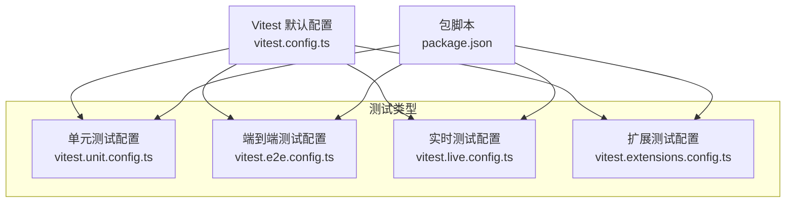
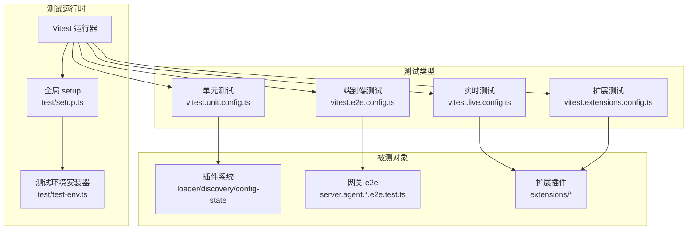
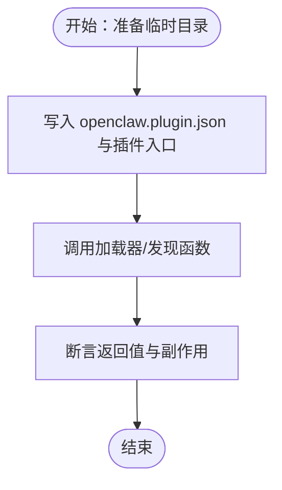
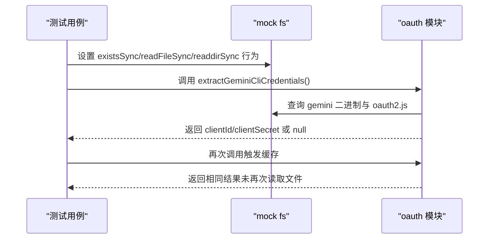
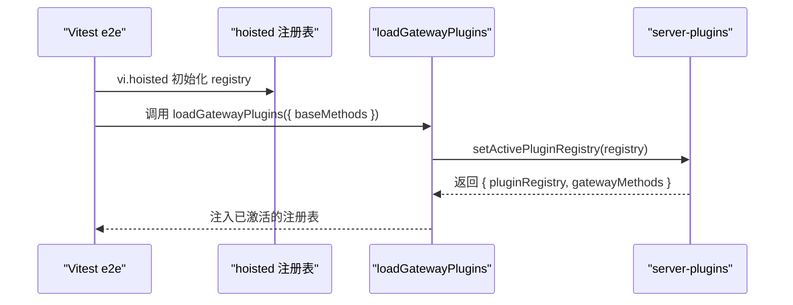
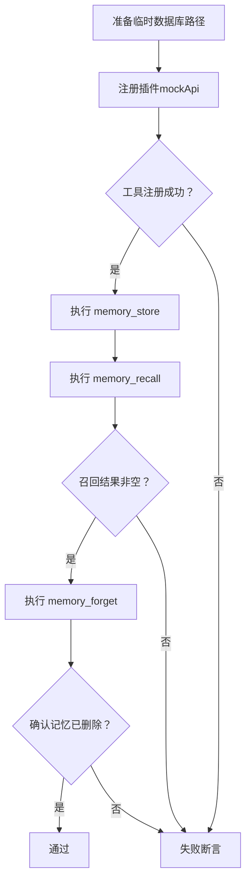
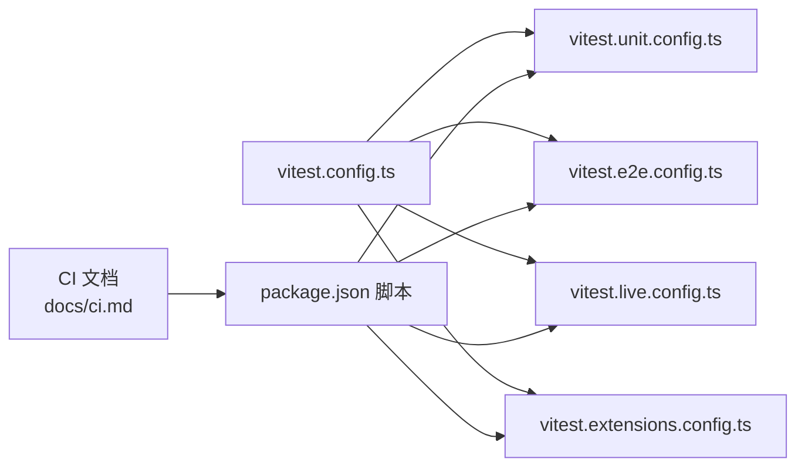

# 插件测试与调试

<cite>
**本文引用的文件**
- [vitest.config.ts](file://vitest.config.ts)
- [vitest.unit.config.ts](file://vitest.unit.config.ts)
- [vitest.e2e.config.ts](file://vitest.e2e.config.ts)
- [vitest.live.config.ts](file://vitest.live.config.ts)
- [vitest.extensions.config.ts](file://vitest.extensions.config.ts)
- [package.json](file://package.json)
- [test/setup.ts](file://test/setup.ts)
- [test/test-env.ts](file://test/test-env.ts)
- [test/global-setup.ts](file://test/global-setup.ts)
- [src/plugins/loader.test.ts](file://src/plugins/loader.test.ts)
- [src/plugins/discovery.test.ts](file://src/plugins/discovery.test.ts)
- [src/plugins/config-state.ts](file://src/plugins/config-state.ts)
- [src/gateway/server.agent.gateway-server-agent-b.e2e.test.ts](file://src/gateway/server.agent.gateway-server-agent-b.e2e.test.ts)
- [src/gateway/test-helpers.mocks.ts](file://src/gateway/test-helpers.mocks.ts)
- [extensions/memory-lancedb/index.test.ts](file://extensions/memory-lancedb/index.test.ts)
- [extensions/google-gemini-cli-auth/oauth.test.ts](file://extensions/google-gemini-cli-auth/oauth.test.ts)
- [src/security/audit.ts](file://src/security/audit.ts)
- [src/commands/status.command.ts](file://src/commands/status.command.ts)
- [docs/ci.md](file://docs/ci.md)
- [docs/zh-CN/help/testing.md](file://docs/zh-CN/help/testing.md)
</cite>

## 目录

1. [简介](#简介)
2. [项目结构](#项目结构)
3. [核心组件](#核心组件)
4. [架构总览](#架构总览)
5. [详细组件分析](#详细组件分析)
6. [依赖关系分析](#依赖关系分析)
7. [性能考量](#性能考量)
8. [故障排查指南](#故障排查指南)
9. [结论](#结论)
10. [附录](#附录)

## 简介

本指南面向 OpenClaw 插件的测试与调试，覆盖单元测试、集成测试、端到端测试与性能测试的实施策略；提供测试框架与模拟环境的使用方法；记录调试工具、日志分析与错误诊断流程；明确测试覆盖率门槛、持续集成配置与自动化测试流程；并给出性能监控、内存泄漏检测与安全审计的测试方法，以及发布前质量保证与回归测试策略。

## 项目结构

OpenClaw 采用 Vitest 作为测试框架，并通过多份 Vitest 配置文件区分不同测试类型：

- 单元测试：默认配置与独立的 unit 配置，排除 e2e/live 与部分集成面
- 集成测试：按模块划分的配置（如 gateway、extensions）
- 端到端测试：独立 e2e 配置，限定包含 e2e 测试文件
- 实时测试：独立 live 配置，串行执行，便于外部服务交互
- 覆盖率：基于 v8 提供器，设定行/函数/分支/语句阈值

图表来源

- [vitest.config.ts](file://vitest.config.ts#L12-L104)
- [vitest.unit.config.ts](file://vitest.unit.config.ts#L1-L19)
- [vitest.e2e.config.ts](file://vitest.e2e.config.ts#L1-L20)
- [vitest.live.config.ts](file://vitest.live.config.ts#L1-L15)
- [vitest.extensions.config.ts](file://vitest.extensions.config.ts#L1-L14)
- [package.json](file://package.json#L82-L108)

章节来源

- [vitest.config.ts](file://vitest.config.ts#L12-L104)
- [vitest.unit.config.ts](file://vitest.unit.config.ts#L1-L19)
- [vitest.e2e.config.ts](file://vitest.e2e.config.ts#L1-L20)
- [vitest.live.config.ts](file://vitest.live.config.ts#L1-L15)
- [vitest.extensions.config.ts](file://vitest.extensions.config.ts#L1-L14)
- [package.json](file://package.json#L82-L108)

## 核心组件

- 测试框架与配置
  - 默认 Vitest 配置定义超时、进程池、并发与覆盖率阈值
  - 分类配置文件分别控制单元、e2e、live、扩展测试的 include/exclude
- 测试环境隔离
  - 全局 setup 注入插件注册表、通道适配器桩、警告过滤
  - 测试环境安装器隔离 HOME/XDG 目录，避免污染真实状态
- 插件系统测试
  - 加载器与发现测试验证插件加载、清单与状态目录解析
  - 配置状态在测试环境下自动禁用默认内存槽位，确保可控
- 端到端与实时测试
  - e2e 测试通过 mock 注入插件注册表，模拟网关插件加载
  - live 测试通过环境变量启用真实外部服务调用
- 安全审计与状态命令
  - 安全审计报告结构化输出，支持严重级别汇总与修复建议展示

章节来源

- [vitest.config.ts](file://vitest.config.ts#L18-L104)
- [test/setup.ts](file://test/setup.ts#L1-L169)
- [test/test-env.ts](file://test/test-env.ts#L54-L148)
- [src/plugins/loader.test.ts](file://src/plugins/loader.test.ts#L1-L44)
- [src/plugins/discovery.test.ts](file://src/plugins/discovery.test.ts#L1-L47)
- [src/plugins/config-state.ts](file://src/plugins/config-state.ts#L150-L195)
- [src/gateway/server.agent.gateway-server-agent-b.e2e.test.ts](file://src/gateway/server.agent.gateway-server-agent-b.e2e.test.ts#L39-L86)
- [src/security/audit.ts](file://src/security/audit.ts#L36-L86)
- [src/commands/status.command.ts](file://src/commands/status.command.ts#L419-L454)

## 架构总览

OpenClaw 的测试体系围绕“隔离环境 + 多层次测试 + 结构化报告”展开，如下图所示：

图表来源

- [test/setup.ts](file://test/setup.ts#L1-L169)
- [test/test-env.ts](file://test/test-env.ts#L54-L148)
- [vitest.unit.config.ts](file://vitest.unit.config.ts#L1-L19)
- [vitest.e2e.config.ts](file://vitest.e2e.config.ts#L1-L20)
- [vitest.live.config.ts](file://vitest.live.config.ts#L1-L15)
- [vitest.extensions.config.ts](file://vitest.extensions.config.ts#L1-L14)
- [src/plugins/loader.test.ts](file://src/plugins/loader.test.ts#L1-L44)
- [src/plugins/discovery.test.ts](file://src/plugins/discovery.test.ts#L1-L47)
- [src/plugins/config-state.ts](file://src/plugins/config-state.ts#L150-L195)
- [src/gateway/server.agent.gateway-server-agent-b.e2e.test.ts](file://src/gateway/server.agent.gateway-server-agent-b.e2e.test.ts#L39-L86)

## 详细组件分析

### 单元测试：插件加载与发现

- 目标
  - 验证插件加载器对临时目录与 openclaw.plugin.json 的处理
  - 验证插件发现逻辑在自定义状态目录下的行为
- 关键点
  - 使用临时目录与 JSON 清单模拟插件包
  - 通过环境变量切换状态目录与内置插件目录，重置模块缓存
- 建议
  - 为每个插件编写最小可运行的 openclaw.plugin.json 与空实现，确保加载路径正确
  - 对异常场景（缺失清单、非法 schema）进行断言

图表来源

- [src/plugins/loader.test.ts](file://src/plugins/loader.test.ts#L14-L44)
- [src/plugins/discovery.test.ts](file://src/plugins/discovery.test.ts#L9-L37)

章节来源

- [src/plugins/loader.test.ts](file://src/plugins/loader.test.ts#L1-L44)
- [src/plugins/discovery.test.ts](file://src/plugins/discovery.test.ts#L1-L47)

### 单元测试：扩展插件（以 Google Gemini CLI 认证为例）

- 目标
  - 验证从 gemini CLI 二进制定位 oauth2.js 并提取客户端凭据
  - 验证缓存机制与边界条件（PATH 不存在、文件缺失、无凭据）
- 关键点
  - 使用 Vitest mock 替换 fs 模块，控制文件存在性与读取内容
  - 通过 clearCredentialsCache 清理缓存，确保多次调用一致性
- 建议
  - 为不同平台与安装路径编写多组用例
  - 对 PATH 解析大小写与斜杠差异进行兼容性测试

图表来源

- [extensions/google-gemini-cli-auth/oauth.test.ts](file://extensions/google-gemini-cli-auth/oauth.test.ts#L10-L239)

章节来源

- [extensions/google-gemini-cli-auth/oauth.test.ts](file://extensions/google-gemini-cli-auth/oauth.test.ts#L1-L241)

### 端到端测试：网关与插件注册表

- 目标
  - 验证 e2e 测试中通过 hoisted mock 注入插件注册表，绕过真实加载过程
  - 验证 e2e 测试在不同通道下的注册表构造
- 关键点
  - 使用 vi.hoisted 创建注册表快照并在模块加载前注入
  - 通过 mock 的 loadGatewayPlugins 返回固定注册表与基础方法列表
- 建议
  - 将 e2e 测试拆分为“纯逻辑 e2e”和“带外部服务”的 live 子集
  - 对注册表变更进行回归测试，防止钩子/命令注册遗漏

图表来源

- [src/gateway/server.agent.gateway-server-agent-b.e2e.test.ts](file://src/gateway/server.agent.gateway-server-agent-b.e2e.test.ts#L44-L70)
- [src/gateway/test-helpers.mocks.ts](file://src/gateway/test-helpers.mocks.ts#L148-L193)

章节来源

- [src/gateway/server.agent.gateway-server-agent-b.e2e.test.ts](file://src/gateway/server.agent.gateway-server-agent-b.e2e.test.ts#L39-L86)
- [src/gateway/test-helpers.mocks.ts](file://src/gateway/test-helpers.mocks.ts#L148-L193)

### 实时测试：内存插件（LanceDB）

- 目标
  - 验证配置 schema 解析、环境变量替换、捕获规则与分类逻辑
  - 在具备真实密钥时，验证工具注册、存储/召回/遗忘的端到端流程
- 关键点
  - 使用 describeLive 条件执行 live 子集
  - 通过 mockApi 注入注册工具、CLI、服务与钩子回调
- 建议
  - 将 live 测试标记为可选，避免 CI 中不必要的外部依赖
  - 对网络波动与速率限制进行重试与降级处理

图表来源

- [extensions/memory-lancedb/index.test.ts](file://extensions/memory-lancedb/index.test.ts#L121-L253)

章节来源

- [extensions/memory-lancedb/index.test.ts](file://extensions/memory-lancedb/index.test.ts#L1-L254)

### 测试环境与隔离

- 全局 setup
  - 设置 VITEST 标记、安装进程警告过滤、注入测试插件注册表
  - 提供通道适配器桩，屏蔽真实发送逻辑
- 测试环境安装器
  - 将 HOME/XDG\_\* 重定向至临时目录，隔离配置与状态
  - 支持 live 模式直接复用用户真实环境（加载 ~/.profile）
- 配置状态在测试中的特殊处理
  - 若未显式配置内存槽位或条目，则在测试环境下默认禁用内存插件槽位

章节来源

- [test/setup.ts](file://test/setup.ts#L1-L169)
- [test/test-env.ts](file://test/test-env.ts#L54-L148)
- [src/plugins/config-state.ts](file://src/plugins/config-state.ts#L150-L195)

## 依赖关系分析

- 测试配置依赖
  - 默认配置为其他配置的基础，unit/e2e/live/extensions 通过 include/exclude 继承
  - 单元测试排除 e2e/live 与大量集成面，聚焦核心业务逻辑
- 脚本与任务
  - package.json 提供统一入口：test、test:fast、test:e2e、test:live、test:docker:\* 等
  - CI 文档描述作业分层与跳过策略，减少无关变更的测试成本

图表来源

- [vitest.config.ts](file://vitest.config.ts#L12-L104)
- [vitest.unit.config.ts](file://vitest.unit.config.ts#L1-L19)
- [vitest.e2e.config.ts](file://vitest.e2e.config.ts#L1-L20)
- [vitest.live.config.ts](file://vitest.live.config.ts#L1-L15)
- [vitest.extensions.config.ts](file://vitest.extensions.config.ts#L1-L14)
- [package.json](file://package.json#L82-L108)
- [docs/ci.md](file://docs/ci.md#L1-L25)

章节来源

- [vitest.config.ts](file://vitest.config.ts#L12-L104)
- [package.json](file://package.json#L82-L108)
- [docs/ci.md](file://docs/ci.md#L1-L25)

## 性能考量

- 测试并发与资源
  - 默认配置根据 CI/本地 CPU 数量动态设置最大 worker 数
  - e2e 测试在 CI 固定为 2 个 worker，避免资源争用
- 覆盖率门槛
  - 行/函数/分支/语句阈值分别为 70%/70%/55%/70%
  - 排除入口、CLI、网关服务器桥接等难以单元测试的表面层
- 性能测试建议
  - 使用 Vitest 的计时与并发特性，结合基准测试脚本评估关键路径
  - 对外部服务调用引入超时与重试，避免单点阻塞影响整体吞吐

章节来源

- [vitest.config.ts](file://vitest.config.ts#L7-L23)
- [vitest.e2e.config.ts](file://vitest.e2e.config.ts#L5-L7)

## 故障排查指南

- 日志与调试
  - 使用状态命令输出安全审计摘要与严重级别排序的发现项
  - 通过测试环境安装器隔离真实状态，避免污染与端到端干扰
- 常见问题
  - 插件未加载：检查 openclaw.plugin.json 是否存在、schema 是否匹配
  - 环境变量未生效：确认测试环境安装器未清理相关变量，或在 live 模式下正确加载 ~/.profile
  - e2e 注册表异常：确认 hoisted 注册表已在模块加载前注入
- 回归测试
  - 将实时测试收敛为最小可重复场景，必要时通过环境变量开关
  - 对关键转换/请求形状变化，优先在单元/集成层添加模拟测试

章节来源

- [src/commands/status.command.ts](file://src/commands/status.command.ts#L419-L454)
- [test/test-env.ts](file://test/test-env.ts#L54-L148)
- [src/gateway/server.agent.gateway-server-agent-b.e2e.test.ts](file://src/gateway/server.agent.gateway-server-agent-b.e2e.test.ts#L44-L70)
- [docs/zh-CN/help/testing.md](file://docs/zh-CN/help/testing.md#L367-L376)

## 结论

OpenClaw 的测试体系通过“隔离环境 + 多层次测试 + 结构化报告”实现了对插件系统的全面保障。建议在日常开发中优先编写单元与集成测试，将对外部服务的强依赖收敛为可选的实时测试；在发布前执行端到端与安全审计，确保质量门槛与回归稳定性。

## 附录

### 测试覆盖率与阈值

- 覆盖率提供器：v8
- 报告器：text、lcov
- 阈值（单元测试）：行 70%、函数 70%、分支 55%、语句 70%
- 排除范围：入口、CLI、网关服务器桥接、交互式 UI、频道表面等

章节来源

- [vitest.config.ts](file://vitest.config.ts#L35-L102)

### 持续集成与自动化

- CI 作业概览：文档变更检测、变更范围判定、类型检查、代码与格式检查、构建产物、检查与测试、平台特定测试、macOS Swift 检查等
- 自动化脚本：统一通过 package.json 脚本编排，支持并行与串行组合

章节来源

- [docs/ci.md](file://docs/ci.md#L1-L25)
- [package.json](file://package.json#L82-L108)

### 安全审计与报告

- 审计报告结构：包含严重级别统计、具体发现与修复建议
- 命令输出：按严重级别排序，突出关键问题并提供简短详情

章节来源

- [src/security/audit.ts](file://src/security/audit.ts#L36-L86)
- [src/commands/status.command.ts](file://src/commands/status.command.ts#L419-L454)
