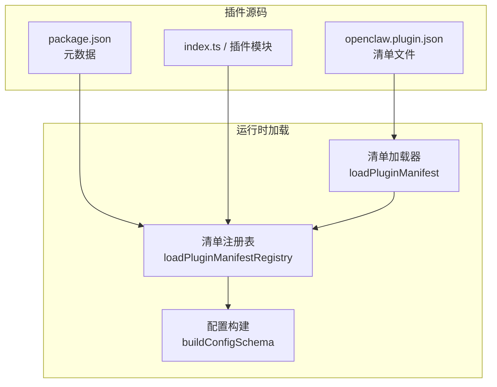
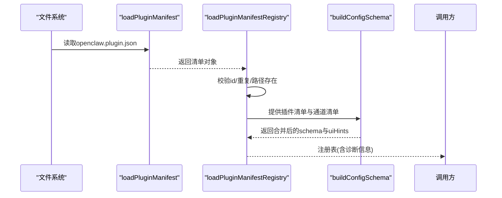
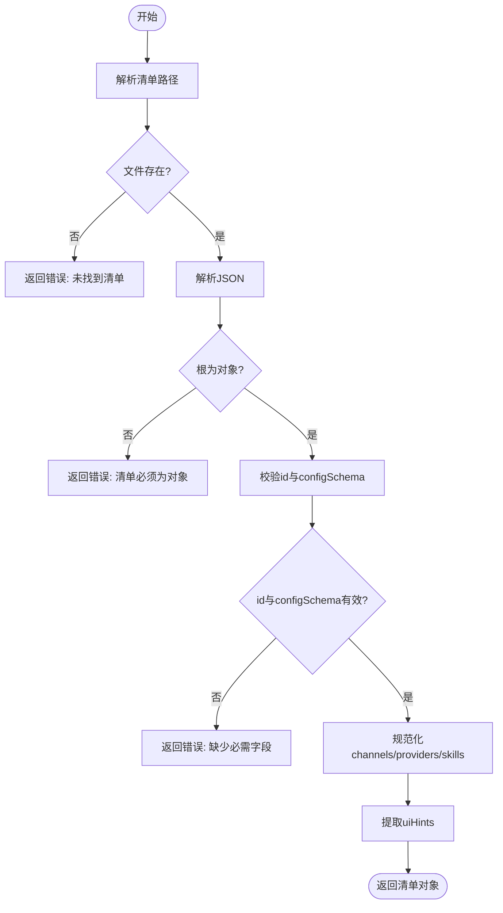
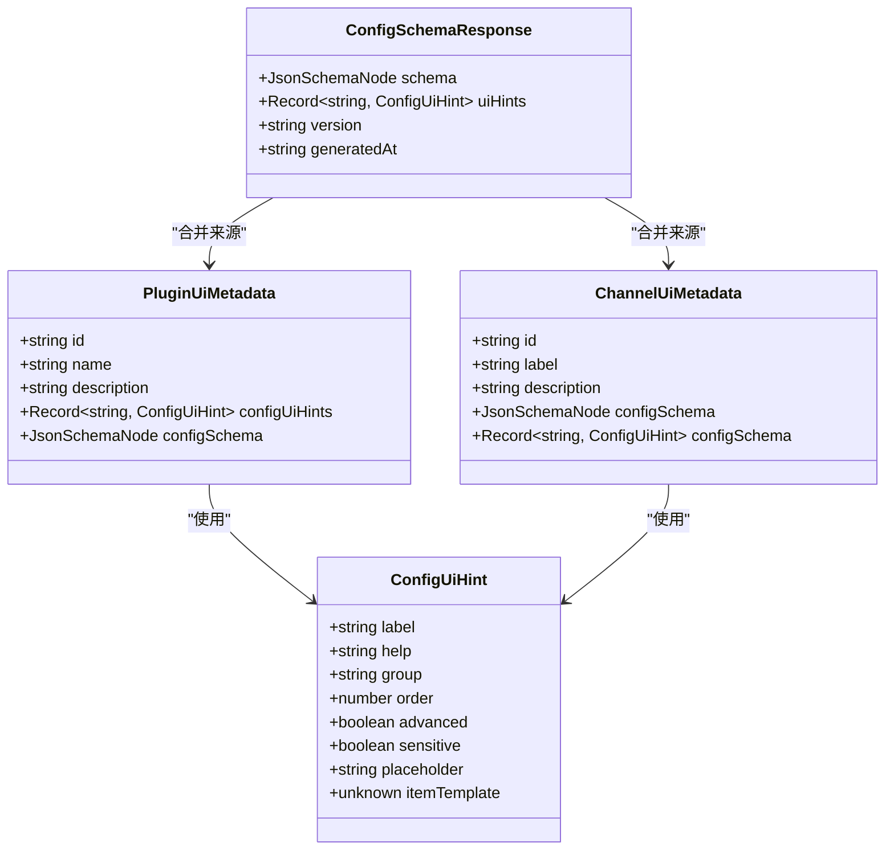
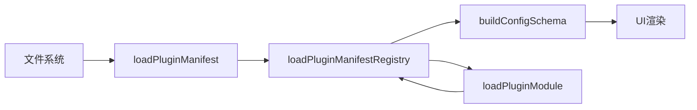

# 插件清单配置

<cite>
**本文引用的文件**
- [src/plugins/manifest.ts](file://src/plugins/manifest.ts)
- [src/plugins/manifest-registry.ts](file://src/plugins/manifest-registry.ts)
- [src/plugins/loader.ts](file://src/plugins/loader.ts)
- [src/config/schema.ts](file://src/config/schema.ts)
- [src/gateway/protocol/schema/config.ts](file://src/gateway/protocol/schema/config.ts)
- [src/plugins/types.ts](file://src/plugins/types.ts)
- [extensions/discord/openclaw.plugin.json](file://extensions/discord/openclaw.plugin.json)
- [extensions/telegram/openclaw.plugin.json](file://extensions/telegram/openclaw.plugin.json)
- [extensions/lobster/openclaw.plugin.json](file://extensions/lobster/openclaw.plugin.json)
- [extensions/memory-core/openclaw.plugin.json](file://extensions/memory-core/openclaw.plugin.json)
- [extensions/feishu/openclaw.plugin.json](file://extensions/feishu/openclaw.plugin.json)
- [extensions/lobster/package.json](file://extensions/lobster/package.json)
</cite>

## 目录

1. [简介](#简介)
2. [项目结构](#项目结构)
3. [核心组件](#核心组件)
4. [架构总览](#架构总览)
5. [详细组件分析](#详细组件分析)
6. [依赖关系分析](#依赖关系分析)
7. [性能考量](#性能考量)
8. [故障排查指南](#故障排查指南)
9. [结论](#结论)
10. [附录](#附录)

## 简介

本文件面向OpenClaw插件作者与维护者，系统化阐述openclaw.plugin.json插件清单的完整结构、字段定义、验证规则与集成方式，并覆盖插件标识符、版本管理、依赖声明、插件类型(kind)、渠道(channel)、提供商(provider)、技能(skill)、UI提示(uiHints)、配置模式(schema)、用户界面定制、package.json元数据与onboarding/catalog支持，以及配置验证、错误处理与兼容性检查等关键主题。

## 项目结构

OpenClaw将插件清单与插件实现解耦：每个插件目录下通过openclaw.plugin.json声明清单，通过package.json提供元数据（用于onboarding/catalog），并通过TypeScript模块导出插件实现。运行时通过清单加载器解析清单并构建配置schema与UI提示，最终参与全局配置schema的合并与渲染。

图表来源

- [src/plugins/manifest.ts](file://src/plugins/manifest.ts#L44-L100)
- [src/plugins/manifest-registry.ts](file://src/plugins/manifest-registry.ts#L109-L200)
- [src/config/schema.ts](file://src/config/schema.ts#L313-L335)

章节来源

- [src/plugins/manifest.ts](file://src/plugins/manifest.ts#L1-L152)
- [src/plugins/manifest-registry.ts](file://src/plugins/manifest-registry.ts#L1-L200)
- [src/config/schema.ts](file://src/config/schema.ts#L45-L335)

## 核心组件

- 清单模型与加载
  - 清单类型定义包含必需字段id与configSchema，以及可选字段kind、channels、providers、skills、name、description、version、uiHints。
  - 加载器负责定位清单文件、解析JSON、校验必需字段、规范化列表字段、提取uiHints。
- 清单注册表
  - 遍历候选插件，逐个加载清单，进行id一致性与重复性诊断，构建记录并缓存。
- 配置schema与UI提示
  - 将插件清单中的configSchema与uiHints合并到全局配置schema中，生成ConfigSchemaResponse，供前端或CLI渲染使用。
- 插件模块加载
  - 按清单记录加载模块，进行导出一致性校验与错误诊断。

章节来源

- [src/plugins/manifest.ts](file://src/plugins/manifest.ts#L10-L21)
- [src/plugins/manifest.ts](file://src/plugins/manifest.ts#L44-L100)
- [src/plugins/manifest-registry.ts](file://src/plugins/manifest-registry.ts#L81-L107)
- [src/config/schema.ts](file://src/config/schema.ts#L65-L131)
- [src/plugins/loader.ts](file://src/plugins/loader.ts#L297-L326)

## 架构总览

下图展示从清单文件到全局配置schema的关键流程：清单解析、注册表构建、schema与UI提示合并、以及错误诊断。

图表来源

- [src/plugins/manifest.ts](file://src/plugins/manifest.ts#L44-L100)
- [src/plugins/manifest-registry.ts](file://src/plugins/manifest-registry.ts#L143-L200)
- [src/config/schema.ts](file://src/config/schema.ts#L313-L335)

## 详细组件分析

### openclaw.plugin.json 清单结构与字段定义

- 必需字段
  - id: 字符串，插件唯一标识；必须非空且去空白。
  - configSchema: 对象，遵循JSON Schema规范，作为插件配置的验证与UI生成依据。
- 可选字段
  - name/description/version: 字符串，用于UI显示与版本管理。
  - kind: 字符串，限定插件类型，如memory。
  - channels/providers/skills: 字符串数组，声明该插件所涉及的渠道、提供商与技能路径。
  - uiHints: 记录，键为相对路径，值为UI提示项，影响表单项标签、帮助文本、占位符、敏感信息标记等。
- 兼容性与命名
  - 支持通过兼容键名解析清单文件，确保历史兼容。

章节来源

- [src/plugins/manifest.ts](file://src/plugins/manifest.ts#L10-L21)
- [src/plugins/manifest.ts](file://src/plugins/manifest.ts#L62-L96)

### 清单加载与验证流程

- 路径解析与存在性检查
  - 定位清单文件，若不存在则返回错误。
- JSON解析与类型校验
  - 解析失败或根不是对象则报错。
- 必需字段校验
  - id与configSchema必须存在且有效。
- 可选字段规范化
  - channels/providers/skills统一转为字符串数组并去空白。
- uiHints提取
  - 若存在则直接提取，供后续UI提示合并使用。

图表来源

- [src/plugins/manifest.ts](file://src/plugins/manifest.ts#L44-L100)

章节来源

- [src/plugins/manifest.ts](file://src/plugins/manifest.ts#L44-L100)

### 清单注册表与诊断

- 候选扫描与发现
  - 通过插件发现器收集候选，或使用传入的候选集合。
- 逐个加载与校验
  - 加载清单、对比id、检测重复id、记录诊断信息。
- 缓存策略
  - 基于工作区与配置的缓存键，结合环境变量控制缓存TTL与禁用。
- 记录构建
  - 组装包含id、名称、描述、版本、类型、渠道、提供商、技能、来源、清单路径、schema缓存键、configSchema与uiHints的记录。

章节来源

- [src/plugins/manifest-registry.ts](file://src/plugins/manifest-registry.ts#L109-L200)
- [src/plugins/manifest-registry.ts](file://src/plugins/manifest-registry.ts#L33-L74)

### 配置schema与UI提示合并

- 合并策略
  - 将插件清单中的configSchema与uiHints与基础schema合并，生成最终的ConfigSchemaResponse。
- UI提示应用
  - 为插件入口、启用开关、配置块设置默认标签与帮助文本，并按插件提供的uiHints覆盖具体字段。
- 类型约束
  - UI提示类型包含label、help、group、order、advanced、sensitive、placeholder、itemTemplate等字段。

图表来源

- [src/config/schema.ts](file://src/config/schema.ts#L65-L131)
- [src/gateway/protocol/schema/config.ts](file://src/gateway/protocol/schema/config.ts#L48-L70)

章节来源

- [src/config/schema.ts](file://src/config/schema.ts#L45-L131)
- [src/gateway/protocol/schema/config.ts](file://src/gateway/protocol/schema/config.ts#L48-L70)

### 插件模块加载与一致性校验

- 动态加载
  - 使用jit加载器按候选来源动态加载模块。
- 导出解析
  - 解析模块导出，获取插件定义与注册函数。
- 一致性校验
  - 若清单id与模块导出id不一致，记录警告诊断。

章节来源

- [src/plugins/loader.ts](file://src/plugins/loader.ts#L297-L326)

### 字段详解与配置方法

#### 插件标识符与版本管理

- id
  - 必填，用于唯一标识插件；加载器会去除首尾空白并要求非空。
- name/description/version
  - 可选，用于UI显示与版本管理；加载器会去除首尾空白并过滤空值。
- 版本建议
  - 建议采用语义化版本或日期版本，便于在UI与诊断中识别。

章节来源

- [src/plugins/manifest.ts](file://src/plugins/manifest.ts#L62-L96)

#### 插件类型(kind)

- 支持的类型
  - memory：内存类插件。
- 用途
  - 影响插件分类与可能的运行时行为。

章节来源

- [src/plugins/types.ts](file://src/plugins/types.ts#L37-L37)
- [extensions/memory-core/openclaw.plugin.json](file://extensions/memory-core/openclaw.plugin.json#L1-L10)

#### 渠道(channel)与提供商(provider)

- channels/providers
  - 字符串数组，声明该插件所涉及的渠道与提供商标识。
- 作用
  - 用于路由、权限与UI分组展示。

章节来源

- [src/plugins/manifest.ts](file://src/plugins/manifest.ts#L75-L77)
- [extensions/discord/openclaw.plugin.json](file://extensions/discord/openclaw.plugin.json#L1-L10)
- [extensions/telegram/openclaw.plugin.json](file://extensions/telegram/openclaw.plugin.json#L1-L10)

#### 技能(skill)

- skills
  - 字符串数组，指向技能目录路径。
- 用途
  - 使插件具备特定领域的技能能力。

章节来源

- [src/plugins/manifest.ts](file://src/plugins/manifest.ts#L77-L77)
- [extensions/feishu/openclaw.plugin.json](file://extensions/feishu/openclaw.plugin.json#L1-L11)

#### UI提示(uiHints)与配置模式(schema)

- uiHints
  - 键为配置路径的相对表达，值包含label、help、advanced、sensitive、placeholder等。
- configSchema
  - JSON Schema对象，用于配置校验与UI生成。
- 合并规则
  - 插件级uiHints与schema由运行时合并到全局schema中，形成最终的ConfigSchemaResponse。

章节来源

- [src/plugins/manifest.ts](file://src/plugins/manifest.ts#L19-L21)
- [src/plugins/manifest.ts](file://src/plugins/manifest.ts#L79-L82)
- [src/config/schema.ts](file://src/config/schema.ts#L65-L131)

#### package.json 元数据与onboarding/catalog支持

- openclaw字段
  - extensions: 字符串或字符串数组，声明插件入口模块。
  - channel: 描述渠道元信息（如label、aliases、preferOver等），用于onboarding与选择器。
  - install: 安装偏好（npmSpec、localPath、defaultChoice）。
- 用途
  - 用于插件安装、渠道选择、快速开始与文档链接。

章节来源

- [extensions/lobster/package.json](file://extensions/lobster/package.json#L1-L15)
- [src/plugins/manifest.ts](file://src/plugins/manifest.ts#L102-L151)

### 示例与最佳实践

- 最小清单
  - 至少包含id与configSchema。
- 带名称与描述
  - 增强UI可读性。
- 声明渠道/提供商/技能
  - 明确插件边界与能力范围。
- 提供uiHints
  - 为关键配置项提供label与help，必要时标记sensitive与advanced。

章节来源

- [extensions/discord/openclaw.plugin.json](file://extensions/discord/openclaw.plugin.json#L1-L10)
- [extensions/telegram/openclaw.plugin.json](file://extensions/telegram/openclaw.plugin.json#L1-L10)
- [extensions/lobster/openclaw.plugin.json](file://extensions/lobster/openclaw.plugin.json#L1-L11)
- [extensions/feishu/openclaw.plugin.json](file://extensions/feishu/openclaw.plugin.json#L1-L11)

## 依赖关系分析

- 清单加载依赖文件系统与JSON解析。
- 清单注册表依赖清单加载器与插件发现器。
- 配置schema合并依赖TypeBox/JSON Schema与运行时类型定义。
- 插件模块加载依赖动态加载器与导出解析。

图表来源

- [src/plugins/manifest.ts](file://src/plugins/manifest.ts#L44-L100)
- [src/plugins/manifest-registry.ts](file://src/plugins/manifest-registry.ts#L109-L200)
- [src/config/schema.ts](file://src/config/schema.ts#L313-L335)
- [src/plugins/loader.ts](file://src/plugins/loader.ts#L297-L326)

章节来源

- [src/plugins/manifest.ts](file://src/plugins/manifest.ts#L1-L152)
- [src/plugins/manifest-registry.ts](file://src/plugins/manifest-registry.ts#L1-L200)
- [src/config/schema.ts](file://src/config/schema.ts#L1-L335)
- [src/plugins/loader.ts](file://src/plugins/loader.ts#L1-L392)

## 性能考量

- 清单缓存
  - 通过环境变量控制缓存TTL与禁用，避免频繁读取与解析。
- 合并开销
  - 大量插件时，schema与uiHints合并可能带来CPU与内存开销，建议合理拆分插件与延迟初始化。
- I/O优化
  - 批量读取与缓存清单路径与修改时间戳，减少stat调用。

章节来源

- [src/plugins/manifest-registry.ts](file://src/plugins/manifest-registry.ts#L37-L74)
- [src/plugins/manifest-registry.ts](file://src/plugins/manifest-registry.ts#L193-L198)

## 故障排查指南

- 常见错误
  - 清单未找到：检查清单文件是否存在与路径正确。
  - JSON解析失败：检查JSON语法与字符编码。
  - 缺少必需字段：确保id与configSchema存在。
  - id不一致：检查清单id与模块导出id是否一致。
  - 重复id：避免多个插件使用相同id。
- 诊断信息
  - 运行时会记录level为error或warn的诊断条目，包含插件id、source与message。
- 建议
  - 在开发阶段开启详细日志，逐步定位问题；对configSchema进行单元测试，确保与UI提示一致。

章节来源

- [src/plugins/manifest.ts](file://src/plugins/manifest.ts#L46-L61)
- [src/plugins/manifest-registry.ts](file://src/plugins/manifest-registry.ts#L145-L173)
- [src/plugins/loader.ts](file://src/plugins/loader.ts#L297-L326)

## 结论

openclaw.plugin.json提供了清晰、可扩展的插件清单模型，配合package.json元数据与运行时schema合并机制，实现了从清单到UI的全链路配置体验。遵循本文档的字段定义、验证规则与最佳实践，可显著提升插件的可维护性、可发现性与用户体验。

## 附录

### 字段对照表

- id: 必填，字符串，插件唯一标识。
- name/description/version: 可选，字符串，UI显示与版本管理。
- kind: 可选，字符串，插件类型（如memory）。
- channels/providers/skills: 可选，字符串数组，渠道/提供商/技能声明。
- configSchema: 必填，对象，JSON Schema配置。
- uiHints: 可选，记录，UI提示键值对。
- openclaw.extensions: 可选，字符串或数组，插件入口模块。
- openclaw.channel.\*: 可选，渠道元信息，用于onboarding与选择器。
- openclaw.install: 可选，安装偏好配置。

章节来源

- [src/plugins/manifest.ts](file://src/plugins/manifest.ts#L10-L21)
- [src/plugins/manifest.ts](file://src/plugins/manifest.ts#L102-L151)
- [extensions/lobster/package.json](file://extensions/lobster/package.json#L1-L15)
