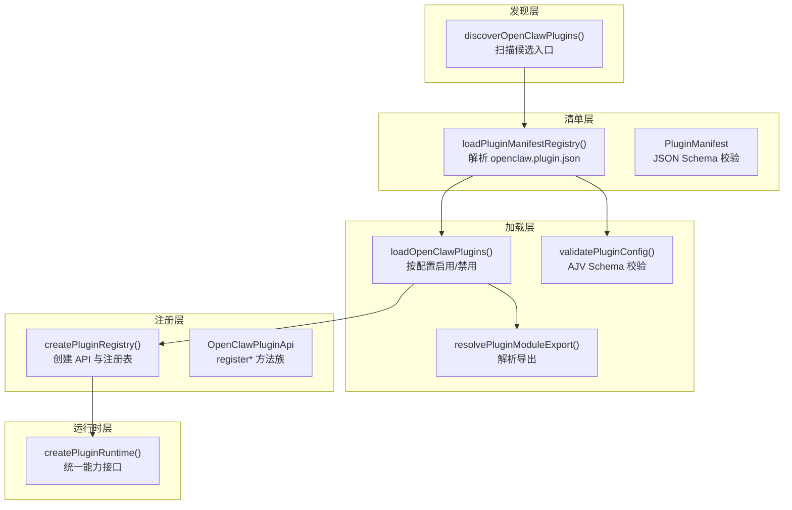
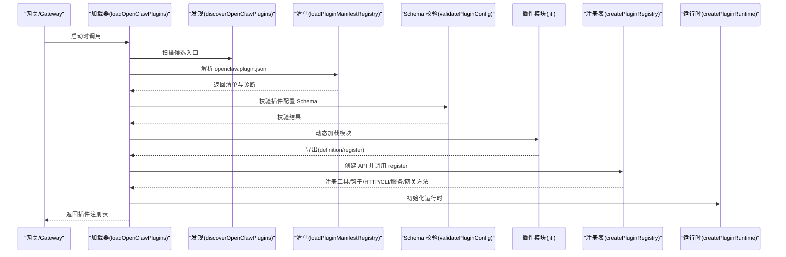
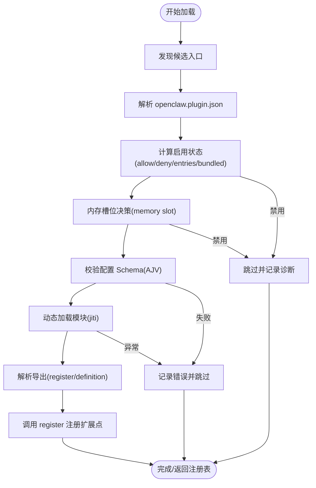
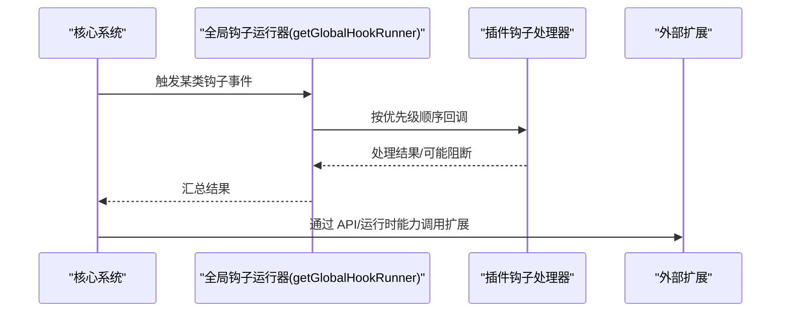
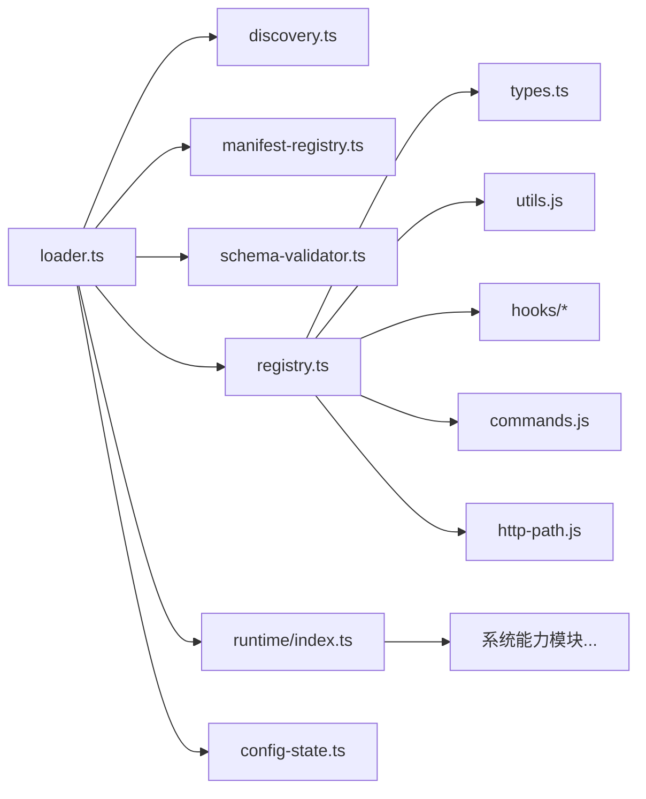

# 插件系统架构

<cite>
**本文引用的文件**
- [loader.ts](file://src/plugins/loader.ts)
- [discovery.ts](file://src/plugins/discovery.ts)
- [registry.ts](file://src/plugins/registry.ts)
- [types.ts](file://src/plugins/types.ts)
- [config-state.ts](file://src/plugins/config-state.ts)
- [schema-validator.ts](file://src/plugins/schema-validator.ts)
- [manifest.ts](file://src/plugins/manifest.ts)
- [manifest-registry.ts](file://src/plugins/manifest-registry.ts)
- [runtime/index.ts](file://src/plugins/runtime/index.ts)
- [hook-runner-global.ts](file://src/plugins/hook-runner-global.ts)
- [config-reload.ts](file://src/gateway/config-reload.ts)
- [server-reload-handlers.ts](file://src/gateway/server-reload-handlers.ts)
- [memory-core/index.ts](file://extensions/memory-core/index.ts)
- [voice-call/index.ts](file://extensions/voice-call/index.ts)
- [plugins/manifest.md](file://docs/plugins/manifest.md)
</cite>

## 目录

1. [简介](#简介)
2. [项目结构](#项目结构)
3. [核心组件](#核心组件)
4. [架构总览](#架构总览)
5. [详细组件分析](#详细组件分析)
6. [依赖关系分析](#依赖关系分析)
7. [性能考量](#性能考量)
8. [故障排查指南](#故障排查指南)
9. [结论](#结论)
10. [附录](#附录)

## 简介

本文件系统化阐述 OpenClaw 插件系统的整体设计理念、核心组件与架构模式，覆盖插件生命周期管理、注册机制、依赖注入与模块加载策略；同时记录安全模型（沙箱与权限控制）、扩展点设计、中间件架构与事件驱动机制，并给出技术决策、性能考量、可扩展性设计、版本兼容性、热重载与故障隔离策略等实践建议。

## 项目结构

OpenClaw 插件系统由“发现—清单—加载—注册—运行时”五层构成：

- 发现层：扫描工作区、全局与内置扩展目录，收集候选插件入口。
- 清单层：解析 openclaw.plugin.json，构建清单缓存与校验。
- 加载层：按配置启用/禁用，校验 JSON Schema 配置，动态加载模块。
- 注册层：通过插件 API 注册工具、钩子、HTTP 路由、CLI 命令、服务、网关方法等。
- 运行时层：提供统一能力接口（配置读写、系统命令、媒体处理、通道能力、日志、状态目录等）。



图示来源

- [discovery.ts](file://src/plugins/discovery.ts#L301-L365)
- [manifest-registry.ts](file://src/plugins/manifest-registry.ts#L143-L200)
- [loader.ts](file://src/plugins/loader.ts#L170-L457)
- [schema-validator.ts](file://src/plugins/schema-validator.ts#L27-L45)
- [registry.ts](file://src/plugins/registry.ts#L146-L516)
- [runtime/index.ts](file://src/plugins/runtime/index.ts#L165-L361)

章节来源

- [discovery.ts](file://src/plugins/discovery.ts#L1-L365)
- [manifest-registry.ts](file://src/plugins/manifest-registry.ts#L1-L200)
- [loader.ts](file://src/plugins/loader.ts#L1-L457)
- [registry.ts](file://src/plugins/registry.ts#L1-L516)
- [runtime/index.ts](file://src/plugins/runtime/index.ts#L1-L361)

## 核心组件

- 插件定义与类型
  - 定义插件标识、名称、描述、版本、种类（如 memory）、配置 Schema、注册函数等。
  - 提供 OpenClawPluginApi，作为插件注册扩展点的唯一入口。
- 插件注册表
  - 统一维护已加载插件记录、工具、钩子、HTTP 路由、CLI、服务、网关方法、命令等。
- 插件运行时
  - 汇聚系统能力（配置读写、命令执行、媒体处理、通道能力、日志、状态目录等），以能力域分组暴露。
- 配置状态与内存槽位
  - 归一化 plugins.\* 配置，决定启用/禁用、白名单/黑名单、加载路径、内存插件槽位等。
- 清单与 Schema 校验
  - openclaw.plugin.json 必须存在且包含 configSchema；Schema 在读写配置阶段即时校验，不执行插件代码即可发现问题。
- 全局钩子运行器
  - 插件加载完成后初始化全局钩子运行器，支持任意位置触发与监听。

章节来源

- [types.ts](file://src/plugins/types.ts#L229-L283)
- [registry.ts](file://src/plugins/registry.ts#L124-L138)
- [runtime/index.ts](file://src/plugins/runtime/index.ts#L165-L361)
- [config-state.ts](file://src/plugins/config-state.ts#L65-L195)
- [manifest.ts](file://src/plugins/manifest.ts#L10-L21)
- [hook-runner-global.ts](file://src/plugins/hook-runner-global.ts#L21-L36)

## 架构总览

插件系统采用“声明式清单 + 强约束 Schema + 可插拔注册 API”的架构。插件在加载期完成：

- 清单校验与缓存
- 配置 Schema 校验
- 动态模块加载与导出解析
- 通过 OpenClawPluginApi 注册各类扩展点
- 初始化全局钩子运行器



图示来源

- [loader.ts](file://src/plugins/loader.ts#L170-L457)
- [discovery.ts](file://src/plugins/discovery.ts#L301-L365)
- [manifest-registry.ts](file://src/plugins/manifest-registry.ts#L143-L200)
- [schema-validator.ts](file://src/plugins/schema-validator.ts#L27-L45)
- [registry.ts](file://src/plugins/registry.ts#L468-L516)
- [runtime/index.ts](file://src/plugins/runtime/index.ts#L165-L361)

## 详细组件分析

### 组件A：插件加载与生命周期

- 生命周期阶段
  - 发现阶段：从工作区、全局、内置目录扫描候选入口，支持 package.json 的 extensions 字段或 index.\* 文件。
  - 清单阶段：解析 openclaw.plugin.json，构建清单记录与缓存键，校验字段完整性。
  - 加载阶段：按配置计算启用状态，校验 JSON Schema，动态加载模块，解析导出（definition 或 register/activate）。
  - 注册阶段：调用 register，通过 OpenClawPluginApi 注册扩展点；记录诊断信息。
  - 运行阶段：初始化全局钩子运行器，建立运行时能力。
- 关键流程
  - 启用状态判定：支持 allow/deny 列表、显式 entries.enabled、bundled 默认策略、内存槽位优先。
  - 内存插件选择：通过 slots.memory 决定唯一可用的 memory 插件，其余 memory 插件被禁用。
  - 配置校验：使用 AJV 编译并缓存校验器，格式化错误消息。
  - 模块导出解析：兼容默认导出与具名导出，自动回退到 activate。
- 性能与健壮性
  - 插件注册表缓存：基于 workspaceDir 与 plugins 配置构建缓存键，避免重复加载。
  - 错误隔离：每个插件错误独立记录，不影响其他插件加载。
  - 测试环境默认禁用：未显式配置时测试模式下默认禁用插件，加速测试。



图示来源

- [loader.ts](file://src/plugins/loader.ts#L170-L457)
- [config-state.ts](file://src/plugins/config-state.ts#L164-L226)
- [schema-validator.ts](file://src/plugins/schema-validator.ts#L27-L45)
- [manifest-registry.ts](file://src/plugins/manifest-registry.ts#L143-L200)

章节来源

- [loader.ts](file://src/plugins/loader.ts#L170-L457)
- [config-state.ts](file://src/plugins/config-state.ts#L65-L226)
- [schema-validator.ts](file://src/plugins/schema-validator.ts#L1-L45)
- [manifest-registry.ts](file://src/plugins/manifest-registry.ts#L143-L200)

### 组件B：插件注册 API 与扩展点

- OpenClawPluginApi 提供的扩展点
  - 工具注册：registerTool 支持工厂函数与静态工具，可声明多个名称与可选标志。
  - 钩子注册：registerHook 支持内部钩子系统，可声明钩子名、描述与事件列表。
  - HTTP 注册：registerHttpHandler 与 registerHttpRoute，后者进行路径规范化与冲突检测。
  - 通道注册：registerChannel 接受 ChannelPlugin 或包装对象，支持 Dock。
  - 提供商注册：registerProvider 注册 ProviderPlugin，去重校验。
  - 网关方法：registerGatewayMethod 注册 RPC 方法，避免与核心方法冲突。
  - CLI 注册：registerCli 注册命令注册器，记录命令名集合。
  - 服务注册：registerService 注册生命周期服务（start/stop）。
  - 命令注册：registerCommand 注册自定义命令，前置于代理调用。
  - 钩子回调：on(hookName, handler, { priority }) 注册类型化钩子。
- 运行时能力
  - 版本、配置读写、系统命令、媒体处理、TTS、工具（含内存工具）、通道能力、会话与活动记录、提及与反应、路由、分组策略、防抖、命令授权、各渠道监控与发送、Web 登录与媒体、状态目录等。

```mermaid
classDiagram
class OpenClawPluginApi {
+id : string
+name : string
+version? : string
+description? : string
+source : string
+config : OpenClawConfig
+pluginConfig? : Record<string, unknown>
+runtime : PluginRuntime
+logger : PluginLogger
+registerTool(tool, opts)
+registerHook(events, handler, opts)
+registerHttpHandler(handler)
+registerHttpRoute(params)
+registerChannel(registration)
+registerProvider(provider)
+registerGatewayMethod(method, handler)
+registerCli(registrar, opts)
+registerService(service)
+registerCommand(command)
+resolvePath(input)
+on(hookName, handler, opts)
}
class PluginRuntime {
+version : string
+config : { loadConfig, writeConfigFile }
+system : { enqueueSystemEvent, runCommandWithTimeout, formatNativeDependencyHint }
+media : { loadWebMedia, detectMime, mediaKindFromMime, isVoiceCompatibleAudio, getImageMetadata, resizeToJpeg }
+tts : { textToSpeechTelephony }
+tools : { createMemoryGetTool, createMemorySearchTool, registerMemoryCli }
+channel : { text, reply, routing, pairing, media, activity, session, mentions, reactions, groups, debounce, commands, discord, slack, telegram, signal, imessage, whatsapp, line }
+logging : { shouldLogVerbose, getChildLogger }
+state : { resolveStateDir }
}
OpenClawPluginApi --> PluginRuntime : "使用"
```

图示来源

- [types.ts](file://src/plugins/types.ts#L244-L283)
- [registry.ts](file://src/plugins/registry.ts#L468-L516)
- [runtime/index.ts](file://src/plugins/runtime/index.ts#L165-L361)

章节来源

- [types.ts](file://src/plugins/types.ts#L229-L538)
- [registry.ts](file://src/plugins/registry.ts#L146-L516)
- [runtime/index.ts](file://src/plugins/runtime/index.ts#L165-L361)

### 组件C：安全模型与权限控制

- 清单与配置安全
  - 清单 openclaw.plugin.json 必须存在且包含 configSchema；Schema 在配置读写阶段即时校验，避免执行插件代码。
  - 插件配置变更通过 Schema 校验，错误会被格式化为路径+消息的诊断信息。
- 插件沙箱与工具策略
  - 插件运行在统一的 PluginRuntime 下，具体沙箱与工具策略由上层代理与网关配置决定（例如工具白名单/黑名单、容器限制、网络隔离等）。
  - 工具允许性检查遵循“最严格原则”，即代理策略与沙箱策略叠加后的交集。
- 权限与访问控制
  - 插件仅能通过注册 API 暴露能力；HTTP 路由与网关方法均需唯一性校验，避免冲突。
  - 钩子系统支持内部事件流，但插件无法直接访问核心内部状态，只能通过 API 与运行时提供的能力交互。

章节来源

- [manifest.ts](file://src/plugins/manifest.ts#L10-L21)
- [schema-validator.ts](file://src/plugins/schema-validator.ts#L16-L44)
- [registry.ts](file://src/plugins/registry.ts#L265-L326)

### 组件D：中间件架构与事件驱动

- 中间件
  - HTTP 层：registerHttpHandler 与 registerHttpRoute 提供插件级中间件能力；路径规范化与冲突检测保障路由一致性。
  - 网关方法：registerGatewayMethod 将插件能力映射为 RPC 方法，统一由网关调度。
- 事件驱动
  - 类型化钩子：on(hookName, handler, { priority }) 支持 before*agent_start、agent_end、message*_、tool\__、session*\*、gateway*\* 等钩子。
  - 全局钩子运行器：initializeGlobalHookRunner 初始化后，任何模块可通过 getGlobalHookRunner 触发钩子，实现跨模块解耦协作。
  - 插件内钩子：registerHook 将插件声明的事件映射到内部钩子系统，支持批量事件注册与描述元数据。



图示来源

- [hook-runner-global.ts](file://src/plugins/hook-runner-global.ts#L21-L36)
- [types.ts](file://src/plugins/types.ts#L475-L529)

章节来源

- [hook-runner-global.ts](file://src/plugins/hook-runner-global.ts#L1-L68)
- [types.ts](file://src/plugins/types.ts#L298-L538)

### 组件E：热重载与故障隔离

- 热重载规则
  - 基于配置变更路径匹配规则，区分“热重载”“无操作前缀”“重启网关”三类动作。
  - 当规则要求重启但处于 hot 模式时，忽略重启并记录警告。
- 应用热重载
  - 通过 server-reload-handlers 的 applyHotReload 计划，更新钩子配置、心跳、目录缓存等，然后执行 onHotReload。
- 故障隔离
  - 单个插件加载失败不会影响其他插件；错误被记录到诊断数组中。
  - 内存插件槽位冲突时，仅启用一个，其余标记为禁用并给出原因。

章节来源

- [config-reload.ts](file://src/gateway/config-reload.ts#L92-L120)
- [config-reload.ts](file://src/gateway/config-reload.ts#L310-L355)
- [server-reload-handlers.ts](file://src/gateway/server-reload-handlers.ts#L43-L63)
- [loader.ts](file://src/plugins/loader.ts#L443-L448)

### 组件F：示例插件与最佳实践

- memory-core 插件
  - 种类：memory
  - 注册：通过工厂函数注册 memory_search 与 memory_get 工具；注册 CLI 命令。
- voice-call 插件
  - 网关方法：注册 initiate/continue/speak/end/status/start 等 RPC 方法。
  - 工具：注册 voice_call 工具，支持多种动作参数。
  - CLI：注册 voicecall 子命令。
  - 服务：注册启动/停止服务，负责运行时生命周期管理。
  - 配置：使用复杂 JSON Schema 与 UI 提示，确保配置易用与安全。

章节来源

- [memory-core/index.ts](file://extensions/memory-core/index.ts#L1-L39)
- [voice-call/index.ts](file://extensions/voice-call/index.ts#L143-L513)

## 依赖关系分析

- 组件耦合
  - loader 依赖 discovery、manifest-registry、schema-validator、registry、runtime、config-state。
  - registry 依赖 types、utils、hooks、commands、http-path。
  - runtime 依赖大量子系统能力，形成“能力聚合中心”。
- 外部依赖
  - jiti 用于动态模块加载与别名解析（支持 openclaw/plugin-sdk）。
  - AJV 用于 JSON Schema 校验与编译缓存。
- 循环依赖
  - 插件系统内部无循环依赖；全局钩子运行器通过 getter 惰性访问，避免初始化顺序问题。



图示来源

- [loader.ts](file://src/plugins/loader.ts#L1-L457)
- [registry.ts](file://src/plugins/registry.ts#L1-L516)
- [runtime/index.ts](file://src/plugins/runtime/index.ts#L1-L361)

章节来源

- [loader.ts](file://src/plugins/loader.ts#L1-L457)
- [registry.ts](file://src/plugins/registry.ts#L1-L516)

## 性能考量

- 加载性能
  - 插件注册表缓存：基于 workspaceDir 与 plugins 配置构建缓存键，避免重复加载。
  - Schema 校验缓存：AJV 编译器与 schema 缓存，减少重复编译开销。
- 运行性能
  - 工具与钩子按需调用，避免不必要的初始化。
  - 全局钩子运行器惰性初始化，仅在插件加载完成后建立。
- I/O 优化
  - 清单缓存 TTL 控制，结合清单文件 mtime 生成缓存键，降低磁盘扫描成本。

章节来源

- [loader.ts](file://src/plugins/loader.ts#L42-L83)
- [schema-validator.ts](file://src/plugins/schema-validator.ts#L14-L37)
- [manifest-registry.ts](file://src/plugins/manifest-registry.ts#L193-L198)

## 故障排查指南

- 常见问题
  - 插件未加载：检查 openclaw.plugin.json 是否存在、id 与导出 id 是否一致、是否被 deny/allow/entries 禁用。
  - 配置校验失败：查看诊断中的路径+消息，修正 JSON Schema 不符合项。
  - HTTP 路由冲突：registerHttpRoute 会检测重复路径并报错。
  - 网关方法冲突：registerGatewayMethod 会检测与核心方法重复并报错。
  - 内存插件冲突：slots.memory 仅允许一个 memory 插件被启用。
- 诊断与日志
  - 插件加载错误与警告会写入诊断数组；全局钩子运行器初始化时会记录钩子数量。
  - 使用测试模式时，未显式配置的插件默认禁用，有助于快速定位问题。

章节来源

- [loader.ts](file://src/plugins/loader.ts#L283-L294)
- [loader.ts](file://src/plugins/loader.ts#L373-L385)
- [registry.ts](file://src/plugins/registry.ts#L287-L326)
- [registry.ts](file://src/plugins/registry.ts#L265-L285)
- [config-state.ts](file://src/plugins/config-state.ts#L197-L225)
- [hook-runner-global.ts](file://src/plugins/hook-runner-global.ts#L32-L35)

## 结论

OpenClaw 插件系统通过“强约束清单 + Schema 校验 + 可插拔注册 API + 全局钩子运行器”的设计，在保证安全性与稳定性的同时，提供了高度灵活的扩展能力。其模块化与中间件架构便于接入各类通道、工具与服务；热重载与故障隔离策略提升了运维效率与系统韧性。建议在生产环境中严格遵循清单与 Schema 规范，合理使用内存槽位与工具策略，充分利用钩子与运行时能力实现业务逻辑的模块化与解耦。

## 附录

- 插件清单规范要点
  - 必须包含 id 与 configSchema；可选 name/description/version/uiHints/kind/channels/providers/skills。
  - Schema 在配置读写阶段校验，未知字段与未知插件 id 会被视为错误。
- 示例参考
  - memory-core：演示工具注册与 CLI 注册。
  - voice-call：演示网关方法、工具、CLI、服务与复杂配置 Schema。

章节来源

- [plugins/manifest.md](file://docs/plugins/manifest.md#L1-L72)
- [memory-core/index.ts](file://extensions/memory-core/index.ts#L1-L39)
- [voice-call/index.ts](file://extensions/voice-call/index.ts#L143-L513)
