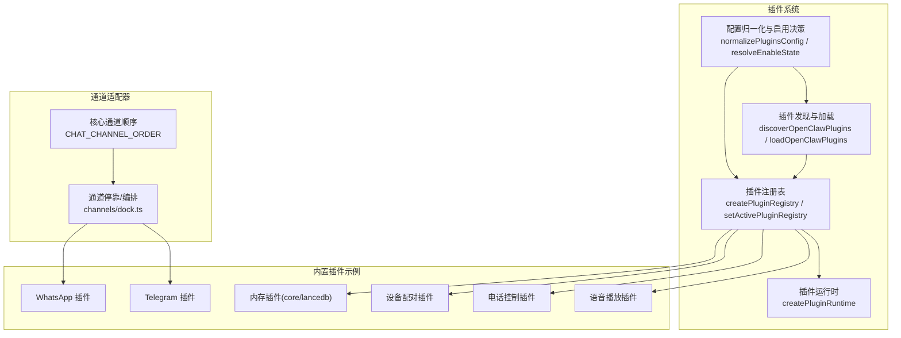
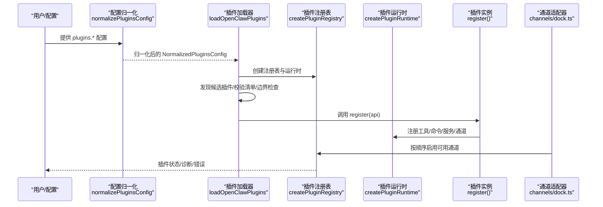
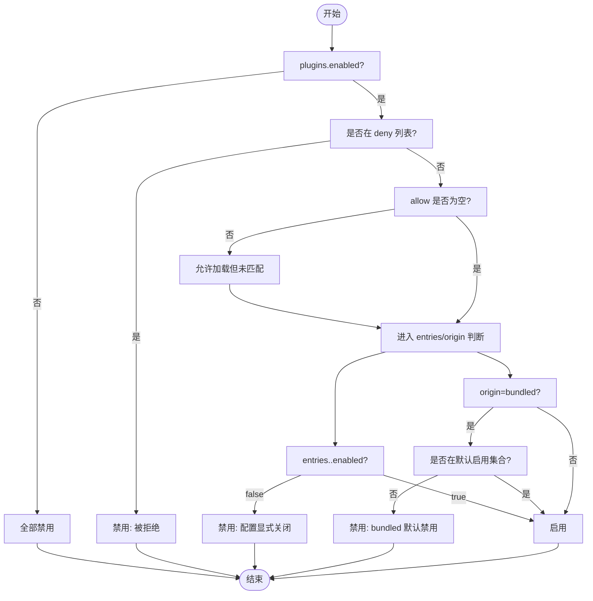
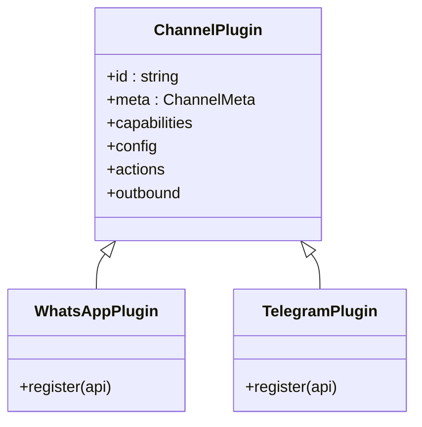
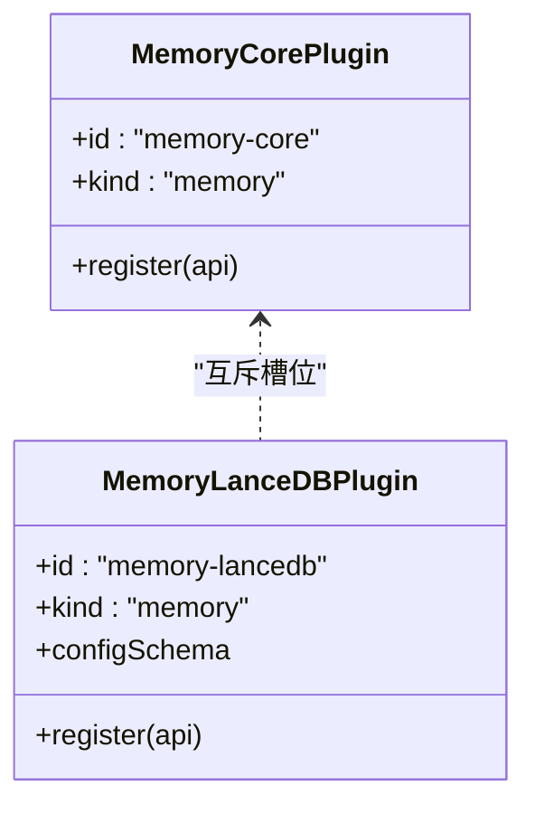
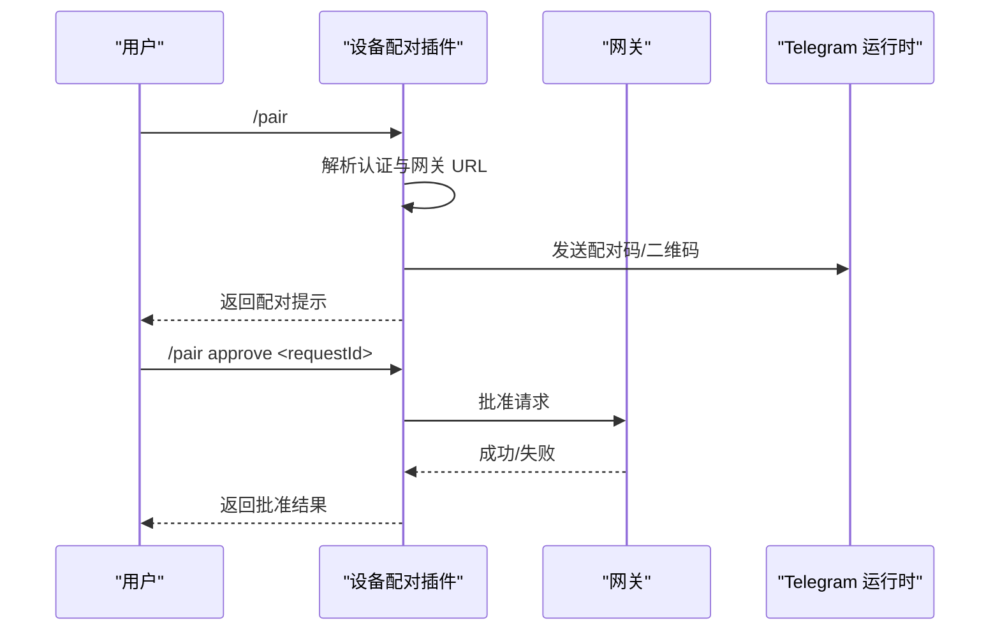
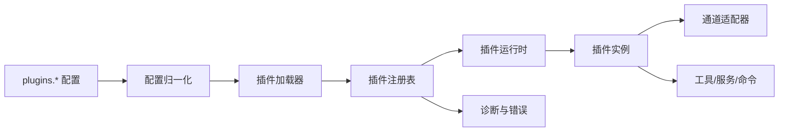

# 内置插件详解

<cite>
**本文档引用的文件**
- [README.md](file://README.md)
- [config-state.ts](file://src/plugins/config-state.ts)
- [loader.ts](file://src/plugins/loader.ts)
- [registry.ts](file://src/channels/registry.ts)
- [dock.ts](file://src/channels/dock.ts)
- [index.ts (whatsapp)](file://extensions/whatsapp/index.ts)
- [index.ts (telegram)](file://extensions/telegram/index.ts)
- [index.ts (memory-core)](file://extensions/memory-core/index.ts)
- [index.ts (memory-lancedb)](file://extensions/memory-lancedb/index.ts)
- [index.ts (device-pair)](file://extensions/device-pair/index.ts)
- [index.ts (phone-control)](file://extensions/phone-control/index.ts)
- [index.ts (talk-voice)](file://extensions/talk-voice/index.ts)
</cite>

## 目录

1. [简介](#简介)
2. [项目结构](#项目结构)
3. [核心组件](#核心组件)
4. [架构总览](#架构总览)
5. [详细组件分析](#详细组件分析)
6. [依赖关系分析](#依赖关系分析)
7. [性能考虑](#性能考虑)
8. [故障排除指南](#故障排除指南)
9. [结论](#结论)

## 简介

本指南面向希望深入使用与理解 OpenClaw 内置插件体系的用户与开发者。OpenClaw 提供了统一的插件加载与运行时机制，支持：

- 频道适配器插件（如 WhatsApp、Telegram、Discord 等）
- 工具扩展插件（如内存插件、设备配对、语音控制等）
- 技能集成插件（通过工作区与托管技能管理）
- 辅助工具插件（如电话节点命令临时放行）

插件系统具备严格的启用策略、配置校验、安全边界检查与诊断输出，确保在本地运行时的安全性与可维护性。

## 项目结构

OpenClaw 的插件体系由“插件发现与加载”“插件注册表”“通道适配器”“工具与服务”“配置与验证”五大模块协同组成：

图表来源

- [loader.ts](file://src/plugins/loader.ts#L368-L717)
- [config-state.ts](file://src/plugins/config-state.ts#L66-L196)
- [registry.ts](file://src/channels/registry.ts#L7-L24)
- [dock.ts](file://src/channels/dock.ts#L30-L49)

章节来源

- [README.md](file://README.md#L1-L546)
- [loader.ts](file://src/plugins/loader.ts#L368-L717)
- [config-state.ts](file://src/plugins/config-state.ts#L66-L196)
- [registry.ts](file://src/channels/registry.ts#L7-L24)
- [dock.ts](file://src/channels/dock.ts#L30-L49)

## 核心组件

- 插件发现与加载：扫描候选目录、读取清单、解析导出、执行注册、生成诊断报告。
- 插件注册表：集中记录插件状态、能力、工具、钩子、通道、网关方法等元信息。
- 插件运行时：提供安全边界内的 API（日志、路径解析、配置读写、通道发送等）。
- 配置归一化与启用决策：基于 allow/deny、entries、slots、bundled 默认策略决定是否启用插件。
- 通道适配器：统一通道顺序、元数据与能力，按需启用并注入到运行时。

章节来源

- [loader.ts](file://src/plugins/loader.ts#L368-L717)
- [config-state.ts](file://src/plugins/config-state.ts#L66-L196)
- [registry.ts](file://src/channels/registry.ts#L7-L24)

## 架构总览

下图展示了从配置到插件加载、通道启用与运行时交互的关键流程：

图表来源

- [loader.ts](file://src/plugins/loader.ts#L368-L717)
- [config-state.ts](file://src/plugins/config-state.ts#L66-L196)
- [dock.ts](file://src/channels/dock.ts#L30-L49)

## 详细组件分析

### 插件加载与启用策略

- 启用优先级：
  - plugins.enabled=false → 全部禁用
  - deny 列表命中 → 禁用
  - allow 列表存在且未命中 → 禁用
  - slots.memory 指定 → 仅该插件启用（kind=memory）
  - entries.<id>.enabled=true → 显式启用
  - entries.<id>.enabled=false → 显式禁用
  - bundled 插件默认：仅部分内置启用，其余默认禁用
  - 通道配置显式启用：若某 bundled 通道在 channels.<id>.enabled=true，则覆盖默认禁用
- 配置校验：使用 JSON Schema 对插件配置进行校验，失败则标记为 error 并记录诊断。
- 安全边界：严格限制插件入口文件与根目录关系，避免路径逃逸；对非受信来源进行“未跟踪加载”警告。
- 缓存：根据配置与工作区路径构建缓存键，避免重复加载。

图表来源

- [config-state.ts](file://src/plugins/config-state.ts#L165-L232)

章节来源

- [config-state.ts](file://src/plugins/config-state.ts#L66-L196)
- [loader.ts](file://src/plugins/loader.ts#L368-L717)

### 频道适配器插件（Discord、Telegram、WhatsApp 等）

- 核心通道顺序：定义了内置通道的优先级与元信息，便于统一编排与展示。
- 通道停靠：将具体通道插件注册到运行时，注入消息收发、账户配置、线程上下文等能力。
- 示例插件入口：
  - WhatsApp 插件：通过扩展入口注册通道插件，并设置运行时。
  - Telegram 插件：同上，注册 Telegram 通道插件。
- 使用建议：
  - 在 channels.<id> 下配置对应凭据与参数。
  - 若需要自动启用，可在 plugins.entries.<id> 中设置 enabled=true 或通过通道配置的 enabled 字段触发。
  - 注意 DM 策略与允许列表，避免未授权访问。

图表来源

- [registry.ts](file://src/channels/registry.ts#L7-L24)
- [dock.ts](file://src/channels/dock.ts#L30-L49)
- [index.ts (whatsapp)](file://extensions/whatsapp/index.ts#L1-L17)
- [index.ts (telegram)](file://extensions/telegram/index.ts#L1-L17)

章节来源

- [registry.ts](file://src/channels/registry.ts#L7-L24)
- [dock.ts](file://src/channels/dock.ts#L30-L49)
- [index.ts (whatsapp)](file://extensions/whatsapp/index.ts#L1-L17)
- [index.ts (telegram)](file://extensions/telegram/index.ts#L1-L17)

### 工具扩展插件：内存插件（memory-core 与 memory-lancedb）

- memory-core：
  - 提供基于文件的记忆搜索与获取工具，以及 CLI 命令。
  - 适合轻量、无需向量数据库的场景。
- memory-lancedb：
  - 基于 LanceDB 的向量记忆存储，支持自动捕获与召回。
  - 需要嵌入模型与 API Key 配置，支持环境变量解析。
- 记忆槽位选择：
  - 通过 plugins.slots.memory 指定具体记忆插件 ID，或设为 null 禁用。
  - 仅 kind=memory 的插件参与记忆槽位决策。

图表来源

- [index.ts (memory-core)](file://extensions/memory-core/index.ts#L1-L39)
- [index.ts (memory-lancedb)](file://extensions/memory-lancedb/index.ts#L286-L304)
- [config-state.ts](file://src/plugins/config-state.ts#L234-L262)

章节来源

- [index.ts (memory-core)](file://extensions/memory-core/index.ts#L1-L39)
- [index.ts (memory-lancedb)](file://extensions/memory-lancedb/index.ts#L286-L304)
- [config-state.ts](file://src/plugins/config-state.ts#L234-L262)

### 辅助工具插件：设备配对（device-pair）、电话控制（phone-control）、语音播放（talk-voice）

- 设备配对（device-pair）：
  - 生成一次性配对码，支持二维码渲染与多渠道发送。
  - 自动解析网关 URL（本地绑定、Tailscale Serve/Funnel、远程 URL），并处理认证模式（token/password）。
  - 支持列出/批准待处理请求。
- 电话控制（phone-control）：
  - 临时放行高风险命令（相机、屏幕录制、联系人/日历操作）。
  - 支持按组（camera/screen/writes/all）与持续时间（秒/分钟/小时/天）配置。
  - 通过状态文件持久化放行状态，定时服务到期自动撤销。
- 语音播放（talk-voice）：
  - 与 ElevenLabs 集成，支持列出/设置语音，影响 iOS Talk 播放。

图表来源

- [index.ts (device-pair)](file://extensions/device-pair/index.ts#L346-L529)

章节来源

- [index.ts (device-pair)](file://extensions/device-pair/index.ts#L1-L530)
- [index.ts (phone-control)](file://extensions/phone-control/index.ts#L1-L422)
- [index.ts (talk-voice)](file://extensions/talk-voice/index.ts#L1-L151)

## 依赖关系分析

- 插件加载依赖：
  - 配置归一化与启用策略决定候选插件集。
  - 插件清单与导出必须满足规范（id、kind、configSchema、register/activate）。
  - 运行时提供安全 API（日志、路径解析、配置读写、通道发送）。
- 通道适配器依赖：
  - 通道插件通过运行时注册动作与出站适配器，实现消息收发与账户管理。
  - 通道顺序与元信息由注册表统一管理。
- 记忆插件依赖：
  - 记忆槽位仅允许一个 kind=memory 的插件被启用。
  - 非法配置或未匹配槽位会触发诊断警告。

图表来源

- [loader.ts](file://src/plugins/loader.ts#L368-L717)
- [config-state.ts](file://src/plugins/config-state.ts#L66-L196)

章节来源

- [loader.ts](file://src/plugins/loader.ts#L368-L717)
- [config-state.ts](file://src/plugins/config-state.ts#L66-L196)

## 性能考虑

- 加载缓存：基于配置与工作区路径的缓存键避免重复加载，提升启动速度。
- 懒加载：在测试环境中，当所有插件被禁用时延迟创建 JIT 加载器，减少开销。
- 记忆检索：LanceDB 向量检索使用相似度转换，合理设置最小分数与返回条数以平衡准确率与性能。
- 通道并发：通道适配器按需启用，避免不必要的网络连接与轮询。

## 故障排除指南

- 插件未加载/报错：
  - 检查 plugins.allow 是否为空导致自动加载不受控；必要时明确 allow 列表。
  - 查看诊断输出中的“未跟踪加载”警告，确认来源路径是否受信任。
  - 确认插件导出包含 register/activate 且 configSchema 存在。
- 记忆插件问题：
  - 确认 plugins.slots.memory 指向正确的 kind=memory 插件 ID。
  - 若设置为 null，则禁用记忆功能；若未匹配到指定插件，将产生诊断警告。
- 通道配置问题：
  - 确保 channels.<id> 下的凭据与参数正确，必要时通过 plugins.entries.<id> 覆盖启用状态。
  - DM 策略与允许列表需明确配置，避免未授权访问。
- 设备配对问题：
  - 确认网关 URL 解析成功（本地绑定、Tailscale Serve/Funnel、远程 URL）。
  - 确认认证模式（token/password）已正确配置。
- 电话控制问题：
  - 检查命令组与持续时间格式是否正确。
  - 定时服务到期后会自动撤销放行，注意及时手动解除。

章节来源

- [loader.ts](file://src/plugins/loader.ts#L312-L366)
- [loader.ts](file://src/plugins/loader.ts#L698-L703)
- [config-state.ts](file://src/plugins/config-state.ts#L234-L262)
- [index.ts (device-pair)](file://extensions/device-pair/index.ts#L235-L282)
- [index.ts (phone-control)](file://extensions/phone-control/index.ts#L328-L421)

## 结论

OpenClaw 的插件系统以“安全、可控、可观测”为核心设计原则，通过严格的启用策略、配置校验与诊断输出，为用户提供了灵活而可靠的扩展能力。对于频道适配器、工具扩展与辅助工具类插件，建议结合实际使用场景合理配置 allow/deny、entries 与 slots，并关注诊断与错误信息，确保插件在本地运行时的安全与稳定。
