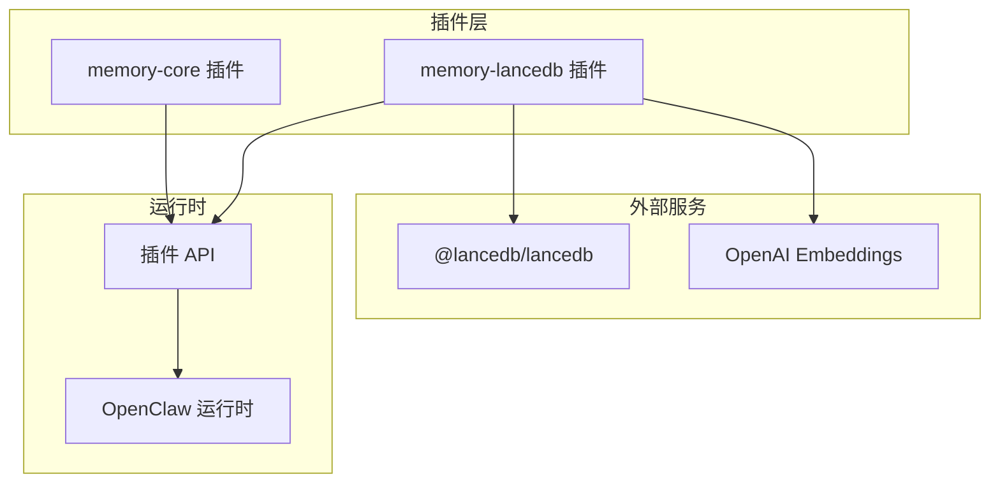
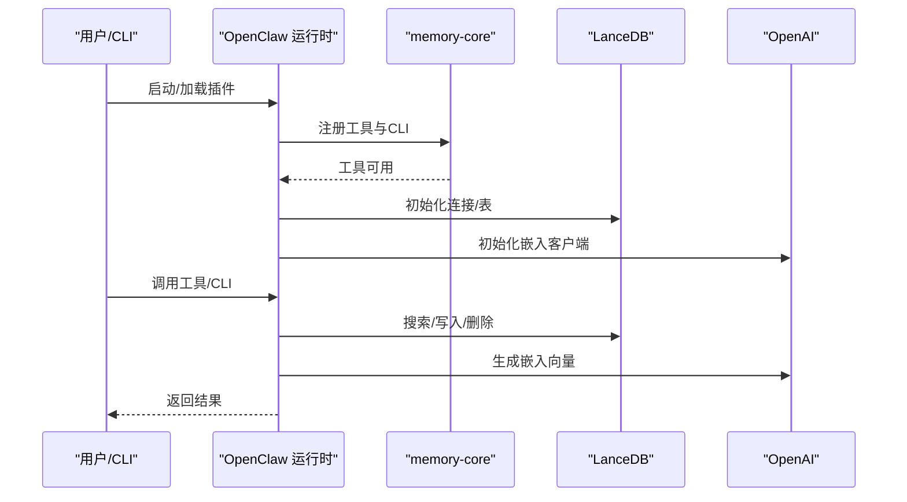
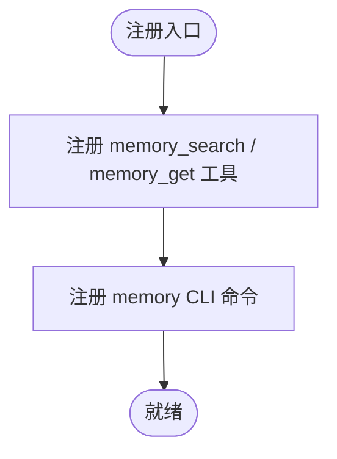
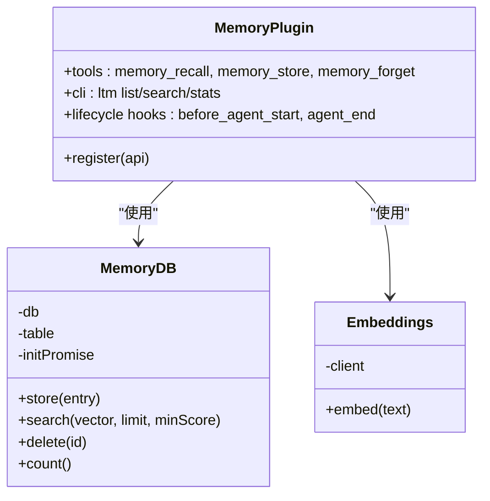
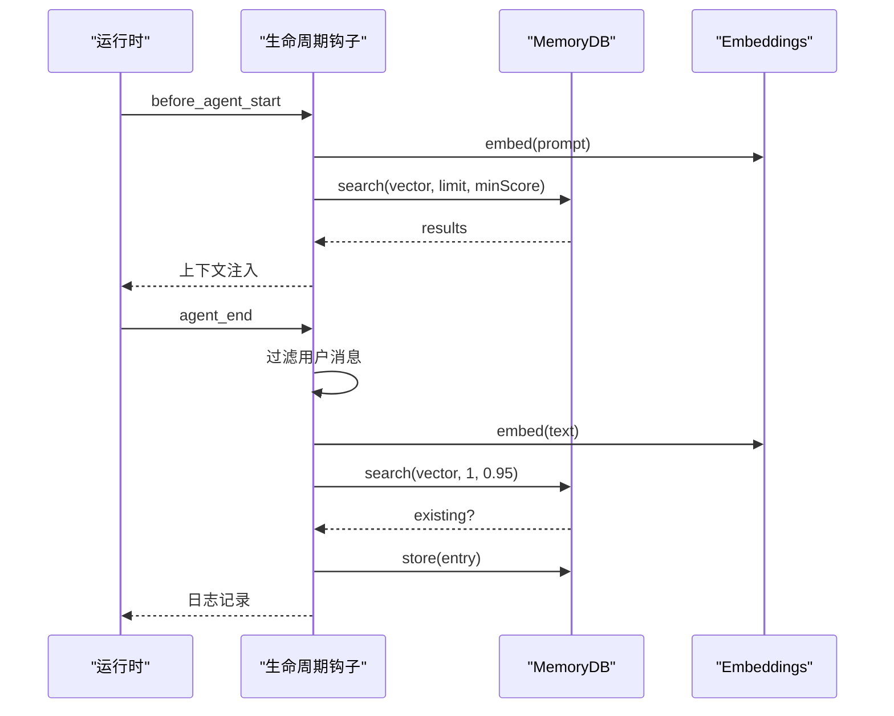
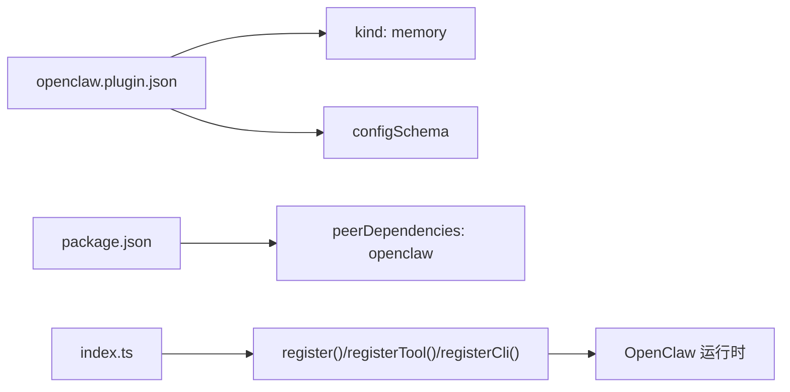

# 内存管理插件

<cite>
**本文档引用的文件**
- [extensions/memory-core/index.ts](file://extensions/memory-core/index.ts)
- [extensions/memory-core/openclaw.plugin.json](file://extensions/memory-core/openclaw.plugin.json)
- [extensions/memory-core/package.json](file://extensions/memory-core/package.json)
- [extensions/memory-lancedb/index.ts](file://extensions/memory-lancedb/index.ts)
- [extensions/memory-lancedb/config.ts](file://extensions/memory-lancedb/config.ts)
- [extensions/memory-lancedb/openclaw.plugin.json](file://extensions/memory-lancedb/openclaw.plugin.json)
- [extensions/memory-lancedb/package.json](file://extensions/memory-lancedb/package.json)
- [src/commands/status.scan.ts](file://src/commands/status.scan.ts)
- [src/memory/backend-config.ts](file://src/memory/backend-config.ts)
- [README.md](file://README.md)
</cite>

## 目录

1. [简介](#简介)
2. [项目结构](#项目结构)
3. [核心组件](#核心组件)
4. [架构总览](#架构总览)
5. [详细组件分析](#详细组件分析)
6. [依赖关系分析](#依赖关系分析)
7. [性能考虑](#性能考虑)
8. [故障排查指南](#故障排查指南)
9. [结论](#结论)
10. [附录](#附录)

## 简介

本指南面向使用 OpenClaw 的开发者与运维人员，系统性讲解内存管理插件的两大实现：内存核心插件（memory-core）与 LanceDB 内存插件（memory-lancedb）。内容涵盖功能特性、配置项、数据模型、查询接口、索引机制、持久化策略、性能优化、监控指标、容量规划与故障恢复等，帮助您构建稳定可靠的长期记忆系统。

## 项目结构

OpenClaw 将内存能力以“插件”形式提供，核心目录如下：

- memory-core：纯文件型内存工具集，提供基础检索与 CLI 命令。
- memory-lancedb：基于 LanceDB 的向量内存，支持自动回忆与自动捕获，具备 OpenAI 嵌入能力。

图表来源

- [extensions/memory-core/index.ts](file://extensions/memory-core/index.ts#L1-L39)
- [extensions/memory-lancedb/index.ts](file://extensions/memory-lancedb/index.ts#L1-L671)

章节来源

- [extensions/memory-core/index.ts](file://extensions/memory-core/index.ts#L1-L39)
- [extensions/memory-lancedb/index.ts](file://extensions/memory-lancedb/index.ts#L1-L671)

## 核心组件

- 内存核心插件（memory-core）
  - 提供内存检索与获取工具，注册到 OpenClaw 工具系统，并暴露 CLI 子命令。
  - 配置模式为空对象，无需额外参数即可启用。
- LanceDB 内存插件（memory-lancedb）
  - 提供三类工具：记忆回忆、记忆存储、记忆遗忘。
  - 支持自动回忆（注入上下文）与自动捕获（从对话中抽取重要信息）。
  - 使用 LanceDB 作为向量数据库，OpenAI 生成嵌入向量。
  - 提供 CLI 命令用于统计与检索。

章节来源

- [extensions/memory-core/index.ts](file://extensions/memory-core/index.ts#L10-L36)
- [extensions/memory-lancedb/index.ts](file://extensions/memory-lancedb/index.ts#L286-L671)

## 架构总览

下图展示两类插件在 OpenClaw 中的注册与交互方式，以及与外部服务的关系。

图表来源

- [extensions/memory-core/index.ts](file://extensions/memory-core/index.ts#L10-L36)
- [extensions/memory-lancedb/index.ts](file://extensions/memory-lancedb/index.ts#L293-L671)

## 详细组件分析

### 组件A：内存核心插件（memory-core）

- 功能定位
  - 文件型内存工具集合，提供检索与获取工具，便于在本地或简单场景下进行快速记忆访问。
- 工具与 CLI
  - 工具名称：memory_search、memory_get
  - CLI 子命令：memory（由运行时注册的通用记忆 CLI 提供）
- 配置
  - 空配置模式，无额外键值要求。
- 适用场景
  - 快速原型、轻量级本地记忆、无需向量检索的场景。

图表来源

- [extensions/memory-core/index.ts](file://extensions/memory-core/index.ts#L10-L36)
- [extensions/memory-core/openclaw.plugin.json](file://extensions/memory-core/openclaw.plugin.json#L1-L10)

章节来源

- [extensions/memory-core/index.ts](file://extensions/memory-core/index.ts#L10-L36)
- [extensions/memory-core/openclaw.plugin.json](file://extensions/memory-core/openclaw.plugin.json#L1-L10)

### 组件B：LanceDB 内存插件（memory-lancedb）

- 数据模型
  - 记忆条目包含：唯一 ID、文本、向量、重要度、类别、创建时间。
  - 类别枚举：preference、fact、decision、entity、other。
- 查询与索引
  - 基于 LanceDB 表的向量检索；默认使用 L2 距离，转换为相似度分数。
  - 支持按相似度阈值过滤与限制返回数量。
- 工具接口
  - memory_recall：根据查询词生成嵌入并检索，返回匹配的记忆列表。
  - memory_store：保存记忆，内置去重检查（高相似度阈值）。
  - memory_forget：按 ID 或查询删除记忆，支持候选列表提示。
- 自动功能
  - 自动回忆：在会话开始前，基于提示词生成嵌入并注入相关记忆上下文。
  - 自动捕获：在会话结束后，从用户消息中抽取可捕获内容并保存，带去重与分类。
- CLI 命令
  - ltm list：统计记忆总数。
  - ltm search：按查询词检索并输出 JSON 结果。
  - ltm stats：显示统计信息。
- 配置项
  - embedding.apiKey：OpenAI 嵌入 API 密钥（必填）。
  - embedding.model：嵌入模型（默认 text-embedding-3-small，支持 small/large）。
  - dbPath：LanceDB 数据库路径（默认位于用户家目录下的 .openclaw/memory/lancedb）。
  - autoCapture：是否自动捕获（默认开启）。
  - autoRecall：是否自动回忆（默认开启）。
  - captureMaxChars：自动捕获最大字符数（默认 500，范围 100–10000）。
- 安全与合规
  - 删除操作对 ID 进行 UUID 格式校验，防止注入。
  - 记忆内容注入到上下文时进行 HTML 转义，避免注入风险。
  - 提供 GDPR 合规的遗忘接口。

图表来源

- [extensions/memory-lancedb/index.ts](file://extensions/memory-lancedb/index.ts#L59-L157)
- [extensions/memory-lancedb/index.ts](file://extensions/memory-lancedb/index.ts#L163-L180)
- [extensions/memory-lancedb/index.ts](file://extensions/memory-lancedb/index.ts#L286-L671)

章节来源

- [extensions/memory-lancedb/index.ts](file://extensions/memory-lancedb/index.ts#L39-L157)
- [extensions/memory-lancedb/index.ts](file://extensions/memory-lancedb/index.ts#L163-L180)
- [extensions/memory-lancedb/index.ts](file://extensions/memory-lancedb/index.ts#L286-L671)
- [extensions/memory-lancedb/config.ts](file://extensions/memory-lancedb/config.ts#L5-L162)
- [extensions/memory-lancedb/openclaw.plugin.json](file://extensions/memory-lancedb/openclaw.plugin.json#L1-L72)

### 组件C：配置解析与默认路径

- 默认数据库路径解析：优先使用 ~/.openclaw/memory/lancedb，若不存在则回退到历史路径。
- 嵌入模型维度映射：text-embedding-3-small → 1536，text-embedding-3-large → 3072。
- 环境变量替换：支持 ${ENV_VAR} 形式的占位符解析。
- 参数校验：未知键抛错；captureMaxChars 边界校验；模型合法性校验。

章节来源

- [extensions/memory-lancedb/config.ts](file://extensions/memory-lancedb/config.ts#L24-L47)
- [extensions/memory-lancedb/config.ts](file://extensions/memory-lancedb/config.ts#L51-L70)
- [extensions/memory-lancedb/config.ts](file://extensions/memory-lancedb/config.ts#L72-L80)
- [extensions/memory-lancedb/config.ts](file://extensions/memory-lancedb/config.ts#L88-L128)

### 组件D：生命周期钩子与自动功能

- before_agent_start：自动回忆
  - 生成提示词嵌入，执行向量检索，将结果格式化为上下文注入。
- agent_end：自动捕获
  - 仅处理用户消息，过滤可捕获文本，检测类别，去重后保存，限制每轮最多 3 条。

图表来源

- [extensions/memory-lancedb/index.ts](file://extensions/memory-lancedb/index.ts#L538-L564)
- [extensions/memory-lancedb/index.ts](file://extensions/memory-lancedb/index.ts#L566-L650)

章节来源

- [extensions/memory-lancedb/index.ts](file://extensions/memory-lancedb/index.ts#L538-L564)
- [extensions/memory-lancedb/index.ts](file://extensions/memory-lancedb/index.ts#L566-L650)

## 依赖关系分析

- 内存核心插件
  - peerDependencies：openclaw ≥ 版本号
  - 通过运行时工具系统注册，无外部依赖。
- LanceDB 内存插件
  - 依赖 @lancedb/lancedb、@sinclair/typebox、openai。
  - 通过 openclaw.plugin.json 提供 UI 提示与配置校验。
- 运行时集成
  - 插件通过 openclaw.plugin.json 的 kind: "memory" 与 configSchema 被识别为内存插件。
  - 运行时状态扫描逻辑会根据配置选择 memory-core 或其他内存后端。

图表来源

- [extensions/memory-core/openclaw.plugin.json](file://extensions/memory-core/openclaw.plugin.json#L1-L10)
- [extensions/memory-core/package.json](file://extensions/memory-core/package.json#L7-L14)
- [extensions/memory-lancedb/openclaw.plugin.json](file://extensions/memory-lancedb/openclaw.plugin.json#L1-L72)
- [extensions/memory-lancedb/package.json](file://extensions/memory-lancedb/package.json#L7-L16)
- [extensions/memory-core/index.ts](file://extensions/memory-core/index.ts#L10-L36)
- [extensions/memory-lancedb/index.ts](file://extensions/memory-lancedb/index.ts#L293-L671)

章节来源

- [extensions/memory-core/openclaw.plugin.json](file://extensions/memory-core/openclaw.plugin.json#L1-L10)
- [extensions/memory-core/package.json](file://extensions/memory-core/package.json#L7-L14)
- [extensions/memory-lancedb/openclaw.plugin.json](file://extensions/memory-lancedb/openclaw.plugin.json#L1-L72)
- [extensions/memory-lancedb/package.json](file://extensions/memory-lancedb/package.json#L7-L16)
- [extensions/memory-core/index.ts](file://extensions/memory-core/index.ts#L10-L36)
- [extensions/memory-lancedb/index.ts](file://extensions/memory-lancedb/index.ts#L293-L671)

## 性能考虑

- 向量检索
  - 使用 LanceDB 的向量索引，建议合理设置 limit 与 minScore，避免返回过多结果。
  - 在高并发场景下，注意嵌入 API 的速率限制与配额。
- 去重与存储
  - 存储前进行高相似度去重，减少重复记忆占用空间。
  - 自动捕获限制每轮最多 3 条，避免过度写入。
- 数据库路径
  - 将 dbPath 指向高性能磁盘，确保 I/O 吞吐满足检索需求。
- 模型选择
  - large 模型维度更高，向量空间更大但计算成本更高；small 模型更轻量。
- 环境变量与路径解析
  - 使用环境变量占位符时，确保变量已正确设置，避免运行时解析失败。

[本节为通用指导，不直接分析具体文件]

## 故障排查指南

- LanceDB 加载失败
  - 现象：启动时报错，提示无法加载 LanceDB。
  - 排查：确认平台原生绑定可用性；尝试更换 Node 版本或平台。
  - 参考：加载逻辑与错误抛出位置。
- 记忆 ID 格式错误
  - 现象：删除记忆时报无效 ID 格式。
  - 排查：确认传入的是合法 UUID；检查调用方参数传递。
- 自动回忆/捕获异常
  - 现象：日志出现 recall/capture 失败警告。
  - 排查：检查 OpenAI API Key 有效性与网络连通性；查看嵌入模型配置。
- CLI 命令不可用
  - 现象：ltm/list/search/stats 不可用。
  - 排查：确认插件已正确注册；检查运行时 CLI 注册流程。

章节来源

- [extensions/memory-lancedb/index.ts](file://extensions/memory-lancedb/index.ts#L27-L37)
- [extensions/memory-lancedb/index.ts](file://extensions/memory-lancedb/index.ts#L144-L151)
- [extensions/memory-lancedb/index.ts](file://extensions/memory-lancedb/index.ts#L560-L563)
- [extensions/memory-lancedb/index.ts](file://extensions/memory-lancedb/index.ts#L646-L649)

## 结论

- memory-core 适合轻量、快速、无需向量检索的场景。
- memory-lancedb 提供企业级长期记忆能力，支持自动回忆与自动捕获，适合需要智能上下文增强与知识沉淀的复杂应用。
- 建议结合业务需求选择合适插件，并关注配置项、性能与安全细节，确保稳定运行。

[本节为总结性内容，不直接分析具体文件]

## 附录

### A. 安装与启用步骤

- 安装
  - 使用包管理器安装 openclaw；确保 Node ≥ 22。
  - 安装完成后运行引导向导完成初始配置。
- 启用内存插件
  - memory-core：默认 slot 为 memory-core，无需额外配置。
  - memory-lancedb：需提供 OpenAI API Key 与嵌入模型配置。

章节来源

- [README.md](file://README.md#L50-L81)
- [src/commands/status.scan.ts](file://src/commands/status.scan.ts#L29-L39)

### B. 配置示例与最佳实践

- 配置示例（memory-lancedb）
  - embedding.apiKey：必填，支持 ${OPENAI_API_KEY} 占位符。
  - embedding.model：推荐 text-embedding-3-small；如需更高精度可选 large。
  - dbPath：建议指向本地 SSD；默认路径位于用户家目录。
  - autoCapture/autoRecall：默认开启，可根据业务需求调整。
  - captureMaxChars：默认 500，范围 100–10000。
- 最佳实践
  - 为 OpenAI API Key 设置只读权限与限额。
  - 定期清理低重要度记忆，控制数据库规模。
  - 在生产环境启用自动回忆时，适当降低返回条数与提高相似度阈值。

章节来源

- [extensions/memory-lancedb/openclaw.plugin.json](file://extensions/memory-lancedb/openclaw.plugin.json#L36-L72)
- [extensions/memory-lancedb/config.ts](file://extensions/memory-lancedb/config.ts#L88-L128)

### C. 数据模型与查询接口

- 数据模型
  - MemoryEntry：id、text、vector、importance、category、createdAt。
  - MemorySearchResult：entry、score。
- 查询接口
  - memory_recall：输入查询词，返回相似记忆列表。
  - memory_store：输入文本、重要度与类别，返回存储结果。
  - memory_forget：输入查询词或记忆 ID，返回删除结果或候选列表。
- CLI
  - ltm list：统计总数。
  - ltm search：检索并输出 JSON。
  - ltm stats：显示统计信息。

章节来源

- [extensions/memory-lancedb/index.ts](file://extensions/memory-lancedb/index.ts#L39-L53)
- [extensions/memory-lancedb/index.ts](file://extensions/memory-lancedb/index.ts#L306-L486)
- [extensions/memory-lancedb/index.ts](file://extensions/memory-lancedb/index.ts#L492-L532)

### D. 监控指标与容量规划

- 监控指标
  - 记忆总数：通过 CLI 或数据库计数接口获取。
  - 检索命中率：结合日志统计 recall 命中与未命中次数。
  - 嵌入调用次数与耗时：统计嵌入 API 的调用频率与平均耗时。
- 容量规划
  - 根据消息长度与自动捕获策略估算每日新增记忆数量。
  - 评估向量维度与索引大小，预留磁盘空间与内存缓存。
  - 对高并发场景进行压力测试，验证检索延迟与吞吐。

章节来源

- [extensions/memory-lancedb/index.ts](file://extensions/memory-lancedb/index.ts#L500-L502)
- [extensions/memory-lancedb/index.ts](file://extensions/memory-lancedb/index.ts#L527-L529)

### E. 故障恢复方法

- 数据库损坏
  - 备份 dbPath；必要时重建表并重新导入关键记忆。
- API 异常
  - 切换备用 API Key；检查网络代理与防火墙规则。
- 插件未加载
  - 检查 openclaw.plugin.json 的配置与 schema；确认运行时版本兼容。

章节来源

- [extensions/memory-lancedb/index.ts](file://extensions/memory-lancedb/index.ts#L81-L101)
- [extensions/memory-lancedb/index.ts](file://extensions/memory-lancedb/index.ts#L293-L300)
