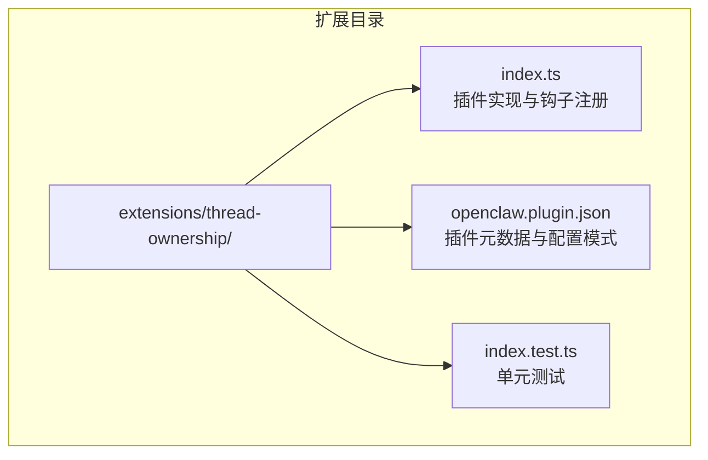
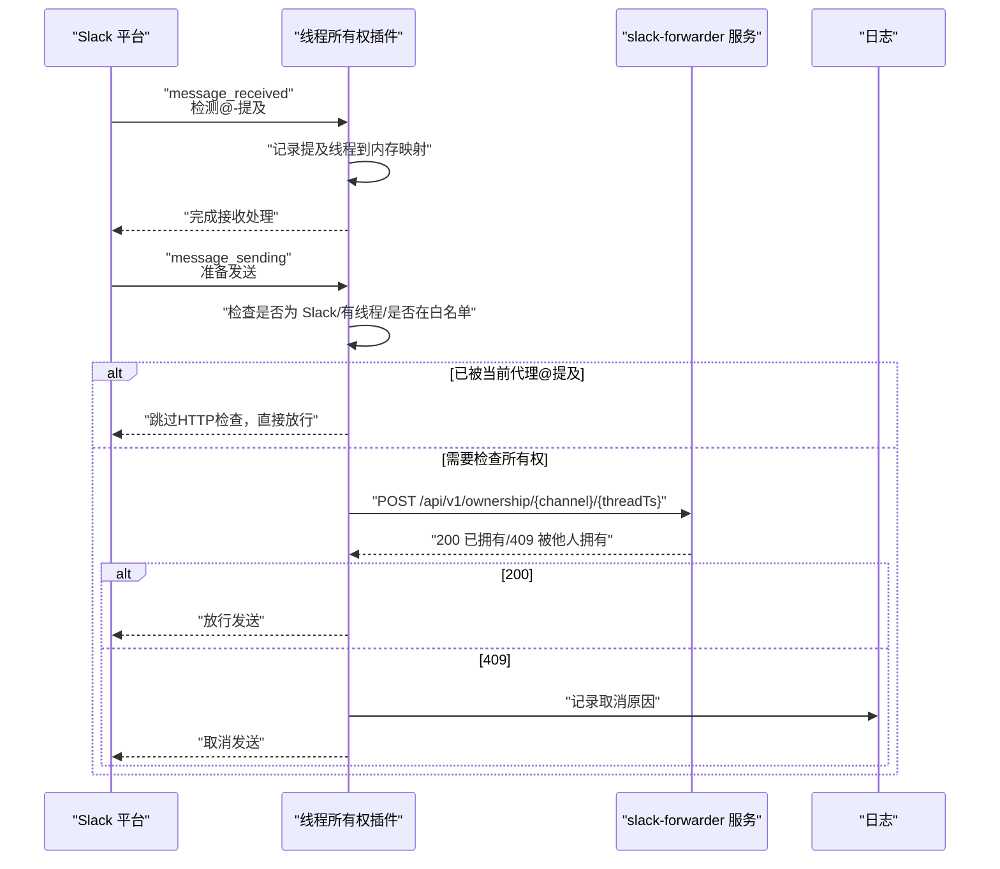
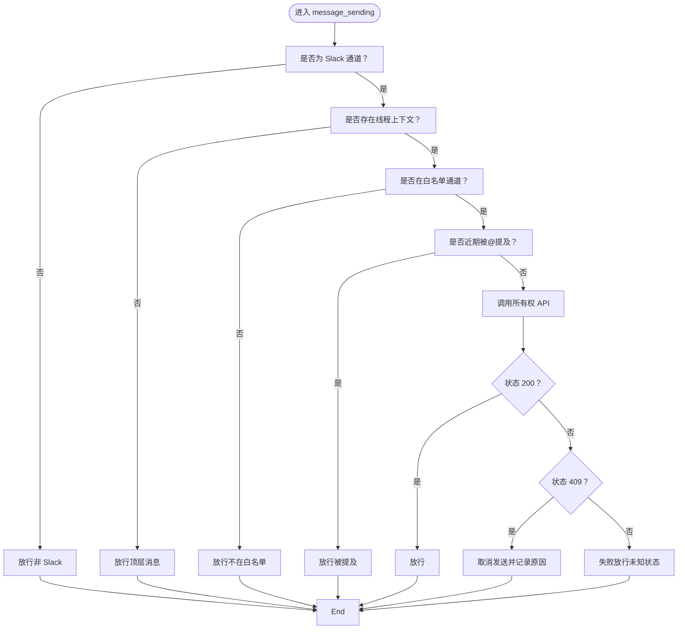
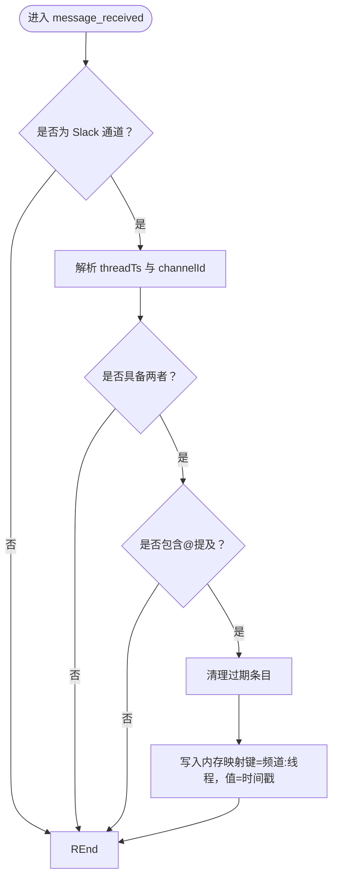
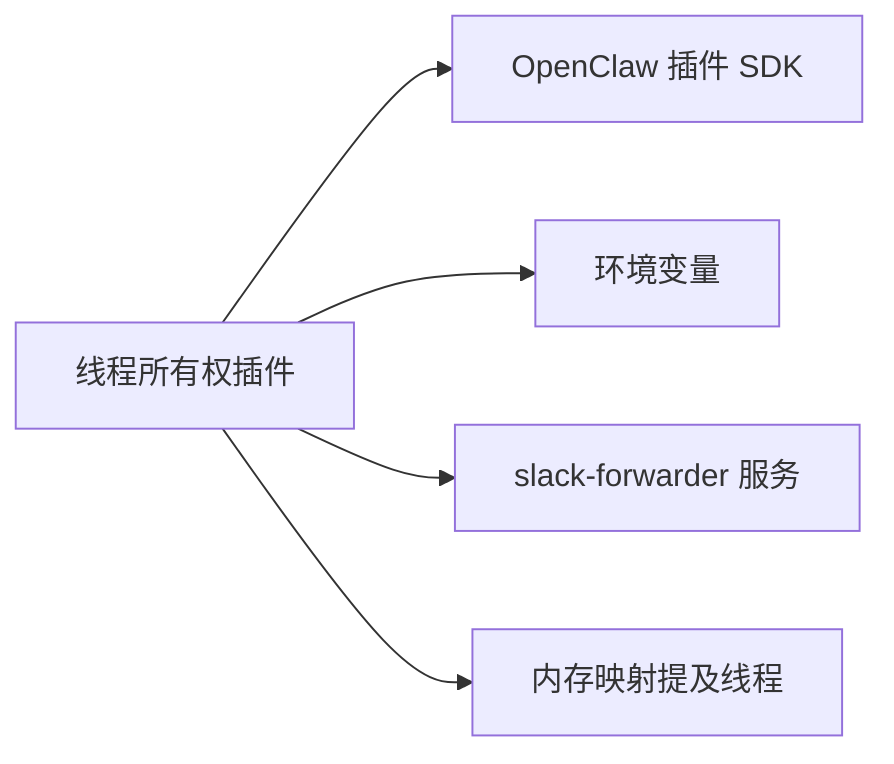

# 实用工具插件

<cite>
**本文引用的文件**   
- [extensions/thread-ownership/index.ts](file://extensions/thread-ownership/index.ts)
- [extensions/thread-ownership/openclaw.plugin.json](file://extensions/thread-ownership/openclaw.plugin.json)
- [extensions/thread-ownership/index.test.ts](file://extensions/thread-ownership/index.test.ts)
</cite>

## 目录

1. [简介](#简介)
2. [项目结构](#项目结构)
3. [核心组件](#核心组件)
4. [架构总览](#架构总览)
5. [详细组件分析](#详细组件分析)
6. [依赖关系分析](#依赖关系分析)
7. [性能考量](#性能考量)
8. [故障排除指南](#故障排除指南)
9. [结论](#结论)
10. [附录](#附录)

## 简介

本文件为 OpenClaw 实用工具插件“线程所有权”（Thread Ownership）的完整使用与技术文档。该插件用于在 Slack 等多代理协作环境中，避免多个代理同时回复同一对话线程，从而减少重复回复与冲突。其核心机制包括：基于 HTTP 的线程所有权声明与查询、对 @-提及的追踪以允许被提及代理即时回复、以及在 A/B 测试通道中按需启用强制控制。

该插件通过 OpenClaw 插件 SDK 的钩子系统注册事件处理器，在消息接收时记录提及、在消息发送前进行线程所有权检查；当检测到其他代理已拥有线程时，会取消当前发送请求，确保一致性与用户体验。

## 项目结构

线程所有权插件位于扩展目录下，核心文件包括：

- 插件入口与逻辑：extensions/thread-ownership/index.ts
- 插件元数据与配置模式：extensions/thread-ownership/openclaw.plugin.json
- 单元测试：extensions/thread-ownership/index.test.ts

图表来源

- [extensions/thread-ownership/index.ts](file://extensions/thread-ownership/index.ts#L1-L134)
- [extensions/thread-ownership/openclaw.plugin.json](file://extensions/thread-ownership/openclaw.plugin.json#L1-L29)
- [extensions/thread-ownership/index.test.ts](file://extensions/thread-ownership/index.test.ts#L1-L181)

章节来源

- [extensions/thread-ownership/index.ts](file://extensions/thread-ownership/index.ts#L1-L134)
- [extensions/thread-ownership/openclaw.plugin.json](file://extensions/thread-ownership/openclaw.plugin.json#L1-L29)
- [extensions/thread-ownership/index.test.ts](file://extensions/thread-ownership/index.test.ts#L1-L181)

## 核心组件

- 配置类型与默认值
  - forwarderUrl：可选，作为线程所有权服务的基地址，默认回退至环境变量或内置默认值。
  - abTestChannels：可选，白名单通道集合，仅在这些通道中启用线程所有权控制。
- 运行时状态
  - mentionedThreads：内存映射表，键为“频道ID:线程时间戳”，值为记录时间戳；用于短期记忆最近被 @-提及的线程，便于允许被提及代理直接回复。
  - TTL：5 分钟，定期清理过期条目，避免内存无限增长。
- 关键钩子
  - message_received：在 Slack 通道中监听消息，若包含当前代理的 @-提及，则将该线程加入短期记忆。
  - message_sending：在发送前检查线程所有权；若非 Slack 或无线程上下文则放行；若命中 A/B 白名单且被其他代理拥有则取消发送；网络异常时采用“失败放行”。

章节来源

- [extensions/thread-ownership/index.ts](file://extensions/thread-ownership/index.ts#L3-L13)
- [extensions/thread-ownership/index.ts](file://extensions/thread-ownership/index.ts#L42-L132)

## 架构总览

线程所有权插件通过 OpenClaw 插件 SDK 注册两个关键钩子，形成“接收—决策—发送”的闭环：

图表来源

- [extensions/thread-ownership/index.ts](file://extensions/thread-ownership/index.ts#L63-L132)

## 详细组件分析

### 组件一：线程所有权检查流程

- 触发条件
  - 仅在 channelId 为 "slack" 时生效。
  - 仅在线程上下文（threadTs）存在时触发。
  - 若 abTestChannels 非空，仅对其中的频道生效。
- 决策逻辑
  - 若当前代理近期在该线程被 @-提及，则跳过 HTTP 检查，直接放行。
  - 否则调用 forwarderUrl 的所有权 API，根据响应状态决定放行或取消。
  - 对于网络错误或未知状态，采用“失败放行”策略，保证可用性。
- 取消发送
  - 当返回 409 且包含 owner 字段时，插件记录日志并返回取消指令，阻止后续发送。

图表来源

- [extensions/thread-ownership/index.ts](file://extensions/thread-ownership/index.ts#L87-L132)

章节来源

- [extensions/thread-ownership/index.ts](file://extensions/thread-ownership/index.ts#L87-L132)

### 组件二：@-提及追踪与短期记忆

- 记录规则
  - 仅在 Slack 通道中处理。
  - 文本中包含代理身份名称或机器人用户 ID 时，视为提及。
  - 将“频道ID:线程时间戳”写入内存映射，并记录时间戳。
- 清理策略
  - 发起检查前先清理过期条目（超过 5 分钟）。
  - 保证内存占用可控，避免长期驻留。

图表来源

- [extensions/thread-ownership/index.ts](file://extensions/thread-ownership/index.ts#L63-L81)

章节来源

- [extensions/thread-ownership/index.ts](file://extensions/thread-ownership/index.ts#L15-L22)
- [extensions/thread-ownership/index.ts](file://extensions/thread-ownership/index.ts#L73-L80)

### 组件三：代理选择与身份解析

- 解析顺序
  - 优先选择标记为 default 的代理条目。
  - 若不存在默认项，则取列表首项。
  - 从代理条目中提取 id 与 name（优先 identity.name，否则 fallback 到 name），作为所有权声明的主体标识。
- 回退策略
  - 若无法解析有效 id/name，将使用占位标识，不影响插件运行。

章节来源

- [extensions/thread-ownership/index.ts](file://extensions/thread-ownership/index.ts#L24-L40)

### 组件四：插件元数据与配置模式

- 元数据字段
  - id、name、description：插件标识与描述。
  - configSchema：定义 forwarderUrl（字符串）与 abTestChannels（字符串数组）。
  - uiHints：为前端提供标签与帮助文本，指导用户填写配置。
- 环境变量回退
  - forwarderUrl 支持通过环境变量覆盖。
  - abTestChannels 支持通过环境变量批量注入。

章节来源

- [extensions/thread-ownership/openclaw.plugin.json](file://extensions/thread-ownership/openclaw.plugin.json#L1-L29)

## 依赖关系分析

- 外部依赖
  - slack-forwarder 服务：提供线程所有权声明与查询的 HTTP 接口。
  - 环境变量：SLACK_FORWARDER_URL、THREAD_OWNERSHIP_CHANNELS、SLACK_BOT_USER_ID。
- 内部耦合
  - 与 OpenClaw 插件 SDK 的钩子系统紧密耦合（on、logger、config、pluginConfig）。
  - 与内存映射（Map）和定时清理函数（cleanExpiredMentions）共同维护短期状态。

图表来源

- [extensions/thread-ownership/index.ts](file://extensions/thread-ownership/index.ts#L42-L57)
- [extensions/thread-ownership/index.ts](file://extensions/thread-ownership/index.ts#L104-L131)

章节来源

- [extensions/thread-ownership/index.ts](file://extensions/thread-ownership/index.ts#L42-L57)
- [extensions/thread-ownership/index.ts](file://extensions/thread-ownership/index.ts#L104-L131)

## 性能考量

- 时间复杂度
  - 提及清理：遍历内存映射，最坏 O(n)，但 n 由 TTL 限制，实际开销很小。
  - 发送前检查：单次 HTTP 请求，超时 3 秒，避免阻塞主流程。
- 空间复杂度
  - 内存映射大小受 TTL 与活跃线程数量影响，5 分钟后自动清理，峰值稳定。
- 可靠性
  - 失败放行策略降低网络抖动对业务的影响，但可能带来短暂的重复回复风险；可通过扩大白名单范围与优化 forwarder 服务可用性缓解。

## 故障排除指南

- 症状：消息发送被意外取消
  - 可能原因：目标线程已被其他代理拥有（返回 409）。
  - 处理建议：确认 forwarder 服务状态；检查代理是否正确声明所有权；查看日志中的取消原因。
- 症状：网络错误导致发送被放行
  - 可能原因：forwarder 服务不可达或超时。
  - 处理建议：检查 SLACK_FORWARDER_URL；验证网络连通性；必要时临时放宽白名单。
- 症状：@-提及未生效
  - 可能原因：未在 Slack 通道中；未包含代理名称或机器人用户 ID；提及时间已过期。
  - 处理建议：确认消息内容包含正确的 @-语法；等待下一次发送触发检查；检查 mentionedThreads 是否被清理。
- 症状：白名单通道不生效
  - 可能原因：abTestChannels 为空或未正确设置。
  - 处理建议：在插件配置或环境变量中添加目标频道 ID；重启插件使配置生效。

章节来源

- [extensions/thread-ownership/index.ts](file://extensions/thread-ownership/index.ts#L117-L131)
- [extensions/thread-ownership/index.ts](file://extensions/thread-ownership/index.ts#L73-L80)
- [extensions/thread-ownership/openclaw.plugin.json](file://extensions/thread-ownership/openclaw.plugin.json#L18-L27)

## 结论

线程所有权插件通过轻量级的内存状态与外部 HTTP 服务配合，实现了对 Slack 线程的并发控制。其设计兼顾了可用性（失败放行）与一致性（409 取消），并通过 @-提及追踪提升了交互体验。建议在需要严格避免重复回复的场景中启用白名单通道，并结合日志监控与 forwarder 服务的稳定性保障整体效果。

## 附录

### 安装与集成步骤

- 步骤概览
  - 准备 slack-forwarder 服务并确保可达。
  - 在 OpenClaw 中启用线程所有权插件。
  - 配置插件参数（可选）或通过环境变量注入。
  - 在目标频道开启白名单（可选）。
- 配置项说明
  - forwarderUrl：线程所有权服务的基础 URL（默认回退值见插件元数据）。
  - abTestChannels：启用线程所有权控制的频道 ID 列表。
- 环境变量
  - SLACK_FORWARDER_URL：覆盖插件配置中的 forwarderUrl。
  - THREAD_OWNERSHIP_CHANNELS：以逗号分隔的频道 ID 列表，作为 abTestChannels 的来源。
  - SLACK_BOT_USER_ID：用于识别 @-提及的机器人用户 ID。

章节来源

- [extensions/thread-ownership/openclaw.plugin.json](file://extensions/thread-ownership/openclaw.plugin.json#L5-L27)
- [extensions/thread-ownership/index.ts](file://extensions/thread-ownership/index.ts#L44-L54)
- [extensions/thread-ownership/index.ts](file://extensions/thread-ownership/index.ts#L57-L57)

### API 接口与事件处理

- 事件钩子
  - message_received：在 Slack 通道中记录 @-提及，键为“频道ID:线程时间戳”。
  - message_sending：在发送前检查线程所有权，必要时取消发送。
- HTTP 接口
  - POST /api/v1/ownership/{channel}/{threadTs}：声明并查询线程所有权。
  - 返回 200：当前代理已拥有或刚成功声明。
  - 返回 409：其他代理拥有，应取消发送。
  - 其他状态：采用失败放行策略。

章节来源

- [extensions/thread-ownership/index.ts](file://extensions/thread-ownership/index.ts#L63-L132)

### 最佳实践

- 仅在关键频道启用白名单，避免过度干预。
- 保持 forwarder 服务高可用与低延迟，减少失败放行概率。
- 使用 @-提及追踪提升被提及代理的即时回复能力。
- 定期审查日志，关注 409 取消频率，评估代理间的竞争情况。
