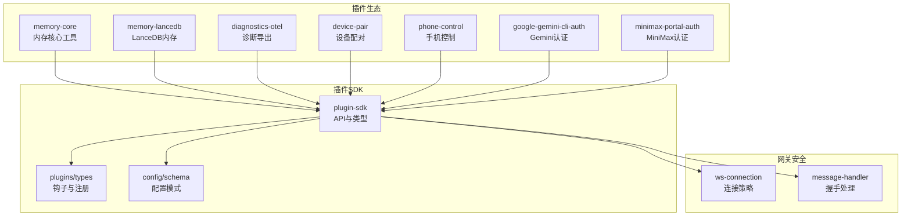
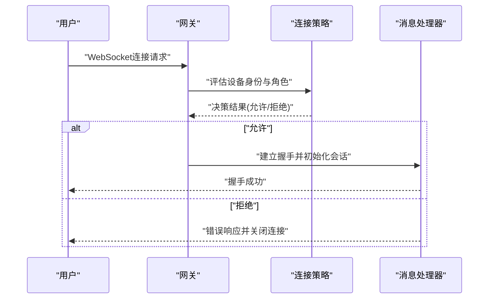
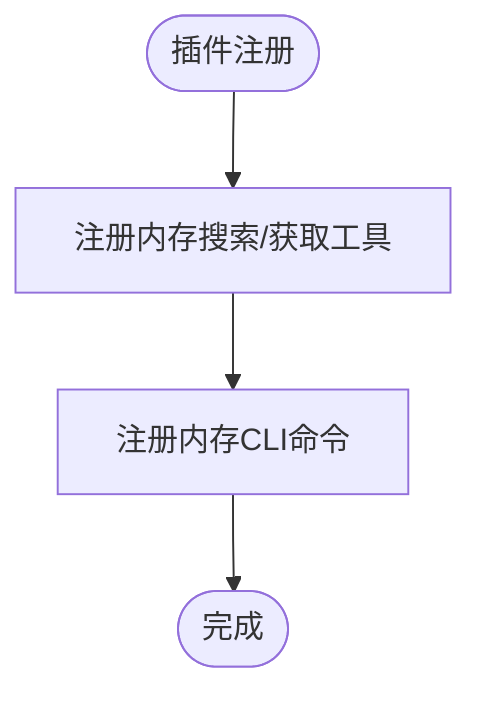
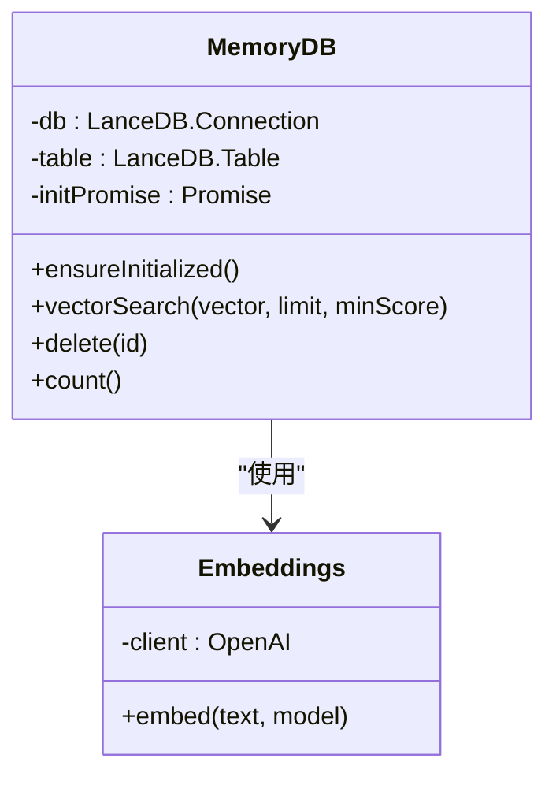
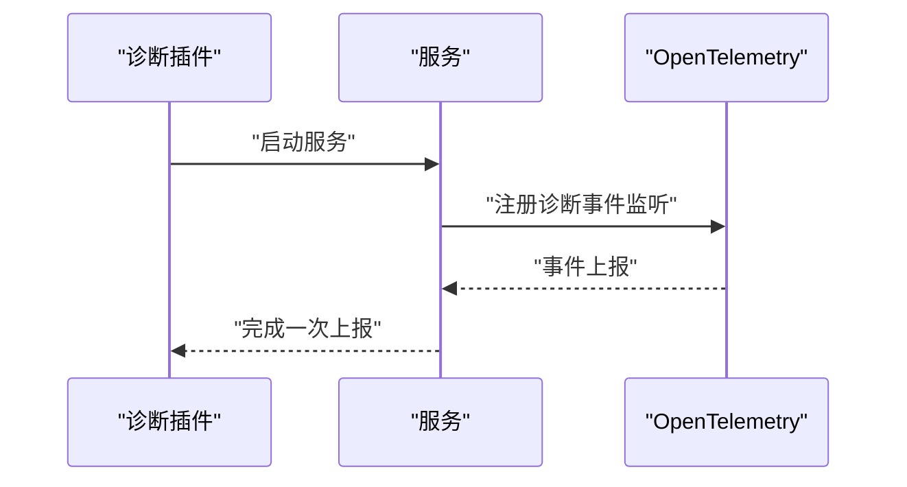
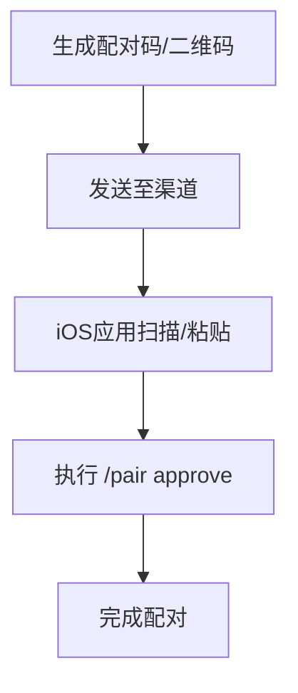
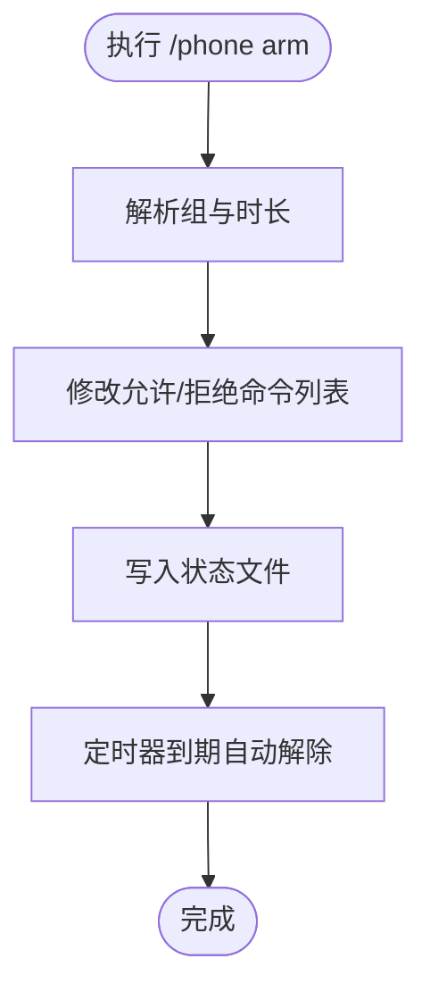
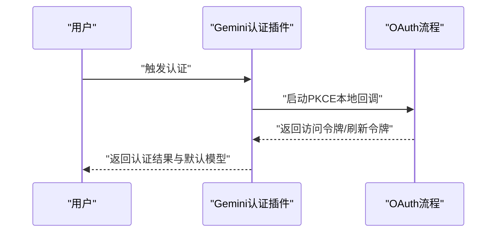
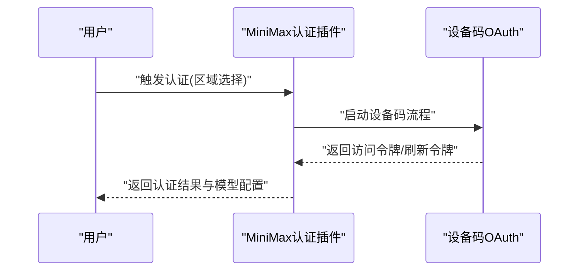
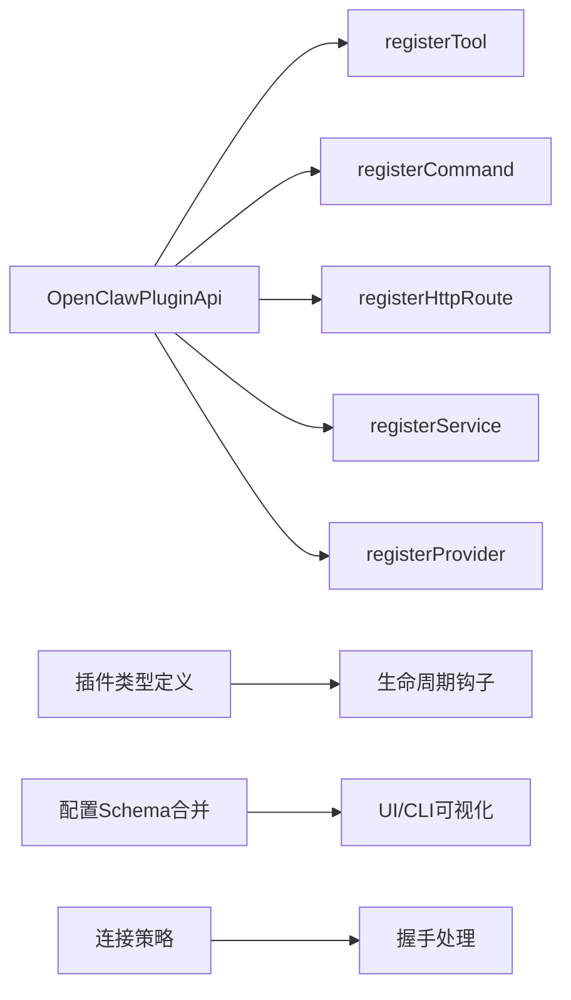

# 工具扩展插件

<cite>
**本文档引用的文件**
- [README.md](file://README.md)
- [extensions/memory-core/index.ts](file://extensions/memory-core/index.ts)
- [extensions/memory-lancedb/index.ts](file://extensions/memory-lancedb/index.ts)
- [extensions/diagnostics-otel/index.ts](file://extensions/diagnostics-otel/index.ts)
- [extensions/device-pair/index.ts](file://extensions/device-pair/index.ts)
- [extensions/phone-control/index.ts](file://extensions/phone-control/index.ts)
- [extensions/google-gemini-cli-auth/index.ts](file://extensions/google-gemini-cli-auth/index.ts)
- [extensions/minimax-portal-auth/index.ts](file://extensions/minimax-portal-auth/index.ts)
- [src/plugin-sdk/index.ts](file://src/plugin-sdk/index.ts)
- [src/plugins/types.ts](file://src/plugins/types.ts)
- [src/config/schema.ts](file://src/config/schema.ts)
- [src/gateway/server/ws-connection/connect-policy.ts](file://src/gateway/server/ws-connection/connect-policy.ts)
- [src/gateway/server/ws-connection/message-handler.ts](file://src/gateway/server/ws-connection/message-handler.ts)
- [src/plugins/hooks.ts](file://src/plugins/hooks.ts)
- [src/plugins/runtime.ts](file://src/plugins/runtime.ts)
</cite>

## 目录

1. [简介](#简介)
2. [项目结构](#项目结构)
3. [核心组件](#核心组件)
4. [架构概览](#架构概览)
5. [详细组件分析](#详细组件分析)
6. [依赖分析](#依赖分析)
7. [性能考虑](#性能考虑)
8. [故障排除指南](#故障排除指南)
9. [结论](#结论)
10. [附录](#附录)

## 简介

本指南面向OpenClaw工具扩展插件的使用者与开发者，系统性介绍内存管理插件、诊断工具插件、设备控制插件与认证代理插件的功能特性、配置方式与集成方法。文档涵盖各插件的安装步骤、配置示例、使用指南、API接口、事件处理与状态管理机制，并提供性能优化建议与故障排除方法，帮助用户在本地或远程环境中安全高效地部署与维护OpenClaw工具生态。

## 项目结构

OpenClaw采用模块化设计，工具扩展通过插件体系实现功能解耦与可插拔扩展。核心目录与关键文件如下：

- 扩展插件目录：extensions/ 下包含各类官方与社区插件，如 memory-core、memory-lancedb、diagnostics-otel、device-pair、phone-control、google-gemini-cli-auth、minimax-portal-auth 等。
- 插件SDK与类型定义：src/plugin-sdk/ 提供统一的插件开发API；src/plugins/types.ts 定义插件生命周期钩子、命令注册、服务注册等核心类型。
- 配置与模式：src/config/schema.ts 将插件配置Schema动态合并到全局配置模式中，确保UI与CLI对插件配置的可视化支持。
- 网关连接策略：src/gateway/server/ws-connection/connect-policy.ts 与 message-handler.ts 定义了设备身份验证、受信代理授权与握手决策流程，保障Control UI与节点设备的安全接入。

**图表来源**

- [extensions/memory-core/index.ts](file://extensions/memory-core/index.ts#L1-L39)
- [extensions/memory-lancedb/index.ts](file://extensions/memory-lancedb/index.ts#L286-L304)
- [extensions/diagnostics-otel/index.ts](file://extensions/diagnostics-otel/index.ts#L1-L16)
- [extensions/device-pair/index.ts](file://extensions/device-pair/index.ts#L346-L530)
- [extensions/phone-control/index.ts](file://extensions/phone-control/index.ts#L286-L422)
- [extensions/google-gemini-cli-auth/index.ts](file://extensions/google-gemini-cli-auth/index.ts#L1-L76)
- [extensions/minimax-portal-auth/index.ts](file://extensions/minimax-portal-auth/index.ts#L130-L162)
- [src/plugin-sdk/index.ts](file://src/plugin-sdk/index.ts#L1-L597)
- [src/plugins/types.ts](file://src/plugins/types.ts#L230-L284)
- [src/config/schema.ts](file://src/config/schema.ts#L232-L271)
- [src/gateway/server/ws-connection/connect-policy.ts](file://src/gateway/server/ws-connection/connect-policy.ts#L1-L102)
- [src/gateway/server/ws-connection/message-handler.ts](file://src/gateway/server/ws-connection/message-handler.ts#L571-L608)

**章节来源**

- [README.md](file://README.md#L1-L556)
- [src/plugin-sdk/index.ts](file://src/plugin-sdk/index.ts#L1-L597)
- [src/plugins/types.ts](file://src/plugins/types.ts#L230-L284)
- [src/config/schema.ts](file://src/config/schema.ts#L232-L271)
- [src/gateway/server/ws-connection/connect-policy.ts](file://src/gateway/server/ws-connection/connect-policy.ts#L1-L102)
- [src/gateway/server/ws-connection/message-handler.ts](file://src/gateway/server/ws-connection/message-handler.ts#L571-L608)

## 核心组件

本节概述四类工具插件的核心能力与职责边界：

- 内存管理插件
  - memory-core：提供基于文件系统的内存搜索与获取工具，以及内存相关CLI命令，适合轻量级会话记忆与检索。
  - memory-lancedb：基于LanceDB的向量内存存储，支持自动捕获与召回，适用于需要语义检索与长期记忆的场景。
- 诊断工具插件
  - diagnostics-otel：将诊断事件导出至OpenTelemetry，便于集中观测与告警。
- 设备控制插件
  - device-pair：生成配对码与二维码，支持受信代理与Tailscale场景下的安全连接，简化iOS节点配对流程。
  - phone-control：临时放行高风险命令（相机、屏幕录制、写入操作），支持定时过期与状态查询。
- 认证代理插件
  - google-gemini-cli-auth：提供Gemini CLI OAuth认证流，自动注入默认模型与凭据。
  - minimax-portal-auth：提供MiniMax模型的OAuth认证流，支持全球与国内区域端点，自动配置模型别名与基础URL。

**章节来源**

- [extensions/memory-core/index.ts](file://extensions/memory-core/index.ts#L1-L39)
- [extensions/memory-lancedb/index.ts](file://extensions/memory-lancedb/index.ts#L286-L304)
- [extensions/diagnostics-otel/index.ts](file://extensions/diagnostics-otel/index.ts#L1-L16)
- [extensions/device-pair/index.ts](file://extensions/device-pair/index.ts#L346-L530)
- [extensions/phone-control/index.ts](file://extensions/phone-control/index.ts#L286-L422)
- [extensions/google-gemini-cli-auth/index.ts](file://extensions/google-gemini-cli-auth/index.ts#L1-L76)
- [extensions/minimax-portal-auth/index.ts](file://extensions/minimax-portal-auth/index.ts#L130-L162)

## 架构概览

OpenClaw插件体系以统一的OpenClawPluginApi为核心，围绕以下能力构建：

- 注册机制：工具注册(registerTool)、命令注册(registerCommand)、HTTP路由注册(registerHttpRoute)、服务注册(registerService)、提供者注册(registerProvider)。
- 生命周期钩子：before_model_resolve、before_prompt_build、message_sending、tool_result_persist、gateway_start/stop等，贯穿消息处理、工具调用与网关启停。
- 配置Schema：插件配置Schema动态合并到全局配置模式，支持UI提示与校验。
- 网关安全：Control UI与节点设备的身份验证、受信代理授权与握手决策，确保仅在安全上下文下允许无设备身份的访问。

**图表来源**

- [src/gateway/server/ws-connection/connect-policy.ts](file://src/gateway/server/ws-connection/connect-policy.ts#L62-L102)
- [src/gateway/server/ws-connection/message-handler.ts](file://src/gateway/server/ws-connection/message-handler.ts#L571-L608)

**章节来源**

- [src/plugin-sdk/index.ts](file://src/plugin-sdk/index.ts#L1-L597)
- [src/plugins/types.ts](file://src/plugins/types.ts#L299-L323)
- [src/gateway/server/ws-connection/connect-policy.ts](file://src/gateway/server/ws-connection/connect-policy.ts#L1-L102)
- [src/gateway/server/ws-connection/message-handler.ts](file://src/gateway/server/ws-connection/message-handler.ts#L571-L608)

## 详细组件分析

### 内存管理插件

#### memory-core（内存核心）

- 功能要点
  - 注册内存搜索与获取工具，支持按会话键检索与读取。
  - 提供内存相关CLI命令，便于调试与批量操作。
- 集成方式
  - 在插件注册函数中调用 api.registerTool 与 api.registerCli，传入工具工厂与命令注册器。
- 配置与使用
  - 该插件使用空配置Schema，无需额外配置即可启用。
  - 建议结合会话管理与工具调用钩子进行二次开发，实现自动记忆捕获与召回。

**图表来源**

- [extensions/memory-core/index.ts](file://extensions/memory-core/index.ts#L10-L35)

**章节来源**

- [extensions/memory-core/index.ts](file://extensions/memory-core/index.ts#L1-L39)

#### memory-lancedb（LanceDB内存）

- 功能要点
  - 基于LanceDB的向量数据库，支持文本向量化与相似度检索。
  - 自动捕获与自动召回机制，可配置嵌入模型与向量维度。
  - 提供删除与计数等管理能力，具备UUID格式校验防止注入。
- 配置项
  - embedding.apiKey：OpenAI API密钥（或其他兼容服务）。
  - embedding.model：嵌入模型名称（如text-embedding-3-small）。
  - dbPath：LanceDB数据库路径（支持变量解析）。
  - autoCapture/autoRecall：是否启用自动捕获与召回。
  - captureMaxChars：单次捕获最大字符数。
- 使用场景
  - 需要语义检索与长期记忆的复杂对话与任务编排。
  - 对向量相似度有要求的问答与知识检索场景。

**图表来源**

- [extensions/memory-lancedb/index.ts](file://extensions/memory-lancedb/index.ts#L59-L157)
- [extensions/memory-lancedb/index.ts](file://extensions/memory-lancedb/index.ts#L163-L204)

**章节来源**

- [extensions/memory-lancedb/index.ts](file://extensions/memory-lancedb/index.ts#L286-L304)
- [extensions/memory-lancedb/index.ts](file://extensions/memory-lancedb/index.ts#L39-L157)
- [extensions/memory-lancedb/index.ts](file://extensions/memory-lancedb/index.ts#L163-L204)

### 诊断工具插件

#### diagnostics-otel（OpenTelemetry诊断）

- 功能要点
  - 将诊断事件导出至OpenTelemetry，便于集中观测与告警。
  - 通过 api.registerService 注册服务，生命周期由插件运行时管理。
- 配置与使用
  - 使用空配置Schema，无需额外配置。
  - 需要在运行环境中正确配置OpenTelemetry导出端点与采样策略。

**图表来源**

- [extensions/diagnostics-otel/index.ts](file://extensions/diagnostics-otel/index.ts#L1-L16)

**章节来源**

- [extensions/diagnostics-otel/index.ts](file://extensions/diagnostics-otel/index.ts#L1-L16)

### 设备控制插件

#### device-pair（设备配对）

- 功能要点
  - 生成配对码与二维码，支持多种渠道发送与扫描。
  - 解析公共URL、Tailscale Serve/Funnel、远程URL与本地绑定地址。
  - 支持受信代理与Token/密码认证，简化iOS节点配对流程。
- 配置项
  - plugins.entries.device-pair.config.publicUrl：强制使用的公共URL。
  - gateway.bind/customBindHost：本地绑定策略。
  - gateway.tailscale.mode：Tailscale暴露模式（serve/funnel/off）。
  - gateway.auth.mode/token/password：认证模式与凭据。
- 使用流程
  - 生成配对码/二维码 → 在iOS应用中输入并连接 → 在渠道中执行 /pair approve → 完成配对。

**图表来源**

- [extensions/device-pair/index.ts](file://extensions/device-pair/index.ts#L346-L530)

**章节来源**

- [extensions/device-pair/index.ts](file://extensions/device-pair/index.ts#L22-L530)

#### phone-control（手机控制）

- 功能要点
  - 临时放行高风险命令（相机、屏幕录制、写入操作），支持定时过期。
  - 维护状态文件记录放行组、命令列表与过期时间，支持手动解除与到期自动解除。
- 配置与使用
  - 通过 /phone status 查看状态，/phone arm <group> [duration] 临时放行，/phone disarm 手动解除。
  - 支持组：camera、screen、writes、all；默认时长10分钟。
- 安全建议
  - 严格限制放行时长，避免长期开放高风险命令。
  - 结合节点侧权限与平台权限管理，确保首次使用仍需用户授权。

**图表来源**

- [extensions/phone-control/index.ts](file://extensions/phone-control/index.ts#L286-L422)

**章节来源**

- [extensions/phone-control/index.ts](file://extensions/phone-control/index.ts#L1-L422)

### 认证代理插件

#### google-gemini-cli-auth（Gemini CLI认证）

- 功能要点
  - 提供Gemini CLI OAuth认证流程，支持PKCE与本地回调。
  - 自动注入默认模型与凭据，支持远程与本地环境。
- 配置与使用
  - 环境变量：OPENCLAW_GEMINI_OAUTH_CLIENT_ID/CLIENT_SECRET 或 GEMINI_CLI_OAUTH_CLIENT_ID/CLIENT_SECRET。
  - 通过插件注册的Provider进行认证，返回OAuth凭据与默认模型。

**图表来源**

- [extensions/google-gemini-cli-auth/index.ts](file://extensions/google-gemini-cli-auth/index.ts#L24-L72)

**章节来源**

- [extensions/google-gemini-cli-auth/index.ts](file://extensions/google-gemini-cli-auth/index.ts#L1-L76)

#### minimax-portal-auth（MiniMax认证）

- 功能要点
  - 支持全球与国内区域端点，提供设备码认证流程。
  - 自动配置模型别名与基础URL，支持OAuth自动刷新。
- 配置与使用
  - 通过插件注册的Provider进行认证，返回凭据与模型配置补丁。
  - 可根据区域选择不同的OAuth处理器。

**图表来源**

- [extensions/minimax-portal-auth/index.ts](file://extensions/minimax-portal-auth/index.ts#L135-L162)

**章节来源**

- [extensions/minimax-portal-auth/index.ts](file://extensions/minimax-portal-auth/index.ts#L1-L162)

## 依赖分析

- 插件SDK与类型
  - OpenClawPluginApi提供统一注册入口，包括工具、命令、HTTP路由、服务与提供者注册。
  - 插件生命周期钩子覆盖消息处理、工具调用、会话管理与网关启停等关键阶段。
- 配置Schema合并
  - 插件配置Schema动态合并到全局配置模式，确保UI与CLI对插件配置的可视化支持。
- 网关安全策略
  - 连接策略与握手处理共同决定是否允许无设备身份的Control UI连接，保障MitM防护与本地回环安全。

**图表来源**

- [src/plugins/types.ts](file://src/plugins/types.ts#L230-L284)
- [src/config/schema.ts](file://src/config/schema.ts#L232-L271)
- [src/gateway/server/ws-connection/connect-policy.ts](file://src/gateway/server/ws-connection/connect-policy.ts#L1-L102)
- [src/gateway/server/ws-connection/message-handler.ts](file://src/gateway/server/ws-connection/message-handler.ts#L571-L608)

**章节来源**

- [src/plugins/types.ts](file://src/plugins/types.ts#L230-L284)
- [src/config/schema.ts](file://src/config/schema.ts#L232-L271)
- [src/gateway/server/ws-connection/connect-policy.ts](file://src/gateway/server/ws-connection/connect-policy.ts#L1-L102)
- [src/gateway/server/ws-connection/message-handler.ts](file://src/gateway/server/ws-connection/message-handler.ts#L571-L608)

## 性能考虑

- 内存插件
  - memory-lancedb：合理设置向量维度与索引参数，避免过大的向量空间导致查询延迟；定期清理低重要性记忆条目。
  - memory-core：在高频检索场景下，建议配合缓存层减少重复读取。
- 诊断插件
  - diagnostics-otel：合理配置采样率与批处理大小，避免高并发下导出端压力过大。
- 设备控制插件
  - phone-control：定时器轮询间隔建议≥15秒，避免频繁磁盘读写；状态文件采用原子写入，确保一致性。
- 认证插件
  - google-gemini-cli-auth/minimax-portal-auth：OAuth回调与令牌刷新应异步处理，避免阻塞主流程。

[本节为通用指导，不直接分析具体文件]

## 故障排除指南

- 设备配对失败
  - 检查 gateway.bind 是否为 lan 或已启用 Tailscale Serve/Funnel；确认 plugins.entries.device-pair.config.publicUrl 配置正确。
  - 若使用受信代理，请确认代理头与授权模式匹配。
- Control UI无法连接
  - 若未配置设备身份且非localhost，将被拒绝；请启用 allowInsecureAuth 或使用HTTPS/localhost。
  - 受信代理Operator角色可通过 trusted-proxy 授权绕过设备身份要求。
- phone-control 无法放行命令
  - 确认节点侧允许命令列表已更新；检查状态文件是否存在且格式正确。
  - 如过期自动解除，需重新执行 /phone arm。
- 认证插件问题
  - google-gemini-cli-auth：确认环境变量与客户端ID/密钥正确；确保Google账户具备Gemini CLI访问权限。
  - minimax-portal-auth：根据区域选择正确的OAuth处理器；若刷新失败，重新登录认证。

**章节来源**

- [extensions/device-pair/index.ts](file://extensions/device-pair/index.ts#L235-L282)
- [src/gateway/server/ws-connection/connect-policy.ts](file://src/gateway/server/ws-connection/connect-policy.ts#L62-L102)
- [src/gateway/server/ws-connection/message-handler.ts](file://src/gateway/server/ws-connection/message-handler.ts#L571-L608)
- [extensions/phone-control/index.ts](file://extensions/phone-control/index.ts#L183-L235)
- [extensions/google-gemini-cli-auth/index.ts](file://extensions/google-gemini-cli-auth/index.ts#L12-L17)
- [extensions/minimax-portal-auth/index.ts](file://extensions/minimax-portal-auth/index.ts#L18-L20)

## 结论

OpenClaw工具扩展插件体系通过统一的SDK与类型系统，实现了内存管理、诊断观测、设备控制与认证代理的模块化扩展。借助生命周期钩子与配置Schema合并，插件可在不侵入核心逻辑的前提下增强系统能力。结合本文档的配置示例、使用指南与故障排除方法，用户可以安全高效地部署与维护各类工具插件，满足从本地到远程的多样化应用场景。

[本节为总结性内容，不直接分析具体文件]

## 附录

- 安装与启用
  - 通过插件管理命令启用目标插件，并在配置中添加对应插件条目。
  - 对于需要外部依赖的插件（如memory-lancedb），确保运行环境具备相应库与权限。
- 最佳实践
  - 为高风险插件（phone-control、device-pair）设置最小权限与最短时长。
  - 使用钩子对敏感操作进行审计与拦截，确保合规与可追溯。
  - 定期审查插件配置与日志，及时发现异常行为。

[本节为通用指导，不直接分析具体文件]
