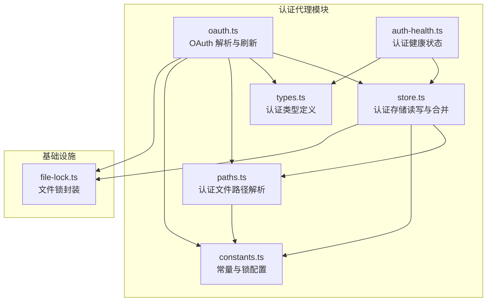
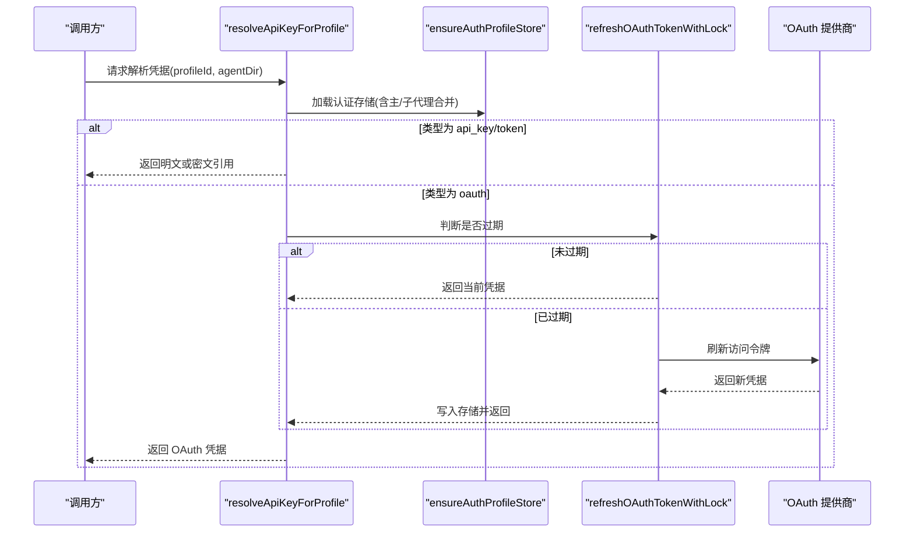
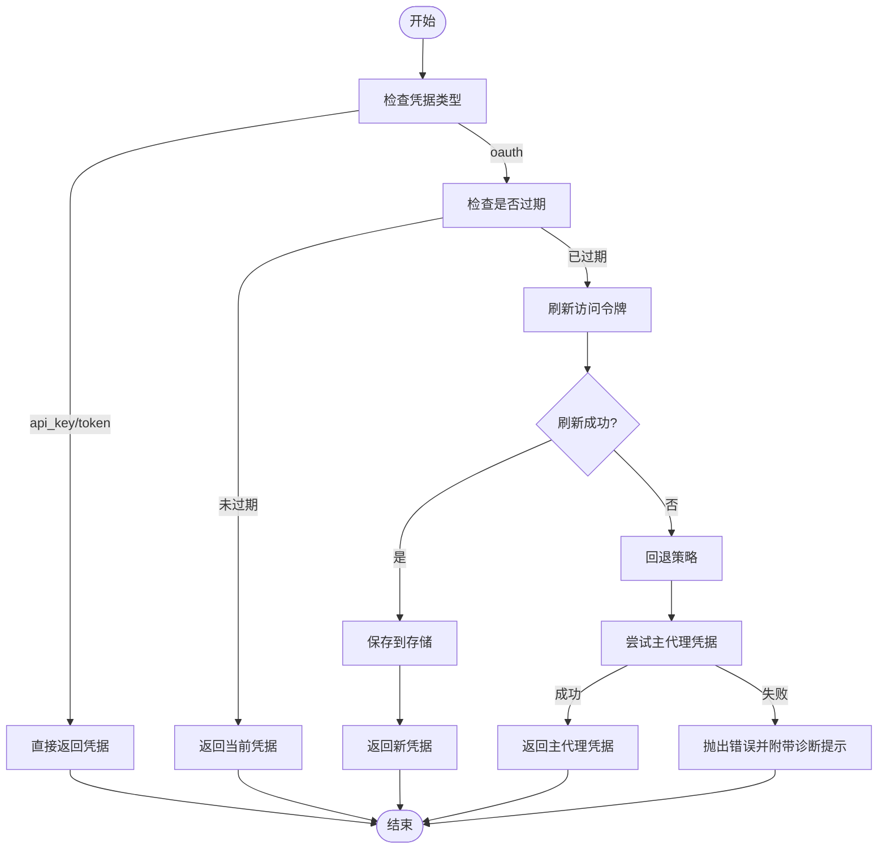
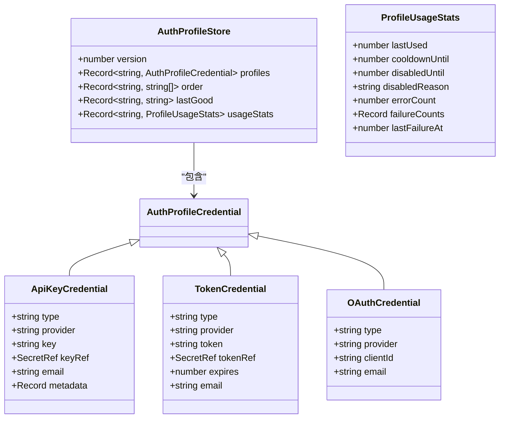
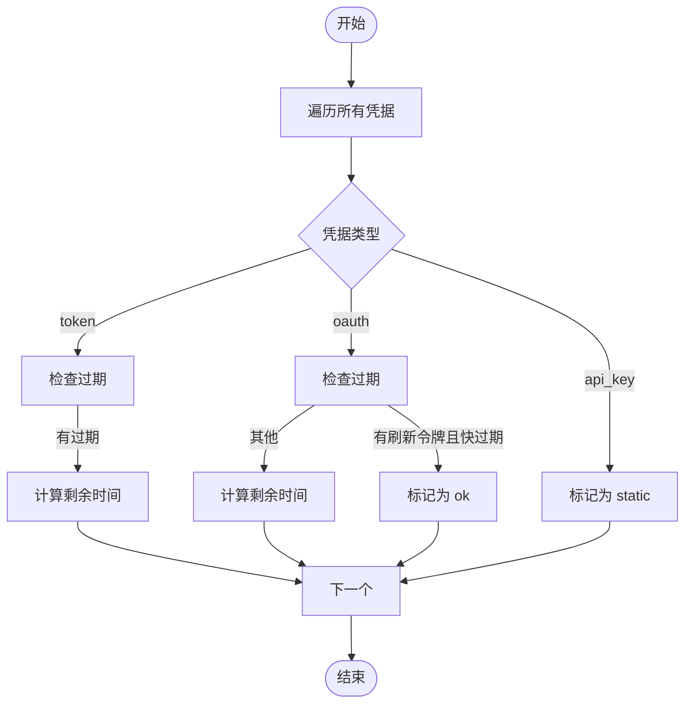
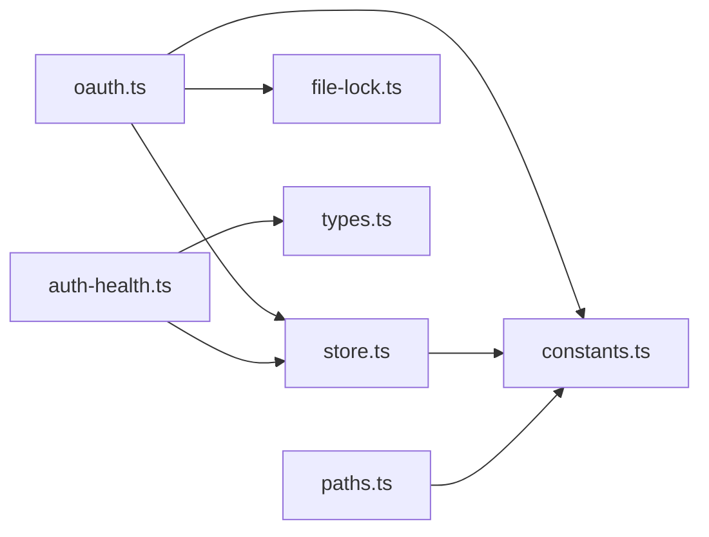

# 认证代理插件

<cite>
**本文档引用的文件**
- [oauth.ts](file://src/agents/auth-profiles/oauth.ts)
- [store.ts](file://src/agents/auth-profiles/store.ts)
- [types.ts](file://src/agents/auth-profiles/types.ts)
- [auth-health.ts](file://src/agents/auth-health.ts)
- [paths.ts](file://src/agents/auth-profiles/paths.ts)
- [constants.ts](file://src/agents/auth-profiles/constants.ts)
- [file-lock.ts](file://src/infra/file-lock.ts)
- [auth-token-Bn0DQLpv.js](file://dist/auth-token-Bn0DQLpv.js)
- [auth-profiles-Dub8kTSL.js](file://dist/auth-profiles-Dub8kTSL.js)
</cite>

## 目录

1. [简介](#简介)
2. [项目结构](#项目结构)
3. [核心组件](#核心组件)
4. [架构总览](#架构总览)
5. [详细组件分析](#详细组件分析)
6. [依赖关系分析](#依赖关系分析)
7. [性能考虑](#性能考虑)
8. [故障排除指南](#故障排除指南)
9. [结论](#结论)
10. [附录](#附录)

## 简介

本文件为 OpenClaw 认证代理插件的完整使用与技术文档，面向需要在多 AI 服务中进行统一认证管理的用户与开发者。内容涵盖：

- OAuth 认证流程与令牌刷新机制
- API 密钥与静态令牌管理
- 会话与权限控制机制
- 配置选项与安装步骤
- 错误处理、重试策略与安全防护
- 实施最佳实践与常见问题排查

## 项目结构

认证代理插件的核心位于 agents 子系统下的 auth-profiles 模块，并与健康检查、路径解析、文件锁等基础设施协同工作。

图表来源

- [oauth.ts](file://src/agents/auth-profiles/oauth.ts#L1-L456)
- [store.ts](file://src/agents/auth-profiles/store.ts#L1-L510)
- [types.ts](file://src/agents/auth-profiles/types.ts#L1-L80)
- [auth-health.ts](file://src/agents/auth-health.ts#L1-L262)
- [paths.ts](file://src/agents/auth-profiles/paths.ts#L1-L34)
- [constants.ts](file://src/agents/auth-profiles/constants.ts#L1-L27)
- [file-lock.ts](file://src/infra/file-lock.ts#L1-L3)

章节来源

- [oauth.ts](file://src/agents/auth-profiles/oauth.ts#L1-L456)
- [store.ts](file://src/agents/auth-profiles/store.ts#L1-L510)
- [types.ts](file://src/agents/auth-profiles/types.ts#L1-L80)
- [auth-health.ts](file://src/agents/auth-health.ts#L1-L262)
- [paths.ts](file://src/agents/auth-profiles/paths.ts#L1-L34)
- [constants.ts](file://src/agents/auth-profiles/constants.ts#L1-L27)
- [file-lock.ts](file://src/infra/file-lock.ts#L1-L3)

## 核心组件

- 认证配置与类型
  - 定义了三种认证类型：API Key、静态令牌（Bearer）、OAuth，并支持扩展元数据与邮箱标识。
- 认证存储与合并
  - 支持主代理与子代理的认证存储合并，兼容旧版 auth.json 迁移。
- OAuth 解析与刷新
  - 统一解析 OAuth 提供商，按需刷新访问令牌；支持多提供商差异化刷新逻辑。
- 健康检查
  - 对 OAuth 与令牌型凭据进行过期时间评估，区分 ok/expiring/expired/missing/static 状态。
- 路径与锁
  - 统一解析认证文件路径，使用文件锁保证并发安全。

章节来源

- [types.ts](file://src/agents/auth-profiles/types.ts#L5-L36)
- [store.ts](file://src/agents/auth-profiles/store.ts#L101-L145)
- [oauth.ts](file://src/agents/auth-profiles/oauth.ts#L28-L40)
- [auth-health.ts](file://src/agents/auth-health.ts#L12-L31)
- [paths.ts](file://src/agents/auth-profiles/paths.ts#L9-L22)
- [constants.ts](file://src/agents/auth-profiles/constants.ts#L12-L21)

## 架构总览

认证代理插件通过“配置解析—凭据加载—类型判定—令牌刷新—结果返回”的流水线，为上层调用方提供统一的认证凭据。其关键流程如下：

图表来源

- [oauth.ts](file://src/agents/auth-profiles/oauth.ts#L292-L455)
- [store.ts](file://src/agents/auth-profiles/store.ts#L462-L482)

## 详细组件分析

### OAuth 认证与令牌刷新

- 功能要点
  - 支持多种 OAuth 提供商，自动识别并调用对应刷新逻辑。
  - 使用文件锁保护并发刷新，避免竞态。
  - 若本地无可用令牌，尝试从主代理继承最新凭据。
  - 刷新失败时提供可操作的诊断提示。
- 关键流程图

图表来源

- [oauth.ts](file://src/agents/auth-profiles/oauth.ts#L141-L198)
- [oauth.ts](file://src/agents/auth-profiles/oauth.ts#L371-L455)

章节来源

- [oauth.ts](file://src/agents/auth-profiles/oauth.ts#L141-L198)
- [oauth.ts](file://src/agents/auth-profiles/oauth.ts#L371-L455)

### 认证存储与合并

- 功能要点
  - 支持主代理与子代理目录的认证存储合并，优先使用子代理覆盖。
  - 自动迁移旧版 auth.json 到新版 auth-profiles.json。
  - 外部 CLI 同步：从外部工具导入 OAuth 凭据并在运行时可见。
- 数据模型类图

图表来源

- [types.ts](file://src/agents/auth-profiles/types.ts#L5-L79)

章节来源

- [store.ts](file://src/agents/auth-profiles/store.ts#L31-L78)
- [store.ts](file://src/agents/auth-profiles/store.ts#L341-L441)
- [types.ts](file://src/agents/auth-profiles/types.ts#L5-L79)

### 认证健康检查

- 功能要点
  - 对每个凭据计算剩余有效期，区分 ok/expiring/expired/missing/static。
  - 对于带刷新令牌的 OAuth，即使即将到期也视为 ok（因首次调用会自动刷新）。
  - 汇总生成按提供商分组的健康摘要。
- 健康状态评估流程

图表来源

- [auth-health.ts](file://src/agents/auth-health.ts#L92-L163)
- [auth-health.ts](file://src/agents/auth-health.ts#L165-L261)

章节来源

- [auth-health.ts](file://src/agents/auth-health.ts#L74-L163)
- [auth-health.ts](file://src/agents/auth-health.ts#L165-L261)

### 路径解析与文件锁

- 功能要点
  - 统一解析认证文件路径，支持用户目录与代理目录。
  - 不存在时自动创建空存储文件。
  - 使用带重试与过期时间的文件锁，确保并发安全。

章节来源

- [paths.ts](file://src/agents/auth-profiles/paths.ts#L9-L33)
- [constants.ts](file://src/agents/auth-profiles/constants.ts#L12-L21)
- [file-lock.ts](file://src/infra/file-lock.ts#L1-L3)

### 安装与配置示例（基于分发产物）

- 分发产物中的认证命令与配置
  - 在 dist 目录中包含认证令牌与配置相关的构建产物，可用于命令行或脚本集成。
  - 示例参考：认证令牌设置、提供商默认环境变量映射、凭据输入模式等。

章节来源

- [auth-token-Bn0DQLpv.js](file://dist/auth-token-Bn0DQLpv.js#L187-L230)
- [auth-token-Bn0DQLpv.js](file://dist/auth-token-Bn0DQLpv.js#L262-L291)
- [auth-profiles-Dub8kTSL.js](file://dist/auth-profiles-Dub8kTSL.js#L1-L27)

## 依赖关系分析

- 组件耦合
  - oauth.ts 依赖 store.ts 的存储读写与合并能力，依赖 constants.ts 的锁与版本常量，依赖 file-lock.ts 的并发控制。
  - auth-health.ts 依赖 store.ts 与 types.ts 的数据结构，用于健康汇总。
  - paths.ts 与 constants.ts 共同决定认证文件位置与默认行为。
- 外部依赖
  - OAuth 提供商 SDK（pi-ai），用于统一获取与刷新令牌。
  - 文件系统与 JSON 序列化，用于持久化存储。

图表来源

- [oauth.ts](file://src/agents/auth-profiles/oauth.ts#L1-L18)
- [store.ts](file://src/agents/auth-profiles/store.ts#L1-L9)
- [auth-health.ts](file://src/agents/auth-health.ts#L1-L6)
- [paths.ts](file://src/agents/auth-profiles/paths.ts#L1-L7)
- [constants.ts](file://src/agents/auth-profiles/constants.ts#L1-L6)
- [file-lock.ts](file://src/infra/file-lock.ts#L1-L2)

## 性能考虑

- 并发安全
  - 使用带指数回退与随机抖动的文件锁，降低锁竞争冲突概率。
- 缓存与合并
  - 运行时缓存主/子代理存储快照，减少重复 IO。
- 外部 CLI 同步
  - 每次加载时同步外部 CLI 凭据，避免频繁写入，仅在变更时保存。

章节来源

- [constants.ts](file://src/agents/auth-profiles/constants.ts#L12-L21)
- [store.ts](file://src/agents/auth-profiles/store.ts#L21-L78)
- [store.ts](file://src/agents/auth-profiles/store.ts#L341-L356)

## 故障排除指南

- 常见问题与定位
  - OAuth 刷新失败：检查提供商可用性、网络连通性与凭据有效性；查看诊断提示与日志。
  - 凭据过期：确认是否具备刷新令牌；若无，需重新授权。
  - 并发冲突：确认文件锁是否生效；避免同时编辑同一认证文件。
- 诊断建议
  - 使用健康检查输出定位具体提供商与凭据状态。
  - 查看认证存储文件是否存在、格式是否正确、是否被只读挂载。

章节来源

- [oauth.ts](file://src/agents/auth-profiles/oauth.ts#L441-L454)
- [auth-health.ts](file://src/agents/auth-health.ts#L165-L261)
- [store.ts](file://src/agents/auth-profiles/store.ts#L341-L372)

## 结论

OpenClaw 认证代理插件通过统一的凭据模型、健壮的并发控制与灵活的刷新策略，为多提供商 AI 服务提供了稳定可靠的认证与授权基础。结合健康检查与诊断提示，用户可以高效完成安装、配置与运维。

## 附录

- 安全最佳实践
  - 优先使用 OAuth 并保留刷新令牌，避免长期暴露访问令牌。
  - 将敏感凭据以密文引用方式存储，配合密钥管理服务。
  - 定期检查健康状态，提前发现即将过期的凭据。
  - 限制认证存储文件权限，避免非授权访问。
- API 接口与会话管理
  - 通过认证存储与健康检查接口实现凭据生命周期管理。
  - 会话层面建议结合网关侧的速率限制与设备令牌验证（如适用）。
