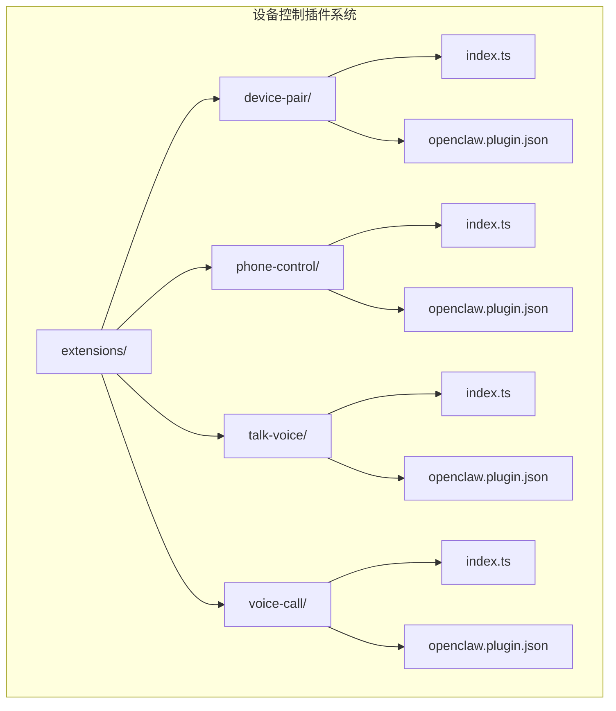
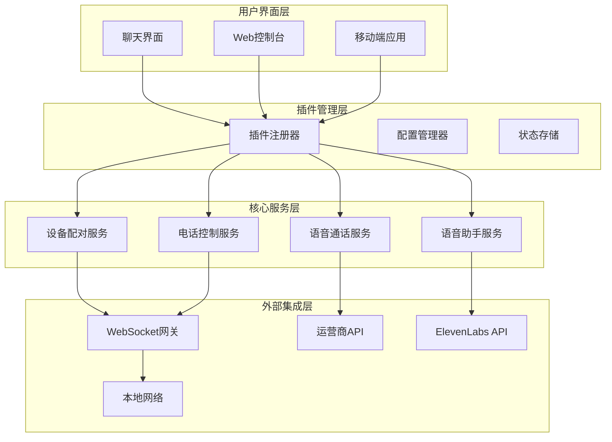
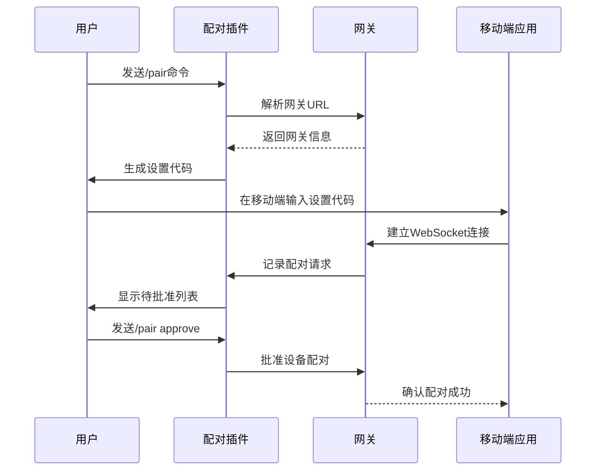
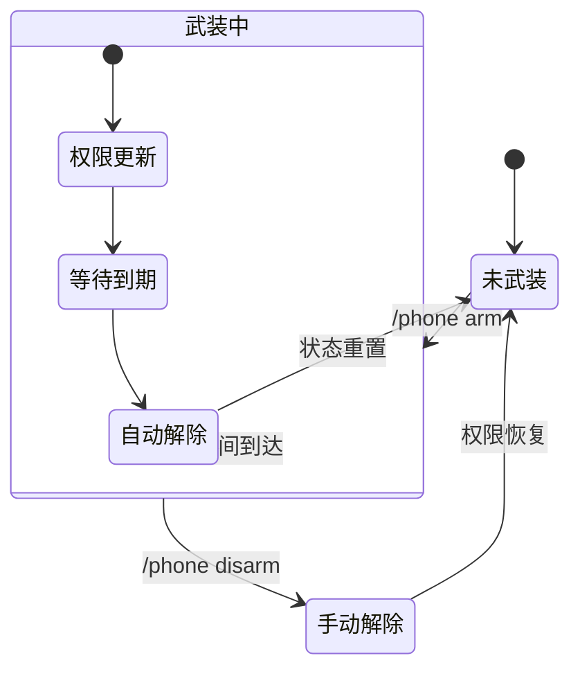
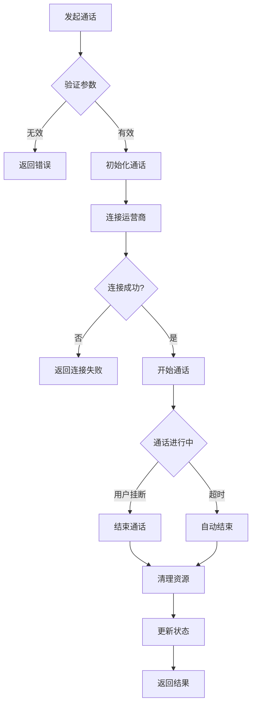
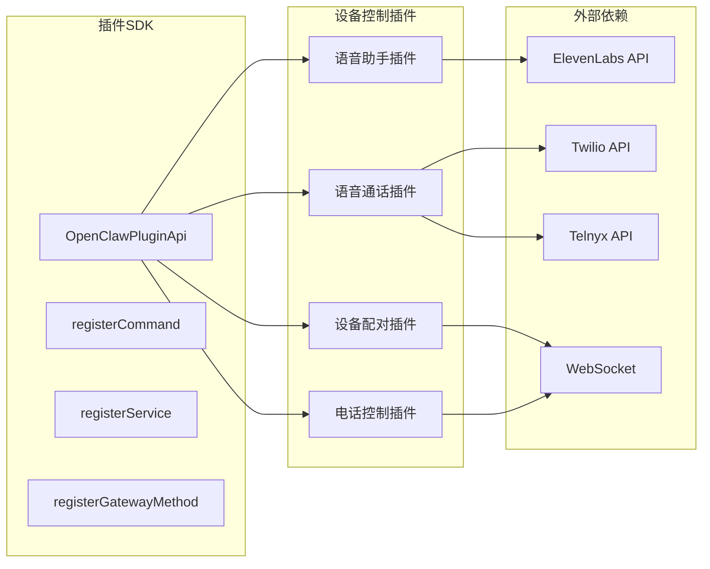

# 设备控制插件

<cite>
**本文档引用的文件**
- [extensions/device-pair/index.ts](file://extensions/device-pair/index.ts)
- [extensions/device-pair/openclaw.plugin.json](file://extensions/device-pair/openclaw.plugin.json)
- [extensions/phone-control/index.ts](file://extensions/phone-control/index.ts)
- [extensions/phone-control/openclaw.plugin.json](file://extensions/phone-control/openclaw.plugin.json)
- [extensions/talk-voice/index.ts](file://extensions/talk-voice/index.ts)
- [extensions/talk-voice/openclaw.plugin.json](file://extensions/talk-voice/openclaw.plugin.json)
- [extensions/voice-call/index.ts](file://extensions/voice-call/index.ts)
- [extensions/voice-call/openclaw.plugin.json](file://extensions/voice-call/openclaw.plugin.json)
- [src/plugin-sdk/index.ts](file://src/plugin-sdk/index.ts)
- [README.md](file://README.md)
</cite>

## 目录

1. [简介](#简介)
2. [项目结构](#项目结构)
3. [核心组件](#核心组件)
4. [架构概览](#架构概览)
5. [详细组件分析](#详细组件分析)
6. [依赖关系分析](#依赖关系分析)
7. [性能考虑](#性能考虑)
8. [故障排除指南](#故障排除指南)
9. [结论](#结论)

## 简介

OpenClaw设备控制插件是一套完整的设备管理解决方案，专为个人AI助手设计。该插件系统提供了设备配对、电话控制、语音通话和语音助手插件的核心功能，支持iOS、Android等移动设备与OpenClaw网关的无缝连接。

本插件系统基于OpenClaw的插件架构，采用模块化设计，每个插件都具有独立的功能域和配置选项。系统支持多种通信协议，包括WebSocket、HTTP/HTTPS以及本地网络发现机制。

## 项目结构

OpenClaw设备控制插件位于`extensions/`目录下，包含四个主要插件：

**图表来源**

- [extensions/device-pair/index.ts](file://extensions/device-pair/index.ts#L1-L530)
- [extensions/phone-control/index.ts](file://extensions/phone-control/index.ts#L1-L422)
- [extensions/talk-voice/index.ts](file://extensions/talk-voice/index.ts#L1-L151)
- [extensions/voice-call/index.ts](file://extensions/voice-call/index.ts#L1-L513)

**章节来源**

- [extensions/device-pair/index.ts](file://extensions/device-pair/index.ts#L1-L530)
- [extensions/phone-control/index.ts](file://extensions/phone-control/index.ts#L1-L422)
- [extensions/talk-voice/index.ts](file://extensions/talk-voice/index.ts#L1-L151)
- [extensions/voice-call/index.ts](file://extensions/voice-call/index.ts#L1-L513)

## 核心组件

### 设备配对插件 (Device Pairing)

设备配对插件是整个设备控制系统的核心，负责建立和管理设备与网关的安全连接。

**主要功能：**

- 自动生成安全的设置代码
- 支持QR码扫描配对
- 管理待批准的配对请求
- 处理设备认证和授权

**配置选项：**

- `publicUrl`: 公共WebSocket URL
- 支持环境变量覆盖

**章节来源**

- [extensions/device-pair/index.ts](file://extensions/device-pair/index.ts#L22-L43)
- [extensions/device-pair/openclaw.plugin.json](file://extensions/device-pair/openclaw.plugin.json#L5-L19)

### 电话控制插件 (Phone Control)

电话控制插件专门管理高风险的电话节点命令，提供临时权限控制机制。

**主要功能：**

- 按组别控制相机、屏幕录制、写入操作
- 支持定时自动解除
- 维护权限状态文件
- 提供状态查询和手动解除

**支持的命令组：**

- `camera`: 相机拍照/录像
- `screen`: 屏幕录制
- `writes`: 日历、联系人、提醒事项添加
- `all`: 所有上述功能

**章节来源**

- [extensions/phone-control/index.ts](file://extensions/phone-control/index.ts#L5-L48)
- [extensions/phone-control/openclaw.plugin.json](file://extensions/phone-control/openclaw.plugin.json#L5-L9)

### 语音助手插件 (Talk Voice)

语音助手插件管理ElevenLabs语音助手的选择和配置。

**主要功能：**

- 列出可用的语音选项
- 设置默认语音
- 查询当前语音状态
- 集成ElevenLabs API

**章节来源**

- [extensions/talk-voice/index.ts](file://extensions/talk-voice/index.ts#L1-L151)
- [extensions/talk-voice/openclaw.plugin.json](file://extensions/talk-voice/openclaw.plugin.json#L5-L9)

### 语音通话插件 (Voice Call)

语音通话插件提供完整的电话通话功能，支持多种运营商和实时流处理。

**主要功能：**

- 支持Twilio、Telnyx、Plivo等运营商
- 实时语音流处理
- 入站和出站通话管理
- 通话状态监控和控制

**支持的提供商：**

- Twilio: 完整的企业级服务
- Telnyx: 低延迟连接
- Plivo: 成本优化方案
- Mock: 开发测试模式

**章节来源**

- [extensions/voice-call/index.ts](file://extensions/voice-call/index.ts#L1-L513)
- [extensions/voice-call/openclaw.plugin.json](file://extensions/voice-call/openclaw.plugin.json#L1-L560)

## 架构概览

OpenClaw设备控制插件采用分层架构设计，确保了系统的可扩展性和安全性：

**图表来源**

- [src/plugin-sdk/index.ts](file://src/plugin-sdk/index.ts#L472-L519)
- [extensions/device-pair/index.ts](file://extensions/device-pair/index.ts#L346-L529)
- [extensions/phone-control/index.ts](file://extensions/phone-control/index.ts#L286-L421)

## 详细组件分析

### 设备配对流程

设备配对插件实现了完整的端到端配对流程：

**图表来源**

- [extensions/device-pair/index.ts](file://extensions/device-pair/index.ts#L351-L427)

**章节来源**

- [extensions/device-pair/index.ts](file://extensions/device-pair/index.ts#L346-L529)

### 电话控制状态管理

电话控制插件使用状态文件管理系统权限：

**图表来源**

- [extensions/phone-control/index.ts](file://extensions/phone-control/index.ts#L183-L235)

**章节来源**

- [extensions/phone-control/index.ts](file://extensions/phone-control/index.ts#L183-L421)

### 语音通话生命周期

语音通话插件管理完整的通话生命周期：

**图表来源**

- [extensions/voice-call/index.ts](file://extensions/voice-call/index.ts#L192-L345)

**章节来源**

- [extensions/voice-call/index.ts](file://extensions/voice-call/index.ts#L148-L513)

## 依赖关系分析

设备控制插件系统依赖于OpenClaw的核心插件SDK：

**图表来源**

- [src/plugin-sdk/index.ts](file://src/plugin-sdk/index.ts#L472-L519)

**章节来源**

- [src/plugin-sdk/index.ts](file://src/plugin-sdk/index.ts#L1-L597)

## 性能考虑

### 内存管理

电话控制插件使用高效的内存管理策略：

- **状态文件缓存**: 使用异步文件I/O避免阻塞主事件循环
- **定时器优化**: 15秒检查间隔平衡响应性和资源消耗
- **权限集合**: 使用Set数据结构确保O(1)查找性能

### 网络优化

设备配对插件实现多路径URL解析：

- **优先级顺序**: publicUrl > Tailscale > 远程URL > 本地绑定
- **IPv4过滤**: 智能选择私有网络地址
- **超时控制**: 所有网络请求都有适当的超时设置

### 并发处理

语音通话插件支持并发管理：

- **最大并发数**: 可配置的最大同时通话数量
- **资源池**: 限制同时活跃的通话资源
- **优雅降级**: 超出限制时拒绝新连接而非崩溃

## 故障排除指南

### 常见问题诊断

**设备无法配对**

1. 检查网关URL解析是否正确
2. 验证认证凭据配置
3. 确认网络连通性
4. 查看日志中的详细错误信息

**电话控制权限异常**

1. 检查状态文件完整性
2. 验证配置文件权限
3. 确认定时器服务正常运行
4. 查看权限恢复日志

**语音通话连接失败**

1. 验证运营商API密钥
2. 检查网络防火墙设置
3. 确认端口转发配置
4. 测试API连接性

### 性能监控

**监控指标**

- 插件加载时间
- 命令执行延迟
- 内存使用情况
- 网络请求成功率

**调试工具**

- 启用详细日志记录
- 使用插件诊断命令
- 监控系统资源使用
- 分析错误报告

**章节来源**

- [extensions/device-pair/index.ts](file://extensions/device-pair/index.ts#L452-L522)
- [extensions/phone-control/index.ts](file://extensions/phone-control/index.ts#L289-L328)

## 结论

OpenClaw设备控制插件系统提供了一个完整、安全且高性能的设备管理解决方案。通过模块化设计和标准化的插件接口，系统能够灵活地支持各种设备控制需求。

**主要优势：**

- **安全性**: 完整的设备认证和权限控制
- **可扩展性**: 模块化插件架构支持功能扩展
- **易用性**: 简单的命令行接口和配置管理
- **可靠性**: 完善的错误处理和故障恢复机制

**适用场景：**

- 个人AI助手的设备控制
- 家庭自动化系统
- 移动办公环境
- 开发测试环境

该插件系统为用户提供了从设备配对到高级控制的完整解决方案，是构建智能设备生态系统的基础框架。
