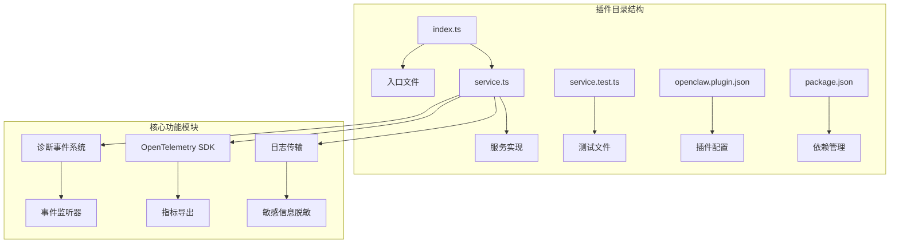
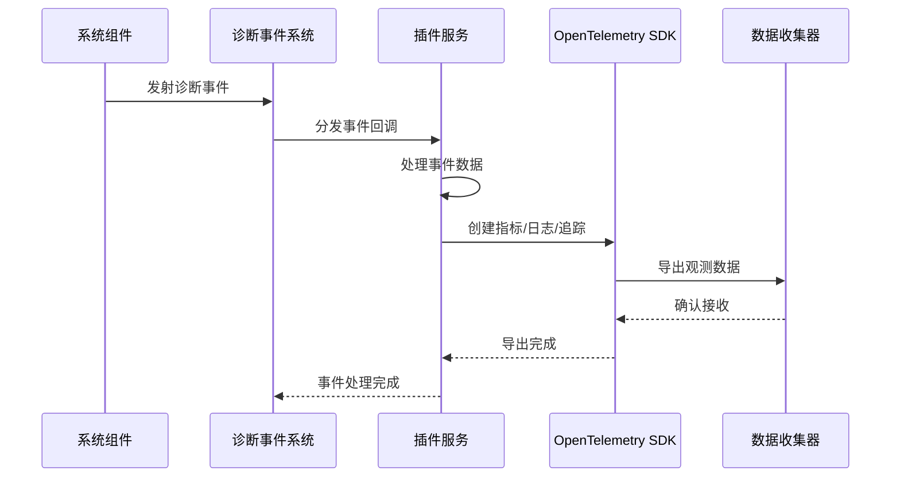
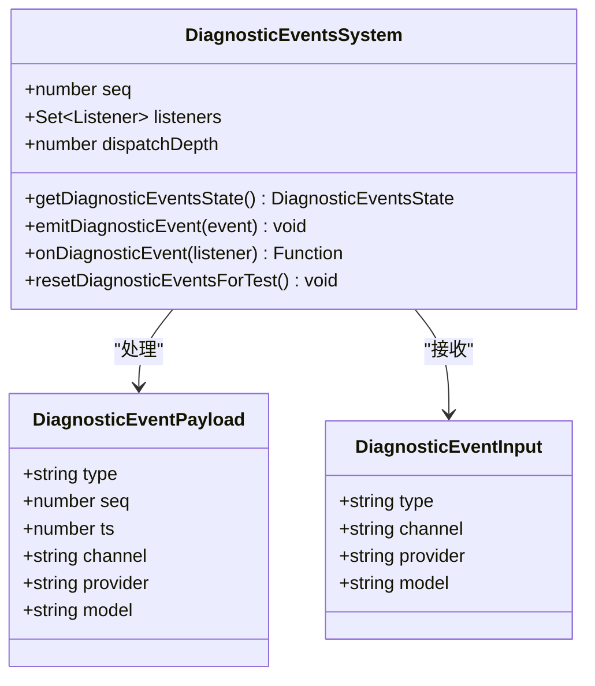
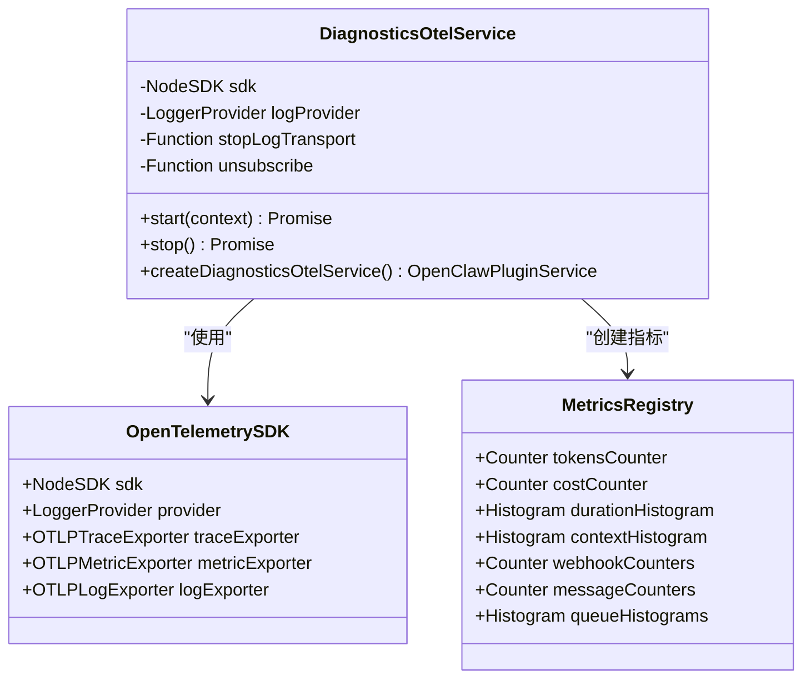
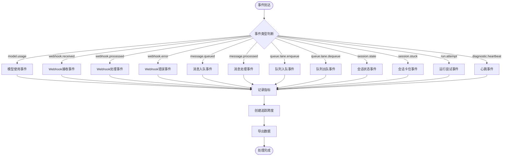

# 诊断监控插件

<cite>
**本文档引用的文件**
- [package.json](file://extensions/diagnostics-otel/package.json)
- [index.ts](file://extensions/diagnostics-otel/index.ts)
- [service.ts](file://extensions/diagnostics-otel/src/service.ts)
- [service.test.ts](file://extensions/diagnostics-otel/src/service.test.ts)
- [openclaw.plugin.json](file://extensions/diagnostics-otel/openclaw.plugin.json)
- [diagnostic-events.ts](file://src/infra/diagnostic-events.ts)
</cite>

## 目录

1. [简介](#简介)
2. [项目结构](#项目结构)
3. [核心组件](#核心组件)
4. [架构概览](#架构概览)
5. [详细组件分析](#详细组件分析)
6. [依赖关系分析](#依赖关系分析)
7. [性能考虑](#性能考虑)
8. [故障排除指南](#故障排除指南)
9. [结论](#结论)
10. [附录](#附录)

## 简介

OpenClaw诊断监控插件是一个基于OpenTelemetry的诊断数据收集和监控解决方案。该插件能够实时收集系统运行时的诊断事件，包括模型使用情况、消息处理流程、会话状态等关键指标，并通过OTLP协议将其导出到OpenTelemetry收集器。

该插件提供了完整的可观测性功能，包括：

- 实时诊断事件收集和处理
- 多维度监控指标（计数器、直方图、跨度）
- 日志聚合和敏感信息脱敏
- 性能监控和告警机制
- 支持分布式追踪和指标上报

## 项目结构

诊断监控插件采用模块化设计，主要包含以下核心文件：



**图表来源**

- [index.ts](file://extensions/diagnostics-otel/index.ts#L1-L15)
- [service.ts](file://extensions/diagnostics-otel/src/service.ts#L65-L679)

**章节来源**

- [package.json](file://extensions/diagnostics-otel/package.json#L1-L25)
- [index.ts](file://extensions/diagnostics-otel/index.ts#L1-L15)

## 核心组件

### 插件注册器

插件通过标准的OpenClaw插件接口进行注册，提供统一的生命周期管理。

### 诊断事件处理器

负责接收和处理来自系统各组件的诊断事件，支持多种事件类型和数据格式。

### OpenTelemetry导出器

集成了完整的OpenTelemetry生态系统，支持指标、日志和追踪的导出功能。

**章节来源**

- [index.ts](file://extensions/diagnostics-otel/index.ts#L5-L12)
- [service.ts](file://extensions/diagnostics-otel/src/service.ts#L65-L70)

## 架构概览

诊断监控插件采用事件驱动的架构模式，通过观察者模式实现松耦合的数据收集和处理。



**图表来源**

- [diagnostic-events.ts](file://src/infra/diagnostic-events.ts#L195-L227)
- [service.ts](file://extensions/diagnostics-otel/src/service.ts#L612-L657)

## 详细组件分析

### 诊断事件系统

诊断事件系统是整个监控插件的核心基础设施，负责事件的收集、分发和管理。



**图表来源**

- [diagnostic-events.ts](file://src/infra/diagnostic-events.ts#L171-L175)
- [diagnostic-events.ts](file://src/infra/diagnostic-events.ts#L150-L163)

### OpenTelemetry服务实现

服务实现封装了完整的OpenTelemetry集成逻辑，包括SDK初始化、指标创建和数据导出。



**图表来源**

- [service.ts](file://extensions/diagnostics-otel/src/service.ts#L65-L70)
- [service.ts](file://extensions/diagnostics-otel/src/service.ts#L160-L235)

### 事件处理流程

插件支持多种诊断事件类型的处理，每种事件都有专门的处理逻辑和指标记录。



**图表来源**

- [service.ts](file://extensions/diagnostics-otel/src/service.ts#L612-L657)
- [service.ts](file://extensions/diagnostics-otel/src/service.ts#L375-L437)

**章节来源**

- [service.ts](file://extensions/diagnostics-otel/src/service.ts#L65-L679)

## 依赖关系分析

诊断监控插件依赖于多个OpenTelemetry组件来实现完整的可观测性功能。

```mermaid
graph TB
subgraph "OpenClaw插件系统"
A[plugin-sdk] --> B[诊断事件API]
A --> C[日志传输API]
A --> D[配置管理]
end
subgraph "OpenTelemetry核心"
E[@opentelemetry/api] --> F[指标API]
E --> G[追踪API]
E --> H[日志API]
I[@opentelemetry/sdk-node] --> J[Node SDK]
K[@opentelemetry/sdk-metrics] --> L[指标SDK]
M[@opentelemetry/sdk-logs] --> N[日志SDK]
O[@opentelemetry/sdk-trace-base] --> P[追踪SDK]
end
subgraph "导出器"
Q[@opentelemetry/exporter-metrics-otlp-proto] --> R[指标OTLP导出器]
S[@opentelemetry/exporter-trace-otlp-proto] --> T[追踪OTLP导出器]
U[@opentelemetry/exporter-logs-otlp-proto] --> V[日志OTLP导出器]
end
subgraph "资源和约定"
W[@opentelemetry/resources] --> X[资源管理]
Y[@opentelemetry/semantic-conventions] --> Z[语义约定]
end
A --> E
A --> I
A --> Q
A --> S
A --> U
A --> W
A --> Y
```

**图表来源**

- [package.json](file://extensions/diagnostics-otel/package.json#L6-L18)

**章节来源**

- [package.json](file://extensions/diagnostics-otel/package.json#L1-L25)

## 性能考虑

### 指标采样策略

插件支持基于比率的采样机制，可以通过配置参数控制采样率，平衡监控精度和性能开销。

### 批量导出优化

- 指标和日志采用批量导出模式，减少网络请求次数
- 可配置刷新间隔，优化内存使用和网络带宽
- 使用异步处理避免阻塞主执行线程

### 内存管理

- 自动清理未使用的指标和资源
- 提供优雅的停止机制确保资源正确释放
- 监控内存使用情况，防止内存泄漏

## 故障排除指南

### 常见问题诊断

**连接问题**

- 检查OTLP端点URL格式是否正确
- 验证网络连通性和防火墙设置
- 确认认证凭据和头部信息配置

**数据导出失败**

- 查看日志中具体的错误信息和堆栈跟踪
- 验证OpenTelemetry收集器的可用性
- 检查指标名称和属性的命名规范

**性能问题**

- 调整采样率参数降低监控开销
- 优化导出频率和批量大小
- 检查系统资源使用情况

**章节来源**

- [service.ts](file://extensions/diagnostics-otel/src/service.ts#L145-L148)
- [service.ts](file://extensions/diagnostics-otel/src/service.ts#L355-L357)

## 结论

OpenClaw诊断监控插件提供了一个完整、可扩展的可观测性解决方案。通过集成OpenTelemetry生态系统，该插件能够满足现代应用对性能监控、故障诊断和系统运维的各种需求。

主要优势包括：

- 完整的诊断事件覆盖范围
- 灵活的配置选项和部署方式
- 强大的指标和日志处理能力
- 优秀的性能表现和资源管理
- 易于集成和扩展的架构设计

## 附录

### 配置选项参考

| 配置项                           | 类型    | 默认值          | 描述                  |
| -------------------------------- | ------- | --------------- | --------------------- |
| diagnostics.enabled              | boolean | false           | 启用诊断监控功能      |
| diagnostics.otel.enabled         | boolean | false           | 启用OpenTelemetry导出 |
| diagnostics.otel.endpoint        | string  | undefined       | OTLP收集器端点URL     |
| diagnostics.otel.protocol        | string  | "http/protobuf" | 通信协议类型          |
| diagnostics.otel.serviceName     | string  | "openclaw"      | 服务名称标识          |
| diagnostics.otel.sampleRate      | number  | undefined       | 指标采样率(0-1)       |
| diagnostics.otel.flushIntervalMs | number  | undefined       | 刷新间隔毫秒数        |
| diagnostics.otel.headers         | object  | undefined       | HTTP请求头配置        |
| diagnostics.otel.traces          | boolean | true            | 启用追踪导出          |
| diagnostics.otel.metrics         | boolean | true            | 启用指标导出          |
| diagnostics.otel.logs            | boolean | false           | 启用日志导出          |

### 支持的诊断事件类型

| 事件类型             | 描述         | 关键指标                        |
| -------------------- | ------------ | ------------------------------- |
| model.usage          | 模型使用统计 | 输入/输出令牌数、成本、处理时间 |
| webhook.received     | Webhook接收  | 接收计数、更新类型              |
| webhook.processed    | Webhook处理  | 处理计数、处理时长              |
| webhook.error        | Webhook错误  | 错误计数、错误详情              |
| message.queued       | 消息入队     | 入队计数、队列深度              |
| message.processed    | 消息处理     | 处理计数、处理结果、时长        |
| queue.lane.enqueue   | 队列入队     | 入队计数、队列大小              |
| queue.lane.dequeue   | 队列出队     | 出队计数、等待时长              |
| session.state        | 会话状态     | 状态转换、原因描述              |
| session.stuck        | 会话卡住     | 卡住计数、年龄时长              |
| run.attempt          | 运行尝试     | 尝试次数                        |
| diagnostic.heartbeat | 心跳监控     | 队列状态、活跃度                |

### 安装和部署步骤

1. **安装依赖**

   ```bash
   npm install @openclaw/diagnostics-otel
   ```

2. **配置插件**
   在OpenClaw配置文件中添加：

   ```json
   {
     "plugins": ["@openclaw/diagnostics-otel"],
     "diagnostics": {
       "enabled": true,
       "otel": {
         "enabled": true,
         "endpoint": "http://otel-collector:4318",
         "protocol": "http/protobuf",
         "serviceName": "my-app"
       }
     }
   }
   ```

3. **启动服务**
   启动OpenClaw应用后，插件会自动注册并开始收集诊断数据。

### 集成最佳实践

- **生产环境配置**：启用指标和追踪导出，禁用日志导出以降低成本
- **开发环境配置**：启用所有导出功能以便调试和分析
- **性能监控**：定期检查队列深度和处理延迟指标
- **告警设置**：基于会话卡住和错误率设置告警规则
- **数据保留**：合理配置指标和日志的保留策略
