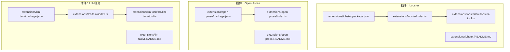
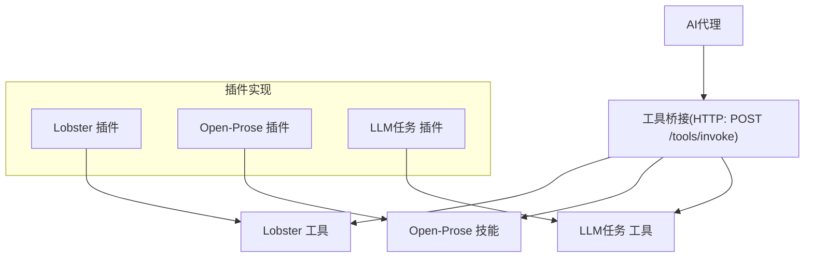
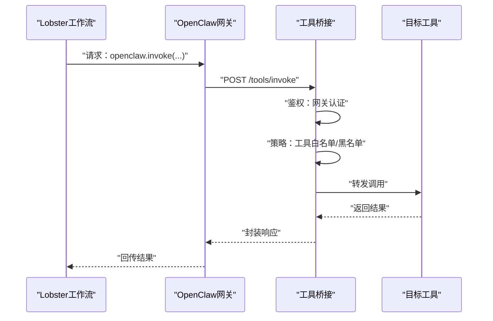
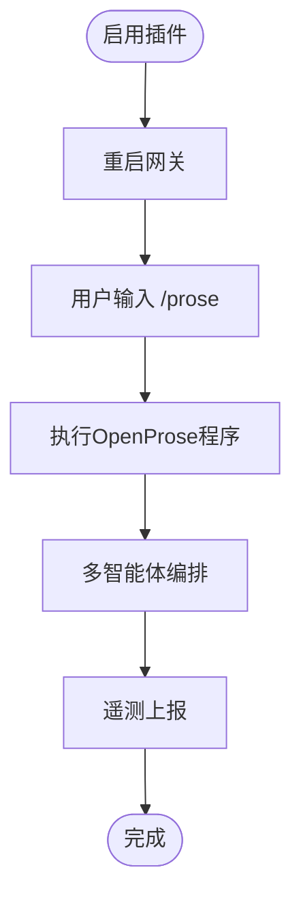
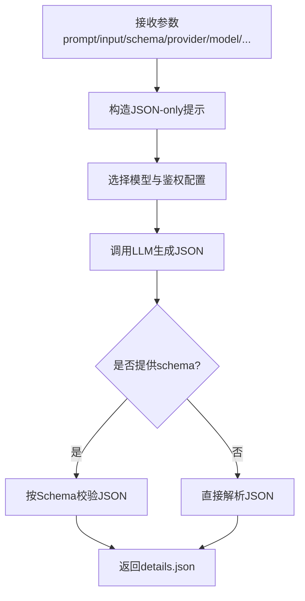
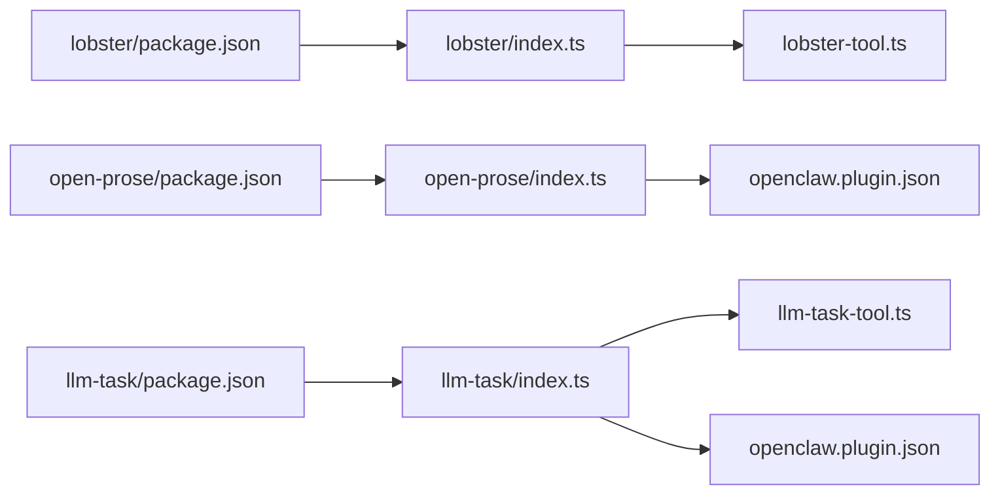

# AI技能插件

<cite>
**本文引用的文件**
- [extensions/llm-task/README.md](file://extensions/llm-task/README.md)
- [extensions/llm-task/package.json](file://extensions/llm-task/package.json)
- [extensions/llm-task/index.ts](file://extensions/llm-task/index.ts)
- [extensions/llm-task/src/llm-task-tool.ts](file://extensions/llm-task/src/llm-task-tool.ts)
- [extensions/llm-task/src/llm-task-tool.test.ts](file://extensions/llm-task/src/llm-task-tool.test.ts)
- [extensions/llm-task/openclaw.plugin.json](file://extensions/llm-task/openclaw.plugin.json)
- [extensions/lobster/README.md](file://extensions/lobster/README.md)
- [extensions/lobster/package.json](file://extensions/lobster/package.json)
- [extensions/lobster/index.ts](file://extensions/lobster/index.ts)
- [extensions/lobster/src/lobster-tool.ts](file://extensions/lobster/src/lobster-tool.ts)
- [extensions/lobster/src/lobster-tool.test.ts](file://extensions/lobster/src/lobster-tool.test.ts)
- [extensions/lobster/SKILL.md](file://extensions/lobster/SKILL.md)
- [extensions/lobster/openclaw.plugin.json](file://extensions/lobster/openclaw.plugin.json)
- [extensions/open-prose/README.md](file://extensions/open-prose/README.md)
- [extensions/open-prose/package.json](file://extensions/open-prose/package.json)
- [extensions/open-prose/index.ts](file://extensions/open-prose/index.ts)
- [extensions/open-prose/openclaw.plugin.json](file://extensions/open-prose/openclaw.plugin.json)
</cite>

## 目录

1. [简介](#简介)
2. [项目结构](#项目结构)
3. [核心组件](#核心组件)
4. [架构总览](#架构总览)
5. [详细组件分析](#详细组件分析)
6. [依赖关系分析](#依赖关系分析)
7. [性能考虑](#性能考虑)
8. [故障排查指南](#故障排查指南)
9. [结论](#结论)
10. [附录](#附录)

## 简介

本文件面向开发者与使用者，系统化介绍三类AI技能插件：Lobster工作流工具、Open-Prose文本处理技能与LLM任务管理插件。内容涵盖功能特性、配置参数、API接口、集成方式、工具调用机制、结果处理流程、性能优化、错误处理与调试技巧，并提供在AI代理中使用这些插件的实践指引。

## 项目结构

三个插件均采用OpenClaw扩展规范，通过package.json中的openclaw字段声明入口脚本，配合openclaw.plugin.json注册工具与能力；README.md提供启用与使用说明；部分插件包含src目录下的具体实现与测试。

**图示来源**

- [extensions/lobster/package.json](file://extensions/lobster/package.json#L1-L12)
- [extensions/lobster/index.ts](file://extensions/lobster/index.ts)
- [extensions/lobster/src/lobster-tool.ts](file://extensions/lobster/src/lobster-tool.ts)
- [extensions/open-prose/package.json](file://extensions/open-prose/package.json#L1-L13)
- [extensions/open-prose/index.ts](file://extensions/open-prose/index.ts)
- [extensions/open-prose/README.md](file://extensions/open-prose/README.md#L1-L26)
- [extensions/llm-task/package.json](file://extensions/llm-task/package.json#L1-L13)
- [extensions/llm-task/index.ts](file://extensions/llm-task/index.ts)
- [extensions/llm-task/src/llm-task-tool.ts](file://extensions/llm-task/src/llm-task-tool.ts)
- [extensions/llm-task/README.md](file://extensions/llm-task/README.md#L1-L98)

**章节来源**

- [extensions/lobster/package.json](file://extensions/lobster/package.json#L1-L12)
- [extensions/open-prose/package.json](file://extensions/open-prose/package.json#L1-L13)
- [extensions/llm-task/package.json](file://extensions/llm-task/package.json#L1-L13)

## 核心组件

- Lobster 工作流工具：提供可选插件工具，用于在OpenClaw中集成Lobster工作流引擎，支持带类型约束的JSON管道与可恢复审批流程。通过工具桥接HTTP端点调用OpenClaw内部工具。
- Open-Prose 文本处理技能：提供OpenProse技能包与“/prose”斜杠命令，支持.prose程序与多智能体编排，具备遥测能力。
- LLM任务管理插件：提供JSON-only LLM任务工具（如草稿、摘要、分类），支持可选的JSON Schema校验，适合从工作流引擎（如Lobster）调用。

**章节来源**

- [extensions/lobster/README.md](file://extensions/lobster/README.md#L1-L76)
- [extensions/open-prose/README.md](file://extensions/open-prose/README.md#L1-L26)
- [extensions/llm-task/README.md](file://extensions/llm-task/README.md#L1-L98)

## 架构总览

下图展示了三类插件在OpenClaw中的角色与交互关系：插件通过index.ts注册工具，README提供启用与调用说明，部分插件通过Gateway暴露HTTP端点以供外部调用。

**图示来源**

- [extensions/lobster/README.md](file://extensions/lobster/README.md#L33-L76)
- [extensions/open-prose/README.md](file://extensions/open-prose/README.md#L1-L26)
- [extensions/llm-task/README.md](file://extensions/llm-task/README.md#L63-L89)

## 详细组件分析

### Lobster 工作流工具

- 功能概述
  - 提供可选插件工具“lobster”，用于在OpenClaw中运行Lobster工作流（强类型JSON管道+可恢复审批）。
  - 支持通过工具桥接HTTP端点回调OpenClaw内部工具（如web_fetch、web_search、gog、gh等），需满足网关认证与工具策略。
- 启用与安全
  - 在代理工具白名单中允许“lobster”以启用该插件工具集。
  - 网关端提供“POST /tools/invoke”，受网关认证与工具策略双重限制。
  - 建议对使用“openclaw.invoke”的代理设置严格白名单，避免工作流调用任意工具。
- 工具调用机制
  - Lobster作为本地子进程执行，不管理OAuth/令牌；通过超时、stdout限制与严格JSON解析保障安全。
  - 确保Lobster可执行文件在网关进程的PATH中可用。
- 使用场景
  - 将Lobster工作流与OpenClaw工具链打通，实现“工作流驱动的工具调用”。

**图示来源**

- [extensions/lobster/README.md](file://extensions/lobster/README.md#L33-L76)

**章节来源**

- [extensions/lobster/README.md](file://extensions/lobster/README.md#L1-L76)
- [extensions/lobster/package.json](file://extensions/lobster/package.json#L1-L12)
- [extensions/lobster/index.ts](file://extensions/lobster/index.ts)
- [extensions/lobster/src/lobster-tool.ts](file://extensions/lobster/src/lobster-tool.ts)
- [extensions/lobster/src/lobster-tool.test.ts](file://extensions/lobster/src/lobster-tool.test.ts)
- [extensions/lobster/SKILL.md](file://extensions/lobster/SKILL.md)
- [extensions/lobster/openclaw.plugin.json](file://extensions/lobster/openclaw.plugin.json)

### Open-Prose 文本处理技能

- 功能概述
  - 提供OpenProse技能包与“/prose”斜杠命令，支持.prose程序与多智能体编排。
  - 具备遥测支持（按OpenProse规范）。
- 启用方式
  - 在插件配置中启用“open-prose”，随后重启网关。
- 集成要点
  - 作为捆绑插件，默认关闭，需显式开启。
  - 与OpenClaw的工具策略、通道接入与权限控制协同工作。

**图示来源**

- [extensions/open-prose/README.md](file://extensions/open-prose/README.md#L1-L26)

**章节来源**

- [extensions/open-prose/README.md](file://extensions/open-prose/README.md#L1-L26)
- [extensions/open-prose/package.json](file://extensions/open-prose/package.json#L1-L13)
- [extensions/open-prose/index.ts](file://extensions/open-prose/index.ts)
- [extensions/open-prose/openclaw.plugin.json](file://extensions/open-prose/openclaw.plugin.json)

### LLM任务管理插件

- 功能概述
  - 提供JSON-only LLM任务工具，支持草稿、摘要、分类等任务，并可选进行JSON Schema校验。
  - 设计用于从工作流引擎（如Lobster via openclaw.invoke --each）调用，无需为每个工作流新增OpenClaw代码。
- 启用与配置
  - 在插件配置中启用“llm-task”，并在代理工具策略中允许该工具。
  - 可配置默认提供商、模型、鉴权配置、允许模型列表、最大token数、超时时间等。
- 工具API
  - 参数：prompt（必填）、input（可选）、schema（可选JSON Schema）、provider（可选）、model（可选）、authProfileId（可选）、temperature（可选）、maxTokens（可选）、timeoutMs（可选）。
  - 输出：返回details.json，其中包含解析后的JSON，并在提供schema时进行校验。
- 安全与限制
  - 仅输出JSON（无代码围栏、无注释）。
  - 本次调用不向模型暴露任何工具。
  - 建议在调用前由工作流（如Lobster）处理副作用（例如审批）。

**图示来源**

- [extensions/llm-task/README.md](file://extensions/llm-task/README.md#L63-L89)

**章节来源**

- [extensions/llm-task/README.md](file://extensions/llm-task/README.md#L1-L98)
- [extensions/llm-task/package.json](file://extensions/llm-task/package.json#L1-L13)
- [extensions/llm-task/index.ts](file://extensions/llm-task/index.ts)
- [extensions/llm-task/src/llm-task-tool.ts](file://extensions/llm-task/src/llm-task-tool.ts)
- [extensions/llm-task/src/llm-task-tool.test.ts](file://extensions/llm-task/src/llm-task-tool.test.ts)
- [extensions/llm-task/openclaw.plugin.json](file://extensions/llm-task/openclaw.plugin.json)

## 依赖关系分析

- 插件入口与注册
  - 每个插件通过package.json的openclaw.extensions字段指向index.ts作为入口。
  - index.ts负责注册工具与能力，README提供启用与使用说明。
- 组件耦合
  - Lobster与Open-Prose相对独立，前者侧重工作流与工具桥接，后者侧重文本处理与遥测。
  - LLM任务插件专注于JSON-only任务执行，与工作流引擎（如Lobster）形成互补。
- 外部依赖
  - Lobster依赖本地可执行文件与PATH环境，需确保网关进程可见。
  - LLM任务插件依赖模型提供商与鉴权配置，需在插件配置中正确设置。

**图示来源**

- [extensions/lobster/package.json](file://extensions/lobster/package.json#L1-L12)
- [extensions/lobster/index.ts](file://extensions/lobster/index.ts)
- [extensions/lobster/src/lobster-tool.ts](file://extensions/lobster/src/lobster-tool.ts)
- [extensions/open-prose/package.json](file://extensions/open-prose/package.json#L1-L13)
- [extensions/open-prose/index.ts](file://extensions/open-prose/index.ts)
- [extensions/open-prose/openclaw.plugin.json](file://extensions/open-prose/openclaw.plugin.json)
- [extensions/llm-task/package.json](file://extensions/llm-task/package.json#L1-L13)
- [extensions/llm-task/index.ts](file://extensions/llm-task/index.ts)
- [extensions/llm-task/src/llm-task-tool.ts](file://extensions/llm-task/src/llm-task-tool.ts)
- [extensions/llm-task/openclaw.plugin.json](file://extensions/llm-task/openclaw.plugin.json)

**章节来源**

- [extensions/lobster/package.json](file://extensions/lobster/package.json#L1-L12)
- [extensions/open-prose/package.json](file://extensions/open-prose/package.json#L1-L13)
- [extensions/llm-task/package.json](file://extensions/llm-task/package.json#L1-L13)

## 性能考虑

- 超时与资源限制
  - LLM任务插件支持timeoutMs配置，建议根据任务复杂度与网络状况合理设置，避免长时间阻塞。
  - Lobster工具通过超时与stdout上限限制，降低资源占用风险。
- 模型选择与token控制
  - 通过allowedModels与maxTokens限制，减少不必要的计算开销。
  - 默认模型与提供商可在插件配置中统一设定，便于批量优化。
- 并发与批处理
  - 通过工作流引擎（如Lobster via openclaw.invoke --each）进行批处理，提升吞吐量。
- 缓存与重试
  - 对于外部服务调用（如网关HTTP端点），建议结合重试与幂等设计，避免重复触发。

[本节为通用指导，不直接分析具体文件]

## 故障排查指南

- 工具不可用或404
  - 检查代理工具策略中是否已允许相应工具（如“lobster”、“llm-task”、“web_fetch”等）。
  - 确认插件已启用且网关已重启。
- 认证失败
  - 确认网关端已启用并正确配置认证（如Bearer Token）。
- JSON解析错误
  - LLM任务插件在提供schema时会进行校验，若解析失败，请检查prompt与schema一致性。
- Lobster无法启动
  - 确认Lobster可执行文件在网关进程PATH中可用，检查超时与stdout限制设置。
- 单元测试参考
  - 可参考各插件src目录下的测试文件，定位工具行为与边界条件。

**章节来源**

- [extensions/lobster/README.md](file://extensions/lobster/README.md#L33-L76)
- [extensions/llm-task/README.md](file://extensions/llm-task/README.md#L63-L89)
- [extensions/llm-task/src/llm-task-tool.test.ts](file://extensions/llm-task/src/llm-task-tool.test.ts)
- [extensions/lobster/src/lobster-tool.test.ts](file://extensions/lobster/src/lobster-tool.test.ts)

## 结论

Lobster、Open-Prose与LLM任务插件分别覆盖了工作流编排、文本处理与JSON-only任务执行三大场景。通过明确的启用配置、严格的工具策略与安全限制，这些插件能够在OpenClaw生态中稳定运行，并与工作流引擎协同实现更复杂的自动化任务。建议在生产环境中结合超时、模型选择与并发策略进行综合优化，并通过单元测试与日志监控持续改进。

[本节为总结性内容，不直接分析具体文件]

## 附录

- 快速启用清单
  - 启用插件：在插件配置中将对应插件标记为enabled。
  - 配置工具策略：在代理工具策略中添加允许项（如“lobster”、“llm-task”等）。
  - 重启网关：完成配置后重启网关以生效。
- 常见问题
  - 如何限制工作流可调用的工具？建议在代理工具策略中设置非空allow白名单，并显式deny高风险工具。
  - 如何为LLM任务设置默认模型与鉴权？在插件配置中设置defaultProvider、defaultModel、defaultAuthProfileId等字段。

[本节为补充信息，不直接分析具体文件]
