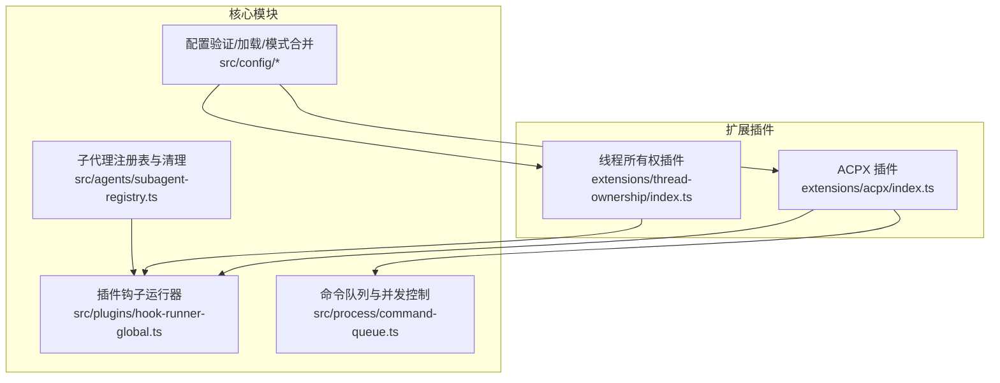
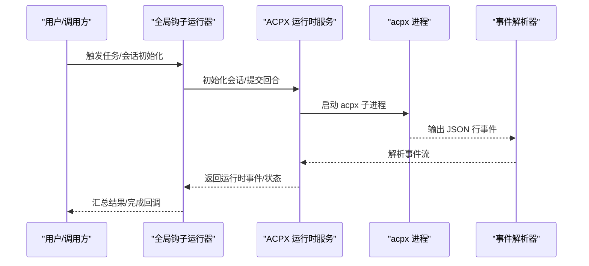
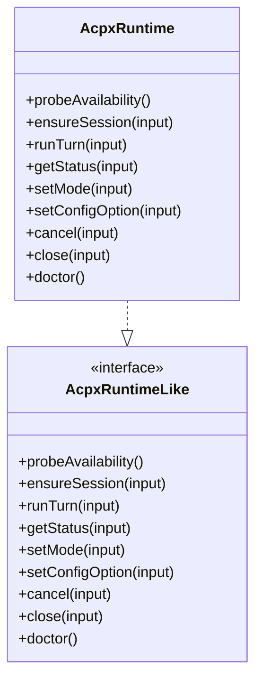
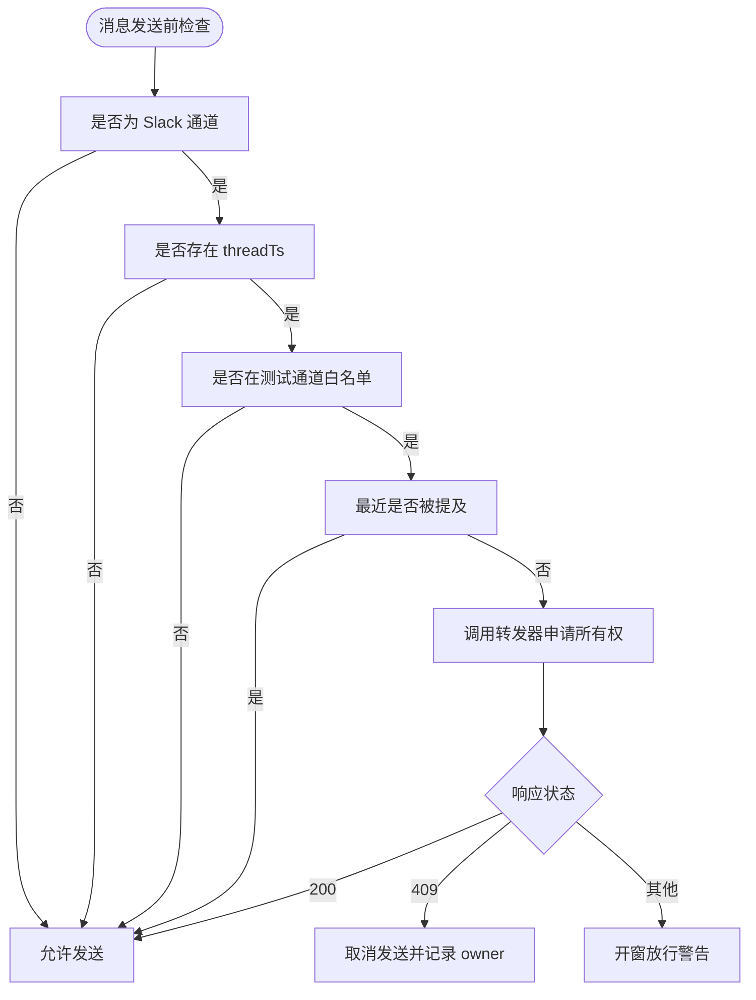
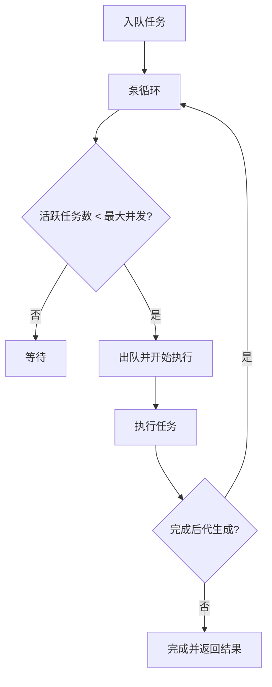
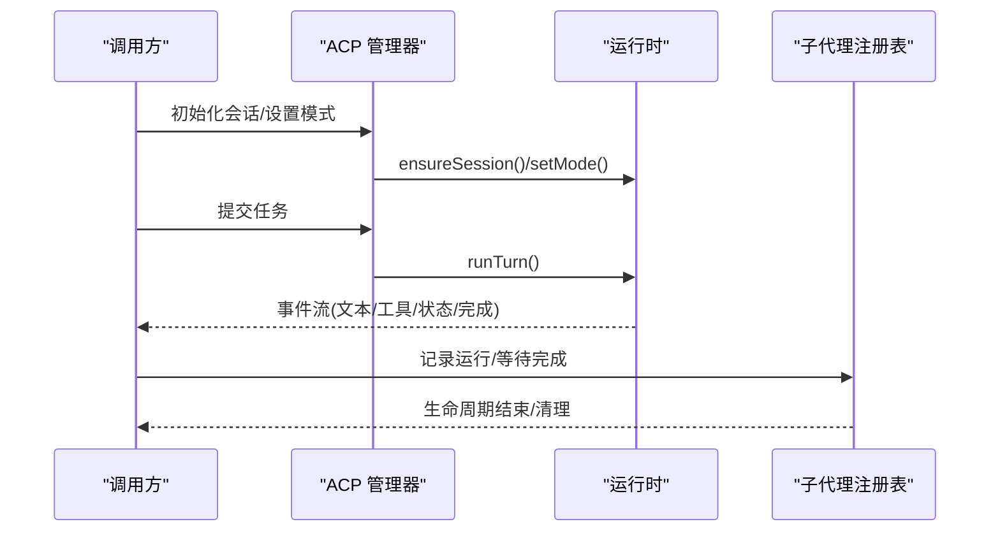
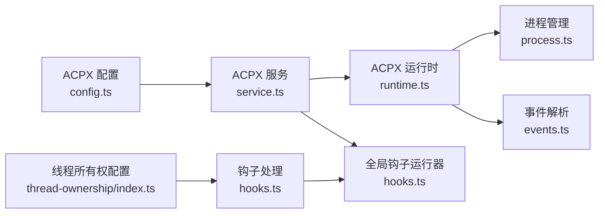

# 任务管理插件

<cite>
**本文档引用的文件**
- [index.ts](file://extensions/acpx/index.ts)
- [service.ts](file://extensions/acpx/src/service.ts)
- [config.ts](file://extensions/acpx/src/config.ts)
- [runtime.ts](file://extensions/acpx/src/runtime.ts)
- [ensure.ts](file://extensions/acpx/src/ensure.ts)
- [events.ts](file://extensions/acpx/src/runtime-internals/events.ts)
- [process.ts](file://extensions/acpx/src/runtime-internals/process.ts)
- [index.ts](file://extensions/thread-ownership/index.ts)
- [acp-spawn.ts](file://src/agents/acp-spawn.ts)
- [hooks.ts](file://src/plugins/hook-runner-global.ts)
- [command-queue.ts](file://src/process/command-queue.ts)
- [validation.ts](file://src/config/validation.ts)
- [loader.ts](file://src/plugins/loader.ts)
- [schema.ts](file://src/config/schema.ts)
- [subagent-registry.ts](file://src/agents/subagent-registry.ts)
</cite>

## 目录

1. [简介](#简介)
2. [项目结构](#项目结构)
3. [核心组件](#核心组件)
4. [架构总览](#架构总览)
5. [详细组件分析](#详细组件分析)
6. [依赖关系分析](#依赖关系分析)
7. [性能考虑](#性能考虑)
8. [故障排除指南](#故障排除指南)
9. [结论](#结论)
10. [附录](#附录)

## 简介

本文件面向任务管理插件的使用者与维护者，系统性阐述以下能力：

- ACPX 代理控制插件：通过 acpx CLI 提供 ACP（异步对话协议）运行时后端，支持会话初始化、回合执行、状态查询、模式切换、权限控制与健康检查等。
- 线程所有权插件：在 Slack 等频道中对“线程”进行所有权管理，避免多代理并发写入同一对话线程，确保消息发送前的排他性与一致性。

文档覆盖任务调度机制、代理生命周期管理、线程安全控制、任务创建/执行/监控/清理的完整流程，以及插件间协作与冲突解决策略，并提供配置指南与故障排除方法。

## 项目结构

任务管理相关代码主要分布在两个扩展插件与核心运行时模块中：

- 扩展插件
  - ACPX 插件：注册服务、解析配置、封装运行时、进程管理与事件解析。
  - 线程所有权插件：监听消息钩子，基于内存映射跟踪提及，调用外部转发器进行所有权判定。
- 核心模块
  - 任务调度：命令队列与并发控制。
  - 生命周期：插件钩子运行器、任务注册表与清理流程。
  - 配置：插件启用/禁用、槽位选择、配置模式合并。

**图表来源**

- [index.ts](file://extensions/acpx/index.ts#L1-L20)
- [index.ts](file://extensions/thread-ownership/index.ts#L1-L134)
- [hooks.ts](file://src/plugins/hook-runner-global.ts#L1-L89)
- [command-queue.ts](file://src/process/command-queue.ts#L43-L123)
- [subagent-registry.ts](file://src/agents/subagent-registry.ts#L1-L800)
- [validation.ts](file://src/config/validation.ts#L355-L398)
- [loader.ts](file://src/plugins/loader.ts#L484-L526)
- [schema.ts](file://src/config/schema.ts#L232-L271)

**章节来源**

- [index.ts](file://extensions/acpx/index.ts#L1-L20)
- [index.ts](file://extensions/thread-ownership/index.ts#L1-L134)
- [hooks.ts](file://src/plugins/hook-runner-global.ts#L1-L89)
- [command-queue.ts](file://src/process/command-queue.ts#L43-L123)
- [subagent-registry.ts](file://src/agents/subagent-registry.ts#L1-L800)
- [validation.ts](file://src/config/validation.ts#L355-L398)
- [loader.ts](file://src/plugins/loader.ts#L484-L526)
- [schema.ts](file://src/config/schema.ts#L232-L271)

## 核心组件

- ACPX 运行时服务
  - 负责注册运行时服务、健康检查、会话初始化、回合执行、状态查询、模式与配置项设置、取消与关闭。
  - 支持权限模式、非交互权限策略、超时与队列持有 TTL 等配置。
- 线程所有权服务
  - 在消息接收时记录提及，发送前通过外部转发器判断是否拥有线程所有权；支持 A/B 测试通道白名单与过期清理。
- 任务调度与生命周期
  - 命令队列按车道（lane）与并发度控制任务执行；子代理注册表负责运行生命周期、清理与归档。
- 插件系统
  - 全局钩子运行器、插件启用/禁用、槽位选择、配置模式合并。

**章节来源**

- [service.ts](file://extensions/acpx/src/service.ts#L39-L431)
- [runtime.ts](file://extensions/acpx/src/runtime.ts#L97-L579)
- [config.ts](file://extensions/acpx/src/config.ts#L17-L197)
- [ensure.ts](file://extensions/acpx/src/ensure.ts#L1-L170)
- [events.ts](file://extensions/acpx/src/runtime-internals/events.ts#L1-L141)
- [process.ts](file://extensions/acpx/src/runtime-internals/process.ts#L1-L138)
- [index.ts](file://extensions/thread-ownership/index.ts#L42-L134)
- [command-queue.ts](file://src/process/command-queue.ts#L43-L123)
- [subagent-registry.ts](file://src/agents/subagent-registry.ts#L1-L800)
- [hooks.ts](file://src/plugins/hook-runner-global.ts#L1-L89)

## 架构总览

ACPX 与线程所有权插件通过 OpenClaw 插件 SDK 注册到全局钩子运行器，形成统一的任务调度与生命周期管理体系。ACPX 运行时通过 acpx CLI 与外部进程交互，解析 JSON 行事件流，提供回合执行与状态查询；线程所有权插件在消息发送前进行排他性检查，必要时调用外部转发器以保证线程一致性。

**图表来源**

- [hooks.ts](file://src/plugins/hook-runner-global.ts#L1-L89)
- [service.ts](file://extensions/acpx/src/service.ts#L39-L431)
- [runtime.ts](file://extensions/acpx/src/runtime.ts#L197-L296)
- [events.ts](file://extensions/acpx/src/runtime-internals/events.ts#L26-L141)
- [process.ts](file://extensions/acpx/src/runtime-internals/process.ts#L44-L112)

## 详细组件分析

### ACPX 代理控制插件

- 插件注册与服务暴露
  - 插件 ID、名称、描述与配置模式由入口导出；注册时向 API 注册运行时服务实例。
- 运行时能力
  - 会话初始化：根据会话键与代理标识创建后端会话句柄。
  - 回合执行：将输入文本写入 acpx 进程标准输入，逐行解析 JSON 事件，输出增量文本、工具调用、状态与最终完成事件。
  - 状态查询：通过控制命令查询运行时状态摘要与详情。
  - 模式与配置：支持设置会话模式与配置项。
  - 取消与关闭：发送取消或关闭控制命令。
  - 健康检查：校验版本与可执行性，失败时更新健康状态。
- 配置与启动
  - 支持工作目录、权限模式、非交互权限策略、超时与队列持有 TTL；默认值与校验规则在配置模块定义。
  - 若本地二进制缺失或版本不匹配，自动安装插件本地版本并二次校验。

**图表来源**

- [runtime.ts](file://extensions/acpx/src/runtime.ts#L97-L579)

**章节来源**

- [index.ts](file://extensions/acpx/index.ts#L1-L20)
- [service.ts](file://extensions/acpx/src/service.ts#L39-L431)
- [runtime.ts](file://extensions/acpx/src/runtime.ts#L97-L579)
- [config.ts](file://extensions/acpx/src/config.ts#L17-L197)
- [ensure.ts](file://extensions/acpx/src/ensure.ts#L1-L170)
- [events.ts](file://extensions/acpx/src/runtime-internals/events.ts#L1-L141)
- [process.ts](file://extensions/acpx/src/runtime-internals/process.ts#L1-L138)

### 线程所有权插件

- 功能概述
  - 监听消息接收事件，记录在 5 分钟内的提及（@-mention），用于允许被提及的代理在未拥有线程时仍可回复。
  - 发送前检查线程所有权：若命中 A/B 测试通道白名单且非顶级消息，则尝试通过转发器 API 获取所有权；若返回 409 则取消发送并记录日志。
  - 失败时采用“开窗放行”策略（网络错误或未知状态）以保证可用性。
- 关键参数
  - 转发器 URL 与 A/B 测试通道列表可通过插件配置或环境变量注入。
  - 代理身份名称与 Bot 用户 ID 用于识别提及。

**图表来源**

- [index.ts](file://extensions/thread-ownership/index.ts#L87-L132)

**章节来源**

- [index.ts](file://extensions/thread-ownership/index.ts#L1-L134)

### 任务调度机制与生命周期管理

- 命令队列与并发控制
  - 按车道组织任务，限制最大并发数；当活跃任务数小于阈值且队列非空时持续出队执行；超过等待阈值触发告警。
- 子代理注册表与清理
  - 维护运行记录、重试退避、到期清理、孤儿运行检测与最终钩子触发；支持“保持线程绑定”与“发送告别消息”等语义。
- 插件钩子运行器
  - 并行执行各插件的钩子处理器；错误可被捕获或抛出，便于定位问题。

**图表来源**

- [command-queue.ts](file://src/process/command-queue.ts#L92-L123)

**章节来源**

- [command-queue.ts](file://src/process/command-queue.ts#L43-L123)
- [subagent-registry.ts](file://src/agents/subagent-registry.ts#L1-L800)
- [hooks.ts](file://src/plugins/hook-runner-global.ts#L194-L215)

### 任务创建、执行、监控与清理流程

- 创建
  - 解析目标代理、会话模式（一次性/持久化）、线程绑定策略与工作目录；准备会话并初始化运行时。
- 执行
  - 将任务消息投递至会话，等待生命周期事件；根据事件类型输出增量文本、工具调用与最终完成。
- 监控
  - 通过运行时状态接口获取摘要与详情；结合钩子运行器与注册表事件进行可观测性与告警。
- 清理
  - 完成后触发清理流程：删除或保留子会话、发送完成消息、归档与周期性清扫。

**图表来源**

- [acp-spawn.ts](file://src/agents/acp-spawn.ts#L220-L431)
- [runtime.ts](file://extensions/acpx/src/runtime.ts#L146-L195)
- [subagent-registry.ts](file://src/agents/subagent-registry.ts#L316-L430)

**章节来源**

- [acp-spawn.ts](file://src/agents/acp-spawn.ts#L1-L431)
- [subagent-registry.ts](file://src/agents/subagent-registry.ts#L1-L800)

### 插件间协作与冲突解决策略

- 协作点
  - 全局钩子运行器统一调度插件事件；ACPX 运行时作为服务被注册；线程所有权插件在消息发送钩子中短路路由。
- 冲突解决
  - 线程所有权：409 冲突时取消发送；网络异常或未知状态时开窗放行，避免阻塞。
  - 插件启用/禁用：通过配置与槽位选择控制加载行为；缺失插件 ID 或无效配置将产生诊断信息。

**章节来源**

- [hooks.ts](file://src/plugins/hook-runner-global.ts#L1-L89)
- [index.ts](file://extensions/thread-ownership/index.ts#L117-L132)
- [validation.ts](file://src/config/validation.ts#L355-L398)
- [loader.ts](file://src/plugins/loader.ts#L484-L526)
- [schema.ts](file://src/config/schema.ts#L232-L271)

## 依赖关系分析

- ACPX 插件内部依赖
  - 配置解析与校验、运行时封装、进程管理与事件解析。
- 线程所有权插件依赖
  - 插件 SDK 的钩子 API、HTTP 超时控制与转发器接口。
- 核心依赖
  - 插件系统：注册、启用/禁用、槽位选择与配置模式合并。
  - 任务系统：命令队列、生命周期事件与清理策略。

**图表来源**

- [config.ts](file://extensions/acpx/src/config.ts#L17-L197)
- [service.ts](file://extensions/acpx/src/service.ts#L39-L431)
- [runtime.ts](file://extensions/acpx/src/runtime.ts#L97-L579)
- [process.ts](file://extensions/acpx/src/runtime-internals/process.ts#L1-L138)
- [events.ts](file://extensions/acpx/src/runtime-internals/events.ts#L1-L141)
- [index.ts](file://extensions/thread-ownership/index.ts#L42-L134)
- [hooks.ts](file://src/plugins/hook-runner-global.ts#L1-L89)

**章节来源**

- [config.ts](file://extensions/acpx/src/config.ts#L17-L197)
- [service.ts](file://extensions/acpx/src/service.ts#L39-L431)
- [runtime.ts](file://extensions/acpx/src/runtime.ts#L97-L579)
- [process.ts](file://extensions/acpx/src/runtime-internals/process.ts#L1-L138)
- [events.ts](file://extensions/acpx/src/runtime-internals/events.ts#L1-L141)
- [index.ts](file://extensions/thread-ownership/index.ts#L1-L134)
- [hooks.ts](file://src/plugins/hook-runner-global.ts#L1-L89)

## 性能考虑

- 并发与队列
  - 使用命令队列按车道与并发度控制任务执行，避免资源争用；对超时等待进行诊断告警。
- 运行时参数
  - 合理设置超时与队列持有 TTL，平衡吞吐与一致性；权限模式与非交互策略影响运行时安全性与性能。
- 清理与归档
  - 注册表定期清扫与孤儿运行检测，防止长期挂起任务占用资源。

**章节来源**

- [command-queue.ts](file://src/process/command-queue.ts#L92-L123)
- [config.ts](file://extensions/acpx/src/config.ts#L34-L36)
- [subagent-registry.ts](file://src/agents/subagent-registry.ts#L520-L584)

## 故障排除指南

- ACPX 运行时不可用
  - 健康检查失败：确认 acpx 可执行文件存在、版本匹配；必要时使用插件本地安装命令进行修复。
  - 进程启动失败：检查工作目录是否存在、命令路径是否正确；关注退出码与错误信息。
- 线程所有权冲突
  - 409 冲突：表示其他代理已拥有该线程，应避免重复发送；可在 A/B 测试通道外放宽策略。
  - 网络异常：转发器不可达时采用开窗放行，建议检查网络与超时设置。
- 插件加载与配置
  - 插件 ID 缺失或无效：检查配置中的 allow/deny 与槽位选择；查看诊断信息定位原因。
  - 配置模式合并：确保插件配置 JSON Schema 正确合并，避免字段不兼容。

**章节来源**

- [ensure.ts](file://extensions/acpx/src/ensure.ts#L28-L99)
- [runtime.ts](file://extensions/acpx/src/runtime.ts#L378-L453)
- [process.ts](file://extensions/acpx/src/runtime-internals/process.ts#L114-L137)
- [index.ts](file://extensions/thread-ownership/index.ts#L117-L132)
- [validation.ts](file://src/config/validation.ts#L355-L398)
- [loader.ts](file://src/plugins/loader.ts#L484-L526)
- [schema.ts](file://src/config/schema.ts#L232-L271)

## 结论

ACPX 代理控制插件与线程所有权插件共同构成了 OpenClaw 的任务管理基础设施：前者提供可靠的 ACP 运行时后端与事件驱动的回合执行，后者保障多代理场景下的线程一致性与发送安全。通过全局钩子运行器与命令队列，系统实现了高并发、可观测与可恢复的任务生命周期管理。合理配置运行时参数、清理策略与插件启用规则，可显著提升稳定性与性能。

## 附录

- 配置要点
  - ACPX：工作目录、权限模式、非交互权限策略、超时、队列持有 TTL。
  - 线程所有权：转发器 URL、A/B 测试通道白名单、提及过期时间。
- 最佳实践
  - 为线程绑定任务默认使用持久会话模式，确保后续跟进在同一线程内。
  - 设置合理的超时与队列持有 TTL，避免长时间阻塞。
  - 对关键通道启用线程所有权检查，减少并发写入冲突。
  - 定期审查插件启用与槽位配置，确保只加载必要的功能模块。
