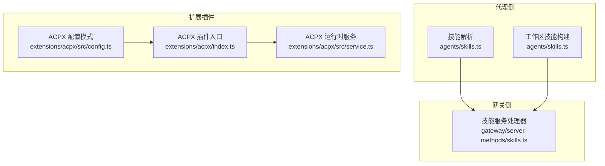
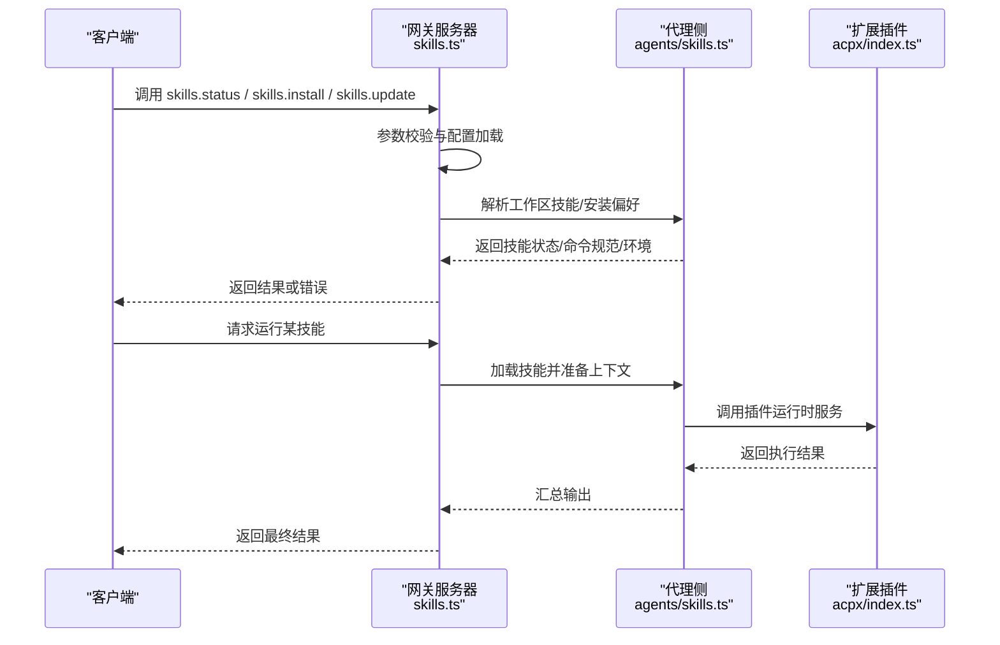
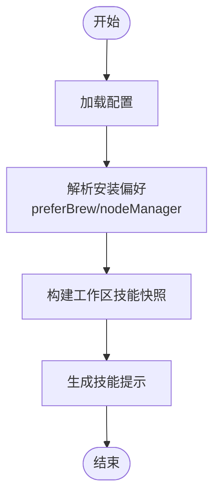
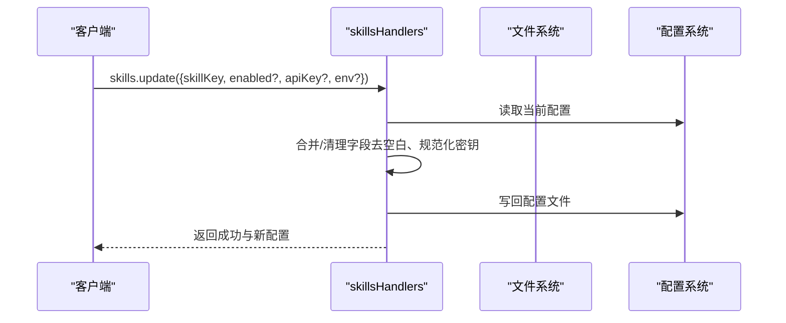
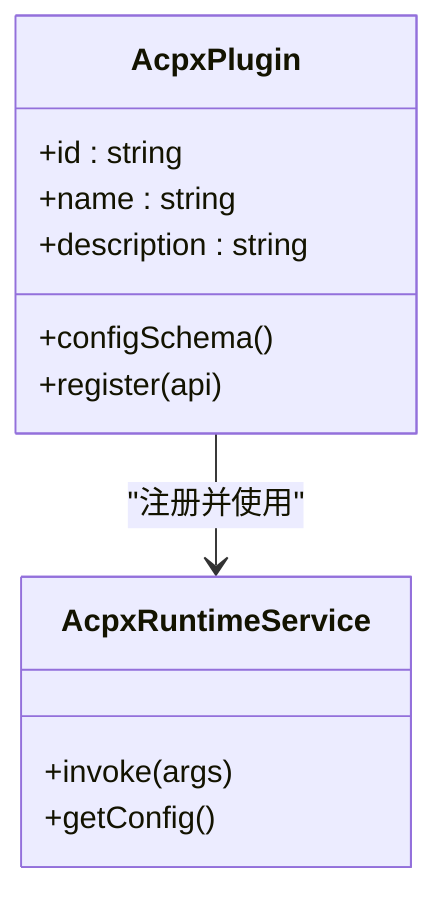
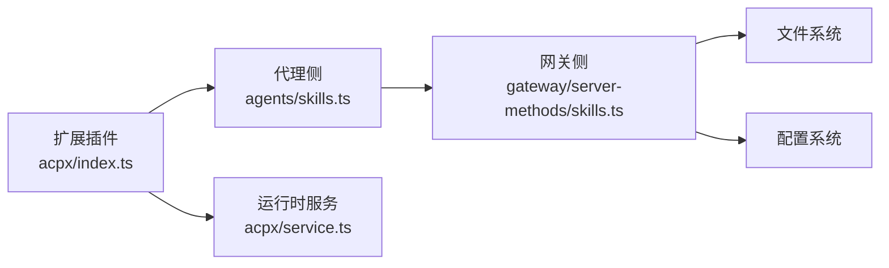

# 技能集成插件

<cite>
**本文引用的文件**
- [README.md](file://README.md)
- [index.ts](file://extensions/acpx/index.ts)
- [config.ts](file://extensions/acpx/src/config.ts/config.ts)
- [service.ts](file://extensions/acpx/src/service.ts/service.ts)
- [skills.ts](file://src/agents/skills.ts)
- [skills.ts](file://src/gateway/server-methods/skills.ts)
- [SKILL.md](file://skills/skill-creator/SKILL.md)
</cite>

## 目录

1. [简介](#简介)
2. [项目结构](#项目结构)
3. [核心组件](#核心组件)
4. [架构总览](#架构总览)
5. [详细组件分析](#详细组件分析)
6. [依赖关系分析](#依赖关系分析)
7. [性能考虑](#性能考虑)
8. [故障排除指南](#故障排除指南)
9. [结论](#结论)
10. [附录](#附录)

## 简介

本文件面向使用者与开发者，系统化介绍 OpenClaw 的“技能集成插件”体系，涵盖以下内容：

- 技能平台的整体定位与工作方式（技能发现、加载、运行与更新）
- 插件生态中的两类关键能力：AI 技能插件与 ACPI 插件
- 配置项与集成方法（含安装、启用、参数校验、文件读写）
- 与 AI 代理系统的交互机制、工具调用策略与结果处理流程
- 性能优化建议与常见问题排查

## 项目结构

OpenClaw 将“技能”作为可插拔的能力单元，分为三类来源：

- 内置/捆绑技能（bundled）：随产品分发，无需额外安装
- 工作区技能（workspace）：位于用户工作区目录，可编辑与扩展
- 受管技能（managed）：由系统或外部仓库统一管理，支持安装与更新

技能平台的关键模块包括：

- 代理侧技能解析与环境注入：负责从配置与工作区加载技能元数据、命令规范与运行时环境
- 网关侧技能服务：提供技能状态查询、二进制依赖收集、安装、更新、文件读取/写入等接口
- 扩展插件（如 ACPI 插件）：通过插件 API 注册运行时服务，供代理在会话中调用

图表来源

- [skills.ts](file://src/agents/skills.ts#L1-L47)
- [skills.ts](file://src/gateway/server-methods/skills.ts#L1-L328)
- [index.ts](file://extensions/acpx/index.ts#L1-L20)
- [config.ts](file://extensions/acpx/src/config.ts/config.ts)
- [service.ts](file://extensions/acpx/src/service.ts/service.ts)

章节来源

- [README.md](file://README.md#L458-L478)
- [skills.ts](file://src/agents/skills.ts#L1-L47)
- [skills.ts](file://src/gateway/server-methods/skills.ts#L1-L328)
- [index.ts](file://extensions/acpx/index.ts#L1-L20)

## 核心组件

- 代理侧技能 API
  - 提供技能配置解析、环境覆盖、工作区技能快照与提示构建、安装偏好解析等能力
- 网关侧技能服务
  - 提供技能状态、二进制依赖、安装、更新、文件读取/写入等 RPC 接口
- ACPI 插件
  - 以插件形式注册运行时服务，暴露配置模式与运行时能力给代理使用

章节来源

- [skills.ts](file://src/agents/skills.ts#L1-L47)
- [skills.ts](file://src/gateway/server-methods/skills.ts#L61-L328)
- [index.ts](file://extensions/acpx/index.ts#L5-L17)

## 架构总览

下图展示从请求到执行的端到端流程：客户端通过网关发起技能相关操作；网关根据配置与工作区解析技能；代理侧按需加载技能并执行；扩展插件（如 ACPI）提供运行时后端。

图表来源

- [skills.ts](file://src/gateway/server-methods/skills.ts#L61-L328)
- [skills.ts](file://src/agents/skills.ts#L36-L47)
- [index.ts](file://extensions/acpx/index.ts#L10-L16)

## 详细组件分析

### 组件一：技能平台（代理侧）

职责与能力：

- 解析技能配置与安装偏好（支持包管理器选择、Homebrew 偏好）
- 构建工作区技能快照、提示与命令规范
- 应用环境变量覆盖（从快照或直接传入）

关键点：

- 安装偏好解析支持 npm/pnpm/yarn/bun，并默认优先 Homebrew（可配置）
- 工作区技能构建包含过滤、加载、快照生成与提示拼接

图表来源

- [skills.ts](file://src/agents/skills.ts#L36-L47)
- [skills.ts](file://src/agents/skills.ts#L26-L34)

章节来源

- [skills.ts](file://src/agents/skills.ts#L1-L47)

### 组件二：技能服务（网关侧）

职责与能力：

- skills.status：返回工作区技能状态（含来源、路径、配置检查、二进制依赖等）
- skills.bins：汇总所有工作区技能声明的二进制依赖
- skills.install：安装指定技能（带超时控制）
- skills.update：更新技能条目（启用/禁用、密钥、环境变量）
- skills.file.get/set：读取/写入工作区或受管技能文件（带路径白名单与权限控制）

安全与校验：

- 对所有请求进行参数校验，错误时返回标准化错误码
- 文件读写仅允许在工作区与受管目录内，禁止对内置技能直接修改

图表来源

- [skills.ts](file://src/gateway/server-methods/skills.ts#L150-L207)

章节来源

- [skills.ts](file://src/gateway/server-methods/skills.ts#L61-L328)

### 组件三：ACPI 插件（扩展插件）

职责与能力：

- 通过插件入口注册运行时服务
- 使用配置模式定义插件配置结构
- 提供运行时服务以供代理调用

图表来源

- [index.ts](file://extensions/acpx/index.ts#L5-L17)
- [config.ts](file://extensions/acpx/src/config.ts/config.ts)
- [service.ts](file://extensions/acpx/src/service.ts/service.ts)

章节来源

- [index.ts](file://extensions/acpx/index.ts#L1-L20)

### 组件四：技能创建与打包（技能创作者）

该技能为“如何设计与打包技能”的指导性技能，帮助用户理解技能的组织方式、资源打包与最佳实践。

关键要点：

- 技能由 SKILL.md（元数据+正文）与可选资源组成（scripts/references/assets）
- 采用渐进披露：仅在需要时加载资源，避免占用上下文窗口
- 创建流程：理解需求 → 规划资源 → 初始化模板 → 编辑与测试 → 打包分发

章节来源

- [SKILL.md](file://skills/skill-creator/SKILL.md#L1-L373)

## 依赖关系分析

- 代理侧依赖网关侧提供的技能状态与安装能力，用于构建会话上下文与执行工具调用
- ACPI 插件通过插件 API 注册运行时服务，被代理侧在会话中按需调用
- 网关侧对文件操作进行严格限制，确保安全边界

图表来源

- [skills.ts](file://src/agents/skills.ts#L1-L47)
- [skills.ts](file://src/gateway/server-methods/skills.ts#L1-L328)
- [index.ts](file://extensions/acpx/index.ts#L1-L20)
- [service.ts](file://extensions/acpx/src/service.ts/service.ts)

章节来源

- [skills.ts](file://src/agents/skills.ts#L1-L47)
- [skills.ts](file://src/gateway/server-methods/skills.ts#L1-L328)
- [index.ts](file://extensions/acpx/index.ts#L1-L20)

## 性能考虑

- 控制上下文窗口：遵循“渐进披露”原则，将非核心内容放入 references 或 scripts，减少 SKILL.md 正文字数
- 二进制依赖最小化：通过 skills.bins 接口识别并集中管理所需二进制，避免重复安装
- 环境变量覆盖：仅在必要时应用，避免频繁重载导致的开销
- 安装与更新：使用超时控制与批量合并更新，降低网络与磁盘 IO 峰值

## 故障排除指南

- 参数校验失败
  - 现象：返回 INVALID_REQUEST 错误
  - 处理：检查请求参数类型与必填字段，参考校验函数的错误信息
- 技能未找到
  - 现象：NOT_FOUND 错误
  - 处理：确认 skillKey 是否正确，或先执行 skills.status 获取有效列表
- 权限不足
  - 现象：PERMISSION_DENIED（如尝试编辑内置技能）
  - 处理：仅对工作区或受管技能进行编辑；确认文件路径在允许范围内
- 密钥与敏感信息
  - 现象：配置检查中出现敏感字段
  - 处理：使用 normalizeSecretInput 清理输入；避免在日志中打印敏感值
- ACPI 插件无法加载
  - 现象：插件注册失败或运行时服务不可用
  - 处理：检查插件配置模式是否正确，确认运行时服务已注册并可用

章节来源

- [skills.ts](file://src/gateway/server-methods/skills.ts#L62-L94)
- [skills.ts](file://src/gateway/server-methods/skills.ts#L208-L254)
- [skills.ts](file://src/gateway/server-methods/skills.ts#L255-L326)

## 结论

OpenClaw 的技能集成插件体系以“可插拔、可管理、可扩展”为核心理念：通过代理侧的技能解析与网关侧的服务接口，实现技能的发现、安装、更新与安全编辑；通过扩展插件（如 ACPI）提供运行时后端，满足多样化的工具调用与结果处理需求。遵循本文档的配置与使用指南，可在保证安全与性能的前提下，高效地集成与维护各类技能。

## 附录

### A. 技能插件类型与使用场景

- AI 技能插件
  - 场景：需要模型推理、多轮对话、工具链编排的任务
  - 关键点：通过代理侧加载技能提示与命令规范，结合会话上下文进行工具调用
- 文本处理插件
  - 场景：文档解析、格式转换、内容提取
  - 关键点：利用 scripts 与 references 实现可复用的处理流程
- 任务管理插件
  - 场景：定时任务、事件触发、跨渠道通知
  - 关键点：结合 Cron 与 Webhook，通过网关侧接口进行安装与更新
- ACPI 插件
  - 场景：本地运行时后端（如 acpx CLI），提供特定领域的工具能力
  - 关键点：通过插件 API 注册服务，代理侧按需调用

章节来源

- [README.md](file://README.md#L163-L169)
- [index.ts](file://extensions/acpx/index.ts#L5-L17)

### B. 安装与配置步骤（通用流程）

- 安装
  - 使用 skills.install 接口安装指定技能，可设置超时时间
- 启用/禁用
  - 使用 skills.update 更新技能条目的 enabled 字段
- 配置密钥与环境
  - 使用 skills.update 的 env 与 apiKey 字段进行配置
- 查看状态
  - 使用 skills.status 获取技能来源、路径、配置检查与二进制依赖

章节来源

- [skills.ts](file://src/gateway/server-methods/skills.ts#L118-L149)
- [skills.ts](file://src/gateway/server-methods/skills.ts#L150-L207)
- [skills.ts](file://src/gateway/server-methods/skills.ts#L62-L94)

### C. 与 AI 代理系统的交互机制

- 代理侧在会话前构建技能提示与命令规范，决定何时调用哪些工具
- 网关侧提供统一的 RPC 接口，代理通过这些接口与技能交互
- ACPI 插件作为运行时后端，被代理侧在会话中按需调用

章节来源

- [skills.ts](file://src/agents/skills.ts#L26-L34)
- [skills.ts](file://src/gateway/server-methods/skills.ts#L61-L328)
- [index.ts](file://extensions/acpx/index.ts#L10-L16)
