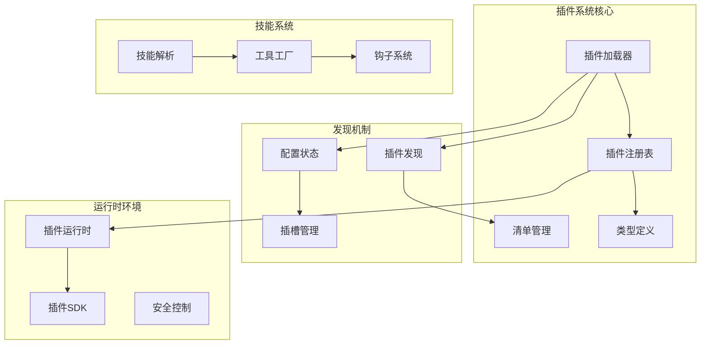
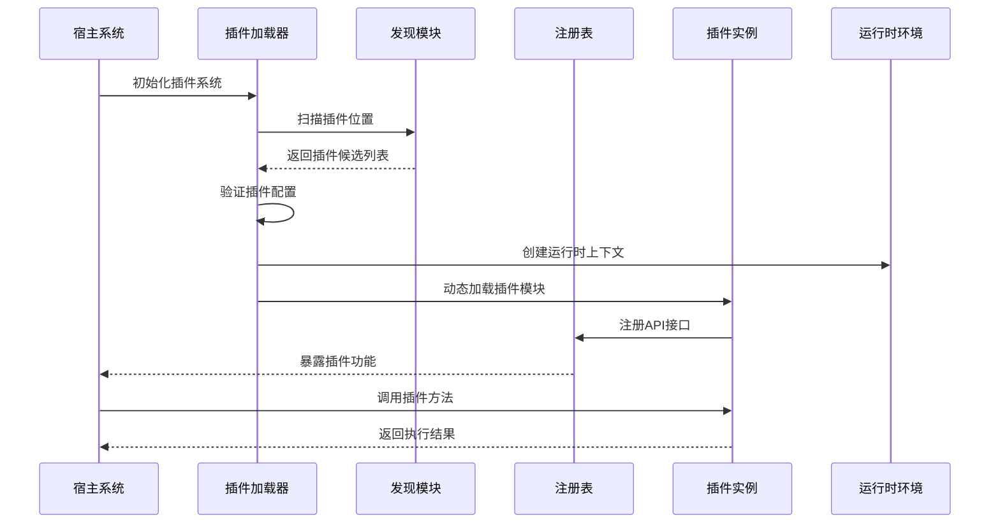
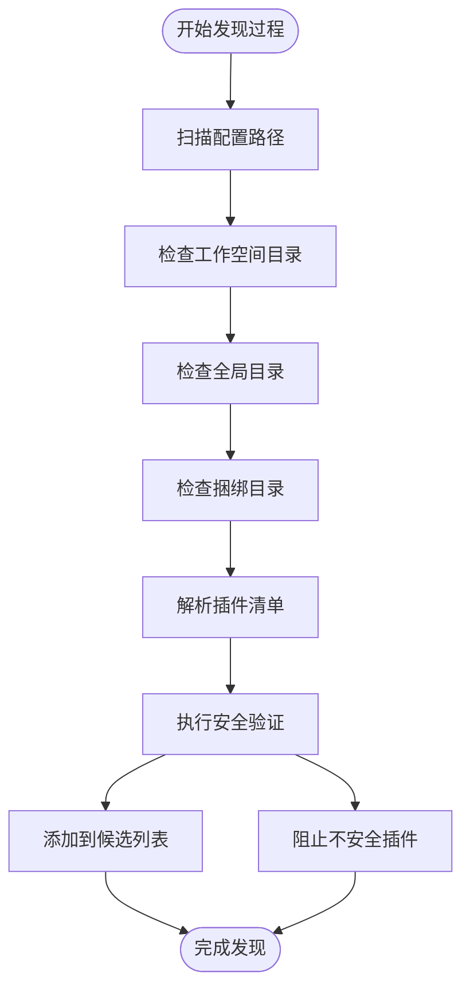
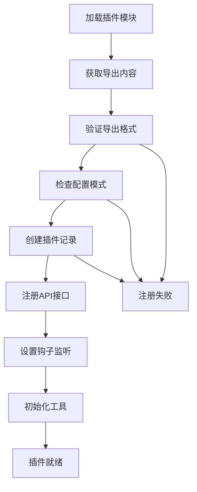
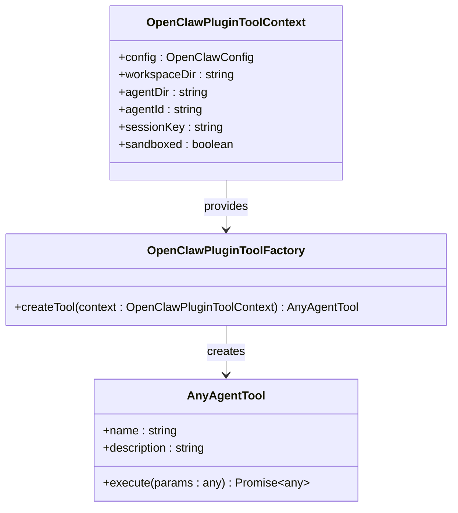
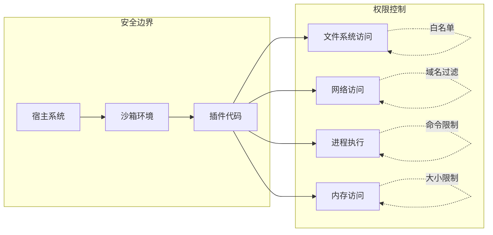
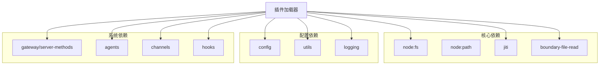

# 集成指南

<cite>
**本文档引用的文件**
- [README.md](file://README.md)
- [loader.ts](file://src/plugins/loader.ts)
- [registry.ts](file://src/plugins/registry.ts)
- [types.ts](file://src/plugins/types.ts)
- [manifest.ts](file://src/plugins/manifest.ts)
- [discovery.ts](file://src/plugins/discovery.ts)
- [config-state.ts](file://src/plugins/config-state.ts)
- [plugin-skills.ts](file://src/agents/skills/plugin-skills.ts)
- [runtime.ts](file://src/plugin-sdk/runtime.ts)
- [index.ts](file://src/plugin-sdk/index.ts)
</cite>

## 目录

1. [简介](#简介)
2. [项目结构](#项目结构)
3. [核心组件](#核心组件)
4. [架构概览](#架构概览)
5. [详细组件分析](#详细组件分析)
6. [依赖分析](#依赖分析)
7. [性能考虑](#性能考虑)
8. [故障排除指南](#故障排除指南)
9. [结论](#结论)
10. [附录](#附录)

## 简介

OpenClaw 是一个个人AI助手平台，支持多渠道消息传递、工具执行和技能扩展。本指南专注于技能集成插件系统的完整集成流程，涵盖插件注册机制、依赖管理、版本兼容性处理、开发流程、API接口规范、工具工厂模式和沙箱安全机制。

OpenClaw 的插件系统采用模块化设计，通过声明式配置和动态加载机制实现灵活的技能集成。系统支持多种插件类型，包括内存插件、通道插件和工具插件，并提供了完整的生命周期管理和安全控制机制。

## 项目结构

OpenClaw 插件系统的核心架构由以下主要组件构成：

**图表来源**

- [loader.ts](file://src/plugins/loader.ts#L368-L717)
- [registry.ts](file://src/plugins/registry.ts#L164-L520)
- [discovery.ts](file://src/plugins/discovery.ts#L567-L635)

**章节来源**

- [README.md](file://README.md#L1-L556)
- [loader.ts](file://src/plugins/loader.ts#L1-L726)

## 核心组件

### 插件加载器 (Plugin Loader)

插件加载器是整个插件系统的核心协调者，负责扫描、验证和初始化所有可用的插件。其主要功能包括：

- **插件发现**: 扫描工作空间、全局和捆绑目录中的插件
- **配置验证**: 验证插件配置的正确性和完整性
- **安全检查**: 执行路径安全验证和权限检查
- **动态加载**: 使用Jiti加载器动态加载插件模块
- **注册管理**: 将插件注册到中央注册表中

加载器采用缓存机制优化性能，在开发环境中默认禁用插件以提高测试速度。

### 插件注册表 (Plugin Registry)

插件注册表维护所有已加载插件的状态和元数据，提供统一的插件管理接口：

- **插件记录**: 存储每个插件的详细信息和状态
- **注册API**: 提供工具、钩子、HTTP处理器等的注册接口
- **诊断系统**: 收集和报告插件加载过程中的问题
- **生命周期管理**: 管理插件的启动、运行和停止过程

注册表支持多种插件类型，包括工具、钩子、HTTP路由、通道插件和提供程序。

### 类型系统 (Type System)

完整的类型定义确保了插件开发的一致性和安全性：

- **插件定义**: 定义插件的基本结构和必需属性
- **API接口**: 规范插件与宿主系统的交互方式
- **钩子类型**: 定义各种生命周期事件的处理接口
- **配置模式**: 提供插件配置的验证和文档生成

**章节来源**

- [loader.ts](file://src/plugins/loader.ts#L368-L717)
- [registry.ts](file://src/plugins/registry.ts#L164-L520)
- [types.ts](file://src/plugins/types.ts#L1-L764)

## 架构概览

OpenClaw 的插件系统采用分层架构设计，确保了高度的模块化和可扩展性：

**图表来源**

- [loader.ts](file://src/plugins/loader.ts#L368-L717)
- [discovery.ts](file://src/plugins/discovery.ts#L567-L635)
- [registry.ts](file://src/plugins/registry.ts#L472-L503)

系统架构的关键特性包括：

- **声明式配置**: 通过JSON清单文件定义插件元数据
- **动态加载**: 支持热插拔和按需加载
- **安全隔离**: 通过沙箱机制限制插件权限
- **生命周期管理**: 完整的插件生命周期控制

## 详细组件分析

### 插件发现机制

插件发现机制负责在多个位置查找和识别可用的插件：

**图表来源**

- [discovery.ts](file://src/plugins/discovery.ts#L567-L635)
- [manifest.ts](file://src/plugins/manifest.ts#L45-L115)

发现机制支持三种插件来源：

- **工作空间插件**: 用户自定义的插件
- **全局插件**: 系统级插件
- **捆绑插件**: 预装的基础插件

### 插件注册流程

插件注册流程确保插件能够正确地向系统注册其功能：

**图表来源**

- [loader.ts](file://src/plugins/loader.ts#L554-L696)
- [registry.ts](file://src/plugins/registry.ts#L472-L503)

### 工具工厂模式

工具工厂模式提供了统一的工具创建和管理机制：

**图表来源**

- [types.ts](file://src/plugins/types.ts#L69-L77)
- [types.ts](file://src/plugins/types.ts#L58-L67)

### 沙箱安全机制

沙箱安全机制确保插件在受控环境中运行，防止恶意行为：

**图表来源**

- [loader.ts](file://src/plugins/loader.ts#L528-L552)
- [discovery.ts](file://src/plugins/discovery.ts#L65-L162)

**章节来源**

- [discovery.ts](file://src/plugins/discovery.ts#L1-L636)
- [config-state.ts](file://src/plugins/config-state.ts#L1-L263)

## 依赖分析

插件系统的依赖关系复杂但清晰，主要依赖包括：

**图表来源**

- [loader.ts](file://src/plugins/loader.ts#L1-L26)
- [registry.ts](file://src/plugins/registry.ts#L1-L14)

### 版本兼容性处理

系统通过多种机制确保版本兼容性：

- **清单验证**: 检查插件清单的版本要求
- **配置迁移**: 自动处理配置格式变更
- **API稳定性**: 保持向后兼容的API接口
- **降级策略**: 在不兼容情况下提供降级选项

**章节来源**

- [manifest.ts](file://src/plugins/manifest.ts#L1-L167)
- [config-state.ts](file://src/plugins/config-state.ts#L113-L163)

## 性能考虑

插件系统的性能优化策略包括：

### 缓存机制

- **插件注册表缓存**: 避免重复加载相同插件
- **配置解析缓存**: 减少重复的配置验证
- **清单解析缓存**: 加速插件清单的读取和解析

### 异步加载

- **延迟加载**: 只在需要时加载插件
- **并行处理**: 同时处理多个插件的加载
- **流式处理**: 支持大型插件的渐进式加载

### 内存管理

- **插件卸载**: 支持插件的动态卸载
- **资源清理**: 自动清理插件使用的资源
- **垃圾回收**: 优化内存使用效率

## 故障排除指南

### 常见问题及解决方案

**插件无法加载**

- 检查插件清单文件是否存在且格式正确
- 验证插件路径是否在允许的安全范围内
- 确认插件依赖项是否正确安装

**插件配置错误**

- 使用配置验证工具检查配置格式
- 查看插件诊断信息获取详细错误描述
- 参考插件文档了解正确的配置参数

**权限问题**

- 检查插件文件的权限设置
- 验证插件是否在允许的目录中
- 确认用户是否有足够的权限执行插件

### 调试工具

系统提供了丰富的调试工具帮助开发者：

- **诊断日志**: 详细的插件加载和运行日志
- **状态监控**: 实时监控插件的运行状态
- **性能分析**: 分析插件的性能瓶颈
- **错误追踪**: 精确定位插件错误的位置

**章节来源**

- [loader.ts](file://src/plugins/loader.ts#L187-L210)
- [registry.ts](file://src/plugins/registry.ts#L168-L170)

## 结论

OpenClaw 的技能集成插件系统提供了一个强大而灵活的扩展框架。通过模块化的架构设计、完善的类型系统和严格的安全控制，开发者可以轻松地创建和集成各种类型的插件。

系统的主要优势包括：

- **高度模块化**: 清晰的组件分离和职责划分
- **强类型支持**: 完整的TypeScript类型定义
- **安全可靠**: 多层次的安全检查和权限控制
- **易于扩展**: 灵活的插件接口和生命周期管理

对于开发者而言，理解插件系统的架构原理和最佳实践是成功开发插件的关键。建议在开发过程中充分利用系统的调试工具和文档资源，确保插件的质量和性能。

## 附录

### 开发工具链

**章节来源**

- [index.ts](file://src/plugin-sdk/index.ts#L1-L597)
- [runtime.ts](file://src/plugin-sdk/runtime.ts#L1-L25)

### 配置模板

系统提供了标准的插件配置模板，包括：

- **基础配置**: 插件的基本元数据和配置
- **高级配置**: 高级功能和自定义选项
- **安全配置**: 安全相关的配置参数
- **性能配置**: 性能优化相关的配置选项

### 测试策略

推荐的测试策略包括：

- **单元测试**: 针对插件核心功能的测试
- **集成测试**: 测试插件与其他组件的交互
- **性能测试**: 评估插件的性能表现
- **安全测试**: 验证插件的安全性

### 部署最佳实践

部署插件时的最佳实践：

- **版本管理**: 使用语义化版本控制插件
- **依赖管理**: 明确插件的依赖关系
- **配置管理**: 提供清晰的配置文档
- **监控告警**: 设置适当的监控和告警机制
