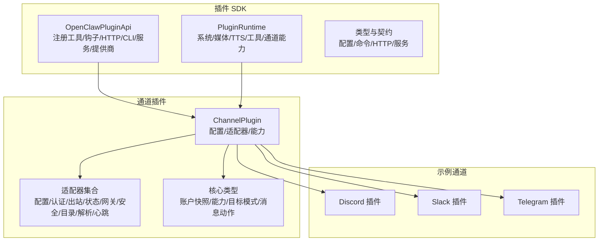
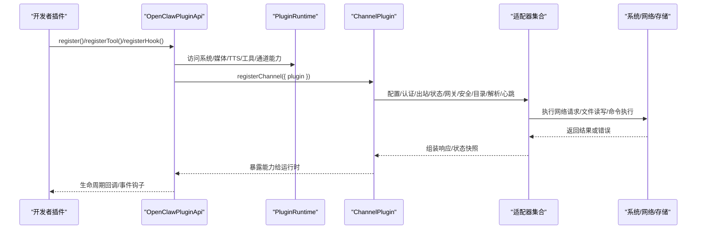
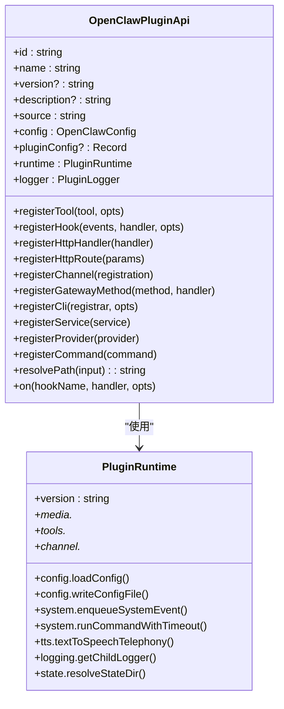
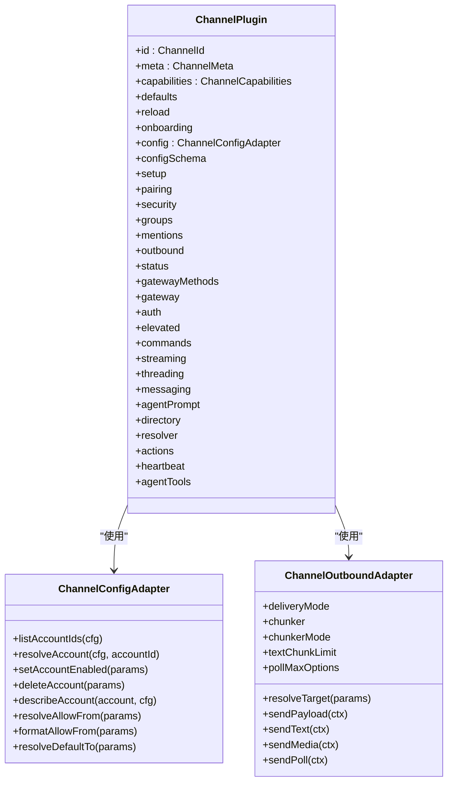
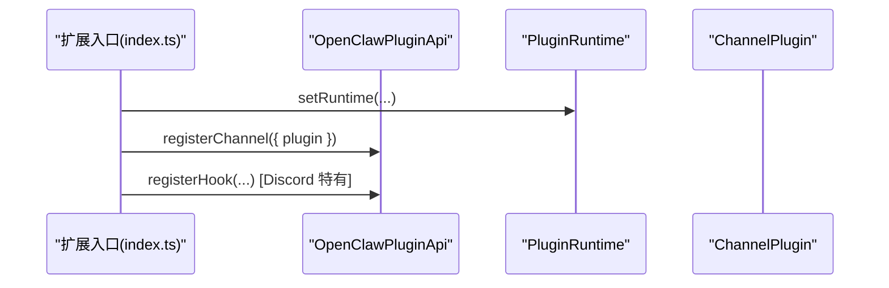
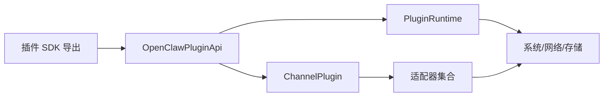

# 插件开发指南

<cite>
**本文档引用的文件**
- [src/plugin-sdk/index.ts](file://src/plugin-sdk/index.ts)
- [dist/plugin-sdk/index.js](file://dist/plugin-sdk/index.js)
- [src/plugins/types.ts](file://src/plugins/types.ts)
- [src/channels/plugins/types.plugin.ts](file://src/channels/plugins/types.plugin.ts)
- [src/channels/plugins/types.adapters.ts](file://src/channels/plugins/types.adapters.ts)
- [src/channels/plugins/types.core.ts](file://src/channels/plugins/types.core.ts)
- [src/plugins/runtime/types.ts](file://src/plugins/runtime/types.ts)
- [extensions/discord/index.ts](file://extensions/discord/index.ts)
- [extensions/slack/index.ts](file://extensions/slack/index.ts)
- [extensions/telegram/index.ts](file://extensions/telegram/index.ts)
- [scripts/write-plugin-sdk-entry-dts.ts](file://scripts/write-plugin-sdk-entry-dts.ts)
</cite>

## 目录

1. [简介](#简介)
2. [项目结构](#项目结构)
3. [核心组件](#核心组件)
4. [架构总览](#架构总览)
5. [详细组件分析](#详细组件分析)
6. [依赖关系分析](#依赖关系分析)
7. [性能考虑](#性能考虑)
8. [故障排除指南](#故障排除指南)
9. [结论](#结论)
10. [附录](#附录)

## 简介

本指南面向希望在 OpenClaw 平台上开发插件的开发者，系统性阐述插件架构设计、开发流程与最佳实践。内容涵盖插件 SDK 的使用方法、API 接口规范、工具链与构建流程、生命周期管理、依赖注入与事件处理机制，并提供模板代码、配置示例与调试技巧。读者无需深入底层实现即可快速上手。

## 项目结构

OpenClaw 将插件能力抽象为“插件 SDK”与“通道插件（Channel Plugin）”两类扩展点：

- 插件 SDK：提供统一的 API、运行时能力、工具与基础设施（如日志、媒体、会话、命令等），供各类插件复用。
- 通道插件：面向具体通信渠道（如 Discord、Slack、Telegram 等）的适配器集合，定义账户配置、消息收发、状态检查、网关方法等。

图表来源

- [src/plugin-sdk/index.ts](file://src/plugin-sdk/index.ts#L1-L597)
- [src/plugins/types.ts](file://src/plugins/types.ts#L245-L284)
- [src/plugins/runtime/types.ts](file://src/plugins/runtime/types.ts#L188-L375)
- [src/channels/plugins/types.plugin.ts](file://src/channels/plugins/types.plugin.ts#L49-L85)
- [src/channels/plugins/types.adapters.ts](file://src/channels/plugins/types.adapters.ts#L23-L320)
- [src/channels/plugins/types.core.ts](file://src/channels/plugins/types.core.ts#L76-L372)

章节来源

- [src/plugin-sdk/index.ts](file://src/plugin-sdk/index.ts#L1-L597)
- [src/plugins/types.ts](file://src/plugins/types.ts#L245-L284)
- [src/plugins/runtime/types.ts](file://src/plugins/runtime/types.ts#L188-L375)
- [src/channels/plugins/types.plugin.ts](file://src/channels/plugins/types.plugin.ts#L49-L85)

## 核心组件

本节聚焦插件开发的关键构件与职责边界：

- OpenClawPluginApi
  - 负责插件注册与上下文访问，包括工具、钩子、HTTP 处理器、HTTP 路由、通道插件、网关方法、CLI、服务、提供商与命令等。
  - 提供运行时访问、日志记录、路径解析等能力。
- PluginRuntime
  - 暴露系统、媒体、TTS、工具、通道能力等子域 API，统一插件对底层能力的调用方式。
- ChannelPlugin 与适配器
  - ChannelPlugin 定义通道插件的契约，包含元数据、能力、默认参数、配置、适配器集合等。
  - 适配器集合覆盖配置、认证、出站、状态、网关、安全、目录、解析、心跳、命令、流式传输、线程化、消息动作等。
- 类型与契约
  - 统一账户快照、能力、目标模式、消息动作、投票等核心类型，确保跨通道一致性。

章节来源

- [src/plugins/types.ts](file://src/plugins/types.ts#L245-L284)
- [src/plugins/runtime/types.ts](file://src/plugins/runtime/types.ts#L188-L375)
- [src/channels/plugins/types.plugin.ts](file://src/channels/plugins/types.plugin.ts#L49-L85)
- [src/channels/plugins/types.adapters.ts](file://src/channels/plugins/types.adapters.ts#L23-L320)
- [src/channels/plugins/types.core.ts](file://src/channels/plugins/types.core.ts#L76-L372)

## 架构总览

下图展示插件 SDK 与通道插件的交互关系及典型调用链：

图表来源

- [src/plugins/types.ts](file://src/plugins/types.ts#L245-L284)
- [src/plugins/runtime/types.ts](file://src/plugins/runtime/types.ts#L188-L375)
- [src/channels/plugins/types.plugin.ts](file://src/channels/plugins/types.plugin.ts#L49-L85)
- [src/channels/plugins/types.adapters.ts](file://src/channels/plugins/types.adapters.ts#L23-L320)

## 详细组件分析

### 插件 API 与生命周期

- 注册入口
  - register：用于一次性初始化，注册工具、钩子、HTTP、CLI、服务、提供商与命令。
  - activate：可选激活阶段，适合延迟初始化或按需启用。
- 生命周期钩子
  - 支持 before_model_resolve、before_prompt_build、before_agent_start、llm_input、llm_output、agent_end、compaction、reset、message_received/sending/sent、tool 调用前后、tool 结果持久化、消息写入前、session 开始/结束、子代理生成/投递/结束、网关启动/停止等。
  - 每个钩子事件携带上下文信息（如 agentId、sessionKey、channelId、accountId 等），便于插件进行条件判断与增强。
- 命令与 HTTP
  - registerCommand：注册自定义命令，绕过 LLM，适合状态切换或简单查询。
  - registerHttpHandler/registerHttpRoute：注册 HTTP 入口，支持路由级与通用处理器。
- 服务与提供商
  - registerService：注册后台服务，支持 start/stop。
  - registerProvider：注册外部提供商（OAuth、API Key 等），提供认证与模型配置。

图表来源

- [src/plugins/types.ts](file://src/plugins/types.ts#L245-L284)
- [src/plugins/runtime/types.ts](file://src/plugins/runtime/types.ts#L188-L375)

章节来源

- [src/plugins/types.ts](file://src/plugins/types.ts#L245-L284)
- [src/plugins/runtime/types.ts](file://src/plugins/runtime/types.ts#L188-L375)

### 通道插件与适配器

- ChannelPlugin 契约
  - 包含 id、meta、capabilities、defaults、reload、onboarding、config、setup、pairing、security、groups、mentions、outbound、status、gatewayMethods、gateway、auth、elevated、commands、streaming、threading、messaging、agentPrompt、directory、resolver、actions、heartbeat、agentTools 等字段。
- 适配器集合
  - 配置适配器：账户列表、解析账户、启用/禁用、删除、描述、允许来源、默认 to 等。
  - 出站适配器：目标解析、文本/媒体/投票发送、分块策略、轮询选项等。
  - 状态适配器：探针、审计、快照、问题收集、运行态状态等。
  - 网关适配器：账号启动/停止、二维码登录、登出。
  - 安全适配器：DM 策略、告警收集。
  - 目录适配器：自、成员、群组列表与实时列表。
  - 解析适配器：目标解析。
  - 心跳适配器：就绪检查、接收者解析。
  - 命令适配器：所有者权限强制、空配置跳过。
  - 流式传输/线程化/消息动作/代理提示/组策略等适配器。
- 核心类型
  - ChannelMeta、ChannelCapabilities、ChannelAccountSnapshot、ChannelOutboundTargetMode、ChannelMessageActionName、ChannelPoll 等。

图表来源

- [src/channels/plugins/types.plugin.ts](file://src/channels/plugins/types.plugin.ts#L49-L85)
- [src/channels/plugins/types.adapters.ts](file://src/channels/plugins/types.adapters.ts#L51-L123)
- [src/channels/plugins/types.core.ts](file://src/channels/plugins/types.core.ts#L76-L149)

章节来源

- [src/channels/plugins/types.plugin.ts](file://src/channels/plugins/types.plugin.ts#L49-L85)
- [src/channels/plugins/types.adapters.ts](file://src/channels/plugins/types.adapters.ts#L51-L123)
- [src/channels/plugins/types.core.ts](file://src/channels/plugins/types.core.ts#L76-L149)

### 示例通道插件（Discord/Slack/Telegram）

这些官方通道插件展示了如何通过 SDK 注册通道插件与运行时能力，并绑定子代理钩子（Discord 特有）：

- Discord 插件
  - 设置运行时、注册通道插件、注册子代理钩子。
- Slack 插件
  - 设置运行时、注册通道插件。
- Telegram 插件
  - 设置运行时、注册通道插件。

图表来源

- [extensions/discord/index.ts](file://extensions/discord/index.ts#L1-L20)
- [extensions/slack/index.ts](file://extensions/slack/index.ts#L1-L18)
- [extensions/telegram/index.ts](file://extensions/telegram/index.ts#L1-L18)

章节来源

- [extensions/discord/index.ts](file://extensions/discord/index.ts#L1-L20)
- [extensions/slack/index.ts](file://extensions/slack/index.ts#L1-L18)
- [extensions/telegram/index.ts](file://extensions/telegram/index.ts#L1-L18)

## 依赖关系分析

- 插件 SDK 对外导出大量工具函数与类型，统一了插件开发的 API 表面，便于跨通道复用。
- 运行时能力通过 PluginRuntime 聚合，插件通过 OpenClawPluginApi 访问，避免直接耦合底层实现。
- 通道插件通过适配器集合解耦不同渠道的差异，统一对外契约。

图表来源

- [src/plugin-sdk/index.ts](file://src/plugin-sdk/index.ts#L1-L597)
- [src/plugins/types.ts](file://src/plugins/types.ts#L245-L284)
- [src/plugins/runtime/types.ts](file://src/plugins/runtime/types.ts#L188-L375)
- [src/channels/plugins/types.adapters.ts](file://src/channels/plugins/types.adapters.ts#L23-L320)

章节来源

- [src/plugin-sdk/index.ts](file://src/plugin-sdk/index.ts#L1-L597)
- [src/plugins/types.ts](file://src/plugins/types.ts#L245-L284)
- [src/plugins/runtime/types.ts](file://src/plugins/runtime/types.ts#L188-L375)
- [src/channels/plugins/types.adapters.ts](file://src/channels/plugins/types.adapters.ts#L23-L320)

## 性能考虑

- 分块与限流
  - 使用文本分块策略与轮询最大选项限制，避免单次消息过大或轮询风暴。
- 媒体处理
  - 优先使用远程媒体加载与 MIME 检测，减少本地 IO；音频/图片处理应控制尺寸与格式。
- 命令与钩子
  - 钩子处理应尽量轻量，避免阻塞主消息管线；必要时采用异步与去重。
- 网络与超时
  - 使用带超时的命令执行与网络请求，防止阻塞；合理设置 SSRF 策略与主机白名单。
- 会话与状态
  - 合理记录会话元数据与活动，避免频繁磁盘写入；使用内存缓存与文件锁结合的去重机制。

## 故障排除指南

- 常见问题定位
  - 配置校验失败：检查 configSchema.safeParse/validate 的返回值与错误信息。
  - 权限与来源：核对 allowFrom/DM 策略与组策略，确认 sender 是否被允许。
  - 网关绑定：检查 resolveGatewayBindUrl 的返回值，确认 bind 模式与主机解析。
  - 去重与并发：若出现重复消息，检查持久化去重的 TTL、文件大小与锁重试配置。
- 日志与诊断
  - 使用 runtime.logging.getChildLogger 获取带上下文的日志器。
  - 启用诊断事件与心跳，观察会话状态与消息队列行为。
- 错误传播
  - 在钩子中返回错误信息或中断消息写入，确保错误可追踪且不污染会话。

章节来源

- [src/plugins/types.ts](file://src/plugins/types.ts#L245-L284)
- [src/plugins/runtime/types.ts](file://src/plugins/runtime/types.ts#L188-L375)
- [src/plugin-sdk/index.ts](file://src/plugin-sdk/index.ts#L272-L296)

## 结论

OpenClaw 插件体系以“插件 SDK + 通道插件”的双层架构实现高内聚、低耦合的扩展能力。通过统一的 API、运行时与类型契约，开发者可以快速实现跨渠道的消息收发、状态管理、事件处理与服务集成。建议在开发中遵循“最小可用原则”，先实现核心适配器，再逐步完善钩子与工具集。

## 附录

### 插件 SDK 使用要点

- 导出与入口
  - SDK 通过 src/plugin-sdk/index.ts 汇总导出，dist/plugin-sdk/index.js 为打包产物。
  - TypeScript 声明通过脚本生成稳定入口，便于类型推断与 IDE 支持。
- 工具与实用函数
  - Webhook 路径规范化与目标注册、OAuth 认证结果构建、SSRF 策略、命令超时执行、去重缓存等。
- 运行时能力
  - 系统事件、命令执行、媒体加载/保存、TTS、工具注册、通道能力（Discord/Slack/Telegram/Signal/iMessage/WhatsApp/LINE 等）。

章节来源

- [src/plugin-sdk/index.ts](file://src/plugin-sdk/index.ts#L1-L597)
- [dist/plugin-sdk/index.js](file://dist/plugin-sdk/index.js#L1-L800)
- [scripts/write-plugin-sdk-entry-dts.ts](file://scripts/write-plugin-sdk-entry-dts.ts#L1-L16)

### 开发模板与最佳实践

- 最小通道插件模板
  - 定义 ChannelPlugin，至少实现 config、outbound、status、messaging 等适配器。
  - 在 register 中调用 api.registerChannel({ plugin })。
- 工具与钩子
  - 使用 registerTool 注册 Agent 工具；使用 registerHook 注册消息/工具/会话等钩子。
- HTTP 与 CLI
  - 使用 registerHttpRoute 或 registerHttpHandler 暴露管理接口；使用 registerCli 注册命令行子命令。
- 配置与校验
  - 提供 configSchema.safeParse/validate/uiHints/jsonSchema，确保配置可验证、可引导。
- 安全与合规
  - 使用 SSRF 策略与主机白名单；严格限制敏感信息输出与日志脱敏。

章节来源

- [src/channels/plugins/types.plugin.ts](file://src/channels/plugins/types.plugin.ts#L49-L85)
- [src/plugins/types.ts](file://src/plugins/types.ts#L245-L284)
- [src/plugin-sdk/index.ts](file://src/plugin-sdk/index.ts#L1-L597)
