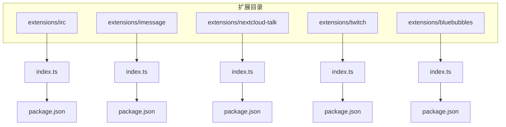
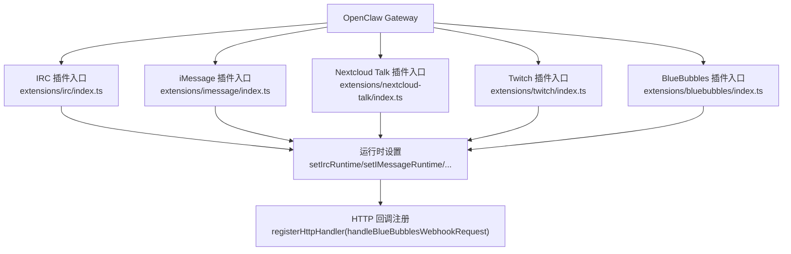
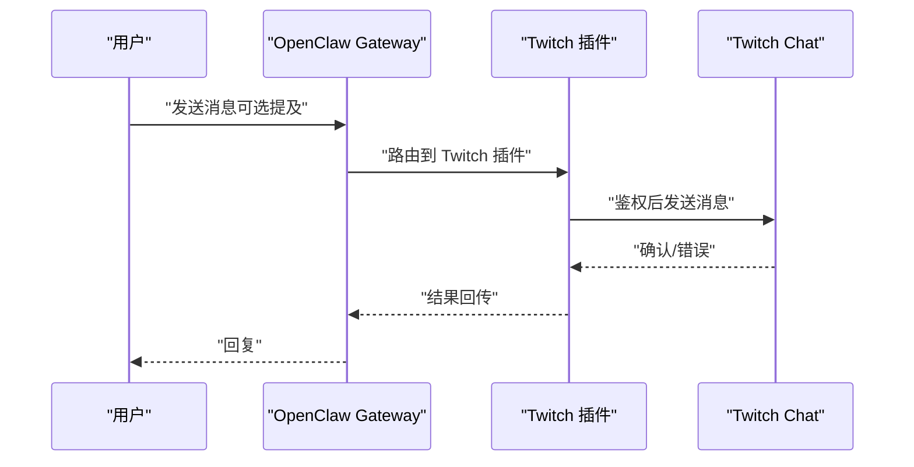
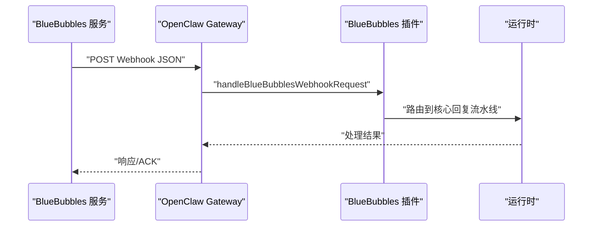
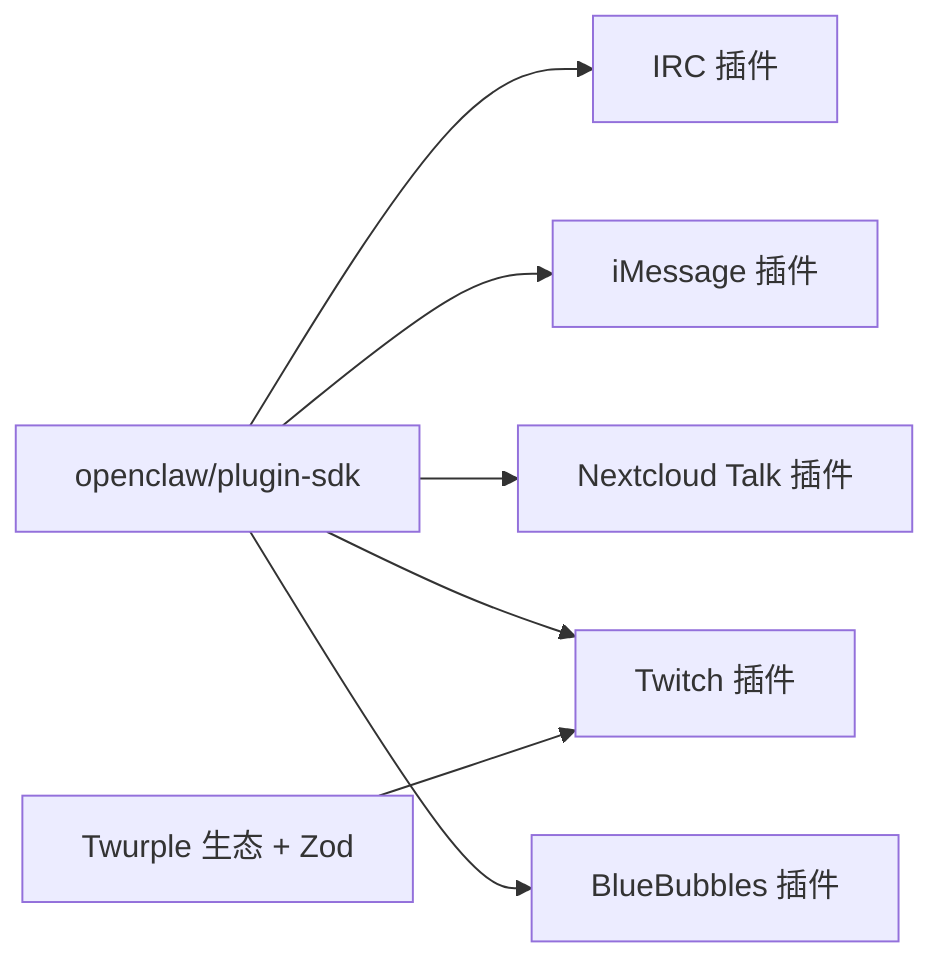

# 专业领域平台

<cite>
**本文引用的文件**
- [extensions/twitch/README.md](file://extensions/twitch/README.md)
- [extensions/twitch/package.json](file://extensions/twitch/package.json)
- [extensions/twitch/index.ts](file://extensions/twitch/index.ts)
- [extensions/bluebubbles/README.md](file://extensions/bluebubbles/README.md)
- [extensions/bluebubbles/package.json](file://extensions/bluebubbles/package.json)
- [extensions/bluebubbles/index.ts](file://extensions/bluebubbles/index.ts)
- [extensions/irc/package.json](file://extensions/irc/package.json)
- [extensions/irc/index.ts](file://extensions/irc/index.ts)
- [extensions/imessage/package.json](file://extensions/imessage/package.json)
- [extensions/imessage/index.ts](file://extensions/imessage/index.ts)
- [extensions/nextcloud-talk/package.json](file://extensions/nextcloud-talk/package.json)
- [extensions/nextcloud-talk/index.ts](file://extensions/nextcloud-talk/index.ts)
</cite>

## 目录

1. [简介](#简介)
2. [项目结构](#项目结构)
3. [核心组件](#核心组件)
4. [架构总览](#架构总览)
5. [详细组件分析](#详细组件分析)
6. [依赖关系分析](#依赖关系分析)
7. [性能考虑](#性能考虑)
8. [故障排查指南](#故障排查指南)
9. [结论](#结论)
10. [附录](#附录)

## 简介

本文件面向需要在专业领域（开发者社区、苹果生态、私有云部署、游戏直播、iOS 设备）集成 OpenClaw 的用户与工程师，系统化梳理并说明以下频道插件的配置与使用：IRC、iMessage、Nextcloud Talk、Twitch、BlueBubbles。内容涵盖各平台的技术特性、适用场景、配置要点、安全与性能建议，并提供可落地的部署与使用指南。

## 项目结构

OpenClaw 通过“扩展（extensions）”机制为不同通信平台提供频道插件。每个插件通常包含：

- 包描述文件（package.json）：声明插件元数据、安装信息与渠道标识
- 入口文件（index.ts）：注册插件、运行时桥接与 HTTP 回调处理
- 平台专用文档或 README：提供安装、配置、令牌生成与故障排查指引

图表来源

- [extensions/irc/index.ts](file://extensions/irc/index.ts#L1-L18)
- [extensions/imessage/index.ts](file://extensions/imessage/index.ts#L1-L18)
- [extensions/nextcloud-talk/index.ts](file://extensions/nextcloud-talk/index.ts#L1-L18)
- [extensions/twitch/index.ts](file://extensions/twitch/index.ts#L1-L21)
- [extensions/bluebubbles/index.ts](file://extensions/bluebubbles/index.ts#L1-L20)
- [extensions/irc/package.json](file://extensions/irc/package.json#L1-L12)
- [extensions/imessage/package.json](file://extensions/imessage/package.json#L1-L13)
- [extensions/nextcloud-talk/package.json](file://extensions/nextcloud-talk/package.json#L1-L31)
- [extensions/twitch/package.json](file://extensions/twitch/package.json#L1-L18)
- [extensions/bluebubbles/package.json](file://extensions/bluebubbles/package.json#L1-L34)

章节来源

- [extensions/irc/index.ts](file://extensions/irc/index.ts#L1-L18)
- [extensions/imessage/index.ts](file://extensions/imessage/index.ts#L1-L18)
- [extensions/nextcloud-talk/index.ts](file://extensions/nextcloud-talk/index.ts#L1-L18)
- [extensions/twitch/index.ts](file://extensions/twitch/index.ts#L1-L21)
- [extensions/bluebubbles/index.ts](file://extensions/bluebubbles/index.ts#L1-L20)

## 核心组件

- IRC 插件：提供 IRC 频道接入能力，通过入口文件注册并设置运行时。
- iMessage 插件：面向苹果生态的消息通道，通过入口文件注册并设置运行时。
- Nextcloud Talk 插件：自托管聊天平台的 Webhook Bot 接入，入口文件负责注册与运行时设置。
- Twitch 插件：基于 Twurple 生态的聊天机器人能力，入口文件注册插件并设置运行时，同时导出监控提供者。
- BlueBubbles 插件：通过 macOS 应用 BlueBubbles 的 REST API 实现 iMessage 转发，入口文件注册 HTTP 回调以接收 Webhook。

章节来源

- [extensions/irc/index.ts](file://extensions/irc/index.ts#L1-L18)
- [extensions/imessage/index.ts](file://extensions/imessage/index.ts#L1-L18)
- [extensions/nextcloud-talk/index.ts](file://extensions/nextcloud-talk/index.ts#L1-L18)
- [extensions/twitch/index.ts](file://extensions/twitch/index.ts#L1-L21)
- [extensions/bluebubbles/index.ts](file://extensions/bluebubbles/index.ts#L1-L20)

## 架构总览

下图展示 OpenClaw Gateway 如何通过插件入口注册频道与运行时，并在 BlueBubbles 场景中经由 HTTP 回调接收外部消息：

图表来源

- [extensions/irc/index.ts](file://extensions/irc/index.ts#L11-L14)
- [extensions/imessage/index.ts](file://extensions/imessage/index.ts#L11-L14)
- [extensions/nextcloud-talk/index.ts](file://extensions/nextcloud-talk/index.ts#L11-L14)
- [extensions/twitch/index.ts](file://extensions/twitch/index.ts#L13-L16)
- [extensions/bluebubbles/index.ts](file://extensions/bluebubbles/index.ts#L12-L16)

## 详细组件分析

### IRC 插件

- 技术特点
  - 基于标准 IRC 协议的文本聊天接入，适合开发者社区与开源协作场景。
  - 插件入口注册频道并设置运行时，便于与核心网关协同工作。
- 适用场景
  - 开源项目讨论、技术问答、自动化通知与指令执行。
- 配置与使用
  - 通过入口文件完成注册；具体连接参数与频道配置由运行时与核心配置层处理。
- 安全与性能
  - 建议配合访问控制策略与速率限制，避免滥用与资源耗尽。

章节来源

- [extensions/irc/package.json](file://extensions/irc/package.json#L1-L12)
- [extensions/irc/index.ts](file://extensions/irc/index.ts#L1-L18)

### iMessage 插件

- 技术特点
  - 面向苹果生态的原生消息通道，适合个人助理、企业内讯与跨设备协同。
  - 插件入口注册频道并设置运行时，确保与系统消息服务的稳定交互。
- 适用场景
  - 苹果用户群体的日常沟通、提醒与任务协作。
- 配置与使用
  - 通过入口文件完成注册；运行时负责消息收发与状态同步。
- 安全与性能
  - 注意系统权限与隐私合规；避免高频轮询与重复投递。

章节来源

- [extensions/imessage/package.json](file://extensions/imessage/package.json#L1-L13)
- [extensions/imessage/index.ts](file://extensions/imessage/index.ts#L1-L18)

### Nextcloud Talk 插件

- 技术特点
  - 自托管聊天平台的 Webhook Bot 接入，强调私有化与可控性。
  - 包描述文件中定义了渠道标识、文档路径、别名与安装方式。
- 适用场景
  - 私有云部署的企业内部沟通、合规审计与数据主权需求。
- 配置与使用
  - 通过入口文件注册频道与运行时；安装信息与默认选择在包描述中声明。
- 安全与性能
  - 强化网络边界与认证；合理设置并发与超时，保障服务稳定性。

章节来源

- [extensions/nextcloud-talk/package.json](file://extensions/nextcloud-talk/package.json#L1-L31)
- [extensions/nextcloud-talk/index.ts](file://extensions/nextcloud-talk/index.ts#L1-L18)

### Twitch 插件

- 技术特点
  - 基于 Twurple 生态的 Twitch 聊天机器人能力，支持多账户与角色级访问控制。
  - 默认需提及机器人以触发响应，具备严格的令牌与作用域要求。
- 适用场景
  - 游戏直播互动、实时问答、弹幕营销与粉丝运营。
- 配置与使用
  - 支持单账号与多账号配置；提供访问控制选项（提及开关、白名单用户、角色白名单）。
  - 安装可通过本地路径或 npm；最小化配置示例与完整文档链接见插件 README。
- 安全与性能
  - 必须启用 chat:read 与 chat:write 作用域；建议开启访问控制与令牌刷新策略。
  - 合理规划频道数量与并发连接，避免触发平台限流。

图表来源

- [extensions/twitch/index.ts](file://extensions/twitch/index.ts#L13-L16)
- [extensions/twitch/README.md](file://extensions/twitch/README.md#L25-L38)
- [extensions/twitch/README.md](file://extensions/twitch/README.md#L46-L70)

章节来源

- [extensions/twitch/package.json](file://extensions/twitch/package.json#L1-L18)
- [extensions/twitch/index.ts](file://extensions/twitch/index.ts#L1-L21)
- [extensions/twitch/README.md](file://extensions/twitch/README.md#L1-L90)

### BlueBubbles 插件

- 技术特点
  - 通过 BlueBubbles macOS 应用的 REST API 与 Webhook，实现 iMessage 的转发与交互。
  - 提供健康检查、消息发送、反应（tapback）、输入状态、媒体下载等内部辅助函数。
- 适用场景
  - iOS/iPadOS 用户在 macOS 上统一管理消息，以及需要跨平台 iMessage 能力的场景。
- 配置与使用
  - 核心配置项包括服务器地址、密码、Webhook 路径与动作开关（如 reactions）。
  - 插件入口注册 HTTP 处理器以接收 BlueBubbles 的 Webhook 消息。
- 安全与性能
  - 严格管理凭据与网络访问；对版本差异导致的 payload 进行防御式归一化；避免重复处理自身消息。

图表来源

- [extensions/bluebubbles/index.ts](file://extensions/bluebubbles/index.ts#L15-L16)
- [extensions/bluebubbles/README.md](file://extensions/bluebubbles/README.md#L28-L35)

章节来源

- [extensions/bluebubbles/package.json](file://extensions/bluebubbles/package.json#L1-L34)
- [extensions/bluebubbles/index.ts](file://extensions/bluebubbles/index.ts#L1-L20)
- [extensions/bluebubbles/README.md](file://extensions/bluebubbles/README.md#L1-L46)

## 依赖关系分析

- 插件与核心
  - 所有插件均通过入口文件注册频道与运行时，依赖 openclaw/plugin-sdk 的通用能力。
- 第三方依赖
  - Twitch 插件依赖 Twurple 生态与 Zod 校验库，用于 API 认证、聊天与数据校验。
- 安装与标识
  - 各插件在包描述中声明渠道标识、文档路径、别名与安装方式，便于 onboarding 与快速启动。

图表来源

- [extensions/twitch/package.json](file://extensions/twitch/package.json#L6-L11)
- [extensions/irc/index.ts](file://extensions/irc/index.ts#L1-L18)
- [extensions/imessage/index.ts](file://extensions/imessage/index.ts#L1-L18)
- [extensions/nextcloud-talk/index.ts](file://extensions/nextcloud-talk/index.ts#L1-L18)
- [extensions/twitch/index.ts](file://extensions/twitch/index.ts#L1-L21)
- [extensions/bluebubbles/index.ts](file://extensions/bluebubbles/index.ts#L1-L20)

章节来源

- [extensions/twitch/package.json](file://extensions/twitch/package.json#L1-L18)

## 性能考虑

- 连接与并发
  - 合理设置并发连接数与重连退避策略，避免对上游服务造成压力。
- 速率限制
  - 遵循平台速率限制（如 Twitch），在网关层实施队列与节流。
- 资源占用
  - 对媒体下载与 Webhook 解析进行内存与时间限制，防止长尾请求影响稳定性。
- 缓存与去重
  - 对重复消息与 Webhook payload 进行去重与缓存，降低重复处理成本。

## 故障排查指南

- Twitch
  - 确认令牌具备 chat:read 与 chat:write 作用域；若未触发响应，检查 requireMention 与 allowFrom/allowedRoles 设置。
  - 参考插件 README 中的最小化配置与多账号示例，逐步定位问题。
- BlueBubbles
  - 核查 serverUrl、password 与 webhookPath；确认已注册 HTTP 处理器；注意 payload 归一化与跳过“来自自身”的消息。
- 通用
  - 检查插件是否正确注册运行时；核对安装来源（本地路径或 npm）与 onboarding 流程。

章节来源

- [extensions/twitch/README.md](file://extensions/twitch/README.md#L23-L38)
- [extensions/twitch/README.md](file://extensions/twitch/README.md#L40-L45)
- [extensions/twitch/README.md](file://extensions/twitch/README.md#L72-L90)
- [extensions/bluebubbles/README.md](file://extensions/bluebubbles/README.md#L28-L35)
- [extensions/bluebubbles/README.md](file://extensions/bluebubbles/README.md#L36-L46)

## 结论

上述五个专业领域插件覆盖了从开发者社区（IRC）、苹果生态（iMessage、BlueBubbles）、私有云（Nextcloud Talk）、游戏直播（Twitch）到跨平台消息（BlueBubbles）等多样化场景。通过标准化的插件入口与运行时桥接，OpenClaw 能够在保证安全性与性能的前提下，灵活适配各类组织与行业的专业需求。

## 附录

- 安装与启用
  - 本地安装：使用 openclaw plugins install 指令指向插件目录。
  - npm 安装：使用 openclaw plugins install @openclaw/<插件名>。
- 文档与支持
  - 各插件 README 提供最小化配置、多账号配置、访问控制与故障排查链接，建议优先查阅。

章节来源

- [extensions/twitch/README.md](file://extensions/twitch/README.md#L5-L15)
- [extensions/twitch/README.md](file://extensions/twitch/README.md#L81-L90)
- [extensions/bluebubbles/README.md](file://extensions/bluebubbles/README.md#L5-L8)
