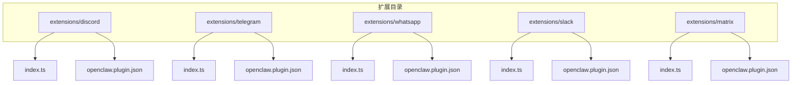
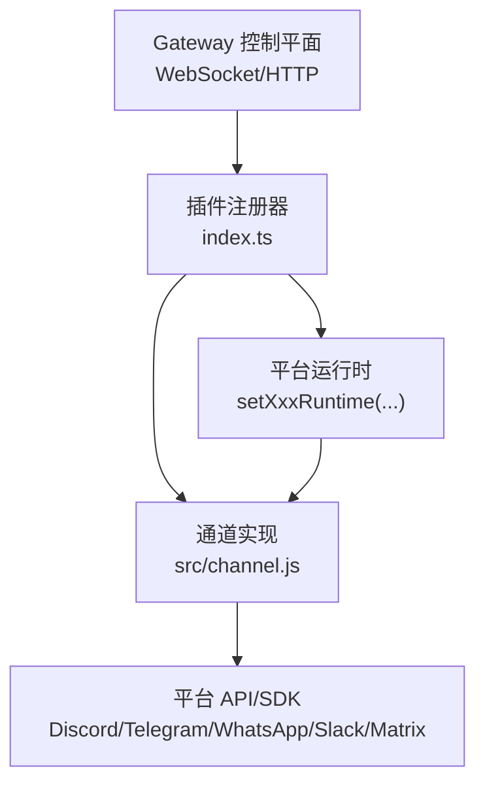
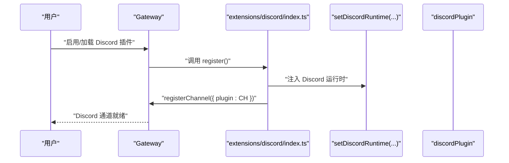
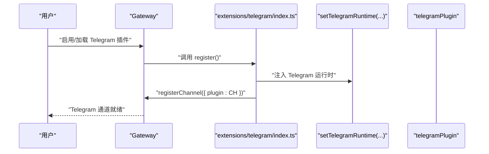
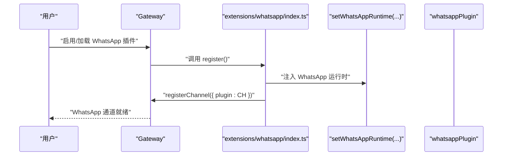
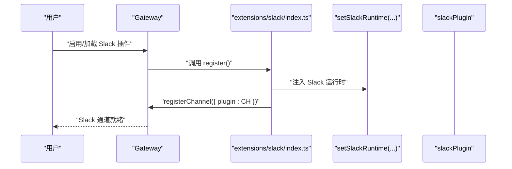
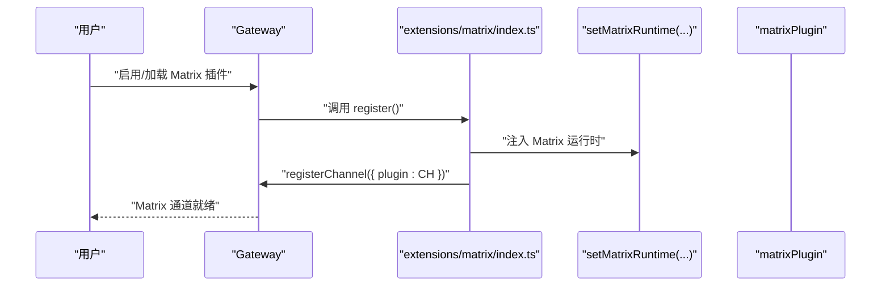
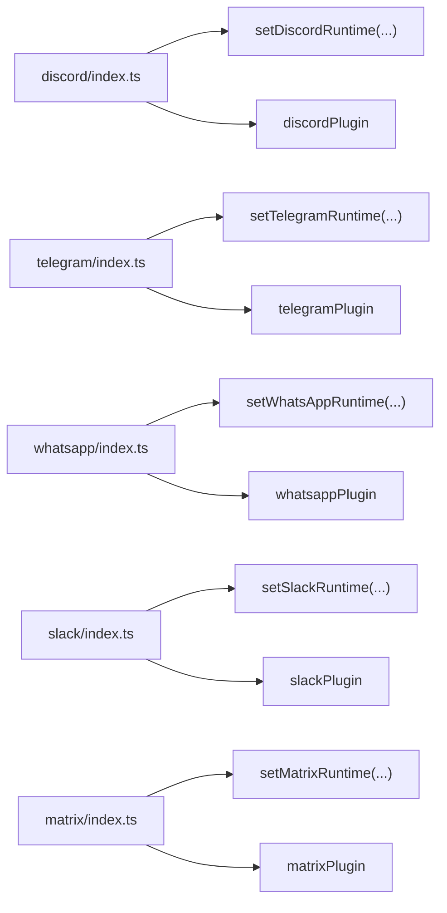

# 主流即时通讯平台

<cite>
**本文引用的文件**
- [README.md](file://README.md)
- [extensions/discord/openclaw.plugin.json](file://extensions/discord/openclaw.plugin.json)
- [extensions/discord/index.ts](file://extensions/discord/index.ts)
- [extensions/telegram/openclaw.plugin.json](file://extensions/telegram/openclaw.plugin.json)
- [extensions/telegram/index.ts](file://extensions/telegram/index.ts)
- [extensions/whatsapp/openclaw.plugin.json](file://extensions/whatsapp/openclaw.plugin.json)
- [extensions/whatsapp/index.ts](file://extensions/whatsapp/index.ts)
- [extensions/slack/openclaw.plugin.json](file://extensions/slack/openclaw.plugin.json)
- [extensions/slack/index.ts](file://extensions/slack/index.ts)
- [extensions/matrix/openclaw.plugin.json](file://extensions/matrix/openclaw.plugin.json)
- [extensions/matrix/index.ts](file://extensions/matrix/index.ts)
</cite>

## 目录

1. [简介](#简介)
2. [项目结构](#项目结构)
3. [核心组件](#核心组件)
4. [架构总览](#架构总览)
5. [详细组件分析](#详细组件分析)
6. [依赖关系分析](#依赖关系分析)
7. [性能考虑](#性能考虑)
8. [故障排查指南](#故障排查指南)
9. [结论](#结论)
10. [附录](#附录)

## 简介

本文件面向希望在 OpenClaw 中集成主流即时通讯平台（Discord、Telegram、WhatsApp、Slack、Matrix）的用户与开发者，提供从零开始的完整使用与配置指南。内容涵盖：

- 各平台的安装与启用方式
- API 密钥与机器人创建流程
- 配置参数与认证方式
- 平台特有功能与注意事项
- 常见问题与性能优化建议

OpenClaw 的通道（Channel）插件体系通过统一的插件接口注册各平台连接器，并在运行时注入对应平台的运行时能力。

章节来源

- [README.md](file://README.md#L21-L27)

## 项目结构

OpenClaw 将各平台通道作为独立扩展模块进行管理，采用“按平台分目录”的组织方式，核心入口位于各平台的 index.ts 文件中，插件元信息由 openclaw.plugin.json 提供。

图表来源

- [extensions/discord/index.ts](file://extensions/discord/index.ts#L1-L20)
- [extensions/telegram/index.ts](file://extensions/telegram/index.ts#L1-L18)
- [extensions/whatsapp/index.ts](file://extensions/whatsapp/index.ts#L1-L18)
- [extensions/slack/index.ts](file://extensions/slack/index.ts#L1-L18)
- [extensions/matrix/index.ts](file://extensions/matrix/index.ts#L1-L18)

章节来源

- [extensions/discord/index.ts](file://extensions/discord/index.ts#L1-L20)
- [extensions/telegram/index.ts](file://extensions/telegram/index.ts#L1-L18)
- [extensions/whatsapp/index.ts](file://extensions/whatsapp/index.ts#L1-L18)
- [extensions/slack/index.ts](file://extensions/slack/index.ts#L1-L18)
- [extensions/matrix/index.ts](file://extensions/matrix/index.ts#L1-L18)

## 核心组件

- 插件注册器：各平台 index.ts 负责导入对应通道实现与运行时，并调用 OpenClaw 插件 API 完成注册。
- 运行时注入：通过 setXxxRuntime 注入平台特定的运行时能力，用于消息收发、事件处理等。
- 通道实现：由 src/channel.js 暴露的通道对象，承载平台连接、消息路由、会话管理等职责。
- 插件元数据：openclaw.plugin.json 提供插件标识、支持的通道类型及配置模式。

章节来源

- [extensions/discord/index.ts](file://extensions/discord/index.ts#L7-L16)
- [extensions/telegram/index.ts](file://extensions/telegram/index.ts#L6-L14)
- [extensions/whatsapp/index.ts](file://extensions/whatsapp/index.ts#L6-L14)
- [extensions/slack/index.ts](file://extensions/slack/index.ts#L6-L14)
- [extensions/matrix/index.ts](file://extensions/matrix/index.ts#L6-L14)

## 架构总览

下图展示 OpenClaw 如何通过插件系统接入各即时通讯平台，以及与 Gateway 控制面的关系。

图表来源

- [extensions/discord/index.ts](file://extensions/discord/index.ts#L12-L16)
- [extensions/telegram/index.ts](file://extensions/telegram/index.ts#L11-L13)
- [extensions/whatsapp/index.ts](file://extensions/whatsapp/index.ts#L11-L13)
- [extensions/slack/index.ts](file://extensions/slack/index.ts#L11-L13)
- [extensions/matrix/index.ts](file://extensions/matrix/index.ts#L11-L13)

## 详细组件分析

### Discord 插件

- 插件标识与通道类型：id 为 "discord"，支持通道类型 "discord"。
- 注册流程：注册运行时、注册通道、注册子代理钩子。
- 配置要点：当前插件配置模式为空，表示无需额外配置项即可启用。

图表来源

- [extensions/discord/index.ts](file://extensions/discord/index.ts#L12-L16)
- [extensions/discord/openclaw.plugin.json](file://extensions/discord/openclaw.plugin.json#L1-L10)

章节来源

- [extensions/discord/index.ts](file://extensions/discord/index.ts#L1-L20)
- [extensions/discord/openclaw.plugin.json](file://extensions/discord/openclaw.plugin.json#L1-L10)

### Telegram 插件

- 插件标识与通道类型：id 为 "telegram"，支持通道类型 "telegram"。
- 注册流程：注册运行时、注册通道。
- 配置要点：当前插件配置模式为空，表示无需额外配置项即可启用。

图表来源

- [extensions/telegram/index.ts](file://extensions/telegram/index.ts#L11-L14)
- [extensions/telegram/openclaw.plugin.json](file://extensions/telegram/openclaw.plugin.json#L1-L10)

章节来源

- [extensions/telegram/index.ts](file://extensions/telegram/index.ts#L1-L18)
- [extensions/telegram/openclaw.plugin.json](file://extensions/telegram/openclaw.plugin.json#L1-L10)

### WhatsApp 插件

- 插件标识与通道类型：id 为 "whatsapp"，支持通道类型 "whatsapp"。
- 注册流程：注册运行时、注册通道。
- 配置要点：当前插件配置模式为空，表示无需额外配置项即可启用。

图表来源

- [extensions/whatsapp/index.ts](file://extensions/whatsapp/index.ts#L11-L13)
- [extensions/whatsapp/openclaw.plugin.json](file://extensions/whatsapp/openclaw.plugin.json#L1-L10)

章节来源

- [extensions/whatsapp/index.ts](file://extensions/whatsapp/index.ts#L1-L18)
- [extensions/whatsapp/openclaw.plugin.json](file://extensions/whatsapp/openclaw.plugin.json#L1-L10)

### Slack 插件

- 插件标识与通道类型：id 为 "slack"，支持通道类型 "slack"。
- 注册流程：注册运行时、注册通道。
- 配置要点：当前插件配置模式为空，表示无需额外配置项即可启用。

图表来源

- [extensions/slack/index.ts](file://extensions/slack/index.ts#L11-L13)
- [extensions/slack/openclaw.plugin.json](file://extensions/slack/openclaw.plugin.json#L1-L10)

章节来源

- [extensions/slack/index.ts](file://extensions/slack/index.ts#L1-L18)
- [extensions/slack/openclaw.plugin.json](file://extensions/slack/openclaw.plugin.json#L1-L10)

### Matrix 插件

- 插件标识与通道类型：id 为 "matrix"，支持通道类型 "matrix"。
- 注册流程：注册运行时、注册通道。
- 配置要点：当前插件配置模式为空，表示无需额外配置项即可启用。

图表来源

- [extensions/matrix/index.ts](file://extensions/matrix/index.ts#L11-L13)
- [extensions/matrix/openclaw.plugin.json](file://extensions/matrix/openclaw.plugin.json#L1-L10)

章节来源

- [extensions/matrix/index.ts](file://extensions/matrix/index.ts#L1-L18)
- [extensions/matrix/openclaw.plugin.json](file://extensions/matrix/openclaw.plugin.json#L1-L10)

## 依赖关系分析

- 插件注册器依赖于平台运行时与通道实现，二者通过 setXxxRuntime 与 registerChannel 绑定。
- 插件元数据 openclaw.plugin.json 仅声明通道类型与空配置模式，实际配置由上层 Gateway 或用户配置文件提供。

图表来源

- [extensions/discord/index.ts](file://extensions/discord/index.ts#L12-L16)
- [extensions/telegram/index.ts](file://extensions/telegram/index.ts#L11-L13)
- [extensions/whatsapp/index.ts](file://extensions/whatsapp/index.ts#L11-L13)
- [extensions/slack/index.ts](file://extensions/slack/index.ts#L11-L13)
- [extensions/matrix/index.ts](file://extensions/matrix/index.ts#L11-L13)

章节来源

- [extensions/discord/index.ts](file://extensions/discord/index.ts#L1-L20)
- [extensions/telegram/index.ts](file://extensions/telegram/index.ts#L1-L18)
- [extensions/whatsapp/index.ts](file://extensions/whatsapp/index.ts#L1-L18)
- [extensions/slack/index.ts](file://extensions/slack/index.ts#L1-L18)
- [extensions/matrix/index.ts](file://extensions/matrix/index.ts#L1-L18)

## 性能考虑

- 连接池与并发：建议在 Gateway 层对各通道连接进行池化管理，避免频繁重建连接。
- 消息批处理：对高频通道（如 Matrix、Telegram）可启用批量发送与压缩策略，降低网络开销。
- 缓存策略：对用户资料、群组信息等静态数据进行本地缓存，减少重复查询。
- 超时与重试：为平台 API 请求设置合理的超时与指数退避重试，提升稳定性。
- 资源隔离：在多通道场景下，确保通道间资源互不影响，必要时启用沙箱或隔离进程。

## 故障排查指南

- 通道未生效
  - 检查插件是否正确注册（index.ts 的 register 是否被调用）。
  - 确认 openclaw.plugin.json 中的通道类型与目标平台一致。
- 认证失败
  - 确认平台侧已生成并保存正确的访问令牌（如 Telegram Bot Token、Discord Bot Token、Slack Bot/App Token）。
  - 若使用环境变量，请确认变量名与 Gateway 支持的命名一致。
- 权限不足
  - Discord：检查机器人所在服务器的角色权限与频道可见性。
  - Slack：确认 Bot 用户加入相关工作区与频道，并具备相应权限。
  - Telegram：确认 Bot 已被添加到群组并具有发送消息权限。
  - WhatsApp：确认设备已登录且与 Gateway 保持稳定网络连接。
  - Matrix：确认 homeserver 地址、访问令牌与房间权限正确。
- 消息延迟或丢失
  - 检查网络连通性与平台 API 限流策略。
  - 在 Gateway 层开启重试与队列机制，避免瞬时错误导致丢包。
- 日志与诊断
  - 使用 Gateway 的诊断工具定位通道状态与错误堆栈。
  - 对高频通道开启更详细的日志级别以便追踪。

章节来源

- [README.md](file://README.md#L112-L125)

## 结论

通过统一的插件接口与运行时注入机制，OpenClaw 能够以最小侵入的方式集成主流即时通讯平台。尽管当前各平台插件的配置模式为空，但其注册流程与通道实现已为后续扩展（如令牌配置、群组策略、Webhook 等）预留了充分空间。建议在生产环境中结合 Gateway 的安全与诊断能力，完善权限控制与可观测性，以获得稳定可靠的跨平台消息体验。

## 附录

### 平台配置与认证速查

- Discord
  - 获取机器人令牌并在服务器中授予必要权限。
  - 参考：[README.md 中的 Discord 配置片段](file://README.md#L365-L378)
- Telegram
  - 创建 Bot 并获取 Bot Token；可选配置 Webhook 与密钥。
  - 参考：[README.md 中的 Telegram 配置片段](file://README.md#L346-L359)
- WhatsApp
  - 通过设备登录并保存凭据；允许白名单用户发起对话。
  - 参考：[README.md 中的 WhatsApp 配置片段](file://README.md#L340-L345)
- Slack
  - 生成 Bot Token 与 App Token 并完成应用安装。
  - 参考：[README.md 中的 Slack 配置片段](file://README.md#L361-L364)
- Matrix
  - 配置 homeserver 地址与访问令牌，确保房间权限正确。
  - 参考：[README.md 中的 Matrix 配置片段](file://README.md#L379-L380)

章节来源

- [README.md](file://README.md#L340-L380)
