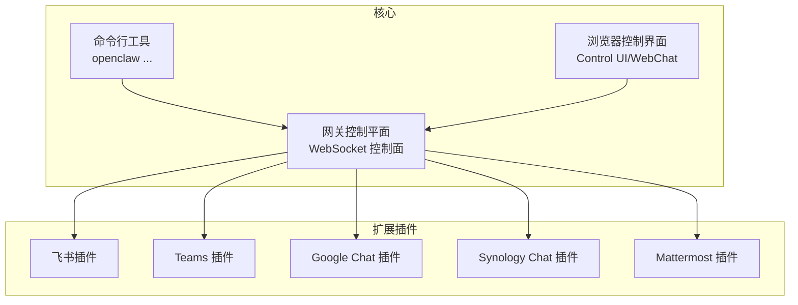
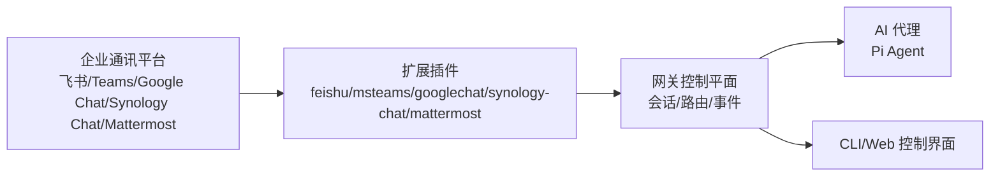
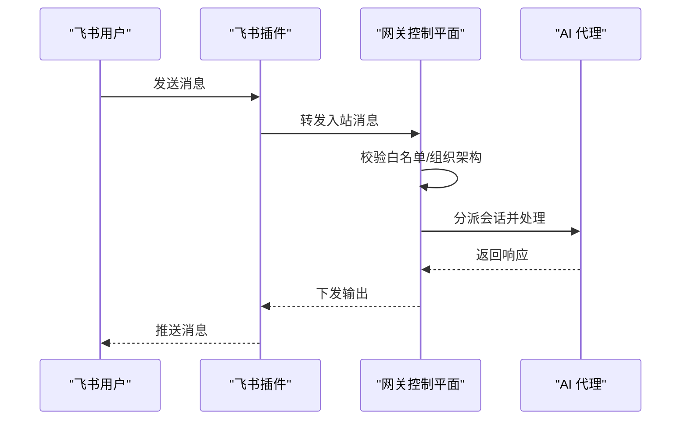
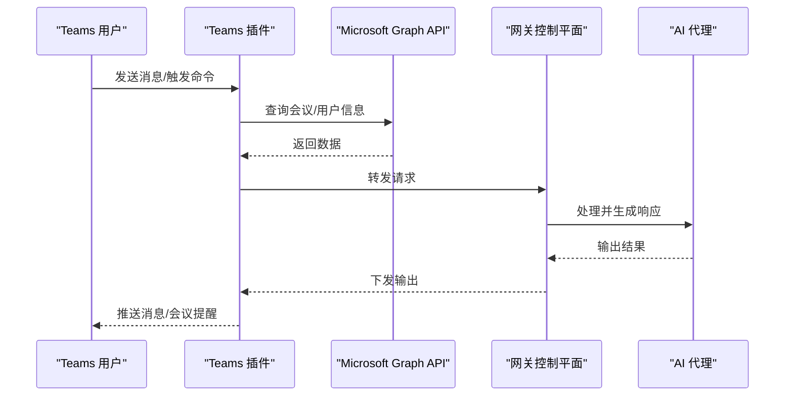
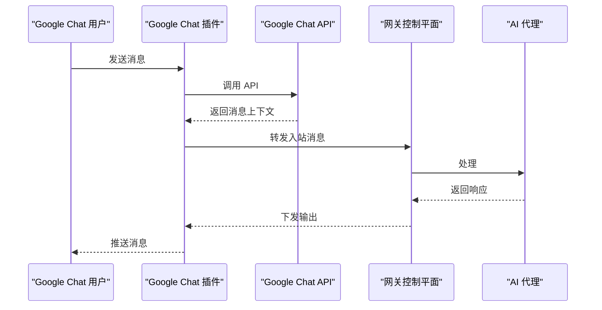
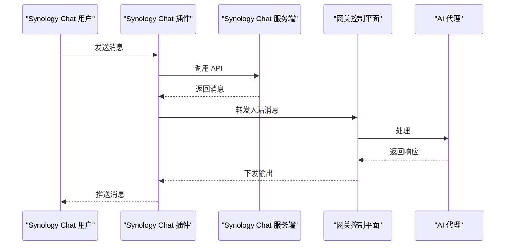
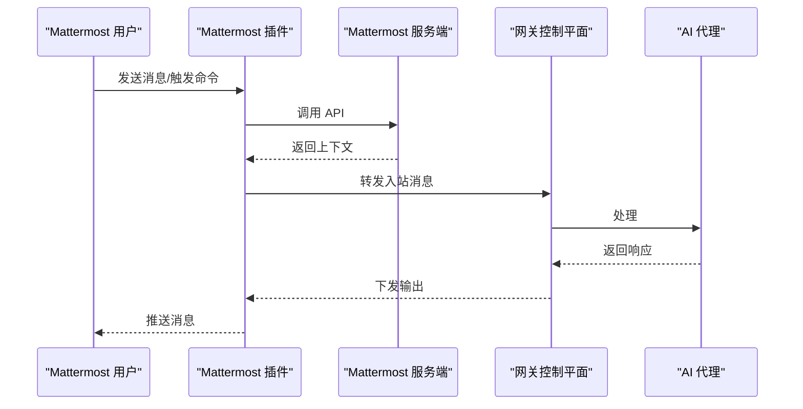
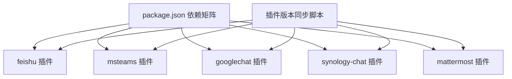

# 企业级通讯平台

<cite>
**本文引用的文件**
- [README.md](file://README.md)
- [index.md](file://docs/index.md)
- [package.json](file://package.json)
- [feishu 插件入口](file://extensions/feishu/index.ts)
- [feishu 插件清单](file://extensions/feishu/openclaw.plugin.json)
- [Microsoft Teams 插件入口](file://extensions/msteams/index.ts)
- [Microsoft Teams 插件清单](file://extensions/msteams/openclaw.plugin.json)
- [Google Chat 插件入口](file://extensions/googlechat/index.ts)
- [Google Chat 插件清单](file://extensions/googlechat/openclaw.plugin.json)
- [Synology Chat 插件入口](file://extensions/synology-chat/index.ts)
- [Synology Chat 插件清单](file://extensions/synology-chat/openclaw.plugin.json)
- [Mattermost 插件入口](file://extensions/mattermost/index.ts)
- [Mattermost 插件清单](file://extensions/mattermost/openclaw.plugin.json)
</cite>

## 目录

1. [简介](#简介)
2. [项目结构](#项目结构)
3. [核心组件](#核心组件)
4. [架构总览](#架构总览)
5. [详细组件分析](#详细组件分析)
6. [依赖关系分析](#依赖关系分析)
7. [性能考虑](#性能考虑)
8. [故障排除指南](#故障排除指南)
9. [结论](#结论)
10. [附录](#附录)

## 简介

本文件面向企业级部署与管理场景，系统化梳理 OpenClaw 在飞书、Microsoft Teams、Google Chat、Synology Chat、Mattermost 等企业级通讯平台上的插件化集成方案。内容涵盖：

- 平台特性与企业能力（如飞书审批流程、Teams 会议室集成、Mattermost 自托管）
- 认证机制、权限管理与组织架构集成
- API 密钥申请、应用创建与权限配置流程
- 安全策略与合规性要求
- IT 管理员的部署与运维指南

## 项目结构

OpenClaw 采用“核心网关 + 扩展插件”的架构模式，通过扩展目录统一管理各平台插件，实现多通道接入与企业特性集成。

图表来源

- [README.md](file://README.md#L185-L202)
- [package.json](file://package.json#L37-L47)

章节来源

- [README.md](file://README.md#L185-L202)
- [package.json](file://package.json#L37-L47)

## 核心组件

- 网关控制平面：统一会话、路由、事件与工具的控制中心，支持远程访问与安全暴露。
- 扩展插件：以独立包形式提供各平台的连接器与适配器，遵循统一的插件清单规范。
- 配置体系：通过 JSON 配置文件集中管理各通道的令牌、白名单、群组策略等。

章节来源

- [README.md](file://README.md#L318-L338)
- [index.md](file://docs/index.md#L130-L149)

## 架构总览

下图展示从企业通讯平台到网关再到 AI 代理的整体链路，以及扩展插件在其中的角色。

图表来源

- [README.md](file://README.md#L185-L202)
- [index.md](file://docs/index.md#L59-L69)

## 详细组件分析

### 飞书插件（feishu）

- 能力概述：提供飞书消息通道接入，支持企业内部机器人与组织架构集成。
- 认证与权限：
  - 使用企业自建应用与机器人 Token 进行鉴权。
  - 基于部门/用户 ID 的白名单与群组策略控制。
- 组织架构集成：可结合飞书组织架构进行权限校验与消息路由。
- 安全建议：启用最小权限原则，限制机器人可见范围；对敏感操作增加二次确认或审批流程。

图表来源

- [feishu 插件入口](file://extensions/feishu/index.ts)
- [feishu 插件清单](file://extensions/feishu/openclaw.plugin.json)

章节来源

- [feishu 插件入口](file://extensions/feishu/index.ts)
- [feishu 插件清单](file://extensions/feishu/openclaw.plugin.json)

### Microsoft Teams 插件（msteams）

- 能力概述：支持 Teams 机器人接入，可与会议系统联动，实现消息与会议通知的统一管理。
- 认证与权限：
  - 使用 Bot Framework 应用与 App Registration 进行 OAuth/令牌鉴权。
  - 基于团队/频道白名单与角色授权控制。
- 企业特性：
  - 会议室集成：通过 Teams Graph API 获取会议信息并推送至聊天。
  - 审批流程：结合企业审批系统，对特定操作进行审批后执行。
- 安全建议：启用多租户隔离与细粒度权限控制；对会议相关操作进行审计日志记录。

图表来源

- [Microsoft Teams 插件入口](file://extensions/msteams/index.ts)
- [Microsoft Teams 插件清单](file://extensions/msteams/openclaw.plugin.json)

章节来源

- [Microsoft Teams 插件入口](file://extensions/msteams/index.ts)
- [Microsoft Teams 插件清单](file://extensions/msteams/openclaw.plugin.json)

### Google Chat 插件（googlechat）

- 能力概述：基于 Google Chat API 提供机器人接入，支持群组与直接消息。
- 认证与权限：
  - 使用服务账号或 OAuth 令牌进行鉴权。
  - 基于 Google Workspace 组织域与成员身份进行访问控制。
- 安全建议：启用 IAM 角色最小化；对敏感指令进行二次确认。

图表来源

- [Google Chat 插件入口](file://extensions/googlechat/index.ts)
- [Google Chat 插件清单](file://extensions/googlechat/openclaw.plugin.json)

章节来源

- [Google Chat 插件入口](file://extensions/googlechat/index.ts)
- [Google Chat 插件清单](file://extensions/googlechat/openclaw.plugin.json)

### Synology Chat 插件（synology-chat）

- 能力概述：对接 Synology Chat，支持企业私有化部署的消息通道。
- 认证与权限：
  - 使用应用令牌或用户令牌进行鉴权。
  - 基于群组与用户白名单控制访问。
- 安全建议：在私有网络内运行，启用 TLS；定期轮换令牌。

图表来源

- [Synology Chat 插件入口](file://extensions/synology-chat/index.ts)
- [Synology Chat 插件清单](file://extensions/synology-chat/openclaw.plugin.json)

章节来源

- [Synology Chat 插件入口](file://extensions/synology-chat/index.ts)
- [Synology Chat 插件清单](file://extensions/synology-chat/openclaw.plugin.json)

### Mattermost 插件（mattermost）

- 能力概述：支持 Mattermost 私有化部署，提供机器人与频道集成。
- 认证与权限：
  - 使用机器人账户或个人访问令牌进行鉴权。
  - 基于频道白名单与用户组控制访问。
- 企业特性：强调自托管与本地数据主权，适合对数据合规要求严格的企业。
- 安全建议：启用双因素认证与审计日志；限制机器人权限范围。

图表来源

- [Mattermost 插件入口](file://extensions/mattermost/index.ts)
- [Mattermost 插件清单](file://extensions/mattermost/openclaw.plugin.json)

章节来源

- [Mattermost 插件入口](file://extensions/mattermost/index.ts)
- [Mattermost 插件清单](file://extensions/mattermost/openclaw.plugin.json)

## 依赖关系分析

- 插件发现与加载：网关通过插件清单文件识别并加载对应扩展。
- 依赖管理：各插件依赖于平台 SDK 或 API 客户端，统一由核心依赖矩阵管理。
- 版本同步：通过脚本同步插件版本，确保与核心版本兼容。

图表来源

- [package.json](file://package.json#L151-L206)
- [package.json](file://package.json#L112-L112)

章节来源

- [package.json](file://package.json#L151-L206)
- [package.json](file://package.json#L112-L112)

## 性能考虑

- 连接池与并发：合理设置各平台 API 的并发与重试策略，避免触发限流。
- 缓存与去重：对重复消息与查询结果进行缓存，减少往返开销。
- 资源隔离：在高并发场景下，建议为不同平台配置独立的处理线程或容器资源。
- 日志与监控：开启必要的性能指标与错误统计，便于定位瓶颈。

## 故障排除指南

- 常见问题
  - 插件未加载：检查插件清单文件与入口路径是否正确。
  - 认证失败：核对平台令牌、App ID、密钥是否有效且未过期。
  - 权限不足：确认机器人/应用权限范围与组织策略是否匹配。
- 诊断工具
  - 使用内置诊断命令与日志查看工具，定位网络、认证与路由问题。
  - 对接平台官方 SDK 的调试模式，捕获 API 请求/响应细节。
- 回滚与恢复
  - 保持插件版本与核心版本的兼容性，出现问题时回退至上一稳定版本。

章节来源

- [README.md](file://README.md#L442-L448)

## 结论

通过插件化架构，OpenClaw 能够在飞书、Teams、Google Chat、Synology Chat、Mattermost 等企业级平台上实现一致的接入体验与安全策略。企业可根据自身合规与安全要求，选择合适的平台与插件组合，并配合严格的认证、权限与审计机制，构建稳健的智能消息基础设施。

## 附录

### 企业 API 密钥申请与应用创建流程（通用步骤）

- 飞书
  - 创建企业自建应用，获取 App ID/Secret 与机器人 Token。
  - 在应用权限中勾选所需消息与组织架构接口。
  - 配置回调地址与事件订阅。
- Microsoft Teams
  - 在 Azure AD 中注册应用，配置 API 权限与证书。
  - 在 Teams 开发者门户创建机器人，获取 App ID 与密码。
  - 为机器人分配团队/频道访问权限。
- Google Chat
  - 在 Google Cloud Console 启用 Chat API，创建服务账号。
  - 为服务账号授予 Chat API 权限并下载密钥。
  - 在 Google Workspace 中配置成员与群组访问。
- Synology Chat
  - 在 Synology Chat 管理后台创建应用，生成访问令牌。
  - 配置应用权限与可见范围。
- Mattermost
  - 在 Mattermost 系统中创建机器人账户或个人访问令牌。
  - 配置频道白名单与用户组权限。

### 企业特性与合规要点

- 飞书：利用审批流程与组织架构进行权限校验；对敏感指令增加审批节点。
- Teams：结合会议系统与审批流程，确保会议相关操作受控；启用审计日志。
- Google Chat：基于 Workspace 域与 IAM 角色进行访问控制；启用数据保留策略。
- Synology Chat：在私有网络内运行，启用 TLS 与访问审计。
- Mattermost：强调自托管与本地数据主权，满足严格的数据合规要求。

### IT 管理员部署与运维指南

- 安装与启动
  - 使用包管理器安装并初始化网关服务。
  - 通过向导完成首次配置与通道绑定。
- 配置管理
  - 将各平台的密钥与白名单写入配置文件，分环境分离。
  - 使用环境变量覆盖敏感配置，避免硬编码。
- 安全加固
  - 启用最小权限原则与多因素认证。
  - 定期轮换令牌与密钥，建立密钥生命周期管理。
  - 对关键操作启用审计日志与告警。
- 监控与维护
  - 持续监控插件健康状态与 API 调用量。
  - 制定应急响应预案与回滚策略。

章节来源

- [README.md](file://README.md#L318-L338)
- [README.md](file://README.md#L442-L448)
- [index.md](file://docs/index.md#L130-L149)
