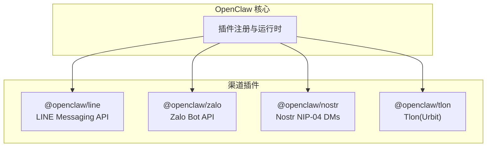
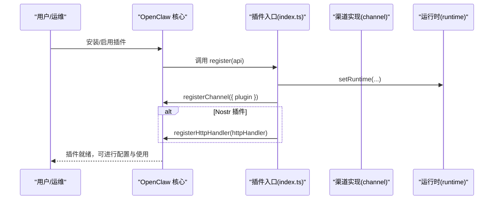
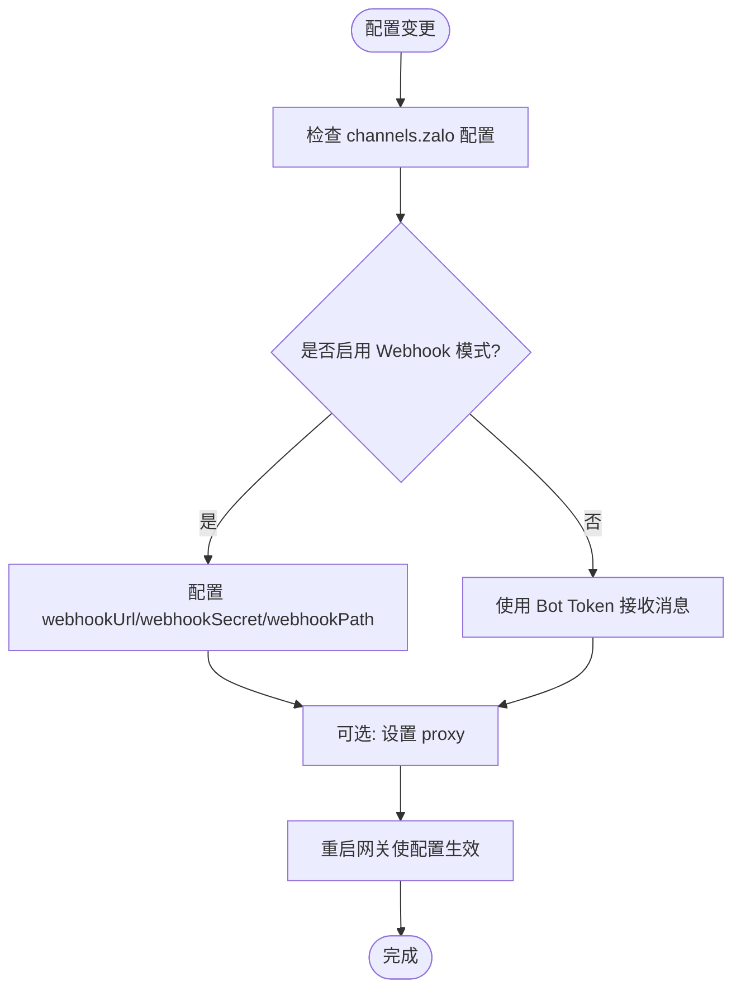
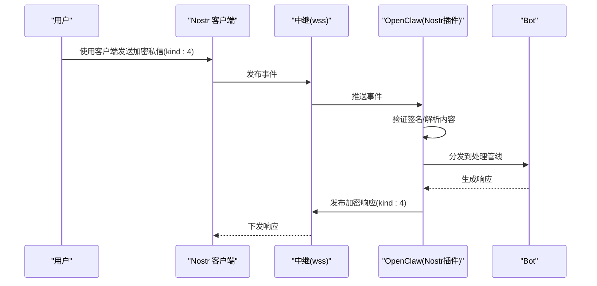
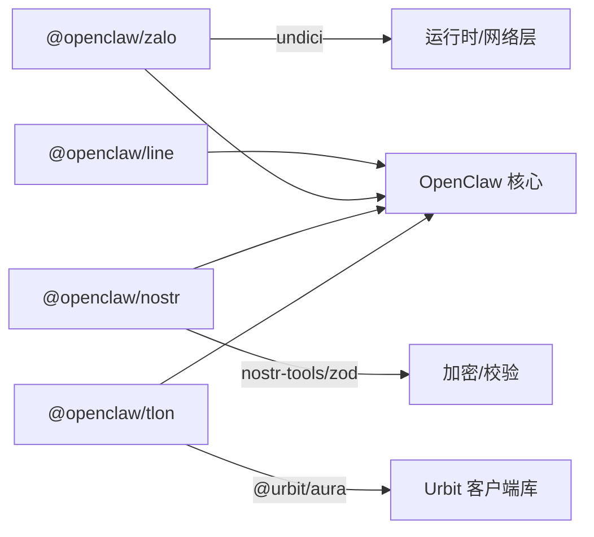

# 地区性通讯平台

<cite>
**本文引用的文件**
- [extensions/line/README.md](file://extensions/line/README.md)
- [extensions/line/package.json](file://extensions/line/package.json)
- [extensions/line/index.ts](file://extensions/line/index.ts)
- [extensions/zalo/README.md](file://extensions/zalo/README.md)
- [extensions/zalo/package.json](file://extensions/zalo/package.json)
- [extensions/zalo/index.ts](file://extensions/zalo/index.ts)
- [extensions/nostr/README.md](file://extensions/nostr/README.md)
- [extensions/nostr/package.json](file://extensions/nostr/package.json)
- [extensions/nostr/index.ts](file://extensions/nostr/index.ts)
- [extensions/tlon/README.md](file://extensions/tlon/README.md)
- [extensions/tlon/package.json](file://extensions/tlon/package.json)
- [extensions/tlon/index.ts](file://extensions/tlon/index.ts)
</cite>

## 目录

1. [简介](#简介)
2. [项目结构](#项目结构)
3. [核心组件](#核心组件)
4. [架构总览](#架构总览)
5. [详细组件分析](#详细组件分析)
6. [依赖关系分析](#依赖关系分析)
7. [性能与可用性考量](#性能与可用性考量)
8. [故障排查指南](#故障排查指南)
9. [结论](#结论)
10. [附录](#附录)

## 简介

本文件面向需要在 OpenClaw 中集成地区性通讯平台的用户与运维人员，聚焦以下四类具有地域特色的频道插件：LINE（日泰台市场）、Zalo（越南市场）、Nostr（去中心化协议，NIP-04 加密私信）、TLON（基于 Urbit 的去中心化通讯）。文档内容涵盖安装与配置、认证与访问控制、功能限制、隐私与数据处理、地区法规影响与合规建议，以及跨地区部署的最佳实践。

## 项目结构

四个插件均采用统一的 OpenClaw 插件结构：package.json 定义渠道元信息与安装方式；index.ts 注册通道与运行时；README.md 提供安装、配置与快速上手说明。下图展示插件在 OpenClaw 生态中的位置与职责：

图表来源

- [extensions/line/package.json](file://extensions/line/package.json#L7-L26)
- [extensions/zalo/package.json](file://extensions/zalo/package.json#L9-L31)
- [extensions/nostr/package.json](file://extensions/nostr/package.json#L10-L30)
- [extensions/tlon/package.json](file://extensions/tlon/package.json#L9-L29)

章节来源

- [extensions/line/package.json](file://extensions/line/package.json#L1-L28)
- [extensions/zalo/package.json](file://extensions/zalo/package.json#L1-L33)
- [extensions/nostr/package.json](file://extensions/nostr/package.json#L1-L31)
- [extensions/tlon/package.json](file://extensions/tlon/package.json#L1-L30)

## 核心组件

- 插件注册入口：各插件通过 index.ts 导出插件对象，注册渠道与运行时，并在需要时注册 HTTP 处理器（如 Nostr 的配置管理接口）。
- 渠道元信息：package.json 的 openclaw.channel 字段定义渠道标识、标签、文档路径、排序权重与快捷配置能力，便于在 OpenClaw 控制台中选择与安装。
- 安装方式：支持 npm 安装与本地路径安装两种方式，满足不同部署场景。

章节来源

- [extensions/line/index.ts](file://extensions/line/index.ts#L7-L19)
- [extensions/zalo/index.ts](file://extensions/zalo/index.ts#L7-L19)
- [extensions/nostr/index.ts](file://extensions/nostr/index.ts#L9-L66)
- [extensions/tlon/index.ts](file://extensions/tlon/index.ts#L6-L15)

## 架构总览

下图展示各插件在 OpenClaw 中的注册与交互流程，突出 Nostr 的 HTTP 配置处理器与通用的注册模式：

图表来源

- [extensions/line/index.ts](file://extensions/line/index.ts#L12-L16)
- [extensions/zalo/index.ts](file://extensions/zalo/index.ts#L12-L16)
- [extensions/nostr/index.ts](file://extensions/nostr/index.ts#L14-L65)
- [extensions/tlon/index.ts](file://extensions/tlon/index.ts#L11-L14)

## 详细组件分析

### LINE 插件（日泰台市场）

- 安装与文档
  - 支持 npm 安装与本地路径安装。
  - 文档路径与选择标签已在 package.json 中声明，便于在控制台中识别与安装。
- 快速开始
  - 在控制台选择“LINE (Messaging API)”后，按提示完成安装。
  - 具体配置项由渠道实现负责，插件注册时会设置运行时并注册渠道。
- 适用场景
  - 面向日本、台湾、泰国市场的 Messaging API 渠道，适合需要与本地生态对接的业务。

章节来源

- [extensions/line/README.md](file://extensions/line/README.md#L1-L18)
- [extensions/line/package.json](file://extensions/line/package.json#L7-L26)
- [extensions/line/index.ts](file://extensions/line/index.ts#L12-L16)

### Zalo 插件（越南市场）

- 安装与文档
  - 支持 npm 与本地安装。
  - 文档路径与别名已在 package.json 中声明。
- 配置要点
  - 基础配置包括启用开关、Bot Token、私聊策略与代理设置。
  - Webhook 模式支持自定义 webhookUrl、webhookSecret 与 webhookPath。
- 运行机制
  - 插件注册渠道与 Dock，并注册 HTTP 处理器用于接收 Zalo 平台回调。

图表来源

- [extensions/zalo/README.md](file://extensions/zalo/README.md#L19-L50)
- [extensions/zalo/index.ts](file://extensions/zalo/index.ts#L12-L16)

章节来源

- [extensions/zalo/README.md](file://extensions/zalo/README.md#L1-L51)
- [extensions/zalo/package.json](file://extensions/zalo/package.json#L9-L31)
- [extensions/zalo/index.ts](file://extensions/zalo/index.ts#L12-L16)

### Nostr 插件（去中心化私信）

- 安装与快速设置
  - 支持 npm 安装。
  - 快速设置包含生成密钥对、在配置中添加 privateKey 与 relays、设置环境变量、重启网关。
- 配置项与访问控制
  - 关键配置：privateKey（nsec 或 hex）、relays（WebSocket 中继列表）、dmPolicy（配对/白名单/开放/禁用）、allowFrom（允许的公钥列表）、enabled/name。
  - 访问控制策略：默认“配对”，生产环境建议使用“白名单”。
- 协议支持与安全
  - 支持 NIP-01（事件结构）与 NIP-04（加密私信 kind:4），计划支持 NIP-17（Gift-wrap DM v2）。
  - 安全建议：私钥不落盘日志、验证事件签名、使用环境变量存储密钥。
- 测试与排障
  - 可使用本地中继（如 strfry）进行测试。
  - 常见问题：核对私钥、检查中继连通性、确认启用状态与公钥匹配。

图表来源

- [extensions/nostr/README.md](file://extensions/nostr/README.md#L104-L118)
- [extensions/nostr/index.ts](file://extensions/nostr/index.ts#L14-L65)

章节来源

- [extensions/nostr/README.md](file://extensions/nostr/README.md#L1-L137)
- [extensions/nostr/package.json](file://extensions/nostr/package.json#L10-L30)
- [extensions/nostr/index.ts](file://extensions/nostr/index.ts#L14-L65)

### Tlon 插件（Urbit 去中心化通讯）

- 安装与文档
  - 支持 npm 安装。
  - 文档链接指向官方渠道文档页面。
- 功能范围
  - 支持私信、群组提及与主题回复，适用于 Urbit 生态的去中心化通讯场景。

章节来源

- [extensions/tlon/README.md](file://extensions/tlon/README.md#L1-L6)
- [extensions/tlon/package.json](file://extensions/tlon/package.json#L9-L29)
- [extensions/tlon/index.ts](file://extensions/tlon/index.ts#L11-L14)

## 依赖关系分析

- 依赖声明
  - Zalo 插件依赖 undici。
  - Nostr 插件依赖 nostr-tools 与 zod。
  - Tlon 插件依赖 @urbit/aura。
- 插件元信息
  - 各插件通过 openclaw.channel 字段声明渠道标识、文档路径、排序权重与快捷配置能力，确保在控制台中正确显示与安装。

图表来源

- [extensions/zalo/package.json](file://extensions/zalo/package.json#L6-L8)
- [extensions/nostr/package.json](file://extensions/nostr/package.json#L6-L9)
- [extensions/tlon/package.json](file://extensions/tlon/package.json#L6-L8)
- [extensions/line/package.json](file://extensions/line/package.json#L7-L26)

章节来源

- [extensions/zalo/package.json](file://extensions/zalo/package.json#L1-L33)
- [extensions/nostr/package.json](file://extensions/nostr/package.json#L1-L31)
- [extensions/tlon/package.json](file://extensions/tlon/package.json#L1-L30)
- [extensions/line/package.json](file://extensions/line/package.json#L1-L28)

## 性能与可用性考量

- 中继与网络
  - Nostr：合理选择中继节点，避免单一中继故障；在高并发场景下注意速率限制与重连策略。
  - Zalo：若使用代理，需评估代理延迟与稳定性；Webhook 模式可降低轮询开销。
- 运行时与资源
  - 插件注册时设置运行时，确保网络与配置模块可用；在资源受限环境中优先启用必要的渠道。
- 可观测性
  - 建议结合 OpenClaw 日志与指标系统，监控各渠道的消息吞吐、错误率与延迟。

## 故障排查指南

- Nostr
  - 无法接收消息：核对私钥格式与环境变量、检查中继连通性、确认 enabled 开关与公钥匹配。
  - 消息未送达：检查中继 URL（必须为 wss）、确认中继在线与未限流。
- Zalo
  - Webhook 模式：确认 webhookUrl、webhookSecret、webhookPath 配置正确，必要时指定 webhookPath。
  - Bot Token：确保 Token 有效且未过期。
- LINE
  - 在控制台完成安装后，按提示进行后续配置；如遇异常，检查运行时日志。
- Tlon
  - 确认 Urbit 客户端库版本兼容性与网络可达性；参考官方文档页面获取最新说明。

章节来源

- [extensions/nostr/README.md](file://extensions/nostr/README.md#L119-L133)
- [extensions/zalo/README.md](file://extensions/zalo/README.md#L34-L50)
- [extensions/line/README.md](file://extensions/line/README.md#L1-L18)
- [extensions/tlon/README.md](file://extensions/tlon/README.md#L1-L6)

## 结论

上述四个插件覆盖了从主流地区平台（LINE、Zalo）到去中心化协议（Nostr、TLON）的多样化需求。通过统一的插件注册与运行时机制，OpenClaw 能够在不同地区与合规环境下灵活部署。建议在生产环境中优先采用白名单或配对策略（Nostr）、Webhook 模式（Zalo），并结合本地中继与可观测性工具保障稳定性与安全性。

## 附录

- 安装与启用
  - 使用 npm 安装或本地路径安装，随后在 OpenClaw 控制台中选择对应渠道并完成配置。
- 配置示例定位
  - 各插件 README 中提供了完整的配置片段与说明，可直接参考。
- 文档与支持
  - 各插件的文档路径已在 package.json 中声明，可在控制台或文档站点查阅。
