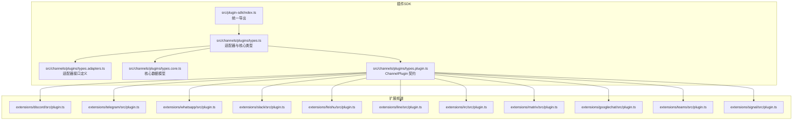
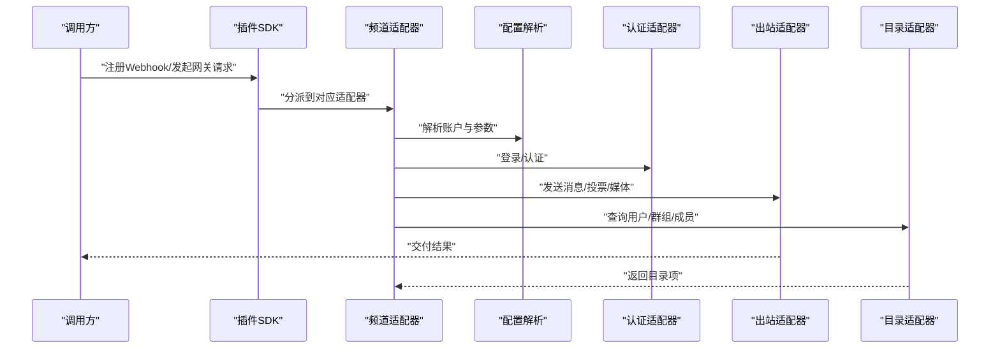
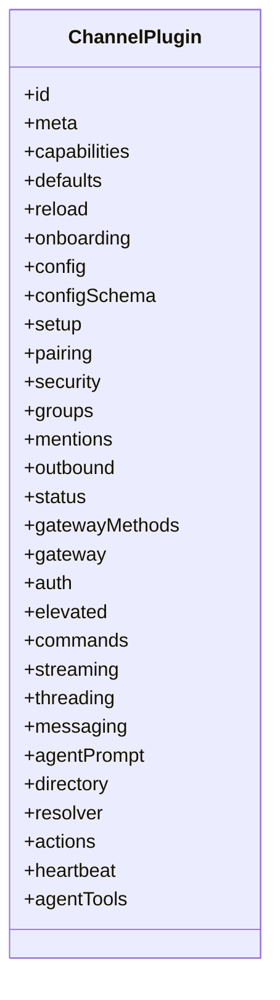
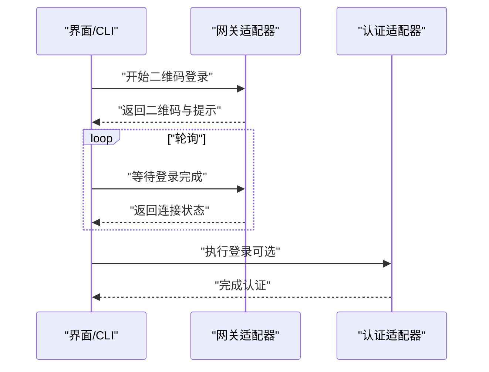
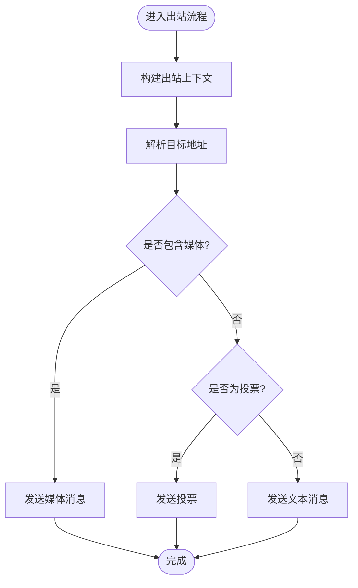
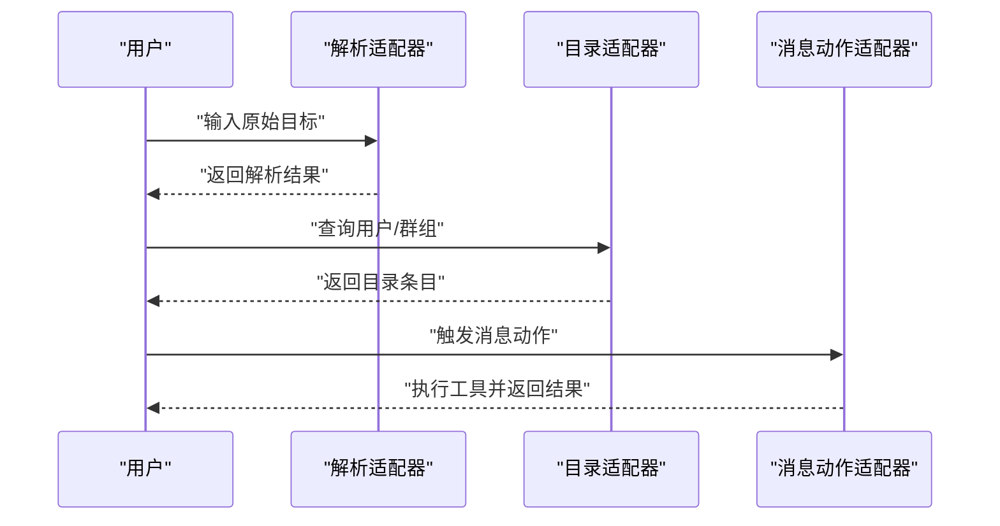
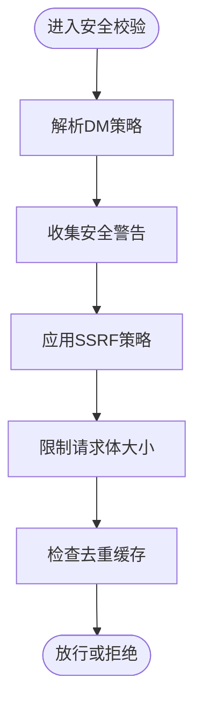
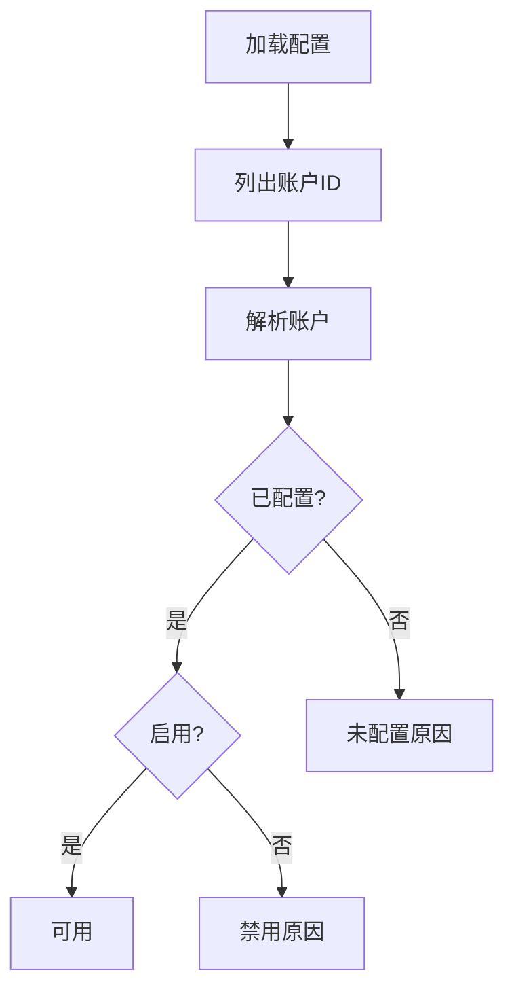
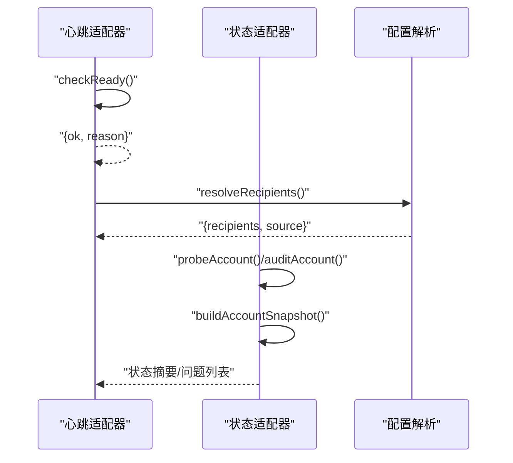
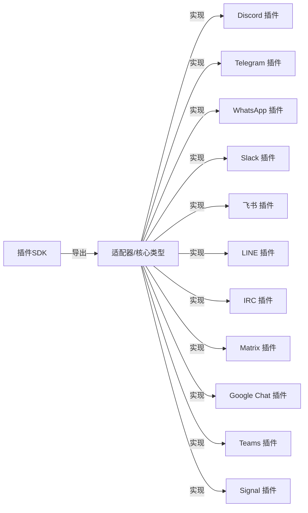

# 插件开发指南

<cite>
**本文引用的文件**
- [src/plugin-sdk/index.ts](file://src/plugin-sdk/index.ts)
- [src/channels/plugins/types.plugin.ts](file://src/channels/plugins/types.plugin.ts)
- [src/channels/plugins/types.ts](file://src/channels/plugins/types.ts)
- [src/channels/plugins/types.adapters.ts](file://src/channels/plugins/types.adapters.ts)
- [src/channels/plugins/types.core.ts](file://src/channels/plugins/types.core.ts)
- [extensions/discord/src/plugin.ts](file://extensions/discord/src/plugin.ts)
- [extensions/telegram/src/plugin.ts](file://extensions/telegram/src/plugin.ts)
- [extensions/whatsapp/src/plugin.ts](file://extensions/whatsapp/src/plugin.ts)
- [extensions/slack/src/plugin.ts](file://extensions/slack/src/plugin.ts)
- [extensions/feishu/src/plugin.ts](file://extensions/feishu/src/plugin.ts)
- [extensions/line/src/plugin.ts](file://extensions/line/src/plugin.ts)
- [extensions/irc/src/plugin.ts](file://extensions/irc/src/plugin.ts)
- [extensions/matrix/src/plugin.ts](file://extensions/matrix/src/plugin.ts)
- [extensions/googlechat/src/plugin.ts](file://extensions/googlechat/src/plugin.ts)
- [extensions/teams/src/plugin.ts](file://extensions/teams/src/plugin.ts)
- [extensions/signal/src/plugin.ts](file://extensions/signal/src/plugin.ts)
- [extensions/teams/src/plugin.ts](file://extensions/teams/src/plugin.ts)
- [extensions/teams/src/plugin.ts](file://extensions/teams/src/plugin.ts)
</cite>

## 目录

1. [简介](#简介)
2. [项目结构](#项目结构)
3. [核心组件](#核心组件)
4. [架构总览](#架构总览)
5. [详细组件分析](#详细组件分析)
6. [依赖关系分析](#依赖关系分析)
7. [性能考量](#性能考量)
8. [故障排查指南](#故障排查指南)
9. [结论](#结论)
10. [附录](#附录)

## 简介

本指南面向希望基于 OpenClaw 插件 SDK 开发“频道适配器（Channel Adapter）”的开发者。你将学会如何设计与实现一个符合 OpenClaw 插件契约的频道适配器，涵盖认证、消息收发、状态检查、目录解析、权限策略、心跳、命令与工具集成、以及生命周期管理等关键能力。文档同时提供可直接参考的扩展插件样例路径，并给出安全与性能优化建议。

## 项目结构

OpenClaw 将插件 SDK 的导出入口集中于插件 SDK 入口文件，统一对外暴露适配器类型、运行时工具、配置模式、Webhook 路由、SSRF 限制、媒体处理、会话键与去重缓存等通用能力；频道适配器的具体实现位于各扩展目录中，遵循统一的 ChannelPlugin 契约。

**图表来源**

- [src/plugin-sdk/index.ts](file://src/plugin-sdk/index.ts#L1-L597)
- [src/channels/plugins/types.ts](file://src/channels/plugins/types.ts#L1-L66)
- [src/channels/plugins/types.adapters.ts](file://src/channels/plugins/types.adapters.ts#L1-L320)
- [src/channels/plugins/types.core.ts](file://src/channels/plugins/types.core.ts#L1-L372)
- [src/channels/plugins/types.plugin.ts](file://src/channels/plugins/types.plugin.ts#L1-L86)

**章节来源**

- [src/plugin-sdk/index.ts](file://src/plugin-sdk/index.ts#L1-L597)
- [src/channels/plugins/types.ts](file://src/channels/plugins/types.ts#L1-L66)

## 核心组件

- ChannelPlugin 契约：定义频道插件的标识、元数据、能力集、默认行为、配置与适配器集合，以及可选的代理工具。
- 适配器族：负责具体业务能力，如配置解析、账户绑定、网关启动/停止、认证、消息收发、目录查询、解析、安全策略、心跳、命令与工具集成等。
- 核心数据模型：账户快照、日志句柄、线程上下文、消息动作上下文、投票上下文、探针结果基类等。
- SDK 工具：Webhook 路由注册、SSRF 策略、媒体处理、会话键、去重缓存、时间格式化、HTTP 请求体限制、抓取守卫等。

**章节来源**

- [src/channels/plugins/types.plugin.ts](file://src/channels/plugins/types.plugin.ts#L48-L86)
- [src/channels/plugins/types.adapters.ts](file://src/channels/plugins/types.adapters.ts#L23-L320)
- [src/channels/plugins/types.core.ts](file://src/channels/plugins/types.core.ts#L76-L372)
- [src/plugin-sdk/index.ts](file://src/plugin-sdk/index.ts#L1-L597)

## 架构总览

下图展示了从调用方到频道适配器的典型交互路径：调用方通过 SDK 注册 Webhook 或使用网关方法，适配器根据配置解析账户、执行认证、进行消息路由与处理，并在需要时调用安全策略与目录服务。

**图表来源**

- [src/channels/plugins/types.adapters.ts](file://src/channels/plugins/types.adapters.ts#L106-L123)
- [src/channels/plugins/types.adapters.ts](file://src/channels/plugins/types.adapters.ts#L227-L235)
- [src/channels/plugins/types.adapters.ts](file://src/channels/plugins/types.adapters.ts#L271-L280)
- [src/plugin-sdk/index.ts](file://src/plugin-sdk/index.ts#L123-L129)

## 详细组件分析

### ChannelPlugin 契约与生命周期

- 关键字段
  - id/meta/capabilities：标识频道、展示信息与能力清单
  - defaults：队列去抖动等默认行为
  - reload：配置前缀热重载
  - adapters：按需启用的适配器集合
  - agentTools：频道专属代理工具（登录流程等）
- 生命周期
  - 网关启动/停止：通过 ChannelGatewayAdapter.startAccount/stopAccount
  - 登录/登出：loginWithQrStart/loginWithQrWait/logoutAccount
  - 状态检查：probeAccount/auditAccount/buildAccountSnapshot
  - 心跳：checkReady/resolveRecipients

**图表来源**

- [src/channels/plugins/types.plugin.ts](file://src/channels/plugins/types.plugin.ts#L48-L86)

**章节来源**

- [src/channels/plugins/types.plugin.ts](file://src/channels/plugins/types.plugin.ts#L1-L86)
- [src/channels/plugins/types.adapters.ts](file://src/channels/plugins/types.adapters.ts#L211-L225)

### 认证与登录流程

- 二维码登录：loginWithQrStart 返回二维码数据与提示；loginWithQrWait 轮询连接状态
- 直接登录：ChannelAuthAdapter.login 执行认证
- 登出：logoutAccount 清理会话与状态

**图表来源**

- [src/channels/plugins/types.adapters.ts](file://src/channels/plugins/types.adapters.ts#L214-L224)
- [src/channels/plugins/types.adapters.ts](file://src/channels/plugins/types.adapters.ts#L227-L235)

**章节来源**

- [src/channels/plugins/types.adapters.ts](file://src/channels/plugins/types.adapters.ts#L183-L191)
- [src/channels/plugins/types.adapters.ts](file://src/channels/plugins/types.adapters.ts#L227-L235)

### 消息路由与出站发送

- 出站上下文：包含目标、文本、媒体、回复ID、线程ID、账户、静默标记等
- 发送方式：sendText/sendMedia/sendPayload/sendPoll
- 目标解析：resolveTarget 支持显式/隐式/心跳模式
- 分块策略：chunker/chunkerMode/textChunkLimit 控制长文本拆分

**图表来源**

- [src/channels/plugins/types.adapters.ts](file://src/channels/plugins/types.adapters.ts#L87-L104)
- [src/channels/plugins/types.adapters.ts](file://src/channels/plugins/types.adapters.ts#L106-L123)

**章节来源**

- [src/channels/plugins/types.adapters.ts](file://src/channels/plugins/types.adapters.ts#L87-L123)

### 目录解析与消息动作

- 目录适配器：self/listPeers/listGroups/listGroupMembers
- 解析适配器：resolveTargets 支持用户/群组解析
- 消息动作：listActions/supportsButtons/supportsCards/extractToolSend/handleAction

**图表来源**

- [src/channels/plugins/types.adapters.ts](file://src/channels/plugins/types.adapters.ts#L292-L300)
- [src/channels/plugins/types.adapters.ts](file://src/channels/plugins/types.adapters.ts#L271-L280)
- [src/channels/plugins/types.adapters.ts](file://src/channels/plugins/types.adapters.ts#L334-L341)

**章节来源**

- [src/channels/plugins/types.adapters.ts](file://src/channels/plugins/types.adapters.ts#L271-L300)
- [src/channels/plugins/types.adapters.ts](file://src/channels/plugins/types.adapters.ts#L334-L341)

### 安全策略与权限控制

- DM 策略：resolveDmPolicy 返回策略与允许来源
- 权限警告：collectWarnings 收集安全风险提示
- SSRF 与请求体限制：fetch-guard/ssrf-policy/http-body 限制网络访问与请求大小
- 去重与会话：持久化去重、会话键解析

**图表来源**

- [src/channels/plugins/types.adapters.ts](file://src/channels/plugins/types.adapters.ts#L314-L319)
- [src/plugin-sdk/index.ts](file://src/plugin-sdk/index.ts#L279-L287)
- [src/plugin-sdk/index.ts](file://src/plugin-sdk/index.ts#L298-L301)
- [src/plugin-sdk/index.ts](file://src/plugin-sdk/index.ts#L266-L271)

**章节来源**

- [src/channels/plugins/types.adapters.ts](file://src/channels/plugins/types.adapters.ts#L314-L319)
- [src/plugin-sdk/index.ts](file://src/plugin-sdk/index.ts#L279-L301)
- [src/plugin-sdk/index.ts](file://src/plugin-sdk/index.ts#L266-L271)

### 配置验证与模板

- 配置模式：ChannelConfigSchema.schema/uiHints 定义表单与提示
- 配置适配器：listAccountIds/resolveAccount/setAccountEnabled/deleteAccount/isConfigured/disabledReason 等
- 默认值与迁移：applyAccountName/migrateBaseNameToDefaultAccount 等

**图表来源**

- [src/channels/plugins/types.adapters.ts](file://src/channels/plugins/types.adapters.ts#L51-L79)
- [src/channels/plugins/types.plugin.ts](file://src/channels/plugins/types.plugin.ts#L43-L46)

**章节来源**

- [src/channels/plugins/types.adapters.ts](file://src/channels/plugins/types.adapters.ts#L51-L79)
- [src/channels/plugins/types.plugin.ts](file://src/channels/plugins/types.plugin.ts#L43-L46)

### 心跳与状态检查

- 心跳适配器：checkReady/resolveRecipients
- 状态适配器：probeAccount/auditAccount/buildAccountSnapshot/logSelfId/resolveAccountState/collectStatusIssues

**图表来源**

- [src/channels/plugins/types.adapters.ts](file://src/channels/plugins/types.adapters.ts#L237-L247)
- [src/channels/plugins/types.adapters.ts](file://src/channels/plugins/types.adapters.ts#L125-L164)

**章节来源**

- [src/channels/plugins/types.adapters.ts](file://src/channels/plugins/types.adapters.ts#L237-L247)
- [src/channels/plugins/types.adapters.ts](file://src/channels/plugins/types.adapters.ts#L125-L164)

### 代理工具与命令

- 代理工具：ChannelAgentTool/ChannelAgentToolFactory，支持 ownerOnly 仅限所有者
- 命令适配器：enforceOwnerForCommands/skipWhenConfigEmpty 控制命令执行策略

**章节来源**

- [src/channels/plugins/types.core.ts](file://src/channels/plugins/types.core.ts#L15-L19)
- [src/channels/plugins/types.adapters.ts](file://src/channels/plugins/types.adapters.ts#L309-L312)

## 依赖关系分析

- 低耦合高内聚：每个适配器职责单一，通过 ChannelPlugin 组合
- 外部依赖：SDK 提供网络、SSRF、HTTP 限制、媒体、时间格式化、去重等通用能力
- 扩展样例：各频道插件均实现相同契约，便于对比与迁移

**图表来源**

- [src/plugin-sdk/index.ts](file://src/plugin-sdk/index.ts#L1-L597)
- [src/channels/plugins/types.ts](file://src/channels/plugins/types.ts#L1-L66)
- [extensions/discord/src/plugin.ts](file://extensions/discord/src/plugin.ts)
- [extensions/telegram/src/plugin.ts](file://extensions/telegram/src/plugin.ts)
- [extensions/whatsapp/src/plugin.ts](file://extensions/whatsapp/src/plugin.ts)
- [extensions/slack/src/plugin.ts](file://extensions/slack/src/plugin.ts)
- [extensions/feishu/src/plugin.ts](file://extensions/feishu/src/plugin.ts)
- [extensions/line/src/plugin.ts](file://extensions/line/src/plugin.ts)
- [extensions/irc/src/plugin.ts](file://extensions/irc/src/plugin.ts)
- [extensions/matrix/src/plugin.ts](file://extensions/matrix/src/plugin.ts)
- [extensions/googlechat/src/plugin.ts](file://extensions/googlechat/src/plugin.ts)
- [extensions/teams/src/plugin.ts](file://extensions/teams/src/plugin.ts)
- [extensions/signal/src/plugin.ts](file://extensions/signal/src/plugin.ts)

**章节来源**

- [src/plugin-sdk/index.ts](file://src/plugin-sdk/index.ts#L1-L597)
- [src/channels/plugins/types.ts](file://src/channels/plugins/types.ts#L1-L66)

## 性能考量

- 文本分块：合理设置 textChunkLimit 与 chunkerMode，避免超长消息被截断或失败
- 去抖动：利用 defaults.queue.debounceMs 降低重复事件风暴
- 媒体传输：优先使用本地根目录与媒体URL解析，减少重复下载
- 去重缓存：对重复入站/出站消息使用持久化去重，避免重复处理
- SSRF 与请求体限制：严格限制外部网络访问与请求大小，防止资源滥用
- 心跳与探针：合理设置超时与重试，避免阻塞主循环

[本节为通用指导，无需特定文件引用]

## 故障排查指南

- 状态问题收集：使用 collectStatusIssues 输出问题清单，定位配置/权限/认证/运行时问题
- 日志记录：通过 ChannelLogSink.info/warn/error/debug 输出关键路径日志
- 错误归因：lastError/lastDisconnect 等字段帮助回溯异常
- 请求体限制：遇到 RequestBodyLimitError 时检查 webhook body 限制与客户端实现
- SSRF 拦截：若请求被拦截，检查主机名后缀白名单与 HTTPS 限制

**章节来源**

- [src/channels/plugins/types.adapters.ts](file://src/channels/plugins/types.adapters.ts#L163-L163)
- [src/channels/plugins/types.core.ts](file://src/channels/plugins/types.core.ts#L151-L156)
- [src/plugin-sdk/index.ts](file://src/plugin-sdk/index.ts#L279-L287)
- [src/plugin-sdk/index.ts](file://src/plugin-sdk/index.ts#L298-L301)

## 结论

通过遵循 ChannelPlugin 契约与适配器接口，结合 SDK 提供的认证、消息路由、目录解析、安全策略、心跳与工具集成能力，你可以快速实现一个稳定、可维护且高性能的频道适配器。建议以现有扩展插件为模板，逐步替换为你的频道实现细节，并在开发过程中充分利用 SDK 的工具与安全机制。

[本节为总结，无需特定文件引用]

## 附录

### 开发流程速览

- 设计阶段：明确 ChannelPlugin.id/meta/capabilities 与适配器需求
- 实现阶段：按需实现 config/setup/pairing/security/groups/mentions/outbound/status/gateway/auth/heart/commands/threading/messaging/agentPrompt/directory/resolver/actions
- 验证阶段：使用 SDK 的 Webhook 路由注册、SSRF 策略、媒体处理、会话键与去重缓存进行端到端测试
- 发布阶段：遵循版本管理与依赖声明，确保兼容性与安全性

**章节来源**

- [src/channels/plugins/types.plugin.ts](file://src/channels/plugins/types.plugin.ts#L48-L86)
- [src/plugin-sdk/index.ts](file://src/plugin-sdk/index.ts#L123-L129)
- [src/plugin-sdk/index.ts](file://src/plugin-sdk/index.ts#L298-L301)
- [src/plugin-sdk/index.ts](file://src/plugin-sdk/index.ts#L266-L271)

### 参考扩展插件

以下为部分频道插件的实现入口，可作为开发模板与对比参考：

- Discord 插件：extensions/discord/src/plugin.ts
- Telegram 插件：extensions/telegram/src/plugin.ts
- WhatsApp 插件：extensions/whatsapp/src/plugin.ts
- Slack 插件：extensions/slack/src/plugin.ts
- 飞书 插件：extensions/feishu/src/plugin.ts
- LINE 插件：extensions/line/src/plugin.ts
- IRC 插件：extensions/irc/src/plugin.ts
- Matrix 插件：extensions/matrix/src/plugin.ts
- Google Chat 插件：extensions/googlechat/src/plugin.ts
- Teams 插件：extensions/teams/src/plugin.ts
- Signal 插件：extensions/signal/src/plugin.ts

**章节来源**

- [extensions/discord/src/plugin.ts](file://extensions/discord/src/plugin.ts)
- [extensions/telegram/src/plugin.ts](file://extensions/telegram/src/plugin.ts)
- [extensions/whatsapp/src/plugin.ts](file://extensions/whatsapp/src/plugin.ts)
- [extensions/slack/src/plugin.ts](file://extensions/slack/src/plugin.ts)
- [extensions/feishu/src/plugin.ts](file://extensions/feishu/src/plugin.ts)
- [extensions/line/src/plugin.ts](file://extensions/line/src/plugin.ts)
- [extensions/irc/src/plugin.ts](file://extensions/irc/src/plugin.ts)
- [extensions/matrix/src/plugin.ts](file://extensions/matrix/src/plugin.ts)
- [extensions/googlechat/src/plugin.ts](file://extensions/googlechat/src/plugin.ts)
- [extensions/teams/src/plugin.ts](file://extensions/teams/src/plugin.ts)
- [extensions/signal/src/plugin.ts](file://extensions/signal/src/plugin.ts)
