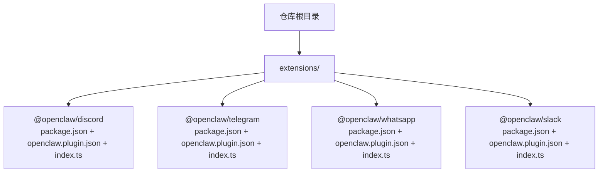
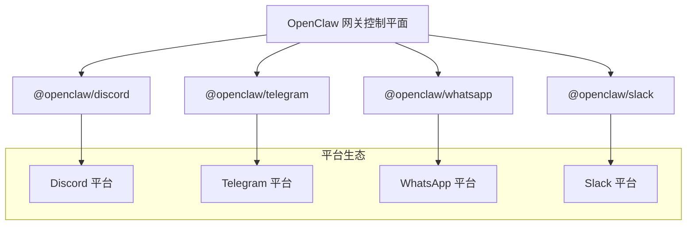
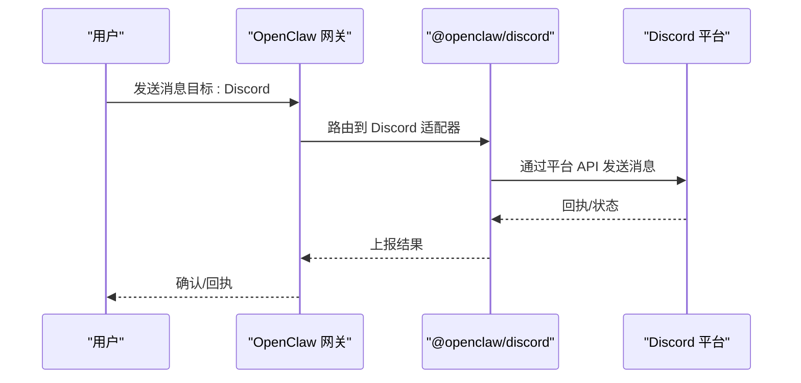
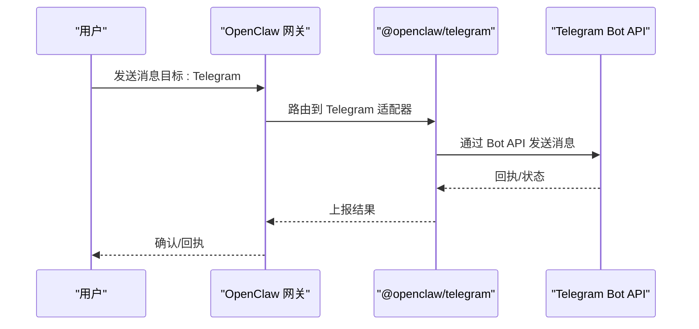
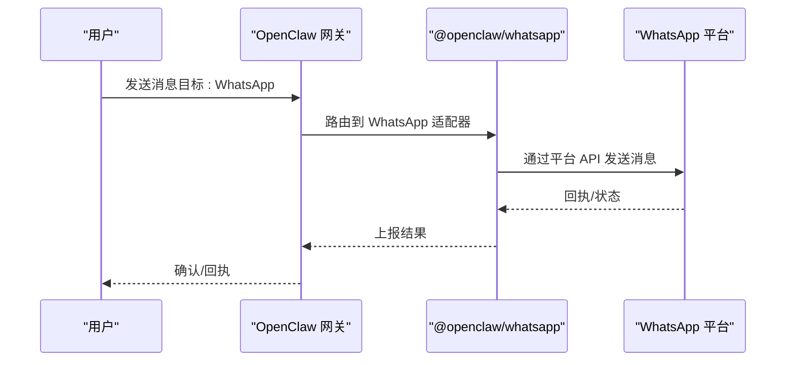
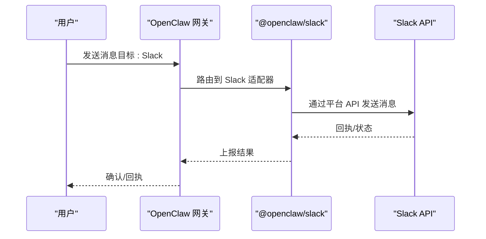
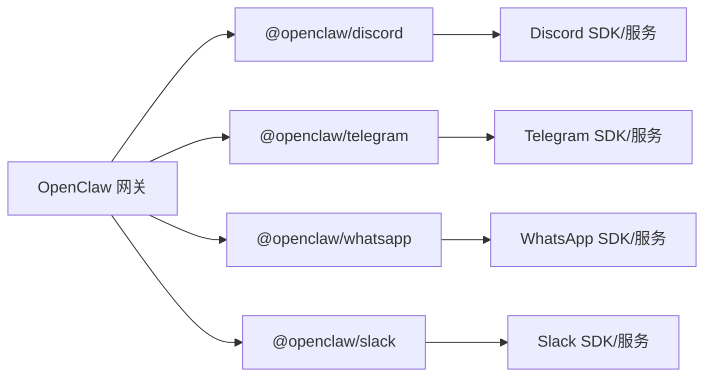

# 频道适配器插件

<cite>
**本文引用的文件**
- [README.md](file://README.md)
- [package.json](file://package.json)
- [extensions/discord/package.json](file://extensions/discord/package.json)
- [extensions/discord/openclaw.plugin.json](file://extensions/discord/openclaw.plugin.json)
- [extensions/discord/index.ts](file://extensions/discord/index.ts)
- [extensions/telegram/package.json](file://extensions/telegram/package.json)
- [extensions/telegram/openclaw.plugin.json](file://extensions/telegram/openclaw.plugin.json)
- [extensions/telegram/index.ts](file://extensions/telegram/index.ts)
- [extensions/whatsapp/package.json](file://extensions/whatsapp/package.json)
- [extensions/whatsapp/openclaw.plugin.json](file://extensions/whatsapp/openclaw.plugin.json)
- [extensions/whatsapp/index.ts](file://extensions/whatsapp/index.ts)
- [extensions/slack/package.json](file://extensions/slack/package.json)
- [extensions/slack/openclaw.plugin.json](file://extensions/slack/openclaw.plugin.json)
- [extensions/slack/index.ts](file://extensions/slack/index.ts)
</cite>

## 目录

1. [简介](#简介)
2. [项目结构](#项目结构)
3. [核心组件](#核心组件)
4. [架构总览](#架构总览)
5. [详细组件分析](#详细组件分析)
6. [依赖分析](#依赖分析)
7. [性能考虑](#性能考虑)
8. [故障排除指南](#故障排除指南)
9. [结论](#结论)
10. [附录](#附录)

## 简介

本文件面向使用者与维护者，系统化介绍 OpenClaw 的“频道适配器插件”（Channel Adapter Plugins）体系，重点覆盖以下主流即时通讯平台插件：Discord、Telegram、WhatsApp、Slack。内容涵盖：

- 插件功能与职责边界
- 安装与配置流程
- 认证与密钥管理
- 使用场景与最佳实践
- 生命周期管理、消息路由机制与错误处理策略
- 插件间协作关系与依赖说明
- 故障排除与运维建议

OpenClaw 将“网关（Gateway）”作为统一控制平面，各频道插件通过标准化接口接入，实现跨平台的消息收发、会话路由与安全策略执行。

章节来源

- [README.md](file://README.md#L1-L556)

## 项目结构

OpenClaw 采用多包/多扩展的组织方式，频道插件以独立扩展包形式存在，位于 extensions 目录下。每个频道插件通常包含：

- package.json：声明插件名称、版本与入口文件
- openclaw.plugin.json：定义插件标识、支持的频道类型与配置模式
- index.ts：插件入口与适配器实现

图表来源

- [extensions/discord/package.json](file://extensions/discord/package.json#L1-L12)
- [extensions/telegram/package.json](file://extensions/telegram/package.json#L1-L13)
- [extensions/whatsapp/package.json](file://extensions/whatsapp/package.json#L1-L13)
- [extensions/slack/package.json](file://extensions/slack/package.json#L1-L13)

章节来源

- [extensions/discord/package.json](file://extensions/discord/package.json#L1-L12)
- [extensions/telegram/package.json](file://extensions/telegram/package.json#L1-L13)
- [extensions/whatsapp/package.json](file://extensions/whatsapp/package.json#L1-L13)
- [extensions/slack/package.json](file://extensions/slack/package.json#L1-L13)

## 核心组件

- 插件标识与频道映射
  - 每个频道插件在 openclaw.plugin.json 中声明其唯一 id 与支持的 channels 列表，用于网关识别与路由。
- 配置模式
  - configSchema 定义了该插件的配置约束（如是否允许额外属性、必需字段等）。当前四个频道插件的配置模式均为空对象，表示默认无强制配置项。
- 入口文件
  - index.ts 为插件入口，负责初始化适配器、注册事件监听、建立与平台的连接、处理消息发送与接收等。

章节来源

- [extensions/discord/openclaw.plugin.json](file://extensions/discord/openclaw.plugin.json#L1-L10)
- [extensions/telegram/openclaw.plugin.json](file://extensions/telegram/openclaw.plugin.json#L1-L10)
- [extensions/whatsapp/openclaw.plugin.json](file://extensions/whatsapp/openclaw.plugin.json#L1-L10)
- [extensions/slack/openclaw.plugin.json](file://extensions/slack/openclaw.plugin.json#L1-L10)

## 架构总览

OpenClaw 的频道插件遵循统一的适配器模式：网关通过通道抽象与各插件交互，插件负责具体平台协议对接与消息编解码。

图表来源

- [extensions/discord/index.ts](file://extensions/discord/index.ts)
- [extensions/telegram/index.ts](file://extensions/telegram/index.ts)
- [extensions/whatsapp/index.ts](file://extensions/whatsapp/index.ts)
- [extensions/slack/index.ts](file://extensions/slack/index.ts)

## 详细组件分析

### Discord 频道插件

- 插件标识与频道
  - id: "discord"
  - channels: ["discord"]
- 配置模式
  - configSchema 为空对象，表示默认无强制配置项
- 入口文件
  - index.ts 为插件入口，负责初始化与 Discord 平台的连接、消息路由与事件处理

图表来源

- [extensions/discord/index.ts](file://extensions/discord/index.ts)
- [extensions/discord/openclaw.plugin.json](file://extensions/discord/openclaw.plugin.json#L1-L10)

章节来源

- [extensions/discord/package.json](file://extensions/discord/package.json#L1-L12)
- [extensions/discord/openclaw.plugin.json](file://extensions/discord/openclaw.plugin.json#L1-L10)

### Telegram 频道插件

- 插件标识与频道
  - id: "telegram"
  - channels: ["telegram"]
- 配置模式
  - configSchema 为空对象，表示默认无强制配置项
- 入口文件
  - index.ts 为插件入口，负责初始化与 Telegram Bot API 的连接、消息路由与事件处理

图表来源

- [extensions/telegram/index.ts](file://extensions/telegram/index.ts)
- [extensions/telegram/openclaw.plugin.json](file://extensions/telegram/openclaw.plugin.json#L1-L10)

章节来源

- [extensions/telegram/package.json](file://extensions/telegram/package.json#L1-L13)
- [extensions/telegram/openclaw.plugin.json](file://extensions/telegram/openclaw.plugin.json#L1-L10)

### WhatsApp 频道插件

- 插件标识与频道
  - id: "whatsapp"
  - channels: ["whatsapp"]
- 配置模式
  - configSchema 为空对象，表示默认无强制配置项
- 入口文件
  - index.ts 为插件入口，负责初始化与 WhatsApp 平台的连接、消息路由与事件处理

图表来源

- [extensions/whatsapp/index.ts](file://extensions/whatsapp/index.ts)
- [extensions/whatsapp/openclaw.plugin.json](file://extensions/whatsapp/openclaw.plugin.json#L1-L10)

章节来源

- [extensions/whatsapp/package.json](file://extensions/whatsapp/package.json#L1-L13)
- [extensions/whatsapp/openclaw.plugin.json](file://extensions/whatsapp/openclaw.plugin.json#L1-L10)

### Slack 频道插件

- 插件标识与频道
  - id: "slack"
  - channels: ["slack"]
- 配置模式
  - configSchema 为空对象，表示默认无强制配置项
- 入口文件
  - index.ts 为插件入口，负责初始化与 Slack 平台的连接、消息路由与事件处理

图表来源

- [extensions/slack/index.ts](file://extensions/slack/index.ts)
- [extensions/slack/openclaw.plugin.json](file://extensions/slack/openclaw.plugin.json#L1-L10)

章节来源

- [extensions/slack/package.json](file://extensions/slack/package.json#L1-L13)
- [extensions/slack/openclaw.plugin.json](file://extensions/slack/openclaw.plugin.json#L1-L10)

## 依赖分析

- 插件内聚性
  - 各频道插件保持高内聚、低耦合，仅暴露必要的入口与配置模式，便于独立演进与替换。
- 对平台 SDK/服务的依赖
  - 插件通过各自平台的官方或社区 SDK 进行通信；具体 SDK 选择与版本不在本仓库中直接体现，需参考各插件源码与平台文档。
- 对网关的依赖
  - 所有插件均依赖网关提供的通道抽象与控制平面能力（如会话、路由、安全策略等），确保一致的行为与可观测性。

图表来源

- [extensions/discord/index.ts](file://extensions/discord/index.ts)
- [extensions/telegram/index.ts](file://extensions/telegram/index.ts)
- [extensions/whatsapp/index.ts](file://extensions/whatsapp/index.ts)
- [extensions/slack/index.ts](file://extensions/slack/index.ts)

## 性能考虑

- 连接池与并发
  - 建议插件内部对平台 API 调用进行连接复用与并发限制，避免触发平台速率限制。
- 消息批处理
  - 对于长文本或富媒体消息，可采用分片与合并策略减少往返次数。
- 缓存与去重
  - 在网关层面对重复消息进行去重，降低平台与插件压力。
- 超时与退避
  - 对平台调用设置合理超时与指数退避，提升稳定性与自愈能力。

## 故障排除指南

- 常见问题定位
  - 插件未加载：检查 openclaw.plugin.json 的 id 与 channels 是否正确，以及 package.json 的入口路径。
  - 配置无效：确认 configSchema 与实际配置键名一致，避免额外属性导致校验失败。
  - 认证失败：核对平台令牌/密钥是否正确、权限范围是否满足需求。
- 日志与诊断
  - 通过网关日志查看插件初始化、连接建立、消息发送与回执状态。
  - 使用网关提供的诊断工具与健康检查命令排查网络与权限问题。
- 安全与合规
  - 遵循平台的速率限制与数据保护要求，避免滥用 API。
  - 对敏感信息（令牌、密钥）进行加密存储与最小化暴露。

章节来源

- [README.md](file://README.md#L442-L478)

## 结论

OpenClaw 的频道适配器插件以标准化的方式接入 Discord、Telegram、WhatsApp、Slack 等主流平台，结合网关的统一控制平面，实现了跨平台的一致体验与可运维性。通过清晰的插件标识、配置模式与入口约定，开发者可以快速扩展新平台或定制现有插件；同时，遵循本文的安装、配置、认证、路由与故障排除建议，可显著提升系统的稳定性与安全性。

## 附录

### 安装与启用

- 通过包管理器安装对应插件包（例如 @openclaw/discord、@openclaw/telegram 等），并在网关配置中启用相应频道。
- 参考仓库根目录的安装与运行说明，确保 Node 版本与运行环境满足要求。

章节来源

- [README.md](file://README.md#L50-L111)

### 配置示例与最佳实践

- Discord
  - 在 openclaw.plugin.json 中声明 channels: ["discord"]，在网关配置中提供平台所需的令牌或凭据。
  - 建议开启速率限制与错误重试策略，确保消息可靠投递。
- Telegram
  - 在 openclaw.plugin.json 中声明 channels: ["telegram"]，在网关配置中提供 botToken。
  - 建议使用 Webhook 或长轮询模式，并配置合适的并发与超时。
- WhatsApp
  - 在 openclaw.plugin.json 中声明 channels: ["whatsapp"]，在网关配置中提供平台所需的令牌或凭据。
  - 注意平台对设备登录与消息格式的限制，避免触发风控。
- Slack
  - 在 openclaw.plugin.json 中声明 channels: ["slack"]，在网关配置中提供 botToken 与 appToken。
  - 建议按需启用事件订阅与权限范围，减少不必要的权限暴露。

章节来源

- [extensions/discord/openclaw.plugin.json](file://extensions/discord/openclaw.plugin.json#L1-L10)
- [extensions/telegram/openclaw.plugin.json](file://extensions/telegram/openclaw.plugin.json#L1-L10)
- [extensions/whatsapp/openclaw.plugin.json](file://extensions/whatsapp/openclaw.plugin.json#L1-L10)
- [extensions/slack/openclaw.plugin.json](file://extensions/slack/openclaw.plugin.json#L1-L10)
- [README.md](file://README.md#L340-L399)
