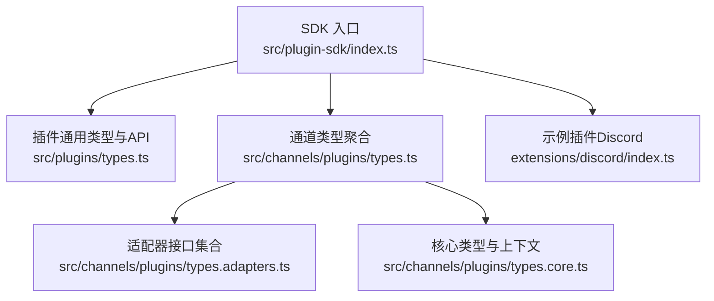
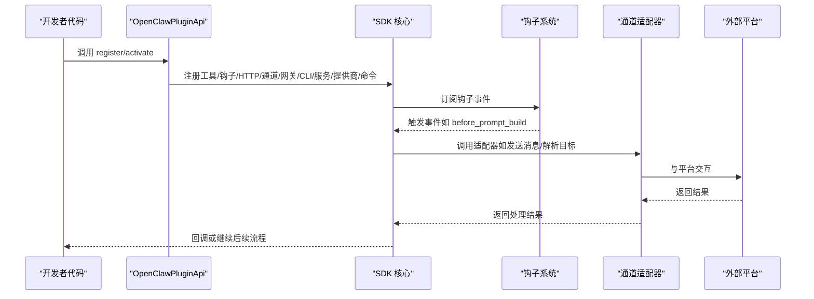
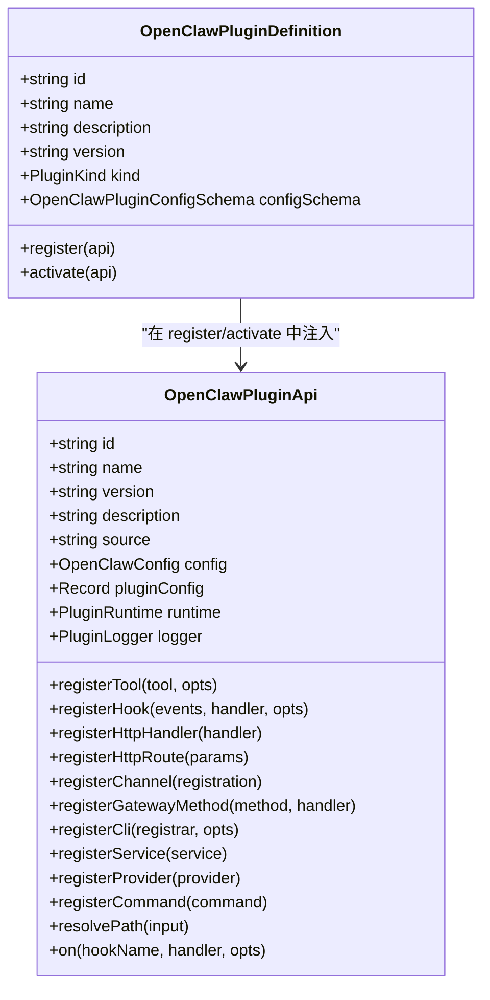
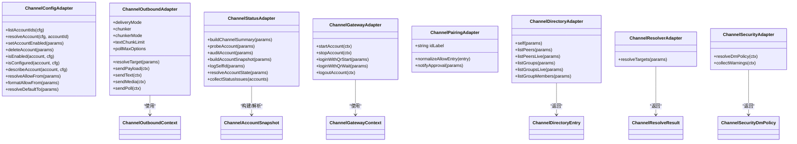
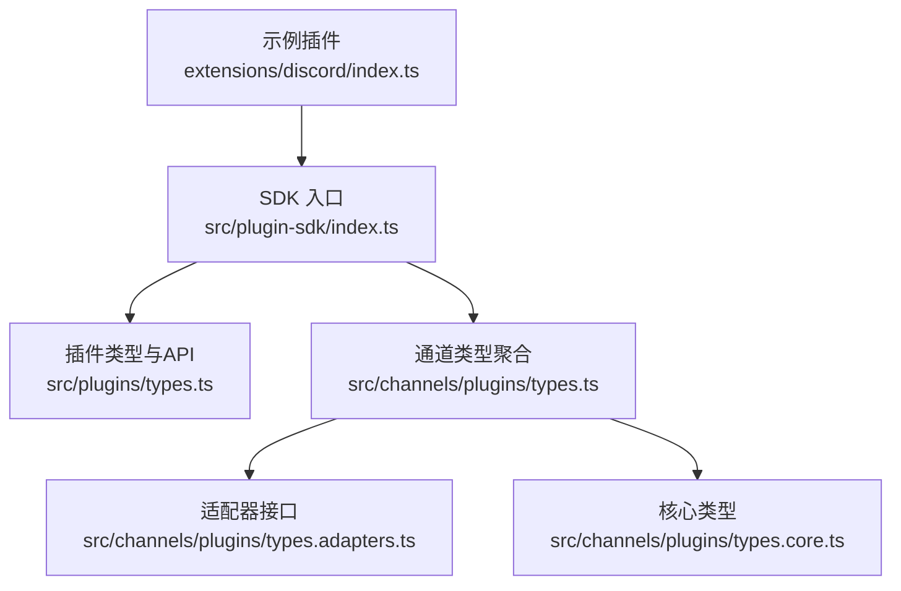
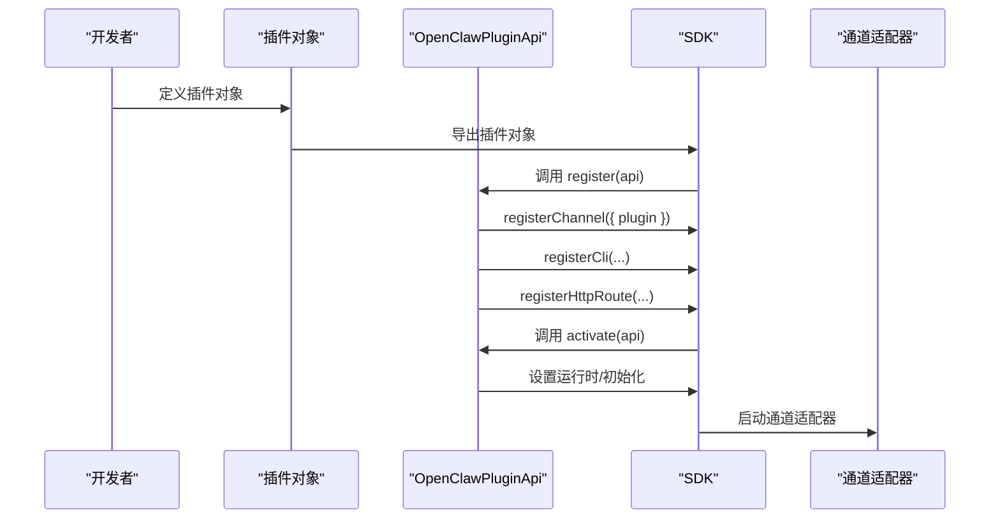

# 插件SDK基础

<cite>
**本文引用的文件**
- [src/plugin-sdk/index.ts](file://src/plugin-sdk/index.ts)
- [src/plugins/types.ts](file://src/plugins/types.ts)
- [src/channels/plugins/types.ts](file://src/channels/plugins/types.ts)
- [src/channels/plugins/types.adapters.ts](file://src/channels/plugins/types.adapters.ts)
- [src/channels/plugins/types.core.ts](file://src/channels/plugins/types.core.ts)
- [extensions/discord/index.ts](file://extensions/discord/index.ts)
</cite>

## 目录

1. [简介](#简介)
2. [项目结构](#项目结构)
3. [核心组件](#核心组件)
4. [架构总览](#架构总览)
5. [详细组件分析](#详细组件分析)
6. [依赖关系分析](#依赖关系分析)
7. [性能考量](#性能考量)
8. [故障排查指南](#故障排查指南)
9. [结论](#结论)
10. [附录：基础插件创建示例](#附录基础插件创建示例)

## 简介

本指南面向希望基于 OpenClaw Plugin SDK 开发插件的开发者，系统讲解 SDK 的核心接口、类型定义与基础 API，解释插件生命周期、注册机制与依赖注入方式，并覆盖通道适配器、工具接口、配置模式等关键主题。文档同时提供可直接参考的最小化插件示例，帮助快速上手。

## 项目结构

OpenClaw 将插件能力通过统一的 SDK 暴露，核心入口位于 plugin-sdk 目录；通道适配器与核心类型分布在 channels/plugins 下；插件通用类型与钩子定义在 plugins/types 中。下图展示了 SDK 入口与关键模块的关系：

**图表来源**

- [src/plugin-sdk/index.ts](file://src/plugin-sdk/index.ts#L1-L597)
- [src/plugins/types.ts](file://src/plugins/types.ts#L1-L764)
- [src/channels/plugins/types.ts](file://src/channels/plugins/types.ts#L1-L66)
- [src/channels/plugins/types.adapters.ts](file://src/channels/plugins/types.adapters.ts#L1-L320)
- [src/channels/plugins/types.core.ts](file://src/channels/plugins/types.core.ts#L1-L372)
- [extensions/discord/index.ts](file://extensions/discord/index.ts#L1-L20)

**章节来源**

- [src/plugin-sdk/index.ts](file://src/plugin-sdk/index.ts#L1-L597)

## 核心组件

本节概述 SDK 提供的关键能力与类型，帮助你理解插件开发的“骨架”和“接口”。

- 插件定义与生命周期
  - 插件定义对象包含标识、名称、描述、版本、配置模式以及生命周期回调（register/activate）。生命周期回调中传入 OpenClawPluginApi，用于注册各类扩展点。
  - 参考路径：[插件定义与生命周期类型](file://src/plugins/types.ts#L230-L239)

- 插件 API（OpenClawPluginApi）
  - 提供注册工具、钩子、HTTP 处理器/路由、通道适配器、网关方法、CLI、服务、提供商与命令的能力。
  - 参考路径：[插件 API 类型定义](file://src/plugins/types.ts#L245-L284)

- 钩子系统（Plugin Hooks）
  - SDK 定义了丰富的钩子事件（如 before*model_resolve、before_prompt_build、message_sending、tool_result_persist、session_start/end、subagent*_、gateway\__ 等），支持在代理运行时的多个阶段进行拦截与增强。
  - 参考路径：[钩子名称与事件类型](file://src/plugins/types.ts#L299-L755)

- 通道适配器（Channel Adapters）
  - 通道适配器是连接具体消息平台（如 Discord、Slack、Telegram 等）的桥梁，涵盖配置、认证、群组策略、消息收发、状态检查、网关启动/停止、目录查询、解析与安全策略等。
  - 参考路径：[适配器接口集合](file://src/channels/plugins/types.adapters.ts#L23-L320)

- 核心类型与上下文
  - 包含账户快照、能力声明、线程上下文、消息动作、投票、探针结果等基础数据结构，为适配器实现提供一致的契约。
  - 参考路径：[核心类型与上下文](file://src/channels/plugins/types.core.ts#L1-L372)

- 配置模式与 Schema
  - SDK 提供空配置模式与多种 Zod Schema，便于插件声明自身配置项并进行校验与 UI 呈现提示。
  - 参考路径：[配置模式与 Schema](file://src/plugin-sdk/index.ts#L114-L199)

**章节来源**

- [src/plugins/types.ts](file://src/plugins/types.ts#L230-L284)
- [src/channels/plugins/types.adapters.ts](file://src/channels/plugins/types.adapters.ts#L23-L320)
- [src/channels/plugins/types.core.ts](file://src/channels/plugins/types.core.ts#L1-L372)
- [src/plugin-sdk/index.ts](file://src/plugin-sdk/index.ts#L114-L199)

## 架构总览

下图展示了插件在运行时的典型交互流程：插件通过 OpenClawPluginApi 注册扩展点，SDK 在代理运行时按钩子顺序触发，通道适配器负责与具体平台对接，最终完成消息的收发与状态管理。

**图表来源**

- [src/plugins/types.ts](file://src/plugins/types.ts#L245-L284)
- [src/channels/plugins/types.adapters.ts](file://src/channels/plugins/types.adapters.ts#L106-L123)

## 详细组件分析

### 组件A：插件定义与注册机制

- 插件定义对象（OpenClawPluginDefinition）
  - 字段：id、name、description、version、kind、configSchema、register、activate。
  - register/activate：在加载时由 SDK 调用，传入 OpenClawPluginApi，用于注册各类扩展点。
  - 参考路径：[插件定义类型](file://src/plugins/types.ts#L230-L239)

- OpenClawPluginApi
  - 工具注册：registerTool（支持工厂函数与直接工具）
  - 钩子注册：registerHook（内部钩子）、on（生命周期钩子）
  - HTTP 注册：registerHttpHandler、registerHttpRoute
  - 通道注册：registerChannel（支持 ChannelPlugin 或组合对象）
  - 网关方法：registerGatewayMethod
  - CLI 注册：registerCli
  - 服务注册：registerService
  - 提供商注册：registerProvider
  - 自定义命令：registerCommand（绕过 LLM 的简单命令）
  - 路径解析：resolvePath
  - 参考路径：[API 类型定义](file://src/plugins/types.ts#L245-L284)

- 依赖注入
  - register/activate 中注入的 OpenClawPluginApi 即为依赖注入的载体，插件通过该对象访问配置、运行时、日志、路径解析等能力。
  - 参考路径：[API 使用示例（Discord 插件）](file://extensions/discord/index.ts#L12-L16)

**图表来源**

- [src/plugins/types.ts](file://src/plugins/types.ts#L230-L284)
- [extensions/discord/index.ts](file://extensions/discord/index.ts#L7-L17)

**章节来源**

- [src/plugins/types.ts](file://src/plugins/types.ts#L230-L284)
- [extensions/discord/index.ts](file://extensions/discord/index.ts#L7-L17)

### 组件B：通道适配器（Channel Adapters）

通道适配器是连接具体消息平台的适配层，统一抽象配置、认证、群组策略、消息收发、状态检查、网关启动/停止、目录查询、解析与安全策略等。

- 关键适配器接口
  - ChannelConfigAdapter：账户列表、解析、启用/禁用、删除、配置校验、允许来源解析与格式化、默认 to 解析等。
  - ChannelOutboundAdapter：投递模式（direct/gateway/hybrid）、文本/媒体/轮询发送、目标解析、分片策略等。
  - ChannelStatusAdapter：账户摘要构建、探针、审计、快照构建、状态问题收集、运行态状态解析等。
  - ChannelGatewayAdapter：账户启动/停止、二维码登录、登出。
  - ChannelPairingAdapter：配对标识、允许来源条目规范化、批准通知。
  - ChannelDirectoryAdapter：自、成员、群组、用户列表查询。
  - ChannelResolverAdapter：目标解析（用户/群组）。
  - ChannelSecurityAdapter：DM 策略解析、警告收集。
  - 参考路径：[适配器接口集合](file://src/channels/plugins/types.adapters.ts#L23-L320)

- 核心上下文与类型
  - ChannelOutboundContext/PayloadContext、ChannelGroupContext、ChannelThreadingContext/ToolContext、ChannelMessageActionContext、ChannelPollContext 等。
  - 参考路径：[核心类型与上下文](file://src/channels/plugins/types.core.ts#L87-L372)

**图表来源**

- [src/channels/plugins/types.adapters.ts](file://src/channels/plugins/types.adapters.ts#L23-L320)
- [src/channels/plugins/types.core.ts](file://src/channels/plugins/types.core.ts#L87-L372)

**章节来源**

- [src/channels/plugins/types.adapters.ts](file://src/channels/plugins/types.adapters.ts#L23-L320)
- [src/channels/plugins/types.core.ts](file://src/channels/plugins/types.core.ts#L87-L372)

### 组件C：钩子系统（Hook System）

SDK 提供横切代理运行时的钩子体系，覆盖模型选择、提示构建、代理执行、消息收发、工具调用、会话生命周期、子代理生命周期、网关启停等多个阶段。

- 钩子事件与结果
  - before_model_resolve / before_prompt_build / before_agent_start：可覆盖模型/提供方、系统提示、上下文拼接。
  - llm_input / llm_output：可观测与记录推理输入输出。
  - agent_end：代理结束后的汇总信息。
  - before_compaction / after_compaction：会话压缩前后处理。
  - before_reset：会话清理前。
  - message_received / message_sending / message_sent：消息生命周期。
  - before_tool_call / after_tool_call / tool_result_persist：工具调用前后与持久化。
  - before_message_write：消息写入前拦截。
  - session_start / session_end：会话开始/结束。
  - subagent_spawning / subagent_delivery_target / subagent_spawned / subagent_ended：子代理生命周期。
  - gateway_start / gateway_stop：网关启停。
  - 参考路径：[钩子事件与结果类型](file://src/plugins/types.ts#L334-L755)

```mermaid
flowchart TD
Start(["代理运行开始"]) --> BeforeModel["before_model_resolve"]
BeforeModel --> BeforePrompt["before_prompt_build"]
BeforePrompt --> AgentStart["before_agent_start"]
AgentStart --> LlmInput["llm_input"]
LlmInput --> LlmOutput["llm_output"]
LlmOutput --> AgentEnd["agent_end"]
AgentEnd --> Compaction["before_compaction"]
Compaction --> AfterCompaction["after_compaction"]
AfterCompaction --> Reset["before_reset"]
Reset --> MessageReceived["message_received"]
MessageReceived --> MessageSending["message_sending"]
MessageSending --> MessageSent["message_sent"]
MessageSent --> ToolBefore["before_tool_call"]
ToolBefore --> ToolAfter["after_tool_call"]
ToolAfter --> Persist["tool_result_persist"]
Persist --> Write["before_message_write"]
Write --> SessionStart["session_start"]
SessionStart --> SessionEnd["session_end"]
SessionEnd --> SubagentSpawning["subagent_spawning"]
SubagentSpawning --> SubagentDelivery["subagent_delivery_target"]
SubagentDelivery --> SubagentSpawned["subagent_spawned"]
SubagentSpawned --> SubagentEnded["subagent_ended"]
SubagentEnded --> GatewayStart["gateway_start"]
GatewayStart --> GatewayStop["gateway_stop"]
GatewayStop --> End(["结束"])
```

**图表来源**

- [src/plugins/types.ts](file://src/plugins/types.ts#L299-L755)

**章节来源**

- [src/plugins/types.ts](file://src/plugins/types.ts#L299-L755)

### 组件D：配置模式与 Schema

- 空配置模式：emptyPluginConfigSchema，适合无需额外配置的插件。
- Zod Schema：提供各通道与核心功能的配置校验与 UI 提示，便于统一配置体验。
- 参考路径：[配置模式与 Schema](file://src/plugin-sdk/index.ts#L114-L199)

**章节来源**

- [src/plugin-sdk/index.ts](file://src/plugin-sdk/index.ts#L114-L199)

## 依赖关系分析

SDK 通过统一入口导出所有公共 API，插件通过 OpenClawPluginApi 获取运行时依赖；通道适配器作为平台对接层被注册到 SDK，再由 SDK 在运行时按需调用。

**图表来源**

- [src/plugin-sdk/index.ts](file://src/plugin-sdk/index.ts#L1-L597)
- [src/plugins/types.ts](file://src/plugins/types.ts#L1-L764)
- [src/channels/plugins/types.ts](file://src/channels/plugins/types.ts#L1-L66)
- [src/channels/plugins/types.adapters.ts](file://src/channels/plugins/types.adapters.ts#L1-L320)
- [src/channels/plugins/types.core.ts](file://src/channels/plugins/types.core.ts#L1-L372)
- [extensions/discord/index.ts](file://extensions/discord/index.ts#L1-L20)

**章节来源**

- [src/plugin-sdk/index.ts](file://src/plugin-sdk/index.ts#L1-L597)
- [src/plugins/types.ts](file://src/plugins/types.ts#L1-L764)
- [src/channels/plugins/types.ts](file://src/channels/plugins/types.ts#L1-L66)
- [src/channels/plugins/types.adapters.ts](file://src/channels/plugins/types.adapters.ts#L1-L320)
- [src/channels/plugins/types.core.ts](file://src/channels/plugins/types.core.ts#L1-L372)
- [extensions/discord/index.ts](file://extensions/discord/index.ts#L1-L20)

## 性能考量

- 分片与限流：通道适配器支持文本分片与轮询发送，避免单次超长消息导致失败或限流。
- 会话压缩：在 before_compaction/after_compaction 阶段异步处理历史消息，减少阻塞。
- 工具调用拦截：before_tool_call 可以提前校验参数与权限，避免无效调用带来的资源浪费。
- 网关启停：gateway_start/stop 钩子可用于资源分配与回收，降低常驻开销。
- 日志与诊断：通过 registerLogTransport 与诊断事件，定位性能瓶颈与异常路径。

[本节为通用指导，不直接分析特定文件]

## 故障排查指南

- 配置校验失败：使用 OpenClawPluginConfigSchema.safeParse/parse/validate，结合 uiHints/jsonSchema 提升用户体验。
- 状态问题收集：利用 ChannelStatusAdapter.collectStatusIssues 输出可操作的修复建议。
- SSRF/私有地址防护：使用 fetchWithSsrFGuard 与 isBlockedHostname/isPrivateIpAddress 等策略，避免内网探测风险。
- 请求体限制：installRequestBodyLimitGuard/readJsonBodyWithLimit 等工具防止过大请求导致内存压力。
- 错误信息格式化：formatErrorMessage 统一错误呈现，便于日志与诊断。
- 参考路径：
  - [配置模式与 Schema](file://src/plugin-sdk/index.ts#L114-L199)
  - [SSRF 与请求体限制](file://src/plugin-sdk/index.ts#L279-L296)
  - [状态适配器与问题收集](file://src/channels/plugins/types.adapters.ts#L125-L164)

**章节来源**

- [src/plugin-sdk/index.ts](file://src/plugin-sdk/index.ts#L114-L199)
- [src/plugin-sdk/index.ts](file://src/plugin-sdk/index.ts#L279-L296)
- [src/channels/plugins/types.adapters.ts](file://src/channels/plugins/types.adapters.ts#L125-L164)

## 结论

OpenClaw Plugin SDK 通过统一的插件定义与 OpenClawPluginApi，提供了从工具、钩子、HTTP、通道、网关、CLI、服务到提供商与命令的全栈扩展能力。通道适配器将平台差异抽象为一致的契约，配合钩子系统可在代理运行时的多个阶段进行可控增强。借助配置模式与安全工具，插件开发既灵活又稳健。

[本节为总结性内容，不直接分析特定文件]

## 附录：基础插件创建示例

以下示例展示如何使用 SDK 接口构建一个最简插件，注册通道适配器并设置运行时能力。

- 示例步骤
  - 定义插件对象（id/name/description/configSchema/register/activate）
  - 在 register 中调用 api.registerChannel 注册通道插件
  - 在 register 中调用 api.registerCli/api.registerHttpRoute 等注册扩展点
  - 在 activate 中进行初始化（如设置运行时）
  - 参考路径：[Discord 插件示例](file://extensions/discord/index.ts#L7-L17)

- 关键 API 调用
  - 注册通道：api.registerChannel({ plugin: discordPlugin })
  - 注册 CLI：api.registerCli(...)
  - 注册 HTTP 路由：api.registerHttpRoute({ path, handler })
  - 设置运行时：setDiscordRuntime(api.runtime)
  - 参考路径：[API 类型定义](file://src/plugins/types.ts#L245-L284)

**图表来源**

- [extensions/discord/index.ts](file://extensions/discord/index.ts#L7-L17)
- [src/plugins/types.ts](file://src/plugins/types.ts#L245-L284)

**章节来源**

- [extensions/discord/index.ts](file://extensions/discord/index.ts#L7-L17)
- [src/plugins/types.ts](file://src/plugins/types.ts#L245-L284)
