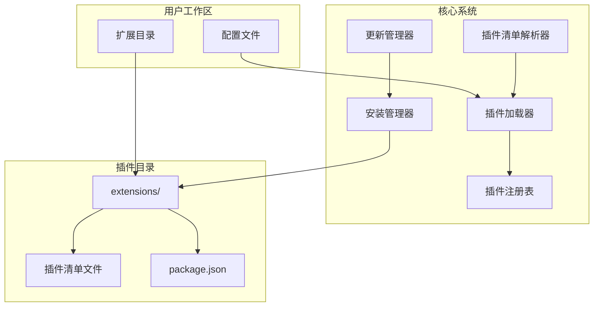
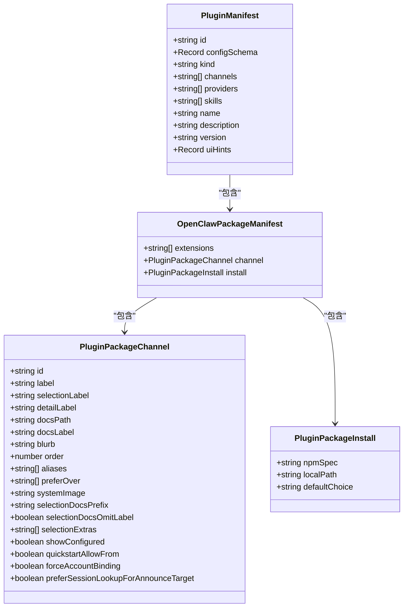
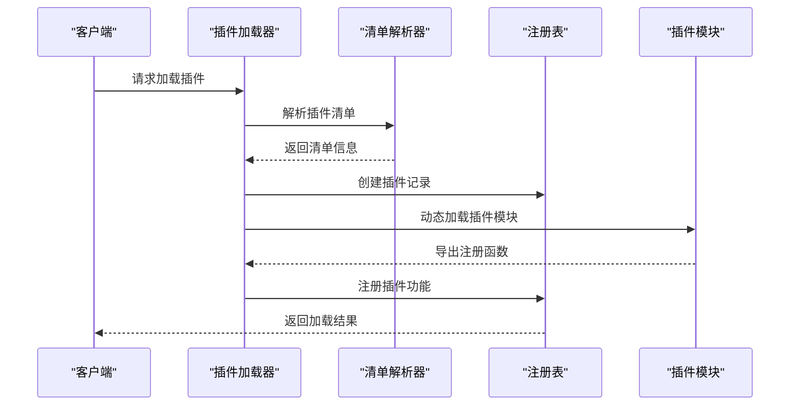
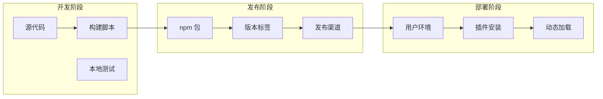
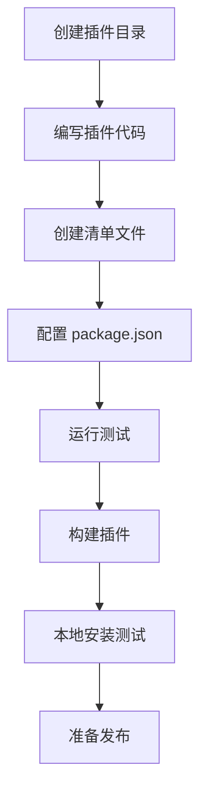
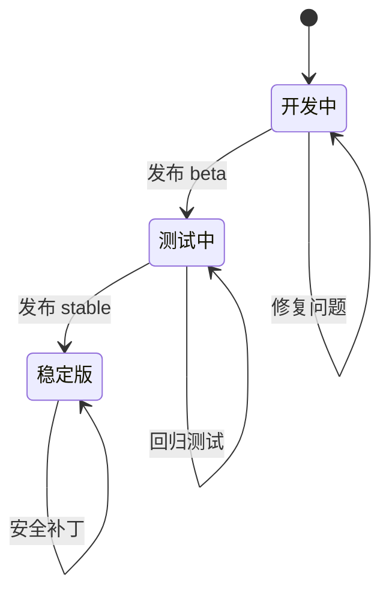
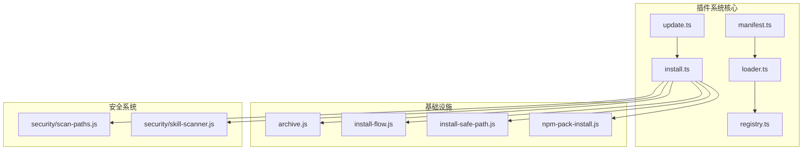

# 插件发布与分发

<cite>
**本文档引用的文件**
- [package.json](file://package.json)
- [README.md](file://README.md)
- [src/plugins/manifest.ts](file://src/plugins/manifest.ts)
- [src/plugins/loader.ts](file://src/plugins/loader.ts)
- [src/plugins/registry.ts](file://src/plugins/registry.ts)
- [src/plugins/install.ts](file://src/plugins/install.ts)
- [src/plugins/update.ts](file://src/plugins/update.ts)
- [extensions/*/openclaw.plugin.json](file://extensions/acpx/openclaw.plugin.json)
- [extensions/*/package.json](file://extensions/acpx/package.json)
</cite>

## 目录

1. [简介](#简介)
2. [项目结构](#项目结构)
3. [核心组件](#核心组件)
4. [架构概览](#架构概览)
5. [详细组件分析](#详细组件分析)
6. [依赖关系分析](#依赖关系分析)
7. [性能考虑](#性能考虑)
8. [故障排除指南](#故障排除指南)
9. [结论](#结论)
10. [附录](#附录)

## 简介

OpenClaw 是一个可扩展的多渠道 AI 助手平台，支持通过插件系统进行功能扩展。本指南详细说明了插件的发布与分发流程，包括打包、版本管理、npm 包创建与发布、插件清单文件编写规范、版本控制策略、兼容性管理、最佳实践以及更新机制。

## 项目结构

OpenClaw 的插件系统主要由以下部分组成：



**图表来源**

- [src/plugins/manifest.ts](file://src/plugins/manifest.ts#L1-L167)
- [src/plugins/loader.ts](file://src/plugins/loader.ts#L1-L726)
- [src/plugins/registry.ts](file://src/plugins/registry.ts#L1-L520)

**章节来源**

- [src/plugins/manifest.ts](file://src/plugins/manifest.ts#L1-L167)
- [src/plugins/loader.ts](file://src/plugins/loader.ts#L1-L726)
- [src/plugins/registry.ts](file://src/plugins/registry.ts#L1-L520)

## 核心组件

### 插件清单系统

插件清单是插件发布的基础，定义了插件的基本信息、配置模式和元数据。



**图表来源**

- [src/plugins/manifest.ts](file://src/plugins/manifest.ts#L11-L167)

### 插件加载系统

插件加载器负责发现、验证和加载插件模块。



**图表来源**

- [src/plugins/loader.ts](file://src/plugins/loader.ts#L368-L717)
- [src/plugins/registry.ts](file://src/plugins/registry.ts#L164-L519)

**章节来源**

- [src/plugins/manifest.ts](file://src/plugins/manifest.ts#L1-L167)
- [src/plugins/loader.ts](file://src/plugins/loader.ts#L1-L726)
- [src/plugins/registry.ts](file://src/plugins/registry.ts#L1-L520)

## 架构概览

OpenClaw 的插件系统采用模块化设计，支持多种安装方式和更新策略：



**图表来源**

- [package.json](file://package.json#L49-L150)
- [src/plugins/install.ts](file://src/plugins/install.ts#L400-L490)
- [src/plugins/update.ts](file://src/plugins/update.ts#L158-L345)

## 详细组件分析

### 插件清单文件编写规范

每个插件必须包含标准的清单文件和 package.json 配置：

#### 基础清单文件结构

| 字段         | 类型   | 必需 | 描述                   |
| ------------ | ------ | ---- | ---------------------- |
| id           | string | 是   | 插件唯一标识符         |
| configSchema | object | 是   | 插件配置的 JSON Schema |
| kind         | string | 否   | 插件类型（如 memory）  |
| name         | string | 否   | 插件显示名称           |
| description  | string | 否   | 插件描述               |
| version      | string | 否   | 插件版本号             |
| channels     | array  | 否   | 支持的频道列表         |
| providers    | array  | 否   | 提供者列表             |
| skills       | array  | 否   | 技能列表               |

#### npm 包配置要求

插件的 package.json 必须包含特定的元数据字段：

```json
{
  "name": "@openclaw/plugin-example",
  "version": "1.0.0",
  "description": "示例插件",
  "main": "dist/index.js",
  "exports": {
    ".": "./dist/index.js",
    "./plugin-sdk": "./dist/plugin-sdk/index.js"
  },
  "openclaw": {
    "extensions": ["src/index.ts"],
    "install": {
      "npmSpec": "@openclaw/plugin-example@^1.0.0"
    }
  }
}
```

**章节来源**

- [src/plugins/manifest.ts](file://src/plugins/manifest.ts#L11-L167)
- [extensions/acpx/openclaw.plugin.json](file://extensions/acpx/openclaw.plugin.json)
- [extensions/acpx/package.json](file://extensions/acpx/package.json)

### 安装与发布流程

#### 本地开发与测试



**图表来源**

- [src/plugins/install.ts](file://src/plugins/install.ts#L122-L292)

#### npm 包发布步骤

1. **版本管理**：遵循语义化版本控制
2. **构建优化**：使用 TypeScript 编译和打包
3. **安全检查**：代码扫描和依赖审计
4. **包上传**：发布到 npm 仓库
5. **渠道同步**：更新插件渠道配置

**章节来源**

- [src/plugins/install.ts](file://src/plugins/install.ts#L400-L490)
- [src/plugins/update.ts](file://src/plugins/update.ts#L158-L345)

### 版本控制策略

OpenClaw 采用多渠道版本管理策略：

| 渠道   | 标签   | 版本格式         | 用途         |
| ------ | ------ | ---------------- | ------------ |
| 稳定版 | latest | vYYYY.M.D        | 生产环境推荐 |
| 测试版 | beta   | vYYYY.M.D-beta.N | 预发布测试   |
| 开发版 | dev    | 移动头           | 开发调试     |



**图表来源**

- [README.md](file://README.md#L83-L90)

**章节来源**

- [README.md](file://README.md#L83-L90)

### 兼容性管理

插件系统通过多种机制确保向后兼容性：

1. **配置模式验证**：使用 JSON Schema 验证插件配置
2. **API 兼容性检查**：检测插件导出的 API 变更
3. **依赖版本锁定**：使用 npm 锁定文件确保依赖一致性
4. **安全扫描**：自动检测潜在的安全问题

**章节来源**

- [src/plugins/loader.ts](file://src/plugins/loader.ts#L106-L125)
- [src/plugins/install.ts](file://src/plugins/install.ts#L199-L221)

## 依赖关系分析



**图表来源**

- [src/plugins/manifest.ts](file://src/plugins/manifest.ts#L1-L167)
- [src/plugins/loader.ts](file://src/plugins/loader.ts#L1-L726)
- [src/plugins/install.ts](file://src/plugins/install.ts#L1-L490)

**章节来源**

- [src/plugins/manifest.ts](file://src/plugins/manifest.ts#L1-L167)
- [src/plugins/loader.ts](file://src/plugins/loader.ts#L1-L726)
- [src/plugins/install.ts](file://src/plugins/install.ts#L1-L490)

## 性能考虑

### 插件加载优化

1. **缓存机制**：插件注册表支持缓存以提高加载性能
2. **延迟加载**：非必要的插件在需要时才加载
3. **内存管理**：自动清理未使用的插件资源
4. **并发处理**：支持并行加载多个插件

### 安装性能优化

1. **增量安装**：只复制变更的文件
2. **并行下载**：同时下载多个插件包
3. **压缩传输**：使用压缩格式减少网络传输
4. **本地缓存**：缓存已下载的插件包

## 故障排除指南

### 常见问题及解决方案

| 问题类型     | 症状               | 解决方案                  |
| ------------ | ------------------ | ------------------------- |
| 插件加载失败 | 插件状态为 error   | 检查插件清单和依赖        |
| 配置验证错误 | 配置无效           | 使用 JSON Schema 验证配置 |
| 安装冲突     | 插件无法安装       | 检查插件 ID 和路径冲突    |
| 权限问题     | 插件无权限访问资源 | 检查文件权限和边界限制    |

### 调试工具

1. **日志系统**：详细的插件加载和执行日志
2. **诊断信息**：插件状态和错误详情
3. **性能监控**：插件加载时间和资源使用情况
4. **安全审计**：代码模式扫描和安全检查

**章节来源**

- [src/plugins/loader.ts](file://src/plugins/loader.ts#L187-L210)
- [src/plugins/install.ts](file://src/plugins/install.ts#L199-L221)

## 结论

OpenClaw 的插件系统提供了完整的发布与分发解决方案，包括：

1. **标准化的插件清单**：确保插件的可发现性和可管理性
2. **灵活的安装方式**：支持 npm、本地路径等多种安装方式
3. **完善的版本管理**：多渠道版本控制和向后兼容性保证
4. **安全的发布流程**：代码扫描、依赖审计和完整性校验
5. **高效的更新机制**：智能更新和渠道同步

通过遵循本指南中的最佳实践，开发者可以创建高质量的插件，并确保其在整个生态系统中的稳定运行。

## 附录

### 插件开发最佳实践

1. **清单完整性**：确保所有必需字段都正确填写
2. **配置验证**：提供完整的 JSON Schema 配置模式
3. **错误处理**：实现健壮的错误处理和恢复机制
4. **文档编写**：提供清晰的使用文档和示例
5. **测试覆盖**：编写全面的单元测试和集成测试

### 发布检查清单

- [ ] 插件清单完整且正确
- [ ] package.json 配置正确
- [ ] 所有测试通过
- [ ] 代码扫描无严重问题
- [ ] 文档更新完成
- [ ] 版本号符合语义化版本规范
- [ ] npm 包构建成功
- [ ] 插件安装测试通过
