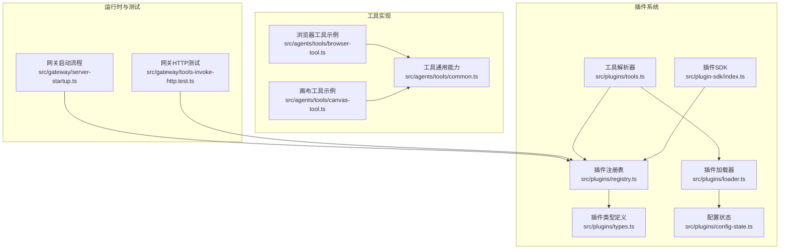
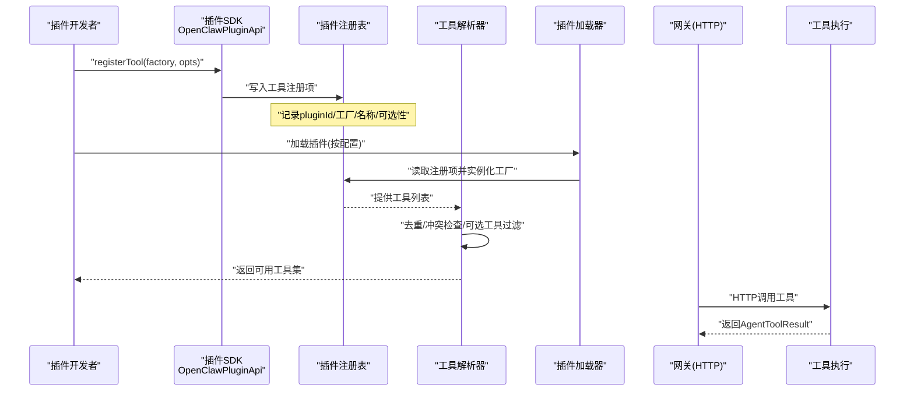
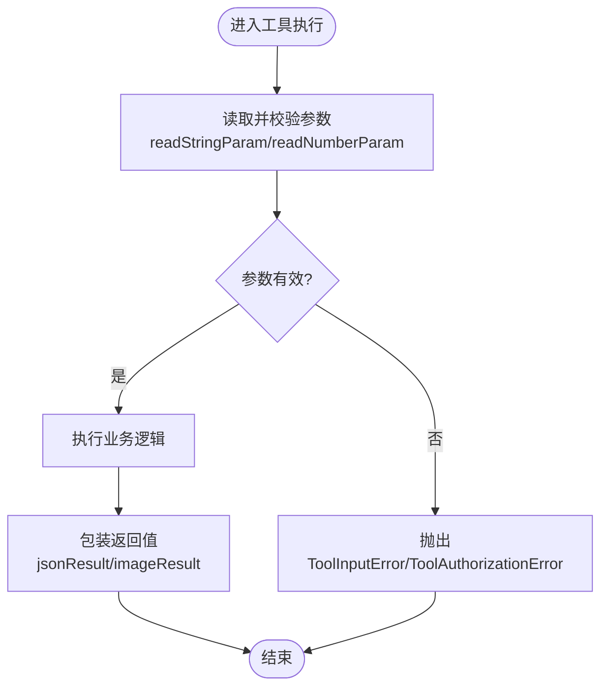
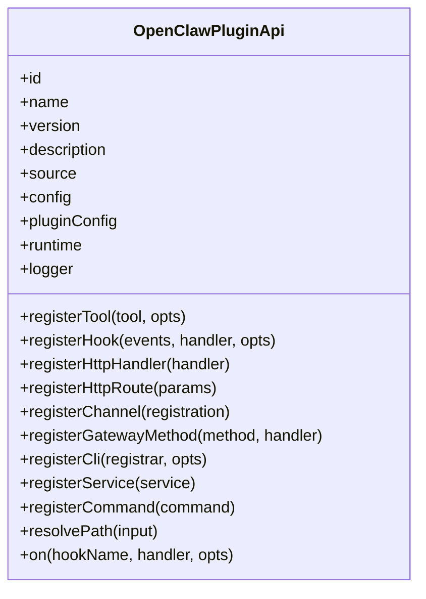
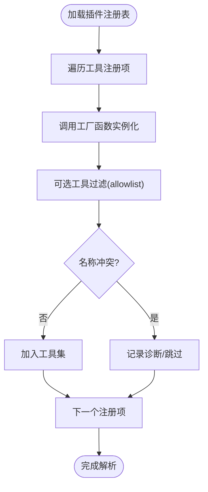
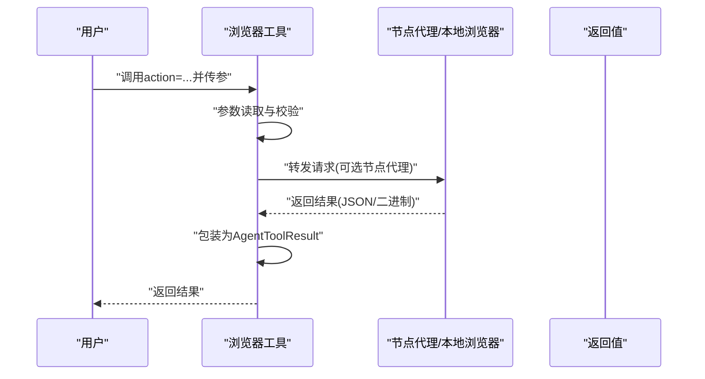
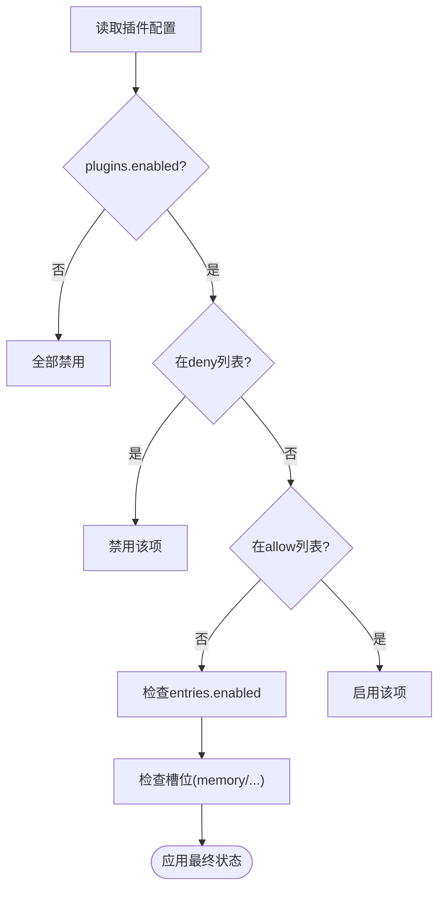
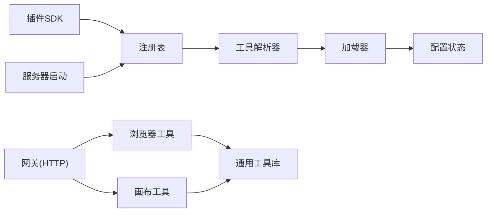

# 插件工具开发

<cite>
**本文引用的文件**
- [src/plugin-sdk/index.ts](file://src/plugin-sdk/index.ts)
- [src/plugins/types.ts](file://src/plugins/types.ts)
- [src/plugins/registry.ts](file://src/plugins/registry.ts)
- [src/plugins/tools.ts](file://src/plugins/tools.ts)
- [src/agents/tools/common.ts](file://src/agents/tools/common.ts)
- [src/plugins/loader.ts](file://src/plugins/loader.ts)
- [src/plugins/config-state.ts](file://src/plugins/config-state.ts)
- [src/gateway/tools-invoke-http.test.ts](file://src/gateway/tools-invoke-http.test.ts)
- [src/agents/tools/browser-tool.ts](file://src/agents/tools/browser-tool.ts)
- [src/agents/tools/canvas-tool.ts](file://src/agents/tools/canvas-tool.ts)
- [src/plugins/logger.ts](file://src/plugins/logger.ts)
- [src/config/config.plugin-validation.test.ts](file://src/config/config.plugin-validation.test.ts)
- [src/config/config.tools-alsoAllow.test.ts](file://src/config/config.tools-alsoAllow.test.ts)
- [src/commands/doctor-config-flow.ts](file://src/commands/doctor-config-flow.ts)
- [src/gateway/server-startup.ts](file://src/gateway/server-startup.ts)
</cite>

## 目录

1. [简介](#简介)
2. [项目结构](#项目结构)
3. [核心组件](#核心组件)
4. [架构总览](#架构总览)
5. [详细组件分析](#详细组件分析)
6. [依赖关系分析](#依赖关系分析)
7. [性能考量](#性能考量)
8. [故障排查指南](#故障排查指南)
9. [结论](#结论)
10. [附录](#附录)

## 简介

本指南面向希望在 OpenClaw 插件系统中开发与集成“自定义工具”的开发者，覆盖工具接口定义、参数校验、返回值处理、注册机制、权限控制、调用策略、安全与性能最佳实践、测试与调试方法，以及与 AI 代理的集成与交互模式。文档以仓库中的真实实现为依据，提供可操作的开发步骤与可视化图示。

## 项目结构

OpenClaw 的插件工具开发围绕以下模块协同工作：

- 插件 SDK：对外暴露统一的类型与工具入口（如工具、通道、网关方法等）。
- 插件注册表：集中管理插件的工具、钩子、HTTP 路由、命令、服务等注册项。
- 工具解析器：按配置与策略解析并加载插件工具，避免命名冲突与重复。
- 工具基类与参数读取：提供通用的参数读取、错误封装、结果格式化能力。
- 加载器与配置状态：负责插件加载、启用/禁用、槽位选择与诊断输出。
- 网关与测试：提供工具调用的 HTTP 接口与端到端测试样例。

图表来源

- [src/plugin-sdk/index.ts](file://src/plugin-sdk/index.ts#L1-L597)
- [src/plugins/registry.ts](file://src/plugins/registry.ts#L1-L520)
- [src/plugins/types.ts](file://src/plugins/types.ts#L1-L764)
- [src/plugins/tools.ts](file://src/plugins/tools.ts#L1-L140)
- [src/plugins/loader.ts](file://src/plugins/loader.ts#L666-L725)
- [src/plugins/config-state.ts](file://src/plugins/config-state.ts#L165-L196)
- [src/agents/tools/common.ts](file://src/agents/tools/common.ts#L1-L341)
- [src/agents/tools/browser-tool.ts](file://src/agents/tools/browser-tool.ts#L1-L844)
- [src/agents/tools/canvas-tool.ts](file://src/agents/tools/canvas-tool.ts#L1-L216)
- [src/gateway/tools-invoke-http.test.ts](file://src/gateway/tools-invoke-http.test.ts#L527-L549)
- [src/gateway/server-startup.ts](file://src/gateway/server-startup.ts#L153-L191)

章节来源

- [src/plugin-sdk/index.ts](file://src/plugin-sdk/index.ts#L1-L597)
- [src/plugins/registry.ts](file://src/plugins/registry.ts#L1-L520)
- [src/plugins/types.ts](file://src/plugins/types.ts#L1-L764)
- [src/plugins/tools.ts](file://src/plugins/tools.ts#L1-L140)
- [src/plugins/loader.ts](file://src/plugins/loader.ts#L666-L725)
- [src/plugins/config-state.ts](file://src/plugins/config-state.ts#L165-L196)
- [src/agents/tools/common.ts](file://src/agents/tools/common.ts#L1-L341)
- [src/agents/tools/browser-tool.ts](file://src/agents/tools/browser-tool.ts#L1-L844)
- [src/agents/tools/canvas-tool.ts](file://src/agents/tools/canvas-tool.ts#L1-L216)
- [src/gateway/tools-invoke-http.test.ts](file://src/gateway/tools-invoke-http.test.ts#L527-L549)
- [src/gateway/server-startup.ts](file://src/gateway/server-startup.ts#L153-L191)

## 核心组件

- 插件 API 与类型
  - 插件通过 OpenClawPluginApi 注册工具、钩子、HTTP 处理器、命令、服务等。
  - 工具上下文 OpenClawPluginToolContext 提供配置、工作区、会话等环境信息。
- 工具接口与参数
  - 工具需实现统一的 AgentTool 结构；参数读取使用 readStringParam/readNumberParam 等工具函数。
  - 返回值统一包装为 AgentToolResult，支持文本与图片等多模态内容。
- 注册表与解析
  - 插件注册表集中记录工具工厂、钩子、HTTP 路由、命令等；工具解析器按策略过滤与去重。
- 配置与启用
  - 通过插件配置决定是否启用、允许哪些工具、内存插件槽位等；支持诊断输出与警告。

章节来源

- [src/plugins/types.ts](file://src/plugins/types.ts#L245-L284)
- [src/plugins/types.ts](file://src/plugins/types.ts#L58-L77)
- [src/agents/tools/common.ts](file://src/agents/tools/common.ts#L7-L10)
- [src/agents/tools/common.ts](file://src/agents/tools/common.ts#L74-L155)
- [src/plugins/registry.ts](file://src/plugins/registry.ts#L472-L503)
- [src/plugins/tools.ts](file://src/plugins/tools.ts#L45-L139)
- [src/plugins/config-state.ts](file://src/plugins/config-state.ts#L165-L196)

## 架构总览

下图展示从插件注册到工具解析、再到运行时调用的关键路径。

图表来源

- [src/plugins/registry.ts](file://src/plugins/registry.ts#L172-L197)
- [src/plugins/registry.ts](file://src/plugins/registry.ts#L472-L503)
- [src/plugins/tools.ts](file://src/plugins/tools.ts#L45-L139)
- [src/plugins/loader.ts](file://src/plugins/loader.ts#L666-L725)
- [src/gateway/tools-invoke-http.test.ts](file://src/gateway/tools-invoke-http.test.ts#L527-L549)

章节来源

- [src/plugins/registry.ts](file://src/plugins/registry.ts#L172-L197)
- [src/plugins/registry.ts](file://src/plugins/registry.ts#L472-L503)
- [src/plugins/tools.ts](file://src/plugins/tools.ts#L45-L139)
- [src/plugins/loader.ts](file://src/plugins/loader.ts#L666-L725)
- [src/gateway/tools-invoke-http.test.ts](file://src/gateway/tools-invoke-http.test.ts#L527-L549)

## 详细组件分析

### 组件A：工具接口与参数校验

- 接口定义
  - 工具需实现统一的 AgentTool 结构，包含 name、label、description、parameters、execute 等字段。
  - 工具上下文通过 OpenClawPluginToolContext 注入，便于访问配置与会话信息。
- 参数读取
  - 使用 readStringParam/readNumberParam/readStringArrayParam 等函数进行参数读取与校验，支持必填、trim、类型转换、整数约束等。
  - 对于复杂参数（如 reaction），提供专用解析函数 readReactionParams。
- 返回值处理
  - 统一使用 jsonResult 包装 JSON 文本；图片使用 imageResult 或 imageResultFromFile，自动进行媒体类型检测与安全裁剪。
- 错误处理
  - ToolInputError/ToolAuthorizationError 等异常用于标准化错误响应；HTTP 层会捕获并返回相应状态码。

图表来源

- [src/agents/tools/common.ts](file://src/agents/tools/common.ts#L74-L155)
- [src/agents/tools/common.ts](file://src/agents/tools/common.ts#L230-L240)
- [src/agents/tools/common.ts](file://src/agents/tools/common.ts#L257-L302)

章节来源

- [src/agents/tools/common.ts](file://src/agents/tools/common.ts#L7-L10)
- [src/agents/tools/common.ts](file://src/agents/tools/common.ts#L74-L155)
- [src/agents/tools/common.ts](file://src/agents/tools/common.ts#L230-L240)
- [src/agents/tools/common.ts](file://src/agents/tools/common.ts#L257-L302)

### 组件B：工具注册与生命周期

- 注册 API
  - registerTool 支持传入单个工具或工厂函数，并可指定 name/name 数组与可选标记。
  - registerHook/registerHttpHandler/registerHttpRoute/registerCommand/registerService 等用于扩展系统能力。
- 生命周期钩子
  - 通过 on(hookName, handler, opts) 注册 typed hook，支持优先级；内部还支持事件驱动的钩子注册。
- 日志与诊断
  - 插件 API 暴露 logger，注册表维护 diagnostics，便于定位问题。

图表来源

- [src/plugins/types.ts](file://src/plugins/types.ts#L245-L284)
- [src/plugins/registry.ts](file://src/plugins/registry.ts#L472-L503)

章节来源

- [src/plugins/types.ts](file://src/plugins/types.ts#L245-L284)
- [src/plugins/registry.ts](file://src/plugins/registry.ts#L472-L503)

### 组件C：工具解析与冲突处理

- 解析流程
  - 读取插件注册表中的工具工厂，按上下文实例化工具。
  - 过滤可选工具（基于 allowlist 与 group:plugins）；去重与冲突检查（工具名与插件 id 冲突）。
- 允许策略
  - 可选工具仅在 allowlist 中存在匹配项时才被加载；支持按工具名、插件 id 或 group:plugins 三种粒度匹配。
- 诊断输出
  - 发生冲突或工厂异常时，记录 error/warn 级别诊断信息，便于定位问题。

图表来源

- [src/plugins/tools.ts](file://src/plugins/tools.ts#L45-L139)

章节来源

- [src/plugins/tools.ts](file://src/plugins/tools.ts#L45-L139)

### 组件D：示例工具（浏览器与画布）

- 浏览器工具
  - 支持 status/start/stop/profiles/tabs/open/focus/close/snapshot/screenshot/navigate/console/pdf/upload/dialog/act 等动作。
  - 自动路由到节点代理或本地浏览器，参数校验严格，返回值统一包装。
- 画布工具
  - 支持 present/hide/navigate/eval/snapshot/a2ui_push/a2ui_reset 等动作。
  - 对输入路径进行白名单校验，防止越权访问；快照结果以图片形式返回。

图表来源

- [src/agents/tools/browser-tool.ts](file://src/agents/tools/browser-tool.ts#L260-L800)
- [src/agents/tools/canvas-tool.ts](file://src/agents/tools/canvas-tool.ts#L80-L216)

章节来源

- [src/agents/tools/browser-tool.ts](file://src/agents/tools/browser-tool.ts#L260-L800)
- [src/agents/tools/canvas-tool.ts](file://src/agents/tools/canvas-tool.ts#L80-L216)

### 组件E：配置与启用策略

- 启用规则
  - plugins.enabled=false 则禁用所有插件；deny/allow/slotes.entries 等共同决定具体启用项。
  - 内置插件默认关闭，除非显式允许或命中槽位。
- 配置校验
  - 插件配置 schema 校验失败会生成诊断；缺失路径、无效键等会被明确提示。
- 升级与兼容
  - 提供迁移工具修复遗留配置键，避免因键变更导致的不可用。

图表来源

- [src/plugins/config-state.ts](file://src/plugins/config-state.ts#L165-L196)
- [src/config/config.plugin-validation.test.ts](file://src/config/config.plugin-validation.test.ts#L47-L191)
- [src/commands/doctor-config-flow.ts](file://src/commands/doctor-config-flow.ts#L1571-L1610)

章节来源

- [src/plugins/config-state.ts](file://src/plugins/config-state.ts#L165-L196)
- [src/config/config.plugin-validation.test.ts](file://src/config/config.plugin-validation.test.ts#L47-L191)
- [src/commands/doctor-config-flow.ts](file://src/commands/doctor-config-flow.ts#L1571-L1610)

## 依赖关系分析

- 组件耦合
  - 插件 SDK 与注册表紧密耦合，前者提供注册 API，后者存储注册项并参与解析。
  - 工具解析器依赖注册表与配置状态，确保只加载符合策略的工具。
  - 工具实现依赖通用工具库（参数读取、结果包装、图片处理）。
- 外部依赖
  - 网关层提供 HTTP 工具调用入口；服务启动阶段会初始化插件服务。
  - 测试覆盖了工具调用的鉴权、错误与崩溃场景，保障稳定性。

图表来源

- [src/plugins/registry.ts](file://src/plugins/registry.ts#L1-L520)
- [src/plugins/tools.ts](file://src/plugins/tools.ts#L1-L140)
- [src/plugins/loader.ts](file://src/plugins/loader.ts#L666-L725)
- [src/plugins/config-state.ts](file://src/plugins/config-state.ts#L165-L196)
- [src/agents/tools/common.ts](file://src/agents/tools/common.ts#L1-L341)
- [src/agents/tools/browser-tool.ts](file://src/agents/tools/browser-tool.ts#L1-L844)
- [src/agents/tools/canvas-tool.ts](file://src/agents/tools/canvas-tool.ts#L1-L216)
- [src/gateway/server-startup.ts](file://src/gateway/server-startup.ts#L153-L191)

章节来源

- [src/plugins/registry.ts](file://src/plugins/registry.ts#L1-L520)
- [src/plugins/tools.ts](file://src/plugins/tools.ts#L1-L140)
- [src/plugins/loader.ts](file://src/plugins/loader.ts#L666-L725)
- [src/plugins/config-state.ts](file://src/plugins/config-state.ts#L165-L196)
- [src/agents/tools/common.ts](file://src/agents/tools/common.ts#L1-L341)
- [src/agents/tools/browser-tool.ts](file://src/agents/tools/browser-tool.ts#L1-L844)
- [src/agents/tools/canvas-tool.ts](file://src/agents/tools/canvas-tool.ts#L1-L216)
- [src/gateway/server-startup.ts](file://src/gateway/server-startup.ts#L153-L191)

## 性能考量

- 工具解析热路径
  - 在插件整体禁用时，工具解析器会快速短路，避免不必要的发现与 JIT 加载，降低单元测试与工具构建的开销。
- 可选工具过滤
  - 通过 allowlist 与 group:plugins 快速筛除未授权工具，减少运行时负担。
- 图片与外部内容
  - 结果图片自动进行 MIME 检测与安全裁剪，避免大文件与敏感内容泄露。
- 节点代理与本地控制
  - 浏览器工具支持节点代理与本地控制双路径，根据策略与可用性自动选择，兼顾性能与功能。

章节来源

- [src/plugins/tools.ts](file://src/plugins/tools.ts#L51-L57)
- [src/plugins/tools.ts](file://src/plugins/tools.ts#L101-L109)
- [src/agents/tools/common.ts](file://src/agents/tools/common.ts#L257-L302)
- [src/agents/tools/browser-tool.ts](file://src/agents/tools/browser-tool.ts#L105-L179)

## 故障排查指南

- 常见问题
  - 工具未出现：检查插件是否启用、是否命中 allowlist、是否存在名称冲突。
  - 参数错误：确认必填参数、类型与范围；使用 readStringParam/readNumberParam 的错误消息定位问题。
  - 权限拒绝：核对工具是否 owner-only、调用者是否授权；HTTP 层会返回 403。
  - 节点代理不可用：检查 gateway.nodes.browser 策略与节点连接状态。
- 诊断与日志
  - 注册表会记录 error/warn 级别诊断；插件加载器与工具解析器均输出详细日志。
  - 使用 createPluginLoaderLogger 将宿主日志适配为插件日志接口。
- 测试参考
  - 工具调用的鉴权失败、崩溃与错误返回均有测试覆盖，可对照行为进行调试。

章节来源

- [src/plugins/tools.ts](file://src/plugins/tools.ts#L76-L88)
- [src/agents/tools/common.ts](file://src/agents/tools/common.ts#L26-L42)
- [src/plugins/logger.ts](file://src/plugins/logger.ts#L10-L17)
- [src/gateway/tools-invoke-http.test.ts](file://src/gateway/tools-invoke-http.test.ts#L527-L549)

## 结论

OpenClaw 的插件工具开发体系以统一的 API、严格的参数校验与返回值规范、灵活的注册与解析机制为核心，辅以完善的配置策略、安全裁剪与诊断输出，能够支撑从简单工具到复杂工具的全场景开发。遵循本文的最佳实践与流程，可高效、安全地交付高质量插件工具。

## 附录

### 最佳实践清单

- 接口与参数
  - 明确定义工具 schema，使用 readStringParam/readNumberParam 等进行参数校验。
  - 对外暴露清晰的 label/name/description，便于用户理解与配置。
- 安全性
  - 严格限制文件/路径访问；对图片与外部内容进行安全裁剪与脱敏。
  - 对 owner-only 工具进行调用者鉴权，必要时使用 wrapOwnerOnlyToolExecution。
- 性能
  - 在工具解析热路径避免无谓的 IO；合理使用可选工具与 allowlist。
  - 对图片与大对象进行及时清理与压缩。
- 错误处理
  - 使用标准异常类型抛出错误；HTTP 层统一捕获并返回合适的状态码。
- 集成与测试
  - 通过 registerTool/registerHook/registerHttpRoute 等 API 完成集成。
  - 编写单元与端到端测试，覆盖正常、异常与边界场景。

### 与 AI 代理的交互模式

- 工具调用
  - 通过网关 HTTP 接口发起工具调用；工具执行后返回 AgentToolResult，供代理消费。
- 钩子与策略
  - 使用 typed hooks 在模型解析、提示构建、消息发送、工具调用前后等阶段注入逻辑。
- 会话与权限
  - 工具上下文包含会话键、账户信息等，结合配置策略实现细粒度权限控制。

章节来源

- [src/plugins/registry.ts](file://src/plugins/registry.ts#L449-L463)
- [src/plugins/types.ts](file://src/plugins/types.ts#L299-L323)
- [src/gateway/server-startup.ts](file://src/gateway/server-startup.ts#L153-L191)
