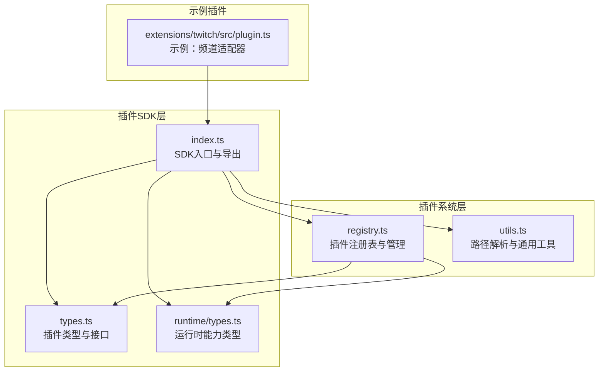
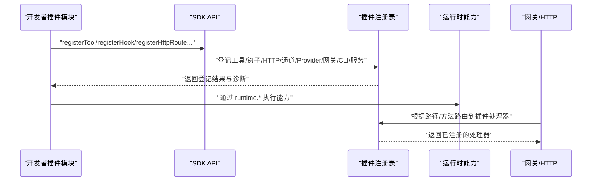
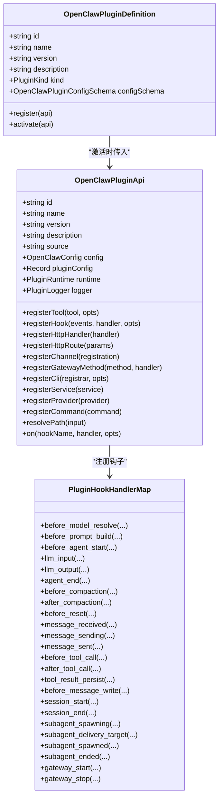
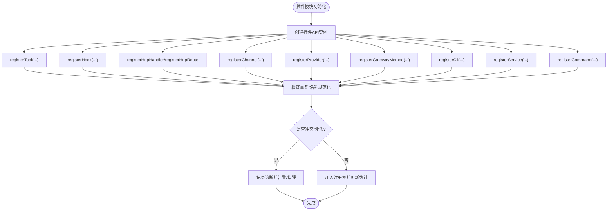
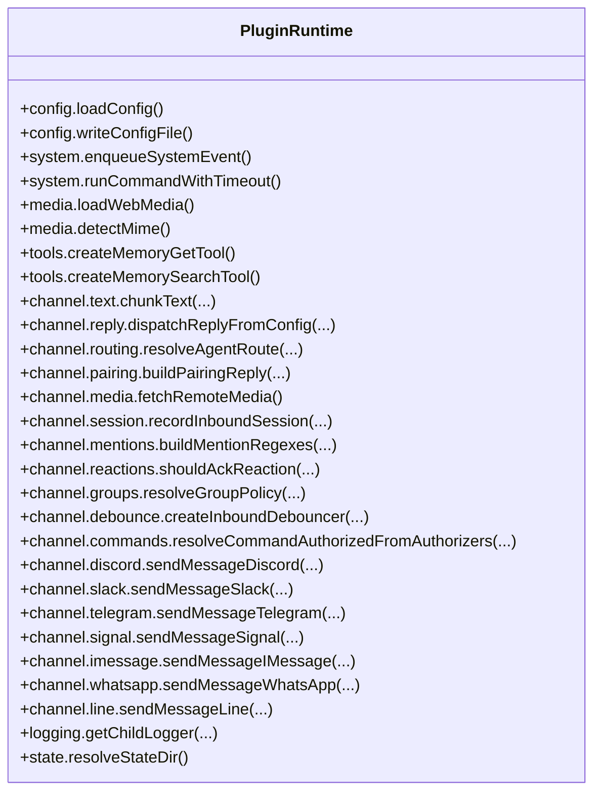
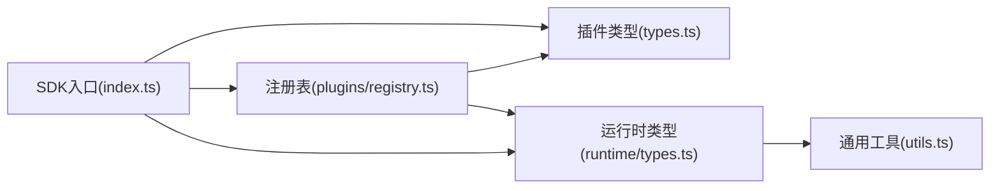

# 插件开发指南

<cite>
**本文引用的文件**
- [src/plugin-sdk/index.ts](file://src/plugin-sdk/index.ts)
- [src/plugins/types.ts](file://src/plugins/types.ts)
- [src/plugins/registry.ts](file://src/plugins/registry.ts)
- [src/plugins/runtime/types.ts](file://src/plugins/runtime/types.ts)
- [src/utils.ts](file://src/utils.ts)
- [extensions/twitch/src/plugin.ts](file://extensions/twitch/src/plugin.ts)
</cite>

## 目录

1. [简介](#简介)
2. [项目结构](#项目结构)
3. [核心组件](#核心组件)
4. [架构总览](#架构总览)
5. [详细组件分析](#详细组件分析)
6. [依赖关系分析](#依赖关系分析)
7. [性能考量](#性能考量)
8. [故障排查指南](#故障排查指南)
9. [结论](#结论)
10. [附录](#附录)

## 简介

本指南面向希望在 OpenClaw 平台上开发插件的工程师与技术作者。内容覆盖 Plugin SDK 的使用方法、开发环境搭建、项目结构、接口与类型系统、API 使用方式、最佳实践与设计模式、调试与测试策略、性能优化建议，以及从简单到复杂的插件开发示例（频道适配器、工具扩展、技能集成等）。读者无需深入底层即可快速上手，同时也能通过源码级分析理解插件系统的运行机制。

## 项目结构

OpenClaw 将插件能力集中在 src/plugin-sdk 与 src/plugins 下，前者提供对外 SDK 汇总导出与通用工具，后者提供插件生命周期、注册表、运行时能力与钩子系统。

图表来源

- [src/plugin-sdk/index.ts](file://src/plugin-sdk/index.ts#L1-L597)
- [src/plugins/types.ts](file://src/plugins/types.ts#L1-L764)
- [src/plugins/registry.ts](file://src/plugins/registry.ts#L1-L520)
- [src/plugins/runtime/types.ts](file://src/plugins/runtime/types.ts#L1-L375)
- [src/utils.ts](file://src/utils.ts#L285-L302)
- [extensions/twitch/src/plugin.ts](file://extensions/twitch/src/plugin.ts)

章节来源

- [src/plugin-sdk/index.ts](file://src/plugin-sdk/index.ts#L1-L597)
- [src/plugins/types.ts](file://src/plugins/types.ts#L1-L764)
- [src/plugins/registry.ts](file://src/plugins/registry.ts#L1-L520)
- [src/plugins/runtime/types.ts](file://src/plugins/runtime/types.ts#L1-L375)
- [src/utils.ts](file://src/utils.ts#L285-L302)
- [extensions/twitch/src/plugin.ts](file://extensions/twitch/src/plugin.ts)

## 核心组件

- SDK 入口与导出：统一聚合插件开发所需的类型、工具函数与适配器，便于按需导入。
- 插件类型系统：定义插件生命周期、命令、HTTP 路由、CLI 注册、服务、Provider 认证、通道适配器等接口。
- 插件注册表：集中管理插件的工具、钩子、通道、Provider、网关方法、HTTP 路由、CLI 命令、服务与诊断信息。
- 运行时能力：封装配置读写、媒体处理、TTS、工具创建、消息分发、路由、会话、提及与反应、群组策略、防抖、命令授权、各渠道发送与监控等能力。
- 通用工具：路径解析、安全字符串处理、JSON 安全解析、超时睡眠、UTF-16 安全截取等。

章节来源

- [src/plugin-sdk/index.ts](file://src/plugin-sdk/index.ts#L1-L597)
- [src/plugins/types.ts](file://src/plugins/types.ts#L22-L284)
- [src/plugins/registry.ts](file://src/plugins/registry.ts#L124-L162)
- [src/plugins/runtime/types.ts](file://src/plugins/runtime/types.ts#L188-L375)
- [src/utils.ts](file://src/utils.ts#L285-L302)

## 架构总览

下图展示了插件从加载到运行的关键交互：插件模块通过 SDK 提供的 API 注册工具、钩子、HTTP 路由、通道适配器、Provider、网关方法、CLI 与服务；注册表负责去重与冲突检测；运行时能力为插件提供统一的能力调用入口。

图表来源

- [src/plugins/registry.ts](file://src/plugins/registry.ts#L164-L520)
- [src/plugins/types.ts](file://src/plugins/types.ts#L245-L284)
- [src/plugins/runtime/types.ts](file://src/plugins/runtime/types.ts#L188-L375)

章节来源

- [src/plugins/registry.ts](file://src/plugins/registry.ts#L164-L520)
- [src/plugins/types.ts](file://src/plugins/types.ts#L245-L284)
- [src/plugins/runtime/types.ts](file://src/plugins/runtime/types.ts#L188-L375)

## 详细组件分析

### 组件A：插件类型系统与生命周期

- 插件定义与模块形态：支持对象式定义与函数式回调两种形式，可声明 id、name、version、description、kind、配置模式、激活/注册回调等。
- 生命周期钩子：涵盖模型解析前、提示构建前、代理开始、LLM 输入/输出、代理结束、压缩前后、会话开始/结束、消息收发/发送、工具调用前后、结果持久化、消息写入前、子代理派生与交付、网关启停等。
- 工具与命令：工具工厂可按上下文动态生成；自定义命令可绕过 LLM，优先于内置命令执行。
- HTTP 与 CLI：支持注册全局 HTTP 处理器与命名路由，以及 CLI 子命令注册。
- Provider 认证：统一抽象 OAuth、API Key、Token、设备码等认证方式，支持刷新与格式化。
- 通道适配器：统一的通道插件接口，配合 Dock 与元数据进行频道对接。

图表来源

- [src/plugins/types.ts](file://src/plugins/types.ts#L230-L284)
- [src/plugins/types.ts](file://src/plugins/types.ts#L658-L755)

章节来源

- [src/plugins/types.ts](file://src/plugins/types.ts#L230-L284)
- [src/plugins/types.ts](file://src/plugins/types.ts#L299-L323)
- [src/plugins/types.ts](file://src/plugins/types.ts#L334-L425)
- [src/plugins/types.ts](file://src/plugins/types.ts#L479-L518)
- [src/plugins/types.ts](file://src/plugins/types.ts#L524-L553)
- [src/plugins/types.ts](file://src/plugins/types.ts#L555-L640)
- [src/plugins/types.ts](file://src/plugins/types.ts#L642-L655)
- [src/plugins/types.ts](file://src/plugins/types.ts#L658-L755)

### 组件B：插件注册表与管理

- 注册项类型：工具、HTTP 处理器/路由、通道、Provider、内部钩子、服务、命令、CLI 注册器等。
- 冲突与诊断：对重复注册、路径非法、方法冲突等情况进行诊断记录。
- API 创建：为每个插件实例化一个标准化的 OpenClawPluginApi，屏蔽底层细节。
- 集中管理：维护插件清单、工具名集合、钩子名集合、通道 ID、Provider ID、网关方法、CLI 命令、服务、自定义命令、HTTP 处理器数量与钩子总数、配置模式与 UI 提示等。

图表来源

- [src/plugins/registry.ts](file://src/plugins/registry.ts#L164-L520)

章节来源

- [src/plugins/registry.ts](file://src/plugins/registry.ts#L124-L162)
- [src/plugins/registry.ts](file://src/plugins/registry.ts#L172-L197)
- [src/plugins/registry.ts](file://src/plugins/registry.ts#L199-L267)
- [src/plugins/registry.ts](file://src/plugins/registry.ts#L269-L289)
- [src/plugins/registry.ts](file://src/plugins/registry.ts#L291-L330)
- [src/plugins/registry.ts](file://src/plugins/registry.ts#L332-L358)
- [src/plugins/registry.ts](file://src/plugins/registry.ts#L360-L387)
- [src/plugins/registry.ts](file://src/plugins/registry.ts#L389-L402)
- [src/plugins/registry.ts](file://src/plugins/registry.ts#L404-L415)
- [src/plugins/registry.ts](file://src/plugins/registry.ts#L417-L447)
- [src/plugins/registry.ts](file://src/plugins/registry.ts#L449-L463)

### 组件C：运行时能力与通道适配器

- 运行时能力：统一暴露配置读写、系统事件、命令执行、媒体加载/保存/识别、TTS、内存工具、文本分块、回复分发、路由、配对、活动记录、会话管理、提及/反应、群组策略、防抖、命令授权、各渠道发送与监控等。
- 通道适配器：以 ChannelPlugin 形式接入 Discord、Slack、Telegram、Signal、iMessage、WhatsApp、LINE 等，提供账户解析、目标归一化、状态问题收集、消息动作、心跳与线程工具上下文等。

图表来源

- [src/plugins/runtime/types.ts](file://src/plugins/runtime/types.ts#L188-L375)

章节来源

- [src/plugins/runtime/types.ts](file://src/plugins/runtime/types.ts#L188-L375)

### 组件D：SDK 入口与导出

- 类型与适配器导出：统一导出通道适配器、消息动作、状态辅助、配置模式、SSRF 策略、HTTP 请求体限制、时间格式化、设备配对、去重缓存、历史记录、提及门禁、Ack 反应、回复前缀、位置格式化、通道配置与目录配置、允许列表匹配、工具发送提取、回复载荷构建、运行时日志器等。
- 通道特定导出：针对 Discord、iMessage、Slack、Telegram、Signal、WhatsApp、LINE 等提供账户解析、归一化、状态问题收集、消息动作、线程工具上下文等。

章节来源

- [src/plugin-sdk/index.ts](file://src/plugin-sdk/index.ts#L1-L597)

### 组件E：通用工具与路径解析

- 路径解析：支持 ~ 展开、绝对路径解析、短路径显示、终端链接格式化等。
- 字符串与 JSON：正则转义、安全 JSON 解析、UTF-16 安全截断、睡眠等待等。
- 配置根目录：支持通过环境变量覆盖默认配置目录。

章节来源

- [src/utils.ts](file://src/utils.ts#L285-L302)
- [src/utils.ts](file://src/utils.ts#L377-L391)

## 依赖关系分析

- SDK 对外导出依赖插件类型系统与注册表，形成“类型—注册—能力”的闭环。
- 注册表依赖内部钩子系统、命令系统、HTTP 路由系统、通道与 Provider 定义等。
- 运行时能力以类型约束的方式暴露给插件，避免直接耦合具体实现。
- 通用工具被广泛复用于路径解析、日志、网络与安全等场景。

图表来源

- [src/plugin-sdk/index.ts](file://src/plugin-sdk/index.ts#L1-L597)
- [src/plugins/types.ts](file://src/plugins/types.ts#L1-L764)
- [src/plugins/registry.ts](file://src/plugins/registry.ts#L1-L520)
- [src/plugins/runtime/types.ts](file://src/plugins/runtime/types.ts#L1-L375)
- [src/utils.ts](file://src/utils.ts#L1-L395)

章节来源

- [src/plugin-sdk/index.ts](file://src/plugin-sdk/index.ts#L1-L597)
- [src/plugins/types.ts](file://src/plugins/types.ts#L1-L764)
- [src/plugins/registry.ts](file://src/plugins/registry.ts#L1-L520)
- [src/plugins/runtime/types.ts](file://src/plugins/runtime/types.ts#L1-L375)
- [src/utils.ts](file://src/utils.ts#L1-L395)

## 性能考量

- 避免在钩子中执行阻塞操作，优先使用异步与流式处理。
- 合理使用运行时能力中的分块与去重缓存，降低重复计算与网络请求。
- 在通道适配器中尽量复用已有的归一化与校验逻辑，减少重复解析。
- 对外部网络请求设置合理的超时与重试策略，结合 SSRF 限制与 HTTPS 白名单策略保障安全与稳定性。
- 利用会话与历史记录的清理与淘汰策略，控制内存占用与 IO 开销。

## 故障排查指南

- 诊断信息：注册表会记录重复注册、路径非法、方法冲突等诊断信息，可通过诊断事件或日志查看。
- HTTP 限制：当请求体过大或超过时限，会触发请求体限制错误，需调整配置或优化负载。
- SSRF 保护：对私有地址与黑名单主机进行拦截，避免内网探测与 SSRF 攻击。
- 日志与红化：使用运行时日志器与敏感信息红化工具，确保日志安全与可观测性。
- 配对与允许列表：通过配对与 allowFrom 配置核验来源合法性，防止未授权访问。

章节来源

- [src/plugins/registry.ts](file://src/plugins/registry.ts#L168-L170)
- [src/plugin-sdk/index.ts](file://src/plugin-sdk/index.ts#L279-L287)
- [src/plugin-sdk/index.ts](file://src/plugin-sdk/index.ts#L290-L296)
- [src/plugin-sdk/index.ts](file://src/plugin-sdk/index.ts#L595-L597)

## 结论

OpenClaw 的插件体系以清晰的类型系统、完善的注册表与统一的运行时能力为核心，既保证了扩展性，又提供了强大的安全与可观测性保障。开发者可基于 SDK 快速实现从频道适配器到工具扩展再到技能集成的多种插件形态，并通过钩子与运行时能力实现复杂的消息处理与业务编排。

## 附录

### A. 开发环境搭建

- 基础要求：Node.js、包管理器（如 pnpm）、编辑器（VS Code 推荐）。
- 获取代码：克隆仓库后安装依赖。
- 运行与调试：使用提供的脚本与任务配置启动本地服务，结合断点与日志进行调试。
- 文档与示例：参考 docs 目录与 extensions 中的示例插件。

### B. 项目结构要点

- src/plugin-sdk：SDK 入口与导出、工具函数与适配器。
- src/plugins：插件类型、注册表、运行时能力类型与通用工具。
- extensions：各类频道适配器与示例插件，可作为模板参考。

章节来源

- [src/plugin-sdk/index.ts](file://src/plugin-sdk/index.ts#L1-L597)
- [src/plugins/types.ts](file://src/plugins/types.ts#L1-L764)
- [src/plugins/registry.ts](file://src/plugins/registry.ts#L1-L520)
- [src/plugins/runtime/types.ts](file://src/plugins/runtime/types.ts#L1-L375)
- [extensions/twitch/src/plugin.ts](file://extensions/twitch/src/plugin.ts)

### C. 插件开发示例（步骤与要点）

- 频道适配器（以 Twitch 为例）
  - 实现 ChannelPlugin 接口，定义账户解析、消息归一化、状态问题收集、消息动作等。
  - 通过 SDK 的通道工具与状态辅助函数，快速接入平台能力。
  - 使用注册表注册通道与 Dock，确保多账号与线程上下文正确。
- 工具扩展
  - 定义工具工厂，按上下文动态生成工具，支持可选工具与名称集合。
  - 在钩子中对工具调用进行前置校验与后置持久化处理。
- 技能集成
  - 通过 Provider 认证抽象接入第三方模型与服务，支持 OAuth 刷新与凭据格式化。
  - 使用运行时能力进行媒体处理、TTS、会话管理与消息分发。

章节来源

- [extensions/twitch/src/plugin.ts](file://extensions/twitch/src/plugin.ts)
- [src/plugins/types.ts](file://src/plugins/types.ts#L69-L77)
- [src/plugins/types.ts](file://src/plugins/types.ts#L116-L126)
- [src/plugins/runtime/types.ts](file://src/plugins/runtime/types.ts#L188-L375)

### D. 最佳实践与设计模式

- 单一职责：每个插件聚焦一个领域（频道、工具、Provider），避免过度耦合。
- 钩子优先：尽量通过钩子而非硬编码逻辑实现定制，提升可维护性。
- 安全优先：严格遵循 SSRF 限制、HTTPS 白名单与凭据红化策略。
- 可观测性：使用运行时日志器与诊断事件，记录关键路径与异常。
- 可测试性：将业务逻辑与 SDK 调用解耦，便于单元测试与集成测试。

### E. API 使用方法与类型系统

- 类型系统：围绕 OpenClawPluginDefinition、OpenClawPluginApi、PluginHookHandlerMap、PluginRuntime 等核心类型展开。
- API 方法：registerTool、registerHook、registerHttpHandler、registerHttpRoute、registerChannel、registerProvider、registerGatewayMethod、registerCli、registerService、registerCommand、on 等。
- 运行时能力：通过 runtime.\* 快速调用配置、媒体、TTS、工具、文本分块、回复分发、路由、会话、提及/反应、群组策略、防抖、命令授权、各渠道发送与监控等。

章节来源

- [src/plugins/types.ts](file://src/plugins/types.ts#L245-L284)
- [src/plugins/runtime/types.ts](file://src/plugins/runtime/types.ts#L188-L375)
