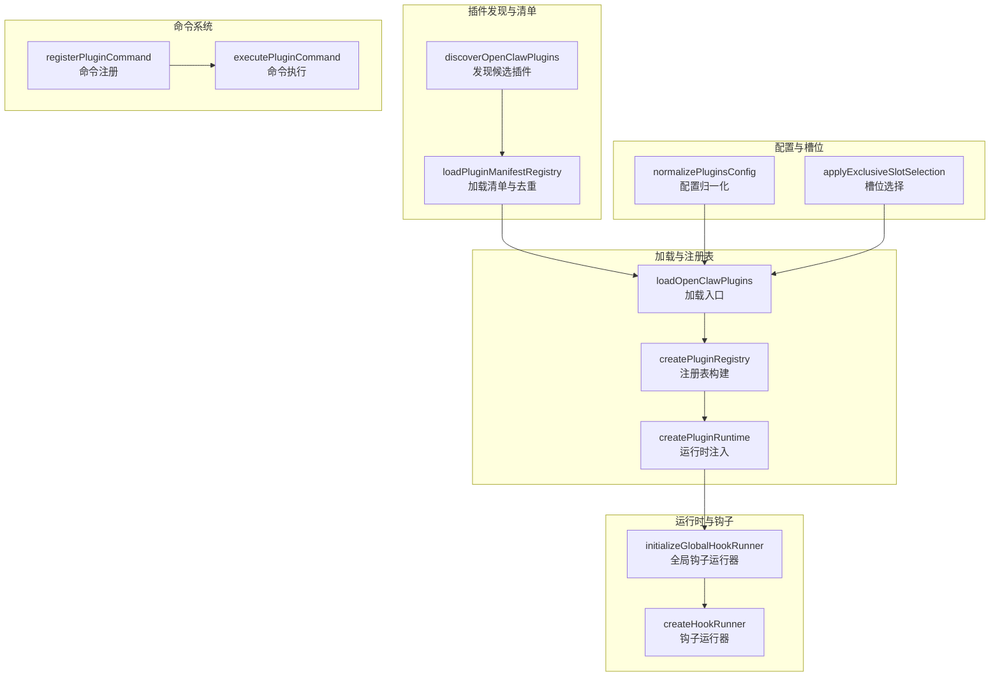
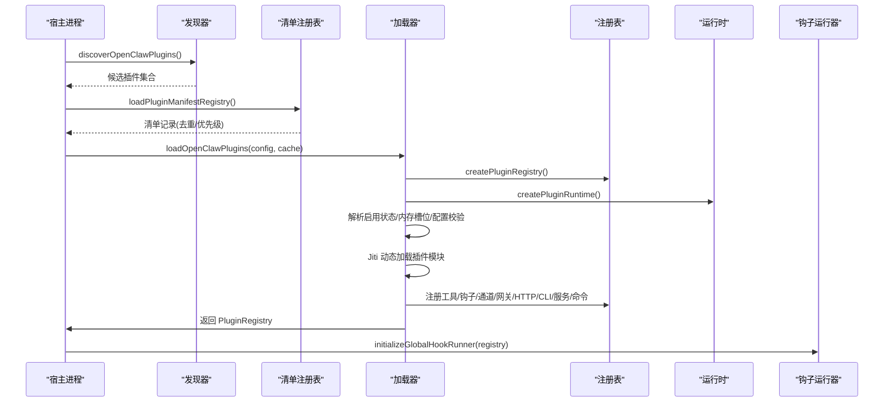
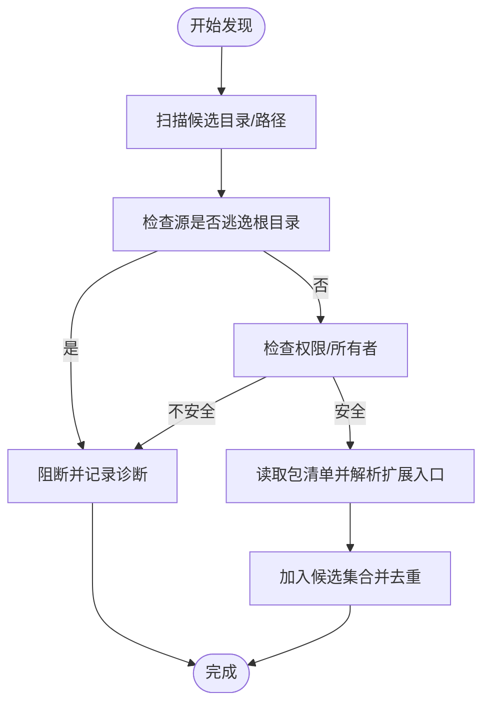
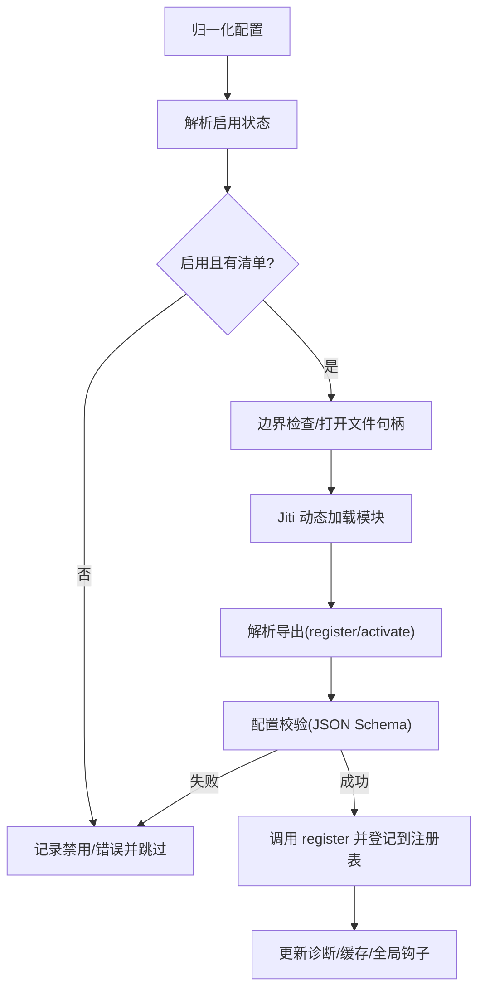
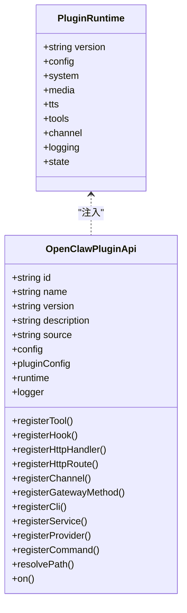
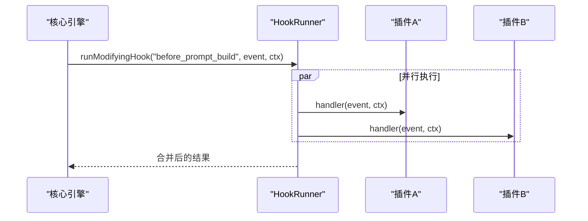
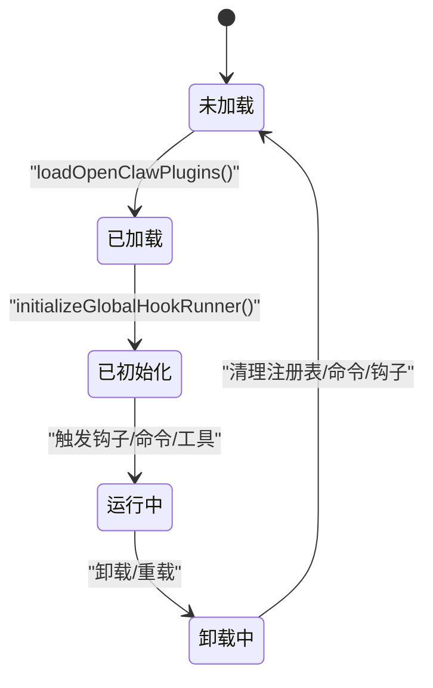
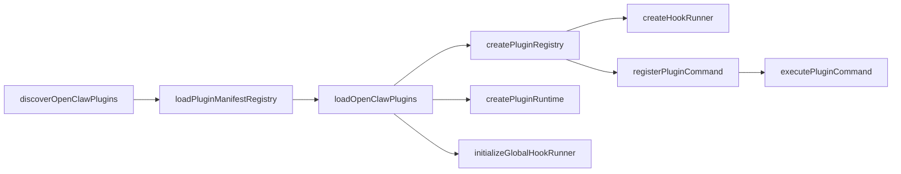

# 插件架构设计

<cite>
**本文档引用的文件**
- [loader.ts](file://src/plugins/loader.ts)
- [registry.ts](file://src/plugins/registry.ts)
- [types.ts](file://src/plugins/types.ts)
- [config-state.ts](file://src/plugins/config-state.ts)
- [hooks.ts](file://src/plugins/hooks.ts)
- [discovery.ts](file://src/plugins/discovery.ts)
- [manifest-registry.ts](file://src/plugins/manifest-registry.ts)
- [slots.ts](file://src/plugins/slots.ts)
- [commands.ts](file://src/plugins/commands.ts)
- [runtime/index.ts](file://src/plugins/runtime/index.ts)
- [runtime.ts](file://src/plugins/runtime.ts)
- [loader.test.ts](file://src/plugins/loader.test.ts)
- [uninstall.ts](file://src/plugins/uninstall.ts)
</cite>

## 目录

1. [简介](#简介)
2. [项目结构](#项目结构)
3. [核心组件](#核心组件)
4. [架构总览](#架构总览)
5. [详细组件分析](#详细组件分析)
6. [依赖分析](#依赖分析)
7. [性能考虑](#性能考虑)
8. [故障排除指南](#故障排除指南)
9. [结论](#结论)

## 简介

本文件系统化阐述 OpenClaw 插件架构的设计与实现，覆盖插件发现、加载、注册表管理、运行时环境、配置与依赖解析、生命周期钩子、命令系统、安全边界与资源管理等关键主题，并给出架构图与组件关系说明，帮助开发者理解如何编写、部署与维护插件。

## 项目结构

OpenClaw 的插件系统主要位于 src/plugins 目录下，围绕“发现 → 清单解析 → 加载 → 注册表构建 → 运行时注入”的流水线组织，辅以配置状态、钩子运行器、通道/工具/媒体等运行时能力，以及命令注册与执行模块。

图表来源

- [discovery.ts](file://src/plugins/discovery.ts#L567-L635)
- [manifest-registry.ts](file://src/plugins/manifest-registry.ts#L134-L248)
- [loader.ts](file://src/plugins/loader.ts#L368-L717)
- [registry.ts](file://src/plugins/registry.ts#L164-L519)
- [runtime/index.ts](file://src/plugins/runtime/index.ts#L240-L252)
- [hooks.ts](file://src/plugins/hooks.ts#L125-L751)
- [config-state.ts](file://src/plugins/config-state.ts#L66-L80)
- [slots.ts](file://src/plugins/slots.ts#L37-L109)
- [commands.ts](file://src/plugins/commands.ts#L108-L288)

章节来源

- [loader.ts](file://src/plugins/loader.ts#L368-L717)
- [registry.ts](file://src/plugins/registry.ts#L164-L519)
- [types.ts](file://src/plugins/types.ts#L245-L284)
- [config-state.ts](file://src/plugins/config-state.ts#L66-L80)
- [discovery.ts](file://src/plugins/discovery.ts#L567-L635)
- [manifest-registry.ts](file://src/plugins/manifest-registry.ts#L134-L248)
- [hooks.ts](file://src/plugins/hooks.ts#L125-L751)
- [commands.ts](file://src/plugins/commands.ts#L108-L288)
- [runtime/index.ts](file://src/plugins/runtime/index.ts#L240-L252)
- [slots.ts](file://src/plugins/slots.ts#L37-L109)

## 核心组件

- 插件发现器：扫描工作区、全局、捆绑目录与显式路径，收集候选插件并进行安全检查（边界、权限、所有权）。
- 清单注册表：加载每个候选的插件清单，去重与优先级判定，生成清单记录。
- 加载器：根据配置与清单，解析启用状态、内存槽位、配置校验，使用 Jiti 动态加载插件模块，调用 register/activate 并构建注册表。
- 注册表：统一存储插件元信息与已注册的工具、钩子、通道、网关方法、HTTP 路由、CLI 命令、服务等。
- 钩子运行器：按优先级顺序串行或并行执行插件生命周期钩子，提供错误捕获与结果合并。
- 命令系统：注册插件自定义命令，拦截消息前处理，支持鉴权与参数清洗。
- 运行时：为插件提供版本、配置读写、系统命令、媒体、TTS、工具、通道能力、日志等。
- 配置与槽位：标准化插件配置，解析允许/禁止列表、显式启用项、内存槽位策略，保障单一内存插件生效。

章节来源

- [discovery.ts](file://src/plugins/discovery.ts#L567-L635)
- [manifest-registry.ts](file://src/plugins/manifest-registry.ts#L134-L248)
- [loader.ts](file://src/plugins/loader.ts#L368-L717)
- [registry.ts](file://src/plugins/registry.ts#L164-L519)
- [hooks.ts](file://src/plugins/hooks.ts#L125-L751)
- [commands.ts](file://src/plugins/commands.ts#L108-L288)
- [runtime/index.ts](file://src/plugins/runtime/index.ts#L240-L252)
- [config-state.ts](file://src/plugins/config-state.ts#L66-L80)
- [slots.ts](file://src/plugins/slots.ts#L37-L109)

## 架构总览

下图展示从“发现候选”到“注册表构建与运行时注入”的端到端流程，以及与钩子运行器、命令系统、配置/槽位的交互。

图表来源

- [discovery.ts](file://src/plugins/discovery.ts#L567-L635)
- [manifest-registry.ts](file://src/plugins/manifest-registry.ts#L134-L248)
- [loader.ts](file://src/plugins/loader.ts#L368-L717)
- [registry.ts](file://src/plugins/registry.ts#L164-L519)
- [runtime/index.ts](file://src/plugins/runtime/index.ts#L240-L252)
- [hooks.ts](file://src/plugins/hooks.ts#L125-L751)

## 详细组件分析

### 插件发现与安全边界

- 发现范围：支持配置指定路径、工作区 .openclaw/extensions、全局扩展目录、捆绑插件目录。
- 安全检查：禁止源文件逃逸根目录、禁止世界可写的路径、非捆绑来源的可疑所有权（UID 不匹配）。
- 包清单扩展：若 package.json 指定 extensions，则优先加载这些入口；否则回退到 index.\* 文件。
- 去重与优先级：同一插件 ID 的多个候选，依据 origin 优先级（config > workspace > global > bundled）保留更高优先级者。

图表来源

- [discovery.ts](file://src/plugins/discovery.ts#L65-L199)
- [discovery.ts](file://src/plugins/discovery.ts#L226-L345)
- [discovery.ts](file://src/plugins/discovery.ts#L347-L451)

章节来源

- [discovery.ts](file://src/plugins/discovery.ts#L567-L635)

### 清单注册表与去重

- 依据候选集合加载每个插件的清单，记录 id/name/description/version/kind/channels/providers/skills 等元信息。
- 对重复 ID 的候选进行告警，并在物理路径相同（通过 realpath 判定）时允许覆盖更高优先级的 origin。
- 生成 schemaCacheKey 用于后续配置校验缓存。

章节来源

- [manifest-registry.ts](file://src/plugins/manifest-registry.ts#L134-L248)

### 插件加载与注册表构建

- 配置归一化：解析 enabled/allow/deny/loadPaths/slots/entries。
- 启用决策：综合 allow/deny、entries 显式开关、bundled 默认策略、通道配置对 bundled 的例外启用。
- 内存槽位：同一时刻仅允许一个 kind 为 memory 的插件被启用，未显式设置时默认选择 memory-core。
- 配置校验：基于清单中的 JSON Schema 校验插件配置，失败则记录错误并跳过。
- 动态加载：使用 Jiti 加载插件入口，解析默认导出或命名导出，调用 register/activate。
- 注册表填充：将插件注册的工具、钩子、通道、网关方法、HTTP 路由、CLI、服务、命令等登记到注册表。

图表来源

- [loader.ts](file://src/plugins/loader.ts#L368-L717)
- [config-state.ts](file://src/plugins/config-state.ts#L165-L232)
- [slots.ts](file://src/plugins/slots.ts#L27-L29)

章节来源

- [loader.ts](file://src/plugins/loader.ts#L368-L717)
- [config-state.ts](file://src/plugins/config-state.ts#L66-L80)
- [slots.ts](file://src/plugins/slots.ts#L37-L109)

### 运行时注入与 API

- 运行时能力：版本号、配置读写、系统事件/命令执行、媒体处理、TTS、工具工厂、通道适配器、日志、状态目录等。
- 插件 API：插件通过 API 获取自身元信息、访问运行时能力、注册工具/钩子/通道/网关/HTTP/CLI/服务/命令。
- 全局运行时：通过全局符号保存当前活跃注册表，供其他模块查询。

图表来源

- [runtime/index.ts](file://src/plugins/runtime/index.ts#L240-L252)
- [types.ts](file://src/plugins/types.ts#L245-L284)
- [registry.ts](file://src/plugins/registry.ts#L472-L503)

章节来源

- [runtime/index.ts](file://src/plugins/runtime/index.ts#L240-L252)
- [types.ts](file://src/plugins/types.ts#L245-L284)
- [registry.ts](file://src/plugins/registry.ts#L472-L503)
- [runtime.ts](file://src/plugins/runtime.ts#L23-L41)

### 生命周期钩子与执行模型

- 钩子类型：涵盖模型解析、提示构建、消息收发、工具调用、会话、子代理、网关启停等。
- 执行模型：
  - 无返回值钩子：并行执行（提升吞吐）。
  - 修改型钩子：按优先级顺序串行执行，结果合并（如系统提示、上下文拼接、消息修改、阻断等）。
  - 同步钩子：在热路径上强制同步（如 tool_result_persist、before_message_write），防止异步开销。
- 错误处理：可选择捕获异常并记录，或抛出错误中断流程。

图表来源

- [hooks.ts](file://src/plugins/hooks.ts#L221-L255)
- [hooks.ts](file://src/plugins/hooks.ts#L125-L215)

章节来源

- [hooks.ts](file://src/plugins/hooks.ts#L125-L751)

### 插件间通信与数据共享

- 钩子链路：通过 typed hooks 提供跨阶段的数据传递与修改，例如在 before_prompt_build 中注入上下文，在 message_sending 中修改/取消消息。
- 工具共享：工具工厂注册后可在代理执行中统一调度，插件可声明 optional 工具以增强容错。
- 通道与网关：插件可注册通道适配器与网关方法，实现消息路由与外部协议扩展。
- 命令系统：插件注册的命令在消息到达时优先匹配，绕过 LLM 直接执行，适合状态切换、查询类命令。

章节来源

- [registry.ts](file://src/plugins/registry.ts#L172-L197)
- [registry.ts](file://src/plugins/registry.ts#L332-L358)
- [registry.ts](file://src/plugins/registry.ts#L269-L289)
- [commands.ts](file://src/plugins/commands.ts#L108-L141)

### 配置系统与依赖解析

- 配置归一化：统一处理 enabled/allow/deny/loadPaths/slots/entries，确保不同来源配置的一致性。
- 依赖解析：通过 allowlist/denylist 控制插件启用；通过 entries.{id}.config 为插件提供结构化配置；通过 loadPaths 指定额外加载路径。
- 内存槽位：同一 kind 的插件只能有一个被启用，避免资源冲突；支持 "none" 关闭槽位。

章节来源

- [config-state.ts](file://src/plugins/config-state.ts#L66-L80)
- [config-state.ts](file://src/plugins/config-state.ts#L165-L232)
- [slots.ts](file://src/plugins/slots.ts#L27-L29)

### 插件生命周期管理

- 加载：发现 → 清单解析 → 启用决策 → 配置校验 → 动态加载 → 注册 API 调用。
- 初始化：注册表构建完成后，初始化全局钩子运行器，建立钩子分发网络。
- 运行：在代理执行、消息处理、工具调用、会话管理等阶段触发相应钩子。
- 卸载：清理注册表、命令、钩子与相关资源；更新配置（移除 entries/installs/allow/loadPaths/slots 中的引用）。

图表来源

- [loader.ts](file://src/plugins/loader.ts#L714-L717)
- [hooks.ts](file://src/plugins/hooks.ts#L125-L128)
- [uninstall.ts](file://src/plugins/uninstall.ts#L65-L156)

章节来源

- [loader.ts](file://src/plugins/loader.ts#L368-L717)
- [uninstall.ts](file://src/plugins/uninstall.ts#L65-L156)

### 插件隔离机制、安全边界与资源管理

- 边界文件读取：使用边界检查函数限制文件访问范围，避免逃逸根目录。
- 权限与所有权：禁止世界可写路径，非捆绑来源的可疑 UID 拒绝加载。
- 运行时沙箱：插件通过 API 访问能力，避免直接操作宿主进程资源。
- 资源管理：命令执行加锁防止并发修改；钩子运行器捕获异常避免传播到核心；HTTP/网关方法注册时去重与冲突检测。

章节来源

- [discovery.ts](file://src/plugins/discovery.ts#L65-L199)
- [loader.ts](file://src/plugins/loader.ts#L528-L552)
- [commands.ts](file://src/plugins/commands.ts#L147-L160)
- [registry.ts](file://src/plugins/registry.ts#L278-L287)

### 热重载机制与版本兼容性

- 缓存键：基于工作区路径与插件配置构建缓存键，避免不必要的重复加载。
- 清单缓存：对清单加载结果进行 TTL 缓存，减少磁盘 IO。
- 重载流程：清空命令注册表、重建注册表、重新初始化钩子运行器、更新全局活跃注册表。
- 版本兼容：通过清单中的 kind、channels/providers/skills 等元信息，插件作者可声明兼容范围；运行时通过 API 能力版本号辅助判断。

章节来源

- [loader.ts](file://src/plugins/loader.ts#L98-L104)
- [manifest-registry.ts](file://src/plugins/manifest-registry.ts#L47-L91)
- [runtime/index.ts](file://src/plugins/runtime/index.ts#L146-L159)

## 依赖分析

- 组件耦合：
  - 发现器与清单注册表：发现器输出候选，清单注册表负责解析与去重。
  - 加载器依赖配置状态、清单注册表、运行时、钩子运行器。
  - 注册表为工具、钩子、通道、网关、HTTP、CLI、服务、命令提供统一存储。
  - 命令系统与钩子运行器分别独立于核心流程，但可被消息处理路径调用。
- 外部依赖：
  - Jiti：动态加载插件模块，支持 TS/JS 多种扩展名。
  - Node 内置模块：fs/path/url 等用于文件系统与路径处理。
  - JSON Schema 校验：用于插件配置验证。

图表来源

- [discovery.ts](file://src/plugins/discovery.ts#L567-L635)
- [manifest-registry.ts](file://src/plugins/manifest-registry.ts#L134-L248)
- [loader.ts](file://src/plugins/loader.ts#L368-L717)
- [registry.ts](file://src/plugins/registry.ts#L164-L519)
- [hooks.ts](file://src/plugins/hooks.ts#L125-L751)
- [commands.ts](file://src/plugins/commands.ts#L108-L288)

章节来源

- [loader.ts](file://src/plugins/loader.ts#L368-L717)
- [registry.ts](file://src/plugins/registry.ts#L164-L519)

## 性能考虑

- 并行执行：消息钩子（如 llm*input/llm_output/message*\*）采用并行执行，降低延迟。
- 串行合并：修改型钩子按优先级顺序串行，避免竞态并保证结果确定性。
- 同步钩子：tool_result_persist/before_message_write 在热路径上强制同步，避免异步开销。
- 缓存策略：插件清单与加载结果缓存，显著减少重复加载成本。
- 路径与权限检查：在加载前完成，避免运行期失败带来的额外开销。

## 故障排除指南

- 插件未加载：
  - 检查是否命中 allowlist/denylist 或 entries 显式禁用。
  - 查看诊断信息中关于“源逃逸根目录/路径 stat 失败/世界可写/可疑所有权”的警告。
- 配置无效：
  - 确认 JSON Schema 校验是否通过；查看错误消息定位字段。
- 钩子异常：
  - 若 catchErrors=true，异常会被记录但不会中断流程；否则会抛出错误。
- 命令冲突：
  - 检查是否与内置命令重名；确认命令名称合法性与重复注册。

章节来源

- [loader.ts](file://src/plugins/loader.ts#L187-L210)
- [hooks.ts](file://src/plugins/hooks.ts#L175-L188)
- [commands.ts](file://src/plugins/commands.ts#L78-L97)

## 结论

OpenClaw 插件架构通过“发现 → 清单 → 加载 → 注册表 → 运行时注入 → 钩子执行”的清晰流水线，结合严格的边界检查、配置与槽位控制、命令与工具的统一注册，实现了高扩展性与强安全性的平衡。开发者可通过插件 API 便捷地扩展工具、钩子、通道、网关与命令，同时借助钩子运行器与运行时能力在关键路径上实现可控的可观测与可干预。
