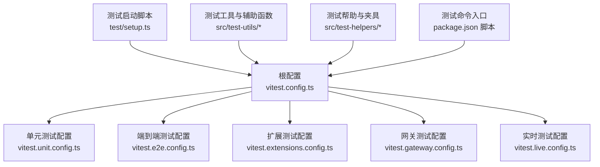
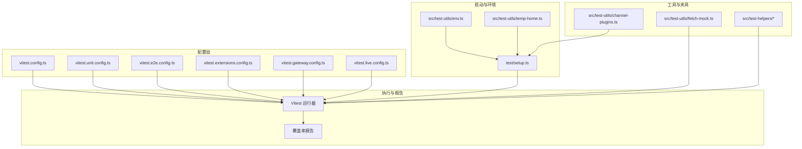
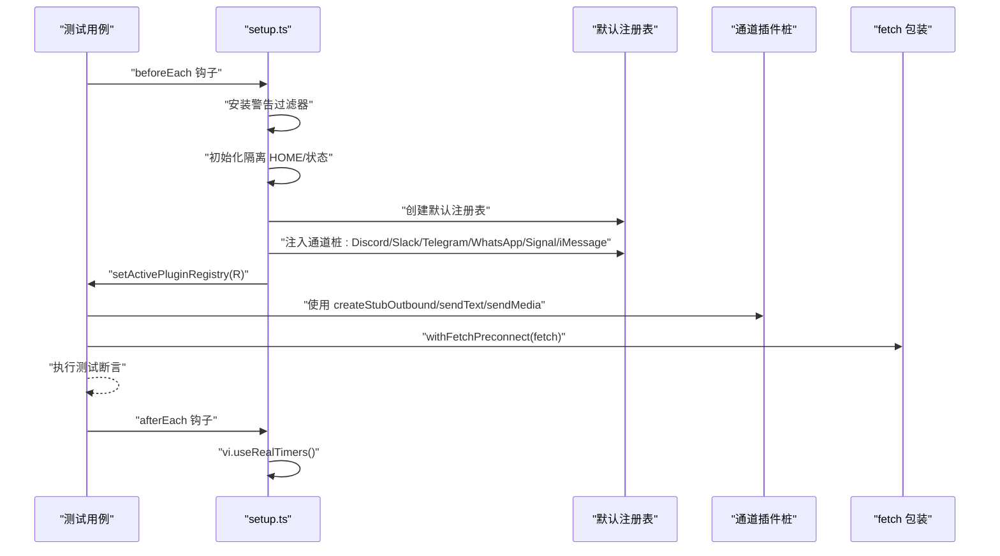
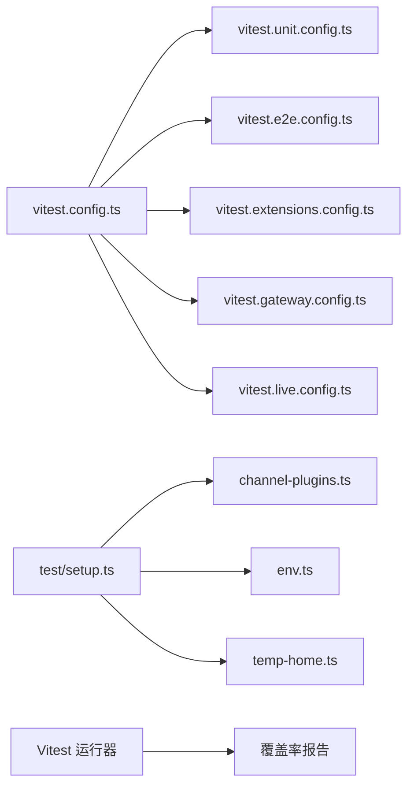

# 插件测试与调试

<cite>
**本文引用的文件**
- [vitest.config.ts](file://vitest.config.ts)
- [vitest.unit.config.ts](file://vitest.unit.config.ts)
- [vitest.e2e.config.ts](file://vitest.e2e.config.ts)
- [vitest.extensions.config.ts](file://vitest.extensions.config.ts)
- [vitest.gateway.config.ts](file://vitest.gateway.config.ts)
- [vitest.live.config.ts](file://vitest.live.config.ts)
- [package.json](file://package.json)
- [test/setup.ts](file://test/setup.ts)
- [src/test-utils/channel-plugins.ts](file://src/test-utils/channel-plugins.ts)
- [src/test-utils/fetch-mock.ts](file://src/test-utils/fetch-mock.ts)
- [src/test-utils/env.ts](file://src/test-utils/env.ts)
- [src/test-helpers/state-dir-env.ts](file://src/test-helpers/state-dir-env.ts)
- [src/test-helpers/workspace.ts](file://src/test-helpers/workspace.ts)
- [src/test-helpers/ssrf.ts](file://src/test-helpers/ssrf.ts)
- [src/test-helpers/state-dir-env.test.ts](file://src/test-helpers/state-dir-env.test.ts)
- [src/test-utils/temp-home.ts](file://src/test-utils/temp-home.ts)
- [src/test-utils/temp-home.test.ts](file://src/test-utils/temp-home.test.ts)
- [src/test-utils/tracked-temp-dirs.ts](file://src/test-utils/tracked-temp-dirs.ts)
- [src/test-utils/mock-http-response.ts](file://src/test-utils/mock-http-response.ts)
- [src/test-utils/provider-usage-fetch.ts](file://src/test-utils/provider-usage-fetch.ts)
- [src/test-utils/command-runner.ts](file://src/test-utils/command-runner.ts)
- [src/test-utils/npm-spec-install-test-helpers.ts](file://src/test-utils/npm-spec-install-test-helpers.ts)
- [src/test-utils/runtime-source-guardrail-scan.ts](file://src/test-utils/runtime-source-guardrail-scan.ts)
- [src/test-utils/fixture-suite.ts](file://src/test-utils/fixture-suite.ts)
- [src/test-utils/typed-cases.ts](file://src/test-utils/typed-cases.ts)
- [src/test-utils/vitest-mock-fn.ts](file://src/test-utils/vitest-mock-fn.ts)
- [src/test-utils/internal-hook-event-payload.ts](file://src/test-utils/internal-hook-event-payload.ts)
- [src/test-utils/model-auth-mock.ts](file://src/test-utils/model-auth-mock.ts)
- [src/test-utils/model-fallback.mock.ts](file://src/test-utils/model-fallback.mock.ts)
- [src/test-utils/ports.ts](file://src/test-utils/ports.ts)
- [src/test-utils/chunk-test-helpers.ts](file://src/test-utils/chunk-test-helpers.ts)
- [src/test-utils/auth-token-assertions.ts](file://src/test-utils/auth-token-assertions.ts)
- [src/test-utils/exec-assertions.ts](file://src/test-utils/exec-assertions.ts)
- [src/test-utils/imessage-test-plugin.ts](file://src/test-utils/imessage-test-plugin.ts)
- [src/test-utils/typed-cases.ts](file://src/test-utils/typed-cases.ts)
- [src/test-utils/fixture-suite.ts](file://src/test-utils/fixture-suite.ts)
- [src/test-utils/vitest-mock-fn.ts](file://src/test-utils/vitest-mock-fn.ts)
- [src/test-utils/internal-hook-event-payload.ts](file://src/test-utils/internal-hook-event-payload.ts)
- [src/test-utils/model-auth-mock.ts](file://src/test-utils/model-auth-mock.ts)
- [src/test-utils/model-fallback.mock.ts](file://src/test-utils/model-fallback.mock.ts)
- [src/test-utils/ports.ts](file://src/test-utils/ports.ts)
- [src/test-utils/chunk-test-helpers.ts](file://src/test-utils/chunk-test-helpers.ts)
- [src/test-utils/auth-token-assertions.ts](file://src/test-utils/auth-token-assertions.ts)
- [src/test-utils/exec-assertions.ts](file://src/test-utils/exec-assertions.ts)
- [src/test-utils/imessage-test-plugin.ts](file://src/test-utils/imessage-test-plugin.ts)
</cite>

## 目录

1. [引言](#引言)
2. [项目结构](#项目结构)
3. [核心组件](#核心组件)
4. [架构总览](#架构总览)
5. [详细组件分析](#详细组件分析)
6. [依赖关系分析](#依赖关系分析)
7. [性能考量](#性能考量)
8. [故障排查指南](#故障排查指南)
9. [结论](#结论)
10. [附录](#附录)

## 引言

本指南面向插件开发者与测试工程师，系统阐述如何在 OpenClaw 项目中开展插件测试与调试工作。内容覆盖单元测试、集成测试、端到端测试（E2E）与实时测试（Live），并提供测试框架配置、测试工具与辅助函数、日志与断点调试技巧、性能分析方法、测试环境搭建与模拟数据准备、常见测试场景与模板，以及持续集成与自动化测试的配置要点。

## 项目结构

OpenClaw 使用 Vitest 作为测试运行器，并通过多套配置文件实现不同测试类型的隔离与优化。根目录提供统一的全局配置，按功能域拆分出扩展测试、网关测试、实时测试等专用配置；同时通过脚本在 package.json 中集中定义测试命令，便于本地与 CI 环境一致执行。

图示来源

- [vitest.config.ts](file://vitest.config.ts#L1-L158)
- [vitest.unit.config.ts](file://vitest.unit.config.ts#L1-L19)
- [vitest.e2e.config.ts](file://vitest.e2e.config.ts#L1-L31)
- [vitest.extensions.config.ts](file://vitest.extensions.config.ts#L1-L16)
- [vitest.gateway.config.ts](file://vitest.gateway.config.ts#L1-L16)
- [vitest.live.config.ts](file://vitest.live.config.ts#L1-L17)
- [test/setup.ts](file://test/setup.ts#L1-L190)
- [package.json](file://package.json#L49-L149)

章节来源

- [vitest.config.ts](file://vitest.config.ts#L1-L158)
- [package.json](file://package.json#L49-L149)

## 核心组件

- 测试运行器与配置
  - 全局配置：统一别名、超时、并发、覆盖率阈值与排除规则，确保跨平台稳定性与可维护性。
  - 分类配置：按类型拆分，避免无关模块干扰，提升执行效率。
- 测试启动与环境隔离
  - 统一的 setup 文件负责进程监听上限、警告过滤、插件注册表初始化与默认通道插件桩，保障测试隔离与一致性。
- 测试工具与辅助函数
  - 通道插件桩工厂、HTTP 预连接包装、环境变量快照与恢复、临时目录与工作区管理、断言与断点辅助等，覆盖插件开发常见场景。
- 测试命令与 CI 集成
  - 通过脚本统一触发不同测试类型，支持本地快速验证与 CI 并行加速。

章节来源

- [vitest.config.ts](file://vitest.config.ts#L26-L155)
- [test/setup.ts](file://test/setup.ts#L1-L190)
- [src/test-utils/channel-plugins.ts](file://src/test-utils/channel-plugins.ts#L1-L106)
- [src/test-utils/fetch-mock.ts](file://src/test-utils/fetch-mock.ts#L1-L23)
- [src/test-utils/env.ts](file://src/test-utils/env.ts#L1-L73)
- [package.json](file://package.json#L120-L149)

## 架构总览

下图展示测试体系在 OpenClaw 中的组织方式与交互路径，突出“配置—启动—工具—执行—报告”的闭环。

图示来源

- [vitest.config.ts](file://vitest.config.ts#L12-L157)
- [vitest.unit.config.ts](file://vitest.unit.config.ts#L11-L18)
- [vitest.e2e.config.ts](file://vitest.e2e.config.ts#L20-L30)
- [vitest.extensions.config.ts](file://vitest.extensions.config.ts#L8-L15)
- [vitest.gateway.config.ts](file://vitest.gateway.config.ts#L8-L15)
- [vitest.live.config.ts](file://vitest.live.config.ts#L8-L16)
- [test/setup.ts](file://test/setup.ts#L24-L189)
- [src/test-utils/env.ts](file://src/test-utils/env.ts#L1-L73)
- [src/test-utils/temp-home.ts](file://src/test-utils/temp-home.ts)
- [src/test-utils/channel-plugins.ts](file://src/test-utils/channel-plugins.ts#L15-L29)
- [src/test-utils/fetch-mock.ts](file://src/test-utils/fetch-mock.ts#L14-L22)
- [src/test-helpers/state-dir-env.ts](file://src/test-helpers/state-dir-env.ts)
- [src/test-helpers/workspace.ts](file://src/test-helpers/workspace.ts)

## 详细组件分析

### 测试框架与配置

- 全局配置要点
  - 别名映射：将插件 SDK 的命名空间别名解析到源码入口，保证测试中对 SDK 的导入稳定可靠。
  - 超时与钩子：针对 Windows 平台延长钩子超时，避免误判。
  - 环境与全局解桩：启用 unstubEnvs 与 unstubGlobals，防止 vmForks 下跨文件污染。
  - 并发与工人数：根据 CI/本地与平台自动选择最大并发，兼顾稳定性与速度。
  - 包含/排除：明确包含与排除范围，确保核心覆盖率锚定在实际被测代码上。
  - 覆盖率：设置行/函数/分支/语句阈值，仅统计 src 内部文件，排除应用与 UI 等非核心模块。
- 分类配置
  - 单元测试：剔除扩展与网关，聚焦核心逻辑。
  - 扩展测试：仅扫描 extensions 目录。
  - 网关测试：仅扫描网关相关测试。
  - 实时测试：限制并发为 1，便于与外部服务交互。
  - 端到端测试：使用 vmForks 提升确定性与成本控制，支持通过环境变量调整并发与输出级别。

章节来源

- [vitest.config.ts](file://vitest.config.ts#L12-L157)
- [vitest.unit.config.ts](file://vitest.unit.config.ts#L6-L18)
- [vitest.e2e.config.ts](file://vitest.e2e.config.ts#L9-L30)
- [vitest.extensions.config.ts](file://vitest.extensions.config.ts#L8-L15)
- [vitest.gateway.config.ts](file://vitest.gateway.config.ts#L8-L15)
- [vitest.live.config.ts](file://vitest.live.config.ts#L10-L16)

### 测试启动与环境隔离

- 启动流程
  - 设置 Vitest 标记与插件清单缓存时间，减少重复发现开销。
  - 安装进程警告过滤器，降低噪音。
  - 初始化隔离的 HOME/状态目录，避免跨测试污染。
  - 创建默认通道插件注册表，注入常用通道桩（Discord、Slack、Telegram、WhatsApp、Signal、iMessage），并在每个测试前激活。
  - 在 afterEach 中确保假时钟回归真实时钟，避免泄漏。
- 通道插件桩
  - 提供通用通道插件基座与发送适配器桩，支持自定义能力、配置解析与账户解析。
  - 支持为特定通道（如 Microsoft Teams）生成带别名与文档路径的插件基座。
- HTTP 预连接包装
  - 为 fetch 增加预连接能力的包装器，便于在测试中模拟网络行为与连接策略。

图示来源

- [test/setup.ts](file://test/setup.ts#L24-L189)
- [src/test-utils/channel-plugins.ts](file://src/test-utils/channel-plugins.ts#L15-L106)
- [src/test-utils/fetch-mock.ts](file://src/test-utils/fetch-mock.ts#L14-L22)

章节来源

- [test/setup.ts](file://test/setup.ts#L1-L190)
- [src/test-utils/channel-plugins.ts](file://src/test-utils/channel-plugins.ts#L1-L106)
- [src/test-utils/fetch-mock.ts](file://src/test-utils/fetch-mock.ts#L1-L23)

### 测试工具与辅助函数

- 环境变量管理
  - 快照捕获与恢复，支持同步与异步两种模式，确保测试前后环境一致。
- 临时目录与工作区
  - 提供临时 HOME 与工作区管理，配合跟踪目录列表，便于清理与诊断。
- 断言与断点辅助
  - 提供鉴权令牌断言、执行断言等，辅助验证敏感操作与外部调用结果。
- 模型与认证模拟
  - 提供模型认证与回退模拟，便于在无真实密钥情况下进行插件行为验证。
- 端口与网络
  - 提供端口扫描与网络相关夹具，支持在测试中安全地分配与释放端口。
- 命令与安装
  - 提供命令运行器与包规范安装测试助手，便于验证 CLI 行为与安装流程。
- 运行时与源码扫描
  - 提供运行时源码扫描守卫，辅助检测潜在风险或违规行为。
- 类型化用例与夹具
  - 提供类型化测试用例与夹具套件，提升测试可读性与可维护性。

章节来源

- [src/test-utils/env.ts](file://src/test-utils/env.ts#L1-L73)
- [src/test-utils/temp-home.ts](file://src/test-utils/temp-home.ts)
- [src/test-utils/temp-home.test.ts](file://src/test-utils/temp-home.test.ts)
- [src/test-utils/tracked-temp-dirs.ts](file://src/test-utils/tracked-temp-dirs.ts)
- [src/test-utils/auth-token-assertions.ts](file://src/test-utils/auth-token-assertions.ts)
- [src/test-utils/exec-assertions.ts](file://src/test-utils/exec-assertions.ts)
- [src/test-utils/model-auth-mock.ts](file://src/test-utils/model-auth-mock.ts)
- [src/test-utils/model-fallback.mock.ts](file://src/test-utils/model-fallback.mock.ts)
- [src/test-utils/ports.ts](file://src/test-utils/ports.ts)
- [src/test-utils/command-runner.ts](file://src/test-utils/command-runner.ts)
- [src/test-utils/npm-spec-install-test-helpers.ts](file://src/test-utils/npm-spec-install-test-helpers.ts)
- [src/test-utils/runtime-source-guardrail-scan.ts](file://src/test-utils/runtime-source-guardrail-scan.ts)
- [src/test-utils/fixture-suite.ts](file://src/test-utils/fixture-suite.ts)
- [src/test-utils/typed-cases.ts](file://src/test-utils/typed-cases.ts)
- [src/test-utils/vitest-mock-fn.ts](file://src/test-utils/vitest-mock-fn.ts)
- [src/test-utils/internal-hook-event-payload.ts](file://src/test-utils/internal-hook-event-payload.ts)

### 测试类型与编写方法

#### 单元测试

- 适用范围
  - 小而独立的功能模块，避免外部依赖，优先使用桩与夹具。
- 编写要点
  - 使用通道插件桩与默认注册表，确保通道能力与配置解析可用。
  - 对外部 HTTP 请求使用 fetch 包装与 mock，避免真实网络访问。
  - 使用环境变量快照，隔离敏感配置。
- 示例路径
  - 参考通道插件桩工厂与默认注册表初始化位置。

章节来源

- [src/test-utils/channel-plugins.ts](file://src/test-utils/channel-plugins.ts#L15-L106)
- [test/setup.ts](file://test/setup.ts#L128-L182)
- [src/test-utils/fetch-mock.ts](file://src/test-utils/fetch-mock.ts#L14-L22)
- [src/test-utils/env.ts](file://src/test-utils/env.ts#L51-L72)

#### 集成测试

- 适用范围
  - 多模块协作、跨模块边界交互，如通道适配器与网关方法。
- 编写要点
  - 使用默认注册表与通道桩，组合多个模块进行端到端路径验证。
  - 通过环境变量切换不同后端或开关特性。
- 示例路径
  - 参考网关测试配置与默认注册表注入。

章节来源

- [vitest.gateway.config.ts](file://vitest.gateway.config.ts#L8-L15)
- [test/setup.ts](file://test/setup.ts#L128-L182)

#### 端到端测试（E2E）

- 适用范围
  - 真实或容器化的完整流程，如安装、登录、连通性与关键路径。
- 编写要点
  - 使用 E2E 配置，启用 vmForks 以提升确定性；通过环境变量控制并发与输出。
  - 使用临时目录与工作区管理，确保测试隔离与可清理。
- 示例路径
  - 参考 E2E 配置与脚本命令。

章节来源

- [vitest.e2e.config.ts](file://vitest.e2e.config.ts#L9-L30)
- [package.json](file://package.json#L132-L138)
- [src/test-utils/temp-home.ts](file://src/test-utils/temp-home.ts)
- [src/test-utils/tracked-temp-dirs.ts](file://src/test-utils/tracked-temp-dirs.ts)

#### 实时测试（Live）

- 适用范围
  - 需要与真实外部服务交互的场景，如模型提供商 API 或即时通讯通道。
- 编写要点
  - 使用实时测试配置，限制并发为 1，便于调试与资源控制。
  - 通过环境变量开启 Live 测试模式。
- 示例路径
  - 参考实时测试配置与脚本命令。

章节来源

- [vitest.live.config.ts](file://vitest.live.config.ts#L10-L16)
- [package.json](file://package.json#L139-L139)

### 测试环境搭建与模拟数据准备

- 隔离 HOME 与状态目录
  - 使用临时 HOME 与工作区管理，避免持久状态影响其他测试。
- 插件注册表与通道桩
  - 默认注册表包含常用通道桩，必要时可创建自定义注册表与插件桩。
- 模拟外部依赖
  - 使用 fetch 包装与 mock，或通过环境变量切换后端。
- 网络与端口
  - 使用端口扫描与分配工具，确保测试期间端口可用且可回收。

章节来源

- [src/test-utils/temp-home.ts](file://src/test-utils/temp-home.ts)
- [src/test-utils/tracked-temp-dirs.ts](file://src/test-utils/tracked-temp-dirs.ts)
- [src/test-utils/channel-plugins.ts](file://src/test-utils/channel-plugins.ts#L15-L106)
- [src/test-utils/fetch-mock.ts](file://src/test-utils/fetch-mock.ts#L14-L22)
- [src/test-utils/ports.ts](file://src/test-utils/ports.ts)

### 常见测试场景与模板

- 通道插件配置解析
  - 使用通道插件桩工厂与默认注册表，验证 listAccountIds、resolveAccount 等行为。
- 发送消息与媒体
  - 使用通道发送适配器桩，验证 sendText 与 sendMedia 的返回结构。
- 环境变量驱动的特性开关
  - 使用环境变量快照与恢复，在不同配置下验证行为差异。
- 模型认证与回退
  - 使用模型认证与回退模拟，验证错误处理与降级逻辑。
- 端口占用与网络连通
  - 使用端口扫描与 fetch 预连接包装，验证网络策略与连通性。

章节来源

- [src/test-utils/channel-plugins.ts](file://src/test-utils/channel-plugins.ts#L31-L106)
- [src/test-utils/env.ts](file://src/test-utils/env.ts#L51-L72)
- [src/test-utils/model-auth-mock.ts](file://src/test-utils/model-auth-mock.ts)
- [src/test-utils/model-fallback.mock.ts](file://src/test-utils/model-fallback.mock.ts)
- [src/test-utils/ports.ts](file://src/test-utils/ports.ts)
- [src/test-utils/fetch-mock.ts](file://src/test-utils/fetch-mock.ts#L14-L22)

### 持续集成与自动化测试

- CI 配置要点
  - 使用统一的 Vitest 配置与脚本，确保本地与 CI 行为一致。
  - 通过环境变量控制并发与输出级别，平衡速度与可观测性。
- 覆盖率与阈值
  - 在全局配置中设定覆盖率阈值，确保核心模块质量。
- 并行与分层
  - 通过分类配置分别运行单元、扩展、网关、E2E 与实时测试，提升整体吞吐。

章节来源

- [vitest.config.ts](file://vitest.config.ts#L56-L155)
- [package.json](file://package.json#L120-L149)

## 依赖关系分析

- 配置依赖
  - 分类配置基于全局配置继承，确保一致性与可维护性。
- 工具依赖
  - 测试启动依赖测试工具与辅助函数，形成“配置—启动—工具—执行”的链路。
- 脚本依赖
  - package.json 脚本统一调度各类测试，便于 CI 与本地执行。

图示来源

- [vitest.config.ts](file://vitest.config.ts#L12-L157)
- [vitest.unit.config.ts](file://vitest.unit.config.ts#L11-L18)
- [vitest.e2e.config.ts](file://vitest.e2e.config.ts#L20-L30)
- [vitest.extensions.config.ts](file://vitest.extensions.config.ts#L8-L15)
- [vitest.gateway.config.ts](file://vitest.gateway.config.ts#L8-L15)
- [vitest.live.config.ts](file://vitest.live.config.ts#L8-L16)
- [test/setup.ts](file://test/setup.ts#L24-L189)
- [src/test-utils/channel-plugins.ts](file://src/test-utils/channel-plugins.ts#L15-L29)
- [src/test-utils/env.ts](file://src/test-utils/env.ts#L1-L73)
- [src/test-utils/temp-home.ts](file://src/test-utils/temp-home.ts)

章节来源

- [vitest.config.ts](file://vitest.config.ts#L12-L157)
- [test/setup.ts](file://test/setup.ts#L24-L189)

## 性能考量

- 并发与工人数
  - 根据平台与 CI 环境动态调整最大并发，兼顾稳定性与速度。
- 超时与钩子
  - 针对 Windows 平台延长钩子超时，避免误判。
- 覆盖率锚定
  - 仅统计 src 内部文件，排除应用与 UI 等非核心模块，保持覆盖率阈值稳定。
- 确定性与成本
  - E2E 使用 vmForks 提升确定性，通过环境变量控制并发与输出，降低成本。

章节来源

- [vitest.config.ts](file://vitest.config.ts#L8-L10)
- [vitest.config.ts](file://vitest.config.ts#L27-L28)
- [vitest.config.ts](file://vitest.config.ts#L56-L155)
- [vitest.e2e.config.ts](file://vitest.e2e.config.ts#L9-L15)

## 故障排查指南

- 跨文件环境泄漏
  - 确保使用 unstubEnvs 与 unstubGlobals，避免 vmForks 下跨文件污染。
- 假时钟泄漏
  - 在 afterEach 中调用 vi.useRealTimers()，防止假时钟跨文件泄漏。
- 网络请求与 DNS/TCP/HTTP 预连接
  - 使用 fetch 预连接包装，模拟网络策略与连通性问题。
- 环境变量不一致
  - 使用环境变量快照与恢复，确保测试前后环境一致。
- 临时目录与工作区清理
  - 使用临时 HOME 与工作区管理，结合跟踪目录列表，确保测试结束后清理干净。

章节来源

- [vitest.config.ts](file://vitest.config.ts#L29-L33)
- [test/setup.ts](file://test/setup.ts#L184-L189)
- [src/test-utils/fetch-mock.ts](file://src/test-utils/fetch-mock.ts#L14-L22)
- [src/test-utils/env.ts](file://src/test-utils/env.ts#L51-L72)
- [src/test-utils/temp-home.ts](file://src/test-utils/temp-home.ts)
- [src/test-utils/tracked-temp-dirs.ts](file://src/test-utils/tracked-temp-dirs.ts)

## 结论

通过统一的 Vitest 配置、完善的测试启动与环境隔离机制、丰富的测试工具与辅助函数，以及清晰的测试类型划分与 CI 集成策略，OpenClaw 为插件测试与调试提供了系统化支撑。建议在开发过程中遵循“先单元、再集成、后 E2E”的分层策略，并充分利用提供的工具与夹具，确保插件质量与可维护性。

## 附录

- 常用命令
  - 运行单元测试：参考脚本路径与参数。
  - 运行 E2E 测试：参考脚本路径与环境变量。
  - 运行实时测试：参考脚本路径与环境变量。
- 关键文件索引
  - 全局配置：[vitest.config.ts](file://vitest.config.ts#L12-L157)
  - 单元测试配置：[vitest.unit.config.ts](file://vitest.unit.config.ts#L11-L18)
  - E2E 配置：[vitest.e2e.config.ts](file://vitest.e2e.config.ts#L20-L30)
  - 扩展测试配置：[vitest.extensions.config.ts](file://vitest.extensions.config.ts#L8-L15)
  - 网关测试配置：[vitest.gateway.config.ts](file://vitest.gateway.config.ts#L8-L15)
  - 实时测试配置：[vitest.live.config.ts](file://vitest.live.config.ts#L8-L16)
  - 测试启动：[test/setup.ts](file://test/setup.ts#L24-L189)
  - 通道插件桩：[src/test-utils/channel-plugins.ts](file://src/test-utils/channel-plugins.ts#L15-L106)
  - 环境变量管理：[src/test-utils/env.ts](file://src/test-utils/env.ts#L1-L73)
  - 临时目录与工作区：[src/test-utils/temp-home.ts](file://src/test-utils/temp-home.ts)
  - 端口与网络：[src/test-utils/ports.ts](file://src/test-utils/ports.ts)
  - 模型与认证模拟：[src/test-utils/model-auth-mock.ts](file://src/test-utils/model-auth-mock.ts)
  - 断言与断点辅助：[src/test-utils/auth-token-assertions.ts](file://src/test-utils/auth-token-assertions.ts)
  - 脚本命令入口：[package.json](file://package.json#L120-L149)
