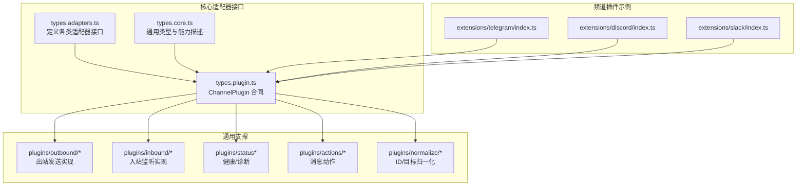
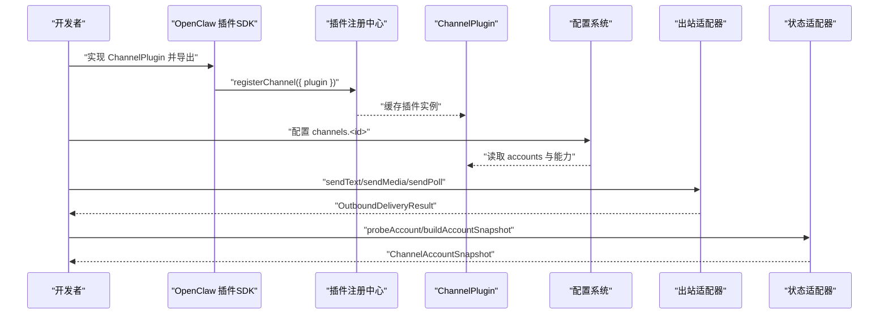
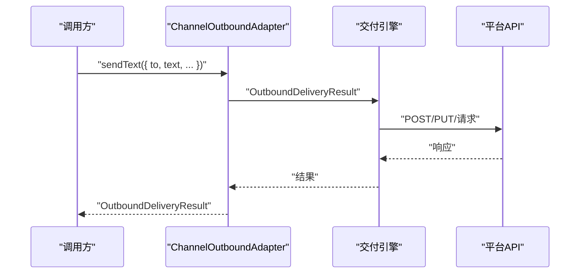
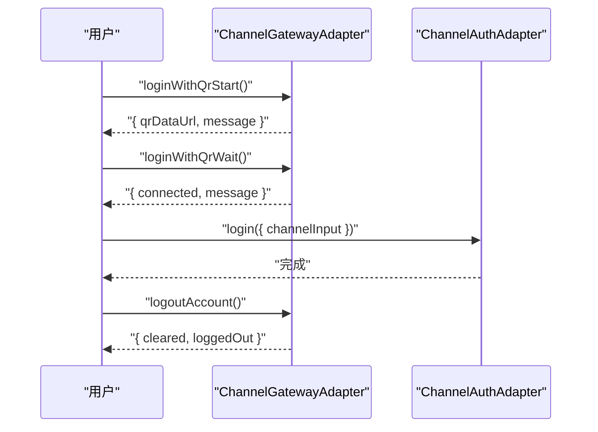
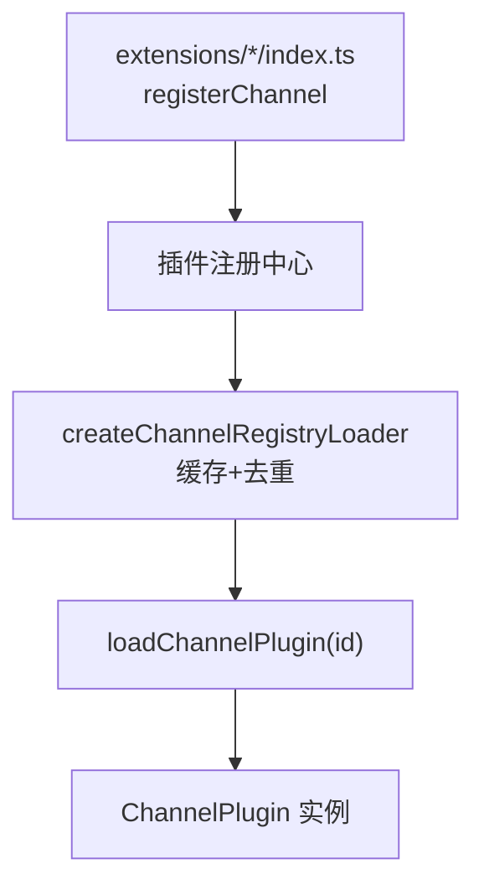
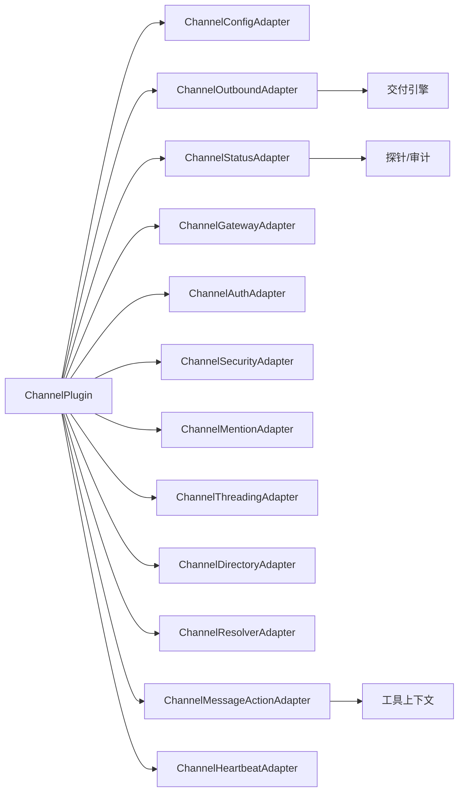

# 频道适配器开发

<cite>
**本文引用的文件**
- [src/channels/plugins/types.adapters.ts](file://src/channels/plugins/types.adapters.ts)
- [src/channels/plugins/types.core.ts](file://src/channels/plugins/types.core.ts)
- [src/channels/plugins/types.plugin.ts](file://src/channels/plugins/types.plugin.ts)
- [src/channels/plugins/pairing.ts](file://src/channels/plugins/pairing.ts)
- [src/channels/plugins/load.ts](file://src/channels/plugins/load.ts)
- [src/channels/plugins/registry-loader.ts](file://src/channels/plugins/registry-loader.ts)
- [extensions/telegram/index.ts](file://extensions/telegram/index.ts)
- [extensions/discord/index.ts](file://extensions/discord/index.ts)
- [extensions/slack/index.ts](file://extensions/slack/index.ts)
- [docs/zh-CN/tools/plugin.md](file://docs/zh-CN/tools/plugin.md)
- [docs/gateway/configuration.md](file://docs/gateway/configuration.md)
- [src/config/group-policy.ts](file://src/config/group-policy.ts)
- [src/channels/chat-type.ts](file://src/channels/chat-type.ts)
- [src/channels/registry.ts](file://src/channels/registry.ts)
- [src/utils/message-channel.ts](file://src/utils/message-channel.ts)
- [src/channels/plugins/account-helpers.ts](file://src/channels/plugins/account-helpers.ts)
- [src/channels/plugins/helpers.ts](file://src/channels/plugins/helpers.ts)
- [src/channels/plugins/media-limits.ts](file://src/channels/plugins/media-limits.ts)
- [src/channels/plugins/media-payload.ts](file://src/channels/plugins/media-payload.ts)
- [src/channels/plugins/status.ts](file://src/channels/plugins/status.ts)
- [src/channels/plugins/status-issues/shared.ts](file://src/channels/plugins/status-issues/shared.ts)
- [src/channels/plugins/status-issues/discord.ts](file://src/channels/plugins/status-issues/discord.ts)
- [src/channels/plugins/status-issues/telegram.ts](file://src/channels/plugins/status-issues/telegram.ts)
- [src/channels/plugins/status-issues/whatsapp.ts](file://src/channels/plugins/status-issues/whatsapp.ts)
- [src/channels/plugins/status-issues/bluebubbles.ts](file://src/channels/plugins/status-issues/bluebubbles.ts)
- [src/channels/plugins/outbound/load.ts](file://src/channels/plugins/outbound/load.ts)
- [src/channels/plugins/outbound/direct-text-media.ts](file://src/channels/plugins/outbound/direct-text-media.ts)
- [src/channels/plugins/outbound/telegram.ts](file://src/channels/plugins/outbound/telegram.ts)
- [src/channels/plugins/outbound/discord.ts](file://src/channels/plugins/outbound/discord.ts)
- [src/channels/plugins/outbound/signal.ts](file://src/channels/plugins/outbound/signal.ts)
- [src/channels/plugins/outbound/imessage.ts](file://src/channels/plugins/outbound/imessage.ts)
- [src/channels/plugins/outbound/whatsapp.ts](file://src/channels/plugins/outbound/whatsapp.ts)
- [src/channels/plugins/actions/shared.ts](file://src/channels/plugins/actions/shared.ts)
- [src/channels/plugins/actions/telegram.ts](file://src/channels/plugins/actions/telegram.ts)
- [src/channels/plugins/actions/discord.ts](file://src/channels/plugins/actions/discord.ts)
- [src/channels/plugins/actions/signal.ts](file://src/channels/plugins/actions/signal.ts)
- [src/channels/plugins/onboarding/helpers.ts](file://src/channels/plugins/onboarding/helpers.ts)
- [src/channels/plugins/onboarding/telegram.ts](file://src/channels/plugins/onboarding/telegram.ts)
- [src/channels/plugins/onboarding/discord.ts](file://src/channels/plugins/onboarding/discord.ts)
- [src/channels/plugins/onboarding/imessage.ts](file://src/channels/plugins/onboarding/imessage.ts)
- [src/channels/plugins/onboarding/whatsapp.ts](file://src/channels/plugins/onboarding/whatsapp.ts)
- [src/channels/plugins/normalize/telegram.ts](file://src/channels/plugins/normalize/telegram.ts)
- [src/channels/plugins/normalize/discord.ts](file://src/channels/plugins/normalize/discord.ts)
- [src/channels/plugins/normalize/signal.ts](file://src/channels/plugins/normalize/signal.ts)
- [src/channels/plugins/normalize/imessage.ts](file://src/channels/plugins/normalize/imessage.ts)
- [src/channels/plugins/normalize/shared.ts](file://src/channels/plugins/normalize/shared.ts)
- [src/channels/plugins/normalize/whatsapp.ts](file://src/channels/plugins/normalize/whatsapp.ts)
- [src/channels/plugins/whatsapp-heartbeat.ts](file://src/channels/plugins/whatsapp-heartbeat.ts)
- [src/channels/plugins/whatsapp-heartbeat.test.ts](file://src/channels/plugins/whatsapp-heartbeat.test.ts)
- [src/channels/plugins/group-mentions.ts](file://src/channels/plugins/group-mentions.ts)
- [src/channels/plugins/group-mentions.test.ts](file://src/channels/plugins/group-mentions.test.ts)
- [src/channels/plugins/message-actions.ts](file://src/channels/plugins/message-actions.ts)
- [src/channels/plugins/message-actions.test.ts](file://src/channels/plugins/message-actions.test.ts)
- [src/channels/plugins/message-actions.security.test.ts](file://src/channels/plugins/message-actions.security.test.ts)
- [src/channels/plugins/agent-tools/whatsapp-login.ts](file://src/channels/plugins/agent-tools/whatsapp-login.ts)
- [src/channels/plugins/account-action-gate.ts](file://src/channels/plugins/account-action-gate.ts)
- [src/channels/plugins/account-action-gate.test.ts](file://src/channels/plugins/account-action-gate.test.ts)
- [src/channels/plugins/directory-config.ts](file://src/channels/plugins/directory-config.ts)
- [src/channels/plugins/config-schema.ts](file://src/channels/plugins/config-schema.ts)
- [src/channels/plugins/config-schema.test.ts](file://src/channels/plugins/config-schema.test.ts)
- [src/channels/plugins/config-helpers.ts](file://src/channels/plugins/config-helpers.ts)
- [src/channels/plugins/config-writes.ts](file://src/channels/plugins/config-writes.ts)
- [src/channels/plugins/setup-helpers.ts](file://src/channels/plugins/setup-helpers.ts)
- [src/channels/plugins/allowlist-match.ts](file://src/channels/plugins/allowlist-match.ts)
- [src/channels/plugins/allowlist-match.test.ts](file://src/channels/plugins/allowlist-match.test.ts)
- [src/channels/plugins/allowlists/resolve-utils.ts](file://src/channels/plugins/allowlists/resolve-utils.ts)
- [src/channels/plugins/allowlists/resolve-utils.test.ts](file://src/channels/plugins/allowlists/resolve-utils.test.ts)
- [src/channels/plugins/normalize/targets.test.ts](file://src/channels/plugins/normalize/targets.test.ts)
- [src/channels/plugins/normalize/telegram.test.ts](file://src/channels/plugins/normalize/telegram.test.ts)
- [src/channels/plugins/normalize/discord.test.ts](file://src/channels/plugins/normalize/discord.test.ts)
- [src/channels/plugins/normalize/signal.test.ts](file://src/channels/plugins/normalize/signal.test.ts)
- [src/channels/plugins/normalize/imessage.test.ts](file://src/channels/plugins/normalize/imessage.test.ts)
- [src/channels/plugins/normalize/whatsapp.test.ts](file://src/channels/plugins/normalize/whatsapp.test.ts)
- [src/channels/plugins/normalize/telegram.ts](file://src/channels/plugins/normalize/telegram.ts)
- [src/channels/plugins/normalize/discord.ts](file://src/channels/plugins/normalize/discord.ts)
- [src/channels/plugins/normalize/signal.ts](file://src/channels/plugins/normalize/signal.ts)
- [src/channels/plugins/normalize/imessage.ts](file://src/channels/plugins/normalize/imessage.ts)
- [src/channels/plugins/normalize/shared.ts](file://src/channels/plugins/normalize/shared.ts)
- [src/channels/plugins/normalize/whatsapp.ts](file://src/channels/plugins/normalize/whatsapp.ts)
- [src/channels/plugins/normalize/targets.test.ts](file://src/channels/plugins/normalize/targets.test.ts)
- [src/channels/plugins/normalize/telegram.test.ts](file://src/channels/plugins/normalize/telegram.test.ts)
- [src/channels/plugins/normalize/discord.test.ts](file://src/channels/plugins/normalize/discord.test.ts)
- [src/channels/plugins/normalize/signal.test.ts](file://src/channels/plugins/normalize/signal.test.ts)
- [src/channels/plugins/normalize/imessage.test.ts](file://src/channels/plugins/normalize/imessage.test.ts)
- [src/channels/plugins/normalize/whatsapp.test.ts](file://src/channels/plugins/normalize/whatsapp.test.ts)
- [src/channels/plugins/normalize/telegram.ts](file://src/channels/plugins/normalize/telegram.ts)
- [src/channels/plugins/normalize/discord.ts](file://src/channels/plugins/normalize/discord.ts)
- [src/channels/plugins/normalize/signal.ts](file://src/channels/plugins/normalize/signal.ts)
- [src/channels/plugins/normalize/imessage.ts](file://src/channels/plugins/normalize/imessage.ts)
- [src/channels/plugins/normalize/shared.ts](file://src/channels/plugins/normalize/shared.ts)
- [src/channels/plugins/normalize/whatsapp.ts](file://src/channels/plugins/normalize/whatsapp.ts)
- [src/channels/plugins/normalize/targets.test.ts](file://src/channels/plugins/normalize/targets.test.ts)
- [src/channels/plugins/normalize/telegram.test.ts](file://src/channels/plugins/normalize/telegram.test.ts)
- [src/channels/plugins/normalize/discord.test.ts](file://src/channels/plugins/normalize/discord.test.ts)
- [src/channels/plugins/normalize/signal.test.ts](file://src/channels/plugins/normalize/signal.test.ts)
- [src/channels/plugins/normalize/imessage.test.ts](file://src/channels/plugins/normalize/imessage.test.ts)
- [src/channels/plugins/normalize/whatsapp.test.ts](file://src/channels/plugins/normalize/whatsapp.test.ts)
- [src/channels/plugins/normalize/telegram.ts](file://src/channels/plugins/normalize/telegram.ts)
- [src/channels/plugins/normalize/discord.ts](file://src/channels/plugins/normalize/discord.ts)
- [src/channels/plugins/normalize/signal.ts](file://src/channels/plugins/normalize/signal.ts)
- [src/channels/plugins/normalize/imessage.ts](file://src/channels/plugins/normalize/imessage.ts)
- [src/channels/plugins/normalize/shared.ts](file://src/channels/plugins/normalize/shared.ts)
- [src/channels/plugins/normalize/whatsapp.ts](file://src/channels/plugins/normalize/whatsapp.ts)
- [src/channels/plugins/normalize/targets.test.ts](file://src/channels/plugins/normalize/targets.test.ts)
- [src/channels/plugins/normalize/telegram.test.ts](file://src/channels/plugins/normalize/telegram.test.ts)
- [src/channels/plugins/normalize/discord.test.ts](file://src/channels/plugins/normalize/discord.test.ts)
- [src/channels/plugins/normalize/signal.test.ts](file://src/channels/plugins/normalize/signal.test.ts)
- [src/channels/plugins/normalize/imessage.test.ts](file://src/channels/plugins/normalize/imessage.test.ts)
- [src/channels/plugins/normalize/whatsapp.test.ts](file://src/channels/plugins/normalize/whatsapp.test.ts)
- [src/channels/plugins/normalize/telegram.ts](file://src/channels/plugins/normalize/telegram.ts)
- [src/channels/plugins/normalize/discord.ts](file://src/channels/plugins/normalize/discord.ts)
- [src/channels/plugins/normalize/signal.ts](file://src/channels/plugins/normalize/signal.ts)
- [src/channels/plugins/normalize/imessage.ts](file://src/channels/plugins/normalize/imessage.ts)
- [src/channels/plugins/normalize/shared.ts](file://src/channels/plugins/normalize/shared.ts)
- [src/channels/plugins/normalize/whatsapp.ts](file://src/channels/plugins/normalize/whatsapp.ts)
- [src/channels/plugins/normalize/targets.test.ts](file://src/channels/plugins/normalize/targets.test.ts)
- [src/channels/plugins/normalize/telegram.test.ts](file://src/channels/plugins/normalize/telegram.test.ts)
- [src/channels/plugins/normalize/discord.test.ts](file://src/channels/plugins/normalize/discord.test.ts)
- [src/channels/plugins/normalize/signal.test.ts](file://src/channels/plugins/normalize/signal.test.ts)
- [src/channels/plugins/normalize/imessage.test.ts](file://src/channels/plugins/normalize/imessage.test.ts)
- [src/channels/plugins/normalize/whatsapp.test.ts](file://src/channels/plugins/normalize/whatsapp.test.ts)
- [src/channels/plugins/normalize/telegram.ts](file://src/channels/plugins/normalize/telegram.ts)
- [src/channels/plugins/normalize/discord.ts](file://src/channels/plugins/normalize/discord.ts)
- [src/channels/plugins/normalize/signal.ts](file://src/channels/plugins/normalize/signal.ts)
- [src/channels/plugins/normalize/imessage.ts](file://src/channels/plugins/normalize/imessage.ts)
- [src/channels/plugins/normalize/shared.ts](file://src/channels/plugins/normalize/shared.ts)
- [src/channels/plugins/normalize/whatsapp.ts](file://src/channels/plugins/normalize/whatsapp.ts)
- [src/channels/plugins/normalize/targets.test.ts](file://src/channels/plugins/normalize/targets.test.ts)
- [src/channels/plugins/normalize/telegram.test.ts](file://src/channels/plugins/normalize/telegram.test.ts)
- [src/channels/plugins/normalize/discord.test.ts](file://src/channels/plugins/normalize/discord.test.ts)
- [src/channels/plugins/normalize/signal.test.ts](file://src/channels/plugins/normalize/signal.test.ts)
- [src/channels/plugins/normalize/imessage.test.ts](file://src/channels/plugins/normalize/imessage.test.ts)
- [src/channels/plugins/normalize/whatsapp.test.ts](file://src/channels/plugins/normalize/whatsapp.test.ts)
- [src/channels/plugins/normalize/telegram.ts](file://src/channels/plugins/normalize/telegram.ts)
- [src/channels/plugins/normalize/discord.ts](file://src/channels/plugins/normalize/discord.ts)
- [src/channels/plugins/normalize/signal.ts](file://src/channels/plugins/normalize/signal.ts)
- [src/channels/plugins/normalize/imessage.ts](file://src/channels/plugins/normalize/imessage.ts)
- [src/channels/plugins/normalize/shared.ts](file://src/channels/plugins/normalize/shared.ts)
- [src/channels/plugins/normalize/whatsapp.ts](file://src/channels/plugins/normalize/whatsapp.ts)
- [src/channels/plugins/normalize/targets.test.ts](file://src/channels/plugins/normalize/targets.test.ts)
- [src/channels/plugins/normalize/telegram.test.ts](file://src/channels/plugins/normalize/telegram.test.ts)
- [src/channels/plugins/normalize/discord.test.ts](file://src/channels/plugins/normalize/discord.test.ts)
- [src/channels/plugins/normalize/signal.test.ts](file://src/channels......)
</cite>

## 目录

1. [简介](#简介)
2. [项目结构](#项目结构)
3. [核心组件](#核心组件)
4. [架构总览](#架构总览)
5. [详细组件分析](#详细组件分析)
6. [依赖关系分析](#依赖关系分析)
7. [性能考量](#性能考量)
8. [故障排查指南](#故障排查指南)
9. [结论](#结论)
10. [附录](#附录)

## 简介

本指南面向为新的即时通讯平台开发“频道适配器”的工程师，系统讲解如何基于 OpenClaw 的插件化架构实现一个完整的消息渠道适配器。内容涵盖：

- 频道适配器的核心接口与职责边界
- 消息收发、用户认证、群组管理、状态监控等关键能力
- 项目结构与文件组织规范
- 开发示例路径（以 Telegram、Discord、Slack 为例）
- 配置模式、认证流程与错误处理机制
- 调试技巧与常见问题解决方案

## 项目结构

OpenClaw 将“频道”抽象为插件，通过统一的适配器接口对接不同平台。核心目录与角色如下：

- src/channels/plugins：适配器接口定义与通用实现
- extensions：各平台频道插件入口与运行时绑定
- docs：官方文档与最佳实践
- src/channels：频道相关工具、状态、动作、归一化等支撑模块

图表来源

- [src/channels/plugins/types.adapters.ts](file://src/channels/plugins/types.adapters.ts#L1-L320)
- [src/channels/plugins/types.core.ts](file://src/channels/plugins/types.core.ts#L1-L372)
- [src/channels/plugins/types.plugin.ts](file://src/channels/plugins/types.plugin.ts#L1-L86)
- [extensions/telegram/index.ts](file://extensions/telegram/index.ts#L1-L18)
- [extensions/discord/index.ts](file://extensions/discord/index.ts#L1-L20)
- [extensions/slack/index.ts](file://extensions/slack/index.ts#L1-L18)

章节来源

- [src/channels/plugins/types.adapters.ts](file://src/channels/plugins/types.adapters.ts#L1-L320)
- [src/channels/plugins/types.core.ts](file://src/channels/plugins/types.core.ts#L1-L372)
- [src/channels/plugins/types.plugin.ts](file://src/channels/plugins/types.plugin.ts#L1-L86)
- [extensions/telegram/index.ts](file://extensions/telegram/index.ts#L1-L18)
- [extensions/discord/index.ts](file://extensions/discord/index.ts#L1-L20)
- [extensions/slack/index.ts](file://extensions/slack/index.ts#L1-L18)

## 核心组件

- ChannelPlugin 合同：定义频道插件的 id、meta、capabilities、以及可选的适配器集合
- 适配器接口族：包括配置、出站、状态、网关、认证、安全、提及、线程、目录、解析器、消息动作、心跳等
- 通用类型：账号快照、能力描述、消息动作名称、线程上下文、日志 sink 等

章节来源

- [src/channels/plugins/types.plugin.ts](file://src/channels/plugins/types.plugin.ts#L49-L86)
- [src/channels/plugins/types.adapters.ts](file://src/channels/plugins/types.adapters.ts#L51-L320)
- [src/channels/plugins/types.core.ts](file://src/channels/plugins/types.core.ts#L76-L372)

## 架构总览

频道适配器通过 ChannelPlugin 注册到系统，系统按需调用其适配器完成消息收发、状态监控、认证登录、群组管理等任务。

图表来源

- [extensions/telegram/index.ts](file://extensions/telegram/index.ts#L11-L14)
- [src/channels/plugins/types.plugin.ts](file://src/channels/plugins/types.plugin.ts#L49-L86)
- [src/channels/plugins/types.adapters.ts](file://src/channels/plugins/types.adapters.ts#L106-L164)

## 详细组件分析

### 适配器接口族与职责

- 配置适配器 ChannelConfigAdapter：负责列出账号、解析账号、启用/删除账号、描述账号、允许来源与默认目标解析等
- 出站适配器 ChannelOutboundAdapter：负责投递模式（direct/gateway/hybrid）、文本/媒体/Poll 发送、目标解析、分片策略等
- 状态适配器 ChannelStatusAdapter：负责探针、审计、构建账号快照、状态汇总、问题收集等
- 网关适配器 ChannelGatewayAdapter：负责账号生命周期（启动/停止）、二维码登录（开始/等待）、登出
- 认证适配器 ChannelAuthAdapter：负责一次性登录流程
- 安全适配器 ChannelSecurityAdapter：负责私信策略（DM Policy）、警告收集
- 提及适配器 ChannelMentionAdapter：负责提及剥离与格式化
- 线程适配器 ChannelThreadingAdapter：负责回复模式、线程上下文构建
- 目录适配器 ChannelDirectoryAdapter：负责自述、列出用户/群组、成员查询
- 解析器适配器 ChannelResolverAdapter：负责用户/群组 ID 解析
- 消息动作适配器 ChannelMessageActionAdapter：负责列出/支持/处理消息动作（按钮/卡片/工具）
- 心跳适配器 ChannelHeartbeatAdapter：负责就绪检查、收件人解析
- 其他：配对（pairing）、提升（elevated）、命令（commands）、流式（streaming）

章节来源

- [src/channels/plugins/types.adapters.ts](file://src/channels/plugins/types.adapters.ts#L51-L320)
- [src/channels/plugins/types.core.ts](file://src/channels/plugins/types.core.ts#L171-L341)

### ChannelPlugin 合同与最小实现

- 最小插件至少包含：id、meta、capabilities、config、outbound
- 可选增强：setup、security、status、gateway、mentions、threading、streaming、directory、resolver、actions、heartbeat、commands、agentTools

章节来源

- [docs/zh-CN/tools/plugin.md](file://docs/zh-CN/tools/plugin.md#L404-L484)
- [src/channels/plugins/types.plugin.ts](file://src/channels/plugins/types.plugin.ts#L49-L86)

### 出站发送流程（以 Telegram 为例）

- 出站适配器 sendText/sendMedia/sendPoll
- 支持分片策略与目标解析
- 与基础设施（deliver/identity）协作

图表来源

- [src/channels/plugins/types.adapters.ts](file://src/channels/plugins/types.adapters.ts#L106-L123)
- [src/channels/plugins/outbound/telegram.ts](file://src/channels/plugins/outbound/telegram.ts)
- [src/channels/plugins/outbound/load.ts](file://src/channels/plugins/outbound/load.ts)

章节来源

- [src/channels/plugins/outbound/telegram.ts](file://src/channels/plugins/outbound/telegram.ts)
- [src/channels/plugins/outbound/load.ts](file://src/channels/plugins/outbound/load.ts)

### 网关与认证流程（以 WhatsApp 登录为例）

- 网关启动/停止：startAccount/stopAccount
- 二维码登录：loginWithQrStart/loginWithQrWait
- 登出：logoutAccount
- 认证：login（一次性）

图表来源

- [src/channels/plugins/types.adapters.ts](file://src/channels/plugins/types.adapters.ts#L211-L235)
- [src/channels/plugins/agent-tools/whatsapp-login.ts](file://src/channels/plugins/agent-tools/whatsapp-login.ts)

章节来源

- [src/channels/plugins/types.adapters.ts](file://src/channels/plugins/types.adapters.ts#L211-L235)
- [src/channels/plugins/agent-tools/whatsapp-login.ts](file://src/channels/plugins/agent-tools/whatsapp-login.ts)

### 群组管理与 DM 策略

- 群组策略：open/allowlist/disabled
- DM 策略：pairing/allowlist/open/disabled
- 允许来源解析与格式化
- 群组提及与工具策略

章节来源

- [src/config/group-policy.ts](file://src/config/group-policy.ts#L282-L323)
- [docs/gateway/configuration.md](file://docs/gateway/configuration.md#L90-L103)
- [src/channels/plugins/group-mentions.ts](file://src/channels/plugins/group-mentions.ts)
- [src/channels/plugins/group-mentions.test.ts](file://src/channels/plugins/group-mentions.test.ts)

### 目录与解析器

- 自述/列表/成员查询
- 用户/群组 ID 解析与显示格式化
- 目标归一化与提示

章节来源

- [src/channels/plugins/types.adapters.ts](file://src/channels/plugins/types.adapters.ts#L271-L300)
- [src/channels/plugins/normalize/shared.ts](file://src/channels/plugins/normalize/shared.ts)
- [src/channels/plugins/normalize/telegram.ts](file://src/channels/plugins/normalize/telegram.ts)
- [src/channels/plugins/normalize/discord.ts](file://src/channels/plugins/normalize/discord.ts)
- [src/channels/plugins/normalize/signal.ts](file://src/channels/plugins/normalize/signal.ts)
- [src/channels/plugins/normalize/imessage.ts](file://src/channels/plugins/normalize/imessage.ts)
- [src/channels/plugins/normalize/whatsapp.ts](file://src/channels/plugins/normalize/whatsapp.ts)

### 消息动作与按钮/卡片支持

- 列出/支持/处理消息动作
- 提取工具发送参数
- 安全校验与干跑模式

章节来源

- [src/channels/plugins/types.adapters.ts](file://src/channels/plugins/types.adapters.ts#L334-L341)
- [src/channels/plugins/actions/shared.ts](file://src/channels/plugins/actions/shared.ts)
- [src/channels/plugins/actions/telegram.ts](file://src/channels/plugins/actions/telegram.ts)
- [src/channels/plugins/actions/discord.ts](file://src/channels/plugins/actions/discord.ts)
- [src/channels/plugins/actions/signal.ts](file://src/channels/plugins/actions/signal.ts)

### 心跳与收件人解析

- 就绪检查与原因
- 收件人解析（to/all）

章节来源

- [src/channels/plugins/types.adapters.ts](file://src/channels/plugins/types.adapters.ts#L237-L247)

### 配置模式与 UI 提示

- 配置 Schema 与 UI Hint
- 配置写入与校验
- 设置向导辅助

章节来源

- [src/channels/plugins/types.plugin.ts](file://src/channels/plugins/types.plugin.ts#L32-L46)
- [src/channels/plugins/config-schema.ts](file://src/channels/plugins/config-schema.ts)
- [src/channels/plugins/config-schema.test.ts](file://src/channels/plugins/config-schema.test.ts)
- [src/channels/plugins/config-helpers.ts](file://src/channels/plugins/config-helpers.ts)
- [src/channels/plugins/config-writes.ts](file://src/channels/plugins/config-writes.ts)
- [src/channels/plugins/setup-helpers.ts](file://src/channels/plugins/setup-helpers.ts)

### 插件加载与注册

- 从插件注册中心加载频道插件
- 通过扩展入口注册并绑定运行时

图表来源

- [extensions/telegram/index.ts](file://extensions/telegram/index.ts#L11-L14)
- [src/channels/plugins/registry-loader.ts](file://src/channels/plugins/registry-loader.ts#L9-L35)
- [src/channels/plugins/load.ts](file://src/channels/plugins/load.ts#L4-L8)

章节来源

- [src/channels/plugins/registry-loader.ts](file://src/channels/plugins/registry-loader.ts#L9-L35)
- [src/channels/plugins/load.ts](file://src/channels/plugins/load.ts#L4-L8)
- [extensions/telegram/index.ts](file://extensions/telegram/index.ts#L11-L14)
- [extensions/discord/index.ts](file://extensions/discord/index.ts#L12-L15)
- [extensions/slack/index.ts](file://extensions/slack/index.ts#L11-L14)

## 依赖关系分析

- ChannelPlugin 依赖适配器接口族；适配器之间低耦合，通过 OpenClawConfig、RuntimeEnv、ChannelAccountSnapshot 等共享上下文
- 出站适配器依赖交付引擎与身份信息；状态适配器依赖探针与审计；消息动作依赖工具上下文
- 插件加载器与注册中心解耦扩展与核心

图表来源

- [src/channels/plugins/types.plugin.ts](file://src/channels/plugins/types.plugin.ts#L49-L86)
- [src/channels/plugins/types.adapters.ts](file://src/channels/plugins/types.adapters.ts#L51-L320)

章节来源

- [src/channels/plugins/types.plugin.ts](file://src/channels/plugins/types.plugin.ts#L49-L86)
- [src/channels/plugins/types.adapters.ts](file://src/channels/plugins/types.adapters.ts#L51-L320)

## 性能考量

- 分片与限速：合理设置 textChunkLimit 与 pollMaxOptions，避免触发平台速率限制
- 目标解析缓存：对解析结果进行缓存，减少重复解析开销
- 状态探针与审计：适度降低探针频率，避免对上游造成压力
- 流式输出：根据 streaming 配置与 blockStreamingCoalesceDefaults 调整合并策略
- 媒体上传：控制并发与分块大小，结合媒体限制策略

## 故障排查指南

- 状态问题收集：使用 status.collectStatusIssues 统一收集并上报
- 健康检查：probeAccount/auditAccount 输出详细错误信息
- DM/群组策略：核对 dmPolicy 与 allowFrom 配置，必要时回退到 open
- 目标解析：检查 normalize 与 resolveTarget 结果，确认 ID 规范化
- 动作安全：启用 message-actions.security 校验，避免越权操作
- 心跳与收件人：检查 resolveRecipients 与 checkReady 返回值
- 账号生命周期：确认 startAccount/stopAccount 与 loginWithQr 流程无阻塞

章节来源

- [src/channels/plugins/status.ts](file://src/channels/plugins/status.ts)
- [src/channels/plugins/status-issues/shared.ts](file://src/channels/plugins/status-issues/shared.ts)
- [src/channels/plugins/status-issues/discord.ts](file://src/channels/plugins/status-issues/discord.ts)
- [src/channels/plugins/status-issues/telegram.ts](file://src/channels/plugins/status-issues/telegram.ts)
- [src/channels/plugins/status-issues/whatsapp.ts](file://src/channels/plugins/status-issues/whatsapp.ts)
- [src/channels/plugins/status-issues/bluebubbles.ts](file://src/channels/plugins/status-issues/bluebubbles.ts)
- [src/channels/plugins/message-actions.security.test.ts](file://src/channels/plugins/message-actions.security.test.ts)

## 结论

通过遵循 ChannelPlugin 合同与适配器接口族，开发者可以快速为新平台实现一个功能完备、可维护的频道适配器。建议从最小实现起步，逐步完善出站、状态、认证、群组与动作等能力，并结合官方文档与现有插件示例进行对照开发。

## 附录

### 开发步骤清单

- 选择 id 与配置结构（channels.<id> 与 accounts.<accountId>）
- 定义 meta、capabilities、config、outbound
- 可选：setup、security、status、gateway、mentions、threading、streaming、directory、resolver、actions、heartbeat、commands、agentTools
- 在扩展入口注册插件并绑定运行时
- 编写配置 Schema 与 UI Hint
- 实现出站发送、状态探针、认证登录、群组与 DM 策略
- 编写测试与诊断脚本

章节来源

- [docs/zh-CN/tools/plugin.md](file://docs/zh-CN/tools/plugin.md#L404-L484)
- [extensions/telegram/index.ts](file://extensions/telegram/index.ts#L11-L14)
- [extensions/discord/index.ts](file://extensions/discord/index.ts#L12-L15)
- [extensions/slack/index.ts](file://extensions/slack/index.ts#L11-L14)
