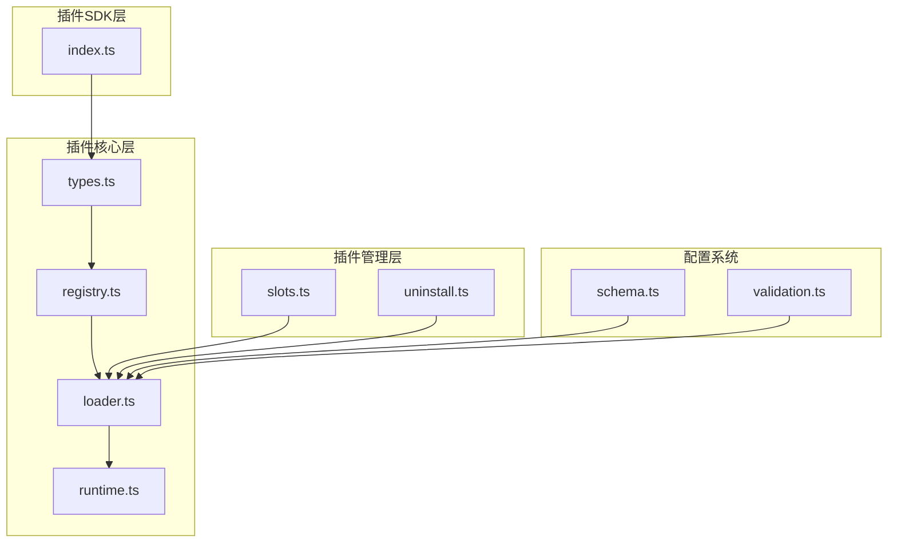
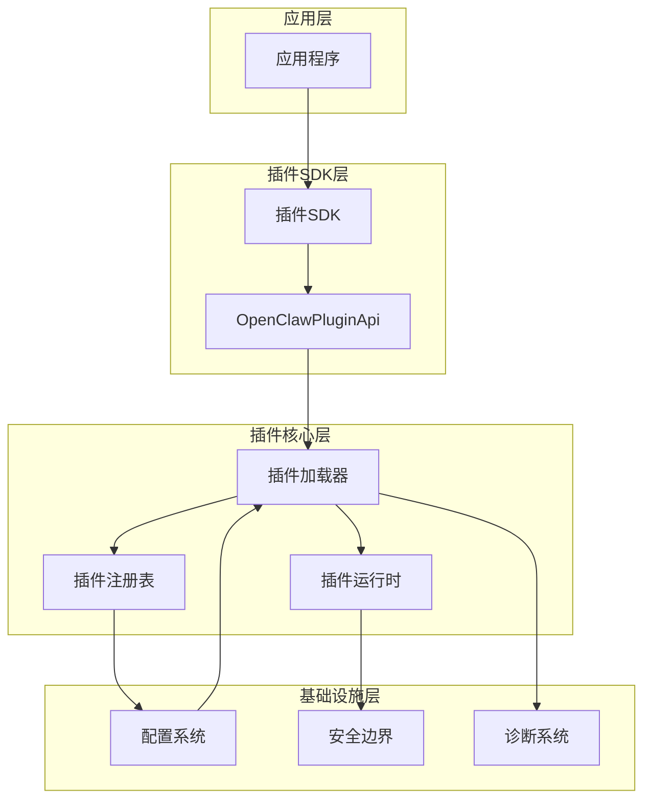
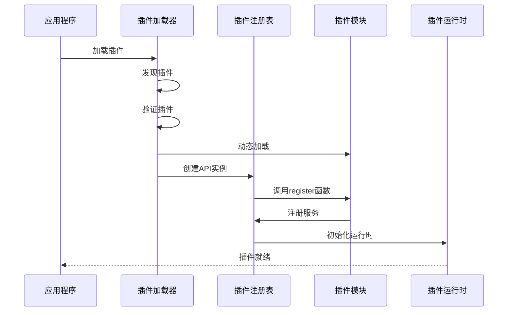
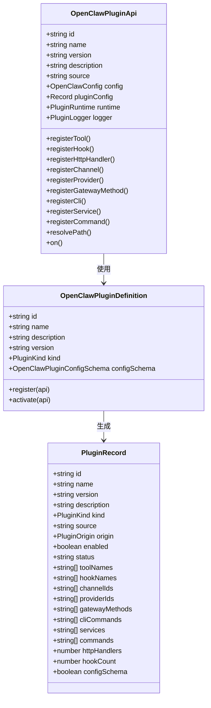
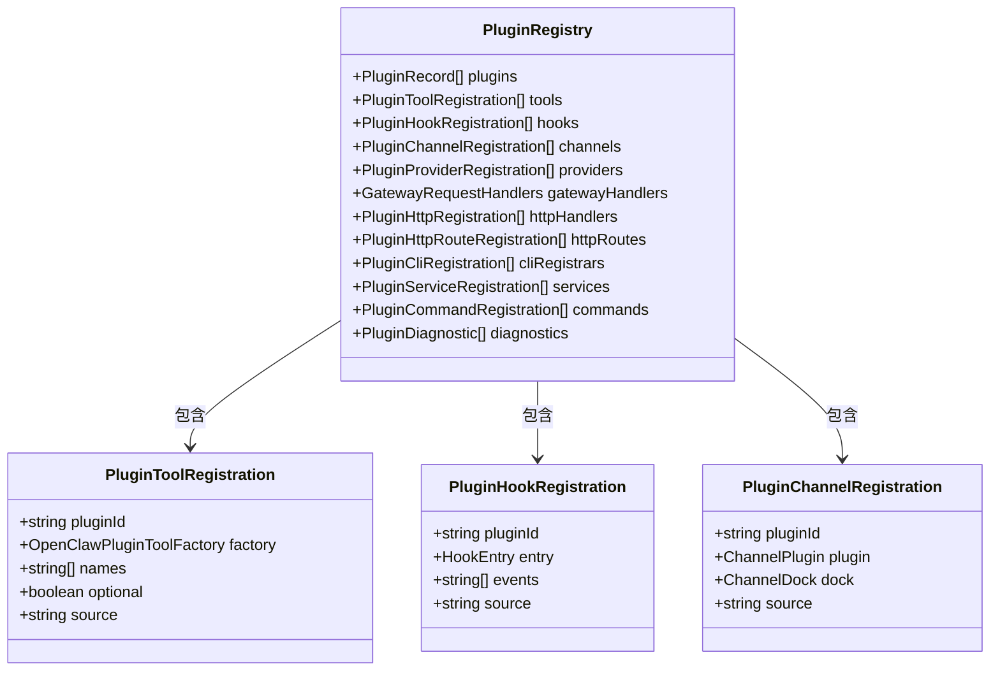
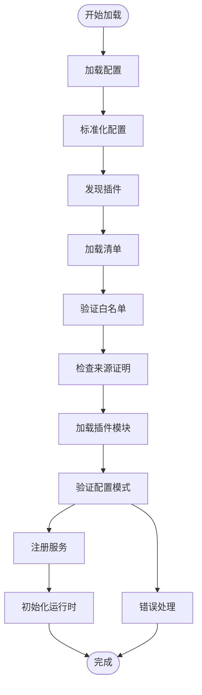
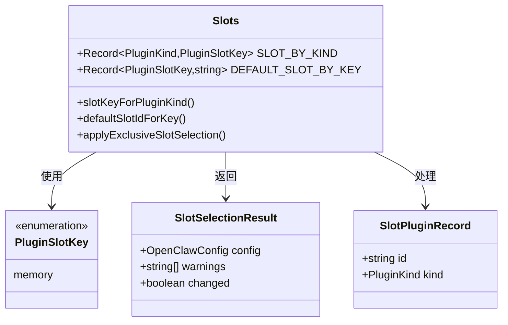
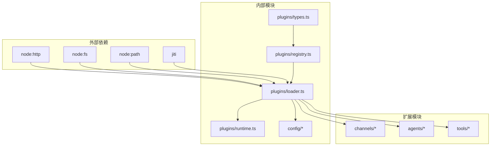
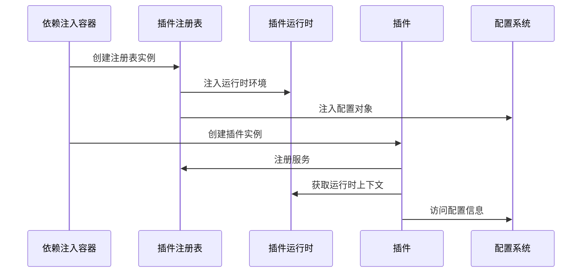
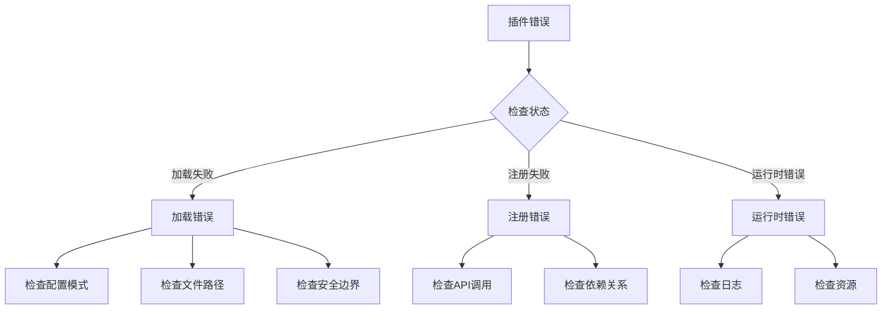

# 插件架构设计

<cite>
**本文档引用的文件**
- [src/plugin-sdk/index.ts](file://src/plugin-sdk/index.ts)
- [src/plugins/types.ts](file://src/plugins/types.ts)
- [src/plugins/registry.ts](file://src/plugins/registry.ts)
- [src/plugins/loader.ts](file://src/plugins/loader.ts)
- [src/plugins/runtime.ts](file://src/plugins/runtime.ts)
- [src/plugins/slots.ts](file://src/plugins/slots.ts)
- [src/plugins/uninstall.ts](file://src/plugins/uninstall.ts)
- [src/config/schema.ts](file://src/config/schema.ts)
- [src/config/validation.ts](file://src/config/validation.ts)
- [docs/zh-CN/refactor/plugin-sdk.md](file://docs/zh-CN/refactor/plugin-sdk.md)
</cite>

## 目录

1. [简介](#简介)
2. [项目结构](#项目结构)
3. [核心组件](#核心组件)
4. [架构概览](#架构概览)
5. [详细组件分析](#详细组件分析)
6. [依赖分析](#依赖分析)
7. [性能考虑](#性能考虑)
8. [故障排除指南](#故障排除指南)
9. [结论](#结论)

## 简介

OpenClaw插件架构是一个高度模块化和可扩展的系统，允许开发者通过插件机制扩展核心功能。该架构设计遵循以下核心原则：

- **模块化设计**：每个插件都是独立的功能模块，可以单独开发、测试和部署
- **强类型系统**：使用TypeScript确保类型安全和更好的开发体验
- **插件隔离**：通过沙箱机制和边界检查确保插件间的隔离性
- **配置驱动**：通过配置文件控制插件的启用、禁用和参数设置
- **生命周期管理**：完整的插件生命周期包括发现、加载、注册、激活等阶段

## 项目结构

OpenClaw插件系统的核心文件组织如下：

**图表来源**

- [src/plugin-sdk/index.ts](file://src/plugin-sdk/index.ts#L1-L597)
- [src/plugins/types.ts](file://src/plugins/types.ts#L1-L764)
- [src/plugins/registry.ts](file://src/plugins/registry.ts#L1-L520)
- [src/plugins/loader.ts](file://src/plugins/loader.ts#L1-L726)

**章节来源**

- [src/plugin-sdk/index.ts](file://src/plugin-sdk/index.ts#L1-L597)
- [src/plugins/types.ts](file://src/plugins/types.ts#L1-L764)

## 核心组件

### 插件SDK接口

插件SDK提供了统一的接口定义，包括：

- **OpenClawPluginApi**：插件API接口，提供注册工具、钩子、HTTP处理器等功能
- **OpenClawPluginDefinition**：插件定义接口，包含插件的基本信息和注册函数
- **PluginRuntime**：运行时环境接口，提供插件运行所需的上下文信息

### 插件注册表

插件注册表负责管理所有已加载的插件及其注册的服务：

- **PluginRegistry**：核心注册表，存储插件记录和各种注册的服务
- **PluginRecord**：单个插件的元数据记录
- **注册服务类型**：工具、钩子、HTTP处理器、通道、提供者等

### 插件加载器

插件加载器实现了完整的插件生命周期管理：

- **发现机制**：扫描和识别可用的插件
- **验证机制**：验证插件配置和安全性
- **加载机制**：动态加载插件模块
- **注册机制**：将插件注册到相应的服务中

**章节来源**

- [src/plugins/types.ts](file://src/plugins/types.ts#L245-L284)
- [src/plugins/registry.ts](file://src/plugins/registry.ts#L124-L138)
- [src/plugins/loader.ts](file://src/plugins/loader.ts#L368-L717)

## 架构概览

OpenClaw插件架构采用分层设计，确保了良好的模块分离和可维护性：

**图表来源**

- [src/plugin-sdk/index.ts](file://src/plugin-sdk/index.ts#L96-L111)
- [src/plugins/loader.ts](file://src/plugins/loader.ts#L368-L717)
- [src/plugins/registry.ts](file://src/plugins/registry.ts#L164-L519)

### 插件生命周期流程

**图表来源**

- [src/plugins/loader.ts](file://src/plugins/loader.ts#L666-L695)
- [src/plugins/registry.ts](file://src/plugins/registry.ts#L472-L502)

## 详细组件分析

### 插件类型系统

插件类型系统定义了插件的各种接口和类型：

**图表来源**

- [src/plugins/types.ts](file://src/plugins/types.ts#L245-L284)
- [src/plugins/types.ts](file://src/plugins/types.ts#L230-L239)
- [src/plugins/types.ts](file://src/plugins/types.ts#L97-L122)

**章节来源**

- [src/plugins/types.ts](file://src/plugins/types.ts#L1-L764)

### 插件注册表管理

插件注册表提供了完整的插件服务注册和管理功能：

**图表来源**

- [src/plugins/registry.ts](file://src/plugins/registry.ts#L124-L138)
- [src/plugins/registry.ts](file://src/plugins/registry.ts#L37-L71)

**章节来源**

- [src/plugins/registry.ts](file://src/plugins/registry.ts#L1-L520)

### 插件加载流程

插件加载器实现了复杂的加载流程，包括多个验证步骤：

**图表来源**

- [src/plugins/loader.ts](file://src/plugins/loader.ts#L368-L717)

**章节来源**

- [src/plugins/loader.ts](file://src/plugins/loader.ts#L1-L726)

### 插件槽系统

OpenClaw实现了插件槽系统，用于管理特定类型的插件选择：

**图表来源**

- [src/plugins/slots.ts](file://src/plugins/slots.ts#L5-L35)

**章节来源**

- [src/plugins/slots.ts](file://src/plugins/slots.ts#L1-L54)

## 依赖分析

### 组件耦合关系

**图表来源**

- [src/plugins/loader.ts](file://src/plugins/loader.ts#L1-L25)
- [src/plugins/registry.ts](file://src/plugins/registry.ts#L1-L35)

### 依赖注入机制

插件系统采用了基于构造函数的依赖注入模式：

**图表来源**

- [src/plugins/registry.ts](file://src/plugins/registry.ts#L472-L502)

**章节来源**

- [src/plugins/registry.ts](file://src/plugins/registry.ts#L146-L162)

## 性能考虑

### 缓存策略

插件系统实现了多级缓存机制来提高性能：

- **注册表缓存**：缓存已加载的插件注册表，避免重复加载
- **模式验证缓存**：缓存JSON Schema验证结果
- **路径解析缓存**：缓存用户路径解析结果

### 异步加载

插件支持异步加载机制，通过Promise处理插件注册过程：

- **延迟加载**：在需要时才加载插件模块
- **并行处理**：多个插件可以并行加载和验证
- **超时控制**：为插件加载设置超时限制

### 内存管理

插件系统采用了智能的内存管理策略：

- **插件隔离**：每个插件运行在独立的上下文中
- **资源清理**：插件卸载时自动清理资源
- **垃圾回收**：利用JavaScript的垃圾回收机制

## 故障排除指南

### 常见问题诊断

插件系统提供了完善的诊断机制：

**图表来源**

- [src/plugins/loader.ts](file://src/plugins/loader.ts#L187-L210)

### 错误处理策略

插件系统采用分级错误处理策略：

- **致命错误**：直接终止插件加载过程
- **警告**：记录警告信息但继续执行
- **可恢复错误**：尝试自动修复或回退

**章节来源**

- [src/plugins/loader.ts](file://src/plugins/loader.ts#L187-L210)

## 结论

OpenClaw插件架构设计体现了现代软件架构的最佳实践，具有以下特点：

### 设计优势

1. **高度模块化**：每个插件都是独立的功能单元，便于开发和维护
2. **强类型安全**：完整的TypeScript类型系统确保代码质量
3. **灵活的生命周期管理**：支持插件的完整生命周期管理
4. **强大的扩展性**：通过多种注册机制支持丰富的扩展场景
5. **完善的安全机制**：多层安全边界保护核心系统

### 技术创新

1. **插件槽系统**：独特的插件选择机制确保系统稳定性
2. **智能缓存**：多级缓存机制提升系统性能
3. **异步加载**：支持插件的异步加载和注册
4. **配置驱动**：通过配置文件实现插件的灵活控制

### 未来发展

OpenClaw插件架构为未来的功能扩展奠定了坚实基础，开发者可以通过插件机制快速实现新功能，同时保持系统的稳定性和安全性。
