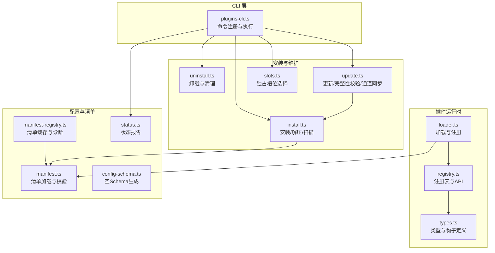
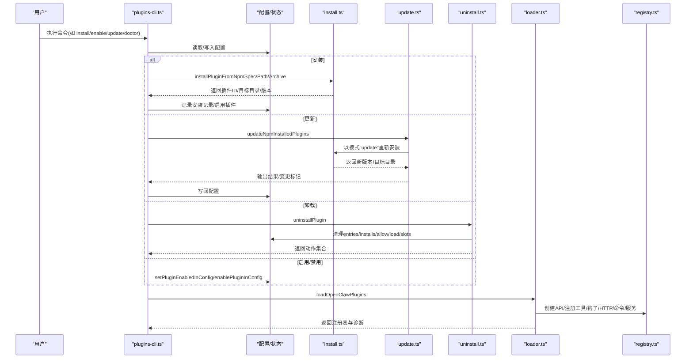
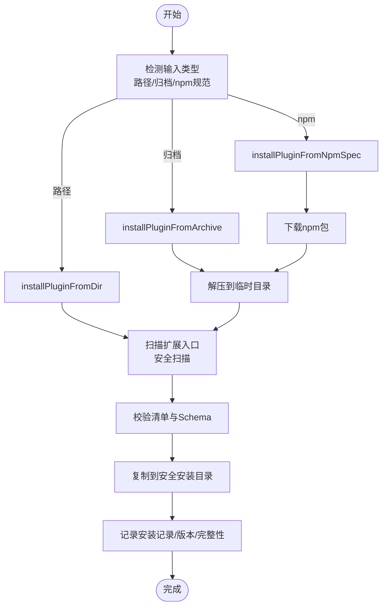
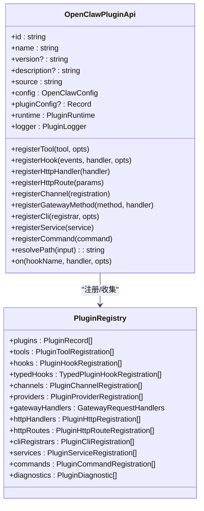
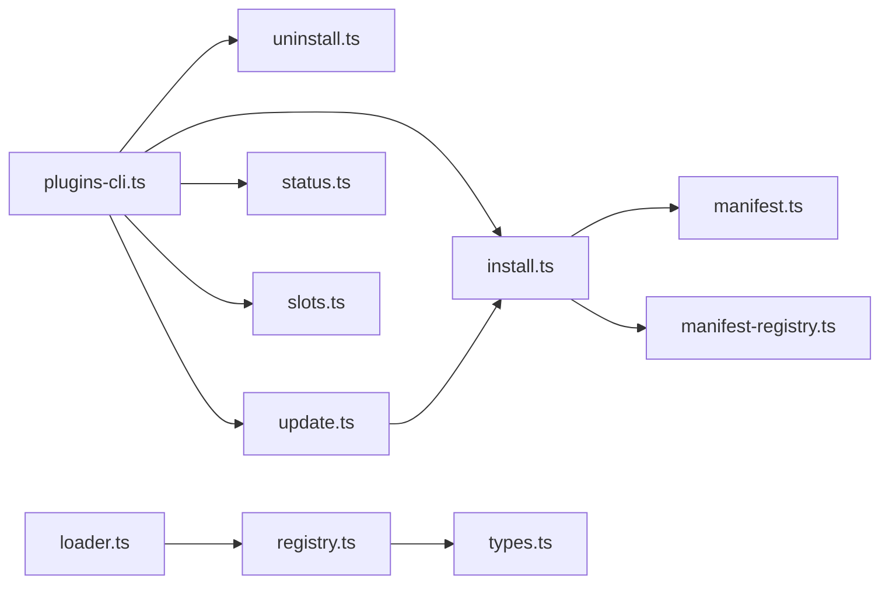

# 插件管理API

<cite>
**本文档引用的文件**
- [src/plugin-sdk/index.ts](file://src/plugin-sdk/index.ts)
- [src/plugins/types.ts](file://src/plugins/types.ts)
- [src/plugins/registry.ts](file://src/plugins/registry.ts)
- [src/plugins/loader.ts](file://src/plugins/loader.ts)
- [src/plugins/install.ts](file://src/plugins/install.ts)
- [src/plugins/uninstall.ts](file://src/plugins/uninstall.ts)
- [src/plugins/enable.ts](file://src/plugins/enable.ts)
- [src/plugins/update.ts](file://src/plugins/update.ts)
- [src/plugins/status.ts](file://src/plugins/status.ts)
- [src/plugins/config-schema.ts](file://src/plugins/config-schema.ts)
- [src/plugins/slots.ts](file://src/plugins/slots.ts)
- [src/plugins/manifest.ts](file://src/plugins/manifest.ts)
- [src/plugins/manifest-registry.ts](file://src/plugins/manifest-registry.ts)
- [src/cli/plugins-cli.ts](file://src/cli/plugins-cli.ts)
- [docs/cli/plugins.md](file://docs/cli/plugins.md)
- [docs/plugins/manifest.md](file://docs/plugins/manifest.md)
- [docs/zh-CN/plugins/manifest.md](file://docs/zh-CN/plugins/manifest.md)
</cite>

## 目录

1. [简介](#简介)
2. [项目结构](#项目结构)
3. [核心组件](#核心组件)
4. [架构总览](#架构总览)
5. [详细组件分析](#详细组件分析)
6. [依赖关系分析](#依赖关系分析)
7. [性能考量](#性能考量)
8. [故障排除指南](#故障排除指南)
9. [结论](#结论)
10. [附录](#附录)

## 简介

本文件系统化阐述 OpenClaw 插件管理API的设计与实现，覆盖插件的安装、卸载、启用、禁用与更新流程；解释插件注册表、依赖解析与版本管理策略；提供CLI命令参考与编程接口说明；并给出配置管理、状态监控、权限控制、安全检查与资源限制等最佳实践与排障建议。

## 项目结构

OpenClaw 将插件管理能力拆分为“运行时加载器”“CLI命令行工具”“注册表与类型定义”“安装/卸载/更新”“状态报告与清单校验”等模块，形成清晰的分层与职责边界。

图示来源

- [src/cli/plugins-cli.ts](file://src/cli/plugins-cli.ts#L161-L798)
- [src/plugins/loader.ts](file://src/plugins/loader.ts#L572-L725)
- [src/plugins/registry.ts](file://src/plugins/registry.ts#L164-L520)
- [src/plugins/types.ts](file://src/plugins/types.ts#L230-L284)
- [src/plugins/install.ts](file://src/plugins/install.ts#L400-L490)
- [src/plugins/uninstall.ts](file://src/plugins/uninstall.ts#L65-L104)
- [src/plugins/update.ts](file://src/plugins/update.ts#L158-L345)
- [src/plugins/slots.ts](file://src/plugins/slots.ts#L37-L109)
- [src/plugins/manifest.ts](file://src/plugins/manifest.ts#L45-L84)
- [src/plugins/manifest-registry.ts](file://src/plugins/manifest-registry.ts#L169-L194)
- [src/plugins/config-schema.ts](file://src/plugins/config-schema.ts#L13-L33)
- [src/plugins/status.ts](file://src/plugins/status.ts#L15-L36)

章节来源

- [src/cli/plugins-cli.ts](file://src/cli/plugins-cli.ts#L161-L798)
- [src/plugins/loader.ts](file://src/plugins/loader.ts#L572-L725)
- [src/plugins/registry.ts](file://src/plugins/registry.ts#L164-L520)
- [src/plugins/install.ts](file://src/plugins/install.ts#L400-L490)
- [src/plugins/uninstall.ts](file://src/plugins/uninstall.ts#L65-L104)
- [src/plugins/update.ts](file://src/plugins/update.ts#L158-L345)
- [src/plugins/slots.ts](file://src/plugins/slots.ts#L37-L109)
- [src/plugins/manifest.ts](file://src/plugins/manifest.ts#L45-L84)
- [src/plugins/manifest-registry.ts](file://src/plugins/manifest-registry.ts#L169-L194)
- [src/plugins/config-schema.ts](file://src/plugins/config-schema.ts#L13-L33)
- [src/plugins/status.ts](file://src/plugins/status.ts#L15-L36)

## 核心组件

- 插件API与类型：定义插件生命周期钩子、命令、HTTP路由、服务、通道与提供者注册接口，以及插件记录与诊断结构。
- 注册表与API工厂：集中管理工具、钩子、HTTP处理器、命令、服务、通道与提供者注册，统一暴露给插件调用。
- 加载器：扫描候选源、加载清单、解析导出、执行注册回调、建立全局钩子运行器与缓存。
- 安装/更新/卸载：支持路径、归档与npm三种来源，内置依赖扫描、完整性校验、独占槽位约束与通道同步。
- CLI：提供 list/info/enable/disable/install/uninstall/update/doctor 命令，串联上述能力。
- 状态与清单：生成状态报告、加载清单、缓存与诊断。

章节来源

- [src/plugins/types.ts](file://src/plugins/types.ts#L230-L284)
- [src/plugins/registry.ts](file://src/plugins/registry.ts#L164-L520)
- [src/plugins/loader.ts](file://src/plugins/loader.ts#L572-L725)
- [src/plugins/install.ts](file://src/plugins/install.ts#L400-L490)
- [src/plugins/update.ts](file://src/plugins/update.ts#L158-L345)
- [src/plugins/uninstall.ts](file://src/plugins/uninstall.ts#L65-L104)
- [src/plugins/status.ts](file://src/plugins/status.ts#L15-L36)
- [src/plugins/manifest.ts](file://src/plugins/manifest.ts#L45-L84)
- [src/plugins/manifest-registry.ts](file://src/plugins/manifest-registry.ts#L169-L194)

## 架构总览

下图展示从CLI到运行时插件加载的关键交互序列。

图示来源

- [src/cli/plugins-cli.ts](file://src/cli/plugins-cli.ts#L347-L798)
- [src/plugins/install.ts](file://src/plugins/install.ts#L400-L490)
- [src/plugins/update.ts](file://src/plugins/update.ts#L158-L345)
- [src/plugins/uninstall.ts](file://src/plugins/uninstall.ts#L65-L104)
- [src/plugins/loader.ts](file://src/plugins/loader.ts#L572-L725)
- [src/plugins/registry.ts](file://src/plugins/registry.ts#L164-L520)

## 详细组件分析

### CLI命令参考

- 列表与信息
  - openclaw plugins list [--json] [--enabled] [--verbose]
  - openclaw plugins info <id> [--json]
- 启停与卸载
  - openclaw plugins enable <id>
  - openclaw plugins disable <id>
  - openclaw plugins uninstall <id> [--keep-files] [--force] [--dry-run]
- 安装与更新
  - openclaw plugins install <path-or-spec> [-l/--link] [--pin]
  - openclaw plugins update [<id>|--all] [--dry-run]
- 诊断
  - openclaw plugins doctor

CLI命令行为要点

- 安装支持本地路径、归档(.zip/.tgz/.tar.gz)与npm规范；npm安装默认忽略脚本，支持--pin固定解析版本。
- 更新仅对npm安装生效，支持完整性漂移提示与确认；--dry-run预演。
- 卸载可选择保留磁盘文件(--keep-files)，并清理配置中的entries/installs/allow/load/slots。
- doctor输出插件错误与诊断信息，便于定位加载失败原因。

章节来源

- [docs/cli/plugins.md](file://docs/cli/plugins.md#L1-L60)
- [src/cli/plugins-cli.ts](file://src/cli/plugins-cli.ts#L171-L798)

### 安装机制

- 支持来源
  - 本地路径：目录/归档/单文件
  - npm包：registry-only，下载后解压安装
- 安全与合规
  - 强制要求 openclaw.plugin.json 存在且包含合法 configSchema
  - 对扩展入口进行扫描，发现可疑模式时告警
  - 严格的安全路径解析，避免路径穿越
- 版本与依赖
  - 通过 package.json 解析版本与依赖
  - 依赖安装使用 --ignore-scripts
- 完整性与缓存
  - npm安装支持完整性校验与漂移处理
  - 安装后清理清单缓存，确保配置校验看到最新清单

图示来源

- [src/plugins/install.ts](file://src/plugins/install.ts#L122-L490)
- [src/plugins/manifest.ts](file://src/plugins/manifest.ts#L45-L84)
- [src/plugins/manifest-registry.ts](file://src/plugins/manifest-registry.ts#L169-L194)

章节来源

- [src/plugins/install.ts](file://src/plugins/install.ts#L122-L490)
- [src/plugins/manifest.ts](file://src/plugins/manifest.ts#L45-L84)
- [src/plugins/manifest-registry.ts](file://src/plugins/manifest-registry.ts#L169-L194)

### 卸载机制

- 配置清理
  - 从 entries、installs、allow、load.paths、slots 中移除对应条目
  - 返回动作集合，指示实际清理了哪些部分
- 文件清理
  - 可选删除磁盘上的安装目录；为安全起见，不信任配置中的安装路径，采用推断的目标
- 变更应用
  - 写回配置文件，提示重启网关以使变更生效

章节来源

- [src/plugins/uninstall.ts](file://src/plugins/uninstall.ts#L65-L104)
- [src/cli/plugins-cli.ts](file://src/cli/plugins-cli.ts#L381-L514)

### 启用/禁用机制

- 启用
  - 校验全局开关、拒绝列表
  - 设置启用标志并加入白名单
- 禁用
  - 直接设置禁用标志
- 槽位联动
  - 启用某插件时自动应用独占槽位策略，禁用同类型其他插件

章节来源

- [src/plugins/enable.ts](file://src/plugins/enable.ts#L12-L25)
- [src/plugins/slots.ts](file://src/plugins/slots.ts#L37-L109)
- [src/cli/plugins-cli.ts](file://src/cli/plugins-cli.ts#L347-L380)

### 更新机制

- 目标范围
  - 仅对 npm 安装的插件生效
  - 支持按ID或--all批量更新
- 干运行
  - --dry-run 预检版本差异，不写入
- 完整性校验
  - 检测完整性漂移，可自定义回调决定是否继续
- 通道同步
  - 支持将插件在本地路径与npm之间切换，维护load.paths一致性

章节来源

- [src/plugins/update.ts](file://src/plugins/update.ts#L158-L345)
- [src/plugins/update.ts](file://src/plugins/update.ts#L347-L468)

### 注册表与API

- 注册表职责
  - 统一收集工具、钩子、HTTP处理器、命令、服务、通道与提供者
  - 维护诊断列表与全局钩子运行器
- API工厂
  - 为插件提供 registerTool/registerHook/registerHttpHandler/registerCommand/registerService/registerProvider 等能力
  - 提供 resolvePath、on 生命周期钩子注册

图示来源

- [src/plugins/types.ts](file://src/plugins/types.ts#L245-L284)
- [src/plugins/registry.ts](file://src/plugins/registry.ts#L164-L520)

章节来源

- [src/plugins/types.ts](file://src/plugins/types.ts#L230-L284)
- [src/plugins/registry.ts](file://src/plugins/registry.ts#L164-L520)

### 加载与诊断

- 加载流程
  - 解析导出模块，校验id/kind一致性
  - 依据清单填充元数据，执行插件注册回调
  - 初始化全局钩子运行器，写入缓存
- 诊断
  - id/Kind不一致、异步注册、未跟踪加载插件等均产生诊断
  - doctor命令汇总错误与警告

章节来源

- [src/plugins/loader.ts](file://src/plugins/loader.ts#L572-L725)
- [src/plugins/status.ts](file://src/plugins/status.ts#L15-L36)

### 配置与清单

- 清单要求
  - 每个插件必须提供 openclaw.plugin.json，包含 id 与 configSchema
  - 未知渠道键、未知插件ID引用均触发错误
- 空Schema
  - emptyPluginConfigSchema 生成空对象校验器，保证Schema存在且可验证

章节来源

- [docs/plugins/manifest.md](file://docs/plugins/manifest.md#L53-L72)
- [docs/zh-CN/plugins/manifest.md](file://docs/zh-CN/plugins/manifest.md#L51-L69)
- [src/plugins/manifest.ts](file://src/plugins/manifest.ts#L45-L84)
- [src/plugins/config-schema.ts](file://src/plugins/config-schema.ts#L13-L33)

### 权限控制与安全检查

- 安装前扫描
  - 对扩展入口进行安全扫描，发现可疑/危险模式时告警
- npm安装
  - 依赖安装忽略脚本，降低风险
  - 完整性校验与漂移处理
- 路径安全
  - 严格解析与校验安装路径，防止路径穿越
- 清单边界保护
  - 清单文件访问受边界文件读取保护，拒绝越界链接

章节来源

- [src/plugins/install.ts](file://src/plugins/install.ts#L199-L221)
- [src/plugins/install.ts](file://src/plugins/install.ts#L400-L440)
- [src/plugins/manifest.ts](file://src/plugins/manifest.ts#L45-L84)

### 版本管理与依赖解析

- 版本来源
  - 优先使用 openclaw.plugin.json 中的 manifest id 作为配置键，其次使用 npm 包名
- 依赖解析
  - 通过 package.json 读取依赖，安装时忽略脚本
- 更新策略
  - 仅对 npm 安装生效；支持干运行预检与完整性漂移确认

章节来源

- [src/plugins/install.ts](file://src/plugins/install.ts#L155-L181)
- [src/plugins/install.ts](file://src/plugins/install.ts#L256-L282)
- [src/plugins/update.ts](file://src/plugins/update.ts#L158-L345)

### 独占槽位与内存插件

- 槽位策略
  - 同类插件（如memory）互斥，启用一个会自动禁用其他同类插件
  - 默认槽位值由类型映射决定
- 诊断与警告
  - 切换槽位与禁用其他插件时发出警告

章节来源

- [src/plugins/slots.ts](file://src/plugins/slots.ts#L37-L109)

### 编程接口说明

- 插件SDK入口
  - 导出插件API、HTTP路由注册、配置Schema、运行时与安全工具等
- 关键API
  - registerTool/registerHook/registerHttpHandler/registerCommand/registerService/registerProvider
  - on 生命周期钩子注册
  - resolvePath 路径解析

章节来源

- [src/plugin-sdk/index.ts](file://src/plugin-sdk/index.ts#L1-L597)
- [src/plugins/types.ts](file://src/plugins/types.ts#L245-L284)

## 依赖关系分析

- 组件耦合
  - CLI 依赖安装/卸载/更新/状态模块；运行时依赖注册表与加载器
  - 安装模块依赖清单与安全扫描；更新模块依赖安装模块
- 外部依赖
  - npm包解析与下载、归档解压、文件系统操作
- 循环依赖
  - 无直接循环；注册表与加载器通过API工厂解耦

图示来源

- [src/cli/plugins-cli.ts](file://src/cli/plugins-cli.ts#L1-L798)
- [src/plugins/install.ts](file://src/plugins/install.ts#L1-L490)
- [src/plugins/uninstall.ts](file://src/plugins/uninstall.ts#L1-L104)
- [src/plugins/update.ts](file://src/plugins/update.ts#L1-L468)
- [src/plugins/status.ts](file://src/plugins/status.ts#L1-L36)
- [src/plugins/slots.ts](file://src/plugins/slots.ts#L1-L109)
- [src/plugins/manifest.ts](file://src/plugins/manifest.ts#L1-L84)
- [src/plugins/manifest-registry.ts](file://src/plugins/manifest-registry.ts#L1-L194)
- [src/plugins/loader.ts](file://src/plugins/loader.ts#L1-L725)
- [src/plugins/registry.ts](file://src/plugins/registry.ts#L1-L520)
- [src/plugins/types.ts](file://src/plugins/types.ts#L1-L764)

## 性能考量

- 加载缓存
  - 加载器支持缓存与注册表缓存，减少重复扫描与注册成本
- 干运行与预检
  - 安装/更新支持 dry-run，避免不必要的磁盘与网络开销
- 并发与超时
  - 安装流程支持超时参数，避免长时间阻塞
- 诊断与日志
  - 通过诊断事件与子系统日志定位瓶颈与异常

章节来源

- [src/plugins/loader.ts](file://src/plugins/loader.ts#L711-L716)
- [src/plugins/install.ts](file://src/plugins/install.ts#L131-L132)

## 故障排除指南

- 常见问题
  - 插件未加载：使用 doctor 查看错误与诊断；检查清单是否存在与合法
  - 启用失败：检查全局开关、拒绝列表与槽位冲突
  - 卸载后残留：确认是否保留文件(--keep-files)，必要时手动清理
  - 更新失败：查看完整性漂移提示，确认是否继续；必要时回滚或更换通道
- 排查步骤
  - openclaw plugins doctor
  - openclaw plugins info <id> --json
  - 检查 openclaw.plugin.json 与 configSchema
  - 确认安装目录与 load.paths 是否正确

章节来源

- [src/cli/plugins-cli.ts](file://src/cli/plugins-cli.ts#L762-L798)
- [src/plugins/status.ts](file://src/plugins/status.ts#L15-L36)
- [src/plugins/manifest.ts](file://src/plugins/manifest.ts#L45-L84)

## 结论

OpenClaw 插件管理API通过清晰的分层设计与严格的清单/安全策略，提供了从安装、启用、更新到卸载与诊断的完整生命周期管理能力。CLI与运行时紧密协作，既满足易用性也兼顾安全性与可观测性。遵循本文档的最佳实践与排障建议，可有效提升插件系统的稳定性与可维护性。

## 附录

- CLI命令速查
  - list/info/enable/disable/uninstall/install/update/doctor
- 最佳实践
  - 使用 --pin 固定npm版本；定期运行 doctor；启用安全扫描；合理使用槽位；最小权限原则与白名单
