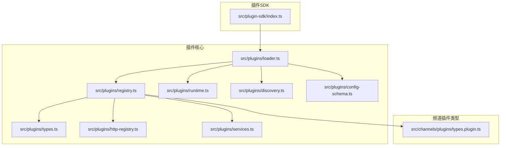
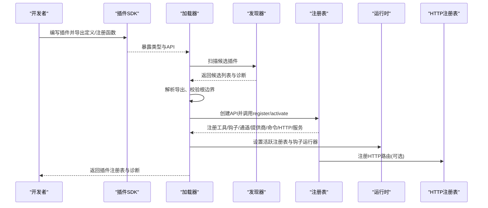
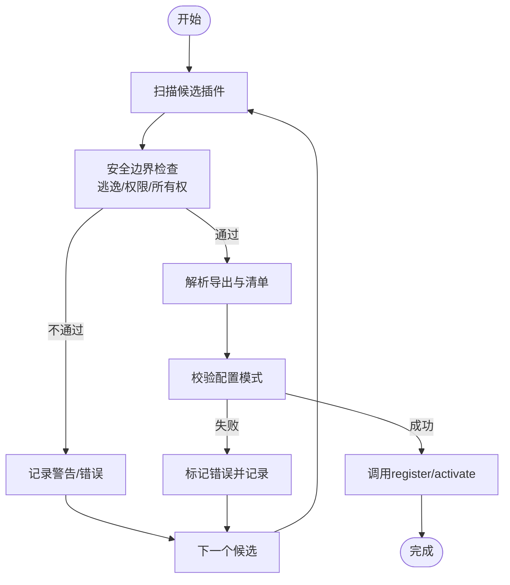
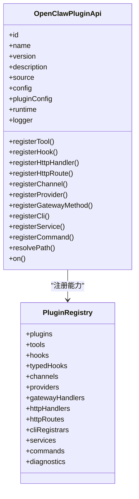
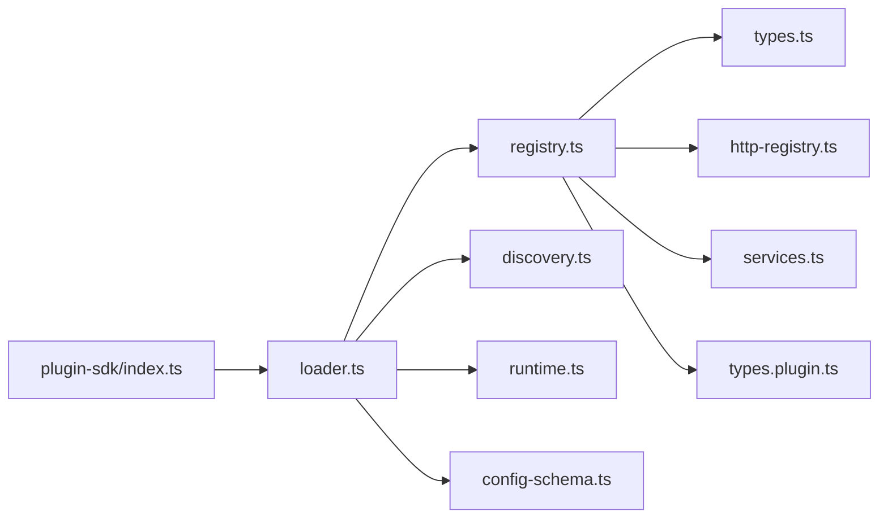

# 插件系统

<cite>
**本文引用的文件**
- [src/plugin-sdk/index.ts](file://src/plugin-sdk/index.ts)
- [src/plugins/types.ts](file://src/plugins/types.ts)
- [src/plugins/registry.ts](file://src/plugins/registry.ts)
- [src/plugins/loader.ts](file://src/plugins/loader.ts)
- [src/plugins/runtime.ts](file://src/plugins/runtime.ts)
- [src/plugins/config-schema.ts](file://src/plugins/config-schema.ts)
- [src/plugins/discovery.ts](file://src/plugins/discovery.ts)
- [src/plugins/http-registry.ts](file://src/plugins/http-registry.ts)
- [src/plugins/services.ts](file://src/plugins/services.ts)
- [src/channels/plugins/types.plugin.ts](file://src/channels/plugins/types.plugin.ts)
- [src/config/schema.ts](file://src/config/schema.ts)
</cite>

## 目录

1. [简介](#简介)
2. [项目结构](#项目结构)
3. [核心组件](#核心组件)
4. [架构总览](#架构总览)
5. [组件详解](#组件详解)
6. [依赖关系分析](#依赖关系分析)
7. [性能考量](#性能考量)
8. [故障排查指南](#故障排查指南)
9. [结论](#结论)
10. [附录](#附录)

## 简介

本文件面向插件开发者与维护者，系统性阐述 OpenClaw 插件系统的架构设计、开发接口、注册机制与管理 API，覆盖插件生命周期、依赖注入与配置系统，并提供最佳实践、安全与性能优化建议。同时对内置插件（如频道适配器、工具扩展、技能集成）进行功能说明与使用指引，以及测试、调试、发布与维护流程。

## 项目结构

OpenClaw 插件系统由“SDK 入口”“加载器”“注册表”“运行时”“HTTP 注册表”“服务管理”“发现与清单”等模块组成，围绕统一的插件 API 提供能力注册、钩子系统、命令系统、HTTP 路由与服务生命周期管理。

图表来源

- [src/plugin-sdk/index.ts](file://src/plugin-sdk/index.ts#L1-L597)
- [src/plugins/loader.ts](file://src/plugins/loader.ts#L1-L726)
- [src/plugins/registry.ts](file://src/plugins/registry.ts#L1-L520)
- [src/plugins/types.ts](file://src/plugins/types.ts#L1-L764)
- [src/plugins/runtime.ts](file://src/plugins/runtime.ts#L1-L41)
- [src/plugins/http-registry.ts](file://src/plugins/http-registry.ts#L1-L53)
- [src/plugins/services.ts](file://src/plugins/services.ts#L48-L75)
- [src/plugins/discovery.ts](file://src/plugins/discovery.ts#L1-L636)
- [src/plugins/config-schema.ts](file://src/plugins/config-schema.ts#L1-L34)
- [src/channels/plugins/types.plugin.ts](file://src/channels/plugins/types.plugin.ts#L1-L86)

章节来源

- [src/plugin-sdk/index.ts](file://src/plugin-sdk/index.ts#L1-L597)
- [src/plugins/loader.ts](file://src/plugins/loader.ts#L1-L726)
- [src/plugins/registry.ts](file://src/plugins/registry.ts#L1-L520)
- [src/plugins/types.ts](file://src/plugins/types.ts#L1-L764)
- [src/plugins/runtime.ts](file://src/plugins/runtime.ts#L1-L41)
- [src/plugins/http-registry.ts](file://src/plugins/http-registry.ts#L1-L53)
- [src/plugins/services.ts](file://src/plugins/services.ts#L48-L75)
- [src/plugins/discovery.ts](file://src/plugins/discovery.ts#L1-L636)
- [src/plugins/config-schema.ts](file://src/plugins/config-schema.ts#L1-L34)
- [src/channels/plugins/types.plugin.ts](file://src/channels/plugins/types.plugin.ts#L1-L86)

## 核心组件

- 插件 SDK 入口：集中导出插件开发所需类型、工具函数与适配器，便于在插件中按需引入。
- 加载器：负责扫描候选插件、读取清单、校验边界、解析导出、执行注册回调、构建注册表。
- 注册表：统一管理插件工具、钩子、通道、提供商、网关方法、CLI 命令、HTTP 路由、服务等。
- 运行时：维护全局活跃插件注册表、缓存键与钩子运行器初始化。
- 发现器：从工作区、全局、打包目录与显式路径发现插件入口，执行安全检查。
- HTTP 注册表：动态注册/注销插件 HTTP 路由，支持账户维度路由替换。
- 服务管理：启动/停止插件服务，按逆序停止以保证依赖释放顺序。
- 配置模式：提供空配置模式与 JSON Schema 校验工具，用于插件配置安全与 UI 呈现。

章节来源

- [src/plugin-sdk/index.ts](file://src/plugin-sdk/index.ts#L1-L597)
- [src/plugins/loader.ts](file://src/plugins/loader.ts#L368-L717)
- [src/plugins/registry.ts](file://src/plugins/registry.ts#L146-L519)
- [src/plugins/runtime.ts](file://src/plugins/runtime.ts#L1-L41)
- [src/plugins/discovery.ts](file://src/plugins/discovery.ts#L567-L636)
- [src/plugins/http-registry.ts](file://src/plugins/http-registry.ts#L1-L53)
- [src/plugins/services.ts](file://src/plugins/services.ts#L48-L75)
- [src/plugins/config-schema.ts](file://src/plugins/config-schema.ts#L1-L34)

## 架构总览

下图展示插件从发现到注册、再到运行时管理的整体流程。

图表来源

- [src/plugins/loader.ts](file://src/plugins/loader.ts#L368-L717)
- [src/plugins/discovery.ts](file://src/plugins/discovery.ts#L567-L636)
- [src/plugins/registry.ts](file://src/plugins/registry.ts#L472-L519)
- [src/plugins/runtime.ts](file://src/plugins/runtime.ts#L23-L41)
- [src/plugins/http-registry.ts](file://src/plugins/http-registry.ts#L11-L53)

## 组件详解

### 插件SDK与开发接口

- 类型与适配器：SDK 导出插件开发常用类型（如工具、钩子、通道、提供商、命令、HTTP 处理器、服务等），并提供工具函数（如路径解析、SSRF 安全策略、媒体处理、分片发送、持久化去重等）。
- 频道插件契约：通过 ChannelPlugin 接口定义频道适配器的完整能力集（认证、配置、消息、线程、心跳、目录、代理等），并支持 UI 提示与默认行为。
- 配置模式：提供空配置模式与 JSON Schema 校验工具，确保插件配置合法且可被 UI 使用。

章节来源

- [src/plugin-sdk/index.ts](file://src/plugin-sdk/index.ts#L1-L597)
- [src/channels/plugins/types.plugin.ts](file://src/channels/plugins/types.plugin.ts#L49-L86)
- [src/plugins/config-schema.ts](file://src/plugins/config-schema.ts#L13-L34)

### 插件加载与发现

- 发现策略：从工作区、全局、打包目录与显式路径扫描插件入口；支持 package.json 的 extensions 字段与 index.\* 入口。
- 安全边界：严格校验入口是否逃逸插件根目录、权限与所有者，避免世界可写与可疑所有权。
- 清单与元数据：读取包清单，提取扩展入口、名称、版本、描述等，派生插件 ID 提示。
- 加载流程：解析导出、对比 manifest 与导出的 id/kind、校验配置模式、执行注册回调、记录诊断信息。

图表来源

- [src/plugins/discovery.ts](file://src/plugins/discovery.ts#L567-L636)
- [src/plugins/loader.ts](file://src/plugins/loader.ts#L554-L696)

章节来源

- [src/plugins/discovery.ts](file://src/plugins/discovery.ts#L1-L636)
- [src/plugins/loader.ts](file://src/plugins/loader.ts#L368-L717)

### 注册表与API

- 注册表职责：聚合插件工具、钩子、通道、提供商、网关方法、CLI 命令、HTTP 路由、服务等，维护诊断信息与状态。
- API 设计：插件通过 OpenClawPluginApi 注册各类能力；支持命名钩子与强类型钩子（typed hooks）。
- 生命周期钩子：涵盖模型解析前、提示构建前、消息收发、工具调用前后、会话开始/结束、子代理 Spawn/交付/结束、网关启停等。

图表来源

- [src/plugins/types.ts](file://src/plugins/types.ts#L245-L284)
- [src/plugins/registry.ts](file://src/plugins/registry.ts#L124-L138)

章节来源

- [src/plugins/types.ts](file://src/plugins/types.ts#L1-L764)
- [src/plugins/registry.ts](file://src/plugins/registry.ts#L146-L519)

### 插件生命周期与运行时

- 激活注册表：加载完成后设置全局活跃注册表并初始化全局钩子运行器。
- 缓存键：基于工作区与插件配置生成缓存键，避免重复加载。
- 钩子运行器：在注册阶段将内部钩子注册到系统，支持优先级与事件过滤。

章节来源

- [src/plugins/runtime.ts](file://src/plugins/runtime.ts#L1-L41)
- [src/plugins/loader.ts](file://src/plugins/loader.ts#L714-L716)

### HTTP 路由注册

- 动态注册：插件可通过 API 或工具函数注册 HTTP 路由，支持规范化路径与账户维度替换。
- 注销机制：返回卸载函数，用于清理已注册路由。

章节来源

- [src/plugins/registry.ts](file://src/plugins/registry.ts#L291-L330)
- [src/plugins/http-registry.ts](file://src/plugins/http-registry.ts#L1-L53)

### 服务管理

- 启动顺序：按注册顺序启动插件服务。
- 停止顺序：按逆序停止，确保资源有序释放。
- 错误处理：捕获启动/停止异常并记录日志。

章节来源

- [src/plugins/services.ts](file://src/plugins/services.ts#L48-L75)

### 配置系统与UI集成

- 插件配置模式：提供空配置模式与 JSON Schema 校验工具，确保配置合法。
- UI 元数据：支持 UI 提示（标签、帮助、敏感字段、占位符等）。
- 全局合并：将各插件配置模式合并到主配置 Schema 中，实现统一校验与 UI 呈现。

章节来源

- [src/plugins/config-schema.ts](file://src/plugins/config-schema.ts#L1-L34)
- [src/config/schema.ts](file://src/config/schema.ts#L232-L271)

### 内置插件与频道适配器

- 频道插件契约：ChannelPlugin 定义了认证、配置、消息、线程、心跳、目录、代理等能力接口，支持 UI 提示与默认行为。
- 典型适配器：Discord、iMessage、Slack、Telegram、Signal、WhatsApp、LINE 等均提供账户解析、目标标准化、状态问题收集、消息动作等能力。
- 工具扩展：插件可注册工具工厂或直接工具，按上下文动态产出工具集合。
- 技能集成：通过命令系统与钩子系统与 Agent 协同，实现状态切换、查询与输出。

章节来源

- [src/channels/plugins/types.plugin.ts](file://src/channels/plugins/types.plugin.ts#L49-L86)
- [src/plugin-sdk/index.ts](file://src/plugin-sdk/index.ts#L453-L591)

## 依赖关系分析

图表来源

- [src/plugins/loader.ts](file://src/plugins/loader.ts#L1-L726)
- [src/plugins/registry.ts](file://src/plugins/registry.ts#L1-L520)
- [src/plugins/discovery.ts](file://src/plugins/discovery.ts#L1-L636)
- [src/plugins/runtime.ts](file://src/plugins/runtime.ts#L1-L41)
- [src/plugins/config-schema.ts](file://src/plugins/config-schema.ts#L1-L34)
- [src/plugins/http-registry.ts](file://src/plugins/http-registry.ts#L1-L53)
- [src/plugins/services.ts](file://src/plugins/services.ts#L48-L75)
- [src/channels/plugins/types.plugin.ts](file://src/channels/plugins/types.plugin.ts#L1-L86)
- [src/plugin-sdk/index.ts](file://src/plugin-sdk/index.ts#L1-L597)

章节来源

- [src/plugins/loader.ts](file://src/plugins/loader.ts#L1-L726)
- [src/plugins/registry.ts](file://src/plugins/registry.ts#L1-L520)
- [src/plugins/discovery.ts](file://src/plugins/discovery.ts#L1-L636)
- [src/plugins/runtime.ts](file://src/plugins/runtime.ts#L1-L41)
- [src/plugins/config-schema.ts](file://src/plugins/config-schema.ts#L1-L34)
- [src/plugins/http-registry.ts](file://src/plugins/http-registry.ts#L1-L53)
- [src/plugins/services.ts](file://src/plugins/services.ts#L48-L75)
- [src/channels/plugins/types.plugin.ts](file://src/channels/plugins/types.plugin.ts#L1-L86)
- [src/plugin-sdk/index.ts](file://src/plugin-sdk/index.ts#L1-L597)

## 性能考量

- 加载缓存：基于工作区与插件配置生成缓存键，避免重复解析与注册。
- 异步注册忽略：若插件注册返回 Promise，将被忽略，避免阻塞主线程。
- 路由冲突检测：HTTP 路由注册前进行冲突检测，减少运行期错误。
- 钩子系统：通过内部钩子系统与优先级控制，避免过度拦截导致延迟。
- 去重与分片：提供媒体下载与文本分片工具，降低网络与传输开销。

章节来源

- [src/plugins/loader.ts](file://src/plugins/loader.ts#L711-L716)
- [src/plugins/registry.ts](file://src/plugins/registry.ts#L672-L680)
- [src/plugins/registry.ts](file://src/plugins/registry.ts#L314-L322)
- [src/plugin-sdk/index.ts](file://src/plugin-sdk/index.ts#L234-L238)

## 故障排查指南

- 插件加载失败：检查导出是否包含 register/activate、配置模式是否匹配、入口是否逃逸根目录或存在世界可写权限。
- 注册阶段异常：查看诊断信息与日志，定位具体插件 ID 与源文件路径。
- HTTP 路由冲突：确认路径是否已被占用，必要时调整插件路由或账户维度。
- 服务启动失败：检查服务 start/stop 实现，关注逆序停止顺序与资源释放。
- 配置校验失败：核对 JSON Schema 与 UI 提示，修正字段类型与必填项。

章节来源

- [src/plugins/loader.ts](file://src/plugins/loader.ts#L554-L696)
- [src/plugins/registry.ts](file://src/plugins/registry.ts#L278-L288)
- [src/plugins/services.ts](file://src/plugins/services.ts#L48-L75)
- [src/plugins/config-schema.ts](file://src/plugins/config-schema.ts#L13-L34)

## 结论

OpenClaw 插件系统以清晰的契约与强大的注册机制为核心，结合安全边界检查、配置模式与 UI 集成、HTTP 路由与服务管理，为开发者提供了稳定、可扩展且易于维护的插件生态。遵循本文最佳实践与安全建议，可高效构建高质量插件并保障系统整体稳定性。

## 附录

### 开发者最佳实践

- 使用 SDK 提供的类型与工具函数，确保配置模式与 UI 提示一致。
- 在 register/activate 中仅注册必要能力，避免阻塞主线程。
- 对外暴露的 HTTP 路由应具备唯一性与幂等性，必要时支持账户维度替换。
- 服务启动/停止逻辑要健壮，注意资源清理与异常处理。
- 严格遵守安全边界检查，避免世界可写与可疑所有权路径。

### 安全考虑

- 入口路径逃逸检测：确保插件入口位于其根目录内。
- 权限与所有权：避免世界可写目录与非预期用户拥有。
- SSRF 与请求限制：使用 SDK 提供的安全网络与请求体限制工具。
- 配置校验：强制使用 JSON Schema 校验，防止非法输入。

### 性能优化建议

- 启用加载缓存，减少重复解析。
- 合理拆分工具与钩子，避免一次性注册过多能力。
- 使用分片与去重工具，降低带宽与存储压力。
- 控制 HTTP 路由数量与复杂度，避免冲突与竞争。
