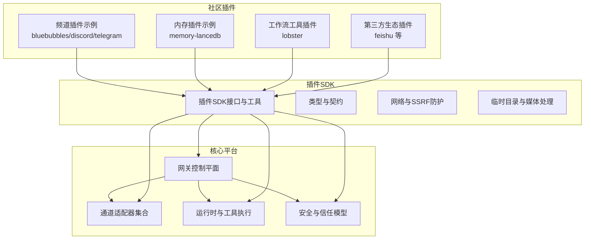
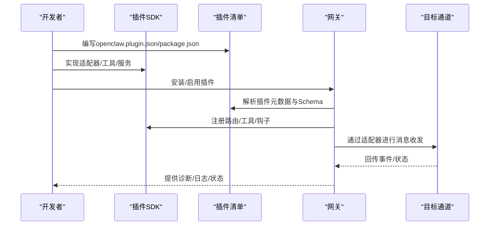
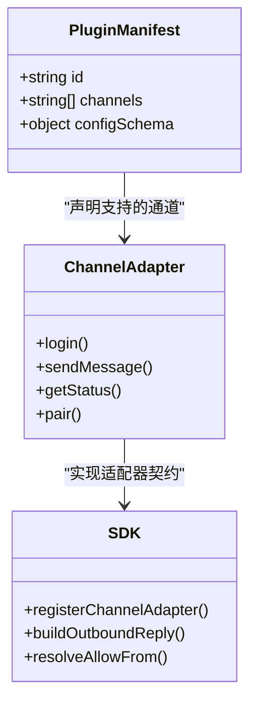
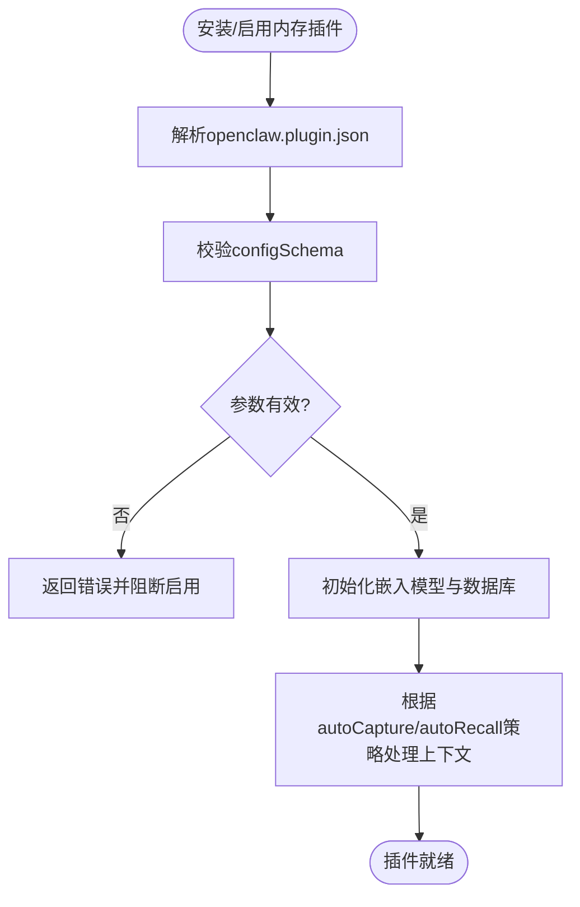
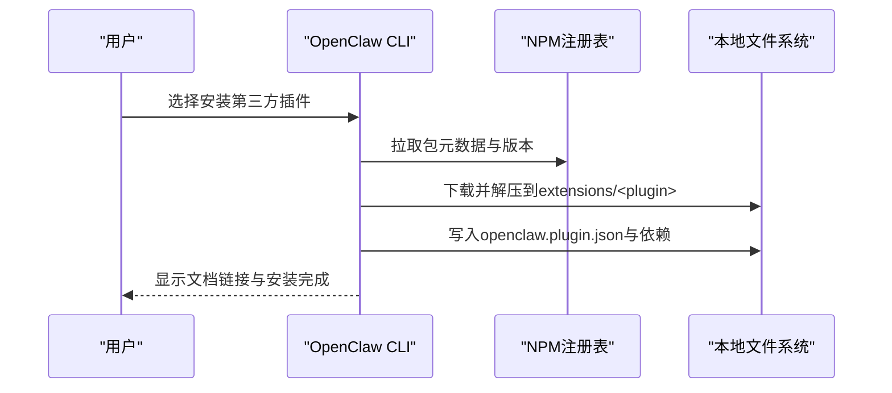
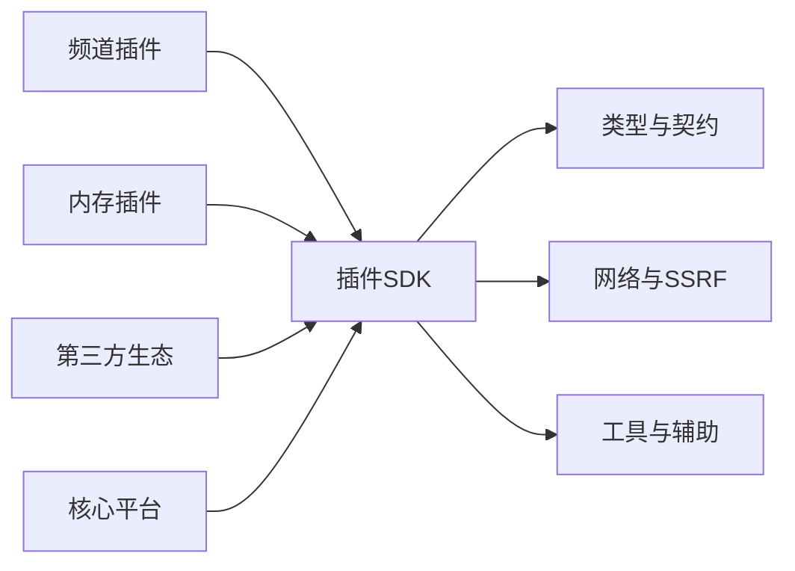

# 社区插件生态

<cite>
**本文档引用的文件**
- [README.md](file://README.md)
- [CONTRIBUTING.md](file://CONTRIBUTING.md)
- [SECURITY.md](file://SECURITY.md)
- [extensions/bluebubbles/openclaw.plugin.json](file://extensions/bluebubbles/openclaw.plugin.json)
- [extensions/discord/openclaw.plugin.json](file://extensions/discord/openclaw.plugin.json)
- [extensions/telegram/openclaw.plugin.json](file://extensions/telegram/openclaw.plugin.json)
- [extensions/feishu/package.json](file://extensions/feishu/package.json)
- [extensions/memory-lancedb/openclaw.plugin.json](file://extensions/memory-lancedb/openclaw.plugin.json)
- [extensions/lobster/openclaw.plugin.json](file://extensions/lobster/openclaw.plugin.json)
- [src/plugin-sdk/index.ts](file://src/plugin-sdk/index.ts)
</cite>

## 目录

1. [引言](#引言)
2. [项目结构](#项目结构)
3. [核心组件](#核心组件)
4. [架构总览](#架构总览)
5. [详细组件分析](#详细组件分析)
6. [依赖关系分析](#依赖关系分析)
7. [性能考虑](#性能考虑)
8. [故障排除指南](#故障排除指南)
9. [结论](#结论)
10. [附录](#附录)

## 引言

本文件面向OpenClaw社区插件开发者与使用者，系统化阐述插件生态的开发标准、发布流程、质量保证、市场与版本管理、兼容性政策、认证与安全审核、用户评价机制，以及社区贡献与发布规范。OpenClaw通过统一的插件SDK与标准化的插件清单（openclaw.plugin.json）实现跨渠道、可扩展的能力集成；同时，官方文档与安全策略为插件生态提供了清晰的边界与治理框架。

## 项目结构

OpenClaw的插件生态由“核心平台 + 插件SDK + 社区插件”三层构成：

- 核心平台：提供网关、通道适配器、工具执行、会话与安全等能力
- 插件SDK：统一的类型定义、工具方法、安全与网络辅助函数
- 社区插件：以openclaw.plugin.json声明能力，按需安装与启用

图示来源

- [src/plugin-sdk/index.ts](file://src/plugin-sdk/index.ts#L1-L597)
- [extensions/bluebubbles/openclaw.plugin.json](file://extensions/bluebubbles/openclaw.plugin.json#L1-L10)
- [extensions/discord/openclaw.plugin.json](file://extensions/discord/openclaw.plugin.json#L1-L10)
- [extensions/telegram/openclaw.plugin.json](file://extensions/telegram/openclaw.plugin.json#L1-L10)
- [extensions/memory-lancedb/openclaw.plugin.json](file://extensions/memory-lancedb/openclaw.plugin.json#L1-L72)
- [extensions/lobster/openclaw.plugin.json](file://extensions/lobster/openclaw.plugin.json#L1-L11)
- [extensions/feishu/package.json](file://extensions/feishu/package.json#L1-L35)

章节来源

- [README.md](file://README.md#L1-L556)
- [src/plugin-sdk/index.ts](file://src/plugin-sdk/index.ts#L1-L597)

## 核心组件

- 插件SDK：提供通道适配器类型、工具发送与回复、状态与诊断、网络与SSRF防护、临时路径与媒体处理、分组访问与授权、配对与设备管理、持久化去重、时间格式化、HTTP请求体限制、错误格式化、日志传输等能力。
- 频道插件：通过openclaw.plugin.json声明插件ID、支持的通道列表、配置Schema等元数据。
- 内存插件：以“kind”区分功能类型（如memory），并通过uiHints与configSchema提供配置界面与参数校验。
- 第三方生态：通过package.json中的openclaw字段声明安装方式、UI标签、文档链接与别名等。

章节来源

- [src/plugin-sdk/index.ts](file://src/plugin-sdk/index.ts#L1-L597)
- [extensions/bluebubbles/openclaw.plugin.json](file://extensions/bluebubbles/openclaw.plugin.json#L1-L10)
- [extensions/discord/openclaw.plugin.json](file://extensions/discord/openclaw.plugin.json#L1-L10)
- [extensions/telegram/openclaw.plugin.json](file://extensions/telegram/openclaw.plugin.json#L1-L10)
- [extensions/memory-lancedb/openclaw.plugin.json](file://extensions/memory-lancedb/openclaw.plugin.json#L1-L72)
- [extensions/lobster/openclaw.plugin.json](file://extensions/lobster/openclaw.plugin.json#L1-L11)
- [extensions/feishu/package.json](file://extensions/feishu/package.json#L1-L35)

## 架构总览

OpenClaw插件体系遵循“声明式清单 + SDK契约”的设计：

- 清单驱动：openclaw.plugin.json或package.json中声明插件ID、类型、配置Schema、UI提示、安装信息等
- SDK契约：插件通过SDK提供的类型与工具实现通道适配、消息处理、工具调用、安全与网络控制
- 安全边界：插件作为受信组件加载于网关进程内，需遵循Operator Trust Model与Plugin Trust Boundary

图示来源

- [src/plugin-sdk/index.ts](file://src/plugin-sdk/index.ts#L1-L597)
- [extensions/bluebubbles/openclaw.plugin.json](file://extensions/bluebubbles/openclaw.plugin.json#L1-L10)
- [extensions/feishu/package.json](file://extensions/feishu/package.json#L1-L35)

## 详细组件分析

### 组件A：频道插件（以bluebubbles为例）

- 元数据：声明插件ID与支持的通道列表
- 配置Schema：通过JSON Schema约束配置项，确保安装与运行时参数合法
- 开发要点：遵循SDK中的通道适配器类型与工具发送接口，实现消息收发、状态诊断与配对流程

图示来源

- [extensions/bluebubbles/openclaw.plugin.json](file://extensions/bluebubbles/openclaw.plugin.json#L1-L10)
- [src/plugin-sdk/index.ts](file://src/plugin-sdk/index.ts#L1-L597)

章节来源

- [extensions/bluebubbles/openclaw.plugin.json](file://extensions/bluebubbles/openclaw.plugin.json#L1-L10)
- [src/plugin-sdk/index.ts](file://src/plugin-sdk/index.ts#L1-L597)

### 组件B：内存插件（memory-lancedb）

- 类型标识：kind为memory，用于扩展记忆体能力
- UI提示：通过uiHints定义敏感参数（如API Key）、模型选择、数据库路径、自动捕获/召回等
- 配置Schema：严格校验嵌套对象与数值范围，确保部署一致性与安全性

图示来源

- [extensions/memory-lancedb/openclaw.plugin.json](file://extensions/memory-lancedb/openclaw.plugin.json#L1-L72)

章节来源

- [extensions/memory-lancedb/openclaw.plugin.json](file://extensions/memory-lancedb/openclaw.plugin.json#L1-L72)

### 组件C：第三方生态（feishu）

- 安装方式：通过openclaw字段声明npmSpec与本地路径，默认选择npm安装
- 文档与标签：提供文档路径、UI标签、别名与排序权重，便于在安装向导中展示
- 依赖管理：通过package.json声明SDK与类型校验库，确保类型安全与运行时稳定性

图示来源

- [extensions/feishu/package.json](file://extensions/feishu/package.json#L1-L35)

章节来源

- [extensions/feishu/package.json](file://extensions/feishu/package.json#L1-L35)

### 组件D：工作流工具插件（lobster）

- 功能定位：提供可恢复审批的Typed工作流工具
- 清单结构：通过openclaw.plugin.json声明基础元数据与空配置Schema，便于后续扩展

章节来源

- [extensions/lobster/openclaw.plugin.json](file://extensions/lobster/openclaw.plugin.json#L1-L11)

## 依赖关系分析

- 插件SDK与核心平台耦合度低，通过类型与工具方法解耦具体通道实现
- 频道插件依赖SDK中的通道适配器类型与工具发送接口
- 内存插件依赖SDK中的配置Schema与UI提示工具
- 第三方生态通过package.json声明安装与文档，与SDK形成松耦合

图示来源

- [src/plugin-sdk/index.ts](file://src/plugin-sdk/index.ts#L1-L597)

章节来源

- [src/plugin-sdk/index.ts](file://src/plugin-sdk/index.ts#L1-L597)

## 性能考虑

- 插件应避免阻塞网关主线程，使用SDK提供的超时与命令执行工具
- 媒体与临时文件处理应使用SDK提供的临时路径工具，减少磁盘IO与路径安全风险
- 分组访问与授权决策应在插件侧尽早裁剪，降低下游通道压力
- 使用SDK的日志与诊断工具输出关键指标，便于性能观测与问题定位

## 故障排除指南

- 安装失败：检查openclaw.plugin.json或package.json中的字段是否完整，确认依赖版本与Node.js版本要求
- 运行异常：通过网关安全审计命令与诊断事件收集器定位问题
- 网络与SSRF：遵循SDK的SSRF策略与主机白名单配置，避免私有地址与内网暴露
- 临时目录：使用SDK提供的临时路径工具，避免直接使用系统默认临时目录

章节来源

- [SECURITY.md](file://SECURITY.md#L1-L268)
- [src/plugin-sdk/index.ts](file://src/plugin-sdk/index.ts#L279-L301)

## 结论

OpenClaw社区插件生态以“声明式清单 + SDK契约 + 安全信任模型”为核心，既保障了插件的可扩展性与易用性，也明确了安全边界与合规要求。开发者可通过统一SDK快速实现新能力，用户可通过标准化清单与安装流程获得一致体验。建议在开发过程中严格遵循配置Schema、安全策略与诊断规范，共同维护健康、可信的插件生态。

## 附录

### 开发标准与最佳实践

- 清单完整性：确保openclaw.plugin.json或package.json字段齐全，配置Schema覆盖所有可配置项
- 类型安全：优先使用SDK提供的类型与工具，减少运行时错误
- 安全优先：遵循Operator Trust Model与Plugin Trust Boundary，避免越权行为
- 可观测性：使用SDK的日志与诊断工具记录关键路径，便于问题排查

章节来源

- [SECURITY.md](file://SECURITY.md#L100-L177)
- [src/plugin-sdk/index.ts](file://src/plugin-sdk/index.ts#L1-L597)

### 发布流程与质量保证

- 质量门禁：提交前在本地实例测试，运行构建与测试脚本，确保CI通过
- 合规检查：遵循贡献指南与安全策略，提供必要的披露与修复建议
- 版本管理：参考仓库版本与变更日志，保持与核心平台的兼容性

章节来源

- [CONTRIBUTING.md](file://CONTRIBUTING.md#L62-L160)
- [README.md](file://README.md#L83-L90)

### 插件市场与版本管理

- 插件市场：第三方生态通过NPM注册表分发，安装信息在package.json中声明
- 版本策略：遵循语义化版本，关注核心平台的兼容性与依赖更新
- 兼容性政策：插件需满足Node.js版本要求与安全扫描基线

章节来源

- [extensions/feishu/package.json](file://extensions/feishu/package.json#L1-L35)
- [SECURITY.md](file://SECURITY.md#L226-L268)

### 认证、安全审核与用户评价

- 认证与信任：插件被视为受信组件，安装即授予与本地代码同等的信任级别
- 安全审核：漏洞报告需包含可复现步骤、影响范围与修复建议，遵循报告接受门与误报模式
- 用户评价：通过文档与安装向导中的描述与别名提升可见性，鼓励社区反馈与改进

章节来源

- [SECURITY.md](file://SECURITY.md#L100-L177)
- [SECURITY.md](file://SECURITY.md#L135-L160)
- [SECURITY.md](file://SECURITY.md#L195-L225)
