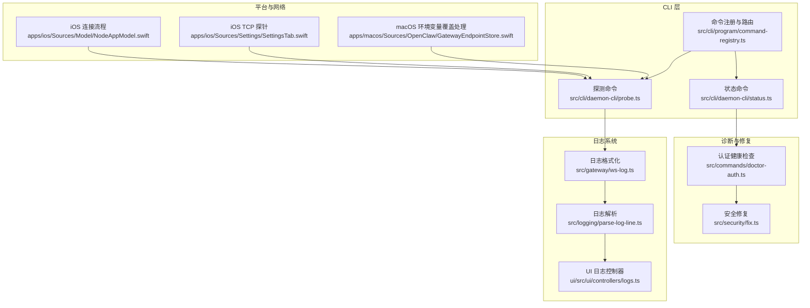
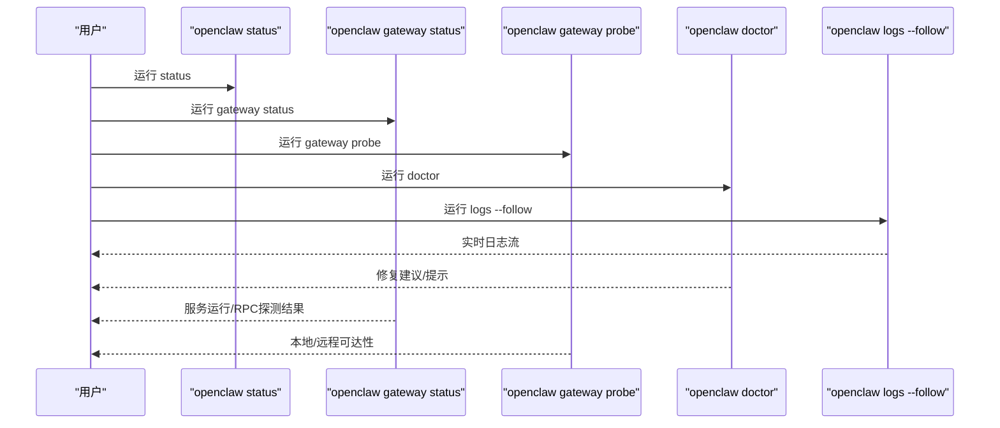
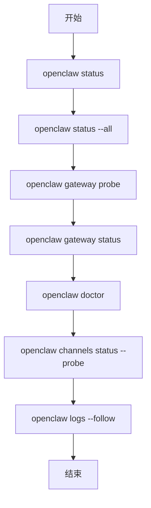
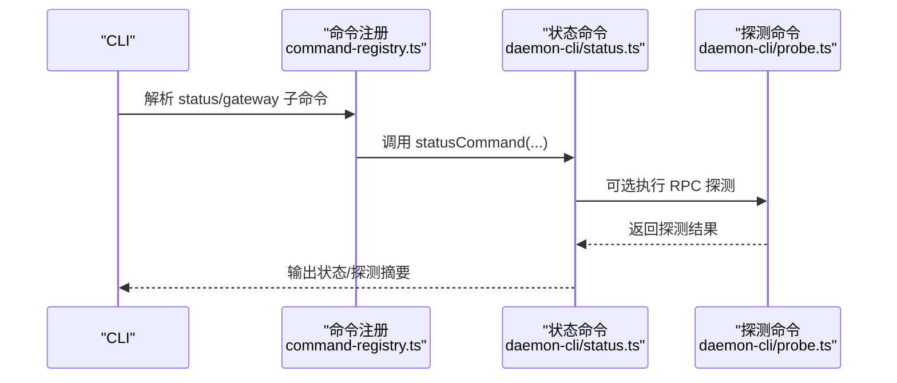
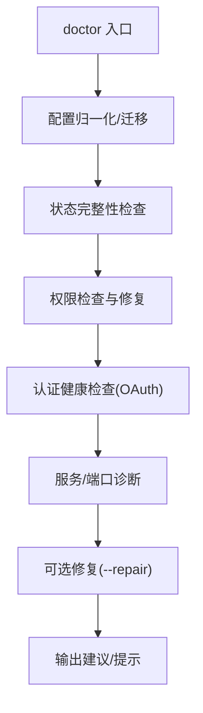
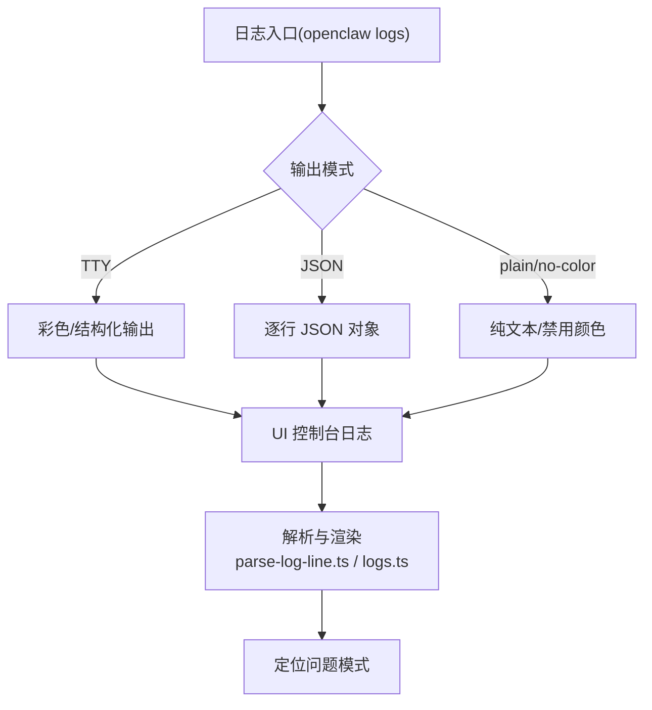
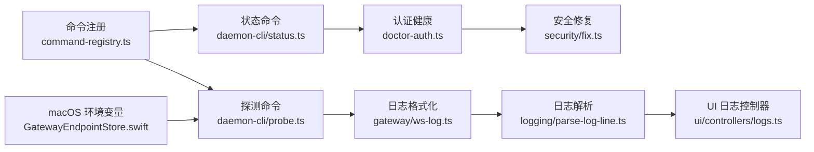

# 基础故障排除

<cite>
**本文引用的文件**
- [docs/help/troubleshooting.md](file://docs/help/troubleshooting.md)
- [docs/gateway/troubleshooting.md](file://docs/gateway/troubleshooting.md)
- [docs/cli/status.md](file://docs/cli/status.md)
- [docs/cli/doctor.md](file://docs/cli/doctor.md)
- [docs/cli/gateway.md](file://docs/cli/gateway.md)
- [docs/logging.md](file://docs/logging.md)
- [docs/gateway/configuration.md](file://docs/gateway/configuration.md)
- [docs/channels/troubleshooting.md](file://docs/channels/troubleshooting.md)
- [src/cli/program/command-registry.ts](file://src/cli/program/command-registry.ts)
- [src/cli/daemon-cli/status.ts](file://src/cli/daemon-cli/status.ts)
- [src/cli/daemon-cli/probe.ts](file://src/cli/daemon-cli/probe.ts)
- [src/commands/doctor-auth.ts](file://src/commands/doctor-auth.ts)
- [src/security/fix.ts](file://src/security/fix.ts)
- [src/gateway/ws-log.ts](file://src/gateway/ws-log.ts)
- [src/logging/parse-log-line.ts](file://src/logging/parse-log-line.ts)
- [ui/src/ui/controllers/logs.ts](file://ui/src/ui/controllers/logs.ts)
- [apps/macos/Sources/OpenClaw/GatewayEndpointStore.swift](file://apps/macos/Sources/OpenClaw/GatewayEndpointStore.swift)
- [apps/ios/Sources/Settings/SettingsTab.swift](file://apps/ios/Sources/Settings/SettingsTab.swift)
- [apps/ios/Sources/Model/NodeAppModel.swift](file://apps/ios/Sources/Model/NodeAppModel.swift)
</cite>

## 目录

1. [简介](#简介)
2. [项目结构](#项目结构)
3. [核心组件](#核心组件)
4. [架构总览](#架构总览)
5. [详细组件分析](#详细组件分析)
6. [依赖关系分析](#依赖关系分析)
7. [性能注意事项](#性能注意事项)
8. [故障排除指南](#故障排除指南)
9. [结论](#结论)
10. [附录](#附录)

## 简介

本指南面向首次或日常使用 OpenClaw 的用户，提供“60秒诊断法”的可执行流程，以及围绕 openclaw status、openclaw gateway status、openclaw doctor 的系统健康检查方法。文档还覆盖常见症状的快速识别与初步修复思路、日志分析基础技巧与常用模式识别，并给出权限、网络连接与配置错误的基础排查路径。

## 项目结构

OpenClaw 的故障排除能力由“CLI 命令 + 文档指引 + 日志解析 + 平台集成”共同构成。关键位置如下：

- CLI 命令注册与路由：负责将 status、gateway、doctor 等命令映射到具体实现
- 状态与探测：status 收集通道与会话概览；gateway status/probe 检查服务运行与可达性
- 诊断与修复：doctor 执行健康检查、配置迁移与修复建议
- 日志系统：文件日志（JSONL）与控制界面日志流，支持过滤与格式化
- 平台与网络：macOS/Windows/Linux 服务管理、iOS/Android 端网络连通性检测

图表来源

- [src/cli/program/command-registry.ts](file://src/cli/program/command-registry.ts#L27-L70)
- [src/cli/daemon-cli/status.ts](file://src/cli/daemon-cli/status.ts#L1-L20)
- [src/cli/daemon-cli/probe.ts](file://src/cli/daemon-cli/probe.ts#L1-L39)
- [src/commands/doctor-auth.ts](file://src/commands/doctor-auth.ts#L264-L334)
- [src/security/fix.ts](file://src/security/fix.ts#L440-L475)
- [src/gateway/ws-log.ts](file://src/gateway/ws-log.ts#L39-L79)
- [src/logging/parse-log-line.ts](file://src/logging/parse-log-line.ts#L1-L63)
- [ui/src/ui/controllers/logs.ts](file://ui/src/ui/controllers/logs.ts#L48-L97)
- [apps/macos/Sources/OpenClaw/GatewayEndpointStore.swift](file://apps/macos/Sources/OpenClaw/GatewayEndpointStore.swift#L149-L187)
- [apps/ios/Sources/Settings/SettingsTab.swift](file://apps/ios/Sources/Settings/SettingsTab.swift#L726-L758)
- [apps/ios/Sources/Model/NodeAppModel.swift](file://apps/ios/Sources/Model/NodeAppModel.swift#L1654-L1676)

章节来源

- [docs/help/troubleshooting.md](file://docs/help/troubleshooting.md#L13-L26)
- [docs/gateway/troubleshooting.md](file://docs/gateway/troubleshooting.md#L14-L24)

## 核心组件

- openclaw status：通道与会话的诊断快照，支持 --all、--deep、--usage，用于快速定位通道健康与最近会话收件人情况
- openclaw gateway status：展示服务安装/运行状态与 RPC 探测结果，支持 --json、--deep
- openclaw doctor：健康检查与快速修复，支持 --repair/--deep/--non-interactive，自动修复配置与权限问题
- openclaw logs --follow：实时追踪网关日志，支持多种输出模式与 JSON/纯文本切换
- openclaw gateway probe：综合探测本地与远程网关可达性，辅助定位 URL/凭据/SSH 隧道问题

章节来源

- [docs/cli/status.md](file://docs/cli/status.md#L9-L27)
- [docs/cli/gateway.md](file://docs/cli/gateway.md#L90-L121)
- [docs/cli/doctor.md](file://docs/cli/doctor.md#L9-L42)
- [docs/logging.md](file://docs/logging.md#L40-L68)

## 架构总览

下图展示了“60秒诊断法”的端到端流程：从状态采集到服务探测、日志跟踪与健康修复，形成闭环。

图表来源

- [docs/help/troubleshooting.md](file://docs/help/troubleshooting.md#L15-L25)
- [docs/gateway/troubleshooting.md](file://docs/gateway/troubleshooting.md#L18-L24)

## 详细组件分析

### 组件A：60秒诊断法（命令序列）

- 步骤顺序与预期输出
  - openclaw status：显示已配置通道且无明显认证错误
  - openclaw status --all：生成完整报告，便于贴出调试
  - openclaw gateway probe：确认目标可达
  - openclaw gateway status：Runtime: running 且 RPC probe: ok
  - openclaw doctor：无阻塞性配置/服务错误
  - openclaw channels status --probe：通道显示 connected/ready
  - openclaw logs --follow：日志稳定，无重复致命错误

图表来源

- [docs/help/troubleshooting.md](file://docs/help/troubleshooting.md#L15-L36)

章节来源

- [docs/help/troubleshooting.md](file://docs/help/troubleshooting.md#L13-L36)

### 组件B：openclaw status 与 openclaw gateway status

- openclaw status
  - 功能：通道与会话诊断，支持 --all、--deep、--usage
  - 输出要点：通道健康、会话存储、网关/节点服务状态、更新信息
- openclaw gateway status
  - 功能：服务安装/运行状态 + 可选 RPC 探测
  - 输出要点：Service/Runtime/RPC 探测、绑定/鉴权配置一致性

图表来源

- [src/cli/program/command-registry.ts](file://src/cli/program/command-registry.ts#L54-L70)
- [src/cli/daemon-cli/status.ts](file://src/cli/daemon-cli/status.ts#L7-L20)
- [src/cli/daemon-cli/probe.ts](file://src/cli/daemon-cli/probe.ts#L5-L39)

章节来源

- [docs/cli/status.md](file://docs/cli/status.md#L9-L27)
- [docs/cli/gateway.md](file://docs/cli/gateway.md#L90-L121)

### 组件C：openclaw doctor（健康检查与修复）

- 能力范围
  - 配置归一化、遗留键迁移、状态完整性检查、权限检查
  - 认证健康检查（OAuth 刷新）、模型提供商警告
  - 服务迁移与冲突诊断、端口占用检查、最佳实践提示
  - 可选 --repair/--deep/--non-interactive
- macOS 特别注意
  - launchctl 环境变量覆盖可能导致“未授权”错误，需检查并清理

图表来源

- [docs/cli/doctor.md](file://docs/cli/doctor.md#L14-L42)
- [docs/gateway/doctor.md](file://docs/gateway/doctor.md#L59-L84)
- [src/commands/doctor-auth.ts](file://src/commands/doctor-auth.ts#L264-L334)
- [src/security/fix.ts](file://src/security/fix.ts#L440-L475)

章节来源

- [docs/cli/doctor.md](file://docs/cli/doctor.md#L9-L42)
- [docs/gateway/doctor.md](file://docs/gateway/doctor.md#L85-L283)

### 组件D：日志系统与分析

- 日志位置与读取
  - 文件日志：默认滚动文件，可通过配置覆盖
  - 控制界面：通过 logs.tail 实时查看
  - CLI：openclaw logs --follow，支持 TTY/非 TTY/JSON/plain/no-color
- 日志格式
  - 文件：JSONL 结构化记录
  - 控制界面：按 subsystem/module/level 渲染
- 常用模式识别
  - 设备身份要求、未授权/重连循环、网关连接失败、RPC 探测失败
  - 通道层面：提及要求、待批准、允许列表/屏蔽、权限缺失/作用域不足
  - 自动化：调度器禁用、心跳跳过原因、未知账户 ID

图表来源

- [docs/logging.md](file://docs/logging.md#L40-L73)
- [src/logging/parse-log-line.ts](file://src/logging/parse-log-line.ts#L1-L63)
- [ui/src/ui/controllers/logs.ts](file://ui/src/ui/controllers/logs.ts#L48-L97)

章节来源

- [docs/logging.md](file://docs/logging.md#L10-L73)

## 依赖关系分析

- 命令层依赖
  - 命令注册将 status/gateway/doctor 等子命令路由到具体实现
  - 状态命令在探测失败时回退到错误提示与退出码
- 诊断层依赖
  - doctor 依赖认证健康检查与安全修复模块
  - macOS 环境变量覆盖可能影响网关鉴权
- 日志层依赖
  - CLI/UI 通过统一解析器渲染日志，便于跨端一致分析

图表来源

- [src/cli/program/command-registry.ts](file://src/cli/program/command-registry.ts#L27-L70)
- [src/cli/daemon-cli/status.ts](file://src/cli/daemon-cli/status.ts#L1-L20)
- [src/cli/daemon-cli/probe.ts](file://src/cli/daemon-cli/probe.ts#L1-L39)
- [src/commands/doctor-auth.ts](file://src/commands/doctor-auth.ts#L264-L334)
- [src/security/fix.ts](file://src/security/fix.ts#L440-L475)
- [src/gateway/ws-log.ts](file://src/gateway/ws-log.ts#L39-L79)
- [src/logging/parse-log-line.ts](file://src/logging/parse-log-line.ts#L1-L63)
- [ui/src/ui/controllers/logs.ts](file://ui/src/ui/controllers/logs.ts#L48-L97)
- [apps/macos/Sources/OpenClaw/GatewayEndpointStore.swift](file://apps/macos/Sources/OpenClaw/GatewayEndpointStore.swift#L149-L187)

章节来源

- [src/cli/program/command-registry.ts](file://src/cli/program/command-registry.ts#L27-L70)

## 性能注意事项

- 使用 --json 与 --no-color 可减少终端渲染开销，适合长时日志跟踪
- 在高并发场景下，适当提高日志级别阈值，避免过多结构化输出影响性能
- 通道探测与自动化任务应结合“安静时段”策略，避免在高峰时段触发大量心跳/定时任务

## 故障排除指南

### 快速诊断流程（60秒）

- 命令顺序与预期
  - openclaw status：通道配置正常、无明显认证错误
  - openclaw status --all：生成可分享的完整报告
  - openclaw gateway probe：目标可达
  - openclaw gateway status：Runtime: running 且 RPC probe: ok
  - openclaw doctor：无阻塞性配置/服务错误
  - openclaw channels status --probe：通道 connected/ready
  - openclaw logs --follow：日志稳定，无重复致命错误

章节来源

- [docs/help/troubleshooting.md](file://docs/help/troubleshooting.md#L15-L36)
- [docs/gateway/troubleshooting.md](file://docs/gateway/troubleshooting.md#L18-L31)

### 常见症状与快速识别

- 无回复
  - 检查通道探测、配对状态、群组提及要求、允许/屏蔽列表
  - 常见日志模式：提及要求被拒、待批准、被屏蔽/允许列表过滤
- 控制 UI 或控制面板无法连接
  - 检查 URL、鉴权模式、设备身份假设
  - 常见日志模式：需要设备身份、未授权/重连循环、网关连接失败
- 网关未启动或服务未运行
  - 检查服务安装状态、配置与端口冲突
  - 常见日志模式：设置 gateway.mode=local 被阻、拒绝绑定且无鉴权、端口占用
- 通道已连接但消息不流动
  - 检查配对/允许列表、提及要求、通道权限/作用域
  - 常见日志模式：提及要求、待批准、缺少作用域/不在频道/禁止/401/403
- 定时任务或心跳未触发/未送达
  - 检查调度器状态与交付目标
  - 常见日志模式：调度器禁用、心跳被跳过（安静时段/有请求在途/告警关闭）、未知账户 ID
- 节点配对但工具执行失败
  - 检查前台状态、操作系统权限、执行批准与白名单
  - 常见日志模式：后台不可用、权限缺失、需要批准、白名单不匹配
- 浏览器工具失败
  - 检查浏览器可执行路径、CDP 可达性、扩展中继标签页连接
  - 常见日志模式：无法启动 Chrome CDP、可执行路径不存在、扩展中继无标签页、仅附加模式无可达目标

章节来源

- [docs/gateway/troubleshooting.md](file://docs/gateway/troubleshooting.md#L32-L319)
- [docs/channels/troubleshooting.md](file://docs/channels/troubleshooting.md#L13-L117)

### 权限问题排查

- 配置文件权限
  - doctor 会检查配置文件权限并建议收紧至 600
- 状态目录与会话目录权限
  - doctor 检查写入权限与所有者，必要时提供修复动作
- macOS 环境变量覆盖
  - 若通过 launchctl 设置 OPENCLAW_GATEWAY_TOKEN/PASSWORD，可能覆盖配置导致“未授权”错误，需检查并清理

章节来源

- [docs/cli/doctor.md](file://docs/cli/doctor.md#L29-L41)
- [src/security/fix.ts](file://src/security/fix.ts#L440-L475)
- [apps/macos/Sources/OpenClaw/GatewayEndpointStore.swift](file://apps/macos/Sources/OpenClaw/GatewayEndpointStore.swift#L149-L187)

### 网络连接问题排查

- 网关可达性
  - 使用 openclaw gateway probe 检查本地与远程可达性
  - iOS 端内置 TCP 探针，可用于验证主机与端口连通
- URL/凭据与 SSH 隧道
  - doctor 提示 URL 与凭据不匹配、SSH 隧道配置不当
- 通道网络错误
  - 按通道文档检查 API 域名解析、IPv6、代理路由

章节来源

- [docs/cli/gateway.md](file://docs/cli/gateway.md#L108-L137)
- [apps/ios/Sources/Settings/SettingsTab.swift](file://apps/ios/Sources/Settings/SettingsTab.swift#L726-L758)
- [docs/channels/troubleshooting.md](file://docs/channels/troubleshooting.md#L41-L117)

### 配置错误排查

- 严格校验与修复
  - doctor 会指出未知键、类型错误、无效值，并提供修复建议
  - 建议使用 openclaw doctor --fix 或交互式 --yes
- 环境变量与注入
  - macOS 环境变量覆盖可能影响鉴权；检查 launchctl getenv 并按需 unsetenv
- 更新后异常
  - doctor 会检查绑定与鉴权更严格后的行为差异，提示调整 gateway.bind 与 gateway.auth

章节来源

- [docs/gateway/configuration.md](file://docs/gateway/configuration.md#L61-L73)
- [docs/cli/doctor.md](file://docs/cli/doctor.md#L28-L41)
- [docs/gateway/troubleshooting.md](file://docs/gateway/troubleshooting.md#L246-L319)

### 日志分析基础技巧

- 选择合适输出模式
  - TTY：彩色结构化；JSON：机器可读；plain/no-color：纯文本
- 关注关键字段
  - subsystem/module/level/time/message，定位来源与严重程度
- 常见模式
  - 设备身份要求、未授权/重连循环、网关连接失败、RPC 探测失败
  - 通道：提及要求、待批准、允许/屏蔽、权限/作用域
  - 自动化：调度器禁用、心跳跳过原因、未知账户 ID
- 通道日志筛选
  - 使用 openclaw channels logs --channel <provider> 聚焦特定通道

章节来源

- [docs/logging.md](file://docs/logging.md#L40-L73)
- [src/logging/parse-log-line.ts](file://src/logging/parse-log-line.ts#L1-L63)
- [ui/src/ui/controllers/logs.ts](file://ui/src/ui/controllers/logs.ts#L48-L97)

## 结论

通过“60秒诊断法”与 openclaw status/gateway status/doctor/logs 的组合使用，可以快速定位 OpenClaw 的健康状况与问题根因。配合日志模式识别与权限/网络/配置三类基础排查，大多数问题可在短时间内得到缓解或修复。遇到复杂问题时，建议结合各子系统的深度排障文档进一步分析。

## 附录

- 命令参考
  - openclaw status：通道与会话诊断，支持 --all/--deep/--usage
  - openclaw gateway status：服务与 RPC 探测，支持 --json/--deep
  - openclaw doctor：健康检查与修复，支持 --repair/--deep/--non-interactive
  - openclaw logs --follow：实时日志跟踪，支持 JSON/plain/no-color
  - openclaw gateway probe：本地/远程可达性探测
- 平台与环境
  - macOS：注意 launchctl 环境变量覆盖
  - iOS：内置 TCP 探针与连接流程日志
  - Linux：systemd 用户服务启用与重启

章节来源

- [docs/cli/status.md](file://docs/cli/status.md#L9-L27)
- [docs/cli/gateway.md](file://docs/cli/gateway.md#L90-L137)
- [docs/cli/doctor.md](file://docs/cli/doctor.md#L14-L42)
- [docs/logging.md](file://docs/logging.md#L40-L73)
- [apps/macos/Sources/OpenClaw/GatewayEndpointStore.swift](file://apps/macos/Sources/OpenClaw/GatewayEndpointStore.swift#L149-L187)
- [apps/ios/Sources/Settings/SettingsTab.swift](file://apps/ios/Sources/Settings/SettingsTab.swift#L726-L758)
- [apps/ios/Sources/Model/NodeAppModel.swift](file://apps/ios/Sources/Model/NodeAppModel.swift#L1654-L1676)
