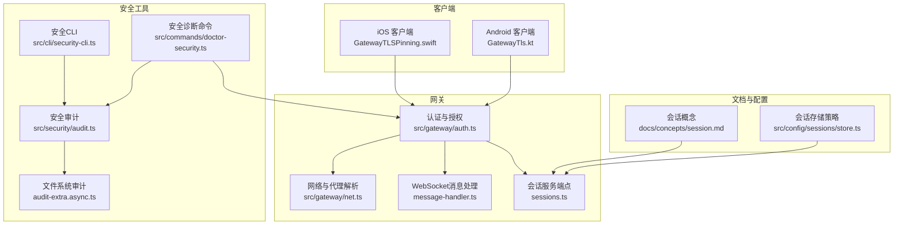
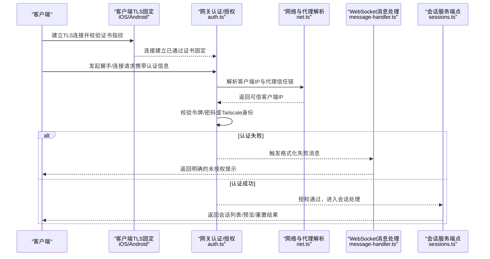
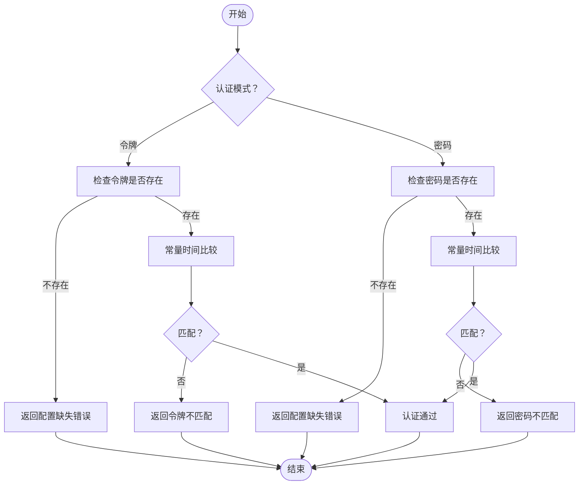
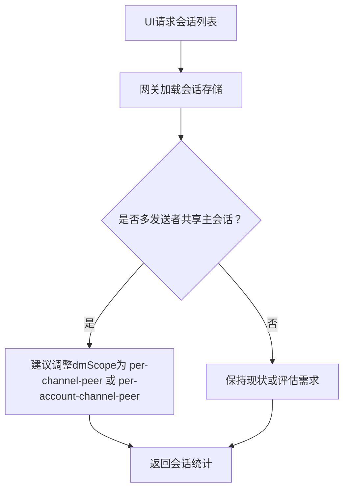
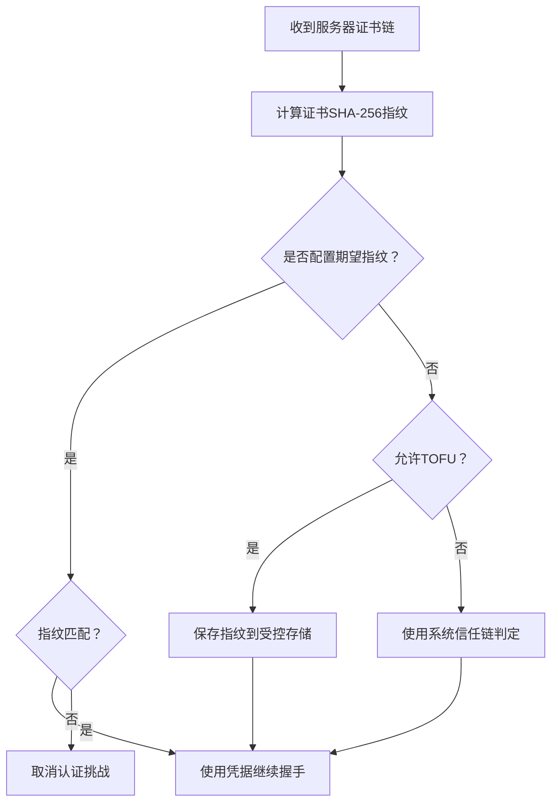
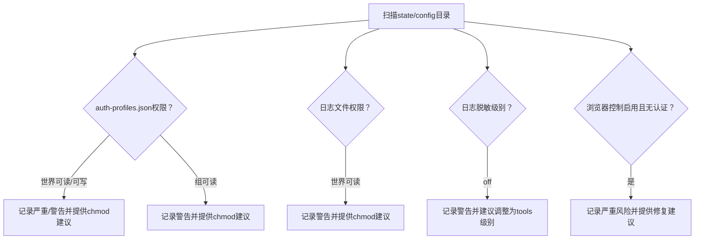
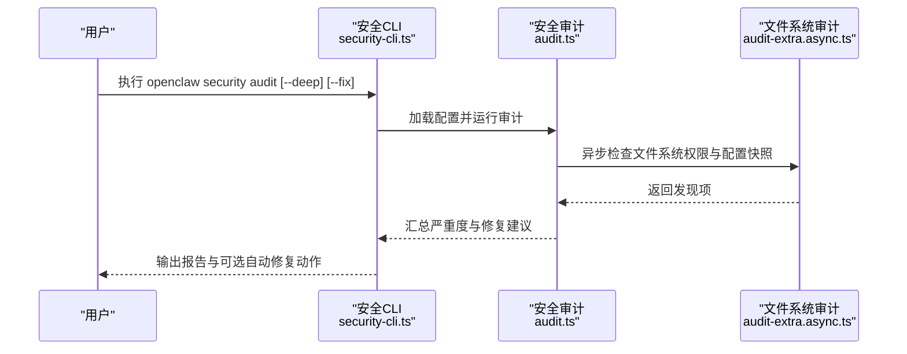
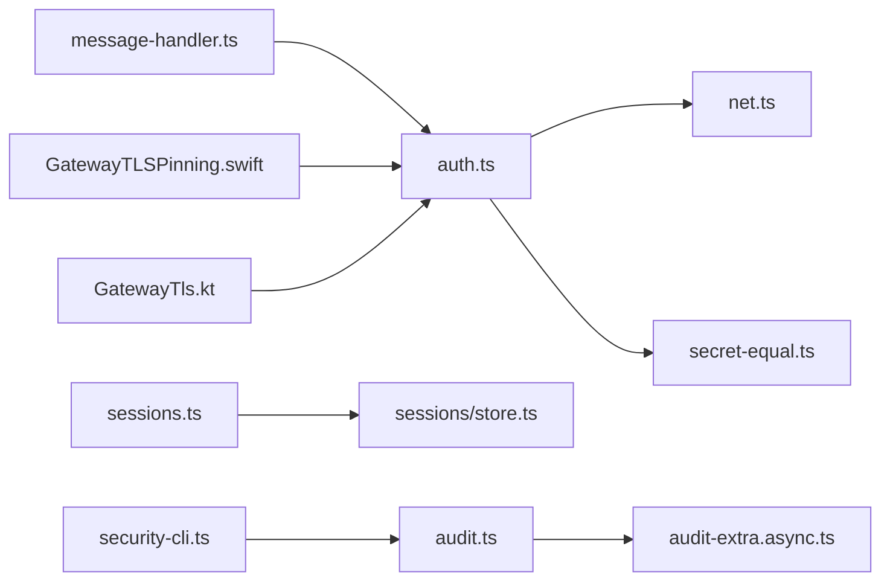

# 安全问题排查

<cite>
**本文引用的文件**
- [src/gateway/auth.ts](file://src/gateway/auth.ts)
- [src/gateway/net.ts](file://src/gateway/net.ts)
- [src/gateway/server/ws-connection/message-handler.ts](file://src/gateway/server/ws-connection/message-handler.ts)
- [src/gateway/server-methods/sessions.ts](file://src/gateway/server-methods/sessions.ts)
- [src/security/audit.ts](file://src/security/audit.ts)
- [src/security/audit-extra.async.ts](file://src/security/audit-extra.async.ts)
- [src/security/secret-equal.ts](file://src/security/secret-equal.ts)
- [src/cli/security-cli.ts](file://src/cli/security-cli.ts)
- [src/commands/doctor-security.ts](file://src/commands/doctor-security.ts)
- [apps/shared/OpenClawKit/Sources/OpenClawKit/GatewayTLSPinning.swift](file://apps/shared/OpenClawKit/Sources/OpenClawKit/GatewayTLSPinning.swift)
- [apps/android/app/src/main/java/ai/openclaw/android/gateway/GatewayTls.kt](file://apps/android/app/src/main/java/ai/openclaw/android/gateway/GatewayTls.kt)
- [docs/concepts/session.md](file://docs/concepts/session.md)
- [src/config/sessions/store.ts](file://src/config/sessions/store.ts)
- [src/gateway/client.test.ts](file://src/gateway/client.test.ts)
</cite>

## 目录

1. [简介](#简介)
2. [项目结构](#项目结构)
3. [核心组件](#核心组件)
4. [架构总览](#架构总览)
5. [详细组件分析](#详细组件分析)
6. [依赖关系分析](#依赖关系分析)
7. [性能考量](#性能考量)
8. [故障排查指南](#故障排查指南)
9. [结论](#结论)
10. [附录](#附录)

## 简介

本指南面向OpenClaw的安全运维与开发人员，聚焦于认证失败、授权错误、权限提升、API密钥泄露、会话劫持、跨站脚本攻击（XSS）防护、加密通信验证、访问控制检查、安全审计日志分析、安全配置验证、证书检查与防火墙规则等基础设施安全问题的排查与修复路径。文档以代码库中的实际实现为依据，提供可操作的诊断步骤、可视化流程图与最佳实践。

## 项目结构

OpenClaw在多个层面内置了安全能力：

- 网关认证与授权：支持令牌/密码模式、Tailscale身份校验、设备身份校验与反向代理信任链。
- 会话管理与隐私：会话存储裁剪、轮转与维护策略，确保敏感上下文不长期暴露。
- 客户端TLS固定（Pinning）：iOS与Android客户端对网关证书指纹进行严格校验或“首次信任后固定”（TOFU）策略。
- 安全审计CLI：集中化扫描配置、文件系统权限、通道安全策略与潜在风险点，并可自动收紧默认权限。
- 日志与敏感信息脱敏：日志子系统支持敏感信息脱敏级别控制，避免将私密内容写入日志。

**图表来源**

- [src/gateway/auth.ts](file://src/gateway/auth.ts#L1-L271)
- [src/gateway/net.ts](file://src/gateway/net.ts#L1-L275)
- [src/gateway/server/ws-connection/message-handler.ts](file://src/gateway/server/ws-connection/message-handler.ts#L78-L131)
- [src/gateway/server-methods/sessions.ts](file://src/gateway/server-methods/sessions.ts#L44-L231)
- [src/security/audit.ts](file://src/security/audit.ts#L1-L800)
- [src/security/audit-extra.async.ts](file://src/security/audit-extra.async.ts#L436-L545)
- [src/cli/security-cli.ts](file://src/cli/security-cli.ts#L1-L159)
- [src/commands/doctor-security.ts](file://src/commands/doctor-security.ts#L1-L186)
- [docs/concepts/session.md](file://docs/concepts/session.md#L42-L61)
- [src/config/sessions/store.ts](file://src/config/sessions/store.ts#L227-L263)

**章节来源**

- [src/gateway/auth.ts](file://src/gateway/auth.ts#L1-L271)
- [src/gateway/net.ts](file://src/gateway/net.ts#L1-L275)
- [src/security/audit.ts](file://src/security/audit.ts#L1-L800)
- [src/security/audit-extra.async.ts](file://src/security/audit-extra.async.ts#L436-L545)
- [src/cli/security-cli.ts](file://src/cli/security-cli.ts#L1-L159)
- [src/commands/doctor-security.ts](file://src/commands/doctor-security.ts#L1-L186)
- [docs/concepts/session.md](file://docs/concepts/session.md#L42-L61)
- [src/config/sessions/store.ts](file://src/config/sessions/store.ts#L227-L263)

## 核心组件

- 认证与授权模块：统一解析网关认证配置，支持令牌/密码两种模式；在非本地直连场景下支持Tailscale用户身份校验与反向代理信任链；提供安全常量时间比较以抵御时序攻击。
- 网络与代理解析：解析客户端真实IP、判断本地直连、处理反向代理头并校验可信代理列表，防止伪造来源。
- WebSocket消息处理：针对网关连接认证失败输出明确提示，帮助定位令牌缺失、不匹配、配置缺失等问题。
- 会话管理：提供会话列表、预览、重置等接口，强调“网关是会话状态的权威来源”，避免UI侧自行解析导致计数不一致。
- 安全审计：集中扫描配置、文件系统权限、通道策略、日志脱敏、浏览器控制端点等风险点；支持深度探测与自动修复默认权限。
- 客户端TLS固定：iOS与Android对网关证书指纹进行严格校验，或在允许“首次信任后固定”时将指纹持久化到受控存储。
- 会话存储策略：定义会话修剪、上限与轮转阈值，降低敏感数据长期留存风险。

**章节来源**

- [src/gateway/auth.ts](file://src/gateway/auth.ts#L178-L271)
- [src/gateway/net.ts](file://src/gateway/net.ts#L71-L120)
- [src/gateway/server/ws-connection/message-handler.ts](file://src/gateway/server/ws-connection/message-handler.ts#L78-L131)
- [src/gateway/server-methods/sessions.ts](file://src/gateway/server-methods/sessions.ts#L44-L231)
- [src/security/audit.ts](file://src/security/audit.ts#L259-L387)
- [src/security/audit-extra.async.ts](file://src/security/audit-extra.async.ts#L436-L545)
- [apps/shared/OpenClawKit/Sources/OpenClawKit/GatewayTLSPinning.swift](file://apps/shared/OpenClawKit/Sources/OpenClawKit/GatewayTLSPinning.swift#L71-L119)
- [apps/android/app/src/main/java/ai/openclaw/android/gateway/GatewayTls.kt](file://apps/android/app/src/main/java/ai/openclaw/android/gateway/GatewayTls.kt#L41-L75)
- [src/config/sessions/store.ts](file://src/config/sessions/store.ts#L227-L263)

## 架构总览

下图展示从客户端发起请求到网关认证、授权与会话处理的关键交互，以及TLS固定与安全审计在整体架构中的位置。

**图表来源**

- [src/gateway/auth.ts](file://src/gateway/auth.ts#L217-L271)
- [src/gateway/net.ts](file://src/gateway/net.ts#L71-L120)
- [src/gateway/server/ws-connection/message-handler.ts](file://src/gateway/server/ws-connection/message-handler.ts#L78-L131)
- [src/gateway/server-methods/sessions.ts](file://src/gateway/server-methods/sessions.ts#L44-L231)
- [apps/shared/OpenClawKit/Sources/OpenClawKit/GatewayTLSPinning.swift](file://apps/shared/OpenClawKit/Sources/OpenClawKit/GatewayTLSPinning.swift#L71-L119)
- [apps/android/app/src/main/java/ai/openclaw/android/gateway/GatewayTls.kt](file://apps/android/app/src/main/java/ai/openclaw/android/gateway/GatewayTls.kt#L41-L75)

## 详细组件分析

### 组件A：认证失败与授权错误诊断

- 令牌/密码模式
  - 缺失令牌/密码：返回明确提示，指导在不同客户端中设置令牌或密码。
  - 令牌/密码不匹配：使用常量时间比较函数，避免时序侧信道；返回具体原因便于定位。
  - 配置缺失：当模式为令牌但未配置令牌、或模式为密码但未配置密码时，抛出错误提示。
- Tailscale身份校验
  - 身份缺失、代理头缺失、WHOIS查询失败、身份不匹配等均会触发相应原因码，便于快速定位。
- 反向代理与本地直连
  - 仅在本地直连且主机为localhost/127.x.x.x或.TS域名时才视为可信；否则需配置可信代理列表并校验转发头。

**图表来源**

- [src/gateway/auth.ts](file://src/gateway/auth.ts#L242-L269)
- [src/security/secret-equal.ts](file://src/security/secret-equal.ts#L3-L16)

**章节来源**

- [src/gateway/auth.ts](file://src/gateway/auth.ts#L178-L271)
- [src/security/secret-equal.ts](file://src/security/secret-equal.ts#L1-L17)
- [src/gateway/server/ws-connection/message-handler.ts](file://src/gateway/server/ws-connection/message-handler.ts#L78-L131)

### 组件B：会话劫持与访问控制检查

- 会话权威性
  - 网关是会话状态的权威来源；UI客户端应通过网关查询会话列表与令牌计数，而非本地解析JSONL。
- 会话隔离
  - 多发送者共享主会话可能导致上下文泄露；建议按通道/账户维度隔离会话。
- 会话存储策略
  - 设置修剪周期、最大条目数与日志轮转阈值，降低敏感上下文长期留存风险。

**图表来源**

- [docs/concepts/session.md](file://docs/concepts/session.md#L42-L61)
- [src/gateway/server-methods/sessions.ts](file://src/gateway/server-methods/sessions.ts#L44-L231)
- [src/config/sessions/store.ts](file://src/config/sessions/store.ts#L227-L263)

**章节来源**

- [docs/concepts/session.md](file://docs/concepts/session.md#L42-L61)
- [src/gateway/server-methods/sessions.ts](file://src/gateway/server-methods/sessions.ts#L44-L231)
- [src/config/sessions/store.ts](file://src/config/sessions/store.ts#L227-L263)

### 组件C：加密通信验证与证书固定

- iOS与Android客户端均实现TLS固定逻辑：
  - 若期望指纹存在则严格比对，不匹配直接取消认证挑战；
  - 若允许“首次信任后固定”（TOFU），则将指纹保存至受控存储；
  - 否则回退到系统信任链判定。
- 单元测试覆盖了TLS指纹不匹配的拒绝行为，确保客户端不会接受不受信证书。

**图表来源**

- [apps/shared/OpenClawKit/Sources/OpenClawKit/GatewayTLSPinning.swift](file://apps/shared/OpenClawKit/Sources/OpenClawKit/GatewayTLSPinning.swift#L71-L119)
- [apps/android/app/src/main/java/ai/openclaw/android/gateway/GatewayTls.kt](file://apps/android/app/src/main/java/ai/openclaw/android/gateway/GatewayTls.kt#L41-L75)
- [src/gateway/client.test.ts](file://src/gateway/client.test.ts#L82-L103)

**章节来源**

- [apps/shared/OpenClawKit/Sources/OpenClawKit/GatewayTLSPinning.swift](file://apps/shared/OpenClawKit/Sources/OpenClawKit/GatewayTLSPinning.swift#L71-L119)
- [apps/android/app/src/main/java/ai/openclaw/android/gateway/GatewayTls.kt](file://apps/android/app/src/main/java/ai/openclaw/android/gateway/GatewayTls.kt#L41-L75)
- [src/gateway/client.test.ts](file://src/gateway/client.test.ts#L82-L103)

### 组件D：API密钥泄露检测与日志脱敏

- 文件系统权限审计
  - 对auth-profiles.json、日志文件等敏感路径进行权限检查，发现世界可读/可写时给出严重/警告等级并提供修复建议（如设置0600权限）。
- 日志脱敏
  - 当日志脱敏级别为关闭时，可能将敏感信息写入日志与状态输出，应调整为工具级别脱敏。
- 浏览器控制端点
  - 若启用浏览器控制HTTP路由而未配置网关认证，任何本地进程或SSRF均可调用，属于高危风险。

**图表来源**

- [src/security/audit-extra.async.ts](file://src/security/audit-extra.async.ts#L436-L545)
- [src/security/audit.ts](file://src/security/audit.ts#L452-L466)
- [src/security/audit.ts](file://src/security/audit.ts#L389-L450)

**章节来源**

- [src/security/audit-extra.async.ts](file://src/security/audit-extra.async.ts#L436-L545)
- [src/security/audit.ts](file://src/security/audit.ts#L452-L466)
- [src/security/audit.ts](file://src/security/audit.ts#L389-L450)

### 组件E：安全审计与自动修复

- CLI入口
  - 提供“openclaw security audit”命令，支持深度探测、JSON输出与自动修复（收紧默认权限、chmod）。
- 审计范围
  - 配置与文件系统权限、通道安全策略、日志脱敏、浏览器控制端点、网关绑定与认证、Tailscale暴露模式等。
- 修复策略
  - 对state/config目录与敏感文件执行最小必要权限收紧；对通道allowlist过大或包含通配符发出警告。

**图表来源**

- [src/cli/security-cli.ts](file://src/cli/security-cli.ts#L29-L159)
- [src/security/audit.ts](file://src/security/audit.ts#L1-L800)
- [src/security/audit-extra.async.ts](file://src/security/audit-extra.async.ts#L436-L545)

**章节来源**

- [src/cli/security-cli.ts](file://src/cli/security-cli.ts#L1-L159)
- [src/security/audit.ts](file://src/security/audit.ts#L1-L800)
- [src/security/audit-extra.async.ts](file://src/security/audit-extra.async.ts#L436-L545)

## 依赖关系分析

- 认证模块依赖网络解析模块以确定客户端来源与代理信任链，再结合安全常量时间比较函数进行令牌/密码校验。
- WebSocket消息处理器依赖认证模块的结果生成明确的未授权提示，便于前端与用户快速定位问题。
- 会话服务端点依赖配置与会话存储策略，确保会话数据的生命周期与隐私保护。
- 安全审计模块依赖配置解析、通道插件与文件系统检查，形成闭环的风险识别与修复建议。
- 客户端TLS固定独立于网关认证，作为传输层安全的补充，防止中间人攻击。

**图表来源**

- [src/gateway/auth.ts](file://src/gateway/auth.ts#L1-L271)
- [src/gateway/net.ts](file://src/gateway/net.ts#L1-L275)
- [src/security/secret-equal.ts](file://src/security/secret-equal.ts#L1-L17)
- [src/gateway/server/ws-connection/message-handler.ts](file://src/gateway/server/ws-connection/message-handler.ts#L78-L131)
- [src/gateway/server-methods/sessions.ts](file://src/gateway/server-methods/sessions.ts#L44-L231)
- [src/config/sessions/store.ts](file://src/config/sessions/store.ts#L227-L263)
- [src/cli/security-cli.ts](file://src/cli/security-cli.ts#L1-L159)
- [src/security/audit.ts](file://src/security/audit.ts#L1-L800)
- [src/security/audit-extra.async.ts](file://src/security/audit-extra.async.ts#L436-L545)
- [apps/shared/OpenClawKit/Sources/OpenClawKit/GatewayTLSPinning.swift](file://apps/shared/OpenClawKit/Sources/OpenClawKit/GatewayTLSPinning.swift#L71-L119)
- [apps/android/app/src/main/java/ai/openclaw/android/gateway/GatewayTls.kt](file://apps/android/app/src/main/java/ai/openclaw/android/gateway/GatewayTls.kt#L41-L75)

**章节来源**

- [src/gateway/auth.ts](file://src/gateway/auth.ts#L1-L271)
- [src/gateway/net.ts](file://src/gateway/net.ts#L1-L275)
- [src/security/secret-equal.ts](file://src/security/secret-equal.ts#L1-L17)
- [src/gateway/server/ws-connection/message-handler.ts](file://src/gateway/server/ws-connection/message-handler.ts#L78-L131)
- [src/gateway/server-methods/sessions.ts](file://src/gateway/server-methods/sessions.ts#L44-L231)
- [src/config/sessions/store.ts](file://src/config/sessions/store.ts#L227-L263)
- [src/cli/security-cli.ts](file://src/cli/security-cli.ts#L1-L159)
- [src/security/audit.ts](file://src/security/audit.ts#L1-L800)
- [src/security/audit-extra.async.ts](file://src/security/audit-extra.async.ts#L436-L545)
- [apps/shared/OpenClawKit/Sources/OpenClawKit/GatewayTLSPinning.swift](file://apps/shared/OpenClawKit/Sources/OpenClawKit/GatewayTLSPinning.swift#L71-L119)
- [apps/android/app/src/main/java/ai/openclaw/android/gateway/GatewayTls.kt](file://apps/android/app/src/main/java/ai/openclaw/android/gateway/GatewayTls.kt#L41-L75)

## 性能考量

- 认证与授权：常量时间比较避免时序攻击，但对长令牌长度有轻微开销；建议令牌长度足够且避免频繁变更。
- 会话存储：修剪与轮转阈值影响磁盘占用与I/O；合理设置可平衡性能与隐私。
- 审计扫描：文件系统检查与深度探测可能带来I/O与网络延迟；建议在非生产高峰时段执行深度审计。

## 故障排查指南

### 认证失败

- 步骤
  - 使用“openclaw security audit --deep”检查网关绑定与认证配置。
  - 在不同客户端确认令牌/密码是否正确设置；若使用Tailscale，确认代理头与身份匹配。
  - 查看WebSocket消息处理器返回的未授权提示，定位具体原因（令牌缺失/不匹配、配置缺失、Tailscale身份问题）。
- 关键定位点
  - 认证模式与配置：[src/gateway/auth.ts](file://src/gateway/auth.ts#L178-L271)
  - 未授权提示格式化：[src/gateway/server/ws-connection/message-handler.ts](file://src/gateway/server/ws-connection/message-handler.ts#L78-L131)
  - 常量时间比较：[src/security/secret-equal.ts](file://src/security/secret-equal.ts#L3-L16)

**章节来源**

- [src/gateway/auth.ts](file://src/gateway/auth.ts#L178-L271)
- [src/gateway/server/ws-connection/message-handler.ts](file://src/gateway/server/ws-connection/message-handler.ts#L78-L131)
- [src/security/secret-equal.ts](file://src/security/secret-equal.ts#L1-L17)

### 授权错误与权限提升

- 步骤
  - 检查网关绑定是否暴露到网络且未配置认证；必要时改为loopback并配置强令牌。
  - 审计通道策略，确保DM策略为“禁用/受限”，并配置合适的allowFrom白名单。
  - 对于浏览器控制HTTP路由，确保已配置网关认证令牌或密码。
- 关键定位点
  - 网关绑定与认证检查：[src/commands/doctor-security.ts](file://src/commands/doctor-security.ts#L11-L186)
  - 通道DM策略与隔离建议：[src/security/audit.ts](file://src/security/audit.ts#L503-L800)

**章节来源**

- [src/commands/doctor-security.ts](file://src/commands/doctor-security.ts#L1-L186)
- [src/security/audit.ts](file://src/security/audit.ts#L503-L800)

### 会话劫持与上下文泄露

- 步骤
  - 确认UI客户端通过网关查询会话统计，避免本地解析导致计数不一致。
  - 将session.dmScope调整为per-channel-peer或per-account-channel-peer，避免多发送者共享主会话。
  - 设置会话修剪与轮转阈值，降低敏感上下文留存。
- 关键定位点
  - 会话权威性说明：[docs/concepts/session.md](file://docs/concepts/session.md#L42-L61)
  - 会话端点实现：[src/gateway/server-methods/sessions.ts](file://src/gateway/server-methods/sessions.ts#L44-L231)
  - 存储策略参数：[src/config/sessions/store.ts](file://src/config/sessions/store.ts#L227-L263)

**章节来源**

- [docs/concepts/session.md](file://docs/concepts/session.md#L42-L61)
- [src/gateway/server-methods/sessions.ts](file://src/gateway/server-methods/sessions.ts#L44-L231)
- [src/config/sessions/store.ts](file://src/config/sessions/store.ts#L227-L263)

### 加密通信验证与证书固定

- 步骤
  - 确认客户端已启用TLS固定；若允许TOFU，确保指纹被安全保存。
  - 若出现证书不匹配，检查网关证书链与客户端期望指纹是否一致。
- 关键定位点
  - iOS固定逻辑：[apps/shared/OpenClawKit/Sources/OpenClawKit/GatewayTLSPinning.swift](file://apps/shared/OpenClawKit/Sources/OpenClawKit/GatewayTLSPinning.swift#L71-L119)
  - Android固定逻辑：[apps/android/app/src/main/java/ai/openclaw/android/gateway/GatewayTls.kt](file://apps/android/app/src/main/java/ai/openclaw/android/gateway/GatewayTls.kt#L41-L75)
  - 单元测试覆盖：[src/gateway/client.test.ts](file://src/gateway/client.test.ts#L82-L103)

**章节来源**

- [apps/shared/OpenClawKit/Sources/OpenClawKit/GatewayTLSPinning.swift](file://apps/shared/OpenClawKit/Sources/OpenClawKit/GatewayTLSPinning.swift#L71-L119)
- [apps/android/app/src/main/java/ai/openclaw/android/gateway/GatewayTls.kt](file://apps/android/app/src/main/java/ai/openclaw/android/gateway/GatewayTls.kt#L41-L75)
- [src/gateway/client.test.ts](file://src/gateway/client.test.ts#L82-L103)

### 安全审计日志分析与访问控制检查

- 步骤
  - 使用“openclaw security audit”生成报告，关注严重/警告等级发现项。
  - 对文件系统权限问题执行自动修复或手动chmod；对日志脱敏级别进行调整。
  - 对通道策略进行审查，收紧allowFrom白名单，避免通配符。
- 关键定位点
  - 审计入口与渲染：[src/cli/security-cli.ts](file://src/cli/security-cli.ts#L29-L159)
  - 文件系统权限检查：[src/security/audit-extra.async.ts](file://src/security/audit-extra.async.ts#L436-L545)
  - 日志脱敏检查：[src/security/audit.ts](file://src/security/audit.ts#L452-L466)

**章节来源**

- [src/cli/security-cli.ts](file://src/cli/security-cli.ts#L1-L159)
- [src/security/audit-extra.async.ts](file://src/security/audit-extra.async.ts#L436-L545)
- [src/security/audit.ts](file://src/security/audit.ts#L452-L466)

### API密钥泄露检测与防护

- 步骤
  - 审计auth-profiles.json与日志文件权限，确保仅限当前用户读写。
  - 对日志脱敏级别进行调整，避免将敏感信息写入日志。
  - 对浏览器控制HTTP路由启用时强制配置网关认证。
- 关键定位点
  - 权限检查与修复建议：[src/security/audit-extra.async.ts](file://src/security/audit-extra.async.ts#L436-L545)
  - 浏览器控制端点风险：[src/security/audit.ts](file://src/security/audit.ts#L389-L450)

**章节来源**

- [src/security/audit-extra.async.ts](file://src/security/audit-extra.async.ts#L436-L545)
- [src/security/audit.ts](file://src/security/audit.ts#L389-L450)

### 跨站脚本攻击（XSS）防护

- 建议
  - 严格遵循最小权限原则，限制通道与命令的访问范围，避免在UI中直接注入未经转义的内容。
  - 对用户输入进行严格的白名单过滤与长度限制，避免在会话或日志中记录原始输入。
  - 使用内容安全策略（CSP）限制脚本执行来源，减少XSS风险面。

[本节为通用安全建议，不直接分析特定源文件]

### 安全配置验证、证书检查与防火墙规则

- 建议
  - 网关绑定优先使用loopback，仅在确有必要时开放到LAN或TAILNET，并配置强令牌/密码与Tailscale身份校验。
  - 配置可信代理列表，确保反向代理转发头不可伪造。
  - 结合防火墙规则限制对外暴露端口，仅允许必要的端口与来源。
  - 定期执行安全审计，及时修复权限与策略问题。

**章节来源**

- [src/commands/doctor-security.ts](file://src/commands/doctor-security.ts#L1-L186)
- [src/gateway/net.ts](file://src/gateway/net.ts#L71-L120)

### 安全事件响应与取证分析

- 建议
  - 事件发生时立即暂停对外暴露的网关绑定，收紧认证与通道策略。
  - 收集并保留审计报告、日志文件与配置快照，用于溯源与复盘。
  - 对受影响的令牌/证书进行轮换，并通知相关用户重新授权。

**章节来源**

- [src/security/audit.ts](file://src/security/audit.ts#L1-L800)
- [src/security/audit-extra.async.ts](file://src/security/audit-extra.async.ts#L534-L545)

## 结论

OpenClaw在认证、授权、会话管理、TLS固定与安全审计等方面提供了完善的内置能力。通过“openclaw security audit”与相关命令，可以系统性地识别与修复常见安全问题；结合严格的文件系统权限、日志脱敏与通道策略，能够有效降低认证失败、授权错误、权限提升、API密钥泄露、会话劫持与XSS等风险。建议将安全审计纳入日常运维流程，并持续优化访问控制与证书管理策略。

## 附录

- 常用命令
  - openclaw security audit [--deep] [--fix]
  - openclaw doctor --fix
- 关键实现参考
  - 认证与授权：[src/gateway/auth.ts](file://src/gateway/auth.ts#L178-L271)
  - 网络与代理解析：[src/gateway/net.ts](file://src/gateway/net.ts#L71-L120)
  - 会话权威性与端点：[docs/concepts/session.md](file://docs/concepts/session.md#L42-L61)、[src/gateway/server-methods/sessions.ts](file://src/gateway/server-methods/sessions.ts#L44-L231)
  - TLS固定：[apps/shared/OpenClawKit/Sources/OpenClawKit/GatewayTLSPinning.swift](file://apps/shared/OpenClawKit/Sources/OpenClawKit/GatewayTLSPinning.swift#L71-L119)、[apps/android/app/src/main/java/ai/openclaw/android/gateway/GatewayTls.kt](file://apps/android/app/src/main/java/ai/openclaw/android/gateway/GatewayTls.kt#L41-L75)
  - 安全审计：[src/cli/security-cli.ts](file://src/cli/security-cli.ts#L29-L159)、[src/security/audit.ts](file://src/security/audit.ts#L1-L800)、[src/security/audit-extra.async.ts](file://src/security/audit-extra.async.ts#L436-L545)
