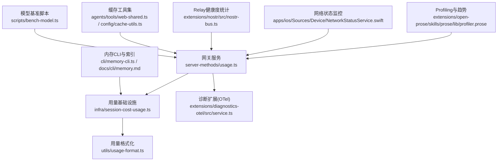
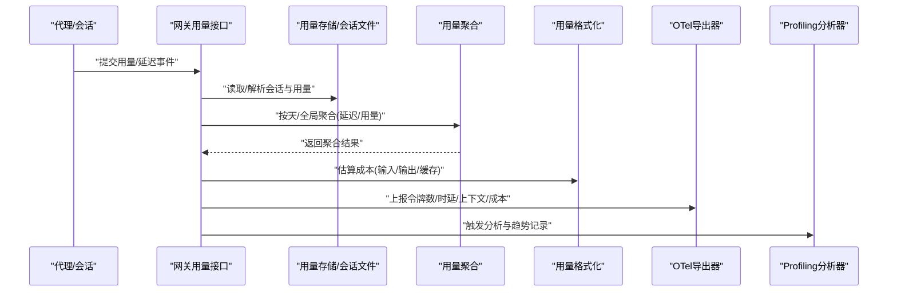
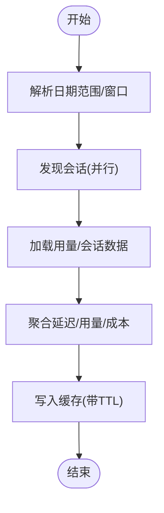
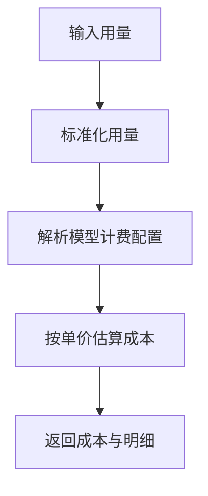
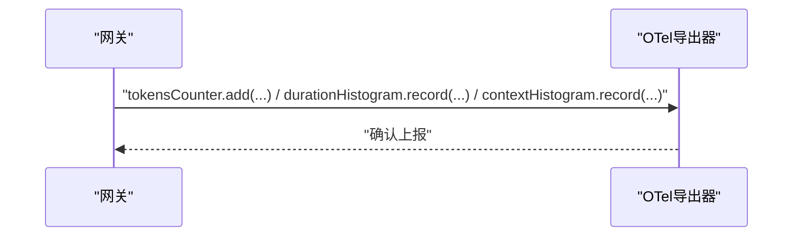
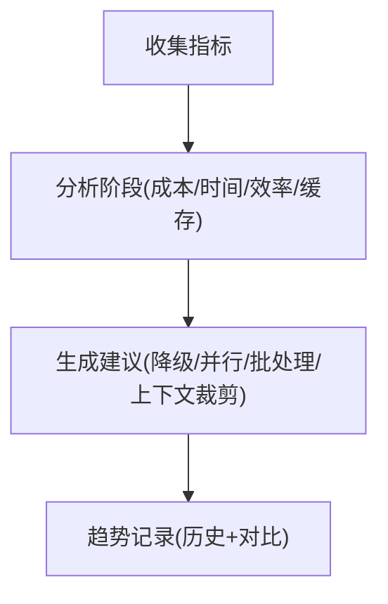
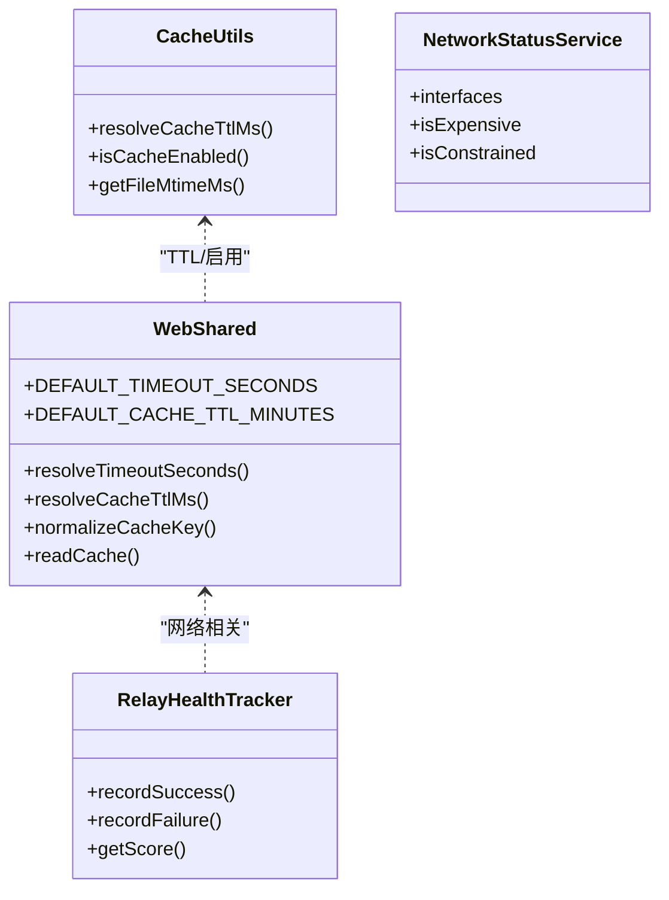
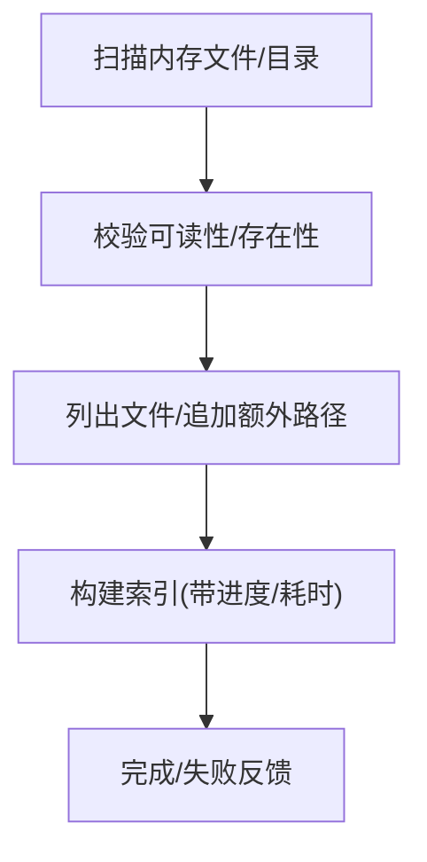
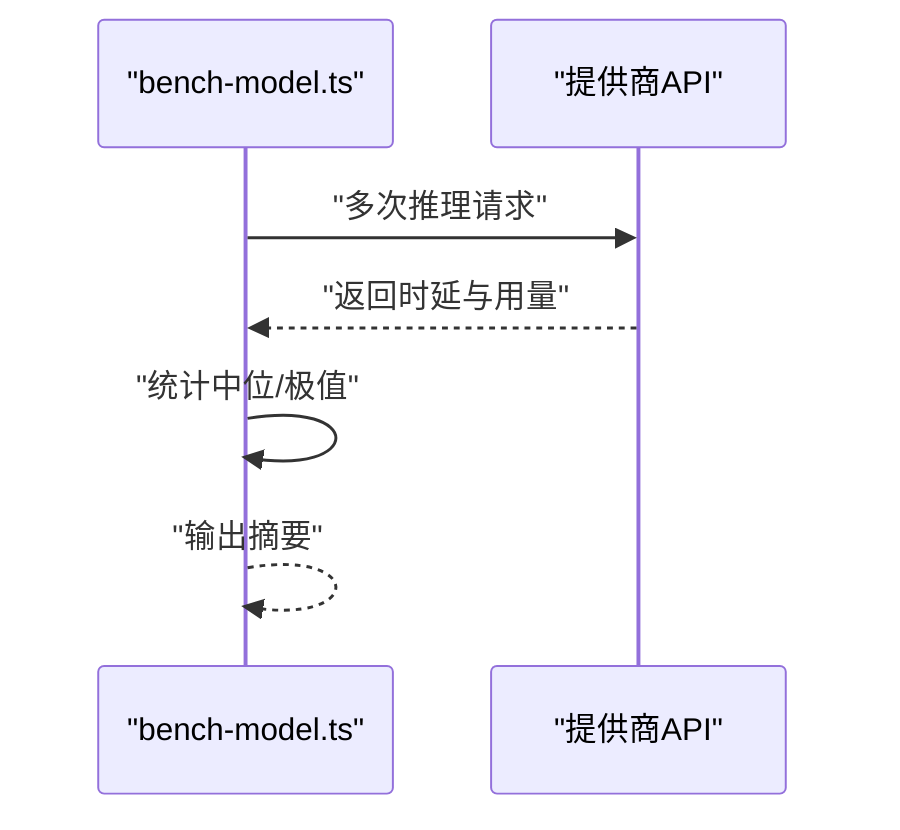
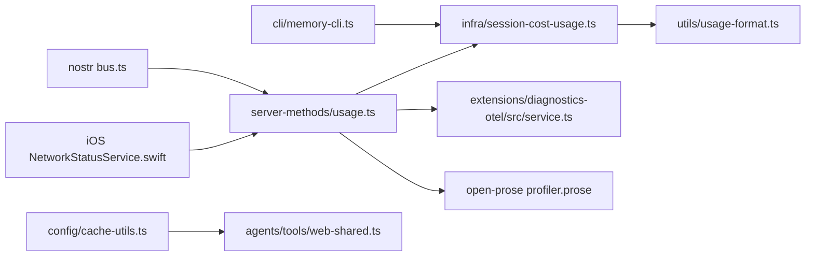

# 性能问题排查

<cite>
**本文引用的文件**
- [scripts/bench-model.ts](file://scripts/bench-model.ts)
- [src/gateway/server-methods/usage.ts](file://src/gateway/server-methods/usage.ts)
- [src/infra/session-cost-usage.ts](file://src/infra/session-cost-usage.ts)
- [src/utils/usage-format.ts](file://src/utils/usage-format.ts)
- [extensions/diagnostics-otel/src/service.ts](file://extensions/diagnostics-otel/src/service.ts)
- [extensions/open-prose/skills/prose/lib/profiler.prose](file://extensions/open-prose/skills/prose/lib/profiler.prose)
- [docs/diagnostics/flags.md](file://docs/diagnostics/flags.md)
- [docs/gateway/logging.md](file://docs/gateway/logging.md)
- [src/agents/cache-trace.ts](file://src/agents/cache-trace.ts)
- [src/agents/tools/web-shared.ts](file://src/agents/tools/web-shared.ts)
- [src/config/cache-utils.ts](file://src/config/cache-utils.ts)
- [src/telegram/sticker-cache.test.ts](file://src/telegram/sticker-cache.test.ts)
- [apps/ios/Sources/Device/NetworkStatusService.swift](file://apps/ios/Sources/Device/NetworkStatusService.swift)
- [extensions/nostr/src/nostr-bus.ts](file://extensions/nostr/src/nostr-bus.ts)
- [src/cli/memory-cli.ts](file://src/cli/memory-cli.ts)
- [docs/cli/memory.md](file://docs/cli/memory.md)
- [src/agents/pi-embedded-runner/run.ts](file://src/agents/pi-embedded-runner/run.ts)
- [apps/macos/Tests/OpenClawIPCTests/CoverageDumpTests.swift](file://apps/macos/Tests/OpenClawIPCTests/CoverageDumpTests.swift)
</cite>

## 目录

1. 引言
2. 项目结构
3. 核心组件
4. 架构总览
5. 详细组件分析
6. 依赖关系分析
7. 性能考量
8. 故障排查指南
9. 结论
10. 附录

## 引言

本指南面向OpenClaw系统的运维与开发人员，聚焦于性能问题的定位与优化。内容覆盖：

- 系统性能瓶颈识别与资源使用监控
- 响应时间优化与延迟分析
- 内存泄漏检测与CPU使用率分析
- 磁盘I/O监控与缓存策略调优
- AI模型推理延迟与网络传输优化
- 高负载场景下的系统行为与容量规划
- 日志分析中的性能指标解读与趋势分析

## 项目结构

OpenClaw由多语言模块构成：核心网关服务（TypeScript）、插件生态（TypeScript/JavaScript）、移动端平台（Swift）以及脚本工具（Bash/TypeScript）。与性能相关的关键路径包括：

- 网关侧用量统计与延迟聚合
- 用量格式化与成本估算
- 诊断与可观测性扩展（OTel）
- Profiling与趋势追踪（Open-Prose）
- 缓存与网络状态监控
- 内存索引与存储扫描
- 模型基准测试脚本

图表来源

- [src/gateway/server-methods/usage.ts](file://src/gateway/server-methods/usage.ts#L1-L200)
- [src/infra/session-cost-usage.ts](file://src/infra/session-cost-usage.ts#L1-L200)
- [src/utils/usage-format.ts](file://src/utils/usage-format.ts#L46-L86)
- [extensions/diagnostics-otel/src/service.ts](file://extensions/diagnostics-otel/src/service.ts#L346-L383)
- [extensions/open-prose/skills/prose/lib/profiler.prose](file://extensions/open-prose/skills/prose/lib/profiler.prose#L317-L400)
- [src/cli/memory-cli.ts](file://src/cli/memory-cli.ts#L122-L216)
- [docs/cli/memory.md](file://docs/cli/memory.md#L1-L46)
- [apps/ios/Sources/Device/NetworkStatusService.swift](file://apps/ios/Sources/Device/NetworkStatusService.swift#L36-L69)
- [extensions/nostr/src/nostr-bus.ts](file://extensions/nostr/src/nostr-bus.ts#L206-L259)
- [src/agents/tools/web-shared.ts](file://src/agents/tools/web-shared.ts#L1-L39)
- [src/config/cache-utils.ts](file://src/config/cache-utils.ts#L1-L27)
- [scripts/bench-model.ts](file://scripts/bench-model.ts#L1-L147)

章节来源

- [src/gateway/server-methods/usage.ts](file://src/gateway/server-methods/usage.ts#L1-L200)
- [src/infra/session-cost-usage.ts](file://src/infra/session-cost-usage.ts#L1-L200)
- [src/utils/usage-format.ts](file://src/utils/usage-format.ts#L46-L86)
- [extensions/diagnostics-otel/src/service.ts](file://extensions/diagnostics-otel/src/service.ts#L346-L383)
- [extensions/open-prose/skills/prose/lib/profiler.prose](file://extensions/open-prose/skills/prose/lib/profiler.prose#L317-L400)
- [src/cli/memory-cli.ts](file://src/cli/memory-cli.ts#L122-L216)
- [docs/cli/memory.md](file://docs/cli/memory.md#L1-L46)
- [apps/ios/Sources/Device/NetworkStatusService.swift](file://apps/ios/Sources/Device/NetworkStatusService.swift#L36-L69)
- [extensions/nostr/src/nostr-bus.ts](file://extensions/nostr/src/nostr-bus.ts#L206-L259)
- [src/agents/tools/web-shared.ts](file://src/agents/tools/web-shared.ts#L1-L39)
- [src/config/cache-utils.ts](file://src/config/cache-utils.ts#L1-L27)
- [scripts/bench-model.ts](file://scripts/bench-model.ts#L1-L147)

## 核心组件

- 用量统计与延迟聚合：网关服务对会话用量、延迟进行汇总与分组，支持按天聚合与全局统计。
- 用量格式化与成本估算：根据配置解析模型计费项并估算成本，支持输入/输出/缓存读写计费。
- 诊断与可观测性：OTel扩展将用量、时延、上下文大小等指标上报，便于外部观测系统采集。
- Profiling与趋势追踪：通过提示词驱动的分析器对单次运行、多次对比与时间序列趋势进行归因与建议。
- 缓存与网络：通用缓存工具、网络状态探测、Relay健康度评分，辅助识别I/O与网络瓶颈。
- 内存索引与存储：内存CLI负责扫描与索引，结合进度与耗时信息定位I/O瓶颈。
- 模型基准脚本：提供简单稳定的推理时延测量流程，便于对比不同模型/提供商。

章节来源

- [src/gateway/server-methods/usage.ts](file://src/gateway/server-methods/usage.ts#L572-L749)
- [src/infra/session-cost-usage.ts](file://src/infra/session-cost-usage.ts#L47-L147)
- [src/utils/usage-format.ts](file://src/utils/usage-format.ts#L46-L86)
- [extensions/diagnostics-otel/src/service.ts](file://extensions/diagnostics-otel/src/service.ts#L346-L383)
- [extensions/open-prose/skills/prose/lib/profiler.prose](file://extensions/open-prose/skills/prose/lib/profiler.prose#L317-L400)
- [src/agents/tools/web-shared.ts](file://src/agents/tools/web-shared.ts#L1-L39)
- [apps/ios/Sources/Device/NetworkStatusService.swift](file://apps/ios/Sources/Device/NetworkStatusService.swift#L36-L69)
- [extensions/nostr/src/nostr-bus.ts](file://extensions/nostr/src/nostr-bus.ts#L206-L259)
- [src/cli/memory-cli.ts](file://src/cli/memory-cli.ts#L557-L644)
- [scripts/bench-model.ts](file://scripts/bench-model.ts#L50-L79)

## 架构总览

下图展示从用量数据采集到指标上报与趋势分析的整体链路，强调关键性能指标的汇聚点与输出面。

图表来源

- [src/gateway/server-methods/usage.ts](file://src/gateway/server-methods/usage.ts#L572-L749)
- [src/infra/session-cost-usage.ts](file://src/infra/session-cost-usage.ts#L47-L147)
- [src/utils/usage-format.ts](file://src/utils/usage-format.ts#L46-L86)
- [extensions/diagnostics-otel/src/service.ts](file://extensions/diagnostics-otel/src/service.ts#L346-L383)
- [extensions/open-prose/skills/prose/lib/profiler.prose](file://extensions/open-prose/skills/prose/lib/profiler.prose#L317-L400)

## 详细组件分析

### 组件A：用量统计与延迟聚合

- 功能要点
  - 解析日期范围与默认窗口（最近30天）
  - 聚合延迟指标（总数、均值、最小/最大、P95）
  - 按天聚合用量与成本，支持模型维度
  - 缓存机制降低重复计算开销
- 关键路径
  - 日期解析与窗口构造
  - 会话发现与并行加载
  - 聚合计数与统计量合并
- 性能影响
  - 大窗口与多代理并发会增加I/O与CPU
  - 合理设置缓存TTL可减少重复计算
  - 分页/限流策略避免瞬时峰值

图表来源

- [src/gateway/server-methods/usage.ts](file://src/gateway/server-methods/usage.ts#L90-L191)

章节来源

- [src/gateway/server-methods/usage.ts](file://src/gateway/server-methods/usage.ts#L90-L191)
- [src/gateway/server-methods/usage.ts](file://src/gateway/server-methods/usage.ts#L572-L749)

### 组件B：用量格式化与成本估算

- 功能要点
  - 从配置解析模型计费项（输入/输出/缓存读写）
  - 将用量标准化后按单价估算总费用
  - 对异常值进行保护与过滤
- 性能影响
  - 计算复杂度低，主要受数据量影响
  - 成本估算用于趋势与预算控制，不参与实时决策

图表来源

- [src/utils/usage-format.ts](file://src/utils/usage-format.ts#L46-L86)

章节来源

- [src/utils/usage-format.ts](file://src/utils/usage-format.ts#L46-L86)

### 组件C：诊断与可观测性（OTel）

- 功能要点
  - 上报令牌计数（输入/输出/缓存/提示/总计）
  - 上报时延直方图与上下文大小直方图
  - 成本事件上报
- 性能影响
  - 导出器开销可控，建议在生产环境启用以获取稳定指标

图表来源

- [extensions/diagnostics-otel/src/service.ts](file://extensions/diagnostics-otel/src/service.ts#L346-L383)

章节来源

- [extensions/diagnostics-otel/src/service.ts](file://extensions/diagnostics-otel/src/service.ts#L346-L383)

### 组件D：Profiling与趋势追踪（Open-Prose）

- 功能要点
  - 单次运行：成本/时间归因、并行因子、热点识别、效率评估
  - 多次对比：差异与回归检测
  - 时间趋势：成本与时延走势与异常标记
- 性能影响
  - 分析阶段基于预计算指标，不引入额外推理开销
  - 建议在压测或离线场景启用，避免干扰线上流量

图表来源

- [extensions/open-prose/skills/prose/lib/profiler.prose](file://extensions/open-prose/skills/prose/lib/profiler.prose#L317-L400)

章节来源

- [extensions/open-prose/skills/prose/lib/profiler.prose](file://extensions/open-prose/skills/prose/lib/profiler.prose#L317-L400)

### 组件E：缓存策略与网络状态

- 缓存工具
  - TTL解析、启用判断、LRU辅助结构
  - Web共享缓存封装（超时、TTL、键规范化）
- 网络状态
  - iOS端网络状态探测（接口类型、是否昂贵/受限）
- Relays健康度
  - 成功率、延迟统计、近期性加权评分

图表来源

- [src/config/cache-utils.ts](file://src/config/cache-utils.ts#L1-L27)
- [src/agents/tools/web-shared.ts](file://src/agents/tools/web-shared.ts#L1-L39)
- [apps/ios/Sources/Device/NetworkStatusService.swift](file://apps/ios/Sources/Device/NetworkStatusService.swift#L36-L69)
- [extensions/nostr/src/nostr-bus.ts](file://extensions/nostr/src/nostr-bus.ts#L206-L259)

章节来源

- [src/config/cache-utils.ts](file://src/config/cache-utils.ts#L1-L27)
- [src/agents/tools/web-shared.ts](file://src/agents/tools/web-shared.ts#L1-L39)
- [apps/ios/Sources/Device/NetworkStatusService.swift](file://apps/ios/Sources/Device/NetworkStatusService.swift#L36-L69)
- [extensions/nostr/src/nostr-bus.ts](file://extensions/nostr/src/nostr-bus.ts#L206-L259)

### 组件F：内存索引与I/O监控

- 功能要点
  - 扫描内存文件与目录，校验可读性与存在性
  - 索引过程显示进度、耗时与ETA，便于定位I/O瓶颈
- 性能影响
  - 大规模文件扫描可能成为瓶颈
  - 建议分批/限速与合理缓存

图表来源

- [src/cli/memory-cli.ts](file://src/cli/memory-cli.ts#L122-L216)
- [src/cli/memory-cli.ts](file://src/cli/memory-cli.ts#L557-L644)

章节来源

- [src/cli/memory-cli.ts](file://src/cli/memory-cli.ts#L122-L216)
- [src/cli/memory-cli.ts](file://src/cli/memory-cli.ts#L557-L644)
- [docs/cli/memory.md](file://docs/cli/memory.md#L1-L46)

### 组件G：模型推理延迟基准

- 功能要点
  - 固定提示与多次运行，统计中位/最小/最大时延
  - 支持不同提供商与模型对比
- 性能影响
  - 适合离线对比，避免与线上流量竞争资源

图表来源

- [scripts/bench-model.ts](file://scripts/bench-model.ts#L50-L79)
- [scripts/bench-model.ts](file://scripts/bench-model.ts#L130-L144)

章节来源

- [scripts/bench-model.ts](file://scripts/bench-model.ts#L1-L147)

## 依赖关系分析

- 网关用量接口依赖用量基础设施与格式化工具
- OTel扩展独立于业务逻辑，仅消费事件
- Profiling分析器消费聚合后的指标
- 缓存与网络工具被多处复用
- 内存CLI依赖会话路径解析与扫描能力

图表来源

- [src/gateway/server-methods/usage.ts](file://src/gateway/server-methods/usage.ts#L1-L200)
- [src/infra/session-cost-usage.ts](file://src/infra/session-cost-usage.ts#L1-L200)
- [src/utils/usage-format.ts](file://src/utils/usage-format.ts#L46-L86)
- [extensions/diagnostics-otel/src/service.ts](file://extensions/diagnostics-otel/src/service.ts#L346-L383)
- [extensions/open-prose/skills/prose/lib/profiler.prose](file://extensions/open-prose/skills/prose/lib/profiler.prose#L317-L400)
- [src/cli/memory-cli.ts](file://src/cli/memory-cli.ts#L122-L216)
- [src/config/cache-utils.ts](file://src/config/cache-utils.ts#L1-L27)
- [src/agents/tools/web-shared.ts](file://src/agents/tools/web-shared.ts#L1-L39)
- [apps/ios/Sources/Device/NetworkStatusService.swift](file://apps/ios/Sources/Device/NetworkStatusService.swift#L36-L69)
- [extensions/nostr/src/nostr-bus.ts](file://extensions/nostr/src/nostr-bus.ts#L206-L259)

章节来源

- [src/gateway/server-methods/usage.ts](file://src/gateway/server-methods/usage.ts#L1-L200)
- [src/infra/session-cost-usage.ts](file://src/infra/session-cost-usage.ts#L1-L200)
- [src/utils/usage-format.ts](file://src/utils/usage-format.ts#L46-L86)
- [extensions/diagnostics-otel/src/service.ts](file://extensions/diagnostics-otel/src/service.ts#L346-L383)
- [extensions/open-prose/skills/prose/lib/profiler.prose](file://extensions/open-prose/skills/prose/lib/profiler.prose#L317-L400)
- [src/cli/memory-cli.ts](file://src/cli/memory-cli.ts#L122-L216)
- [src/config/cache-utils.ts](file://src/config/cache-utils.ts#L1-L27)
- [src/agents/tools/web-shared.ts](file://src/agents/tools/web-shared.ts#L1-L39)
- [apps/ios/Sources/Device/NetworkStatusService.swift](file://apps/ios/Sources/Device/NetworkStatusService.swift#L36-L69)
- [extensions/nostr/src/nostr-bus.ts](file://extensions/nostr/src/nostr-bus.ts#L206-L259)

## 性能考量

- 延迟与吞吐
  - 使用延迟聚合与P95指标识别尾部延迟
  - 通过OTel直方图观察时延分布
- 成本与效率
  - 基于用量估算成本，关注输入/输出/缓存读写占比
  - 结合吞吐与成本评估“性价比”
- 并行与批处理
  - Profiling建议中明确并行机会与批处理机会
- 缓存效率
  - 通过读写比评估缓存命中质量
- I/O与索引
  - 内存索引进度与耗时可用于定位I/O瓶颈
- 网络与Relay
  - 网络状态与Relay健康度评分有助于识别网络层面的抖动

[本节为通用指导，无需特定文件来源]

## 故障排查指南

### 1. 系统性能瓶颈识别

- 步骤
  - 使用用量接口查询最近窗口的延迟与用量
  - 对比不同模型/提供商的时延与成本
  - 查看每日用量与延迟趋势，识别异常波动
- 工具
  - 网关用量接口与CLI
  - OTel导出器
  - Profiling分析器

章节来源

- [src/gateway/server-methods/usage.ts](file://src/gateway/server-methods/usage.ts#L572-L749)
- [extensions/diagnostics-otel/src/service.ts](file://extensions/diagnostics-otel/src/service.ts#L346-L383)
- [extensions/open-prose/skills/prose/lib/profiler.prose](file://extensions/open-prose/skills/prose/lib/profiler.prose#L317-L400)

### 2. 资源使用监控

- 日志与诊断标志
  - 使用诊断标志定向捕获子系统日志，避免提升全局日志级别
  - 文件日志与WebSocket日志分别用于后台与交互式调试
- 日志位置与提取
  - 默认滚动文件位于临时目录，按日期轮转
  - 可通过CLI或正则过滤快速定位问题

章节来源

- [docs/diagnostics/flags.md](file://docs/diagnostics/flags.md#L1-L92)
- [docs/gateway/logging.md](file://docs/gateway/logging.md#L1-L114)

### 3. 响应时间优化

- 方法
  - 识别慢查询与长尾延迟（P95）
  - 评估并行化程度，寻找串行瓶颈
  - 优化上下文长度与提示词结构
- 工具
  - 延迟聚合与趋势分析
  - Profiling建议

章节来源

- [src/gateway/server-methods/usage.ts](file://src/gateway/server-methods/usage.ts#L572-L749)
- [extensions/open-prose/skills/prose/lib/profiler.prose](file://extensions/open-prose/skills/prose/lib/profiler.prose#L317-L400)

### 4. 内存泄漏检测

- 方法
  - 定期执行内存索引与扫描，观察索引耗时与进度
  - 若索引时间显著增长，可能存在未释放的句柄或缓存膨胀
- 工具
  - 内存CLI与进度输出
  - 缓存工具集（TTL/启用/键规范化）

章节来源

- [src/cli/memory-cli.ts](file://src/cli/memory-cli.ts#L557-L644)
- [src/config/cache-utils.ts](file://src/config/cache-utils.ts#L1-L27)
- [src/agents/tools/web-shared.ts](file://src/agents/tools/web-shared.ts#L1-L39)

### 5. CPU使用率分析

- 方法
  - 在非高峰时段运行Profiling分析，避免干扰线上流量
  - 关注“昂贵且快”与“便宜且慢”的反常组合
- 工具
  - Profiling分析器
  - OTel直方图

章节来源

- [extensions/open-prose/skills/prose/lib/profiler.prose](file://extensions/open-prose/skills/prose/lib/profiler.prose#L317-L400)
- [extensions/diagnostics-otel/src/service.ts](file://extensions/diagnostics-otel/src/service.ts#L346-L383)

### 6. 磁盘I/O监控

- 方法
  - 观察内存索引过程的耗时与ETA
  - 对大目录或大量小文件场景，考虑分批处理或缓存策略
- 工具
  - 内存CLI进度输出
  - 缓存工具集

章节来源

- [src/cli/memory-cli.ts](file://src/cli/memory-cli.ts#L557-L644)
- [src/config/cache-utils.ts](file://src/config/cache-utils.ts#L1-L27)
- [src/agents/tools/web-shared.ts](file://src/agents/tools/web-shared.ts#L1-L39)

### 7. AI模型推理延迟

- 方法
  - 使用基准脚本固定提示与多次运行，统计中位/最小/最大时延
  - 对比不同提供商与模型，选择适合任务的性价比方案
- 工具
  - 模型基准脚本

章节来源

- [scripts/bench-model.ts](file://scripts/bench-model.ts#L50-L79)
- [scripts/bench-model.ts](file://scripts/bench-model.ts#L130-L144)

### 8. 网络传输优化

- 方法
  - 使用网络状态探测识别昂贵/受限网络
  - 通过Relay健康度评分选择更可靠的上游
- 工具
  - iOS网络状态服务
  - Relay健康度跟踪器

章节来源

- [apps/ios/Sources/Device/NetworkStatusService.swift](file://apps/ios/Sources/Device/NetworkStatusService.swift#L36-L69)
- [extensions/nostr/src/nostr-bus.ts](file://extensions/nostr/src/nostr-bus.ts#L206-L259)

### 9. 缓存策略调整

- 方法
  - 评估读写比，优化TTL与容量
  - 对频繁访问的数据启用缓存，对易变数据缩短TTL
- 工具
  - 缓存工具集
  - 测试用例验证缓存统计

章节来源

- [src/agents/tools/web-shared.ts](file://src/agents/tools/web-shared.ts#L1-L39)
- [src/config/cache-utils.ts](file://src/config/cache-utils.ts#L1-L27)
- [src/telegram/sticker-cache.test.ts](file://src/telegram/sticker-cache.test.ts#L231-L257)

### 10. 高负载场景下的系统行为与容量规划

- 方法
  - 利用用量接口与趋势分析识别峰值与异常
  - 通过Profiling建议制定降级与并行化策略
  - 结合成本估算进行容量与预算规划
- 工具
  - 用量接口与趋势分析
  - 成本估算工具

章节来源

- [src/gateway/server-methods/usage.ts](file://src/gateway/server-methods/usage.ts#L572-L749)
- [extensions/open-prose/skills/prose/lib/profiler.prose](file://extensions/open-prose/skills/prose/lib/profiler.prose#L317-L400)
- [src/utils/usage-format.ts](file://src/utils/usage-format.ts#L46-L86)

### 11. 日志分析中的性能指标解读与趋势分析

- 方法
  - 使用诊断标志与日志文件定位问题
  - 通过OTel直方图与趋势记录进行量化分析
- 工具
  - 诊断标志文档
  - OTel导出器
  - Profiling趋势记录

章节来源

- [docs/diagnostics/flags.md](file://docs/diagnostics/flags.md#L1-L92)
- [docs/gateway/logging.md](file://docs/gateway/logging.md#L1-L114)
- [extensions/diagnostics-otel/src/service.ts](file://extensions/diagnostics-otel/src/service.ts#L346-L383)
- [extensions/open-prose/skills/prose/lib/profiler.prose](file://extensions/open-prose/skills/prose/lib/profiler.prose#L383-L396)

## 结论

通过用量统计、成本估算、OTel可观测性、Profiling分析与缓存/网络工具的协同，OpenClaw提供了从指标采集到趋势洞察的完整性能闭环。建议在非高峰时段进行深度分析与压测，结合Profiling建议持续优化模型选择、上下文长度与并行策略，并通过缓存与网络策略降低I/O与传输成本。

[本节为总结，无需特定文件来源]

## 附录

### A. 诊断标志与日志提取示例

- 启用子系统诊断标志并提取错误
- 使用CLI或正则过滤快速定位问题

章节来源

- [docs/diagnostics/flags.md](file://docs/diagnostics/flags.md#L65-L85)
- [docs/gateway/logging.md](file://docs/gateway/logging.md#L28-L33)

### B. 缓存统计与验证

- 通过测试用例验证缓存统计（数量、最老/最新时间）

章节来源

- [src/telegram/sticker-cache.test.ts](file://src/telegram/sticker-cache.test.ts#L231-L257)

### C. 内存索引进度与耗时

- 观察索引过程的耗时与ETA，定位I/O瓶颈

章节来源

- [src/cli/memory-cli.ts](file://src/cli/memory-cli.ts#L557-L644)

### D. 模型基准测试

- 使用固定提示与多次运行，统计中位/最小/最大时延

章节来源

- [scripts/bench-model.ts](file://scripts/bench-model.ts#L50-L79)
- [scripts/bench-model.ts](file://scripts/bench-model.ts#L130-L144)

### E. 用量与成本估算

- 解析模型计费配置并估算成本

章节来源

- [src/utils/usage-format.ts](file://src/utils/usage-format.ts#L46-L86)

### F. 用量聚合与趋势

- 按天聚合延迟与用量，生成趋势记录

章节来源

- [src/gateway/server-methods/usage.ts](file://src/gateway/server-methods/usage.ts#L572-L749)
- [extensions/open-prose/skills/prose/lib/profiler.prose](file://extensions/open-prose/skills/prose/lib/profiler.prose#L383-L396)

### G. 编译与覆盖率导出（Mac）

- 在具备覆盖率环境变量时定期刷新覆盖率文件

章节来源

- [apps/macos/Tests/OpenClawIPCTests/CoverageDumpTests.swift](file://apps/macos/Tests/OpenClawIPCTests/CoverageDumpTests.swift#L7-L15)
