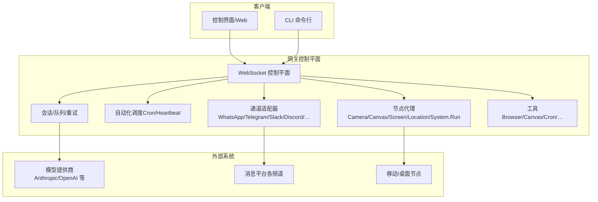
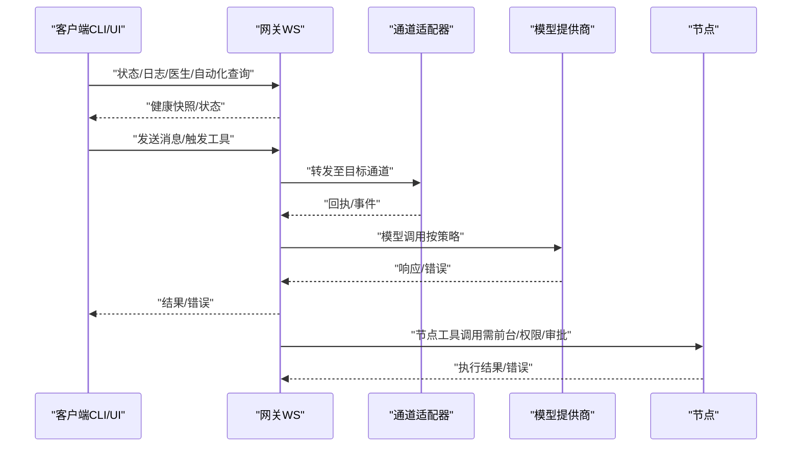
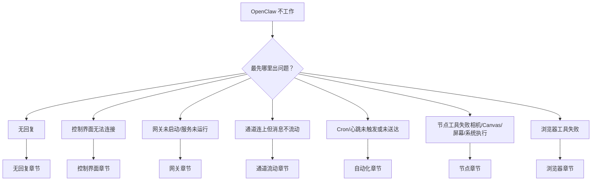
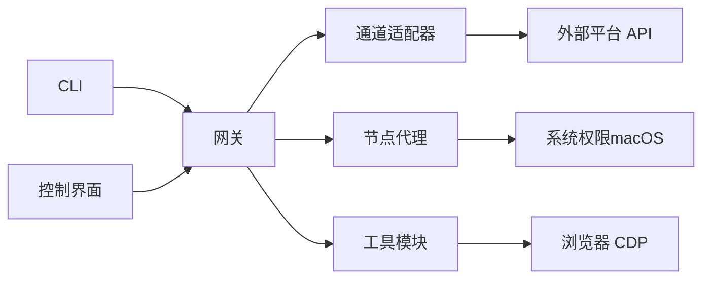

# 故障排除

<cite>
**本文引用的文件**
- [README.md](file://README.md)
- [故障排除（总览）.md](file://docs/help/troubleshooting.md)
- [网关故障排除.md](file://docs/gateway/troubleshooting.md)
- [通道故障排除.md](file://docs/channels/troubleshooting.md)
- [自动化故障排除.md](file://docs/automation/troubleshooting.md)
- [节点故障排除.md](file://docs/nodes/troubleshooting.md)
- [医生命令.md](file://docs/gateway/doctor.md)
- [健康检查（CLI）.md](file://docs/gateway/health.md)
- [日志.md](file://docs/logging.md)
- [doctor（CLI）.md](file://docs/cli/doctor.md)
</cite>

## 目录

1. [简介](#简介)
2. [项目结构](#项目结构)
3. [核心组件](#核心组件)
4. [架构总览](#架构总览)
5. [详细组件分析](#详细组件分析)
6. [依赖关系分析](#依赖关系分析)
7. [性能注意事项](#性能注意事项)
8. [故障排除指南](#故障排除指南)
9. [结论](#结论)
10. [附录](#附录)

## 简介

本指南面向 OpenClaw 的使用者与运维人员，提供系统化的故障排除流程、日志分析技巧、性能优化建议与安全注意事项。内容覆盖网络连接问题、权限配置错误、模型认证失败、自动化调度异常、节点工具调用失败、浏览器工具不可用等常见场景，并给出可操作的诊断步骤与修复建议。

## 项目结构

OpenClaw 采用“网关控制平面 + 多通道 + 节点 + 工具”的分层架构。用户通过 CLI 或 Web 控制界面与网关交互；网关负责会话管理、路由策略、自动化调度与通道适配器；通道适配器对接各消息平台；节点负责设备侧能力（相机、屏幕录制、位置、系统执行等）；工具模块提供浏览器控制、Canvas、Cron、心跳等能力。

图示来源

- [README.md](file://README.md#L180-L220)

章节来源

- [README.md](file://README.md#L180-L220)

## 核心组件

- 网关（Gateway）
  - WebSocket 控制平面，承载会话、队列、重试、自动化、通道与节点管理。
  - 提供健康检查、状态查询、日志尾随、医生命令等诊断与修复能力。
- 通道（Channels）
  - 支持 WhatsApp、Telegram、Slack、Discord、Google Chat、Signal、iMessage/BlueBubbles、Microsoft Teams、Matrix、Zalo、WebChat 等。
  - 每个通道有独立的认证、权限、群组规则与隐私策略。
- 节点（Nodes）
  - iOS/Android/macOS 节点，提供相机、屏幕录制、位置、系统执行等能力。
  - 需要前台运行、系统权限与执行审批。
- 自动化（Automation）
  - Cron 定时任务与 Heartbeat 心跳，支持活动时段、并发与投递目标配置。
- 工具（Tools）
  - 浏览器控制（CDP）、Canvas、Cron、会话间通信等。

章节来源

- [README.md](file://README.md#L140-L170)

## 架构总览

下图展示从客户端到网关、通道与节点的关键交互路径，以及常见故障点（认证、权限、网络、调度）：

图示来源

- [README.md](file://README.md#L180-L220)
- [网关故障排除.md](file://docs/gateway/troubleshooting.md#L14-L31)

## 详细组件分析

### 症状优先级诊断流程（快速三分钟）

- 第一步：基础健康检查
  - 运行命令链：status、status --all、gateway probe、gateway status、doctor、channels status --probe、logs --follow
  - 关注点：网关运行中、RPC 探测成功、通道已连接/就绪、无致命重复错误
- 第二步：症状归类
  - 无回复、控制界面无法连接、网关未启动、通道连上但消息不流动、Cron/心跳未触发、节点工具失败、浏览器工具失败
- 第三步：按症状进入对应深度排障页

图示来源

- [故障排除（总览）.md](file://docs/help/troubleshooting.md#L39-L57)

章节来源

- [故障排除（总览）.md](file://docs/help/troubleshooting.md#L13-L36)
- [故障排除（总览）.md](file://docs/help/troubleshooting.md#L39-L57)

### 网关故障排除

- 基础命令链
  - openclaw status、gateway status、logs --follow、doctor、channels status --probe
  - 健康信号：Runtime: running、RPC probe: ok、通道 probe connected/ready
- 典型问题与定位
  - 无回复：检查路由、策略（提及要求、允许名单）、配对状态
  - 控制界面无法连接：校验 URL、鉴权模式、设备身份、HTTPS/安全上下文
  - 网关未启动/服务未运行：检查本地模式、绑定地址与鉴权、端口冲突
  - 通道连上但消息不流动：检查 DM 策略、群组允许名单与提及要求、缺失的 API 权限
  - Cron/心跳未触发或未送达：检查调度器状态、作业历史、静默时段、投递目标有效性
  - 节点工具失败：前台运行、系统权限、执行审批与白名单
  - 浏览器工具失败：可执行路径、CDP 可达性、扩展中继标签页
- 升级后异常
  - 本地/远程模式切换、URL 覆盖行为变更、更严格的绑定与鉴权约束、设备身份与配对状态变化

章节来源

- [网关故障排除.md](file://docs/gateway/troubleshooting.md#L14-L31)
- [网关故障排除.md](file://docs/gateway/troubleshooting.md#L32-L61)
- [网关故障排除.md](file://docs/gateway/troubleshooting.md#L62-L91)
- [网关故障排除.md](file://docs/gateway/troubleshooting.md#L92-L121)
- [网关故障排除.md](file://docs/gateway/troubleshooting.md#L122-L152)
- [网关故障排除.md](file://docs/gateway/troubleshooting.md#L153-L183)
- [网关故障排除.md](file://docs/gateway/troubleshooting.md#L184-L214)
- [网关故障排除.md](file://docs/gateway/troubleshooting.md#L215-L245)
- [网关故障排除.md](file://docs/gateway/troubleshooting.md#L246-L319)

### 通道故障排除（WhatsApp/Telegram/Discord/Slack/iMessage/Signal/Matrix 等）

- 基础命令链：status、gateway status、logs --follow、doctor、channels status --probe
- 快速检查清单
  - WhatsApp：配对列表、提及要求、随机断开/重登
  - Telegram：/start 后无可用回复流、群组静默（隐私模式/提及）、网络错误（DNS/IPv6/代理）
  - Discord：服务器连上但无公会回复、群组被忽略（提及要求）、DM 回复缺失
  - Slack：Socket 模式连上但无响应、DM 被阻止、频道被忽略（策略/允许名单）
  - iMessage/BlueBubbles：无入站事件（webhook/服务器可达性）、macOS 权限、DM 发送方被阻止
  - Signal：守护进程可达但机器人静默、DM 被阻止、群组未触发（允许名单/提及）
  - Matrix：登录但忽略房间消息、DM 未处理、加密房间失败
- 建议先决条件：通道已连接且 probe 显示 ready；若仍异常，结合各通道文档进行专项排查

章节来源

- [通道故障排除.md](file://docs/channels/troubleshooting.md#L13-L30)
- [通道故障排除.md](file://docs/channels/troubleshooting.md#L31-L42)
- [通道故障排除.md](file://docs/channels/troubleshooting.md#L43-L54)
- [通道故障排除.md](file://docs/channels/troubleshooting.md#L55-L66)
- [通道故障排除.md](file://docs/channels/troubleshooting.md#L67-L78)
- [通道故障排除.md](file://docs/channels/troubleshooting.md#L79-L93)
- [通道故障排除.md](file://docs/channels/troubleshooting.md#L94-L104)
- [通道故障排除.md](file://docs/channels/troubleshooting.md#L106-L117)

### 自动化故障排除（Cron/Heartbeat）

- 基础命令链：status、gateway status、logs --follow、doctor、channels status --probe
- 进阶命令链：cron status、cron list、cron runs --id <jobId> --limit 20、system heartbeat last
- 常见症状与定位
  - Cron 未触发：调度器禁用、定时器 tick 失败、非强制手动运行但未到期
  - Cron 触发但未送达：内部执行成功但投递模式为 none、投递目标缺失/无效、通道鉴权错误
  - Heartbeat 被抑制/跳过：静默时段、主通道繁忙、心跳文件为空、可见性设置关闭
  - 时区与活动时段陷阱：用户时区未配置、主机时区变更导致错峰、活动时段时区配置不当
- 建议：核对 activeHours、userTimezone、IANA 时区、Cron at 表达式是否带时区

章节来源

- [自动化故障排除.md](file://docs/automation/troubleshooting.md#L14-L31)
- [自动化故障排除.md](file://docs/automation/troubleshooting.md#L32-L52)
- [自动化故障排除.md](file://docs/automation/troubleshooting.md#L53-L73)
- [自动化故障排除.md](file://docs/automation/troubleshooting.md#L74-L94)
- [自动化故障排除.md](file://docs/automation/troubleshooting.md#L95-L116)

### 节点故障排除（相机/Canvas/屏幕/系统执行）

- 基础命令链：status、gateway status、logs --follow、doctor、channels status --probe
- 节点特定命令：nodes status、nodes describe --node <id>、approvals get --node <id>
- 健康信号：节点已连接并配对为 node 角色、capability 存在、执行审批与白名单符合预期
- 常见症状与定位
  - 前台限制：canvas._、camera._、screen.\* 在 iOS/Android 上仅前台可用（提示 NODE_BACKGROUND_UNAVAILABLE）
  - 权限矩阵：相机/麦克风/屏幕录制/位置权限缺失或被拒（\*\_PERMISSION_REQUIRED、LOCATION_PERMISSION_REQUIRED）
  - 执行审批：system.run 被拒（approval required 或 allowlist miss）
- 快速恢复循环：重新配对设备、前台打开节点应用、重新授予系统权限、重建/调整执行审批策略

章节来源

- [节点故障排除.md](file://docs/nodes/troubleshooting.md#L13-L30)
- [节点故障排除.md](file://docs/nodes/troubleshooting.md#L37-L50)
- [节点故障排除.md](file://docs/nodes/troubleshooting.md#L51-L60)
- [节点故障排除.md](file://docs/nodes/troubleshooting.md#L60-L78)
- [节点故障排除.md](file://docs/nodes/troubleshooting.md#L79-L89)
- [节点故障排除.md](file://docs/nodes/troubleshooting.md#L90-L105)

### 浏览器工具故障排除

- 基础命令链：status、gateway status、browser status、logs --follow、doctor
- 关注点：浏览器可执行路径、CDP 可达性、扩展中继标签页（profile="chrome"）
- 常见症状与定位
  - 本地浏览器启动失败（Failed to start Chrome CDP on port）
  - 配置的可执行路径不存在（browser.executablePath not found）
  - 扩展中继运行但无标签页连接（Chrome extension relay is running, but no tab is connected）
  - 仅附加模式配置但无可达目标（Browser attachOnly is enabled ... not reachable）

章节来源

- [网关故障排除.md](file://docs/gateway/troubleshooting.md#L215-L245)

### 日志与可观测性

- 日志位置与格式
  - 文件日志：/tmp/openclaw/openclaw-YYYY-MM-DD.log（默认），支持 JSON Lines
  - 控制台输出：TTY 友好、彩色、可选紧凑/JSON 模式
- 日志查看方式
  - CLI 实时尾随：openclaw logs --follow（TTY/非 TTY/JSON/Plain/去色）
  - 控制界面 Logs 标签页
  - 通道专属日志：openclaw channels logs --channel whatsapp
- 日志级别与格式
  - logging.level（文件日志）、logging.consoleLevel（控制台）
  - logging.consoleStyle：pretty/compact/json
  - 敏感信息脱敏：logging.redactSensitive、logging.redactPatterns
- 诊断事件与导出
  - 诊断事件：模型用量、消息流、队列/会话、心跳聚合
  - 导出：OTLP/HTTP（OTEL SDK 数据模型 + 协议），支持指标、追踪、日志
  - 采样与刷新间隔：sampleRate、flushIntervalMs
  - 环境变量覆盖：OTEL\_\*、OPENCLAW_DIAGNOSTICS

章节来源

- [日志.md](file://docs/logging.md#L20-L62)
- [日志.md](file://docs/logging.md#L69-L81)
- [日志.md](file://docs/logging.md#L82-L139)
- [日志.md](file://docs/logging.md#L140-L221)
- [日志.md](file://docs/logging.md#L222-L351)

### 医生命令（Doctor）

- 作用：健康检查、配置迁移、修复步骤、重启提示、通道状态警告、服务审计、端口冲突诊断、安全警告、systemd linger 检查、技能状态摘要、网关鉴权检查、运行时最佳实践检查
- 常用参数：--yes、--repair、--repair --force、--non-interactive、--deep
- 交互行为：TTY 时才弹出交互提示；headless（无终端）跳过提示
- macOS 特别注意：launchctl setenv OPENCLAW_GATEWAY_TOKEN/PASSWORD 会覆盖配置，导致持续 unauthorized

章节来源

- [医生命令.md](file://docs/gateway/doctor.md#L14-L58)
- [医生命令.md](file://docs/gateway/doctor.md#L59-L84)
- [医生命令.md](file://docs/gateway/doctor.md#L85-L153)
- [医生命令.md](file://docs/gateway/doctor.md#L154-L283)
- [doctor（CLI）.md](file://docs/cli/doctor.md#L31-L41)

### 健康检查（CLI）

- 快速检查：openclaw status、status --all、status --deep、health --json
- 深度诊断：凭证文件存在与最近修改时间、会话存储、重新登录流程
- 失败时处理：根据日志中的 409–515 或 loggedOut 状态执行 logout/login；网关不可达则启动网关；无入站消息时确认手机在线与允许名单

章节来源

- [健康检查（CLI）.md](file://docs/gateway/health.md#L12-L36)

## 依赖关系分析

- 组件耦合
  - 网关是中枢，通道与节点通过 WS 与其交互；自动化依赖网关调度器；工具模块受网关配置与鉴权影响
- 外部依赖
  - 消息平台 API（各通道）、模型提供商 API（Anthropic/OpenAI 等）、浏览器 CDP、系统权限（macOS TCC/通知/屏幕录制）
- 风险点
  - 鉴权与绑定策略（gateway.auth/gateway.bind）、通道权限（scope/隐私模式）、节点前台与权限、浏览器可执行路径与扩展中继

图示来源

- [README.md](file://README.md#L180-L220)

章节来源

- [README.md](file://README.md#L180-L220)

## 性能注意事项

- 日志级别与导出
  - 将 logging.level 调整为 info/debug/trace 以获取更多细节；生产环境建议保持 info 并配合诊断标志位
  - OTLP 导出日志量较大，建议在高吞吐场景启用采样与后端过滤
- 调度与并发
  - Cron/Heartbeat 的活动时段与时区配置正确，避免不必要的跳过
  - 队列深度与等待时间可通过诊断事件观测，必要时调整 lanes 或并发策略
- 资源使用
  - 浏览器工具占用 CPU/内存，建议在空闲时段运行长任务
  - 节点工具（相机/屏幕录制）仅前台可用，减少后台切换带来的失败与重试

[本节为通用指导，无需具体文件引用]

## 故障排除指南

### 系统性故障排除流程

- 步骤一：基础健康检查
  - openclaw status、openclaw status --all、openclaw gateway probe、openclaw gateway status、openclaw doctor、openclaw channels status --probe、openclaw logs --follow
- 步骤二：症状归类与定向排查
  - 依据“症状优先级诊断流程”选择对应章节
- 步骤三：执行修复与验证
  - 使用 doctor 的 --repair/--force/--non-interactive 参数进行自动修复
  - 重新登录通道、更新权限、调整策略、提升日志级别、启用诊断标志位
- 步骤四：回归验证
  - 再次运行健康检查命令链，确认症状消失

章节来源

- [故障排除（总览）.md](file://docs/help/troubleshooting.md#L13-L36)
- [网关故障排除.md](file://docs/gateway/troubleshooting.md#L14-L31)

### 常见问题与解决方案

- 网络连接问题
  - 症状：控制界面无法连接、RPC 探测失败、网关不可达
  - 排查：确认 gateway.bind 与 gateway.auth 配置、端口未被占用、URL/端口正确、HTTPS 与设备身份要求满足
  - 修复：调整绑定与鉴权、更换端口、确保安全上下文、使用 doctor 校正服务配置
- 权限配置错误
  - 症状：通道鉴权失败（401/403/Forbidden）、缺少 scope、不在频道内
  - 排查：核对各通道的 bot/app token、scope、隐私模式与群组策略
  - 修复：补充/更新令牌与 scope、调整群组策略、重新登录通道
- 模型认证失败
  - 症状：OAuth 过期、无法刷新、认证冷却/禁用
  - 排查：doctor 检测 OAuth 状态、必要时刷新或提示使用 setup-token
  - 修复：交互式刷新或手动设置 token；必要时临时放宽冷却
- 自动化调度异常
  - 症状：Cron 未触发、心跳被跳过、投递失败
  - 排查：cron status/list/runs、heartbeat last、活动时段与时区、投递目标有效性
  - 修复：启用调度器、修正时区与时钟、调整活动时段、补齐投递目标
- 节点工具失败
  - 症状：NODE_BACKGROUND_UNAVAILABLE、\*\_PERMISSION_REQUIRED、SYSTEM_RUN_DENIED
  - 排查：前台运行、系统权限、执行审批与白名单
  - 修复：前台打开节点应用、重新授予权限、调整执行审批策略
- 浏览器工具失败
  - 症状：无法启动 CDP、可执行路径不存在、扩展中继无标签页、attach-only 无可达目标
  - 排查：浏览器路径、CDP 端口、扩展中继状态
  - 修复：修正可执行路径、确保扩展中继连接、切换 profile 或修复可达性

章节来源

- [网关故障排除.md](file://docs/gateway/troubleshooting.md#L62-L91)
- [网关故障排除.md](file://docs/gateway/troubleshooting.md#L92-L121)
- [通道故障排除.md](file://docs/channels/troubleshooting.md#L31-L117)
- [自动化故障排除.md](file://docs/automation/troubleshooting.md#L32-L116)
- [节点故障排除.md](file://docs/nodes/troubleshooting.md#L37-L105)
- [网关故障排除.md](file://docs/gateway/troubleshooting.md#L215-L245)

### 日志分析技巧

- 使用 openclaw logs --follow 实时跟踪；在 TTY 下可切换 compact/json 模式
- 通过 channels logs --channel <name> 聚焦特定通道
- 设置 logging.level 为 debug/trace 获取更多细节
- 使用诊断标志位（如 telegram.http）精准开启目标子系统的额外日志
- 结合 health --json 获取网关健康快照，辅助定位

章节来源

- [日志.md](file://docs/logging.md#L40-L81)
- [日志.md](file://docs/logging.md#L197-L221)
- [健康检查（CLI）.md](file://docs/gateway/health.md#L12-L19)

### 性能瓶颈识别与优化

- 观察诊断事件中的队列深度、等待时间、会话卡滞、消息处理耗时
- 调整 Cron/Heartbeat 的活动时段与时区，减少无效唤醒
- 降低日志级别或关闭诊断导出以减少 IO 压力
- 对浏览器工具与节点工具的高频调用进行批量化与合并

章节来源

- [日志.md](file://docs/logging.md#L266-L324)

### 安全相关故障排查与防护

- 开放 DM 策略风险：doctor 会发出安全警告，建议使用配对或允许名单
- 本地网关鉴权：doctor 检测 gateway.auth.token 缺失并建议生成
- macOS 权限：节点工具依赖 TCC 权限，缺失会导致 \*\_PERMISSION_REQUIRED
- 环境变量覆盖：launchctl setenv OPENCLAW_GATEWAY_TOKEN/PASSWORD 会覆盖配置，导致 unauthorized，应清理

章节来源

- [医生命令.md](file://docs/gateway/doctor.md#L210-L230)
- [医生命令.md](file://docs/gateway/doctor.md#L31-L41)
- [节点故障排除.md](file://docs/nodes/troubleshooting.md#L51-L60)

### 问题报告方法

- 使用 openclaw status --all 生成完整诊断报告，复制粘贴以便他人复现
- 附带 doctor 输出、最近日志片段（含错误码与时间戳）、通道与节点状态截图
- 描述复现步骤、环境信息（操作系统、Node 版本、通道类型、是否使用远程网关）

章节来源

- [健康检查（CLI）.md](file://docs/gateway/health.md#L12-L19)

## 结论

通过症状优先级诊断流程与各组件的专项排障手册，大多数问题可在短时间内定位并修复。建议将 doctor 作为日常维护与升级后的第一道检查，结合日志与诊断事件进行根因分析，并在生产环境中合理配置日志级别与导出策略，以平衡可观测性与性能。

[本节为总结性内容，无需具体文件引用]

## 附录

### 常用命令速查

- 健康检查：openclaw status、openclaw status --all、openclaw gateway status、openclaw health --json
- 通道：openclaw channels status --probe、openclaw channels logs --channel <name>
- 自动化：openclaw cron status、openclaw cron list、openclaw cron runs --id <jobId> --limit 20、openclaw system heartbeat last
- 节点：openclaw nodes status、openclaw nodes describe --node <id>、openclaw approvals get --node <id>
- 浏览器：openclaw browser status、openclaw browser start --browser-profile openclaw
- 日志：openclaw logs --follow（TTY/JSON/Plain/去色）
- 修复：openclaw doctor（--yes/--repair/--repair --force/--non-interactive/--deep）

章节来源

- [故障排除（总览）.md](file://docs/help/troubleshooting.md#L15-L25)
- [网关故障排除.md](file://docs/gateway/troubleshooting.md#L14-L31)
- [通道故障排除.md](file://docs/channels/troubleshooting.md#L13-L23)
- [自动化故障排除.md](file://docs/automation/troubleshooting.md#L14-L31)
- [节点故障排除.md](file://docs/nodes/troubleshooting.md#L13-L30)
- [日志.md](file://docs/logging.md#L40-L62)
- [医生命令.md](file://docs/gateway/doctor.md#L14-L58)
