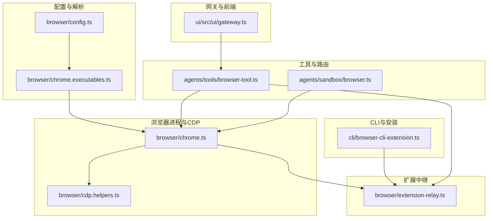
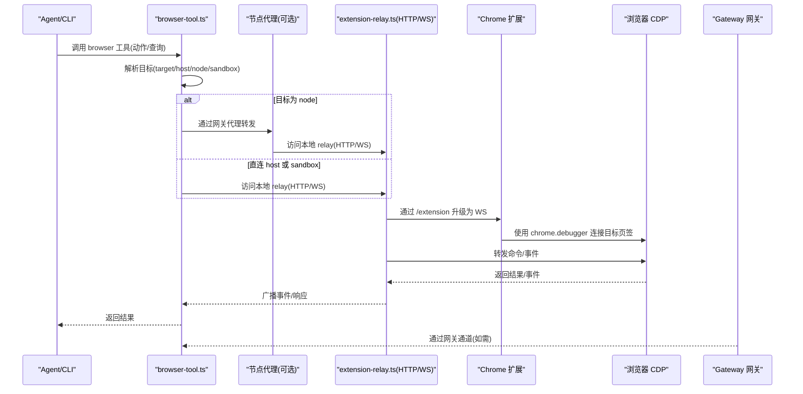
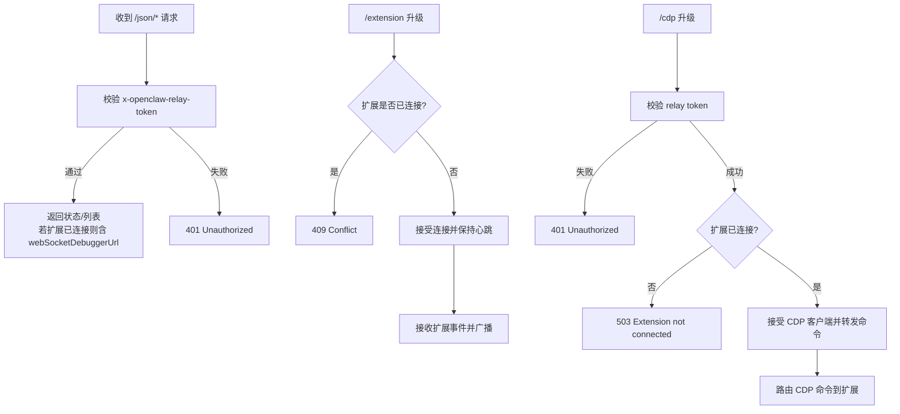
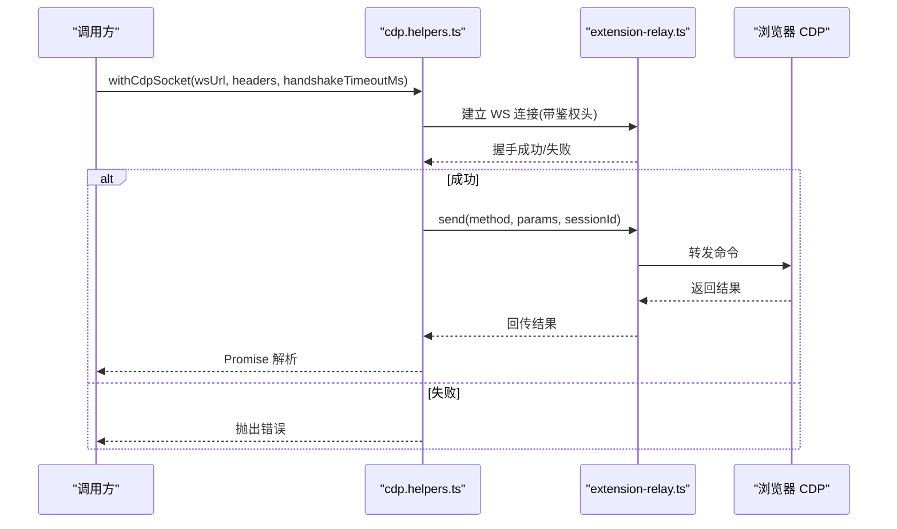
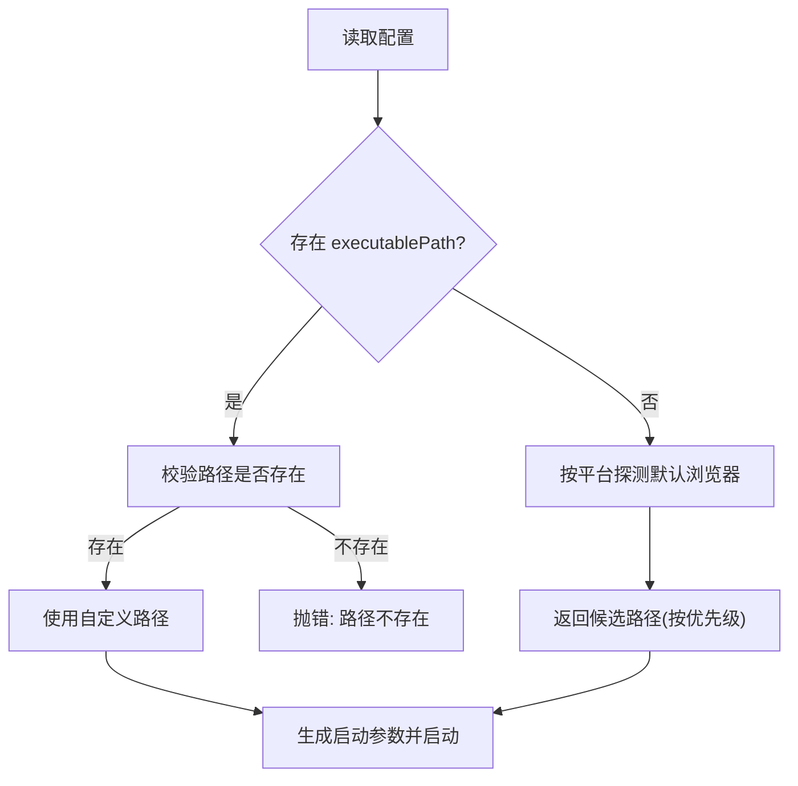
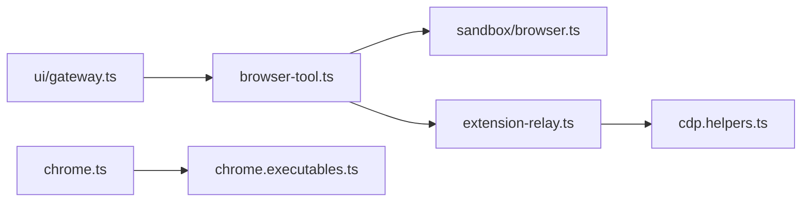

# 浏览器工具故障排除

<cite>
**本文引用的文件**
- [docs/tools/browser.md](file://docs/tools/browser.md)
- [docs/tools/browser-linux-troubleshooting.md](file://docs/tools/browser-linux-troubleshooting.md)
- [docs/tools/chrome-extension.md](file://docs/tools/chrome-extension.md)
- [src/browser/extension-relay.ts](file://src/browser/extension-relay.ts)
- [src/browser/cdp.helpers.ts](file://src/browser/cdp.helpers.ts)
- [src/browser/chrome.executables.ts](file://src/browser/chrome.executables.ts)
- [src/browser/chrome.ts](file://src/browser/chrome.ts)
- [src/browser/config.ts](file://src/browser/config.ts)
- [src/cli/browser-cli-extension.ts](file://src/cli/browser-cli-extension.ts)
- [docs/gateway/troubleshooting.md](file://docs/gateway/troubleshooting.md)
- [src/agents/tools/browser-tool.ts](file://src/agents/tools/browser-tool.ts)
- [src/agents/sandbox/browser.ts](file://src/agents/sandbox/browser.ts)
- [ui/src/ui/gateway.ts](file://ui/src/ui/gateway.ts)
</cite>

## 目录

1. [简介](#简介)
2. [项目结构](#项目结构)
3. [核心组件](#核心组件)
4. [架构总览](#架构总览)
5. [详细组件分析](#详细组件分析)
6. [依赖关系分析](#依赖关系分析)
7. [性能考量](#性能考量)
8. [故障排除指南](#故障排除指南)
9. [结论](#结论)
10. [附录](#附录)

## 简介

本指南面向使用 OpenClaw 浏览器工具的用户与运维人员，聚焦于浏览器启动失败、CDP 连接问题、扩展程序异常等常见故障的系统化排查流程。内容覆盖浏览器可执行文件路径配置、Chrome 扩展安装与调试、标签页连接、无头/沙箱模式、权限与安全策略，以及浏览器工具与网关通信的诊断方法。同时给出跨平台（macOS/Linux/Windows）与不同浏览器版本的兼容性建议。

## 项目结构

OpenClaw 的浏览器工具由“配置解析—浏览器进程管理—CDP 通道—扩展中继—CLI/代理路由—网关通信”构成，关键模块如下图所示：

**图表来源**

- [src/browser/config.ts](file://src/browser/config.ts#L143-L229)
- [src/browser/chrome.executables.ts](file://src/browser/chrome.executables.ts#L599-L625)
- [src/browser/chrome.ts](file://src/browser/chrome.ts#L172-L215)
- [src/browser/cdp.helpers.ts](file://src/browser/cdp.helpers.ts#L1-L186)
- [src/browser/extension-relay.ts](file://src/browser/extension-relay.ts#L177-L760)
- [src/cli/browser-cli-extension.ts](file://src/cli/browser-cli-extension.ts#L38-L139)
- [src/agents/tools/browser-tool.ts](file://src/agents/tools/browser-tool.ts#L80-L243)
- [src/agents/sandbox/browser.ts](file://src/agents/sandbox/browser.ts#L44-L99)
- [ui/src/ui/gateway.ts](file://ui/src/ui/gateway.ts#L43-L120)

**章节来源**

- [docs/tools/browser.md](file://docs/tools/browser.md#L1-L583)
- [docs/tools/browser-linux-troubleshooting.md](file://docs/tools/browser-linux-troubleshooting.md#L1-L140)
- [docs/tools/chrome-extension.md](file://docs/tools/chrome-extension.md#L1-L179)

## 核心组件

- 配置解析与派生端口：负责从用户配置推导浏览器控制端口、CDP 端口、默认配置与远端超时参数，并确保端口范围合理。
- 可执行文件解析：按平台自动探测系统默认 Chromium 浏览器或指定路径，支持 Chrome/Brave/Edge/Chromium/Canary。
- 浏览器进程管理：根据配置生成启动参数（无头、沙箱、数据目录等），处理首次启动与装饰化。
- CDP 辅助工具：封装 CDP WebSocket 发送、鉴权头合并、路径拼接、超时控制与错误传播。
- 扩展中继服务：本地 loopback HTTP/WS 中继，桥接 Chrome 扩展与 CDP 客户端，维护目标页签列表与事件广播。
- CLI 扩展安装：将内置扩展复制到稳定路径，供 Chrome 开发者模式加载。
- 工具路由与节点代理：根据沙箱/主机/节点策略选择目标，支持远程网关通过节点代理调用浏览器。
- 网关前端客户端：封装 WebSocket 连接、重连退避、请求/响应队列与错误处理。

**章节来源**

- [src/browser/config.ts](file://src/browser/config.ts#L143-L229)
- [src/browser/chrome.executables.ts](file://src/browser/chrome.executables.ts#L599-L625)
- [src/browser/chrome.ts](file://src/browser/chrome.ts#L172-L215)
- [src/browser/cdp.helpers.ts](file://src/browser/cdp.helpers.ts#L1-L186)
- [src/browser/extension-relay.ts](file://src/browser/extension-relay.ts#L177-L760)
- [src/cli/browser-cli-extension.ts](file://src/cli/browser-cli-extension.ts#L38-L139)
- [src/agents/tools/browser-tool.ts](file://src/agents/tools/browser-tool.ts#L80-L243)
- [ui/src/ui/gateway.ts](file://ui/src/ui/gateway.ts#L43-L120)

## 架构总览

浏览器工具的端到端交互流程如下：

**图表来源**

- [src/agents/tools/browser-tool.ts](file://src/agents/tools/browser-tool.ts#L80-L243)
- [src/browser/extension-relay.ts](file://src/browser/extension-relay.ts#L331-L498)
- [src/browser/cdp.helpers.ts](file://src/browser/cdp.helpers.ts#L144-L186)
- [ui/src/ui/gateway.ts](file://ui/src/ui/gateway.ts#L90-L120)

## 详细组件分析

### 组件A：扩展中继服务器（extension-relay）

- 功能要点
  - 提供 HTTP 接口暴露 /json/\* 列表与版本信息，仅在扩展已连接时返回 CDP WebSocket 地址。
  - 通过 /extension 接收扩展侧 WS 连接，缓存目标页签元数据，广播事件给 CDP 客户端。
  - 通过 /cdp 接收来自网关/CLI 的 CDP 请求，转发至扩展，再由扩展经 chrome.debugger 与目标页签通信。
  - 内部鉴权：为 CDP WS 连接生成一次性令牌，要求客户端携带特定头部。
  - 限制：仅允许 loopback 地址升级，且要求来源为 chrome-extension://。
- 关键行为
  - 当扩展未连接时，/cdp 升级直接拒绝；当扩展断开时，清理挂起请求并关闭所有 CDP 客户端连接。
  - 对 Target._ 与 Browser._ 方法进行路由与回写，维持目标列表一致性。

**图表来源**

- [src/browser/extension-relay.ts](file://src/browser/extension-relay.ts#L331-L498)
- [src/browser/extension-relay.ts](file://src/browser/extension-relay.ts#L500-L704)

**章节来源**

- [src/browser/extension-relay.ts](file://src/browser/extension-relay.ts#L177-L760)

### 组件B：CDP 辅助与鉴权

- 功能要点
  - 自动合并 relay 鉴权头与 URL 中的 Basic 认证，保证 /json/\* 与 CDP WS 连接的认证一致。
  - 封装 CDP 发送函数，维护请求 ID 映射与超时，统一错误处理。
  - 提供 withCdpSocket 以简化握手与生命周期管理。
- 兼容性注意
  - 对于远程 CDP（非 loopback），可配置握手与请求超时，避免长尾阻塞。

**图表来源**

- [src/browser/cdp.helpers.ts](file://src/browser/cdp.helpers.ts#L144-L186)
- [src/browser/extension-relay.ts](file://src/browser/extension-relay.ts#L631-L704)

**章节来源**

- [src/browser/cdp.helpers.ts](file://src/browser/cdp.helpers.ts#L1-L186)

### 组件C：浏览器可执行文件解析与启动

- 功能要点
  - 优先使用用户配置的 executablePath；否则按平台探测系统默认 Chromium 浏览器或内置候选路径。
  - 启动参数包括远程调试端口、用户数据目录、无头/沙箱开关、平台特定优化项。
- 常见问题
  - 配置路径不存在或不可执行。
  - Linux snap 包导致无法正常监控进程。
  - 无头/沙箱组合在部分站点触发反爬策略。

**图表来源**

- [src/browser/chrome.executables.ts](file://src/browser/chrome.executables.ts#L599-L625)
- [src/browser/chrome.ts](file://src/browser/chrome.ts#L172-L215)

**章节来源**

- [src/browser/chrome.executables.ts](file://src/browser/chrome.executables.ts#L599-L625)
- [src/browser/chrome.ts](file://src/browser/chrome.ts#L172-L215)

### 组件D：CLI 扩展安装与路径

- 功能要点
  - 将内置扩展复制到 OpenClaw 状态目录下的稳定路径，便于 Chrome 开发者模式加载。
  - 提供打印安装路径能力，支持复制到剪贴板以便快速定位。
- 故障点
  - 扩展缺失 manifest.json。
  - 未先执行安装即尝试加载。

**章节来源**

- [src/cli/browser-cli-extension.ts](file://src/cli/browser-cli-extension.ts#L38-L139)
- [assets/chrome-extension/README.md](file://assets/chrome-extension/README.md#L1-L23)

## 依赖关系分析

- 组件耦合
  - browser-tool 依赖 agents/sandbox/browser 的沙箱配置，决定 target=sandbox/host/node 的可用性。
  - extension-relay 依赖 cdp.helpers 的鉴权头注入与 URL 处理。
  - chrome.executables 与 chrome 启动参数共同决定浏览器可执行文件与启动行为。
- 外部依赖
  - Chrome 扩展通过 chrome.debugger API 与目标页签交互。
  - 网关前端通过 WebSocket 与网关通信，具备指数退避重连机制。

**图表来源**

- [src/agents/tools/browser-tool.ts](file://src/agents/tools/browser-tool.ts#L80-L243)
- [src/agents/sandbox/browser.ts](file://src/agents/sandbox/browser.ts#L44-L99)
- [src/browser/extension-relay.ts](file://src/browser/extension-relay.ts#L177-L760)
- [src/browser/cdp.helpers.ts](file://src/browser/cdp.helpers.ts#L1-L186)
- [src/browser/chrome.ts](file://src/browser/chrome.ts#L172-L215)
- [src/browser/chrome.executables.ts](file://src/browser/chrome.executables.ts#L599-L625)
- [ui/src/ui/gateway.ts](file://ui/src/ui/gateway.ts#L43-L120)

**章节来源**

- [src/agents/tools/browser-tool.ts](file://src/agents/tools/browser-tool.ts#L80-L243)
- [src/agents/sandbox/browser.ts](file://src/agents/sandbox/browser.ts#L44-L99)
- [src/browser/extension-relay.ts](file://src/browser/extension-relay.ts#L177-L760)
- [src/browser/cdp.helpers.ts](file://src/browser/cdp.helpers.ts#L1-L186)
- [src/browser/chrome.ts](file://src/browser/chrome.ts#L172-L215)
- [src/browser/chrome.executables.ts](file://src/browser/chrome.executables.ts#L599-L625)
- [ui/src/ui/gateway.ts](file://ui/src/ui/gateway.ts#L43-L120)

## 性能考量

- 无头模式通常减少资源占用，但可能触发更强的反爬策略。
- 沙箱模式在容器内运行，启动与网络延迟略增，但隔离性更好。
- CDP 超时与握手超时可调，避免长时间阻塞影响整体吞吐。
- 远程 CDP（如 Browserless）需考虑网络抖动与鉴权成本。

[本节为通用指导，无需具体文件引用]

## 故障排除指南

### 一、浏览器启动失败

- 现象
  - “Failed to start Chrome CDP on port …” 或 “browser.executablePath not found”。
- 排查步骤
  - 确认配置中 executablePath 是否存在且可执行；Linux 下优先使用非 snap 的官方包。
  - 检查端口是否被占用，确认 derived 端口范围合理。
  - 在 Linux 上启用 noSandbox/headless 并检查平台特定参数。
- 参考
  - [docs/tools/browser-linux-troubleshooting.md](file://docs/tools/browser-linux-troubleshooting.md#L9-L51)
  - [src/browser/chrome.executables.ts](file://src/browser/chrome.executables.ts#L599-L625)
  - [src/browser/chrome.ts](file://src/browser/chrome.ts#L172-L215)

**章节来源**

- [docs/tools/browser-linux-troubleshooting.md](file://docs/tools/browser-linux-troubleshooting.md#L9-L51)
- [src/browser/chrome.executables.ts](file://src/browser/chrome.executables.ts#L599-L625)
- [src/browser/chrome.ts](file://src/browser/chrome.ts#L172-L215)

### 二、CDP 连接问题

- 现象
  - CDP 握手超时、WS 主动关闭、HTTP 401/503。
- 排查步骤
  - 确认 relay 鉴权头正确注入，URL 中的 Basic 认证会被保留。
  - 检查扩展是否已连接（/extension/status），未连接会导致 /cdp 升级失败。
  - 对远程 CDP，适当提高 remoteCdpTimeoutMs 与 remoteCdpHandshakeTimeoutMs。
- 参考
  - [src/browser/cdp.helpers.ts](file://src/browser/cdp.helpers.ts#L25-L44)
  - [src/browser/extension-relay.ts](file://src/browser/extension-relay.ts#L331-L498)

**章节来源**

- [src/browser/cdp.helpers.ts](file://src/browser/cdp.helpers.ts#L25-L44)
- [src/browser/extension-relay.ts](file://src/browser/extension-relay.ts#L331-L498)

### 三、扩展程序异常（Chrome 扩展中继）

- 现象
  - 扩展图标显示 “!”（无法连接本地 relay）、或 “ON” 但无标签页被控制。
- 排查步骤
  - 确保 Gateway/Node Host 在同一机器或通过节点代理可达 relay（默认 http://127.0.0.1:18792）。
  - 重新安装扩展（install），并在 Chrome 开发者模式中加载已安装目录（path）。
  - 点击扩展图标附着到目标标签页，确认 badge 显示 “ON”。
- 参考
  - [docs/tools/chrome-extension.md](file://docs/tools/chrome-extension.md#L88-L98)
  - [src/cli/browser-cli-extension.ts](file://src/cli/browser-cli-extension.ts#L38-L139)
  - [src/browser/extension-relay.ts](file://src/browser/extension-relay.ts#L356-L361)

**章节来源**

- [docs/tools/chrome-extension.md](file://docs/tools/chrome-extension.md#L88-L98)
- [src/cli/browser-cli-extension.ts](file://src/cli/browser-cli-extension.ts#L38-L139)
- [src/browser/extension-relay.ts](file://src/browser/extension-relay.ts#L356-L361)

### 四、标签页连接与目标切换

- 现象
  - 附着后无法操作、或切换标签页无效。
- 排查步骤
  - 仅附着到你显式点击扩展图标的目标标签页；切换需打开新标签并再次附着。
  - 使用 /json/list 获取当前已附着目标列表，确认目标 ID 正确。
- 参考
  - [docs/tools/chrome-extension.md](file://docs/tools/chrome-extension.md#L82-L87)
  - [src/browser/extension-relay.ts](file://src/browser/extension-relay.ts#L383-L397)

**章节来源**

- [docs/tools/chrome-extension.md](file://docs/tools/chrome-extension.md#L82-L87)
- [src/browser/extension-relay.ts](file://src/browser/extension-relay.ts#L383-L397)

### 五、无头模式与沙箱模式

- 现象
  - 无头模式下某些站点反爬更严格；沙箱模式下无法直接控制宿主浏览器。
- 排查步骤
  - 在配置中开启 headless/noSandbox，并结合站点特性调整策略。
  - 沙箱会话默认 target="sandbox"，如需控制宿主需启用 allowHostControl 或使用 target="host"。
- 参考
  - [src/agents/sandbox/browser.ts](file://src/agents/sandbox/browser.ts#L44-L99)
  - [docs/tools/browser.md](file://docs/tools/browser.md#L236-L243)

**章节来源**

- [src/agents/sandbox/browser.ts](file://src/agents/sandbox/browser.ts#L44-L99)
- [docs/tools/browser.md](file://docs/tools/browser.md#L236-L243)

### 六、权限与安全配置

- 现象
  - 网关/CLI 无法连接、出现 “unauthorized”、“device identity required”。
- 排查步骤
  - 确认网关绑定地址与鉴权模式匹配（loopback 可免 token，非 loopback 必须配置）。
  - 检查 CLI/浏览器工具使用的 URL 与凭据是否一致。
- 参考
  - [docs/gateway/troubleshooting.md](file://docs/gateway/troubleshooting.md#L62-L91)
  - [ui/src/ui/gateway.ts](file://ui/src/ui/gateway.ts#L90-L120)

**章节来源**

- [docs/gateway/troubleshooting.md](file://docs/gateway/troubleshooting.md#L62-L91)
- [ui/src/ui/gateway.ts](file://ui/src/ui/gateway.ts#L90-L120)

### 七、跨平台与版本兼容性

- macOS
  - 优先探测系统默认浏览器，若默认非 Chromium，则回落到内置候选路径。
- Linux
  - snap 包可能导致进程监控失败；推荐使用官方 deb/rpm 包并启用 noSandbox。
- Windows
  - 支持用户/系统安装路径，优先用户安装目录。
- 参考
  - [src/browser/chrome.executables.ts](file://src/browser/chrome.executables.ts#L456-L597)

**章节来源**

- [src/browser/chrome.executables.ts](file://src/browser/chrome.executables.ts#L456-L597)

### 八、浏览器工具与网关通信诊断

- 现象
  - 工具调用无响应、连接反复断开。
- 排查步骤
  - 使用 openclaw doctor/status/logs 定位网关健康度。
  - 检查网关前端客户端的重连逻辑与错误码，确认 URL/鉴权一致。
  - 若通过节点代理，确认节点连通性与 browser.mode 与 target 设置。
- 参考
  - [docs/gateway/troubleshooting.md](file://docs/gateway/troubleshooting.md#L14-L31)
  - [ui/src/ui/gateway.ts](file://ui/src/ui/gateway.ts#L90-L120)
  - [src/agents/tools/browser-tool.ts](file://src/agents/tools/browser-tool.ts#L80-L243)

**章节来源**

- [docs/gateway/troubleshooting.md](file://docs/gateway/troubleshooting.md#L14-L31)
- [ui/src/ui/gateway.ts](file://ui/src/ui/gateway.ts#L90-L120)
- [src/agents/tools/browser-tool.ts](file://src/agents/tools/browser-tool.ts#L80-L243)

## 结论

OpenClaw 浏览器工具通过“配置—进程—CDP—扩展中继—工具路由—网关通信”的链路实现对浏览器的可控自动化。针对常见问题，应优先检查可执行文件路径、扩展附着状态、CDP 鉴权与超时设置、以及跨平台差异与沙箱/无头策略。结合 CLI 与网关诊断命令，可快速定位并修复绝大多数故障。

[本节为总结，无需具体文件引用]

## 附录

- 快速命令参考
  - 浏览器状态与启动：openclaw browser status/start/profiles
  - 扩展安装与路径：openclaw browser extension install/path
  - 网关诊断：openclaw doctor/status/logs
- 常用配置项
  - browser.executablePath、browser.headless、browser.noSandbox、browser.attachOnly
  - browser.profiles.\*.cdpUrl、browser.remoteCdpTimeoutMs、browser.remoteCdpHandshakeTimeoutMs
  - gateway.nodes.browser.mode/target

[本节为通用指引，无需具体文件引用]
