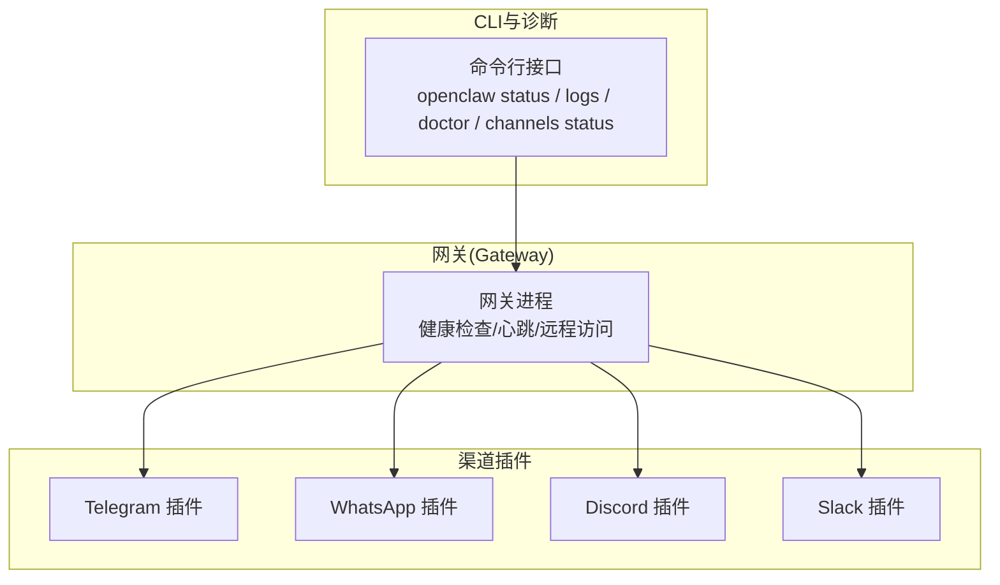
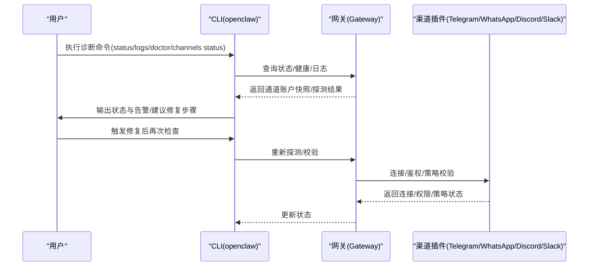
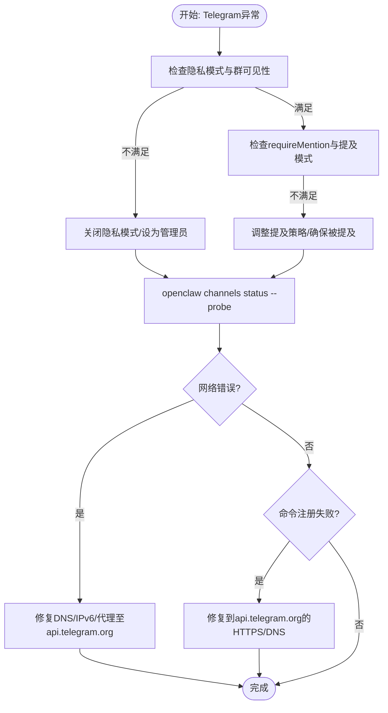
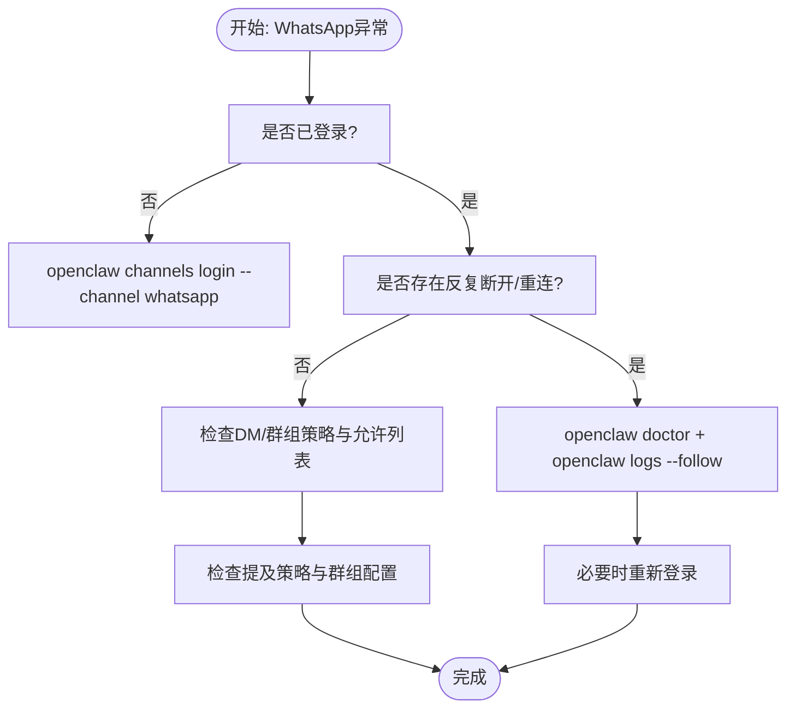
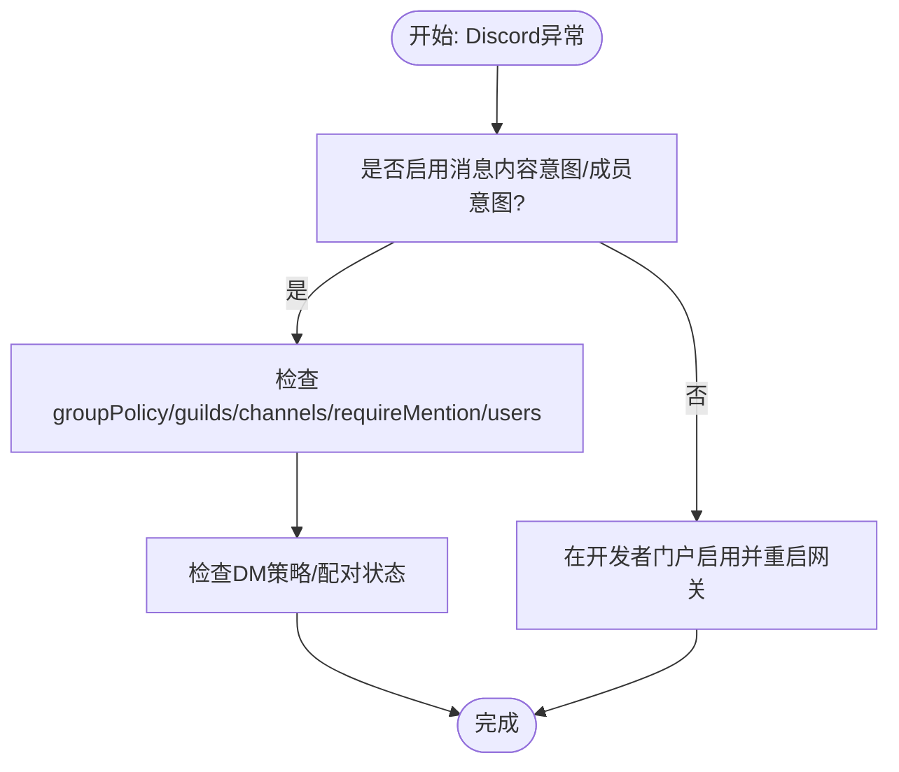
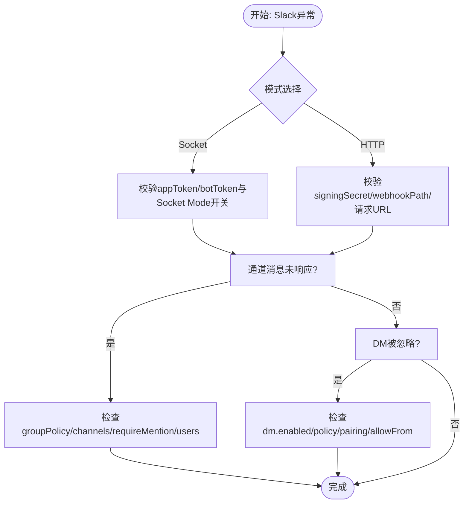
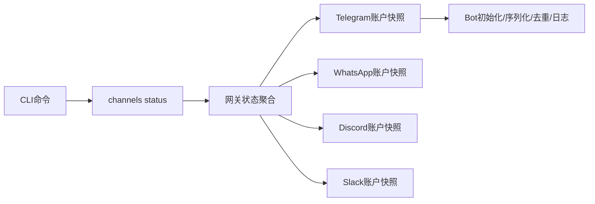

# 消息渠道故障排除

<cite>
**本文引用的文件**
- [docs/channels/troubleshooting.md](file://docs/channels/troubleshooting.md)
- [docs/gateway/troubleshooting.md](file://docs/gateway/troubleshooting.md)
- [docs/channels/telegram.md](file://docs/channels/telegram.md)
- [docs/channels/whatsapp.md](file://docs/channels/whatsapp.md)
- [docs/channels/discord.md](file://docs/channels/discord.md)
- [docs/channels/slack.md](file://docs/channels/slack.md)
- [src/commands/channels/status.ts](file://src/commands/channels/status.ts)
- [src/telegram/bot.ts](file://src/telegram/bot.ts)
</cite>

## 目录

1. [简介](#简介)
2. [项目结构](#项目结构)
3. [核心组件](#核心组件)
4. [架构总览](#架构总览)
5. [详细组件分析](#详细组件分析)
6. [依赖关系分析](#依赖关系分析)
7. [性能考量](#性能考量)
8. [故障排除指南](#故障排除指南)
9. [结论](#结论)

## 简介

本指南面向OpenClaw消息渠道集成的运维与开发人员，聚焦于常见故障的快速定位与修复流程，覆盖Telegram、WhatsApp、Discord、Slack等主流渠道。内容包括：连接与认证问题、消息传输中断、渠道配置校验、API密钥与权限范围检查、日志分析与错误码解读、群组权限与提及过滤、以及渠道与网关之间的通信诊断。

## 项目结构

OpenClaw通过“网关”统一承载各渠道接入，CLI命令提供状态查询、日志跟踪与诊断工具；各渠道在独立子模块中实现，遵循统一的配置模型与路由规则。

图示来源

- [docs/gateway/troubleshooting.md](file://docs/gateway/troubleshooting.md#L14-L31)
- [src/commands/channels/status.ts](file://src/commands/channels/status.ts#L21-L161)

章节来源

- [docs/gateway/troubleshooting.md](file://docs/gateway/troubleshooting.md#L14-L31)
- [src/commands/channels/status.ts](file://src/commands/channels/status.ts#L21-L161)

## 核心组件

- 健康检查与状态输出：通过CLI命令收集网关与各渠道账户的状态快照，包含运行态、连接态、最近收发时间、令牌来源、意图/权限审计、探测结果与告警。
- 渠道处理引擎：以Telegram为例，使用grammy框架构建Bot，启用序列化执行、去重、超时与节流控制，并对原始更新进行结构化记录与错误兜底。
- 配置与策略解析：按账户维度解析渠道配置，包括DM策略、群组策略、提及要求、历史限制、媒体上限、网络代理与重试参数等。

章节来源

- [src/commands/channels/status.ts](file://src/commands/channels/status.ts#L21-L161)
- [src/telegram/bot.ts](file://src/telegram/bot.ts#L112-L200)

## 架构总览

下图展示从CLI到网关再到渠道插件的调用链路，以及常见故障点的定位入口。

图示来源

- [docs/gateway/troubleshooting.md](file://docs/gateway/troubleshooting.md#L14-L31)
- [src/commands/channels/status.ts](file://src/commands/channels/status.ts#L21-L161)

## 详细组件分析

### Telegram 故障排除

- 连接与可见性
  - 若“已连接但未响应”，优先检查隐私模式与群组可见性设置，必要时关闭隐私模式或提升为管理员。
  - 若发送失败伴随网络错误，重点排查到api.telegram.org的DNS/IPv6/代理连通性。
- DM与群组策略
  - DM需先配对或满足允许列表；群组默认需要被提及，可通过配置放宽或确保被提及。
- 命令与菜单
  - 若命令注册失败，通常为到api.telegram.org的HTTPS/DNS不可达。
- 日志与探测
  - 使用“通道探测”与“原始更新日志”辅助定位重复/丢弃/去重等问题。

图示来源

- [docs/channels/telegram.md](file://docs/channels/telegram.md#L626-L668)
- [docs/channels/telegram.md](file://docs/channels/telegram.md#L74-L102)

章节来源

- [docs/channels/telegram.md](file://docs/channels/telegram.md#L626-L668)
- [docs/channels/telegram.md](file://docs/channels/telegram.md#L74-L102)

### WhatsApp 故障排除

- 连接与重连循环
  - 使用“通道探测”与“日志”定位凭证目录健康度与网络波动。
- DM与群组策略
  - DM需满足配对或允许列表；群组消息忽略多因：策略、允许列表、群组白名单、提及策略。
- 自聊天保护
  - 当自聊触发时会跳过已读回执并避免自我提醒，注意响应前缀与上下文注入。

图示来源

- [docs/channels/whatsapp.md](file://docs/channels/whatsapp.md#L365-L414)
- [docs/channels/whatsapp.md](file://docs/channels/whatsapp.md#L367-L392)

章节来源

- [docs/channels/whatsapp.md](file://docs/channels/whatsapp.md#L365-L414)

### Discord 故障排除

- 权限与意图
  - 必须启用“消息内容意图”和“服务器成员意图”（角色匹配场景），重启网关后生效。
- 群组消息被阻止
  - 检查群组策略、允许列表、频道白名单、提及策略与用户/角色允许列表。
- DM与配对
  - DM可能被禁用或策略为“禁用”，或等待配对批准。

图示来源

- [docs/channels/discord.md](file://docs/channels/discord.md#L396-L454)
- [docs/channels/discord.md](file://docs/channels/discord.md#L399-L404)

章节来源

- [docs/channels/discord.md](file://docs/channels/discord.md#L396-L454)

### Slack 故障排除

- Socket模式与HTTP模式
  - Socket模式需正确配置appToken/botToken；HTTP模式需校验签名密钥、Webhook路径与请求URL。
- 通道消息未响应
  - 按顺序检查群组策略、通道白名单、提及策略与通道用户允许列表。
- DM被忽略
  - 检查DM开关、策略与配对/允许列表。

图示来源

- [docs/channels/slack.md](file://docs/channels/slack.md#L374-L431)
- [docs/channels/slack.md](file://docs/channels/slack.md#L377-L393)

章节来源

- [docs/channels/slack.md](file://docs/channels/slack.md#L374-L431)

## 依赖关系分析

- CLI命令与网关交互：通过状态输出与探测结果，串联渠道账户健康度与策略一致性。
- 渠道插件内部：以Telegram为例，Bot初始化包含fetch适配、超时、节流、去重与原始更新记录，确保稳定与可观测性。

图示来源

- [src/commands/channels/status.ts](file://src/commands/channels/status.ts#L21-L161)
- [src/telegram/bot.ts](file://src/telegram/bot.ts#L112-L200)

章节来源

- [src/commands/channels/status.ts](file://src/commands/channels/status.ts#L21-L161)
- [src/telegram/bot.ts](file://src/telegram/bot.ts#L112-L200)

## 性能考量

- 并发与序列化：Telegram采用按会话/主题的序列化执行，避免并发写入冲突。
- 节流与超时：grammy节流器与可配置超时减少API限流与长尾延迟。
- 去重与日志：对重复更新进行去重，同时限制原始更新日志大小，兼顾可观测性与性能。

章节来源

- [src/telegram/bot.ts](file://src/telegram/bot.ts#L146-L153)
- [src/telegram/bot.ts](file://src/telegram/bot.ts#L170-L183)

## 故障排除指南

### 通用命令阶梯（建议优先执行）

- openclaw status
- openclaw gateway status
- openclaw logs --follow
- openclaw doctor
- openclaw channels status --probe

预期健康信号

- 网关运行态与RPC探测正常
- 通道探测显示已连接/就绪
- 无阻塞性配置/服务问题

章节来源

- [docs/gateway/troubleshooting.md](file://docs/gateway/troubleshooting.md#L14-L31)
- [docs/channels/troubleshooting.md](file://docs/channels/troubleshooting.md#L13-L31)

### 渠道级故障签名与修复速查

- Telegram
  - 已连接但无可用回复流：检查配对与DM策略
  - 群组保持静默：检查提及要求与隐私模式
  - 发送失败伴随网络错误：检查到api.telegram.org的DNS/IPv6/代理
- WhatsApp
  - 已连接但无DM回复：检查配对与DM策略
  - 群组消息被忽略：检查requireMention与提及模式
  - 随机断开/重登：检查凭证目录与网络稳定性
- Discord
  - 服务器无回复：检查服务器/频道许可与消息意图
  - 群组消息被忽略：检查requireMention与允许列表
  - DM回复缺失：检查配对与DM策略
- Slack
  - Socket模式已连接但无响应：校验令牌与Socket Mode
  - DM被阻止：检查DM策略与配对
  - 通道消息被忽略：检查groupPolicy与通道白名单

章节来源

- [docs/channels/troubleshooting.md](file://docs/channels/troubleshooting.md#L31-L117)

### 渠道特定排查清单

#### Telegram

- 渠道侧设置
  - 隐私模式与群组可见性
  - 群组权限（管理员）
  - BotFather开关：加入群组、隐私模式
- 访问控制与激活
  - DM策略与允许列表
  - 群组策略与允许列表
  - 提及行为与会话级激活命令
- 运行时行为
  - 长轮询/Webhook模式
  - Draft流式与链接预览
- 故障定位
  - setMyCommands失败：通常为到api.telegram.org的DNS/HTTPS问题
  - 网络不稳定：Node版本与自定义fetch类型不匹配、IPv6解析失败

章节来源

- [docs/channels/telegram.md](file://docs/channels/telegram.md#L74-L102)
- [docs/channels/telegram.md](file://docs/channels/telegram.md#L104-L206)
- [docs/channels/telegram.md](file://docs/channels/telegram.md#L626-L668)

#### WhatsApp

- 部署模式
  - 专用号码（推荐）
  - 个人号回退与自聊保护
- 访问控制与激活
  - DM策略与允许列表
  - 群组策略与提及
- 运行时行为
  - 自聊天保护与已读回执
  - 历史注入与媒体占位符
- 故障定位
  - 未登录/二维码：执行登录并确认状态
  - 连接抖动：doctor与日志检查
  - 无活动监听：确保网关运行且账户已登录

章节来源

- [docs/channels/whatsapp.md](file://docs/channels/whatsapp.md#L82-L124)
- [docs/channels/whatsapp.md](file://docs/channels/whatsapp.md#L134-L192)
- [docs/channels/whatsapp.md](file://docs/channels/whatsapp.md#L365-L414)

#### Discord

- 开发者门户设置
  - 应用与机器人创建
  - 特权意图：消息内容意图、服务器成员意图
  - OAuth作用域与基础权限
- 访问控制与路由
  - DM策略与允许列表
  - 服务器/频道策略与提及
  - 基于角色的代理路由
- 故障定位
  - 未启用意图导致看不到消息
  - 服务器/频道白名单导致消息被拒
  - DM策略禁用或等待配对

章节来源

- [docs/channels/discord.md](file://docs/channels/discord.md#L200-L249)
- [docs/channels/discord.md](file://docs/channels/discord.md#L90-L172)
- [docs/channels/discord.md](file://docs/channels/discord.md#L396-L454)

#### Slack

- Socket模式与HTTP模式
  - Socket模式：appToken/botToken
  - HTTP模式：botToken/signingSecret/webhookPath
- 访问控制与路由
  - DM策略与允许列表
  - 通道策略与提及
- 故障定位
  - Socket模式无法连接：校验令牌与开关
  - HTTP模式未接收事件：校验签名与请求URL
  - 通道消息未响应：检查策略与允许列表

章节来源

- [docs/channels/slack.md](file://docs/channels/slack.md#L24-L121)
- [docs/channels/slack.md](file://docs/channels/slack.md#L135-L194)
- [docs/channels/slack.md](file://docs/channels/slack.md#L374-L431)

### 网关与通道通信故障排查

- 无回复
  - 检查路由与策略：配对、提及、允许列表
- 控制面板/远程连接
  - 校验URL、认证模式与安全上下文
- 服务未运行
  - 检查运行态、配置差异、端口冲突
- 升级后异常
  - 认证与URL覆盖行为变更、绑定与认证加固、设备身份与配对状态变化

章节来源

- [docs/gateway/troubleshooting.md](file://docs/gateway/troubleshooting.md#L32-L152)
- [docs/gateway/troubleshooting.md](file://docs/gateway/troubleshooting.md#L246-L319)

### 日志分析与错误码解读

- 通道探测输出
  - enabled/configured/linked/running/connected
  - 最近收发时间、模式、令牌来源、意图状态、URL、探测/审计结果、最后错误
- 常见告警关键词
  - mention required：群组消息因未被提及而被忽略
  - pairing/pending approval：DM发送方待审批
  - blocked/allowlist：发送方/频道被策略过滤
  - missing_scope/not_in_channel/Forbidden/401/403：渠道认证/权限问题
  - device identity required/unauthorized：设备身份或令牌不匹配
  - gateway connect failed：目标主机/端口/URL错误
  - cron scheduler disabled/timer tick failed：定时任务调度异常
  - heartbeat skipped/unknown accountId：心跳跳过或目标账号无效

章节来源

- [src/commands/channels/status.ts](file://src/commands/channels/status.ts#L21-L161)
- [docs/gateway/troubleshooting.md](file://docs/gateway/troubleshooting.md#L32-L152)

## 结论

通过“命令阶梯—渠道特定—网关通信—日志解读”的分层排查，可高效定位并修复OpenClaw消息渠道集成中的连接、认证与传输问题。建议在生产环境中持续关注意图/权限、提及策略与网络连通性，并结合通道探测与原始更新日志进行根因分析。
