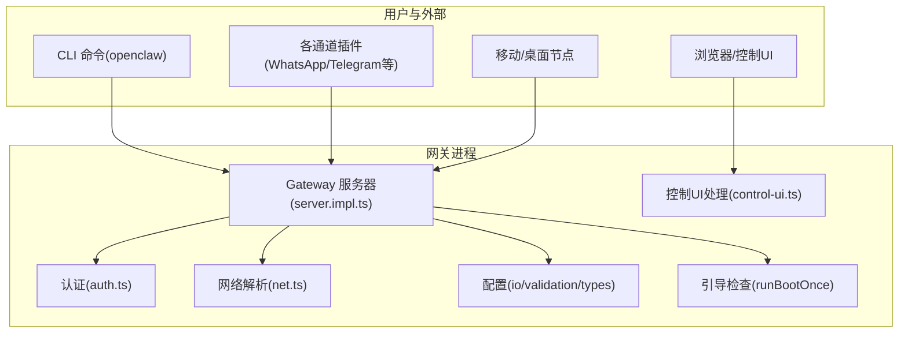
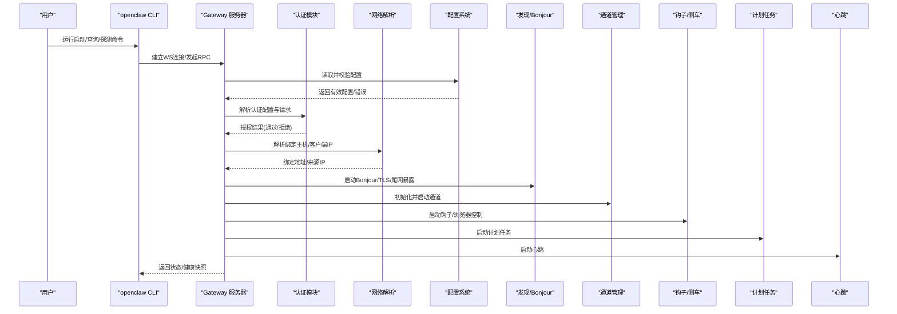
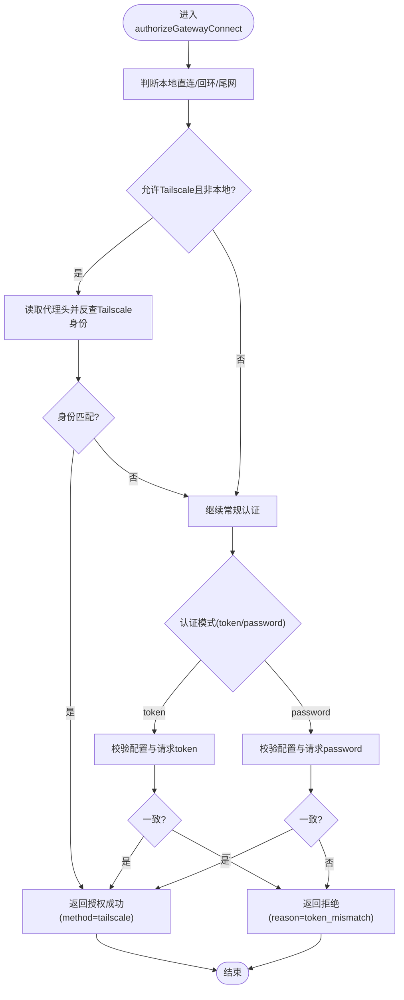
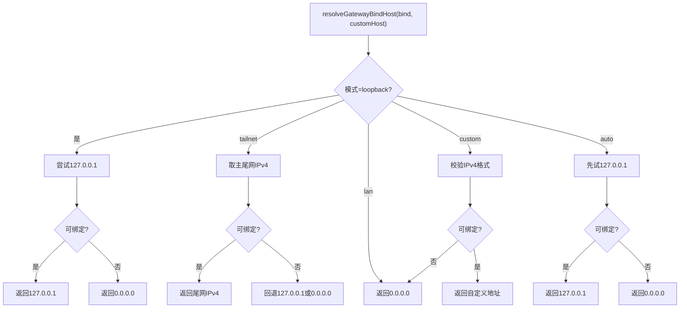
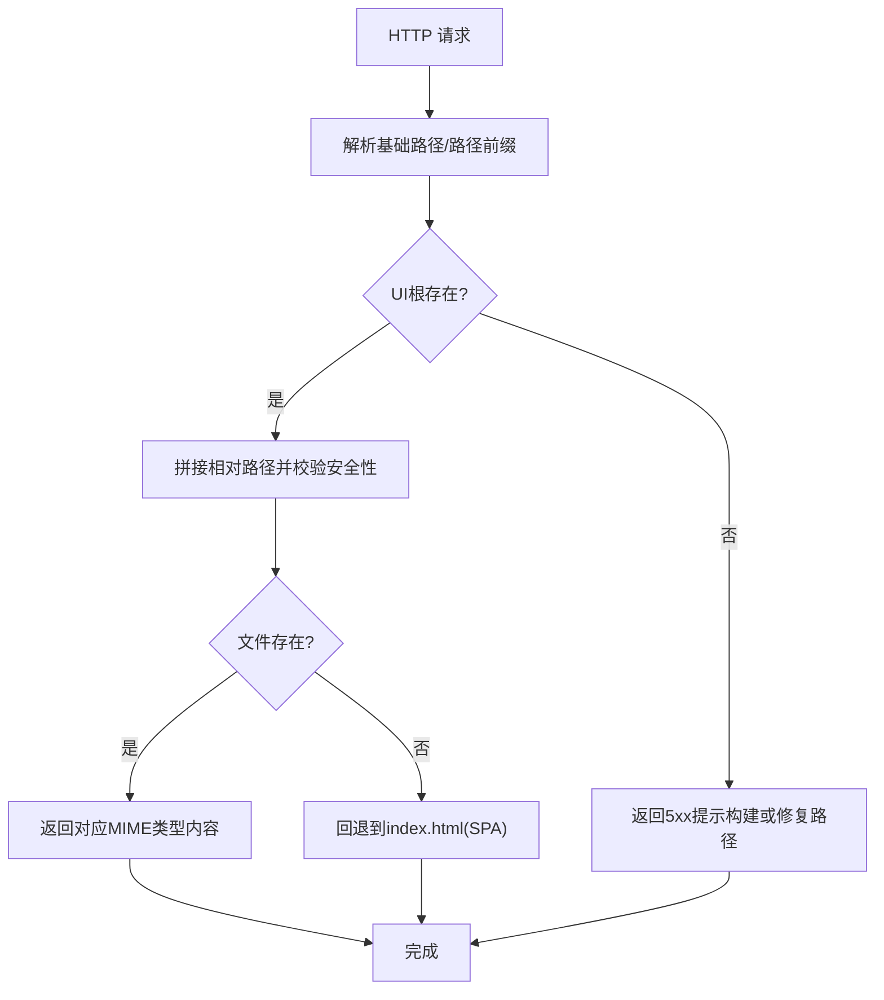
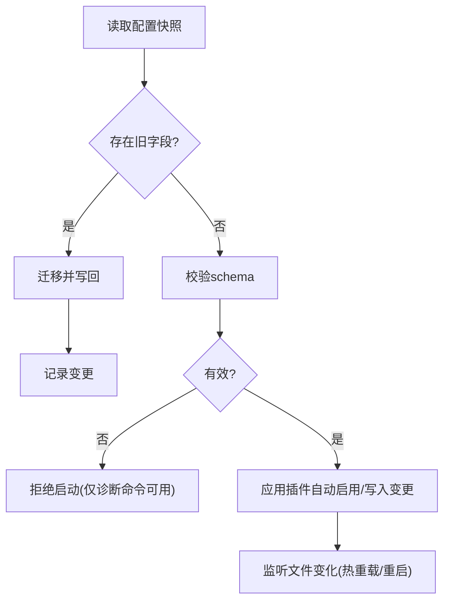
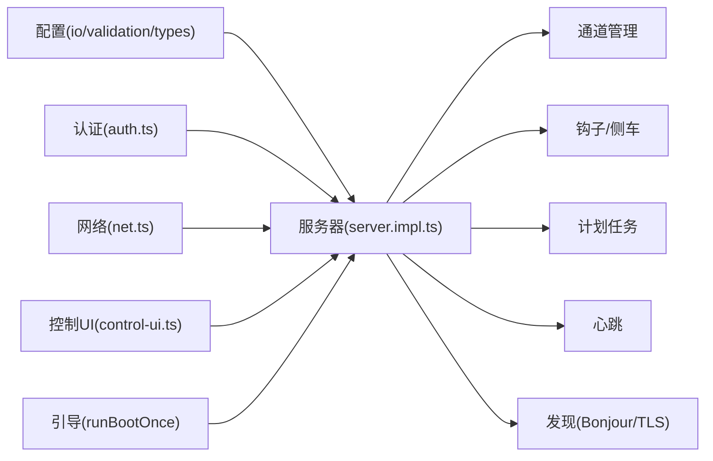

# 网关服务故障排除

<cite>
**本文引用的文件**
- [docs/gateway/troubleshooting.md](file://docs/gateway/troubleshooting.md)
- [docs/gateway/configuration.md](file://docs/gateway/configuration.md)
- [docs/gateway/logging.md](file://docs/gateway/logging.md)
- [docs/gateway/health.md](file://docs/gateway/health.md)
- [docs/cli/gateway.md](file://docs/cli/gateway.md)
- [src/gateway/auth.ts](file://src/gateway/auth.ts)
- [src/gateway/server.impl.ts](file://src/gateway/server.impl.ts)
- [src/gateway/net.ts](file://src/gateway/net.ts)
- [src/gateway/control-ui.ts](file://src/gateway/control-ui.ts)
- [src/gateway/boot.ts](file://src/gateway/boot.ts)
- [src/config/config.ts](file://src/config/config.ts)
</cite>

## 目录

1. [简介](#简介)
2. [项目结构](#项目结构)
3. [核心组件](#核心组件)
4. [架构总览](#架构总览)
5. [详细组件分析](#详细组件分析)
6. [依赖关系分析](#依赖关系分析)
7. [性能考量](#性能考量)
8. [故障排除指南](#故障排除指南)
9. [结论](#结论)
10. [附录](#附录)

## 简介

本指南面向OpenClaw网关服务的运维与开发人员，聚焦于常见故障场景：网关启动失败、服务未运行、RPC连接问题、认证与绑定配置错误、端口冲突、权限不足、日志分析与健康检查、以及与其他组件（通道、节点、浏览器控制UI）的集成排障。内容基于仓库内官方文档与源码实现，提供可操作的诊断步骤、参数定位方法与可视化流程图。

## 项目结构

OpenClaw将“网关”定义为WebSocket/HTTP服务器，承载通道接入、节点交互、会话管理、钩子与自动化等功能。相关能力由CLI命令、配置系统、认证与网络解析模块、运行时服务器实现共同构成。

图表来源

- [src/gateway/server.impl.ts](file://src/gateway/server.impl.ts#L157-L667)
- [src/gateway/auth.ts](file://src/gateway/auth.ts#L178-L271)
- [src/gateway/net.ts](file://src/gateway/net.ts#L153-L203)
- [src/gateway/control-ui.ts](file://src/gateway/control-ui.ts#L239-L369)
- [src/gateway/boot.ts](file://src/gateway/boot.ts#L61-L106)
- [src/config/config.ts](file://src/config/config.ts#L1-L20)

章节来源

- [docs/gateway/configuration.md](file://docs/gateway/configuration.md#L1-L483)
- [docs/cli/gateway.md](file://docs/cli/gateway.md#L1-L203)

## 核心组件

- 网关服务器：负责启动HTTP/WebSocket服务、加载配置、注册方法、维护定时器、启动通道与侧车、暴露控制UI等。
- 认证模块：解析并校验token或密码，支持本地直连、反向代理与Tailscale上下文识别。
- 网络解析：解析客户端真实IP、判断回环/尾网地址、解析绑定主机策略。
- 配置系统：读取JSON5配置、严格schema校验、热重载与重启策略、环境变量注入。
- 控制UI：静态资源托管、安全头、SPA路由回退、头像解析。
- 引导检查：按工作区内的引导文件执行一次性任务。

章节来源

- [src/gateway/server.impl.ts](file://src/gateway/server.impl.ts#L157-L667)
- [src/gateway/auth.ts](file://src/gateway/auth.ts#L178-L271)
- [src/gateway/net.ts](file://src/gateway/net.ts#L153-L203)
- [src/gateway/control-ui.ts](file://src/gateway/control-ui.ts#L239-L369)
- [src/gateway/boot.ts](file://src/gateway/boot.ts#L61-L106)
- [src/config/config.ts](file://src/config/config.ts#L1-L20)

## 架构总览

下图展示从CLI到网关服务器的关键调用链与关键决策点（认证、绑定、TLS、发现、通道、钩子、心跳、维护定时器、热重载）。

图表来源

- [src/gateway/server.impl.ts](file://src/gateway/server.impl.ts#L248-L270)
- [src/gateway/auth.ts](file://src/gateway/auth.ts#L178-L271)
- [src/gateway/net.ts](file://src/gateway/net.ts#L153-L203)
- [src/gateway/control-ui.ts](file://src/gateway/control-ui.ts#L239-L369)

## 详细组件分析

### 认证与授权（Auth）

- 支持模式：token/password；当启用Tailscale服务且非密码模式时，允许通过Tailscale代理进行身份验证。
- 关键逻辑：解析请求来源IP、判断是否本地直连、校验token/密码一致性、在Tailscale模式下进行反查与登录名匹配。
- 常见错误来源：未配置认证、token不一致、密码缺失、Tailscale代理缺失或用户不匹配。

图表来源

- [src/gateway/auth.ts](file://src/gateway/auth.ts#L217-L271)

章节来源

- [src/gateway/auth.ts](file://src/gateway/auth.ts#L178-L271)

### 绑定与网络解析（Bind/Net）

- 绑定模式：loopback、lan、tailnet、auto、custom；自动选择回环优先，否则LAN；tailnet优先使用主尾网IPv4，不可用则回退。
- 客户端IP解析：优先可信代理转发头，其次真实IP头，最后远端地址；支持IPv4映射地址规范化。
- 常见问题：绑定到非回环地址但未配置认证；自定义绑定地址无效回退至LAN；IPv6/IPv4混用导致解析异常。

图表来源

- [src/gateway/net.ts](file://src/gateway/net.ts#L153-L203)

章节来源

- [src/gateway/net.ts](file://src/gateway/net.ts#L153-L203)

### 控制UI与静态资源（Control UI）

- 路由规则：支持基础路径前缀、SPA回退、安全头、头像解析；对非法相对路径进行防护。
- 常见问题：UI资源缺失（未构建）、基础路径不匹配、代理后路径丢失。

图表来源

- [src/gateway/control-ui.ts](file://src/gateway/control-ui.ts#L239-L369)

章节来源

- [src/gateway/control-ui.ts](file://src/gateway/control-ui.ts#L239-L369)

### 配置加载与热重载（Config IO/Validation/Reload）

- 加载与迁移：读取JSON5配置，迁移旧字段，严格schema校验；无效时仅诊断命令可用。
- 热重载策略：大部分字段热应用，网关服务器与基础设施变更需重启。
- 环境变量：支持从当前目录与全局目录读取.env，支持在配置中引用${VAR}。

图表来源

- [src/gateway/server.impl.ts](file://src/gateway/server.impl.ts#L172-L221)
- [src/config/config.ts](file://src/config/config.ts#L1-L20)

章节来源

- [src/gateway/server.impl.ts](file://src/gateway/server.impl.ts#L172-L221)
- [src/config/config.ts](file://src/config/config.ts#L1-L20)

### 引导检查（Boot）

- 作用：读取工作区内的引导文件，构造一次性会话并触发智能体执行，用于首次运行验证。
- 失败：文件缺失/为空则跳过；执行失败记录错误原因。

章节来源

- [src/gateway/boot.ts](file://src/gateway/boot.ts#L61-L106)

## 依赖关系分析

- 网关服务器依赖配置系统进行启动前校验与运行时变更；依赖认证模块进行连接鉴权；依赖网络模块解析绑定与来源IP；依赖控制UI模块提供静态资源；依赖通道管理器与钩子/侧车扩展功能；依赖心跳与计划任务维持运行态。
- 认证与网络模块耦合度低，分别服务于服务器与代理层；配置系统贯穿全生命周期。

图表来源

- [src/gateway/server.impl.ts](file://src/gateway/server.impl.ts#L248-L270)
- [src/gateway/auth.ts](file://src/gateway/auth.ts#L178-L201)
- [src/gateway/net.ts](file://src/gateway/net.ts#L153-L203)
- [src/gateway/control-ui.ts](file://src/gateway/control-ui.ts#L239-L369)
- [src/gateway/boot.ts](file://src/gateway/boot.ts#L61-L106)

## 性能考量

- 维护定时器与去重清理：定期清理过期会话、中断长轮询、广播心跳与健康快照，避免内存泄漏与消息堆积。
- 并发与限流：通道与工具调用采用通道/会话维度的并发控制与去重策略。
- 日志级别与输出：文件日志与控制台日志分离，避免高频日志影响性能；WebSocket日志可按模式优化。

章节来源

- [src/gateway/server.impl.ts](file://src/gateway/server.impl.ts#L428-L444)
- [docs/gateway/logging.md](file://docs/gateway/logging.md#L35-L114)

## 故障排除指南

### 一、通用诊断命令与健康信号

- 健康三件套：状态、RPC探测、日志跟踪；关注“运行态=running”“RPC探测=ok”“通道已连接/就绪”。
- 升级后异常：优先检查模式、URL覆盖行为、绑定与认证的严格化、设备/配对状态。

章节来源

- [docs/gateway/troubleshooting.md](file://docs/gateway/troubleshooting.md#L14-L31)
- [docs/gateway/troubleshooting.md](file://docs/gateway/troubleshooting.md#L246-L319)

### 二、网关启动失败

- 症状：无法启动、拒绝启动、启动后立即退出。
- 排查要点：
  - 配置有效性：运行诊断命令查看具体校验错误；必要时自动修复。
  - 旧配置迁移：存在遗留字段时需迁移或更新。
  - 端口占用：使用强制选项或更换端口；确认绑定地址与权限。
  - 模式限制：未设置本地模式时禁止直接启动，可通过允许开关临时放行。
  - TLS/证书：启用TLS但加载失败时会抛出错误，需检查证书与指纹。
- 常见签名：
  - “拒绝绑定网关...无认证” → 绑定到非回环且未配置认证。
  - “另一个网关实例已在监听/EADDRINUSE” → 端口冲突。
  - “Gateway start blocked: set gateway.mode=local” → 未启用本地模式。

章节来源

- [docs/gateway/troubleshooting.md](file://docs/gateway/troubleshooting.md#L92-L121)
- [docs/cli/gateway.md](file://docs/cli/gateway.md#L22-L62)
- [src/gateway/server.impl.ts](file://src/gateway/server.impl.ts#L172-L221)
- [src/gateway/net.ts](file://src/gateway/net.ts#L153-L203)
- [src/gateway/auth.ts](file://src/gateway/auth.ts#L203-L215)

### 三、服务未运行/进程不稳定

- 使用服务状态命令与深度探测；对比CLI与服务配置差异。
- 若配置与运行态不一致，可强制重新安装服务元数据并重启。
- 注意：某些配置变更需要重启才能生效。

章节来源

- [docs/gateway/troubleshooting.md](file://docs/gateway/troubleshooting.md#L92-L121)
- [docs/gateway/troubleshooting.md](file://docs/gateway/troubleshooting.md#L307-L313)

### 四、RPC连接问题（Dashboard/CLI无法连接）

- 校验URL、端口、协议（WS/WSS）、认证模式与令牌一致性。
- 非安全上下文或缺少设备身份会导致连接失败。
- 常见签名：
  - “设备身份必需” → 需要HTTPS或设备认证。
  - “未授权/重连循环” → 令牌/密码不匹配。
  - “网关连接失败” → 主机/端口/URL目标错误。

章节来源

- [docs/gateway/troubleshooting.md](file://docs/gateway/troubleshooting.md#L62-L91)
- [docs/cli/gateway.md](file://docs/cli/gateway.md#L63-L107)
- [src/gateway/auth.ts](file://src/gateway/auth.ts#L217-L271)

### 五、通道连接但消息不通

- 检查通道探测、配对状态、策略与权限。
- 常见签名：
  - “需要提及” → 群组消息需@或正则匹配。
  - “待批准/配对” → 发送方未获批准。
  - “缺少作用域/未在频道/Forbidden/401/403” → 权限不足。

章节来源

- [docs/gateway/troubleshooting.md](file://docs/gateway/troubleshooting.md#L122-L152)

### 六、心跳与计划任务异常

- 检查调度器状态、下次唤醒时间、运行历史与跳过原因。
- 常见签名：
  - “调度器禁用；作业不会自动运行” → 调度器关闭。
  - “计时器tick失败” → 文件/日志/运行时错误。
  - “心跳被跳过：静默时段/有请求在途/告警关闭” → 时间窗口或策略限制。

章节来源

- [docs/gateway/troubleshooting.md](file://docs/gateway/troubleshooting.md#L153-L183)
- [docs/gateway/health.md](file://docs/gateway/health.md#L12-L36)

### 七、节点工具执行失败

- 检查节点在线、权限授予（摄像头/麦克风/位置/屏幕）、执行审批与白名单。
- 常见签名：
  - “NODE_BACKGROUND_UNAVAILABLE” → 应用需在前台。
  - “\*\_PERMISSION_REQUIRED/LOCATION_PERMISSION_REQUIRED” → 缺少系统权限。
  - “SYSTEM_RUN_DENIED: 需要审批/白名单缺失” → 执行审批或命令不允许。

章节来源

- [docs/gateway/troubleshooting.md](file://docs/gateway/troubleshooting.md#L184-L214)

### 八、浏览器工具失败

- 检查浏览器可执行路径、CDP可达性、扩展中继标签页连接、仅附加模式配置。
- 常见签名：
  - “无法在端口启动Chrome CDP” → 浏览器进程启动失败。
  - “browser.executablePath未找到” → 路径无效。
  - “扩展中继已运行但无标签连接” → 未附加到目标页面。
  - “仅附加模式启用...不可达” → 附加模式无可达目标。

章节来源

- [docs/gateway/troubleshooting.md](file://docs/gateway/troubleshooting.md#L215-L245)

### 九、升级后异常

- 行为变化：
  - URL覆盖不再回退到存储凭据。
  - 绑定与认证护栏更严格；远程模式下CLI调用可能指向远程而非本地。
  - 设备身份与配对状态变化。
- 处理建议：核对模式/URL/认证；必要时强制安装服务元数据并重启。

章节来源

- [docs/gateway/troubleshooting.md](file://docs/gateway/troubleshooting.md#L246-L319)

### 十、日志分析与健康检查

- 日志表面：控制台输出与文件日志；文件日志级别独立控制；WebSocket日志可切换紧凑/完整模式。
- 健康检查：状态、深度状态、健康快照；针对通道可查看凭证与会话存储；必要时执行重登流程。
- 常用命令：状态、健康、日志跟踪、通道探测。

章节来源

- [docs/gateway/logging.md](file://docs/gateway/logging.md#L13-L114)
- [docs/gateway/health.md](file://docs/gateway/health.md#L12-L36)
- [docs/cli/gateway.md](file://docs/cli/gateway.md#L84-L121)

### 十一、关键参数与配置项定位

- 网关模式与绑定：确保本地模式开启或正确配置认证；绑定到非回环需认证。
- 认证模式：token或password，需与客户端一致；Tailscale模式下需满足代理与身份要求。
- 控制UI：基础路径、资源根、安全头；SPA回退与头像解析。
- 配置热重载：区分热应用与需重启字段；必要时手动重启。

章节来源

- [docs/gateway/configuration.md](file://docs/gateway/configuration.md#L330-L369)
- [src/gateway/auth.ts](file://src/gateway/auth.ts#L178-L201)
- [src/gateway/net.ts](file://src/gateway/net.ts#L153-L203)
- [src/gateway/control-ui.ts](file://src/gateway/control-ui.ts#L239-L369)

## 结论

通过“命令阶梯—参数定位—日志与健康检查—集成排障”的闭环流程，可高效定位并解决OpenClaw网关的启动、连接与运行期问题。建议在生产环境中：

- 严格遵循配置schema与热重载策略；
- 明确绑定与认证边界，避免非回环无认证；
- 建立日志分级与健康快照机制；
- 对通道、节点、浏览器工具建立例行巡检清单。

## 附录

- 常用命令速查
  - 状态与健康：状态、健康快照、通道探测
  - 网关控制：启动/停止/重启/安装、探测、远程SSH桥接
  - 日志：文件日志与控制台日志级别、WS日志样式
- 常见错误关键词检索
  - “refusing to bind gateway ... without auth”
  - “another gateway instance is already listening”
  - “device identity required”
  - “unauthorized”
  - “gateway connect failed”
  - “cron: scheduler disabled; jobs will not run automatically”
  - “heartbeat skipped”
  - “NODE_BACKGROUND_UNAVAILABLE”
  - “\*\_PERMISSION_REQUIRED”
  - “SYSTEM_RUN_DENIED”
