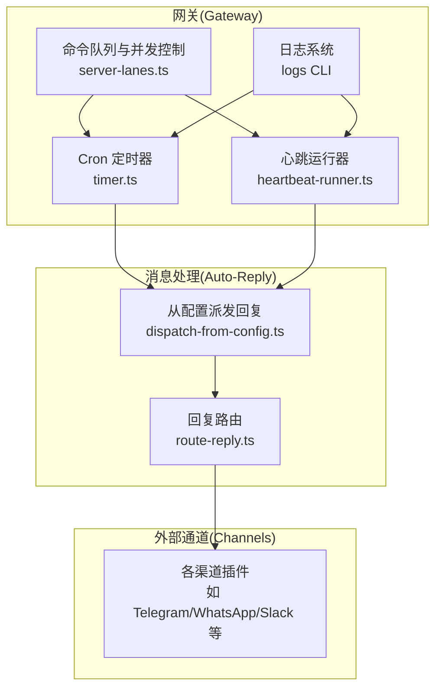
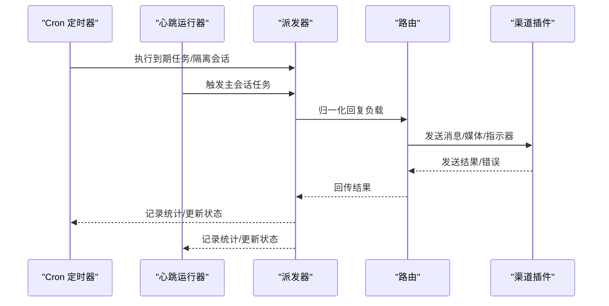
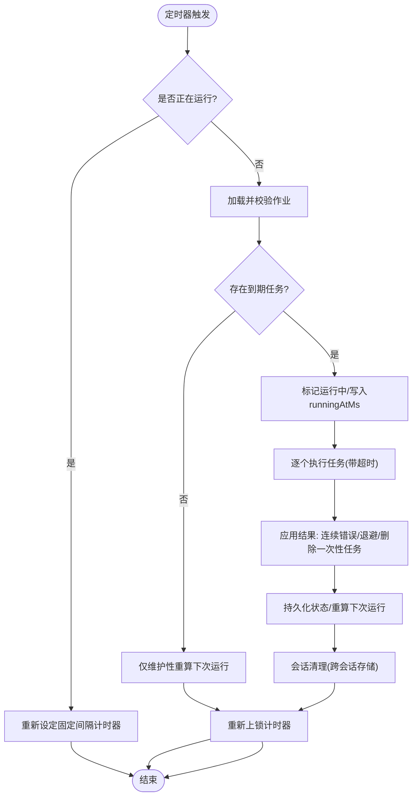
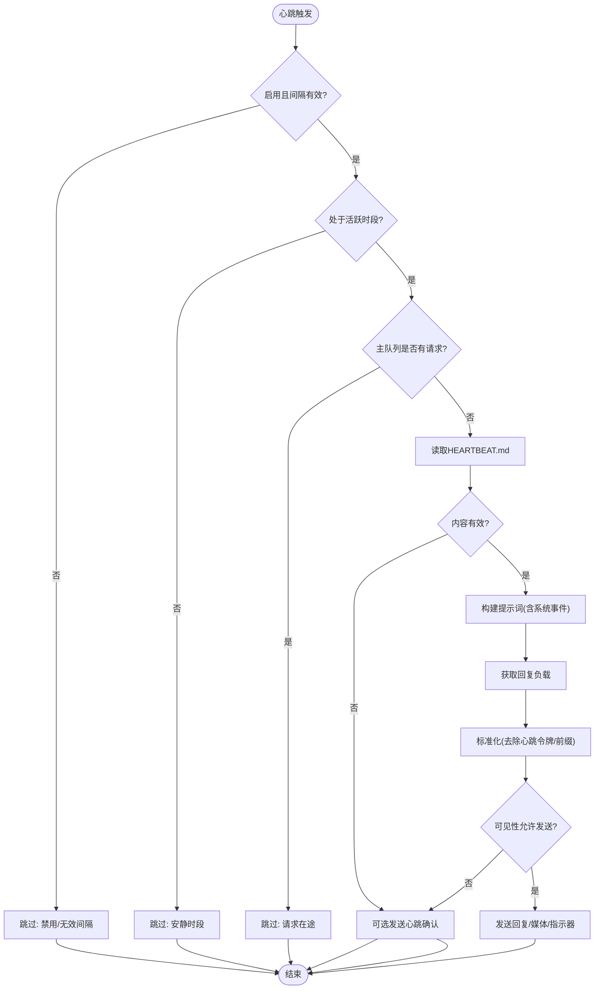
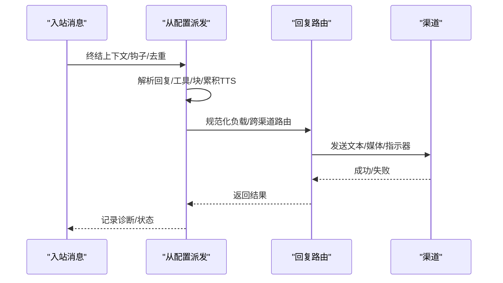
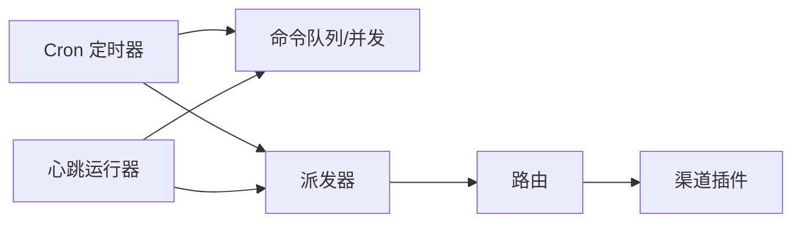

# 自动化任务故障排除

<cite>
**本文档引用的文件**
- [docs/automation/troubleshooting.md](file://docs/automation/troubleshooting.md)
- [docs/automation/cron-jobs.md](file://docs/automation/cron-jobs.md)
- [docs/automation/cron-vs-heartbeat.md](file://docs/automation/cron-vs-heartbeat.md)
- [docs/gateway/troubleshooting.md](file://docs/gateway/troubleshooting.md)
- [docs/gateway/heartbeat.md](file://docs/gateway/heartbeat.md)
- [src/cron/service/timer.ts](file://src/cron/service/timer.ts)
- [src/infra/heartbeat-runner.ts](file://src/infra/heartbeat-runner.ts)
- [src/auto-reply/reply/dispatch-from-config.ts](file://src/auto-reply/reply/dispatch-from-config.ts)
- [src/auto-reply/reply/route-reply.ts](file://src/auto-reply/reply/route-reply.ts)
- [src/gateway/server-lanes.ts](file://src/gateway/server-lanes.ts)
- [docs/cli/logs.md](file://docs/cli/logs.md)
</cite>

## 目录

1. [简介](#简介)
2. [项目结构](#项目结构)
3. [核心组件](#核心组件)
4. [架构总览](#架构总览)
5. [详细组件分析](#详细组件分析)
6. [依赖关系分析](#依赖关系分析)
7. [性能考量](#性能考量)
8. [故障排除指南](#故障排除指南)
9. [结论](#结论)
10. [附录](#附录)

## 简介

本指南面向OpenClaw自动化系统的运维与开发者，聚焦定时任务（Cron）与心跳机制（Heartbeat）的故障排查，覆盖任务调度失败、执行超时、权限不足、交付失败等常见问题。文档提供命令行诊断流程、日志分析方法、配置验证步骤，并解释任务优先级、并发控制与资源限制对系统稳定性的影响，帮助快速定位并解决自动化任务与消息处理之间的协调问题。

## 项目结构

OpenClaw的自动化能力由“网关（Gateway）+ 通道（Channels）+ 插件（Plugins）+ 会话（Sessions）+ 日志（Logs）”构成。定时任务与心跳均在网关内运行，通过统一的命令队列与会话存储进行协调；消息自动回复（Auto-Reply）模块负责将输出路由到指定渠道。

图表来源

- [src/cron/service/timer.ts](file://src/cron/service/timer.ts#L120-L158)
- [src/infra/heartbeat-runner.ts](file://src/infra/heartbeat-runner.ts#L452-L506)
- [src/gateway/server-lanes.ts](file://src/gateway/server-lanes.ts#L6-L10)
- [src/auto-reply/reply/dispatch-from-config.ts](file://src/auto-reply/reply/dispatch-from-config.ts#L82-L118)
- [src/auto-reply/reply/route-reply.ts](file://src/auto-reply/reply/route-reply.ts#L49-L92)

章节来源

- [docs/automation/troubleshooting.md](file://docs/automation/troubleshooting.md#L14-L31)
- [docs/automation/cron-jobs.md](file://docs/automation/cron-jobs.md#L322-L344)
- [docs/gateway/heartbeat.md](file://docs/gateway/heartbeat.md#L80-L99)

## 核心组件

- Cron定时器：负责加载作业、计算下次唤醒时间、执行到期任务、应用指数退避、持久化状态与会话清理。
- 心跳运行器：按周期触发主会话任务，根据可见性规则决定是否发送消息，支持静默确认与去重。
- 消息派发与路由：从配置解析回复内容，必要时跨渠道路由，处理TTS与块流合并。
- 并发与队列：通过命令队列与车道（Lane）控制Cron/主会话/子代理的并发度。
- 日志系统：远程查看网关日志，辅助定位错误堆栈与上下文。

章节来源

- [src/cron/service/timer.ts](file://src/cron/service/timer.ts#L48-L118)
- [src/infra/heartbeat-runner.ts](file://src/infra/heartbeat-runner.ts#L452-L506)
- [src/auto-reply/reply/dispatch-from-config.ts](file://src/auto-reply/reply/dispatch-from-config.ts#L82-L118)
- [src/gateway/server-lanes.ts](file://src/gateway/server-lanes.ts#L6-L10)
- [docs/cli/logs.md](file://docs/cli/logs.md#L9-L29)

## 架构总览

下图展示自动化任务与消息处理的关键交互路径：Cron与心跳在网关内部触发，消息派发模块统一对外输出，最终经路由模块投递至目标渠道。

图表来源

- [src/cron/service/timer.ts](file://src/cron/service/timer.ts#L420-L506)
- [src/infra/heartbeat-runner.ts](file://src/infra/heartbeat-runner.ts#L540-L606)
- [src/auto-reply/reply/dispatch-from-config.ts](file://src/auto-reply/reply/dispatch-from-config.ts#L297-L349)
- [src/auto-reply/reply/route-reply.ts](file://src/auto-reply/reply/route-reply.ts#L49-L92)

## 详细组件分析

### Cron 定时器与执行流程

- 调度与唤醒：计算下次唤醒时间，最多每分钟唤醒一次以避免漂移；若正在运行则以固定间隔重试。
- 执行与超时：隔离任务有默认超时上限，可按任务配置覆盖；超时返回错误并计入退避。
- 结果与退避：连续错误采用指数退避延迟；一次性任务成功后删除；错误时记录告警并延迟下次运行。
- 会话清理：定时器触发时顺带清理过期的Cron运行会话，防止资源泄漏。

图表来源

- [src/cron/service/timer.ts](file://src/cron/service/timer.ts#L120-L158)
- [src/cron/service/timer.ts](file://src/cron/service/timer.ts#L160-L338)
- [src/cron/service/timer.ts](file://src/cron/service/timer.ts#L48-L118)

章节来源

- [src/cron/service/timer.ts](file://src/cron/service/timer.ts#L17-L36)
- [src/cron/service/timer.ts](file://src/cron/service/timer.ts#L120-L158)
- [src/cron/service/timer.ts](file://src/cron/service/timer.ts#L160-L338)
- [src/cron/service/timer.ts](file://src/cron/service/timer.ts#L48-L118)

### 心跳机制与交付策略

- 周期与窗口：按配置的间隔运行，受活跃时段限制；队列繁忙时跳过本轮。
- 内容判定：若HEARTBEAT.md为空或仅含占位内容，则跳过；否则生成回复并按可见性规则决定是否发送。
- 静默确认：当允许且具备目标时，发送“心跳确认”文本，避免重复提醒。
- 复用与去重：同一内容在24小时内不重复发送；执行完成事件与Cron事件使用专门提示词。

图表来源

- [src/infra/heartbeat-runner.ts](file://src/infra/heartbeat-runner.ts#L452-L506)
- [src/infra/heartbeat-runner.ts](file://src/infra/heartbeat-runner.ts#L509-L537)
- [src/infra/heartbeat-runner.ts](file://src/infra/heartbeat-runner.ts#L540-L606)
- [src/infra/heartbeat-runner.ts](file://src/infra/heartbeat-runner.ts#L672-L702)

章节来源

- [docs/gateway/heartbeat.md](file://docs/gateway/heartbeat.md#L44-L51)
- [src/infra/heartbeat-runner.ts](file://src/infra/heartbeat-runner.ts#L472-L480)
- [src/infra/heartbeat-runner.ts](file://src/infra/heartbeat-runner.ts#L482-L507)

### 消息派发与路由

- 派发流程：检测重复输入、调用回复解析器、处理工具/块回复、生成TTS、跨渠道路由。
- 路由逻辑：规范化负载、处理空回复、支持镜像模式与中止信号；跨渠道时直接路由到来源渠道。
- 错误处理：记录处理阶段与错误原因，确保诊断链路完整。

图表来源

- [src/auto-reply/reply/dispatch-from-config.ts](file://src/auto-reply/reply/dispatch-from-config.ts#L82-L118)
- [src/auto-reply/reply/dispatch-from-config.ts](file://src/auto-reply/reply/dispatch-from-config.ts#L297-L349)
- [src/auto-reply/reply/route-reply.ts](file://src/auto-reply/reply/route-reply.ts#L49-L92)

章节来源

- [src/auto-reply/reply/dispatch-from-config.ts](file://src/auto-reply/reply/dispatch-from-config.ts#L143-L146)
- [src/auto-reply/reply/dispatch-from-config.ts](file://src/auto-reply/reply/dispatch-from-config.ts#L297-L349)
- [src/auto-reply/reply/route-reply.ts](file://src/auto-reply/reply/route-reply.ts#L49-L92)

## 依赖关系分析

- Cron与心跳共享命令队列与并发控制，避免相互阻塞。
- Cron的隔离任务与心跳均通过会话存储管理上下文，需要关注会话清理与并发上限。
- 消息派发依赖全局钩子与TTS配置，跨渠道路由需确保目标渠道可用与凭据正确。

图表来源

- [src/gateway/server-lanes.ts](file://src/gateway/server-lanes.ts#L6-L10)
- [src/cron/service/timer.ts](file://src/cron/service/timer.ts#L302-L333)
- [src/auto-reply/reply/dispatch-from-config.ts](file://src/auto-reply/reply/dispatch-from-config.ts#L82-L118)
- [src/auto-reply/reply/route-reply.ts](file://src/auto-reply/reply/route-reply.ts#L49-L92)

章节来源

- [src/gateway/server-lanes.ts](file://src/gateway/server-lanes.ts#L6-L10)
- [src/cron/service/timer.ts](file://src/cron/service/timer.ts#L302-L333)

## 性能考量

- 并发控制：Cron默认单并发，可通过配置提升；主会话与子代理并发由代理配置决定。过高的并发可能导致队列拥塞与资源争用。
- 任务超时：隔离任务默认超时上限用于防止单点卡死；建议为长耗时任务设置合理超时。
- 会话清理：定时器触发时清理Cron运行会话，避免历史残留占用存储与内存。
- 心跳成本：较短间隔与较长提示词会增加Token消耗；建议保持HEARTBEAT.md简洁，必要时关闭可见性或降低模型成本。

章节来源

- [docs/automation/cron-jobs.md](file://docs/automation/cron-jobs.md#L330-L338)
- [src/cron/service/timer.ts](file://src/cron/service/timer.ts#L17-L24)
- [src/cron/service/timer.ts](file://src/cron/service/timer.ts#L302-L333)
- [docs/gateway/heartbeat.md](file://docs/gateway/heartbeat.md#L360-L365)

## 故障排除指南

### 通用诊断命令与流程

- 使用“命令梯”快速定位问题：状态、网关状态、日志、健康检查、通道探测。
- 针对自动化：查询Cron状态与列表、最近运行记录；查看心跳最后结果与配置。

章节来源

- [docs/automation/troubleshooting.md](file://docs/automation/troubleshooting.md#L14-L31)
- [docs/gateway/troubleshooting.md](file://docs/gateway/troubleshooting.md#L14-L24)

### Cron 不触发/未交付

- 症状与排查
  - Cron被禁用或调度器未启动：检查配置与环境变量；确认网关持续运行。
  - 调度器tick失败：查看日志中的错误堆栈；关注文件/运行时异常。
  - 任务未到期：手动运行需加强制参数；非到期调用会被跳过。
  - 交付失败：检查交付模式与目标；通道认证错误会导致阻断。
- 常见签名
  - “scheduler disabled; jobs will not run automatically”
  - “timer tick failed”
  - “reason: not-due”
  - “delivery mode is none”
  - “channel auth errors (unauthorized/missing_scope/Forbidden)”

章节来源

- [docs/automation/troubleshooting.md](file://docs/automation/troubleshooting.md#L32-L73)
- [src/cron/service/timer.ts](file://src/cron/service/timer.ts#L147-L157)
- [src/cron/service/timer.ts](file://src/cron/service/timer.ts#L247-L259)

### Cron 已触发但无交付

- 排查要点
  - 运行状态为ok，但交付模式为none。
  - 缺失或无效的通道/目标配置导致内部成功但跳过外部投递。
  - 通道凭据/权限问题导致阻断。
- 建议
  - 使用通道探测命令验证连接与权限。
  - 明确交付目标格式（如带前缀的频道/用户标识）。

章节来源

- [docs/automation/troubleshooting.md](file://docs/automation/troubleshooting.md#L53-L73)
- [docs/automation/cron-jobs.md](file://docs/automation/cron-jobs.md#L212-L224)

### 心跳被抑制或跳过

- 症状与排查
  - 配置了安静时段（activeHours）导致跳过。
  - 主队列繁忙（requests-in-flight）导致推迟。
  - HEARTBEAT.md为空或仅占位内容。
  - 可见性设置禁止对外消息（alerts-disabled）。
- 建议
  - 检查活跃时段与本地时区；调整可见性开关。
  - 降低队列压力或延后批量操作。

章节来源

- [docs/automation/troubleshooting.md](file://docs/automation/troubleshooting.md#L74-L94)
- [src/infra/heartbeat-runner.ts](file://src/infra/heartbeat-runner.ts#L472-L480)
- [src/infra/heartbeat-runner.ts](file://src/infra/heartbeat-runner.ts#L482-L507)
- [docs/gateway/heartbeat.md](file://docs/gateway/heartbeat.md#L232-L262)

### 时间与活跃时段陷阱

- 关键点
  - 未设置用户时区时，回退到主机时区或显式配置的时区。
  - Cron at表达式缺省时区按UTC处理。
  - 主机时区变更会影响墙钟时间表现。
- 建议
  - 明确配置activeHours时区；必要时设置用户时区。
  - 使用日志中的本地时间渲染进行交叉验证。

章节来源

- [docs/automation/troubleshooting.md](file://docs/automation/troubleshooting.md#L95-L111)
- [docs/automation/cron-jobs.md](file://docs/automation/cron-jobs.md#L118-L119)
- [docs/cli/logs.md](file://docs/cli/logs.md#L20-L29)

### 任务配置验证清单

- Cron
  - 是否启用；是否配置存储路径；并发限制是否合理。
  - 一次性任务是否应删除；是否设置了超时。
- 心跳
  - 间隔是否有效；活跃时段与时区是否正确。
  - 目标与可见性设置是否符合预期。
- 交付
  - 渠道与目标格式是否正确；是否启用了最佳努力投递。
  - 跨渠道路由时，来源渠道与目标是否一致。

章节来源

- [docs/automation/cron-jobs.md](file://docs/automation/cron-jobs.md#L328-L344)
- [docs/gateway/heartbeat.md](file://docs/gateway/heartbeat.md#L80-L99)
- [docs/automation/cron-jobs.md](file://docs/automation/cron-jobs.md#L212-L224)

### 执行日志分析

- 使用远程日志命令实时跟踪：支持JSON与本地时间渲染。
- 关注关键事件
  - Cron：armTimer、timer tick failed、applying error backoff、session reaper。
  - 心跳：skipped/ok-empty/ok-token/duplicate、channel not ready。
- 建议
  - 在问题复现期间开启跟随模式并结合配置检查。
  - 对跨渠道路由场景，核对route-reply失败原因与中止信号。

章节来源

- [docs/cli/logs.md](file://docs/cli/logs.md#L9-L29)
- [src/cron/service/timer.ts](file://src/cron/service/timer.ts#L147-L157)
- [src/infra/heartbeat-runner.ts](file://src/infra/heartbeat-runner.ts#L560-L569)
- [src/auto-reply/reply/dispatch-from-config.ts](file://src/auto-reply/reply/dispatch-from-config.ts#L244-L247)

### 依赖检查

- 通道连通性与权限
  - 使用通道探测命令检查连接状态与授权范围。
  - 关注配对状态、允许列表与提及要求。
- 网关服务
  - 确认网关运行状态、RPC探测、端口绑定与鉴权配置。
  - 升级后检查URL覆盖与鉴权策略变化。

章节来源

- [docs/gateway/troubleshooting.md](file://docs/gateway/troubleshooting.md#L122-L152)
- [docs/gateway/troubleshooting.md](file://docs/gateway/troubleshooting.md#L92-L121)
- [docs/gateway/troubleshooting.md](file://docs/gateway/troubleshooting.md#L246-L313)

### 系统性问题与解决方案

- 任务优先级与并发控制
  - Cron默认单并发，可通过配置提升；注意与主会话/子代理并发的平衡。
  - 队列繁忙时心跳可能被跳过，建议优化任务调度或降低峰值。
- 资源限制
  - 隔离任务超时上限用于防止单点卡死；为长任务设置合理超时。
  - 会话清理定期执行，避免历史残留；关注存储路径与权限。
- 自动化任务与消息处理协调
  - 使用跨渠道路由时，确保来源渠道与目标一致；失败时记录详细错误。
  - 对于执行完成/计划提醒事件，采用专用提示词避免误判“心跳确认”。

章节来源

- [src/gateway/server-lanes.ts](file://src/gateway/server-lanes.ts#L6-L10)
- [src/cron/service/timer.ts](file://src/cron/service/timer.ts#L17-L24)
- [src/cron/service/timer.ts](file://src/cron/service/timer.ts#L302-L333)
- [src/infra/heartbeat-runner.ts](file://src/infra/heartbeat-runner.ts#L99-L115)
- [src/auto-reply/reply/dispatch-from-config.ts](file://src/auto-reply/reply/dispatch-from-config.ts#L210-L211)

## 结论

通过遵循“命令梯”与“日志驱动”的诊断流程，结合Cron与心跳的内部行为特征，可以高效定位自动化任务与消息处理的故障根因。建议在生产环境中：

- 明确配置与时区策略；
- 合理设置并发与超时；
- 使用通道探测与可见性开关；
- 借助远程日志与会话清理机制保障稳定性。

## 附录

- 相关文档
  - Cron作业与调度：[Cron Jobs](file://docs/automation/cron-jobs.md)
  - Cron与心跳选择：[Cron vs Heartbeat](file://docs/automation/cron-vs-heartbeat.md)
  - 心跳配置与可见性：[Heartbeat](file://docs/gateway/heartbeat.md)
  - 网关故障排除：[Gateway Troubleshooting](file://docs/gateway/troubleshooting.md)
  - 日志CLI参考：[Logs](file://docs/cli/logs.md)
