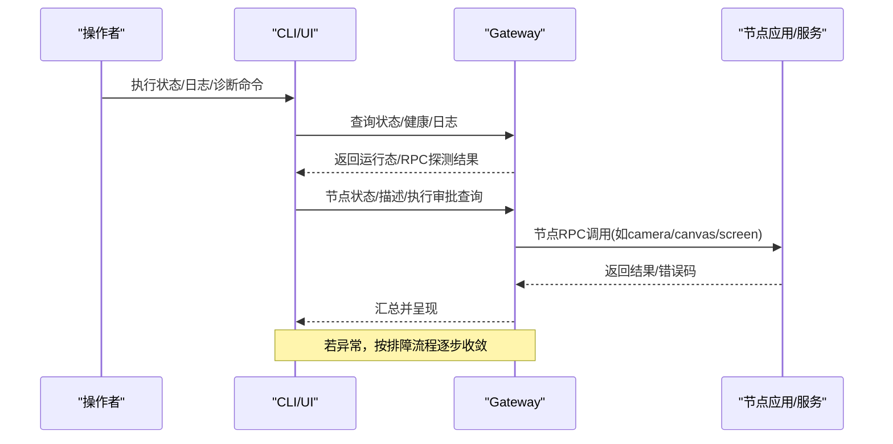
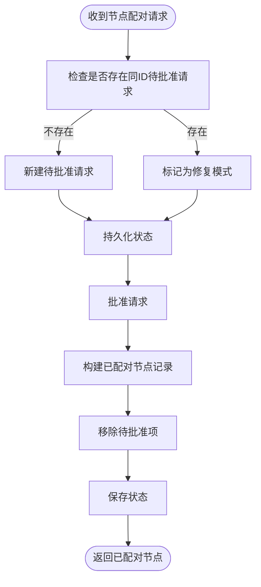
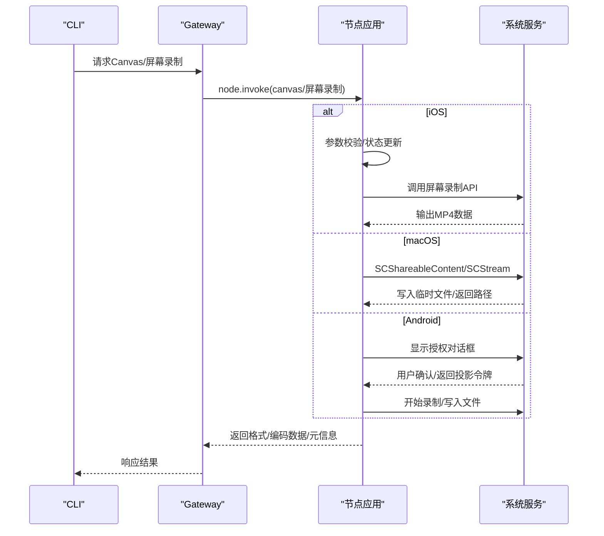
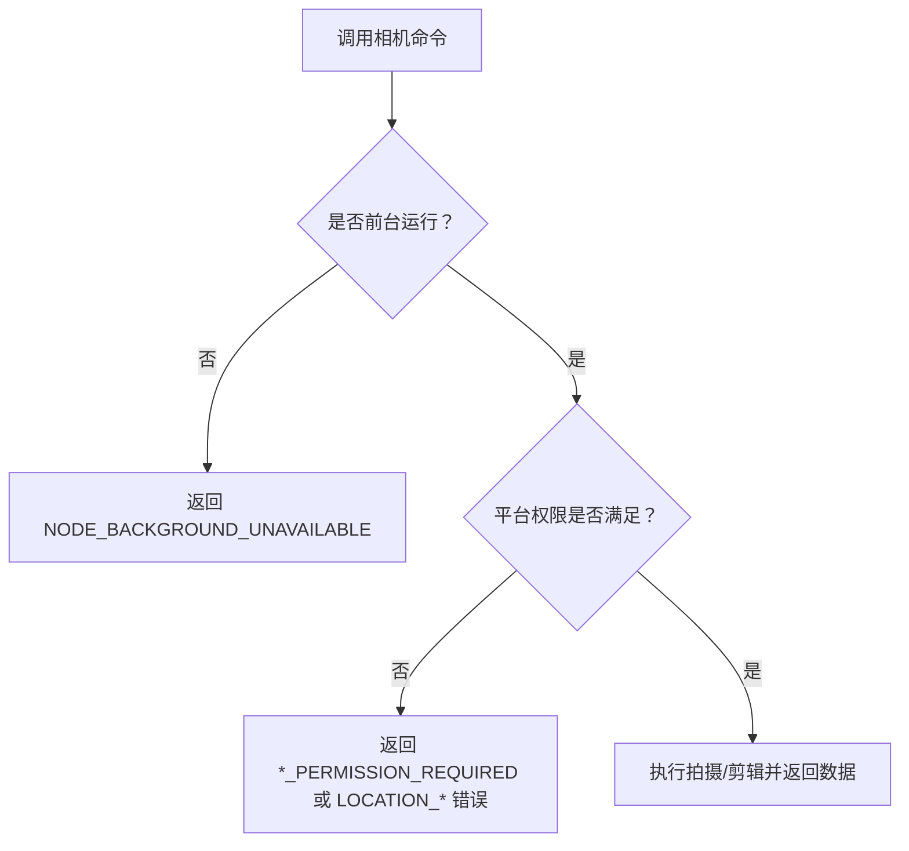
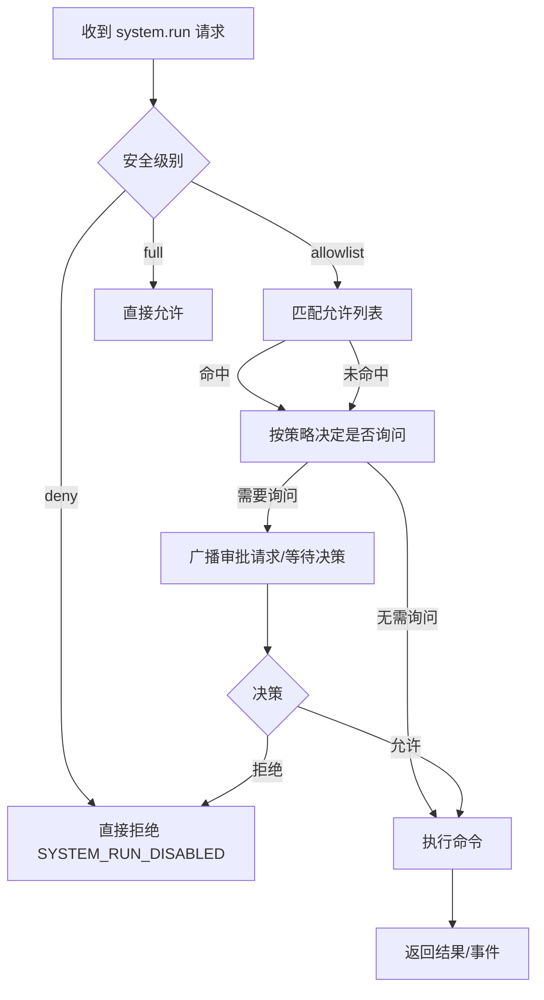
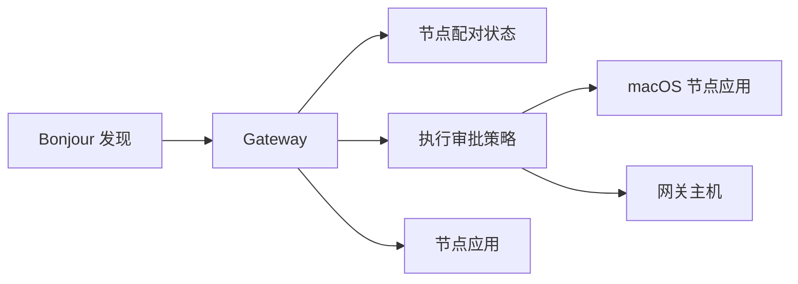

# 设备节点故障排除

<cite>
**本文引用的文件**
- [docs/help/troubleshooting.md](file://docs/help/troubleshooting.md)
- [docs/gateway/troubleshooting.md](file://docs/gateway/troubleshooting.md)
- [docs/nodes/troubleshooting.md](file://docs/nodes/troubleshooting.md)
- [docs/nodes/camera.md](file://docs/nodes/camera.md)
- [docs/nodes/audio.md](file://docs/nodes/audio.md)
- [docs/nodes/images.md](file://docs/nodes/images.md)
- [docs/nodes/media-understanding.md](file://docs/nodes/media-understanding.md)
- [docs/nodes/index.md](file://docs/nodes/index.md)
- [docs/platforms/android.md](file://docs/platforms/android.md)
- [docs/platforms/ios.md](file://docs/platforms/ios.md)
- [docs/tools/exec-approvals.md](file://docs/tools/exec-approvals.md)
- [docs/tools/elevated.md](file://docs/tools/elevated.md)
- [src/infra/node-pairing.ts](file://src/infra/node-pairing.ts)
- [apps/macos/Sources/OpenClaw/NodePairingApprovalPrompter.swift](file://apps/macos/Sources/OpenClaw/NodePairingApprovalPrompter.swift)
- [apps/macos/Sources/OpenClaw/ScreenRecordService.swift](file://apps/macos/Sources/OpenClaw/ScreenRecordService.swift)
- [apps/ios/Sources/Model/NodeAppModel.swift](file://apps/ios/Sources/Model/NodeAppModel.swift)
- [apps/android/app/src/main/java/ai/openclaw/android/ScreenCaptureRequester.kt](file://apps/android/app/src/main/java/ai/openclaw/android/ScreenCaptureRequester.kt)
- [src/infra/bonjour-discovery.ts](file://src/infra/bonjour-discovery.ts)
- [src/infra/bonjour.ts](file://src/infra/bonjour.ts)
- [docs/gateway/bonjour.md](file://docs/gateway/bonjour.md)
- [src/cli/exec-approvals-cli.test.ts](file://src/cli/exec-approvals-cli.test.ts)
- [src/commands/doctor-state-integrity.ts](file://src/commands/doctor-state-integrity.ts)
- [src/security/audit.ts](file://src/security/audit.ts)
- [src/security/audit-extra.async.ts](file://src/security/audit-extra.async.ts)
- [src/security/windows-acl.ts](file://src/security/windows-acl.ts)
- [docs/platforms/mac/permissions.md](file://docs/platforms/mac/permissions.md)
</cite>

## 目录

1. [简介](#简介)
2. [项目结构](#项目结构)
3. [核心组件](#核心组件)
4. [架构总览](#架构总览)
5. [详细组件分析](#详细组件分析)
6. [依赖关系分析](#依赖关系分析)
7. [性能考虑](#性能考虑)
8. [故障排除指南](#故障排除指南)
9. [结论](#结论)
10. [附录](#附录)

## 简介

本指南面向OpenClaw设备节点系统，聚焦“节点配对失败、连接超时、工具执行失败”等常见问题，覆盖Canvas控制、相机访问、屏幕录制等具体功能，并解释节点与网关通信的故障诊断与网络问题排查。文档同时提供针对macOS、iOS、Android三类平台的差异化排查步骤，以及节点权限配置、操作系统权限检查、工具执行许可的关键排查清单。

## 项目结构

OpenClaw采用多语言混合架构：网关侧使用TypeScript实现，节点侧在macOS/iOS/Android分别提供原生应用或配套服务；文档位于docs目录，提供从高层到细节的排障路径与命令阶梯。

```mermaid
graph TB
subgraph "网关(Gateway)"
GW["Gateway 进程<br/>状态/日志/健康检查"]
DISC["Bonjour 发现与解析"]
PAIR["节点配对状态管理"]
end
subgraph "节点(Node)"
IOS["iOS 节点应用"]
AND["Android 节点应用"]
MAC["macOS 节点应用"]
end
subgraph "控制面"
CLI["CLI 命令集<br/>status/logs/doctor/nodes"]
UI["控制UI/仪表板"]
end
CLI --> GW
UI --> GW
GW <- --> DISC
GW <- --> PAIR
GW <- --> IOS
GW <- --> AND
GW <- --> MAC
```

图示来源

- [docs/help/troubleshooting.md](file://docs/help/troubleshooting.md#L39-L57)
- [docs/gateway/troubleshooting.md](file://docs/gateway/troubleshooting.md#L14-L25)
- [src/infra/bonjour-discovery.ts](file://src/infra/bonjour-discovery.ts#L277-L297)
- [src/infra/bonjour.ts](file://src/infra/bonjour.ts#L192-L226)

章节来源

- [docs/help/troubleshooting.md](file://docs/help/troubleshooting.md#L39-L57)
- [docs/gateway/troubleshooting.md](file://docs/gateway/troubleshooting.md#L14-L25)

## 核心组件

- 节点配对与批准：网关侧维护待批准请求与已配对节点状态，节点侧提供配对提示与决策入口。
- 执行审批与白名单：macOS节点应用与网关主机均支持执行审批策略，含安全级别、询问策略、允许列表与自动放行技能二进制。
- 平台能力与前台限制：Canvas/相机/屏幕录制在iOS/Android上要求前台运行；macOS节点应用需用户授权。
- 发现与连接：Bonjour/DNS-SD用于局域网发现，跨网络可借助Tailnet与单播DNS-SD。
- 工具与媒体：媒体理解（图像/音频/视频）、消息发送与通道行为、屏幕录制参数与限制。

章节来源

- [src/infra/node-pairing.ts](file://src/infra/node-pairing.ts#L187-L264)
- [apps/macos/Sources/OpenClaw/NodePairingApprovalPrompter.swift](file://apps/macos/Sources/OpenClaw/NodePairingApprovalPrompter.swift#L46-L84)
- [docs/tools/exec-approvals.md](file://docs/tools/exec-approvals.md#L74-L135)
- [docs/nodes/camera.md](file://docs/nodes/camera.md#L60-L101)
- [src/infra/bonjour-discovery.ts](file://src/infra/bonjour-discovery.ts#L277-L297)
- [docs/nodes/media-understanding.md](file://docs/nodes/media-understanding.md#L20-L33)

## 架构总览

下图展示从CLI/UI到网关、再到节点的典型调用链路，以及关键错误信号与恢复步骤。



图示来源

- [docs/help/troubleshooting.md](file://docs/help/troubleshooting.md#L13-L26)
- [docs/gateway/troubleshooting.md](file://docs/gateway/troubleshooting.md#L14-L25)
- [docs/nodes/troubleshooting.md](file://docs/nodes/troubleshooting.md#L13-L31)

## 详细组件分析

### 组件A：节点配对与批准

- 网关侧状态机：维护待批准请求与已配对节点映射，支持批准/拒绝/修复模式。
- 节点侧提示器：在macOS节点应用中弹出配对请求，记录决策事件与时间戳。
- 常见问题：请求未出现、重复请求、修复后仍无法连接。



图示来源

- [src/infra/node-pairing.ts](file://src/infra/node-pairing.ts#L187-L264)
- [apps/macos/Sources/OpenClaw/NodePairingApprovalPrompter.swift](file://apps/macos/Sources/OpenClaw/NodePairingApprovalPrompter.swift#L46-L84)

章节来源

- [src/infra/node-pairing.ts](file://src/infra/node-pairing.ts#L187-L264)
- [apps/macos/Sources/OpenClaw/NodePairingApprovalPrompter.swift](file://apps/macos/Sources/OpenClaw/NodePairingApprovalPrompter.swift#L46-L84)

### 组件B：Canvas控制与屏幕录制

- iOS节点：WKWebView渲染，支持导航、脚本注入与快照；屏幕录制参数校验与状态同步。
- macOS节点：基于系统屏幕捕获框架，支持显示索引、帧率、时长、音频开关与输出路径。
- Android节点：通过MediaProjection发起屏幕录制授权，对话框引导与超时处理。



图示来源

- [apps/ios/Sources/Model/NodeAppModel.swift](file://apps/ios/Sources/Model/NodeAppModel.swift#L940-L969)
- [apps/macos/Sources/OpenClaw/ScreenRecordService.swift](file://apps/macos/Sources/OpenClaw/ScreenRecordService.swift#L41-L113)
- [apps/android/app/src/main/java/ai/openclaw/android/ScreenCaptureRequester.kt](file://apps/android/app/src/main/java/ai/openclaw/android/ScreenCaptureRequester.kt#L38-L65)

章节来源

- [apps/ios/Sources/Model/NodeAppModel.swift](file://apps/ios/Sources/Model/NodeAppModel.swift#L940-L969)
- [apps/macos/Sources/OpenClaw/ScreenRecordService.swift](file://apps/macos/Sources/OpenClaw/ScreenRecordService.swift#L41-L113)
- [apps/android/app/src/main/java/ai/openclaw/android/ScreenCaptureRequester.kt](file://apps/android/app/src/main/java/ai/openclaw/android/ScreenCaptureRequester.kt#L38-L65)

### 组件C：相机访问与前台限制

- iOS/Android：相机命令仅前台可用，后台调用返回“前台不可用”错误。
- 权限矩阵：相机/录音、屏幕录制、位置权限在各平台差异较大，需逐项核对。
- macOS：相机开关默认关闭，需用户显式开启。



图示来源

- [docs/nodes/camera.md](file://docs/nodes/camera.md#L60-L101)
- [docs/nodes/troubleshooting.md](file://docs/nodes/troubleshooting.md#L37-L50)

章节来源

- [docs/nodes/camera.md](file://docs/nodes/camera.md#L60-L101)
- [docs/nodes/troubleshooting.md](file://docs/nodes/troubleshooting.md#L37-L50)

### 组件D：工具执行与执行审批

- 安全级别：deny/allowlist/full；询问策略：off/on-miss/always；询问回退：deny/allowlist/full。
- 允许列表：按代理维度配置，支持通配符与最近使用追踪。
- 自动放行技能二进制：启用后，已知技能引用的二进制自动视为允许。
- CLI测试与行为：添加允许列表条目不会触发网关执行审批设置调用，而是本地存储更新。



图示来源

- [docs/tools/exec-approvals.md](file://docs/tools/exec-approvals.md#L74-L135)
- [src/cli/exec-approvals-cli.test.ts](file://src/cli/exec-approvals-cli.test.ts#L127-L142)

章节来源

- [docs/tools/exec-approvals.md](file://docs/tools/exec-approvals.md#L74-L135)
- [src/cli/exec-approvals-cli.test.ts](file://src/cli/exec-approvals-cli.test.ts#L127-L142)

## 依赖关系分析

- 发现与连接：Bonjour/DNS-SD负责服务发现，跨网络场景建议使用Tailnet与单播DNS-SD。
- 配对与批准：网关侧状态与节点侧提示器协同，确保配对请求可见与可决策。
- 执行审批：macOS节点应用与网关主机共享同一套策略，CLI/UI可统一编辑与查看。



图示来源

- [src/infra/bonjour-discovery.ts](file://src/infra/bonjour-discovery.ts#L277-L297)
- [src/infra/bonjour.ts](file://src/infra/bonjour.ts#L192-L226)
- [docs/gateway/bonjour.md](file://docs/gateway/bonjour.md#L119-L157)
- [src/infra/node-pairing.ts](file://src/infra/node-pairing.ts#L187-L264)
- [docs/tools/exec-approvals.md](file://docs/tools/exec-approvals.md#L33-L73)

章节来源

- [src/infra/bonjour-discovery.ts](file://src/infra/bonjour-discovery.ts#L277-L297)
- [src/infra/bonjour.ts](file://src/infra/bonjour.ts#L192-L226)
- [docs/gateway/bonjour.md](file://docs/gateway/bonjour.md#L119-L157)
- [src/infra/node-pairing.ts](file://src/infra/node-pairing.ts#L187-L264)
- [docs/tools/exec-approvals.md](file://docs/tools/exec-approvals.md#L33-L73)

## 性能考虑

- 屏幕录制时长与帧率：存在最小/最大限制，避免过大负载导致内存与CPU压力。
- 媒体理解并发：默认并发能力处理数为2，过多并发可能影响响应时间。
- 日志与诊断：优先使用“快速命令阶梯”，减少无效重试与重复抓取。

章节来源

- [apps/macos/Sources/OpenClaw/ScreenRecordService.swift](file://apps/macos/Sources/OpenClaw/ScreenRecordService.swift#L100-L109)
- [docs/nodes/media-understanding.md](file://docs/nodes/media-understanding.md#L46-L46)

## 故障排除指南

### 通用排障流程（症状导向）

- 快速命令阶梯：先确认网关运行、RPC探测成功、通道连通、日志稳定。
- 分层定位：无回复、控制UI连接失败、网关服务异常、通道消息不流动、自动化任务未触发、节点工具失败、浏览器工具失败。
- 节点工具失败专项：检查前台状态、权限授予、执行审批与白名单。

章节来源

- [docs/help/troubleshooting.md](file://docs/help/troubleshooting.md#L13-L26)
- [docs/help/troubleshooting.md](file://docs/help/troubleshooting.md#L39-L57)
- [docs/gateway/troubleshooting.md](file://docs/gateway/troubleshooting.md#L14-L25)
- [docs/gateway/troubleshooting.md](file://docs/gateway/troubleshooting.md#L184-L214)

### 节点配对失败

- 症状：节点可见但无法批准，或反复出现配对请求。
- 排查要点：
  - 确认网关侧待批准请求列表与已配对节点状态。
  - 在节点应用侧查看配对提示与决策记录。
  - 如需修复，重新发起批准或拒绝后重建状态。
- 相关命令与页面：
  - 节点待批准列表与批准/拒绝操作。
  - 节点描述与能力检查。

章节来源

- [src/infra/node-pairing.ts](file://src/infra/node-pairing.ts#L187-L264)
- [apps/macos/Sources/OpenClaw/NodePairingApprovalPrompter.swift](file://apps/macos/Sources/OpenClaw/NodePairingApprovalPrompter.swift#L46-L84)
- [docs/nodes/troubleshooting.md](file://docs/nodes/troubleshooting.md#L60-L78)

### 连接超时与发现失败

- 症状：节点无法发现、连接失败、Bonjour解析失败。
- 排查要点：
  - 使用dns-sd进行浏览与解析验证。
  - 跨网络场景启用Tailnet与单播DNS-SD。
  - 关注网关日志中的Bonjour告警与看门狗修复。
- 相关命令与页面：
  - Bonjour调试与常见失败模式。
  - iOS节点发现日志采集。

章节来源

- [src/infra/bonjour-discovery.ts](file://src/infra/bonjour-discovery.ts#L277-L297)
- [src/infra/bonjour.ts](file://src/infra/bonjour.ts#L192-L226)
- [docs/gateway/bonjour.md](file://docs/gateway/bonjour.md#L119-L157)
- [docs/platforms/ios.md](file://docs/platforms/ios.md#L131-L141)

### Canvas控制与屏幕录制问题

- iOS：前台限制、Canvas URL未配置、屏幕录制格式必须为mp4。
- macOS：屏幕录制权限、输出路径、帧率与时长限制。
- Android：需要用户授权对话框确认，超时处理与权限缺失。
- 建议步骤：
  - 确保节点处于前台。
  - 检查Canvas主机URL是否正确。
  - 校验屏幕录制参数范围。
  - 在节点侧重新授予权限并重试。

章节来源

- [apps/ios/Sources/Model/NodeAppModel.swift](file://apps/ios/Sources/Model/NodeAppModel.swift#L940-L969)
- [apps/macos/Sources/OpenClaw/ScreenRecordService.swift](file://apps/macos/Sources/OpenClaw/ScreenRecordService.swift#L41-L113)
- [apps/android/app/src/main/java/ai/openclaw/android/ScreenCaptureRequester.kt](file://apps/android/app/src/main/java/ai/openclaw/android/ScreenCaptureRequester.kt#L38-L65)
- [docs/platforms/ios.md](file://docs/platforms/ios.md#L67-L91)
- [docs/platforms/android.md](file://docs/platforms/android.md#L120-L152)

### 相机访问失败

- iOS/Android：前台限制、权限缺失、相机开关关闭。
- macOS：相机开关默认关闭，需用户开启。
- 建议步骤：
  - 将节点应用切换至前台。
  - 在系统设置中授予相机/麦克风权限。
  - 检查节点内相机开关状态。
  - 使用CLI辅助命令验证并输出媒体文件路径。

章节来源

- [docs/nodes/camera.md](file://docs/nodes/camera.md#L60-L101)
- [docs/nodes/camera.md](file://docs/nodes/camera.md#L107-L139)
- [docs/nodes/troubleshooting.md](file://docs/nodes/troubleshooting.md#L37-L50)

### 工具执行失败（system.run）

- 症状：返回SYSTEM_RUN_DENIED，原因可能是未批准、白名单不匹配或安全级别deny。
- 排查要点：
  - 检查执行审批策略（安全级别、询问策略、回退策略）。
  - 查看并调整允许列表，必要时启用“自动放行技能二进制”。
  - 对于macOS节点，确认节点应用内的Exec approvals设置。
- 相关命令与页面：
  - 获取/设置执行审批。
  - 添加允许列表项。
  - Elevated模式说明（提升执行权限）。

章节来源

- [docs/tools/exec-approvals.md](file://docs/tools/exec-approvals.md#L74-L135)
- [docs/nodes/index.md](file://docs/nodes/index.md#L276-L286)
- [docs/tools/elevated.md](file://docs/tools/elevated.md#L10-L31)

### 媒体理解与消息发送

- 媒体理解：图像/音频/视频预处理与模型选择，支持CLI与提供商回退。
- 消息发送：WhatsApp Web通道的媒体类型、大小限制与重压缩规则。
- 建议步骤：
  - 检查媒体理解配置与并发设置。
  - 控制媒体尺寸与格式，避免超限。
  - 多媒体回复按顺序发送，确保日志可观测性。

章节来源

- [docs/nodes/media-understanding.md](file://docs/nodes/media-understanding.md#L20-L33)
- [docs/nodes/media-understanding.md](file://docs/nodes/media-understanding.md#L112-L131)
- [docs/nodes/images.md](file://docs/nodes/images.md#L24-L35)
- [docs/nodes/images.md](file://docs/nodes/images.md#L53-L67)

### 各平台特定排障

#### macOS

- 文件夹权限：桌面/文档/下载可能被系统限制，终端/LaunchAgent/SSH上下文需单独授权。
- 建议：将测试文件移入OpenClaw工作区，避免逐目录授权。
- 参考：macOS权限与证书签名注意事项。

章节来源

- [docs/platforms/mac/permissions.md](file://docs/platforms/mac/permissions.md#L43-L51)

#### iOS

- 前台限制：Canvas/相机/屏幕录制需前台。
- 常见错误：前台不可用、Canvas主机未配置、配对提示未出现、重装后Keychain令牌丢失。
- 建议：将应用置于前台、检查Canvas主机URL、重新配对。

章节来源

- [docs/platforms/ios.md](file://docs/platforms/ios.md#L67-L102)
- [docs/nodes/camera.md](file://docs/nodes/camera.md#L60-L63)

#### Android

- 前台限制：相机/屏幕录制需前台。
- 权限：相机与录音权限，运行时授权。
- 建议：在节点应用中重新授予权限，确保前台服务运行。

章节来源

- [docs/platforms/android.md](file://docs/platforms/android.md#L120-L152)
- [docs/nodes/camera.md](file://docs/nodes/camera.md#L82-L101)

### 网络与通道问题

- 通道无回复：检查通道状态、配对与允许列表、提及要求。
- 控制UI连接失败：检查URL、认证模式、安全上下文、设备身份。
- 网关服务异常：检查绑定与认证配置、端口占用、服务状态。
- 通道消息不流动：检查DM策略、群组允许列表、提及要求、API权限。
- 升级后异常：检查配置漂移、认证与URL覆盖行为变化、绑定与认证严格性。

章节来源

- [docs/gateway/troubleshooting.md](file://docs/gateway/troubleshooting.md#L32-L61)
- [docs/gateway/troubleshooting.md](file://docs/gateway/troubleshooting.md#L62-L91)
- [docs/gateway/troubleshooting.md](file://docs/gateway/troubleshooting.md#L92-L121)
- [docs/gateway/troubleshooting.md](file://docs/gateway/troubleshooting.md#L122-L152)
- [docs/gateway/troubleshooting.md](file://docs/gateway/troubleshooting.md#L246-L319)

### 权限与安全配置

- 文件权限审计：配置文件与状态目录的读写权限，避免组/世界可读。
- Windows ACL：信任主体分类与权限令牌解读。
- 建议：使用doctor命令自动检测并提示收紧权限。

章节来源

- [src/commands/doctor-state-integrity.ts](file://src/commands/doctor-state-integrity.ts#L224-L263)
- [src/security/audit.ts](file://src/security/audit.ts#L231-L254)
- [src/security/audit-extra.async.ts](file://src/security/audit-extra.async.ts#L357-L389)
- [src/security/windows-acl.ts](file://src/security/windows-acl.ts#L51-L86)

## 结论

本指南提供了从症状到根因的系统化排障路径，覆盖节点配对、连接发现、Canvas/相机/屏幕录制、工具执行与权限配置、跨平台差异与网络问题。建议遵循“命令阶梯—分层定位—平台差异—权限审计”的思路，结合CLI/UI与日志进行快速收敛与修复。

## 附录

- 常用命令参考（来自排障文档）：
  - 基础健康检查：status、gateway status、logs --follow、doctor、channels status --probe
  - 节点专项：nodes status、nodes describe、approvals get
  - 网关专项：gateway status --json、gateway status --deep
  - 浏览器专项：browser status、browser start、browser profiles
- 错误码速查：
  - 节点前台不可用、相机/位置/屏幕权限缺失、系统执行被拒（含未批准/白名单不匹配）

章节来源

- [docs/help/troubleshooting.md](file://docs/help/troubleshooting.md#L13-L26)
- [docs/gateway/troubleshooting.md](file://docs/gateway/troubleshooting.md#L14-L25)
- [docs/nodes/troubleshooting.md](file://docs/nodes/troubleshooting.md#L79-L108)
