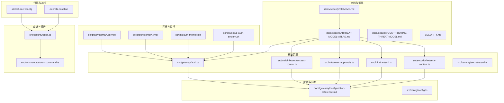
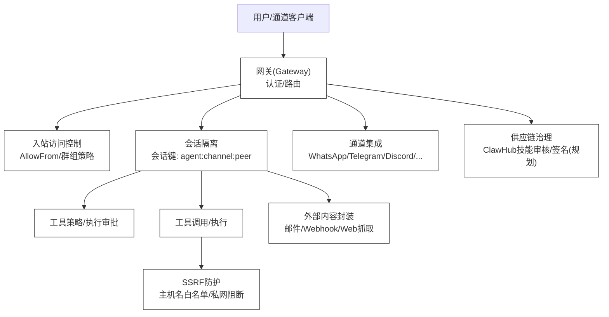
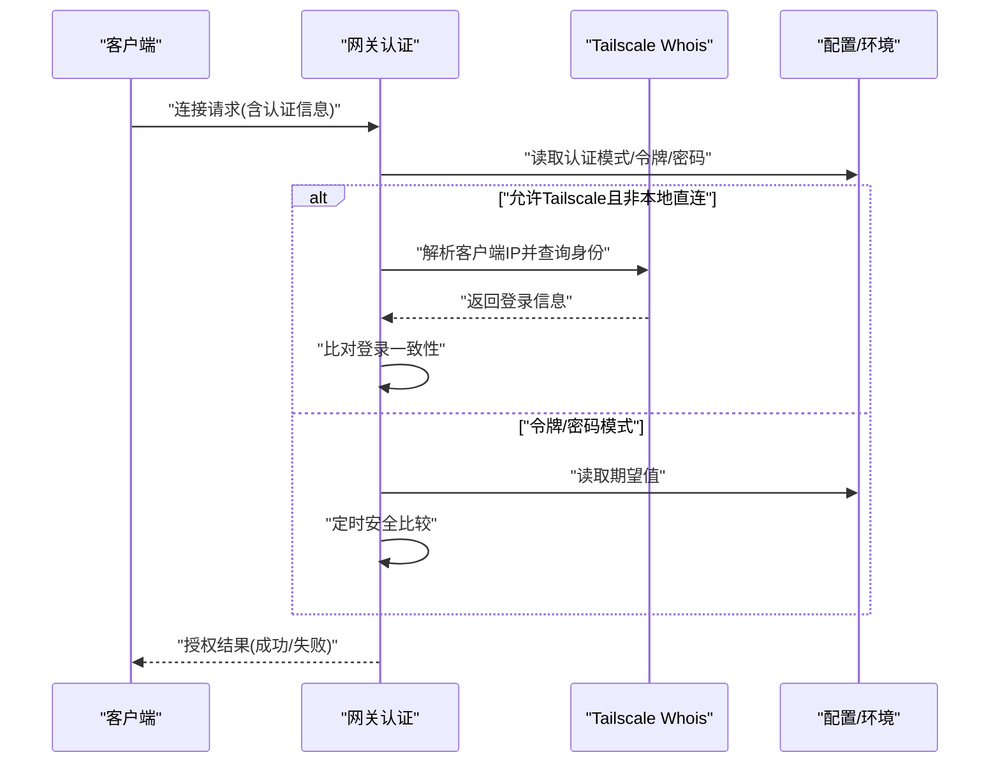
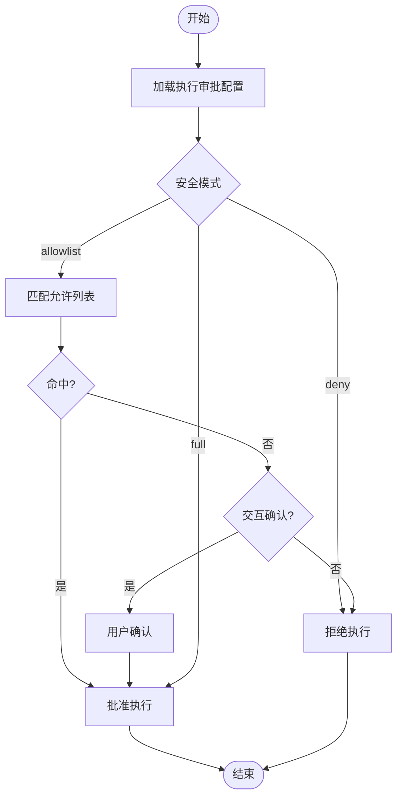
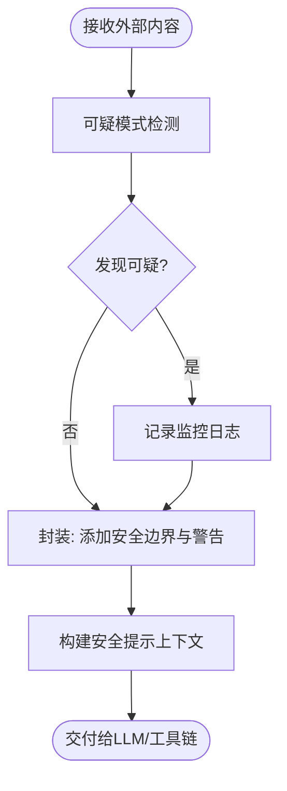
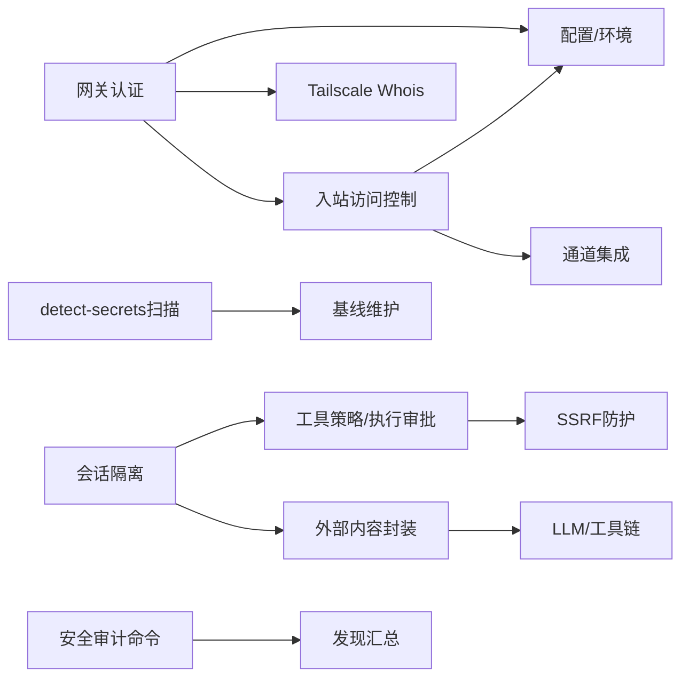

# 安全最佳实践

<cite>
**本文引用的文件**
- [SECURITY.md](file://SECURITY.md)
- [docs/security/README.md](file://docs/security/README.md)
- [docs/security/THREAT-MODEL-ATLAS.md](file://docs/security/THREAT-MODEL-ATLAS.md)
- [docs/security/CONTRIBUTING-THREAT-MODEL.md](file://docs/security/CONTRIBUTING-THREAT-MODEL.md)
- [docs/gateway/authentication.md](file://docs/gateway/authentication.md)
- [docs/gateway/configuration-reference.md](file://docs/gateway/configuration-reference.md)
- [src/gateway/auth.ts](file://src/gateway/auth.ts)
- [src/web/inbound/access-control.ts](file://src/web/inbound/access-control.ts)
- [src/infra/exec-approvals.ts](file://src/infra/exec-approvals.ts)
- [src/infra/net/ssrf.ts](file://src/infra/net/ssrf.ts)
- [src/security/external-content.ts](file://src/security/external-content.ts)
- [src/security/secret-equal.ts](file://src/security/secret-equal.ts)
- [src/config/config.ts](file://src/config/config.ts)
- [docs/gateway/security/index.md](file://docs/gateway/security/index.md)
- [docs/zh-CN/gateway/security/index.md](file://docs/zh-CN/gateway/security/index.md)
- [scripts/setup-auth-system.sh](file://scripts/setup-auth-system.sh)
- [scripts/systemd/openclaw-auth-monitor.service](file://scripts/systemd/openclaw-auth-monitor.service)
- [scripts/systemd/openclaw-auth-monitor.timer](file://scripts/systemd/openclaw-auth-monitor.timer)
- [scripts/auth-monitor.sh](file://scripts/auth-monitor.sh)
- [scripts/pre-commit/run-node-tool.sh](file://scripts/pre-commit/run-node-tool.sh)
- [.detect-secrets.cfg](file://.detect-secrets.cfg)
- [.secrets.baseline](file://.secrets.baseline)
- [src/security/audit.ts](file://src/security/audit.ts)
- [src/commands/status.command.ts](file://src/commands/status.command.ts)
</cite>

## 目录

1. [简介](#简介)
2. [项目结构](#项目结构)
3. [核心组件](#核心组件)
4. [架构总览](#架构总览)
5. [详细组件分析](#详细组件分析)
6. [依赖关系分析](#依赖关系分析)
7. [性能考量](#性能考量)
8. [故障排查指南](#故障排查指南)
9. [结论](#结论)
10. [附录](#附录)

## 简介

本指南面向OpenClaw平台的安全运营与工程实践，系统化阐述威胁模型、MITRE ATLAS方法论、安全架构设计与落地机制，覆盖身份认证与授权、API与通道安全、数据处理与隐私、网络与访问控制、审计与日志、漏洞报告与应急响应、设备节点与插件安全审查以及第三方集成安全。文档同时给出可操作的配置建议、加固清单与流程图示，帮助团队在开发、部署与运维各阶段持续提升整体安全水平。

## 项目结构

OpenClaw安全相关内容主要分布在以下区域：

- 文档与策略：docs/security、docs/gateway/security、SECURITY.md
- 威胁建模：MITRE ATLAS驱动的威胁模型与贡献指南
- 核心安全实现：src/gateway/auth.ts、src/web/inbound/access-control.ts、src/infra/exec-approvals.ts、src/infra/net/ssrf.ts、src/security/external-content.ts、src/security/secret-equal.ts
- 配置与参考：docs/gateway/configuration-reference.md、src/config/config.ts
- 运维与监控：scripts/systemd、scripts/auth-monitor.sh、scripts/setup-auth-system.sh
- 安全扫描与基线：.detect-secrets.cfg、.secrets.baseline
- 审计与报告：src/security/audit.ts、src/commands/status.command.ts

图表来源

- [docs/security/README.md](file://docs/security/README.md#L1-L18)
- [docs/security/THREAT-MODEL-ATLAS.md](file://docs/security/THREAT-MODEL-ATLAS.md#L1-L604)
- [src/gateway/auth.ts](file://src/gateway/auth.ts#L1-L271)
- [src/web/inbound/access-control.ts](file://src/web/inbound/access-control.ts#L1-L190)
- [src/infra/exec-approvals.ts](file://src/infra/exec-approvals.ts#L1-L800)
- [src/infra/net/ssrf.ts](file://src/infra/net/ssrf.ts#L1-L346)
- [src/security/external-content.ts](file://src/security/external-content.ts#L1-L285)
- [docs/gateway/configuration-reference.md](file://docs/gateway/configuration-reference.md#L1-L800)

章节来源

- [docs/security/README.md](file://docs/security/README.md#L1-L18)
- [docs/security/THREAT-MODEL-ATLAS.md](file://docs/security/THREAT-MODEL-ATLAS.md#L1-L604)

## 核心组件

- 身份认证与授权
  - 网关认证：支持令牌/密码模式与Tailscale代理链路校验，具备本地直连判定与可信代理解析能力。
  - 通道入站访问控制：基于允许列表、自聊模式、群组策略等多维度过滤。
  - 认证凭据管理：推荐通过环境变量或守护进程配置文件存储，避免明文写入配置。
- 执行审批与沙箱
  - 命令执行审批：默认拒绝、可配置白名单、交互确认与降级策略；支持按代理与通配符粒度配置。
  - SSRF防护：主机名白名单、私有地址阻断、DNS固定与调度器绑定。
- 外部内容处理
  - 统一封装与安全提示：对外部邮件、Webhook、Web抓取等内容进行边界标记与警告注入，降低LLM被注入风险。
- 安全扫描与基线
  - detect-secrets自动化扫描与基线维护，CI流水线中强制执行。
- 审计与报告
  - 安全审计命令输出关键发现，支持严重性排序与修复建议汇总。

章节来源

- [src/gateway/auth.ts](file://src/gateway/auth.ts#L1-L271)
- [src/web/inbound/access-control.ts](file://src/web/inbound/access-control.ts#L1-L190)
- [src/infra/exec-approvals.ts](file://src/infra/exec-approvals.ts#L1-L800)
- [src/infra/net/ssrf.ts](file://src/infra/net/ssrf.ts#L1-L346)
- [src/security/external-content.ts](file://src/security/external-content.ts#L1-L285)
- [SECURITY.md](file://SECURITY.md#L1-L100)
- [.detect-secrets.cfg](file://.detect-secrets.cfg)
- [.secrets.baseline](file://.secrets.baseline)
- [src/security/audit.ts](file://src/security/audit.ts#L962-L978)
- [src/commands/status.command.ts](file://src/commands/status.command.ts#L419-L454)

## 架构总览

下图展示OpenClaw安全架构的关键边界与数据流，强调从通道接入到会话隔离、工具执行、外部内容处理与供应链治理的纵深防御。

图表来源

- [docs/security/THREAT-MODEL-ATLAS.md](file://docs/security/THREAT-MODEL-ATLAS.md#L56-L123)
- [src/gateway/auth.ts](file://src/gateway/auth.ts#L178-L271)
- [src/web/inbound/access-control.ts](file://src/web/inbound/access-control.ts#L20-L190)
- [src/infra/exec-approvals.ts](file://src/infra/exec-approvals.ts#L318-L388)
- [src/infra/net/ssrf.ts](file://src/infra/net/ssrf.ts#L253-L305)
- [src/security/external-content.ts](file://src/security/external-content.ts#L181-L206)

## 详细组件分析

### 身份认证与授权

- 网关认证
  - 支持令牌与密码两种模式，优先从配置与环境变量加载；当启用Tailscale Serve且非密码模式时，允许通过Tailscale代理链路进行用户校验。
  - 提供本地直连判定与可信代理解析，避免转发链路伪造。
  - 使用定时安全比较函数对比敏感字符串，降低侧信道风险。
- 入站访问控制
  - 基于账户级与全局级AllowFrom组合、群组策略(open/allowlist/disabled)、自聊模式与配对宽限期，综合判定消息是否放行。
  - 对未授权发送方在“配对”策略下触发一次性配对请求并回发配对码，抑制批量试探。
- 凭据管理
  - 推荐将模型凭据置于网关主机的守护进程配置文件中，避免直接暴露在命令行或公共仓库。

图表来源

- [src/gateway/auth.ts](file://src/gateway/auth.ts#L178-L271)
- [src/security/secret-equal.ts](file://src/security/secret-equal.ts#L1-L17)

章节来源

- [src/gateway/auth.ts](file://src/gateway/auth.ts#L1-L271)
- [src/security/secret-equal.ts](file://src/security/secret-equal.ts#L1-L17)
- [docs/gateway/authentication.md](file://docs/gateway/authentication.md#L1-L146)
- [docs/gateway/configuration-reference.md](file://docs/gateway/configuration-reference.md#L18-L40)

### 执行审批与沙箱

- 执行审批
  - 默认拒绝策略，支持按代理/通配符粒度配置安全级别、交互确认与降级策略。
  - 允许列表条目具备唯一ID与使用追踪，便于审计与回溯。
  - 文件权限严格限制(仅属主可读写)，防止被越权修改。
- SSRF防护
  - 主机名白名单与通配模式匹配；显式允许主机可绕过私网阻断。
  - 私有地址与保留域名(如localhost、metadata.google.internal)一律阻断。
  - DNS解析固定与调度器绑定，确保后续请求命中预设IP集合。

图表来源

- [src/infra/exec-approvals.ts](file://src/infra/exec-approvals.ts#L318-L388)
- [src/infra/exec-approvals.ts](file://src/infra/exec-approvals.ts#L270-L279)

章节来源

- [src/infra/exec-approvals.ts](file://src/infra/exec-approvals.ts#L1-L800)
- [src/infra/net/ssrf.ts](file://src/infra/net/ssrf.ts#L1-L346)

### 外部内容处理与隐私保护

- 内容封装
  - 对来自邮件、Webhook、Web抓取等外部源的内容进行统一边界标记与安全提示注入，明确禁止将外部内容视为系统指令。
  - 支持检测可疑模式并记录监控日志，作为入侵迹象的早期信号。
- 会话与钩子识别
  - 通过会话键前缀识别外部钩子来源，针对性增强Web抓取场景的封装强度。

图表来源

- [src/security/external-content.ts](file://src/security/external-content.ts#L15-L41)
- [src/security/external-content.ts](file://src/security/external-content.ts#L181-L206)
- [src/security/external-content.ts](file://src/security/external-content.ts#L212-L244)

章节来源

- [src/security/external-content.ts](file://src/security/external-content.ts#L1-L285)

### 网络与访问控制

- 通道接入边界
  - 通过AllowFrom与群组策略实现细粒度入站控制；默认自聊模式下忽略原生@-提及，仅依赖文本模式匹配。
- 端口与暴露面
  - 明确Web界面仅用于本地使用，不建议暴露至公网；结合Tailscale Serve与本地直连策略降低暴露面。
- Docker运行安全
  - 建议以非root用户运行、只读文件系统、丢弃多余容器能力，减少攻击面。

章节来源

- [docs/security/THREAT-MODEL-ATLAS.md](file://docs/security/THREAT-MODEL-ATLAS.md#L58-L123)
- [src/web/inbound/access-control.ts](file://src/web/inbound/access-control.ts#L20-L190)
- [SECURITY.md](file://SECURITY.md#L54-L87)

### 审计日志与合规

- 安全审计命令
  - 输出关键发现的严重性统计与前N条明细，支持快速定位高危问题。
- 审计范围
  - 包括配置暴露矩阵、浏览器控制、日志策略、提权工具、钩子加固、配置中的敏感信息、模型卫生、小模型风险等维度。

章节来源

- [src/commands/status.command.ts](file://src/commands/status.command.ts#L419-L454)
- [src/security/audit.ts](file://src/security/audit.ts#L962-L978)

## 依赖关系分析

- 组件耦合
  - 网关认证依赖配置与环境变量、可信代理解析与Tailscale Whois；与通道入站控制共同构成第一道信任边界。
  - 执行审批与SSRF防护分别承担“工具执行”和“网络出站”的纵深防御，二者协同降低横向移动与外联泄露风险。
  - 外部内容处理模块贯穿入站与工具调用路径，形成统一的“不可信输入”处理规范。
- 外部依赖与集成点
  - 模型提供商凭据通过环境变量或守护进程配置文件注入，避免硬编码与版本库泄露。
  - CI流水线集成detect-secrets进行秘密扫描，配合基线维护保障长期安全。

图表来源

- [src/gateway/auth.ts](file://src/gateway/auth.ts#L178-L271)
- [src/web/inbound/access-control.ts](file://src/web/inbound/access-control.ts#L20-L190)
- [src/infra/exec-approvals.ts](file://src/infra/exec-approvals.ts#L318-L388)
- [src/infra/net/ssrf.ts](file://src/infra/net/ssrf.ts#L253-L305)
- [src/security/external-content.ts](file://src/security/external-content.ts#L181-L206)
- [.detect-secrets.cfg](file://.detect-secrets.cfg)
- [.secrets.baseline](file://.secrets.baseline)
- [src/security/audit.ts](file://src/security/audit.ts#L962-L978)

章节来源

- [src/gateway/auth.ts](file://src/gateway/auth.ts#L1-L271)
- [src/web/inbound/access-control.ts](file://src/web/inbound/access-control.ts#L1-L190)
- [src/infra/exec-approvals.ts](file://src/infra/exec-approvals.ts#L1-L800)
- [src/infra/net/ssrf.ts](file://src/infra/net/ssrf.ts#L1-L346)
- [src/security/external-content.ts](file://src/security/external-content.ts#L1-L285)
- [.detect-secrets.cfg](file://.detect-secrets.cfg)
- [.secrets.baseline](file://.secrets.baseline)
- [src/security/audit.ts](file://src/security/audit.ts#L962-L978)

## 性能考量

- 执行审批
  - 允许列表匹配采用通配符与正则结合，建议保持条目数量与复杂度在合理范围，避免影响决策延迟。
  - 交互确认策略可在高吞吐场景下调低频率，平衡安全与性能。
- SSRF防护
  - DNS固定与调度器绑定会引入一次解析成本，建议在高频请求场景下缓存解析结果。
- 外部内容封装
  - 标记替换与可疑模式检测为轻量操作，通常不影响整体性能；若需进一步优化，可考虑异步处理或批量合并。

## 故障排查指南

- 认证失败
  - 检查令牌/密码是否正确配置，确认环境变量与守护进程配置文件优先级；若使用Tailscale，确认代理头与Whois返回一致。
- 入站消息被拒
  - 核对AllowFrom与群组策略设置，确认发送方是否在白名单内；自聊模式下需将自身号码加入AllowFrom。
- 执行被拒绝
  - 检查执行审批配置的安全级别与允许列表，必要时临时放宽交互确认策略进行验证。
- 外部内容异常
  - 关注可疑模式检测日志，确认封装边界是否被破坏；必要时调整会话键前缀识别逻辑。
- 凭据过期或缺失
  - 使用模型凭据检查命令确认当前状态；若缺失，按文档指引重新配置或使用向导导入。

章节来源

- [src/gateway/auth.ts](file://src/gateway/auth.ts#L217-L271)
- [src/web/inbound/access-control.ts](file://src/web/inbound/access-control.ts#L20-L190)
- [src/infra/exec-approvals.ts](file://src/infra/exec-approvals.ts#L318-L388)
- [src/security/external-content.ts](file://src/security/external-content.ts#L15-L41)
- [docs/gateway/authentication.md](file://docs/gateway/authentication.md#L88-L92)

## 结论

OpenClaw通过MITRE ATLAS驱动的威胁模型与分层安全架构，实现了从通道接入、会话隔离、工具执行到外部内容处理的全面防护。建议在生产环境中遵循最小暴露面原则、严格凭据管理、强化执行审批与SSRF防护，并持续开展安全审计与秘密扫描，以应对不断演进的威胁态势。

## 附录

### 威胁模型与MITRE ATLAS映射

- 采用MITRE ATLAS框架对OpenClaw生态进行威胁建模，覆盖侦察、初始访问、执行、持久化、防御规避、发现、收集与外泄、影响等战术。
- 关键攻击链包括：技能型数据窃取、提示注入到远程命令执行、间接注入经由抓取内容传播等。
- 建议优先落实病毒扫描集成、技能沙箱、输出验证与URL白名单等改进措施。

章节来源

- [docs/security/THREAT-MODEL-ATLAS.md](file://docs/security/THREAT-MODEL-ATLAS.md#L1-L604)

### 漏洞报告与应急响应

- 报告渠道
  - 通过安全邮箱或指定仓库报告；报告需包含标题、严重性评估、影响、受影响组件、技术复现、演示影响、环境、修复建议等要素。
- 应急响应
  - 修复前不公开披露；优先处理P0级威胁；建立修复验证与回滚机制。

章节来源

- [SECURITY.md](file://SECURITY.md#L5-L31)
- [docs/security/README.md](file://docs/security/README.md#L10-L17)

### 安全更新与运维

- 凭据管理
  - 使用守护进程配置文件存储模型凭据；结合系统服务与定时任务监控凭据有效期。
- 安全扫描
  - CI中运行detect-secrets扫描并维护基线；本地可交互审计误报与真实秘密。
- 审计与报告
  - 使用安全审计命令输出关键发现；定期汇总并跟踪修复进展。

章节来源

- [docs/gateway/authentication.md](file://docs/gateway/authentication.md#L1-L146)
- [scripts/systemd/openclaw-auth-monitor.service](file://scripts/systemd/openclaw-auth-monitor.service)
- [scripts/systemd/openclaw-auth-monitor.timer](file://scripts/systemd/openclaw-auth-monitor.timer)
- [scripts/auth-monitor.sh](file://scripts/auth-monitor.sh)
- [scripts/setup-auth-system.sh](file://scripts/setup-auth-system.sh)
- [docs/gateway/security/index.md](file://docs/gateway/security/index.md#L771-L825)
- [docs/zh-CN/gateway/security/index.md](file://docs/zh-CN/gateway/security/index.md#L717-L774)
- [src/commands/status.command.ts](file://src/commands/status.command.ts#L419-L454)

### 设备节点与插件安全审查

- 设备节点
  - 限制暴露面，优先使用本地直连或Tailscale Serve；对网关端口绑定与防火墙规则进行最小化配置。
- 插件与技能
  - 引入病毒扫描与技能沙箱；建立社区举报与审计日志；对更新流程实施签名与回滚能力。
- 第三方集成
  - 严格验证上游凭据来源与传输安全；对Webhook与外部API调用实施URL白名单与超时控制。

章节来源

- [docs/security/THREAT-MODEL-ATLAS.md](file://docs/security/THREAT-MODEL-ATLAS.md#L436-L482)
- [docs/security/THREAT-MODEL-ATLAS.md](file://docs/security/THREAT-MODEL-ATLAS.md#L530-L556)
