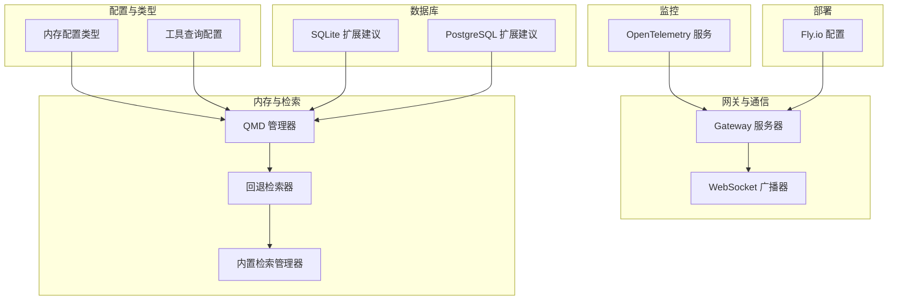
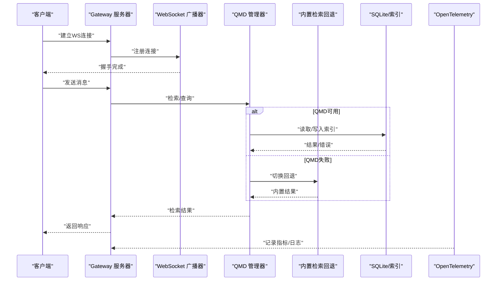
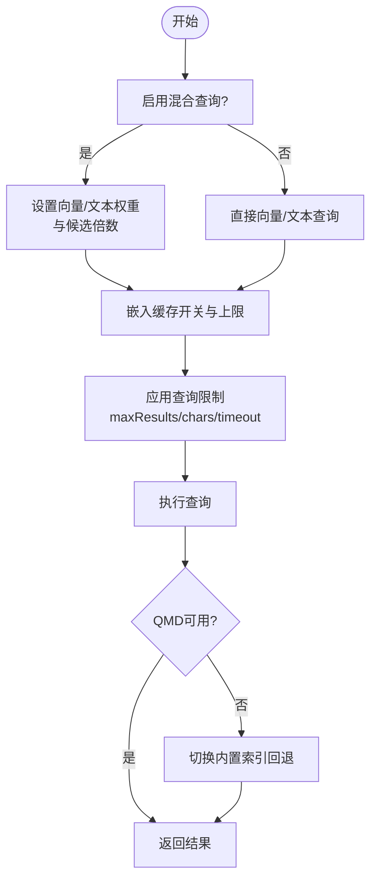
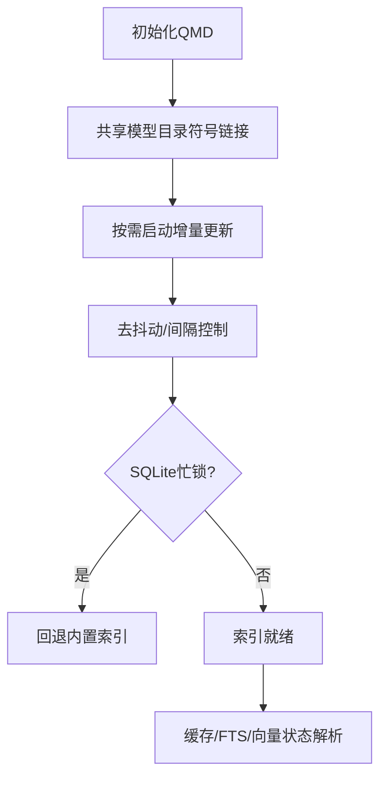
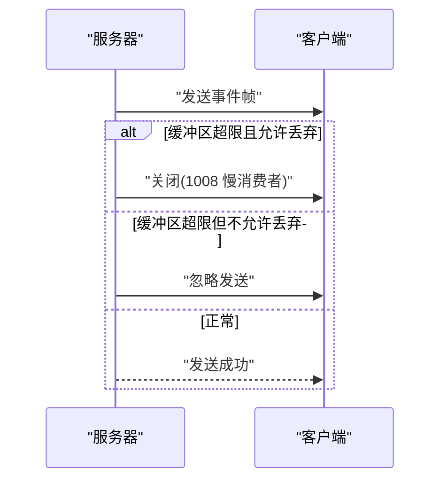
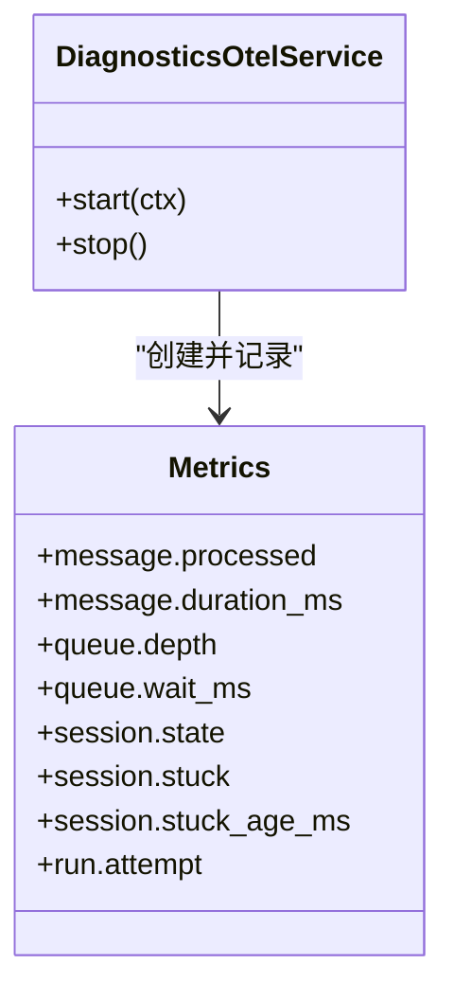
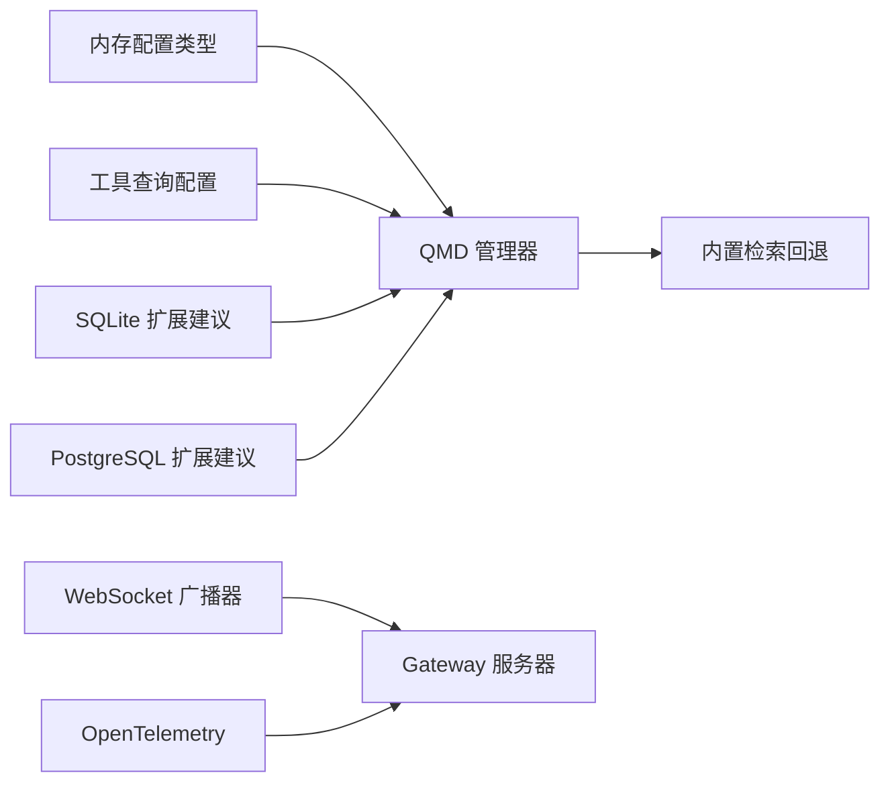

# 性能优化实践

<cite>
**本文引用的文件**
- [scripts/bench-model.ts](file://scripts/bench-model.ts)
- [src/memory/qmd-manager.ts](file://src/memory/qmd-manager.ts)
- [src/memory/backend-config.ts](file://src/memory/backend-config.ts)
- [src/memory/search-manager.ts](file://src/memory/search-manager.ts)
- [src/memory/status-format.ts](file://src/memory/status-format.ts)
- [src/gateway/server-broadcast.ts](file://src/gateway/server-broadcast.ts)
- [src/gateway/server-constants.ts](file://src/gateway/server-constants.ts)
- [src/config/types.memory.ts](file://src/config/types.memory.ts)
- [src/config/types.tools.ts](file://src/config/types.tools.ts)
- [src/gateway/server-methods/usage.ts](file://src/gateway/server-methods/usage.ts)
- [extensions/diagnostics-otel/src/service.ts](file://extensions/diagnostics-otel/src/service.ts)
- [extensions/open-prose/skills/prose/state/sqlite.md](file://extensions/open-prose/skills/prose/state/sqlite.md)
- [extensions/open-prose/skills/prose/state/postgres.md](file://extensions/open-prose/skills/prose/state/postgres.md)
- [docs/zh-CN/install/fly.md](file://docs/zh-CN/install/fly.md)
- [docs/install/fly.md](file://docs/install/fly.md)
- [src/agents/failover-error.ts](file://src/agents/failover-error.ts)
- [src/infra/unhandled-rejections.ts](file://src/infra/unhandled-rejections.ts)
</cite>

## 目录

1. [简介](#简介)
2. [项目结构](#项目结构)
3. [核心组件](#核心组件)
4. [架构总览](#架构总览)
5. [详细组件分析](#详细组件分析)
6. [依赖关系分析](#依赖关系分析)
7. [性能考量](#性能考量)
8. [故障排查指南](#故障排查指南)
9. [结论](#结论)
10. [附录](#附录)

## 简介

本指南面向OpenClaw系统的性能优化实践，聚焦AI代理的模型选择与缓存、内存管理、并发与网络通信、数据库查询与索引、系统监控与基准测试、以及高可用与集群部署。文档基于仓库中的实际代码与配置，提供可操作的策略、流程图与最佳实践，帮助在不同规模与环境下稳定提升系统吞吐与响应质量。

## 项目结构

OpenClaw由多语言模块构成，核心性能相关能力分布于：

- 内存与向量检索：QMD索引、内置索引回退、缓存与去重
- 网关与WebSocket广播：背压与缓冲区限制、事件分发与目标化推送
- 模型与工具配置：查询混合策略、嵌入缓存、超时与节流
- 监控与可观测性：OpenTelemetry指标与日志桥接
- 数据库扩展：SQLite/PostgreSQL扩展建议与索引策略
- 部署与高可用：Fly.io配置示例与私有部署加固

**图表来源**

- [src/gateway/server-broadcast.ts](file://src/gateway/server-broadcast.ts#L34-L120)
- [src/memory/qmd-manager.ts](file://src/memory/qmd-manager.ts#L45-L170)
- [src/memory/search-manager.ts](file://src/memory/search-manager.ts#L67-L113)
- [src/config/types.memory.ts](file://src/config/types.memory.ts#L1-L53)
- [src/config/types.tools.ts](file://src/config/types.tools.ts#L300-L324)
- [extensions/diagnostics-otel/src/service.ts](file://extensions/diagnostics-otel/src/service.ts#L32-L133)
- [extensions/open-prose/skills/prose/state/sqlite.md](file://extensions/open-prose/skills/prose/state/sqlite.md#L515-L546)
- [extensions/open-prose/skills/prose/state/postgres.md](file://extensions/open-prose/skills/prose/state/postgres.md#L809-L846)
- [docs/zh-CN/install/fly.md](file://docs/zh-CN/install/fly.md#L51-L94)

**章节来源**

- [src/gateway/server-broadcast.ts](file://src/gateway/server-broadcast.ts#L1-L121)
- [src/memory/qmd-manager.ts](file://src/memory/qmd-manager.ts#L1-L200)
- [src/memory/search-manager.ts](file://src/memory/search-manager.ts#L67-L113)
- [src/config/types.memory.ts](file://src/config/types.memory.ts#L1-L53)
- [src/config/types.tools.ts](file://src/config/types.tools.ts#L300-L324)
- [extensions/diagnostics-otel/src/service.ts](file://extensions/diagnostics-otel/src/service.ts#L32-L133)
- [extensions/open-prose/skills/prose/state/sqlite.md](file://extensions/open-prose/skills/prose/state/sqlite.md#L515-L546)
- [extensions/open-prose/skills/prose/state/postgres.md](file://extensions/open-prose/skills/prose/state/postgres.md#L809-L846)
- [docs/zh-CN/install/fly.md](file://docs/zh-CN/install/fly.md#L51-L94)

## 核心组件

- QMD内存管理器：负责索引初始化、集合维护、增量更新、嵌入缓存与去重、SQLite忙锁处理与回退策略。
- 内置检索回退：当QMD不可用时自动切换至内置索引，保障可用性。
- WebSocket广播器：按客户端缓冲区与权限范围分发事件，支持“慢消费者”丢弃与断开。
- 模型与工具配置：查询混合策略（BM25+向量）、嵌入缓存上限、超时与节流参数。
- 监控与可观测性：OpenTelemetry指标（消息处理时延、队列深度、会话卡顿等）与日志桥接。
- 数据库扩展：SQLite/PostgreSQL扩展建议，包括自定义列、索引与JSON函数/JSONB操作符。
- 部署与高可用：Fly.io配置示例，含内存与持久化卷、私有部署加固与访问方式。

**章节来源**

- [src/memory/qmd-manager.ts](file://src/memory/qmd-manager.ts#L45-L170)
- [src/memory/search-manager.ts](file://src/memory/search-manager.ts#L67-L113)
- [src/gateway/server-broadcast.ts](file://src/gateway/server-broadcast.ts#L34-L120)
- [src/config/types.tools.ts](file://src/config/types.tools.ts#L300-L324)
- [extensions/diagnostics-otel/src/service.ts](file://extensions/diagnostics-otel/src/service.ts#L166-L206)
- [extensions/open-prose/skills/prose/state/sqlite.md](file://extensions/open-prose/skills/prose/state/sqlite.md#L515-L546)
- [extensions/open-prose/skills/prose/state/postgres.md](file://extensions/open-prose/skills/prose/state/postgres.md#L809-L846)
- [docs/zh-CN/install/fly.md](file://docs/zh-CN/install/fly.md#L51-L94)

## 架构总览

下图展示从网关到内存检索、再到数据库与监控的整体路径，以及回退与监控的关键节点。

**图表来源**

- [src/gateway/server-broadcast.ts](file://src/gateway/server-broadcast.ts#L34-L120)
- [src/memory/qmd-manager.ts](file://src/memory/qmd-manager.ts#L45-L170)
- [src/memory/search-manager.ts](file://src/memory/search-manager.ts#L67-L113)
- [extensions/diagnostics-otel/src/service.ts](file://extensions/diagnostics-otel/src/service.ts#L166-L206)

## 详细组件分析

### AI代理的性能调优与模型选择

- 查询混合策略：支持BM25与向量相似度融合，可调节权重与候选池倍数，平衡召回与相关性。
- 嵌入缓存：可启用SQLite缓存分块嵌入，设置最大条目上限，减少重复计算。
- 超时与节流：统一的查询超时、命令执行超时与更新间隔，避免阻塞与资源耗尽。
- 回退与降级：当QMD异常（如busy/不可用）时自动切换内置索引，保证服务连续性。

**图表来源**

- [src/config/types.tools.ts](file://src/config/types.tools.ts#L300-L324)
- [src/memory/backend-config.ts](file://src/memory/backend-config.ts#L282-L303)
- [src/memory/search-manager.ts](file://src/memory/search-manager.ts#L67-L113)

**章节来源**

- [src/config/types.tools.ts](file://src/config/types.tools.ts#L300-L324)
- [src/memory/backend-config.ts](file://src/memory/backend-config.ts#L282-L303)
- [src/memory/search-manager.ts](file://src/memory/search-manager.ts#L67-L113)

### 缓存机制与内存管理

- QMD索引与模型共享：通过符号链接共享默认模型目录，隔离索引同时复用模型，降低I/O与下载成本。
- 更新节流与去重：更新间隔与去抖动时间可配置，避免频繁重建索引；会话消息去重TTL与上限防止重复注入。
- SQLite忙锁处理：捕获“database is locked”类错误并转化为可回退的busy错误，触发回退逻辑。
- 内存状态可视化：提供向量/FTS/缓存状态解析，便于运维观测与告警。

**图表来源**

- [src/memory/qmd-manager.ts](file://src/memory/qmd-manager.ts#L135-L170)
- [src/memory/qmd-manager.ts](file://src/memory/qmd-manager.ts#L958-L993)
- [src/memory/status-format.ts](file://src/memory/status-format.ts#L1-L45)

**章节来源**

- [src/memory/qmd-manager.ts](file://src/memory/qmd-manager.ts#L135-L170)
- [src/memory/qmd-manager.ts](file://src/memory/qmd-manager.ts#L958-L993)
- [src/memory/status-format.ts](file://src/memory/status-format.ts#L1-L45)

### 并发处理与WebSocket连接管理

- 背压与限流：每连接发送缓冲区阈值限制，超过阈值可丢弃或主动断开“慢消费者”，保障整体稳定性。
- 权限与事件范围：根据连接角色与作用域过滤事件，避免越权与无效广播。
- 目标化推送：支持按连接ID集合定向广播，降低全量广播压力。
- 帧大小与握手：入站帧大小上限与握手超时可配置，防止过大消息与长时间挂起。

**图表来源**

- [src/gateway/server-broadcast.ts](file://src/gateway/server-broadcast.ts#L75-L92)
- [src/gateway/server-constants.ts](file://src/gateway/server-constants.ts#L1-L35)

**章节来源**

- [src/gateway/server-broadcast.ts](file://src/gateway/server-broadcast.ts#L34-L120)
- [src/gateway/server-constants.ts](file://src/gateway/server-constants.ts#L1-L35)

### 系统监控指标与可观测性

- 指标体系：消息处理计数与时延直方图、队列深度与等待时延、会话状态与卡顿时延、运行尝试次数等。
- 日志桥接：将系统日志接入OpenTelemetry，统一采样率与导出协议，便于集中分析。
- 使用统计：聚合延迟、每日用量与模型成本，支持趋势与对比分析。

**图表来源**

- [extensions/diagnostics-otel/src/service.ts](file://extensions/diagnostics-otel/src/service.ts#L166-L206)

**章节来源**

- [extensions/diagnostics-otel/src/service.ts](file://extensions/diagnostics-otel/src/service.ts#L32-L133)
- [extensions/diagnostics-otel/src/service.ts](file://extensions/diagnostics-otel/src/service.ts#L166-L206)
- [src/gateway/server-methods/usage.ts](file://src/gateway/server-methods/usage.ts#L572-L749)

### 数据库查询优化与存储性能

- SQLite扩展建议：添加自定义列、扩展表、索引与JSON函数，适配查询模式。
- PostgreSQL扩展建议：使用JSONB与并发索引创建，支持扩展度量与元数据。
- 索引策略：针对常见查询字段（如状态、创建时间）建立索引，减少全表扫描。
- 存储性能：结合查询混合策略与嵌入缓存，降低数据库压力；必要时采用分区或归档。

**章节来源**

- [extensions/open-prose/skills/prose/state/sqlite.md](file://extensions/open-prose/skills/prose/state/sqlite.md#L515-L546)
- [extensions/open-prose/skills/prose/state/postgres.md](file://extensions/open-prose/skills/prose/state/postgres.md#L809-L846)

### 负载均衡、集群部署与高可用

- Fly.io配置要点：绑定LAN端口、允许未配置启动、健康检查端口一致、分配足够内存、持久化状态目录。
- 私有部署加固：释放公网IP、使用私有IPv6、通过WireGuard或SSH访问，避免公网暴露。
- 高可用：最小运行实例数、自动启停机器，确保服务连续性。

**章节来源**

- [docs/zh-CN/install/fly.md](file://docs/zh-CN/install/fly.md#L51-L94)
- [docs/zh-CN/install/fly.md](file://docs/zh-CN/install/fly.md#L361-L436)
- [docs/install/fly.md](file://docs/install/fly.md#L361-L429)

## 依赖关系分析

- 内存子系统依赖配置解析与类型定义，QMD管理器通过后端配置决定行为；当QMD失败时回退至内置检索。
- 网关层通过广播器控制事件分发与背压；监控服务贯穿消息处理链路。
- 数据库扩展建议与配置策略相互补充，共同支撑检索与存储性能。

**图表来源**

- [src/config/types.memory.ts](file://src/config/types.memory.ts#L1-L53)
- [src/config/types.tools.ts](file://src/config/types.tools.ts#L300-L324)
- [src/memory/qmd-manager.ts](file://src/memory/qmd-manager.ts#L45-L170)
- [src/memory/search-manager.ts](file://src/memory/search-manager.ts#L67-L113)
- [src/gateway/server-broadcast.ts](file://src/gateway/server-broadcast.ts#L34-L120)
- [extensions/diagnostics-otel/src/service.ts](file://extensions/diagnostics-otel/src/service.ts#L166-L206)
- [extensions/open-prose/skills/prose/state/sqlite.md](file://extensions/open-prose/skills/prose/state/sqlite.md#L515-L546)
- [extensions/open-prose/skills/prose/state/postgres.md](file://extensions/open-prose/skills/prose/state/postgres.md#L809-L846)

**章节来源**

- [src/config/types.memory.ts](file://src/config/types.memory.ts#L1-L53)
- [src/config/types.tools.ts](file://src/config/types.tools.ts#L300-L324)
- [src/memory/qmd-manager.ts](file://src/memory/qmd-manager.ts#L45-L170)
- [src/memory/search-manager.ts](file://src/memory/search-manager.ts#L67-L113)
- [src/gateway/server-broadcast.ts](file://src/gateway/server-broadcast.ts#L34-L120)
- [extensions/diagnostics-otel/src/service.ts](file://extensions/diagnostics-otel/src/service.ts#L166-L206)
- [extensions/open-prose/skills/prose/state/sqlite.md](file://extensions/open-prose/skills/prose/state/sqlite.md#L515-L546)
- [extensions/open-prose/skills/prose/state/postgres.md](file://extensions/open-prose/skills/prose/state/postgres.md#L809-L846)

## 性能考量

- 模型与查询
  - 优先使用混合检索并调整权重，平衡召回与速度。
  - 启用嵌入缓存并设置合理上限，减少重复计算。
  - 控制查询超时与候选池大小，避免长尾延迟。
- 内存与索引
  - 合理设置更新间隔与去抖动时间，避免频繁重建。
  - 遇到SQLite忙锁立即回退，保障可用性。
- 并发与网络
  - 严格控制每连接缓冲区阈值，必要时断开慢消费者。
  - 对大流量场景使用目标化广播与事件范围过滤。
- 数据库
  - 针对高频查询字段建立索引，使用JSON/JSONB函数优化半结构化数据查询。
- 监控与基准
  - 建立消息处理时延、队列深度、会话卡顿等关键指标。
  - 使用脚本进行模型基准测试，对比不同模型的中位/最小/最大耗时。

**章节来源**

- [src/config/types.tools.ts](file://src/config/types.tools.ts#L300-L324)
- [src/memory/qmd-manager.ts](file://src/memory/qmd-manager.ts#L958-L993)
- [src/gateway/server-broadcast.ts](file://src/gateway/server-broadcast.ts#L75-L92)
- [extensions/open-prose/skills/prose/state/sqlite.md](file://extensions/open-prose/skills/prose/state/sqlite.md#L515-L546)
- [extensions/open-prose/skills/prose/state/postgres.md](file://extensions/open-prose/skills/prose/state/postgres.md#L809-L846)
- [extensions/diagnostics-otel/src/service.ts](file://extensions/diagnostics-otel/src/service.ts#L166-L206)
- [scripts/bench-model.ts](file://scripts/bench-model.ts#L1-L147)

## 故障排查指南

- 错误分类与降级
  - 将HTTP状态码、网络错误代码映射为超时/鉴权/配额/格式等原因，便于快速定位。
  - 对Abort/瞬时网络错误进行容忍，避免不必要的崩溃。
- 回退与恢复
  - QMD忙锁/不可用时自动切换内置索引，观察回退次数与错误信息。
  - 检查回退缓存是否被驱逐，确保下次请求可重新初始化。
- 连接与广播
  - 若出现慢消费者断开，检查客户端处理能力与缓冲区阈值设置。
  - 确认事件范围与权限，避免无效广播导致拥塞。
- 监控与日志
  - 关注消息处理时延分布、队列等待与会话卡顿指标，定位瓶颈。
  - 结合使用统计（延迟聚合、每日用量、模型成本）进行趋势分析。

**章节来源**

- [src/agents/failover-error.ts](file://src/agents/failover-error.ts#L167-L234)
- [src/infra/unhandled-rejections.ts](file://src/infra/unhandled-rejections.ts#L53-L95)
- [src/memory/search-manager.ts](file://src/memory/search-manager.ts#L81-L113)
- [src/gateway/server-broadcast.ts](file://src/gateway/server-broadcast.ts#L75-L92)
- [extensions/diagnostics-otel/src/service.ts](file://extensions/diagnostics-otel/src/service.ts#L166-L206)
- [src/gateway/server-methods/usage.ts](file://src/gateway/server-methods/usage.ts#L572-L749)

## 结论

通过合理的模型与查询策略、缓存与索引优化、并发与网络背压控制、数据库索引与扩展、以及完善的监控与回退机制，OpenClaw可在不同规模与环境下保持稳定与高性能。结合Fly.io等平台的高可用配置，可进一步提升部署可靠性与可维护性。

## 附录

- 基准测试脚本：用于对比不同模型在相同提示下的耗时分布，辅助模型选型与容量规划。
- 部署参考：Fly.io配置模板与私有部署加固步骤，确保生产环境的安全与稳定。

**章节来源**

- [scripts/bench-model.ts](file://scripts/bench-model.ts#L1-L147)
- [docs/zh-CN/install/fly.md](file://docs/zh-CN/install/fly.md#L51-L94)
- [docs/zh-CN/install/fly.md](file://docs/zh-CN/install/fly.md#L361-L436)
- [docs/install/fly.md](file://docs/install/fly.md#L361-L429)
