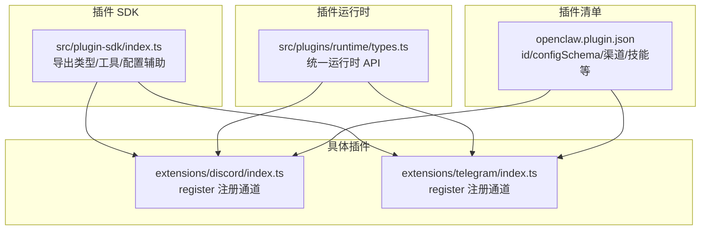
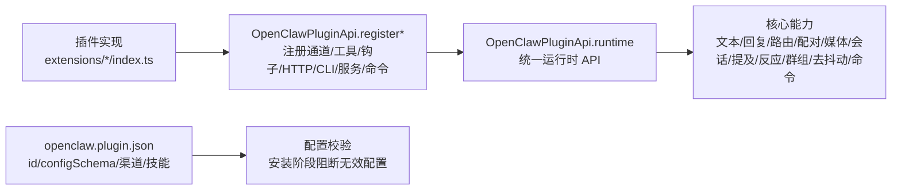
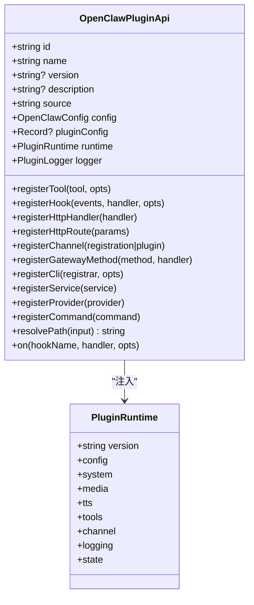
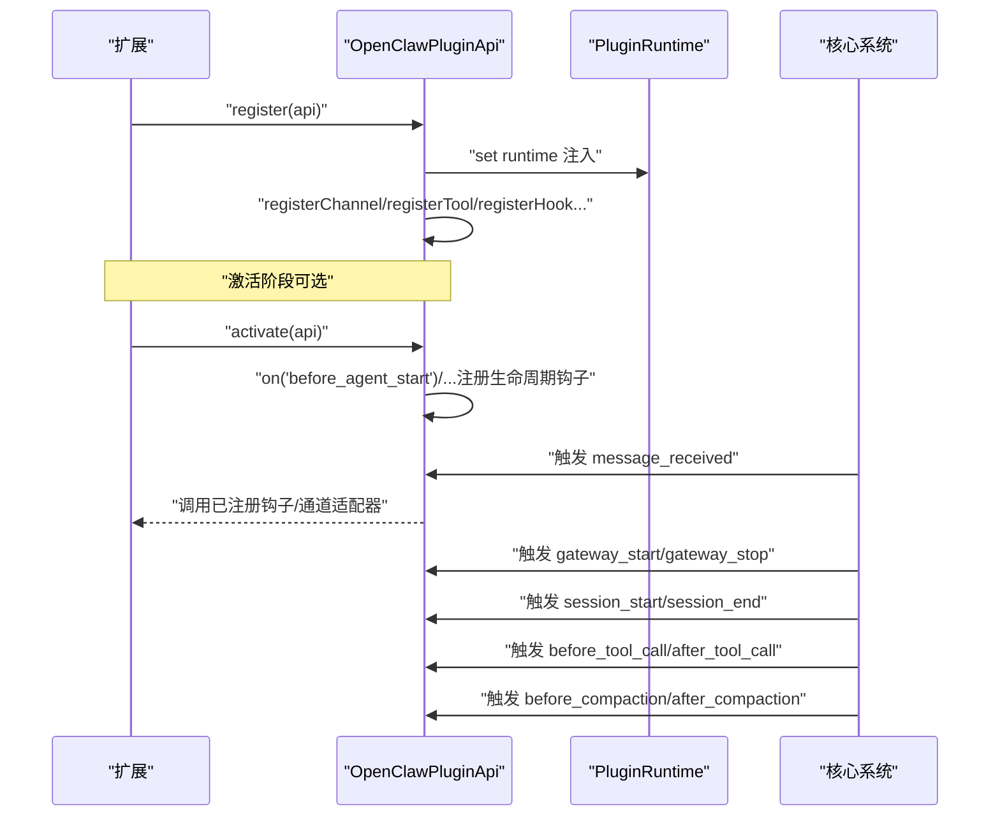
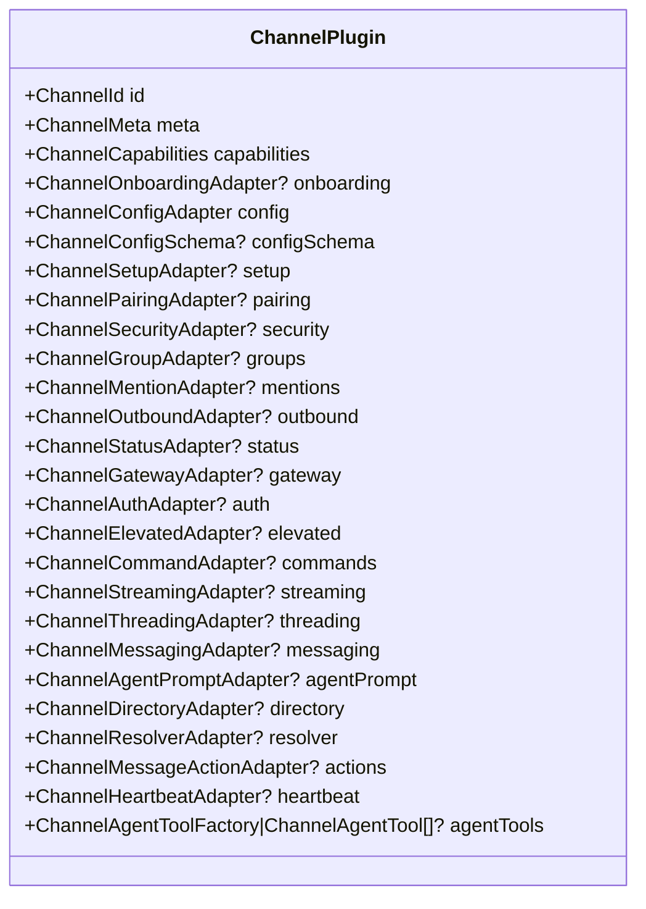
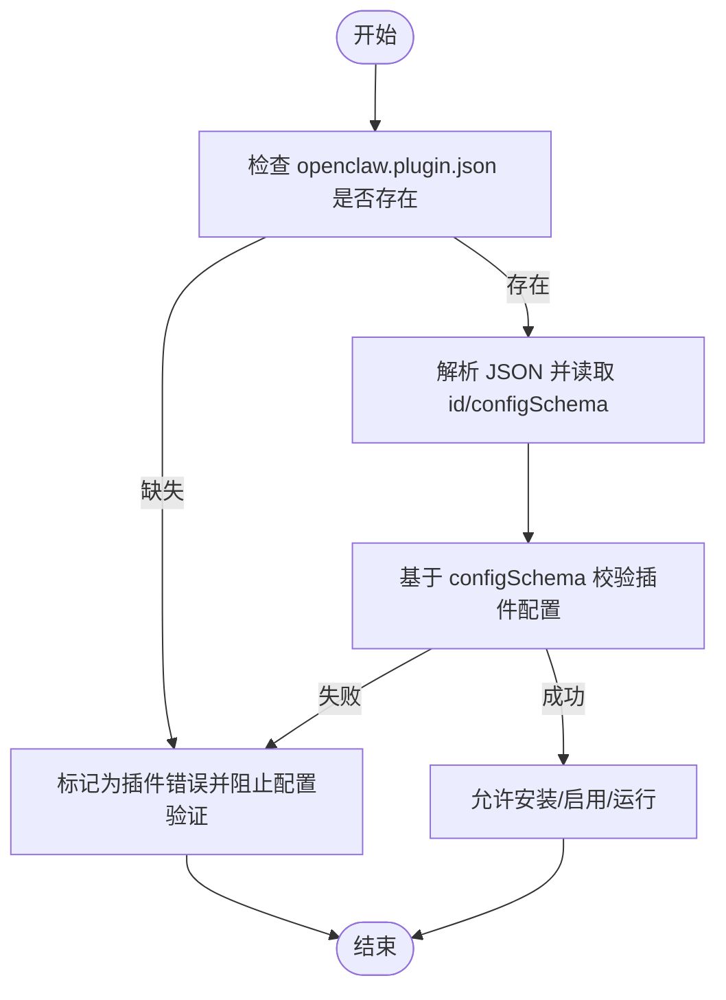
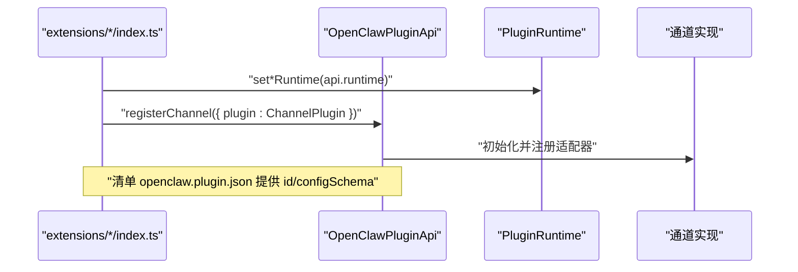
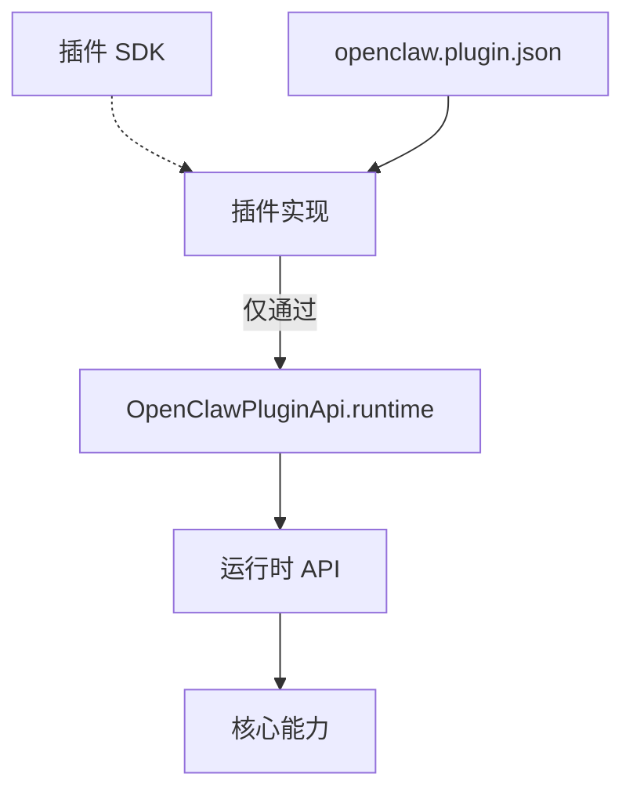

# 扩展开发实践

<cite>
**本文引用的文件**
- [src/plugin-sdk/index.ts](file://src/plugin-sdk/index.ts)
- [docs/refactor/plugin-sdk.md](file://docs/refactor/plugin-sdk.md)
- [docs/plugins/manifest.md](file://docs/plugins/manifest.md)
- [src/plugins/types.ts](file://src/plugins/types.ts)
- [src/channels/plugins/types.plugin.ts](file://src/channels/plugins/types.plugin.ts)
- [src/plugins/runtime/types.ts](file://src/plugins/runtime/types.ts)
- [src/plugins/config-schema.ts](file://src/plugins/config-schema.ts)
- [src/channels/plugins/config-schema.ts](file://src/channels/plugins/config-schema.ts)
- [docs/cli/plugins.md](file://docs/cli/plugins.md)
- [extensions/discord/index.ts](file://extensions/discord/index.ts)
- [extensions/discord/openclaw.plugin.json](file://extensions/discord/openclaw.plugin.json)
- [extensions/telegram/index.ts](file://extensions/telegram/index.ts)
- [extensions/telegram/openclaw.plugin.json](file://extensions/telegram/openclaw.plugin.json)
</cite>

## 目录

1. [引言](#引言)
2. [项目结构](#项目结构)
3. [核心组件](#核心组件)
4. [架构总览](#架构总览)
5. [组件详解](#组件详解)
6. [依赖关系分析](#依赖关系分析)
7. [性能考量](#性能考量)
8. [故障排查指南](#故障排查指南)
9. [结论](#结论)
10. [附录](#附录)

## 引言

本指南面向在 OpenClaw 上开发扩展（插件）的工程师，系统阐述插件架构设计原则、SDK 使用规范、开发与发布流程、生命周期与事件钩子、API 接口设计、安全审查与版本兼容、调试与测试策略、性能评估方法，以及配置管理、依赖处理与错误处理的最佳实践。目标是帮助你以最小耦合、可维护、可演进的方式构建高质量扩展。

## 项目结构

OpenClaw 的扩展体系由“插件 SDK + 插件运行时 + 插件清单 + 具体插件实现”四部分组成：

- 插件 SDK：提供类型、工具函数与配置辅助，确保扩展与核心解耦。
- 插件运行时：通过 OpenClawPluginApi.runtime 暴露核心能力，避免扩展直接导入 src/\*\*。
- 插件清单（openclaw.plugin.json）：声明插件元数据与配置 JSON Schema，用于严格验证。
- 具体插件：实现注册逻辑、通道适配器、服务与命令等。

图表来源

- [src/plugin-sdk/index.ts](file://src/plugin-sdk/index.ts#L1-L392)
- [src/plugins/runtime/types.ts](file://src/plugins/runtime/types.ts#L178-L362)
- [extensions/discord/index.ts](file://extensions/discord/index.ts#L1-L18)
- [extensions/telegram/index.ts](file://extensions/telegram/index.ts#L1-L18)
- [extensions/discord/openclaw.plugin.json](file://extensions/discord/openclaw.plugin.json#L1-L10)
- [extensions/telegram/openclaw.plugin.json](file://extensions/telegram/openclaw.plugin.json#L1-L10)

章节来源

- [src/plugin-sdk/index.ts](file://src/plugin-sdk/index.ts#L1-L392)
- [docs/refactor/plugin-sdk.md](file://docs/refactor/plugin-sdk.md#L1-L215)
- [docs/plugins/manifest.md](file://docs/plugins/manifest.md#L1-L72)
- [extensions/discord/index.ts](file://extensions/discord/index.ts#L1-L18)
- [extensions/telegram/index.ts](file://extensions/telegram/index.ts#L1-L18)

## 核心组件

- 插件 SDK 导出
  - 类型与适配器：通道元数据、能力、消息适配器、目录、解析器、心跳、安全、提要等。
  - 配置与工具：构建通道配置 Schema、账户启用/删除、名称迁移、配对提示、诊断事件等。
  - 通道别名导出：Discord、iMessage、Slack、Telegram、Signal、WhatsApp、LINE 等。
  - 媒体与工具：远程媒体加载、MIME 解析、图片元数据与缩放、打字回调、回复前缀等。
- 插件运行时（OpenClawPluginApi.runtime）
  - 配置读写、系统命令执行、日志、状态目录解析。
  - 文本分块、回复派发、路由、配对、媒体下载/保存、会话与活动记录、提及与反应、群组策略、去抖动、命令授权。
  - 各通道能力：Discord、Slack、Telegram、Signal、iMessage、WhatsApp、LINE。
- 插件定义与 API
  - OpenClawPluginDefinition：id/name/description/version/kind/configSchema/register/activate。
  - OpenClawPluginApi：注册工具、钩子、HTTP、通道、网关方法、CLI、服务、提供商、命令；路径解析；生命周期钩子 on。
  - 生命周期钩子：before*agent_start、agent_end、before_compaction、after_compaction、message*_、tool\__、session*\*、gateway*\*。
- 清单与配置
  - openclaw.plugin.json：id、configSchema 必填；channels/providers/skills 可选；UI 提示字段；版本信息。
  - 空配置 Schema 工具：emptyPluginConfigSchema。
  - 通道配置 Schema 构建：buildChannelConfigSchema。

章节来源

- [src/plugin-sdk/index.ts](file://src/plugin-sdk/index.ts#L1-L392)
- [src/plugins/runtime/types.ts](file://src/plugins/runtime/types.ts#L178-L362)
- [src/plugins/types.ts](file://src/plugins/types.ts#L244-L283)
- [src/plugins/config-schema.ts](file://src/plugins/config-schema.ts#L13-L33)
- [src/channels/plugins/config-schema.ts](file://src/channels/plugins/config-schema.ts#L4-L11)
- [docs/plugins/manifest.md](file://docs/plugins/manifest.md#L18-L72)

## 架构总览

OpenClaw 插件采用“SDK + 运行时”的双层架构，强调稳定编译期接口与受控执行面：

- SDK 层：纯类型与工具，无运行时状态，保证对外 API 的稳定性与可发布性。
- 运行时层：通过 api.runtime 暴露核心行为，插件仅能经由该接口访问核心功能，避免直接导入 src/\*\*。
- 插件清单：在不执行代码的前提下完成配置校验，确保安装即稳定。

图表来源

- [src/plugins/types.ts](file://src/plugins/types.ts#L244-L283)
- [src/plugins/runtime/types.ts](file://src/plugins/runtime/types.ts#L178-L362)
- [docs/plugins/manifest.md](file://docs/plugins/manifest.md#L18-L72)

章节来源

- [docs/refactor/plugin-sdk.md](file://docs/refactor/plugin-sdk.md#L19-L152)
- [src/plugin-sdk/index.ts](file://src/plugin-sdk/index.ts#L1-L392)
- [src/plugins/types.ts](file://src/plugins/types.ts#L244-L283)

## 组件详解

### 插件 SDK 与运行时类图

图表来源

- [src/plugins/types.ts](file://src/plugins/types.ts#L244-L283)
- [src/plugins/runtime/types.ts](file://src/plugins/runtime/types.ts#L178-L362)

章节来源

- [src/plugins/types.ts](file://src/plugins/types.ts#L244-L283)
- [src/plugins/runtime/types.ts](file://src/plugins/runtime/types.ts#L178-L362)

### 插件生命周期与事件钩子序列图

图表来源

- [src/plugins/types.ts](file://src/plugins/types.ts#L298-L529)
- [src/plugins/types.ts](file://src/plugins/types.ts#L244-L283)

章节来源

- [src/plugins/types.ts](file://src/plugins/types.ts#L298-L529)

### 通道插件接口与适配器

通道插件通过 ChannelPlugin 聚合多种适配器，形成“能力-适配器-实现”的清晰边界：

- 配置与 Schema：config/configSchema/setup/pairing/security/groups/mentions/outbound/status/gateway/auth/elevated/commands/streaming/threading/messaging/agentPrompt/directory/resolver/actions/heartbeat。
- 默认与重载：defaults.reload。
- UI 提示：ChannelConfigUiHint。

图表来源

- [src/channels/plugins/types.plugin.ts](file://src/channels/plugins/types.plugin.ts#L48-L84)

章节来源

- [src/channels/plugins/types.plugin.ts](file://src/channels/plugins/types.plugin.ts#L1-L85)

### 插件清单与配置 Schema 流程图

图表来源

- [docs/plugins/manifest.md](file://docs/plugins/manifest.md#L11-L72)
- [src/plugins/config-schema.ts](file://src/plugins/config-schema.ts#L13-L33)

章节来源

- [docs/plugins/manifest.md](file://docs/plugins/manifest.md#L11-L72)
- [src/plugins/config-schema.ts](file://src/plugins/config-schema.ts#L13-L33)

### 典型插件实现（Discord/Telegram）

- 插件入口负责注册通道与设置运行时，并声明空配置 Schema。
- 清单文件声明插件 id、所注册的通道与空配置 Schema。

图表来源

- [extensions/discord/index.ts](file://extensions/discord/index.ts#L1-L18)
- [extensions/discord/openclaw.plugin.json](file://extensions/discord/openclaw.plugin.json#L1-L10)
- [extensions/telegram/index.ts](file://extensions/telegram/index.ts#L1-L18)
- [extensions/telegram/openclaw.plugin.json](file://extensions/telegram/openclaw.plugin.json#L1-L10)

章节来源

- [extensions/discord/index.ts](file://extensions/discord/index.ts#L1-L18)
- [extensions/discord/openclaw.plugin.json](file://extensions/discord/openclaw.plugin.json#L1-L10)
- [extensions/telegram/index.ts](file://extensions/telegram/index.ts#L1-L18)
- [extensions/telegram/openclaw.plugin.json](file://extensions/telegram/openclaw.plugin.json#L1-L10)

## 依赖关系分析

- 插件到核心的依赖方向
  - 插件仅能通过 OpenClawPluginApi.runtime 访问核心能力，禁止直接从 src/\*\* 导入。
  - SDK 作为稳定编译期契约，插件与核心通过它解耦。
- 版本与兼容
  - SDK 语义化版本，运行时随核心发布；插件声明所需运行时范围。
  - CI/Lint 强制禁止 extensions/** 直接导入 src/**。
- 清单与配置
  - 安装阶段进行 JSON Schema 校验，未知渠道/插件 id 视为错误。
  - 禁用插件保留配置并告警。

图表来源

- [docs/refactor/plugin-sdk.md](file://docs/refactor/plugin-sdk.md#L11-L186)
- [docs/plugins/manifest.md](file://docs/plugins/manifest.md#L53-L72)
- [src/plugins/runtime/types.ts](file://src/plugins/runtime/types.ts#L178-L362)

章节来源

- [docs/refactor/plugin-sdk.md](file://docs/refactor/plugin-sdk.md#L188-L215)
- [docs/plugins/manifest.md](file://docs/plugins/manifest.md#L53-L72)

## 性能考量

- 去抖动与批处理：利用 inboundDebounce 降低重复消息处理开销，合理设置去抖时间。
- 文本分块与表格渲染：按通道与账号解析文本块限制，必要时转换 Markdown 表格。
- 媒体处理：远程媒体下载与本地保存需控制大小与格式，避免内存峰值。
- 日志与诊断：仅在需要时开启详细日志，减少 I/O 压力。
- 通道适配器：复用现有适配器与工具函数，避免重复实现。

## 故障排查指南

- 清单与配置
  - 缺失或非法 openclaw.plugin.json 或 configSchema 将导致安装/验证失败。
  - 未知渠道/插件 id 会被视为错误；禁用插件保留配置并告警。
- 运行时错误
  - 通过 api.runtime.logging.getChildLogger 获取子日志器，定位问题模块。
  - 使用诊断事件与日志级别区分严重程度。
- CLI 管理
  - 使用 plugins doctor 检查插件健康状况；list/info/enable/disable/uninstall/update 完成全生命周期管理。
- 常见问题
  - 直接导入 src/\*\*：违反 SDK+运行时约束，需迁移到 api.runtime。
  - 未声明 channels/providers/skills：导致发现阶段报错。
  - native 依赖：遵循清单中的构建说明与包管理器要求。

章节来源

- [docs/plugins/manifest.md](file://docs/plugins/manifest.md#L53-L72)
- [docs/cli/plugins.md](file://docs/cli/plugins.md#L35-L82)
- [src/plugins/runtime/types.ts](file://src/plugins/runtime/types.ts#L352-L358)

## 结论

通过 SDK + 运行时的双层架构，OpenClaw 为扩展提供了稳定、可演进且安全的开发模型。遵循本文的最佳实践，你可以以最小耦合实现高质量插件，确保配置即校验、运行即可控、升级即兼容。

## 附录

### 开发流程（建议）

- 设计阶段：明确插件职责、渠道/提供商/技能边界，选择合适适配器。
- 实现阶段：使用 SDK 类型与工具，编写 openclaw.plugin.json 与配置 Schema，实现 register/activate。
- 验证阶段：CI 中运行单个插件端到端样例，Golden 测试对比行为差异。
- 发布阶段：遵循 SDK 语义化版本，声明运行时版本范围，使用 CLI 管理安装/更新/卸载。

### 安全审查清单

- 不直接导入 src/\*\*，全部通过 api.runtime。
- 清单与 Schema 严格，禁止额外属性。
- 仅暴露必要通道/提供商/技能，最小权限原则。
- 处理敏感配置字段（如密钥），避免泄露。
- 对外 HTTP/CLI/服务接口进行鉴权与限流。

### 版本兼容与发布

- SDK：语义化版本，变更需文档化。
- 运行时：随核心发布，插件声明所需范围。
- CI：强制 lint 规则与兼容性检查。

### 调试与测试策略

- 单元测试：适配器级测试，覆盖运行时方法。
- Golden 测试：确保路由、配对、白名单、提及门禁等行为一致。
- 端到端：CI 中安装并运行单个插件样本，冒烟测试通过。
