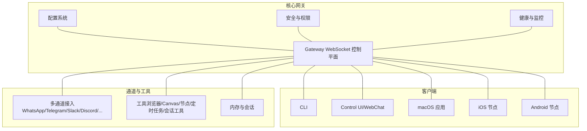
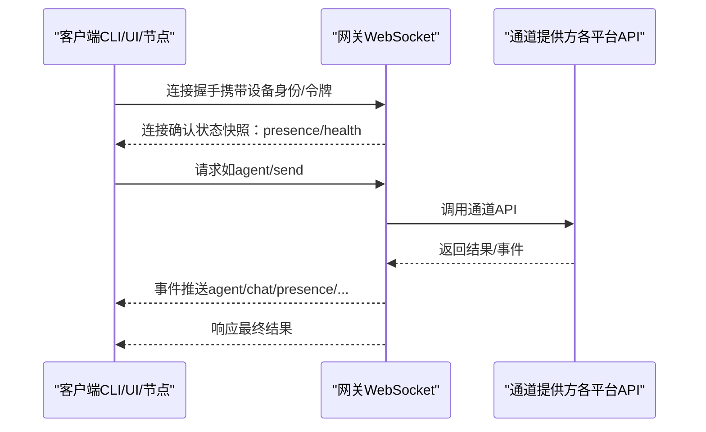
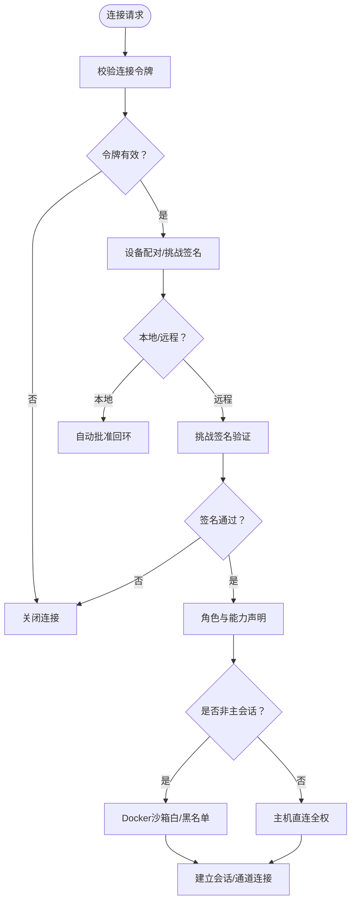
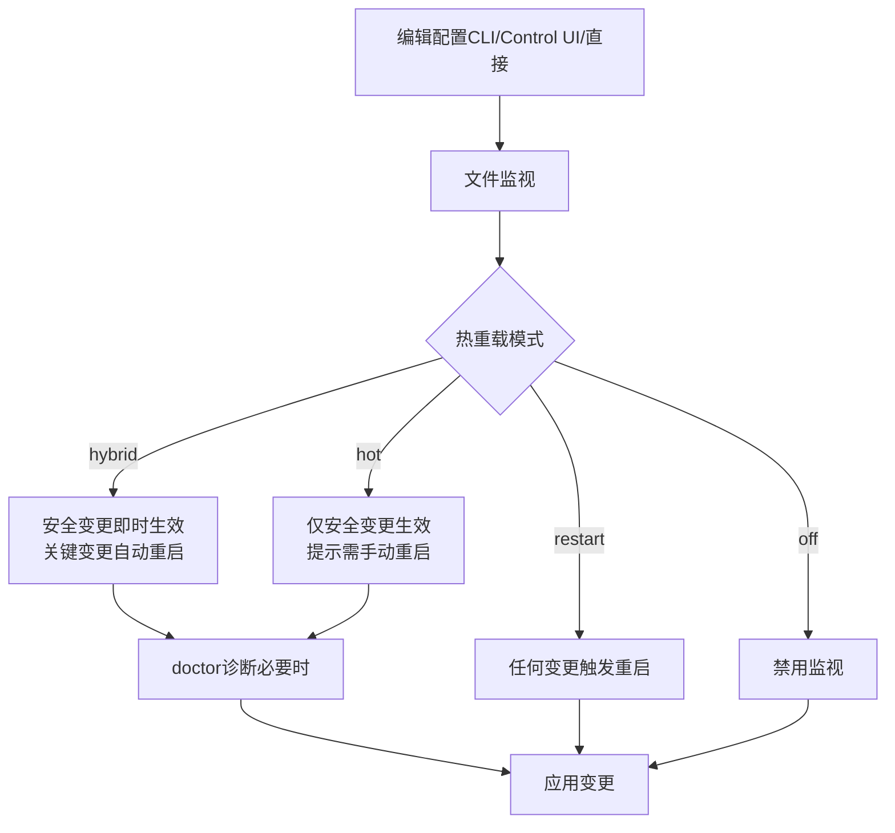
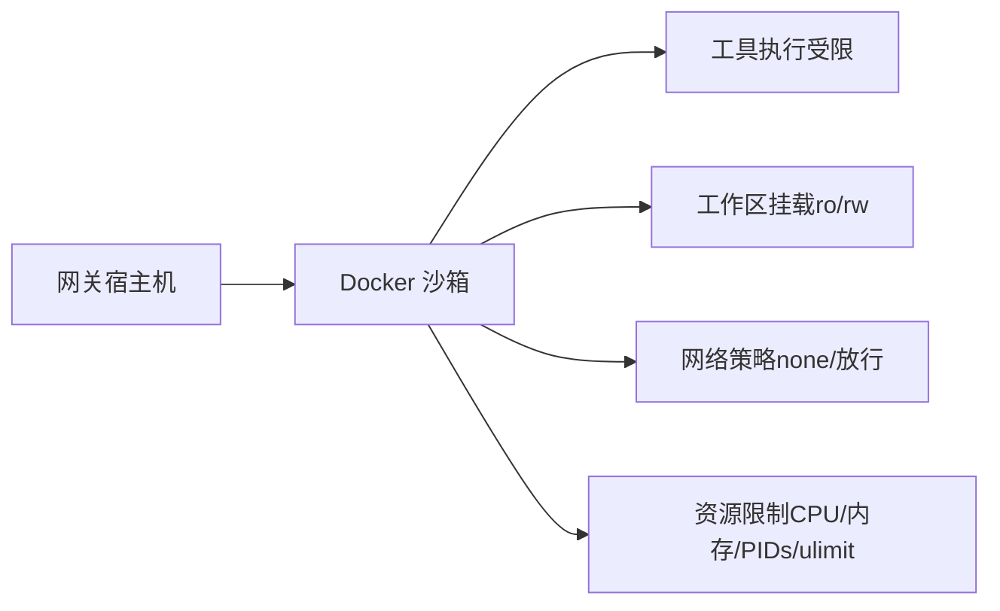
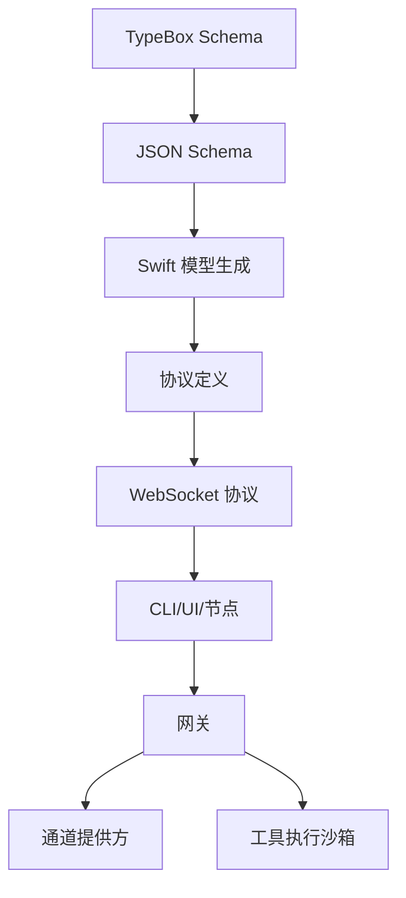

# 最佳实践

<cite>
**本文档引用的文件**
- [README.md](file://README.md)
- [SECURITY.md](file://SECURITY.md)
- [CONTRIBUTING.md](file://CONTRIBUTING.md)
- [docs/concepts/architecture.md](file://docs/concepts/architecture.md)
- [docs/gateway/configuration.md](file://docs/gateway/configuration.md)
- [docs/install/docker.md](file://docs/install/docker.md)
- [docs/security/README.md](file://docs/security/README.md)
- [docs/refactor/chat-ui-refactor-design.md](file://docs/refactor/chat-ui-refactor-design.md)
</cite>

## 目录

1. [简介](#简介)
2. [项目结构](#项目结构)
3. [核心组件](#核心组件)
4. [架构总览](#架构总览)
5. [详细组件分析](#详细组件分析)
6. [依赖关系分析](#依赖关系分析)
7. [性能考虑](#性能考虑)
8. [故障排查指南](#故障排查指南)
9. [结论](#结论)
10. [附录](#附录)

## 简介

本指南面向OpenClaw的使用者、维护者与扩展开发者，系统化梳理安全最佳实践、性能优化策略、扩展开发设计原则与运维最佳实践。内容基于仓库中的官方文档与实现，覆盖安全模型与权限管理、数据保护与隐私、性能与资源使用、系统监控、扩展开发与架构模式、以及配置管理与故障预防等主题。

## 项目结构

OpenClaw是一个多语言、多平台的个人AI助手系统，核心由“网关（Gateway）+ 通道（Channels）+ 工具（Tools）+ 会话（Sessions）+ 客户端（CLI/Control UI/WebChat/桌面应用/移动端节点）”构成。项目采用模块化组织，文档与实现分离，便于维护与扩展。

图示来源

- [docs/concepts/architecture.md](file://docs/concepts/architecture.md#L12-L55)
- [docs/gateway/configuration.md](file://docs/gateway/configuration.md#L12-L35)

章节来源

- [README.md](file://README.md#L107-L120)
- [docs/concepts/architecture.md](file://docs/concepts/architecture.md#L12-L55)

## 核心组件

- 网关（Gateway）：单点控制平面，负责会话、通道、工具与事件的统一调度，提供WebSocket协议与类型化API。
- 客户端：CLI、Control UI、WebChat、macOS应用、iOS/Android节点，均通过WebSocket连接网关。
- 通道（Channels）：支持多平台IM与企业协作平台，具备DM策略与群组路由能力。
- 工具（Tools）：浏览器控制、Canvas可视化、节点设备能力、定时任务、会话工具等。
- 配置（Configuration）：JSON5配置，严格校验，支持热重载与RPC更新。
- 安全（Security）：默认主会话全权访问，非主会话沙箱隔离，令牌认证与设备配对。

章节来源

- [docs/concepts/architecture.md](file://docs/concepts/architecture.md#L24-L55)
- [docs/gateway/configuration.md](file://docs/gateway/configuration.md#L12-L35)
- [README.md](file://README.md#L327-L334)

## 架构总览

OpenClaw采用“单网关控制平面 + 多客户端/节点”的架构。所有消息表面（通道）由网关统一维护，客户端通过WebSocket进行请求/响应与事件订阅。协议采用JSON Schema校验，支持令牌认证与设备配对，确保本地信任与远程安全访问。

图示来源

- [docs/concepts/architecture.md](file://docs/concepts/architecture.md#L56-L76)

章节来源

- [docs/concepts/architecture.md](file://docs/concepts/architecture.md#L77-L104)

## 详细组件分析

### 安全模型与权限管理

- 默认策略：主会话（仅你本人）拥有全权访问；非主会话（群组/频道）默认运行于Docker沙箱，工具白名单/黑名单控制。
- 设备配对：首次连接需配对，本地回环可自动批准，远程需签名挑战；网关认证（gateway.auth.\*）对所有连接生效。
- 令牌与鉴权：支持OPENCLAW_GATEWAY_TOKEN或启动参数token；请求需幂等键去重。
- Docker安全：官方镜像以非root用户运行，建议只读文件系统与能力降级；容器网络默认none，按需放行。
- 运行时要求：Node.js 22.12.0+，修复了async_hooks DoS与权限模型绕过等漏洞。

图示来源

- [docs/concepts/architecture.md](file://docs/concepts/architecture.md#L90-L104)
- [docs/install/docker.md](file://docs/install/docker.md#L570-L586)
- [SECURITY.md](file://SECURITY.md#L73-L88)

章节来源

- [README.md](file://README.md#L327-L334)
- [docs/concepts/architecture.md](file://docs/concepts/architecture.md#L90-L104)
- [docs/install/docker.md](file://docs/install/docker.md#L570-L586)
- [SECURITY.md](file://SECURITY.md#L58-L88)

### 配置与热重载

- 配置来源：~/.openclaw/openclaw.json（JSON5），支持环境变量与$include分片。
- 严格校验：未知键/类型错误/非法值将阻止启动，可通过doctor诊断与修复。
- 热重载：大部分设置即时生效；网关服务器与基础设施变更需重启。
- RPC更新：config.apply（全量替换）与config.patch（部分合并），支持baseHash校验与重启延迟。

图示来源

- [docs/gateway/configuration.md](file://docs/gateway/configuration.md#L330-L369)

章节来源

- [docs/gateway/configuration.md](file://docs/gateway/configuration.md#L12-L35)
- [docs/gateway/configuration.md](file://docs/gateway/configuration.md#L330-L369)

### Docker与沙箱

- 容器化网关：一键脚本完成构建、引导、启动；支持额外挂载与持久化卷。
- 代理沙箱：非主会话在Docker容器内执行工具，支持按agent/session/shared隔离，可配置网络、资源限制、seccomp/AppArmor等。
- 默认策略：默认允许exec/process/read/write/edit/sessions\_\*，默认拒绝browser/canvas/nodes/cron等主机能力。

图示来源

- [docs/install/docker.md](file://docs/install/docker.md#L328-L450)

章节来源

- [docs/install/docker.md](file://docs/install/docker.md#L328-L450)

### 通道与群组路由

- DM策略：pairing/allowlist/open/disabled；群组策略支持提及模式与自聊模式。
- 多代理路由：按通道/账号/群组将消息路由至不同代理与工作区，实现强隔离。
- 心跳与自动化：心跳周期、钩子（hooks）与定时任务（cron）可配置。

章节来源

- [docs/gateway/configuration.md](file://docs/gateway/configuration.md#L134-L176)
- [docs/gateway/configuration.md](file://docs/gateway/configuration.md#L284-L304)
- [docs/gateway/configuration.md](file://docs/gateway/configuration.md#L221-L239)

### WebChat与远程访问

- WebChat通过网关WebSocket获取历史与发送消息；远程通过Tailscale或SSH隧道访问。
- Tailscale Serve/Funnel支持，可强制密码认证或仅局域网访问；SSH隧道需正确转发端口。

章节来源

- [docs/concepts/architecture.md](file://docs/concepts/architecture.md#L50-L55)
- [README.md](file://README.md#L208-L234)

### Chat UI重构设计（扩展开发参考）

- 流式Markdown实时渲染：typewriter指令改为Markdown渲染，避免纯文本闪烁。
- 工具调用合并卡片：同批tool calls合并为一张卡片，减少信息噪音。
- 命令执行独立卡片：每个bash命令独立卡片，便于追踪与复核。
- PTY终端独立实时卡片：xterm.js嵌入，支持增量写入与实时滚动。

章节来源

- [docs/refactor/chat-ui-refactor-design.md](file://docs/refactor/chat-ui-refactor-design.md#L1-L120)
- [docs/refactor/chat-ui-refactor-design.md](file://docs/refactor/chat-ui-refactor-design.md#L198-L325)

## 依赖关系分析

- 协议与类型：TypeBox Schema生成JSON Schema，Swift模型生成，确保跨语言一致性。
- 客户端与网关：所有客户端共享同一WebSocket协议，事件不重放，需在断线后刷新。
- 通道与工具：通道提供方API由网关统一接入；工具执行受沙箱策略约束。

图示来源

- [docs/concepts/architecture.md](file://docs/concepts/architecture.md#L105-L110)

章节来源

- [docs/concepts/architecture.md](file://docs/concepts/architecture.md#L105-L110)

## 性能考虑

- 流式渲染优化：UI层对Markdown流式渲染进行优化，避免纯文本闪烁，提升阅读体验。
- 资源限制与隔离：Docker沙箱限制CPU/内存/PIDs/ulimits，降低资源滥用风险。
- 热重载与最小停机：大部分配置变更即时生效，关键变更自动重启，缩短维护窗口。
- 运行时版本：使用Node.js 22.12.0+，修复关键安全漏洞，提升稳定性与安全性。

章节来源

- [docs/refactor/chat-ui-refactor-design.md](file://docs/refactor/chat-ui-refactor-design.md#L112-L116)
- [docs/install/docker.md](file://docs/install/docker.md#L444-L449)
- [SECURITY.md](file://SECURITY.md#L60-L72)

## 故障排查指南

- 安全与信任：遵循安全策略，私密报告漏洞；使用doctor检查配置与运行状态。
- 配置问题：严格校验失败时，doctor给出修复建议；必要时使用--fix自动修复。
- Docker权限：镜像以node用户运行，注意宿主机目录属主；需要系统包时在构建阶段加入。
- 远程访问：Tailscale Serve/Funnel需正确配置认证与端口；SSH隧道需本地转发127.0.0.1:18789。
- 通道与工具：检查通道凭据与策略；沙箱容器缺失时按脚本构建镜像。

章节来源

- [SECURITY.md](file://SECURITY.md#L48-L100)
- [docs/gateway/configuration.md](file://docs/gateway/configuration.md#L67-L73)
- [docs/install/docker.md](file://docs/install/docker.md#L227-L240)
- [README.md](file://README.md#L208-L234)

## 结论

OpenClaw通过严格的协议与配置体系、完善的沙箱与权限模型、以及灵活的Docker部署与远程访问能力，提供了安全、可扩展且易于运维的个人AI助手平台。遵循本文档的安全最佳实践、性能优化建议与运维指南，可在保障安全的前提下最大化系统可用性与扩展性。

## 附录

### 安全与合规要点

- 令牌与认证：启用OPENCLAW_GATEWAY_TOKEN或启动参数，避免公网暴露。
- 设备配对：首次连接严格挑战签名，本地回环可自动批准。
- 数据最小化：仅在必要时收集与存储日志与会话；使用只读文件系统与能力降级。
- 供应链安全：使用官方镜像与受控依赖，定期扫描与升级。

章节来源

- [docs/concepts/architecture.md](file://docs/concepts/architecture.md#L84-L89)
- [docs/security/README.md](file://docs/security/README.md#L1-L18)
- [SECURITY.md](file://SECURITY.md#L54-L57)

### 扩展开发设计原则

- 协议一致性：遵循WebSocket协议与Schema定义，确保跨语言兼容。
- 权限最小化：默认拒绝主机能力，按需在沙箱中开放。
- 可观测性：提供健康检查、心跳与事件流，便于监控与排障。
- 可维护性：配置分片与热重载，减少停机时间；清晰的日志与错误码。

章节来源

- [docs/concepts/architecture.md](file://docs/concepts/architecture.md#L77-L104)
- [docs/gateway/configuration.md](file://docs/gateway/configuration.md#L330-L369)
- [docs/refactor/chat-ui-refactor-design.md](file://docs/refactor/chat-ui-refactor-design.md#L340-L366)
